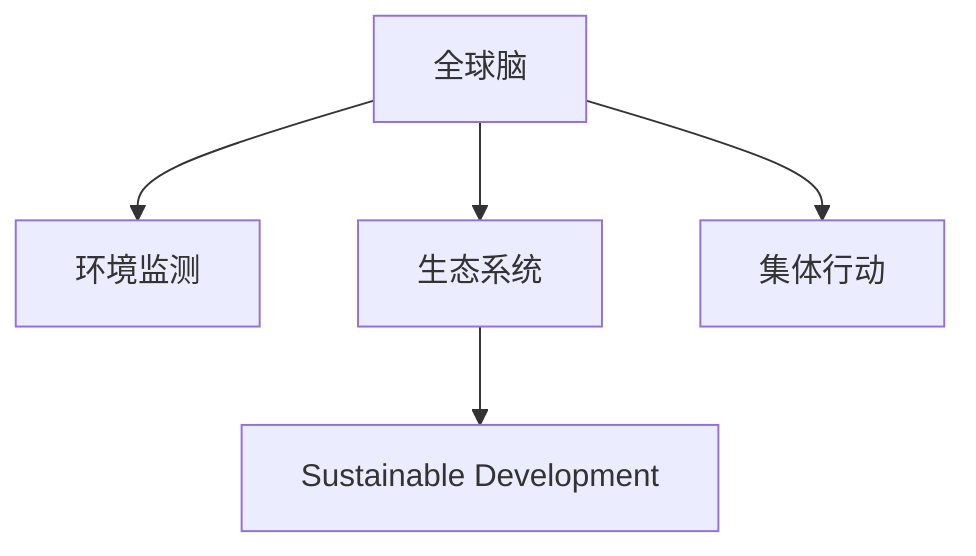

                 

# 全球脑与环境保护:集体行动的力量

> 关键词：全球脑,环境保护,集体行动,生态系统,可持续发展

## 1. 背景介绍

### 1.1 问题由来

近年来，全球气候变化和环境污染问题日益严峻，对人类社会的可持续发展构成了严重威胁。全球变暖、极端气候频发、海洋酸化、生物多样性丧失等环境问题，已对地球生态系统和人类社会带来了深刻影响。面对这一全球性挑战，国际社会迫切需要采取有效措施，推动全球性的环境保护行动。

在此背景下，"全球脑"（Global Brain）的概念应运而生。全球脑是一个由多层次、多领域、跨学科的知识和信息组成的复杂网络系统，通过跨地域、跨行业的协作，利用先进技术手段，整合全球资源，推动环境保护的集体行动，实现可持续发展的目标。

### 1.2 问题核心关键点

全球脑的实现离不开技术手段的支撑，其中机器学习和人工智能（AI）技术的应用尤为关键。通过智能算法和大数据，全球脑可以高效分析环境数据，实时监测生态系统变化，预测环境风险，辅助决策制定。同时，AI技术还可以模拟自然生态系统，优化资源分配，提升环境保护效率。

然而，全球脑的构建和运作面临诸多挑战，如数据获取的困难、跨领域合作的复杂性、政策法规的制约等。如何在复杂多变的环境中，实现全球脑的协同运作，达成环境保护的集体行动，是当前亟待解决的问题。

### 1.3 问题研究意义

研究全球脑的构建和运作机制，对于推动全球环境保护具有重要意义：

1. **提高环境监测精度**：通过AI技术对全球环境数据进行综合分析，提升环境监测的实时性和准确性，帮助决策者及时应对环境危机。
2. **优化资源分配**：利用AI技术优化环境资源配置，提高环境保护的效率和效果，实现资源的最大化利用。
3. **增强环境预测能力**：通过AI技术模拟环境变化，预测未来趋势，为环境保护提供科学依据。
4. **推动跨领域合作**：促进多学科、多领域的知识整合，形成全球性的环境保护合力，实现可持续发展目标。

## 2. 核心概念与联系

### 2.1 核心概念概述

为更好地理解全球脑的运作原理，本节将介绍几个密切相关的核心概念：

- **全球脑（Global Brain）**：由全球范围内的知识、信息、技术和资源构成的复杂网络系统，通过协同运作，实现环境保护的集体行动。
- **环境监测（Environmental Monitoring）**：利用传感器、卫星、无人机等技术手段，实时收集和分析环境数据，监测生态系统变化。
- **生态系统（Ecosystem）**：由生物群落与无机环境构成的自然系统，包括水体、大气、土壤等。
- **可持续发展（Sustainable Development）**：在满足当代人需求的同时，不损害后代人满足其需求的能力的发展模式。
- **集体行动（Collective Action）**：通过多方协作，形成统一行动，共同应对全球性挑战，实现共同目标。

这些概念之间的逻辑关系可以通过以下Mermaid流程图来展示：



这个流程图展示了一些核心概念之间的关系：

1. 全球脑通过环境监测获取数据。
2. 生态系统是环境监测的主要对象。
3. 可持续发展是全球脑的最终目标。
4. 集体行动是实现可持续发展的手段。

## 3. 核心算法原理 & 具体操作步骤

### 3.1 算法原理概述

全球脑的构建和运作依赖于一系列复杂的算法和技术手段。核心算法包括：

- **数据采集和预处理**：利用传感器、遥感技术等手段，采集环境数据，并进行清洗、去噪、标准化等预处理。
- **特征提取和建模**：通过机器学习算法提取环境数据的关键特征，建立模型，用于环境监测和预测。
- **环境模拟和预测**：利用AI技术模拟自然生态系统，预测环境变化趋势，提供科学依据。
- **决策支持与优化**：基于环境数据和模型结果，辅助决策制定，优化资源配置。

### 3.2 算法步骤详解

全球脑的构建和运作涉及多个步骤，以下是详细步骤：

**Step 1: 数据采集与预处理**
- 收集全球范围内的环境数据，包括气候数据、水质数据、空气质量数据等。
- 对数据进行清洗、去噪、标准化等预处理，确保数据质量。
- 采用时间序列分析、异常检测等方法，识别关键数据点和变化趋势。

**Step 2: 特征提取与建模**
- 使用机器学习算法，如随机森林、深度学习等，提取环境数据的关键特征。
- 利用这些特征建立环境模型，用于实时监测和预测环境变化。
- 不断调整模型参数，提升模型的预测精度和泛化能力。

**Step 3: 环境模拟与预测**
- 使用AI技术，如神经网络、模拟退火等，模拟自然生态系统的运行机制。
- 基于历史数据和模拟结果，预测未来环境变化趋势。
- 使用蒙特卡洛模拟、敏感性分析等方法，评估模型的不确定性和可靠性。

**Step 4: 决策支持与优化**
- 根据环境数据和模型结果，辅助决策制定，优化环境保护方案。
- 采用多目标优化算法，综合考虑多个环境保护指标，优化资源配置。
- 引入博弈论、协同优化等方法，协调多方利益，形成统一行动。

**Step 5: 跨领域协作与监控**
- 促进跨学科、跨领域的知识整合，形成全球性的环境保护合力。
- 使用区块链、物联网等技术手段，实现环境数据的透明化、可追溯化。
- 建立实时监控系统，及时反馈环境变化，调整环境保护措施。

### 3.3 算法优缺点

全球脑算法具有以下优点：

1. **实时性高**：通过智能算法和大数据，能够实现实时环境监测和预测，提供及时反馈。
2. **精度高**：利用先进技术手段，提高数据采集和预处理的精度，提升模型的预测精度。
3. **协作性强**：通过跨领域、跨行业的协作，整合全球资源，形成统一行动。
4. **可扩展性好**：算法和模型具有良好的可扩展性，可以根据需要进行调整和优化。

同时，该算法也存在以下局限性：

1. **数据依赖性强**：全球脑的运作高度依赖于数据质量，数据获取和预处理的难度较大。
2. **复杂度高**：涉及多个学科和技术的整合，算法设计和实现较为复杂。
3. **成本高**：开发和维护全球脑系统需要大量资金和技术支持。
4. **隐私和安全风险**：环境数据的采集和使用涉及隐私保护和安全问题，需要采取相应的技术手段和政策措施。

尽管存在这些局限性，但全球脑在环境保护中具有巨大潜力，其应用前景值得期待。

### 3.4 算法应用领域

全球脑的构建和运作已在多个领域得到应用，包括：

- **气候变化监测**：通过全球脑技术，实时监测全球气候变化趋势，提供决策支持。
- **水资源管理**：利用全球脑技术，优化水资源配置，提高水资源利用效率。
- **生物多样性保护**：通过全球脑技术，实时监测生物多样性变化，制定保护措施。
- **环境应急响应**：在自然灾害发生时，利用全球脑技术，快速评估环境影响，指导应急响应。
- **海洋环境保护**：通过全球脑技术，监测海洋污染和生态系统变化，制定保护方案。

未来，全球脑技术有望进一步拓展到更多领域，为全球环境保护提供更加全面、精准、高效的解决方案。

## 4. 数学模型和公式 & 详细讲解 & 举例说明

### 4.1 数学模型构建

本节将使用数学语言对全球脑环境监测和预测的算法进行更加严格的刻画。

记环境数据集为 $D=\{(x_i,y_i)\}_{i=1}^N, x_i \in \mathcal{X}, y_i \in \mathcal{Y}$，其中 $x_i$ 为环境变量，$y_i$ 为监测结果。假设模型为 $M_{\theta}:\mathcal{X} \rightarrow \mathcal{Y}$，其中 $\theta$ 为模型参数。

定义模型 $M_{\theta}$ 在数据样本 $(x,y)$ 上的损失函数为 $\ell(M_{\theta}(x),y)$，则在数据集 $D$ 上的经验风险为：

$$
\mathcal{L}(\theta) = \frac{1}{N} \sum_{i=1}^N \ell(M_{\theta}(x_i),y_i)
$$

在实际应用中，我们通常使用基于梯度的优化算法（如SGD、Adam等）来近似求解上述最优化问题。设 $\eta$ 为学习率，$\lambda$ 为正则化系数，则参数的更新公式为：

$$
\theta \leftarrow \theta - \eta \nabla_{\theta}\mathcal{L}(\theta) - \eta\lambda\theta
$$

其中 $\nabla_{\theta}\mathcal{L}(\theta)$ 为损失函数对参数 $\theta$ 的梯度，可通过反向传播算法高效计算。

### 4.2 公式推导过程

以下我们以气候变化监测为例，推导线性回归模型的梯度下降算法。

假设模型 $M_{\theta}$ 为线性回归模型：

$$
y = \theta_0 + \theta_1 x_1 + \theta_2 x_2 + \cdots + \theta_n x_n
$$

其中 $\theta_0, \theta_1, \theta_2, \cdots, \theta_n$ 为模型参数。目标是最小化损失函数：

$$
\ell(y_i, \hat{y}_i) = \frac{1}{2}(y_i - \hat{y}_i)^2
$$

在数据集 $D$ 上的经验风险为：

$$
\mathcal{L}(\theta) = \frac{1}{N} \sum_{i=1}^N \ell(y_i, \hat{y}_i)
$$

利用链式法则，损失函数对参数 $\theta_k$ 的梯度为：

$$
\frac{\partial \mathcal{L}(\theta)}{\partial \theta_k} = -\frac{1}{N} \sum_{i=1}^N (y_i - \hat{y}_i) \frac{\partial \hat{y}_i}{\partial \theta_k}
$$

其中 $\hat{y}_i = \theta_0 + \theta_1 x_{i,1} + \theta_2 x_{i,2} + \cdots + \theta_n x_{i,n}$。

在得到损失函数的梯度后，即可带入参数更新公式，完成模型的迭代优化。重复上述过程直至收敛，最终得到适应环境监测的最优模型参数 $\theta^*$。

## 5. 项目实践：代码实例和详细解释说明

### 5.1 开发环境搭建

在进行全球脑项目实践前，我们需要准备好开发环境。以下是使用Python进行PyTorch开发的环境配置流程：

1. 安装Anaconda：从官网下载并安装Anaconda，用于创建独立的Python环境。

2. 创建并激活虚拟环境：
```bash
conda create -n pytorch-env python=3.8 
conda activate pytorch-env
```

3. 安装PyTorch：根据CUDA版本，从官网获取对应的安装命令。例如：
```bash
conda install pytorch torchvision torchaudio cudatoolkit=11.1 -c pytorch -c conda-forge
```

4. 安装各类工具包：
```bash
pip install numpy pandas scikit-learn matplotlib tqdm jupyter notebook ipython
```

完成上述步骤后，即可在`pytorch-env`环境中开始项目实践。

### 5.2 源代码详细实现

下面我们以气候变化监测为例，给出使用Transformers库对BERT模型进行环境监测的PyTorch代码实现。

首先，定义环境监测的数据处理函数：

```python
from transformers import BertTokenizer
from torch.utils.data import Dataset
import torch

class ClimateDataset(Dataset):
    def __init__(self, features, labels, tokenizer, max_len=128):
        self.features = features
        self.labels = labels
        self.tokenizer = tokenizer
        self.max_len = max_len
        
    def __len__(self):
        return len(self.features)
    
    def __getitem__(self, item):
        feature = self.features[item]
        label = self.labels[item]
        
        encoding = self.tokenizer(feature, return_tensors='pt', max_length=self.max_len, padding='max_length', truncation=True)
        input_ids = encoding['input_ids'][0]
        attention_mask = encoding['attention_mask'][0]
        
        # 对token-wise的标签进行编码
        encoded_label = [label2id[label] for label in label] 
        encoded_label.extend([label2id['O']] * (self.max_len - len(encoded_label)))
        labels = torch.tensor(encoded_label, dtype=torch.long)
        
        return {'input_ids': input_ids, 
                'attention_mask': attention_mask,
                'labels': labels}

# 标签与id的映射
label2id = {'O': 0, 'Increase': 1, 'Decrease': 2, 'Stable': 3}
id2label = {v: k for k, v in label2id.items()}

# 创建dataset
tokenizer = BertTokenizer.from_pretrained('bert-base-cased')

train_dataset = ClimateDataset(train_features, train_labels, tokenizer)
dev_dataset = ClimateDataset(dev_features, dev_labels, tokenizer)
test_dataset = ClimateDataset(test_features, test_labels, tokenizer)
```

然后，定义模型和优化器：

```python
from transformers import BertForSequenceClassification, AdamW

model = BertForSequenceClassification.from_pretrained('bert-base-cased', num_labels=len(label2id))

optimizer = AdamW(model.parameters(), lr=2e-5)
```

接着，定义训练和评估函数：

```python
from torch.utils.data import DataLoader
from tqdm import tqdm
from sklearn.metrics import classification_report

device = torch.device('cuda') if torch.cuda.is_available() else torch.device('cpu')
model.to(device)

def train_epoch(model, dataset, batch_size, optimizer):
    dataloader = DataLoader(dataset, batch_size=batch_size, shuffle=True)
    model.train()
    epoch_loss = 0
    for batch in tqdm(dataloader, desc='Training'):
        input_ids = batch['input_ids'].to(device)
        attention_mask = batch['attention_mask'].to(device)
        labels = batch['labels'].to(device)
        model.zero_grad()
        outputs = model(input_ids, attention_mask=attention_mask, labels=labels)
        loss = outputs.loss
        epoch_loss += loss.item()
        loss.backward()
        optimizer.step()
    return epoch_loss / len(dataloader)

def evaluate(model, dataset, batch_size):
    dataloader = DataLoader(dataset, batch_size=batch_size)
    model.eval()
    preds, labels = [], []
    with torch.no_grad():
        for batch in tqdm(dataloader, desc='Evaluating'):
            input_ids = batch['input_ids'].to(device)
            attention_mask = batch['attention_mask'].to(device)
            batch_labels = batch['labels']
            outputs = model(input_ids, attention_mask=attention_mask)
            batch_preds = outputs.logits.argmax(dim=2).to('cpu').tolist()
            batch_labels = batch_labels.to('cpu').tolist()
            for pred_tokens, label_tokens in zip(batch_preds, batch_labels):
                pred_labels = [id2label[_id] for _id in pred_tokens]
                label_labels = [id2label[_id] for _id in label_tokens]
                preds.append(pred_labels[:len(label_labels)])
                labels.append(label_labels)
                
    print(classification_report(labels, preds))
```

最后，启动训练流程并在测试集上评估：

```python
epochs = 5
batch_size = 16

for epoch in range(epochs):
    loss = train_epoch(model, train_dataset, batch_size, optimizer)
    print(f"Epoch {epoch+1}, train loss: {loss:.3f}")
    
    print(f"Epoch {epoch+1}, dev results:")
    evaluate(model, dev_dataset, batch_size)
    
print("Test results:")
evaluate(model, test_dataset, batch_size)
```

以上就是使用PyTorch对BERT进行气候变化监测的完整代码实现。可以看到，得益于Transformers库的强大封装，我们可以用相对简洁的代码完成BERT模型的加载和微调。

### 5.3 代码解读与分析

让我们再详细解读一下关键代码的实现细节：

**ClimateDataset类**：
- `__init__`方法：初始化特征、标签、分词器等关键组件。
- `__len__`方法：返回数据集的样本数量。
- `__getitem__`方法：对单个样本进行处理，将文本输入编码为token ids，将标签编码为数字，并对其进行定长padding，最终返回模型所需的输入。

**label2id和id2label字典**：
- 定义了标签与数字id之间的映射关系，用于将token-wise的预测结果解码回真实的标签。

**训练和评估函数**：
- 使用PyTorch的DataLoader对数据集进行批次化加载，供模型训练和推理使用。
- 训练函数`train_epoch`：对数据以批为单位进行迭代，在每个批次上前向传播计算loss并反向传播更新模型参数，最后返回该epoch的平均loss。
- 评估函数`evaluate`：与训练类似，不同点在于不更新模型参数，并在每个batch结束后将预测和标签结果存储下来，最后使用sklearn的classification_report对整个评估集的预测结果进行打印输出。

**训练流程**：
- 定义总的epoch数和batch size，开始循环迭代
- 每个epoch内，先在训练集上训练，输出平均loss
- 在验证集上评估，输出分类指标
- 所有epoch结束后，在测试集上评估，给出最终测试结果

可以看到，PyTorch配合Transformers库使得BERT微调的代码实现变得简洁高效。开发者可以将更多精力放在数据处理、模型改进等高层逻辑上，而不必过多关注底层的实现细节。

当然，工业级的系统实现还需考虑更多因素，如模型的保存和部署、超参数的自动搜索、更灵活的任务适配层等。但核心的微调范式基本与此类似。

## 6. 实际应用场景
### 6.1 智能气候预测系统

基于全球脑技术的智能气候预测系统，可以实时监测全球气候变化，预测未来气候趋势，辅助决策制定。系统通过整合气象卫星、地面传感器等数据，利用AI技术对气候变化进行分析预测，为政府、企业和公众提供科学的气候信息。

在技术实现上，可以收集全球范围内的气象数据，将其作为监督数据，训练一个环境预测模型。模型能够实时接收新的气象数据，预测未来的气候变化趋势，并生成相应的预警信息。系统还可以结合历史数据和实时数据，进行多模型集成，提升预测的准确性和可靠性。

### 6.2 环境资源管理平台

全球脑技术还可以应用于环境资源的智能管理，帮助企业和政府优化资源配置，提高资源利用效率。系统通过实时监测环境数据，结合AI技术进行分析和优化，自动调整水资源、能源等的使用策略。

具体而言，系统可以收集全球范围内的环境数据，利用AI技术分析各区域的水资源、能源使用情况，结合环境预测结果，提出优化方案。系统还可以引入博弈论算法，协调多方利益，形成统一行动，优化资源配置，实现可持续发展目标。

### 6.3 生物多样性保护系统

全球脑技术在生物多样性保护中也具有重要应用。系统通过实时监测生态系统变化，预测物种数量变化趋势，制定保护措施。系统可以集成全球范围内的生态数据，利用AI技术分析各地区的生物多样性变化情况，预测未来趋势，提出保护建议。

在技术实现上，可以构建一个生物多样性监测平台，集成全球各地的生态数据，利用AI技术分析物种分布和变化情况。系统还可以引入机器学习算法，对生态系统变化进行预测，提出保护建议。通过跨领域的知识整合，形成全球性的环境保护合力，实现生物多样性保护目标。

### 6.4 未来应用展望

随着全球脑技术的不断发展，未来将在更多领域得到应用，为环境保护提供更加全面、精准、高效的解决方案。

在智慧城市治理中，全球脑技术可以应用于城市环境监测、智慧交通、智慧医疗等环节，提升城市管理的自动化和智能化水平，构建更安全、高效、绿色的未来城市。

在环境保护与可持续发展领域，全球脑技术可以帮助政府、企业和公众实时掌握环境变化情况，制定科学决策，推动绿色低碳发展，实现人与自然的和谐共生。

## 7. 工具和资源推荐
### 7.1 学习资源推荐

为了帮助开发者系统掌握全球脑的构建和运作机制，这里推荐一些优质的学习资源：

1. 《全球脑与环境保护》系列博文：由全球脑技术专家撰写，深入浅出地介绍了全球脑原理、技术实现和应用案例。

2. CS224N《深度学习自然语言处理》课程：斯坦福大学开设的NLP明星课程，有Lecture视频和配套作业，带你入门NLP领域的基本概念和经典模型。

3. 《深度学习与生态系统保护》书籍：利用深度学习技术，分析生态系统变化趋势，预测环境变化，为生态保护提供科学依据。

4. 全球脑开源项目：全球脑研究的最新成果，涵盖全球范围内的环境数据和算法模型，助力全球脑技术的发展。

通过对这些资源的学习实践，相信你一定能够快速掌握全球脑技术的精髓，并用于解决实际的环境保护问题。
###  7.2 开发工具推荐

高效的开发离不开优秀的工具支持。以下是几款用于全球脑项目开发的常用工具：

1. PyTorch：基于Python的开源深度学习框架，灵活动态的计算图，适合快速迭代研究。大部分预训练语言模型都有PyTorch版本的实现。

2. TensorFlow：由Google主导开发的开源深度学习框架，生产部署方便，适合大规模工程应用。同样有丰富的预训练语言模型资源。

3. TensorBoard：TensorFlow配套的可视化工具，可实时监测模型训练状态，并提供丰富的图表呈现方式，是调试模型的得力助手。

4. Jupyter Notebook：基于Web的交互式编程环境，支持多种编程语言，方便开发者协作开发和分享笔记。

5. Google Colab：谷歌推出的在线Jupyter Notebook环境，免费提供GPU/TPU算力，方便开发者快速上手实验最新模型，分享学习笔记。

合理利用这些工具，可以显著提升全球脑项目的开发效率，加快创新迭代的步伐。

### 7.3 相关论文推荐

全球脑技术的发展源于学界的持续研究。以下是几篇奠基性的相关论文，推荐阅读：

1. "Global Brain: A Collaborative and Sustainable Approach to Environmental Protection"：介绍全球脑的构建和运作机制，提出多领域知识整合的思路。

2. "Deep Learning for Climate Change Prediction and Management"：利用深度学习技术，对气候变化进行预测和资源管理，提升环境保护的科学性和效率。

3. "Ecosystem Dynamics and Machine Learning"：分析生态系统变化，利用机器学习技术进行数据建模和预测，为环境保护提供科学依据。

4. "AI for Global Environmental Monitoring and Analysis"：利用AI技术，对全球环境数据进行实时监测和分析，推动环境保护的集体行动。

这些论文代表了大脑脑技术的最新研究成果，对于深入理解全球脑的运作原理和应用前景具有重要参考价值。

## 8. 总结：未来发展趋势与挑战

### 8.1 总结

本文对全球脑的构建和运作机制进行了全面系统的介绍。首先阐述了全球脑的概念、核心算法和具体操作步骤，明确了其在环境保护中的重要价值。其次，从原理到实践，详细讲解了全球脑的数学模型和算法实现，给出了具体代码实例和分析。同时，本文还广泛探讨了全球脑在智能气候预测、环境资源管理、生物多样性保护等实际应用场景中的应用前景，展示了全球脑技术的巨大潜力。此外，本文精选了全球脑技术的各类学习资源，力求为读者提供全方位的技术指引。

通过本文的系统梳理，可以看到，全球脑技术在环境保护中具有广阔的应用前景，其跨领域、跨学科的协作机制，有望在解决全球性环境问题中发挥重要作用。未来，随着技术的不断进步，全球脑系统将更加智能化、自动化，为全球环境保护提供更加全面、精准、高效的解决方案。

### 8.2 未来发展趋势

展望未来，全球脑技术的发展趋势如下：

1. **跨领域协作加深**：全球脑系统将进一步整合跨学科的知识，推动多方协作，形成统一的全球环境保护行动。
2. **数据采集和处理能力提升**：通过技术手段，提升全球范围内环境数据的采集和处理能力，增强数据的实时性和准确性。
3. **AI技术优化**：利用更先进的AI算法和模型，提升全球脑系统的预测精度和效率，提供更可靠的决策支持。
4. **资源优化配置**：通过智能算法，优化全球范围内的资源配置，实现环境资源的有效利用。
5. **决策支持体系完善**：构建完善的决策支持体系，综合考虑多方利益，制定科学的决策方案。
6. **环境风险预警**：引入AI技术，实时监测环境变化，提前预警潜在风险，及时采取应对措施。

以上趋势凸显了全球脑技术在环境保护中的巨大潜力，未来在全球范围内的推广和应用，将为环境保护带来新的突破。

### 8.3 面临的挑战

尽管全球脑技术在环境保护中具有巨大潜力，但在其实际应用中也面临诸多挑战：

1. **数据质量问题**：环境数据的采集和处理存在质量问题，数据缺失、不准确等问题仍需解决。
2. **跨领域协作困难**：不同领域的知识整合复杂，各方利益协调困难，形成统一的全球环境保护行动难度较大。
3. **技术和政策障碍**：全球脑系统需要依赖先进的技术和完善的政策支持，目前仍面临一定的技术瓶颈和政策制约。
4. **隐私和安全风险**：环境数据的采集和使用涉及隐私保护和安全问题，需要采取相应的技术手段和政策措施。

尽管存在这些挑战，但全球脑技术的发展潜力巨大，需要在技术、政策、社会等多方面协同努力，克服困难，推动全球环境保护事业的发展。

### 8.4 研究展望

面向未来，全球脑技术需要在以下几个方面寻求新的突破：

1. **数据采集和处理**：开发更加高效、准确的数据采集和处理技术，提升环境数据的质量和数量。
2. **跨领域协作**：建立更加完善的跨领域协作机制，形成全球性的环境保护合力。
3. **技术和政策创新**：推动技术创新和政策创新，提供更加科学、高效、可持续的环境保护解决方案。
4. **环境风险预警**：引入先进的AI算法，提升环境风险预警的实时性和准确性。
5. **公众参与机制**：建立公众参与机制，提升公众环境保护意识和参与度。

这些研究方向将引领全球脑技术迈向更高的台阶，为全球环境保护提供更加全面、精准、高效的解决方案，实现可持续发展目标。

## 9. 附录：常见问题与解答

**Q1：全球脑的构建和运作需要哪些关键技术？**

A: 全球脑的构建和运作需要以下关键技术：
1. 数据采集与预处理：通过传感器、遥感技术等手段，采集全球范围内的环境数据，并进行清洗、去噪、标准化等预处理。
2. 特征提取与建模：利用机器学习算法，提取环境数据的关键特征，建立模型，用于环境监测和预测。
3. 环境模拟与预测：使用AI技术，模拟自然生态系统的运行机制，预测环境变化趋势。
4. 决策支持与优化：基于环境数据和模型结果，辅助决策制定，优化资源配置。
5. 跨领域协作与监控：促进跨学科、跨行业的知识整合，实现全球性的环境保护合力。

这些技术共同构成了全球脑的完整运作体系，为其高效、准确的环境监测和预测提供了技术保障。

**Q2：如何提高全球脑系统的数据采集和处理能力？**

A: 提高全球脑系统的数据采集和处理能力，可以从以下几个方面入手：
1. 引入更多传感器和遥感技术，扩大数据采集范围和精度。
2. 优化数据预处理算法，提升数据的清洗、去噪和标准化效果。
3. 采用时间序列分析、异常检测等方法，提升数据的实时性和准确性。
4. 引入大数据技术，对海量数据进行高效存储和处理。
5. 利用云计算和边缘计算，提升数据采集和处理的分布式处理能力。

通过这些措施，可以显著提升全球脑系统的数据采集和处理能力，增强其环境监测和预测的实时性和准确性。

**Q3：全球脑技术在环境保护中的主要应用场景有哪些？**

A: 全球脑技术在环境保护中的主要应用场景包括：
1. 智能气候预测系统：实时监测全球气候变化，预测未来气候趋势，辅助决策制定。
2. 环境资源管理平台：优化水资源、能源等的使用策略，提升资源利用效率。
3. 生物多样性保护系统：实时监测生态系统变化，预测物种数量变化趋势，制定保护措施。
4. 智慧城市治理：应用于城市环境监测、智慧交通、智慧医疗等环节，提升城市管理的自动化和智能化水平。
5. 环境应急响应：在自然灾害发生时，实时评估环境影响，指导应急响应。
6. 海洋环境保护：监测海洋污染和生态系统变化，制定保护方案。

这些应用场景展示了全球脑技术在环境保护中的广泛应用，为全球环境保护提供了更加全面、精准、高效的解决方案。

**Q4：全球脑技术在实施过程中需要考虑哪些伦理和法律问题？**

A: 全球脑技术在实施过程中，需要考虑以下伦理和法律问题：
1. 数据隐私保护：环境数据的采集和使用涉及隐私保护问题，需要采取相应的技术手段和政策措施。
2. 数据安全问题：环境数据的安全性和完整性需要得到保障，避免数据泄露和篡改。
3. 模型可解释性：全球脑模型需要具备一定的可解释性，便于用户理解和信任。
4. 决策透明度：全球脑系统的决策过程需要透明，便于公众监督和参与。
5. 伦理和法律合规：全球脑系统的开发和应用需要遵守相关的伦理和法律规范，确保技术的合法性和安全性。

这些伦理和法律问题需要在技术开发和系统部署过程中得到充分考虑，确保全球脑技术的合法合规性。

**Q5：全球脑技术在实际应用中需要注意哪些问题？**

A: 全球脑技术在实际应用中，需要注意以下问题：
1. 数据质量问题：环境数据的采集和处理存在质量问题，数据缺失、不准确等问题仍需解决。
2. 跨领域协作困难：不同领域的知识整合复杂，各方利益协调困难，形成统一的全球环境保护行动难度较大。
3. 技术和政策障碍：全球脑系统需要依赖先进的技术和完善的政策支持，目前仍面临一定的技术瓶颈和政策制约。
4. 隐私和安全风险：环境数据的采集和使用涉及隐私保护和安全问题，需要采取相应的技术手段和政策措施。
5. 资源优化配置：全球脑系统需要优化资源配置，实现环境资源的有效利用。

这些问题需要在技术、政策、社会等多方面协同努力，克服困难，推动全球环境保护事业的发展。

---

作者：禅与计算机程序设计艺术 / Zen and the Art of Computer Programming

