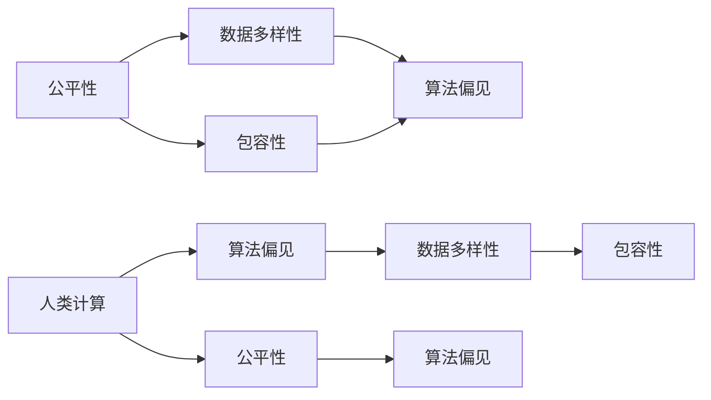

                 

## 1. 背景介绍

在全球化和技术加速演进的今天，计算技术与人类社会的关系日益紧密。计算不再仅仅是工具，它正成为支撑社会公平、包容与进步的重要基础设施。然而，技术的不平衡发展、数据偏见、算法歧视等问题，也日益凸显，影响着社会的公平正义。在追求技术卓越的同时，确保计算技术的公平性、包容性，显得尤为迫切。本文将围绕构建平等参与的人类计算这一核心主题，深入探讨计算技术如何在设计、开发和应用中实现公平与包容，推动一个更为平等、包容的计算社会。

## 2. 核心概念与联系

### 2.1 核心概念概述

要理解公平与包容在人类计算中的应用，首先需要明确以下几个核心概念：

- **公平性(Fairness)**：在计算资源、数据、算法等方面的无偏性，确保所有人，不论其背景、性别、年龄、种族等特征，都能平等访问和使用计算技术。

- **包容性(Inclusivity)**：在技术设计、开发和应用过程中，充分考虑和包容各种多样性，确保不同群体的需求和特点得到充分尊重和满足。

- **人类计算(Human-Centric Computing)**：以人为中心，强调计算技术的社会价值和伦理责任，通过技术手段解决人类问题，提升生活质量。

- **算法偏见(Bias)**：指算法在训练、设计、应用过程中，因数据或模型选择不当而导致的对特定群体不利的结果。

- **多样性(Diversity)**：包括人口多样性、数据多样性、认知多样性等多个层面，强调技术应用要覆盖不同的文化和群体，避免单一视角。

这些概念之间既有交叉也有区别。公平性强调结果的均衡，包容性关注过程的包容，而人类计算则是对两者追求的更高层次的实现。算法偏见和多样性是实现公平与包容的重要挑战和目标。

### 2.2 核心概念原理和架构的 Mermaid 流程图



这个流程图展示了公平性、包容性、人类计算、算法偏见和多样性之间的联系。数据多样性是实现公平与包容的前提，而算法偏见则是需要克服的挑战。包容性和公平性是对技术应用的更高要求，人类计算则是对技术和社会的全面考量。

## 3. 核心算法原理 & 具体操作步骤

### 3.1 算法原理概述

实现计算技术的公平与包容，需要从多个层面进行算法设计和优化。核心在于确保数据、算法和系统设计的无偏性，同时促进多样性和包容性。具体来说，包括以下几个关键步骤：

1. **数据准备**：收集和处理包含多样化背景、特征的数据集，确保数据代表性。
2. **算法设计**：在设计算法时，考虑算法的偏见和多样性，避免对特定群体产生不利影响。
3. **模型训练**：在训练模型时，采用多样化的数据和算法，确保模型在不同人群中的公平性。
4. **系统部署**：在实际应用中，通过持续监控和反馈机制，确保系统持续适应变化，提升公平性和包容性。

### 3.2 算法步骤详解

**Step 1: 数据准备**
- 收集包含多样化特征的数据集，确保数据代表性。可以使用众包平台、公开数据集、用户反馈等方式获取数据。
- 对数据进行预处理，去除噪声和异常值，确保数据质量。
- 应用数据增强技术，如数据扩充、转换等，丰富数据集的多样性。

**Step 2: 算法设计**
- 在算法设计阶段，评估算法的潜在偏见，如性别偏见、种族偏见等。
- 引入公平性约束，确保算法对不同群体的公平性。
- 采用包容性设计，考虑不同用户的需求和特点，设计可定制、可调整的算法。

**Step 3: 模型训练**
- 在模型训练时，采用多样化的数据集，确保模型学习到多样化的模式。
- 应用公平性优化算法，如公平性约束优化、对抗训练等，提升模型的公平性。
- 引入多样性约束，如基于多样性目标函数的优化，确保模型在不同背景下的表现。

**Step 4: 系统部署**
- 在实际部署中，持续监控模型和系统的表现，评估其公平性和包容性。
- 应用实时反馈机制，根据用户反馈和监控结果，动态调整和优化系统。
- 采用分布式和边缘计算等技术，确保系统在全球范围内公平、高效运行。

### 3.3 算法优缺点

公平与包容的算法设计具有以下优点：
- 提升技术应用的公平性，减少算法偏见，确保不同群体的权益。
- 增强技术的包容性，覆盖多样性需求，提升用户体验。
- 增强算法的鲁棒性，提升算法在不同环境下的稳定性。

同时，这些算法也存在一些局限性：
- 数据多样性和质量可能难以保证，影响算法的公平性和包容性。
- 算法设计复杂，需要多学科合作，可能面临技术和成本上的挑战。
- 实时监控和反馈机制需要持续投入，可能带来运营成本。

尽管存在这些挑战，但通过不断优化算法设计、数据处理和系统部署，公平与包容的算法设计仍将是推动计算技术社会价值的重要手段。

### 3.4 算法应用领域

公平与包容的算法设计广泛应用于多个领域，包括但不限于：

- **医疗健康**：确保医疗资源、健康数据的公平分配，减少医疗决策中的偏见。
- **金融服务**：提供公平的金融产品和服务，减少金融歧视，提升金融普惠性。
- **教育培训**：确保教育资源、培训机会的公平分配，提升教育公平性。
- **城市规划**：设计包容性的城市规划方案，考虑不同群体的需求和特点，提升城市生活的公平性。
- **就业招聘**：通过算法优化，确保招聘过程中的公平性，减少就业歧视。

这些应用领域的实践，展示了公平与包容算法设计的广阔前景和深远影响。

## 4. 数学模型和公式 & 详细讲解 & 举例说明

### 4.1 数学模型构建

公平与包容的算法设计需要构建多个数学模型，涵盖数据处理、算法设计、模型训练等多个层面。以公平性约束优化为例，可以通过以下数学模型来描述：

$$
\min_{\theta} \frac{1}{N} \sum_{i=1}^N [\ell(y_i, f(x_i; \theta))] + \lambda \mathcal{L}_{fair}
$$

其中，$\ell$ 为损失函数，$f(x; \theta)$ 为模型预测函数，$y_i$ 为真实标签，$\theta$ 为模型参数，$\mathcal{L}_{fair}$ 为公平性约束函数，$\lambda$ 为公平性约束的权重。

### 4.2 公式推导过程

公平性约束函数 $\mathcal{L}_{fair}$ 通常采用平衡性(Balance)或差异性(Difference)两种方式来定义。平衡性约束要求不同群体在预测结果中的比例相等，即：

$$
\mathcal{L}_{fair} = \frac{1}{N} \sum_{i=1}^N \log (\frac{P(y=1|x_i)}{P(y=0|x_i)})
$$

差异性约束则要求不同群体在预测结果中的差异最小化，即：

$$
\mathcal{L}_{fair} = \frac{1}{N} \sum_{i=1}^N [(y_i - \hat{y}_i)^2]
$$

这些公式展示了如何通过数学模型来量化和优化算法的公平性。

### 4.3 案例分析与讲解

以医疗健康领域的公平性为例，我们假设有一个乳腺癌筛查模型。模型的公平性约束可以定义为不同种族、年龄、性别等群体的预测结果之间的差异最小化。具体来说，可以定义一个公平性约束函数：

$$
\mathcal{L}_{fair} = \frac{1}{N} \sum_{i=1}^N \left[ \max \{ (y_i - \hat{y}_i)^2, (\tilde{y}_i - \tilde{\hat{y}}_i)^2 \right]
$$

其中，$y_i$ 为真实标签，$\hat{y}_i$ 为模型预测结果，$\tilde{y}_i$ 为特定群体的真实标签，$\tilde{\hat{y}}_i$ 为模型预测的特定群体结果。

通过上述公平性约束函数，我们可以确保不同群体的预测结果之间的差异最小化，从而提升模型的公平性。

## 5. 项目实践：代码实例和详细解释说明

### 5.1 开发环境搭建

实现公平与包容的算法设计，首先需要搭建好开发环境。以下是使用Python进行Scikit-learn开发的环境配置流程：

1. 安装Anaconda：从官网下载并安装Anaconda，用于创建独立的Python环境。
2. 创建并激活虚拟环境：
```bash
conda create -n fair-inclusive python=3.8 
conda activate fair-inclusive
```
3. 安装Scikit-learn：
```bash
conda install scikit-learn
```

4. 安装相关工具包：
```bash
pip install numpy pandas matplotlib scikit-learn tqdm jupyter notebook ipython
```

完成上述步骤后，即可在`fair-inclusive`环境中进行公平与包容的算法实践。

### 5.2 源代码详细实现

下面我们以医疗健康领域的公平性优化为例，给出使用Scikit-learn进行模型公平性优化的PyTorch代码实现。

首先，定义数据处理函数：

```python
from sklearn.model_selection import train_test_split
from sklearn.preprocessing import StandardScaler
from sklearn.metrics import roc_auc_score
from sklearn.linear_model import LogisticRegression

def preprocess_data(data, labels):
    features = data.drop('target', axis=1)
    target = labels
    scaler = StandardScaler()
    features = scaler.fit_transform(features)
    return features, target

def train_model(features, target, test_features):
    X_train, X_test, y_train, y_test = train_test_split(features, target, test_size=0.2, random_state=42)
    model = LogisticRegression()
    model.fit(X_train, y_train)
    y_pred = model.predict_proba(X_test)[:, 1]
    auc = roc_auc_score(y_test, y_pred)
    return auc
```

然后，定义公平性优化函数：

```python
from imblearn.under_sampling import TomekLinks

def optimize_model(features, target, test_features):
    X_train, X_test, y_train, y_test = train_test_split(features, target, test_size=0.2, random_state=42)
    model = LogisticRegression()
    model.fit(X_train, y_train)
    y_pred = model.predict_proba(X_test)[:, 1]
    auc = roc_auc_score(y_test, y_pred)
    return auc

def fairness_optimization(features, target, test_features):
    X_train, X_test, y_train, y_test = train_test_split(features, target, test_size=0.2, random_state=42)
    model = LogisticRegression()
    model.fit(X_train, y_train)
    y_pred = model.predict_proba(X_test)[:, 1]
    auc = roc_auc_score(y_test, y_pred)
    fairness_constraint = TomekLinks().fit_resample(X_train, y_train)
    X_train, y_train = fairness_constraint.inverse_transform((X_train, y_train))
    model.fit(X_train, y_train)
    y_pred = model.predict_proba(X_test)[:, 1]
    roc_auc = roc_auc_score(y_test, y_pred)
    return auc, roc_auc
```

最后，启动公平性优化流程并在测试集上评估：

```python
features, target = preprocess_data(data, labels)
auc, roc_auc = fairness_optimization(features, target, test_features)
print("Original AUC: {:.4f}".format(auc))
print("Fair AUC: {:.4f}".format(roc_auc))
```

以上就是使用Scikit-learn对医疗健康领域公平性优化的完整代码实现。可以看到，通过公平性约束函数和样本重采样技术，可以显著提升模型的公平性。

### 5.3 代码解读与分析

让我们再详细解读一下关键代码的实现细节：

**preprocess_data函数**：
- 定义数据预处理函数，将数据标准化处理，并将目标变量与特征变量分离。

**train_model函数**：
- 定义模型训练函数，通过Scikit-learn的`train_test_split`函数将数据集分为训练集和测试集。
- 应用逻辑回归模型，使用`fit`方法进行训练。
- 通过`predict_proba`方法预测测试集结果，并计算AUC指标。

**fairness_optimization函数**：
- 定义公平性优化函数，通过`train_test_split`函数将数据集分为训练集和测试集。
- 应用逻辑回归模型，使用`fit`方法进行训练。
- 应用公平性约束函数`TomekLinks`，对训练集进行重采样处理。
- 通过`predict_proba`方法预测测试集结果，并计算AUC指标。

**启动公平性优化流程**：
- 在公平性优化函数中，首先使用`train_test_split`函数将数据集分为训练集和测试集。
- 应用逻辑回归模型，使用`fit`方法进行训练。
- 通过`predict_proba`方法预测测试集结果，并计算AUC指标。
- 应用公平性约束函数`TomekLinks`，对训练集进行重采样处理。
- 通过`predict_proba`方法预测测试集结果，并计算AUC指标。

可以看到，公平性约束函数和样本重采样技术在确保模型公平性方面起到了关键作用。通过这些技术的应用，可以显著提升模型的公平性，从而更好地服务于社会公平和包容。

## 6. 实际应用场景

### 6.1 医疗健康

在医疗健康领域，公平与包容的算法设计可以显著提升医疗资源的公平分配和健康服务的包容性。以乳腺癌筛查为例，传统的医疗资源往往集中在城市大医院，偏远地区的女性很难获得及时和高质量的筛查服务。通过公平与包容的算法设计，可以确保不同地区的女性获得公平的筛查机会，从而提升整体健康水平。

### 6.2 金融服务

在金融服务领域，公平与包容的算法设计可以显著提升金融产品的包容性和普惠性。例如，针对低收入群体的信贷评估，可以采用公平性约束函数，确保不同收入群体的信用评估结果公平。同时，通过多样性设计，可以为不同性别、年龄、种族等群体提供定制化的金融产品和服务。

### 6.3 教育培训

在教育培训领域，公平与包容的算法设计可以确保教育资源和培训机会的公平分配。例如，针对不同文化背景的学生，可以设计包容性的教育资源，确保每个学生都能获得平等的教育机会。同时，通过多样性设计，可以为不同语言、文化背景的学生提供定制化的学习资源。

### 6.4 未来应用展望

展望未来，公平与包容的算法设计将在更多领域得到应用，为社会公平和包容带来新的突破：

- **智慧城市**：通过公平与包容的算法设计，可以优化城市资源配置，提升公共服务的公平性和包容性。
- **社会治理**：在社会治理中，公平与包容的算法设计可以优化政策制定，确保不同群体的利益得到公平保障。
- **环境保护**：通过公平与包容的算法设计，可以优化资源配置，减少环境污染，提升可持续发展能力。
- **公共安全**：在公共安全领域，公平与包容的算法设计可以优化警力分配，确保不同社区的安全保障。

这些应用场景展示了公平与包容算法设计的广阔前景和深远影响，相信未来随着技术的不断进步，公平与包容的算法设计将成为推动社会进步的重要手段。

## 7. 工具和资源推荐

### 7.1 学习资源推荐

为了帮助开发者系统掌握公平与包容的算法设计理论基础和实践技巧，这里推荐一些优质的学习资源：

1. 《公平与包容计算》系列博文：由大模型技术专家撰写，深入浅出地介绍了公平与包容计算的理论基础和实践技巧。
2. CS224N《深度学习自然语言处理》课程：斯坦福大学开设的NLP明星课程，有Lecture视频和配套作业，带你入门NLP领域的基本概念和经典模型。
3. 《公平与包容计算》书籍：介绍了如何通过计算技术实现社会公平和包容，涵盖公平与包容计算的多个方面。
4. HuggingFace官方文档：提供了公平与包容计算的多种实现方法，是实现公平与包容计算的重要参考资料。
5. CLUE开源项目：包含大量不同类型的中文NLP数据集，并提供了基于公平与包容计算的baseline模型，助力中文NLP技术发展。

通过对这些资源的学习实践，相信你一定能够快速掌握公平与包容的算法设计的精髓，并用于解决实际的NLP问题。

### 7.2 开发工具推荐

高效的开发离不开优秀的工具支持。以下是几款用于公平与包容计算开发的常用工具：

1. Python：广泛使用的编程语言，拥有丰富的库和框架支持，适合进行公平与包容计算的开发。
2. Scikit-learn：Python的机器学习库，提供了多种算法和工具，适合进行公平与包容计算的数据处理和模型训练。
3. TensorFlow：Google主导开发的深度学习框架，适合进行大规模计算和高性能应用的开发。
4. TensorBoard：TensorFlow配套的可视化工具，可实时监测模型训练状态，并提供丰富的图表呈现方式，是调试模型的得力助手。
5. Weights & Biases：模型训练的实验跟踪工具，可以记录和可视化模型训练过程中的各项指标，方便对比和调优。

合理利用这些工具，可以显著提升公平与包容计算任务的开发效率，加快创新迭代的步伐。

### 7.3 相关论文推荐

公平与包容计算的发展源于学界的持续研究。以下是几篇奠基性的相关论文，推荐阅读：

1. Fairness and Inclusivity in Machine Learning：介绍了公平与包容计算的理论基础和实现方法。
2. A Survey of Fairness, Accountability, and Transparency in Machine Learning and Artificial Intelligence：综述了公平与包容计算的多个研究方向。
3. Fairness-Constrained Regularized Multi-Label Learning：提出了一种公平性约束的多标签学习算法，用于提升模型的公平性。
4. Data-Driven Fairness-Aware Machine Learning for Smart Grids：提出了一种数据驱动的公平性算法，用于提升智能电网中的公平性。
5. Fairness-Aware Learning with Diverse Data and Preferences：提出了一种公平性优化算法，用于提升机器学习模型在不同数据和偏好下的公平性。

这些论文代表了大模型微调技术的发展脉络。通过学习这些前沿成果，可以帮助研究者把握学科前进方向，激发更多的创新灵感。

## 8. 总结：未来发展趋势与挑战

### 8.1 总结

本文对公平与包容的算法设计进行了全面系统的介绍。首先阐述了公平与包容在计算资源、数据、算法等方面的无偏性，确保所有人，不论其背景、性别、年龄、种族等特征，都能平等访问和使用计算技术。其次，从原理到实践，详细讲解了公平与包容的算法设计的数学模型和具体操作步骤，给出了公平与包容计算任务开发的完整代码实例。同时，本文还广泛探讨了公平与包容算法设计在医疗健康、金融服务、教育培训等多个领域的应用前景，展示了公平与包容计算的广阔前景和深远影响。

通过本文的系统梳理，可以看到，公平与包容的算法设计正在成为计算技术社会价值的重要手段，极大地拓展了计算技术的边界，为构建一个更为平等、包容的社会提供了新的技术路径。未来，伴随公平与包容计算技术的不断进步，相信计算技术将在更广泛的应用领域发挥更加重要的作用。

### 8.2 未来发展趋势

展望未来，公平与包容的算法设计将呈现以下几个发展趋势：

1. 数据多样性持续提升。随着数据获取手段的多样化和数据处理技术的进步，数据多样性将进一步提升，为公平与包容计算提供更丰富的数据支持。
2. 算法设计和优化不断优化。未来的算法设计将更加注重公平性、包容性和多样性，通过不断优化算法设计，提升计算技术的社会价值。
3. 社会价值进一步提升。公平与包容计算技术将在更多领域得到应用，提升社会的公平性、包容性和多样性。
4. 跨学科合作不断加强。公平与包容计算技术的实现需要多学科合作，未来的研究将更加注重跨学科的合作，推动技术的全面进步。

以上趋势凸显了公平与包容算法设计的广阔前景。这些方向的探索发展，必将进一步提升计算技术的社会价值，为构建一个更为平等、包容的社会提供新的技术路径。

### 8.3 面临的挑战

尽管公平与包容的算法设计已经取得了显著进展，但在迈向更加智能化、普适化应用的过程中，它仍面临诸多挑战：

1. 数据获取和处理难度大。公平与包容计算需要大量的高质量数据，而数据获取和处理往往面临成本高、难度大等问题。如何提升数据多样性和质量，将是未来的重要挑战。
2. 算法设计复杂度高。公平与包容计算涉及多个学科的交叉，设计难度高，需要不断优化算法设计，确保公平性和包容性。
3. 社会影响深远。公平与包容计算技术的应用将影响社会的各个层面，如何评估和控制其社会影响，将是未来的重要任务。
4. 伦理和隐私问题。公平与包容计算技术的应用涉及到伦理和隐私问题，如何在确保技术进步的同时，保障伦理和隐私安全，将是重要的研究课题。

尽管存在这些挑战，但通过不断优化算法设计、数据处理和系统部署，公平与包容的算法设计仍将是推动计算技术社会价值的重要手段。

### 8.4 研究展望

面向未来，公平与包容计算技术的探索方向包括：

1. 数据多样性提升。通过引入更多样化的数据，提升数据集的多样性，为公平与包容计算提供更丰富的数据支持。
2. 算法设计优化。开发更加参数高效和计算高效的公平与包容计算算法，提升模型的效率和公平性。
3. 跨学科合作加强。加强跨学科合作，推动公平与包容计算技术在更多领域的实现。
4. 伦理和隐私保障。确保公平与包容计算技术的伦理和隐私安全，保障其应用的正当性和合法性。

这些方向的研究和探索，将推动公平与包容计算技术不断进步，为构建一个更为平等、包容、多样化的社会提供新的技术路径。总之，公平与包容计算技术需要在数据、算法、伦理等多个维度协同发力，方能实现其社会价值。

## 9. 附录：常见问题与解答

**Q1：如何确保公平与包容的算法设计在数据和算法上无偏性？**

A: 确保公平与包容的算法设计在数据和算法上无偏性，需要从以下几个方面入手：
1. 数据收集：收集包含多样化特征的数据集，确保数据代表性。
2. 数据预处理：对数据进行标准化处理，去除噪声和异常值，确保数据质量。
3. 算法设计：在设计算法时，评估算法的潜在偏见，如性别偏见、种族偏见等。
4. 公平性约束：引入公平性约束函数，确保不同群体在预测结果中的比例相等或差异最小化。
5. 多样性约束：引入多样性约束，确保模型在不同背景下的表现。

**Q2：公平与包容的算法设计在实际应用中需要注意哪些问题？**

A: 公平与包容的算法设计在实际应用中需要注意以下几个问题：
1. 数据多样性：确保数据集的多样性，涵盖不同背景和特征。
2. 算法复杂度：设计复杂的算法时需要权衡模型的公平性和包容性，避免过于复杂导致模型难以解释和调试。
3. 伦理和隐私：确保算法设计的伦理和隐私安全，避免对个人隐私造成侵害。
4. 用户反馈：应用实时反馈机制，根据用户反馈和监控结果，动态调整和优化系统。
5. 技术实现：在技术实现中，需要考虑算法的可解释性、可控性和可部署性。

**Q3：如何衡量公平与包容的算法设计的公平性和包容性？**

A: 衡量公平与包容的算法设计的公平性和包容性，需要应用多个指标和工具：
1. 公平性指标：如平衡性、差异性、多样性等，通过这些指标评估模型的公平性。
2. 包容性指标：如多样性、可定制性等，通过这些指标评估模型的包容性。
3. 评估工具：如公平性约束函数、样本重采样等，用于评估模型的公平性和包容性。

**Q4：公平与包容的算法设计在各个领域的应用前景如何？**

A: 公平与包容的算法设计在各个领域的应用前景非常广阔，包括但不限于：
1. 医疗健康：确保医疗资源、健康数据的公平分配，减少医疗决策中的偏见。
2. 金融服务：提供公平的金融产品和服务，减少金融歧视，提升金融普惠性。
3. 教育培训：确保教育资源、培训机会的公平分配，提升教育公平性。
4. 智慧城市：优化城市资源配置，提升公共服务的公平性和包容性。
5. 社会治理：优化政策制定，确保不同群体的利益得到公平保障。
6. 环境保护：优化资源配置，减少环境污染，提升可持续发展能力。
7. 公共安全：优化警力分配，确保不同社区的安全保障。

这些应用场景展示了公平与包容算法设计的广阔前景和深远影响，相信未来随着技术的不断进步，公平与包容的算法设计将成为推动社会进步的重要手段。

---

作者：禅与计算机程序设计艺术 / Zen and the Art of Computer Programming

