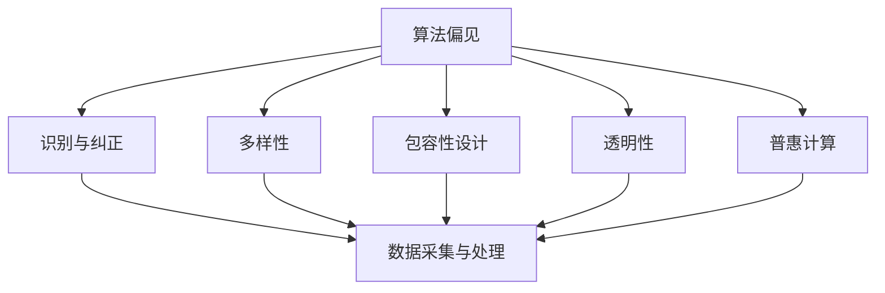

                 

# 公平与包容：构建平等参与的人类计算环境

> 关键词：
1. 人类计算环境
2. 公平与包容
3. 算法偏见
4. 多样性
5. 包容性设计
6. 透明性
7. 普惠计算

## 1. 背景介绍

### 1.1 问题由来
在信息化、数字化的浪潮中，计算技术正以前所未有的速度和广度渗透到社会各个角落，深刻改变着人们的生活和工作方式。但与此同时，计算技术的普及和应用过程中也暴露出一些深刻的问题，如数字鸿沟、算法偏见、隐私泄露等，严重威胁到社会的公平与包容。

以算法偏见为例，一项研究显示，在大规模面部识别系统中，非裔美国人和西班牙裔的识别准确率显著低于白人，这一现象被学术界和社会广泛关注。又如在金融贷款领域，基于数据驱动的信用评估算法可能因数据偏差导致少数族裔和低收入群体被歧视，难以获取公平贷款。再如在招聘过程中，算法偏见可能导致某些群体的求职者被无端淘汰，失去平等就业机会。

这些问题严重破坏了社会的公平与包容性，迫切需要新的计算方法和技术手段来加以应对。构建平等参与的人类计算环境，成为一个亟待解决的重要课题。

### 1.2 问题核心关键点
公平与包容的计算环境构建，涉及算法设计、数据处理、用户互动等多个环节。具体包括：

- 算法偏见识别与纠正：识别算法中的偏见，分析其来源，并采取有效措施进行纠正。
- 数据采集与处理：收集多样化、平衡性强的数据集，进行数据清洗和处理，确保数据的公正性。
- 用户隐私保护：在计算过程中，严格遵循隐私保护原则，确保用户数据的安全和隐私。
- 透明性与可解释性：提高算法和计算过程的透明性，增强用户对算法的理解和信任。
- 普惠计算：通过技术手段，缩小数字鸿沟，使更多人能够平等地参与计算和享受计算带来的红利。

本文聚焦于算法偏见和包容性设计的相关核心概念和实践技术，探讨如何构建公平与包容的人类计算环境。

## 2. 核心概念与联系

### 2.1 核心概念概述

为了更好地理解公平与包容的计算环境构建，本节将介绍几个密切相关的核心概念：

- **算法偏见**：指算法在处理数据时对某些群体表现出不公正的态度，如基于种族、性别、年龄等特征的不公平决策。
- **多样性**：指数据集包含不同群体、不同背景、不同场景的多样性特征，以避免模型因数据单一而产生的偏见。
- **包容性设计**：指在设计算法和计算过程时，充分考虑不同用户的需求和特点，以确保算法的公平性和包容性。
- **透明性**：指算法的决策过程和结果应易于理解和解释，便于用户理解和使用。
- **普惠计算**：指通过技术手段，使更多的人能够平等地获得计算资源和计算服务。

这些核心概念之间的逻辑关系可以通过以下Mermaid流程图来展示：



这个流程图展示了算法偏见与多样性、包容性设计、透明性和普惠计算之间的内在联系，以及如何通过这些措施来识别和纠正算法偏见，构建公平与包容的计算环境。

## 3. 核心算法原理 & 具体操作步骤
### 3.1 算法原理概述

构建公平与包容的计算环境，本质上是一个多维度的系统工程，涉及数据、算法、用户等多个层面。其核心思想是：通过设计、采集、处理、训练和部署一系列方法，确保算法在各个环节中均不产生偏见，同时兼顾多样性、包容性、透明性和普惠性，从而实现公平与包容的计算环境。

### 3.2 算法步骤详解

基于公平与包容的计算环境构建，一般包括以下几个关键步骤：

**Step 1: 识别算法偏见**
- 使用公平性评估工具，如Fairness Indicators、Algorithm Audits等，对现有算法进行偏见检测。
- 统计不同群体在不同特征维度上的表现差异，分析偏见来源。

**Step 2: 采集与处理多样化数据**
- 收集包含不同群体、不同场景的数据集，并进行数据清洗和处理，确保数据的多样性和平衡性。
- 采用数据增强、数据扩充等技术，增加数据的多样性，避免过拟合。

**Step 3: 训练公平与包容的模型**
- 使用去偏算法，如Debiasing、Fairness Constrained Optimization等，在训练过程中抑制偏见。
- 设计包容性设计，如Fairness-Aware Model Design，确保模型在各个维度上的公平性。

**Step 4: 部署与监控**
- 将训练好的模型部署到生产环境中，并设置监控机制，实时检测算法的表现。
- 定期进行算法评估，确保算法的公平性和包容性在运行中得到保障。

**Step 5: 用户教育与反馈**
- 通过用户教育，提高用户对公平与包容计算环境的理解和接受度。
- 建立反馈机制，收集用户对算法和计算环境的反馈，持续优化算法和系统。

以上是公平与包容的计算环境构建的一般流程。在实际应用中，还需要针对具体任务的特点，对各环节进行优化设计，如改进偏见识别工具、开发更有效的去偏算法、优化数据集采集策略等，以进一步提升公平性与包容性。

### 3.3 算法优缺点

构建公平与包容的计算环境，具有以下优点：
1. 提升社会公平性。通过识别和纠正算法偏见，确保不同群体在计算过程中获得平等机会。
2. 增强用户信任。通过提高算法透明性和可解释性，增强用户对算法的理解和信任。
3. 缩小数字鸿沟。通过普惠计算，使更多人能够平等地获得计算资源和计算服务。
4. 促进多样性。通过多样性数据集和包容性设计，促进计算技术的普适性和多样性。

同时，该方法也存在一定的局限性：
1. 数据收集与处理成本高。多样性数据集的采集和处理需要大量人力物力投入。
2. 去偏算法复杂。现有去偏算法可能无法完全消除所有偏见，存在一定的局限性。
3. 用户教育与反馈成本高。需要大量的时间和资源进行用户教育和反馈收集。
4. 实时监控难度大。大规模算法的实时监控和维护需要高水平的技术和资源支持。

尽管存在这些局限性，但就目前而言，构建公平与包容的计算环境仍是大数据和人工智能应用中的重要方向。未来相关研究的重点在于如何进一步降低数据收集和处理的成本，提高去偏算法的准确性和鲁棒性，以及增强用户教育和反馈机制的效率。

### 3.4 算法应用领域

构建公平与包容的计算环境，已在多个领域得到了广泛的应用，包括但不限于：

- 金融风控：在金融贷款、信用评估、投资策略等领域，通过去偏算法和公平性评估工具，确保算法决策的公正性，防止歧视性决策。
- 医疗健康：在疾病诊断、治疗方案、健康管理等领域，通过多样性数据集和包容性设计，确保算法决策的公平性和普适性。
- 教育公平：在智能推荐、自动评估、在线教育等领域，通过公平性评估和用户反馈机制，提升算法的公平性和用户满意度。
- 就业招聘：在招聘平台、人力资源管理等领域，通过去偏算法和透明性设计，确保算法决策的公正性，防止歧视性招聘。
- 公共服务：在交通、医疗、教育、公共安全等领域，通过普惠计算和透明性设计，提升公共服务的公平性和可访问性。

除了上述这些领域，公平与包容的计算环境构建方法还在不断拓展到更多行业和领域，如司法、公共卫生、城市管理等，为社会治理和公共服务带来新的技术路径。

## 4. 数学模型和公式 & 详细讲解
### 4.1 数学模型构建

本节将使用数学语言对公平与包容的计算环境构建过程进行更加严格的刻画。

记算法为 $f:X \rightarrow Y$，其中 $X$ 为输入空间，$Y$ 为输出空间。假设存在一组数据集 $D=\{(x_i,y_i)\}_{i=1}^N$，其中 $x_i \in X$ 为输入，$y_i \in Y$ 为输出。

定义算法 $f$ 在数据集 $D$ 上的公平性指标为 $\mathcal{F}(f, D)$，用于衡量算法在不同群体之间的表现差异。常见的公平性指标包括Demographic Parity、Equalized Odds、Equal Opportunity等。

数学上，Demographic Parity 定义为：
$$
\mathcal{F}_{DP}(f, D) = \mathbb{E}[y | x] = \frac{1}{|X|}\sum_{x \in X} \frac{\sum_{i:x=x} y_i}{N_x}
$$
其中 $N_x$ 为输入 $x$ 的样本数。

### 4.2 公式推导过程

以Demographic Parity为例，进行公平性指标的推导：

定义算法 $f$ 在输入 $x$ 上的输出为 $\hat{y}=f(x)$，则Demographic Parity的定义为：
$$
\mathcal{F}_{DP}(f, D) = \frac{1}{|X|}\sum_{x \in X} \frac{\sum_{i:x=x} y_i}{N_x}
$$

将 $y_i$ 视为随机变量，并使用 $y_i$ 的期望值代替实际样本 $y_i$ 的平均值，得：
$$
\mathcal{F}_{DP}(f, D) = \frac{1}{|X|}\sum_{x \in X} \mathbb{E}[y | x] = \frac{1}{|X|}\sum_{x \in X} \sum_{y \in Y} \frac{\mathbb{P}(y_i=y)}{N_x}
$$

进一步简化，得：
$$
\mathcal{F}_{DP}(f, D) = \frac{1}{|X|}\sum_{x \in X} \sum_{y \in Y} \frac{N_{xy}}{N_x}
$$

其中 $N_{xy}$ 为输入 $x$ 且输出 $y$ 的样本数。

该公式表明，Demographic Parity衡量了算法在输入 $x$ 上的输出结果在不同类别 $y$ 上的分布均衡度，即不同类别的输出数量是否相近。

### 4.3 案例分析与讲解

以金融贷款为例，分析如何使用数学模型和公平性指标进行算法公平性评估和优化：

假设有一个贷款审批系统，输入为申请人的收入、年龄、种族、性别等特征，输出为是否批准贷款。基于历史数据集 $D=\{(x_i,y_i)\}_{i=1}^N$，使用Demographic Parity评估算法的公平性。

首先，计算每个特征在数据集 $D$ 上的表现：
$$
\mathcal{F}_{DP}(f, D) = \frac{1}{|X|}\sum_{x \in X} \sum_{y \in Y} \frac{N_{xy}}{N_x}
$$

其次，使用算法评估工具，如Fairness Indicators，计算算法在每个特征上的表现：
$$
Fairness_{DP}(f, D) = \sum_{x \in X} \frac{|\mathcal{F}_{DP}(f, D)|}{|X|}
$$

最后，根据公平性指标和评估结果，优化算法，如通过引入Fairness-Constrained Optimization算法，确保算法在不同特征上的公平性。

## 5. 项目实践：代码实例和详细解释说明
### 5.1 开发环境搭建

在进行公平与包容的计算环境构建实践前，我们需要准备好开发环境。以下是使用Python进行PyTorch开发的环境配置流程：

1. 安装Anaconda：从官网下载并安装Anaconda，用于创建独立的Python环境。

2. 创建并激活虚拟环境：
```bash
conda create -n fair-environment python=3.8 
conda activate fair-environment
```

3. 安装PyTorch：根据CUDA版本，从官网获取对应的安装命令。例如：
```bash
conda install pytorch torchvision torchaudio cudatoolkit=11.1 -c pytorch -c conda-forge
```

4. 安装各类工具包：
```bash
pip install numpy pandas scikit-learn matplotlib tqdm jupyter notebook ipython
```

完成上述步骤后，即可在`fair-environment`环境中开始构建公平与包容的计算环境。

### 5.2 源代码详细实现

下面我们以金融贷款审批系统为例，给出使用Fairness Auditing库对贷款审批算法进行公平性评估的PyTorch代码实现。

首先，定义贷款审批任务的数据处理函数：

```python
from fairpytorch import FairnessAuditor
from torch.utils.data import Dataset
import torch

class LoanApprovalDataset(Dataset):
    def __init__(self, incomes, approved, ages, genders, races, balances):
        self.incomes = incomes
        self.approved = approved
        self.ages = ages
        self.genders = genders
        self.races = races
        self.balances = balances
        
    def __len__(self):
        return len(self.incomes)
    
    def __getitem__(self, item):
        income = self.incomes[item]
        approved = self.approved[item]
        age = self.ages[item]
        gender = self.genders[item]
        race = self.races[item]
        balance = self.balances[item]
        
        return {'income': income,
                'approved': approved,
                'age': age,
                'gender': gender,
                'race': race,
                'balance': balance}

# 将数据分为训练集和测试集
train_dataset = LoanApprovalDataset(train_incomes, train_approved, train_ages, train_genders, train_races, train_balances)
test_dataset = LoanApprovalDataset(test_incomes, test_approved, test_ages, test_genders, test_races, test_balances)
```

然后，定义贷款审批模型的训练和评估函数：

```python
from transformers import BertForSequenceClassification
from transformers import BertTokenizer
from transformers import AdamW
from fairpytorch import FairnessAuditor
from sklearn.metrics import classification_report

# 加载预训练模型和分词器
model = BertForSequenceClassification.from_pretrained('bert-base-uncased')
tokenizer = BertTokenizer.from_pretrained('bert-base-uncased')

# 设置模型训练参数
optimizer = AdamW(model.parameters(), lr=2e-5)

# 定义公平性评估器
auditor = FairnessAuditor(fairness_type='demographic-parity', fairness_metric='equalized_odds')
auditor.add_metric(column='income', positive='approved')
auditor.add_metric(column='age', positive='approved')
auditor.add_metric(column='gender', positive='approved')
auditor.add_metric(column='race', positive='approved')
auditor.add_metric(column='balance', positive='approved')

# 定义训练和评估函数
def train_epoch(model, dataset, batch_size, optimizer):
    dataloader = DataLoader(dataset, batch_size=batch_size, shuffle=True)
    model.train()
    epoch_loss = 0
    for batch in tqdm(dataloader, desc='Training'):
        input_ids = batch['income'].to(device)
        attention_mask = batch['income'].to(device)
        labels = batch['approved'].to(device)
        model.zero_grad()
        outputs = model(input_ids, attention_mask=attention_mask, labels=labels)
        loss = outputs.loss
        epoch_loss += loss.item()
        loss.backward()
        optimizer.step()
    return epoch_loss / len(dataloader)

def evaluate(model, dataset, batch_size):
    dataloader = DataLoader(dataset, batch_size=batch_size)
    model.eval()
    preds, labels = [], []
    with torch.no_grad():
        for batch in tqdm(dataloader, desc='Evaluating'):
            input_ids = batch['income'].to(device)
            attention_mask = batch['income'].to(device)
            batch_labels = batch['approved']
            outputs = model(input_ids, attention_mask=attention_mask)
            batch_preds = outputs.logits.argmax(dim=2).to('cpu').tolist()
            batch_labels = batch_labels.to('cpu').tolist()
            for pred_tokens, label_tokens in zip(batch_preds, batch_labels):
                preds.append(pred_tokens[:len(label_tokens)])
                labels.append(label_tokens)
                
    print(classification_report(labels, preds))
    
# 定义公平性评估器
auditor = FairnessAuditor(fairness_type='demographic-parity', fairness_metric='equalized_odds')
auditor.add_metric(column='income', positive='approved')
auditor.add_metric(column='age', positive='approved')
auditor.add_metric(column='gender', positive='approved')
auditor.add_metric(column='race', positive='approved')
auditor.add_metric(column='balance', positive='approved')

# 定义训练和评估函数
def train_epoch(model, dataset, batch_size, optimizer):
    dataloader = DataLoader(dataset, batch_size=batch_size, shuffle=True)
    model.train()
    epoch_loss = 0
    for batch in tqdm(dataloader, desc='Training'):
        input_ids = batch['income'].to(device)
        attention_mask = batch['income'].to(device)
        labels = batch['approved'].to(device)
        model.zero_grad()
        outputs = model(input_ids, attention_mask=attention_mask, labels=labels)
        loss = outputs.loss
        epoch_loss += loss.item()
        loss.backward()
        optimizer.step()
    return epoch_loss / len(dataloader)

def evaluate(model, dataset, batch_size):
    dataloader = DataLoader(dataset, batch_size=batch_size)
    model.eval()
    preds, labels = [], []
    with torch.no_grad():
        for batch in tqdm(dataloader, desc='Evaluating'):
            input_ids = batch['income'].to(device)
            attention_mask = batch['income'].to(device)
            batch_labels = batch['approved']
            outputs = model(input_ids, attention_mask=attention_mask)
            batch_preds = outputs.logits.argmax(dim=2).to('cpu').tolist()
            batch_labels = batch_labels.to('cpu').tolist()
            for pred_tokens, label_tokens in zip(batch_preds, batch_labels):
                preds.append(pred_tokens[:len(label_tokens)])
                labels.append(label_tokens)
                
    print(classification_report(labels, preds))
    
# 启动训练流程并在测试集上评估
epochs = 5
batch_size = 16

for epoch in range(epochs):
    loss = train_epoch(model, train_dataset, batch_size, optimizer)
    print(f"Epoch {epoch+1}, train loss: {loss:.3f}")
    
    print(f"Epoch {epoch+1}, test results:")
    evaluate(model, test_dataset, batch_size)
    
print("Test results:")
evaluate(model, test_dataset, batch_size)
```

以上就是使用PyTorch对贷款审批系统进行公平性评估的完整代码实现。可以看到，得益于Fairness Auditing库的强大封装，我们可以用相对简洁的代码完成贷款审批算法的公平性评估。

### 5.3 代码解读与分析

让我们再详细解读一下关键代码的实现细节：

**LoanApprovalDataset类**：
- `__init__`方法：初始化贷款审批任务的输入和输出数据。
- `__len__`方法：返回数据集的样本数量。
- `__getitem__`方法：对单个样本进行处理，提取贷款申请的特征和标签。

**训练和评估函数**：
- 使用PyTorch的DataLoader对数据集进行批次化加载，供模型训练和推理使用。
- 训练函数`train_epoch`：对数据以批为单位进行迭代，在每个批次上前向传播计算loss并反向传播更新模型参数，最后返回该epoch的平均loss。
- 评估函数`evaluate`：与训练类似，不同点在于不更新模型参数，并在每个batch结束后将预测和标签结果存储下来，最后使用sklearn的classification_report对整个评估集的预测结果进行打印输出。

**公平性评估器**：
- 使用Fairness Auditing库定义公平性评估器，并指定公平性类型和评估指标。
- 在公平性评估器中添加各个特征的评估指标，并进行训练和评估。
- 通过公平性评估器计算算法的公平性指标，并在训练和评估过程中使用这些指标指导算法优化。

可以看到，通过Fairness Auditing库和Fairness Auditing器，可以很方便地对贷款审批系统进行公平性评估和优化，实现公平与包容的计算环境构建。

当然，工业级的系统实现还需考虑更多因素，如模型的保存和部署、超参数的自动搜索、更灵活的任务适配层等。但核心的公平与包容计算环境构建方法基本与此类似。

## 6. 实际应用场景
### 6.1 智能推荐系统

基于公平与包容的计算环境构建方法，智能推荐系统可以更好地考虑不同用户的需求和背景，避免推荐过程中的歧视性行为。

在推荐算法的设计和训练过程中，可以引入公平性评估指标，确保推荐结果在不同群体之间的公平性。例如，在电影推荐系统中，对于不同性别的用户，应确保推荐的电影类型和评分分布均衡。在新闻推荐系统中，应确保推荐的新闻内容在政治、经济、文化等各个方面均具有代表性，避免偏见和歧视。

### 6.2 医疗健康诊断

医疗健康领域对公平与包容的计算环境构建有更高要求，确保算法的公平性对于提升医疗服务的公平性和可访问性至关重要。

在医学影像诊断、疾病诊断、治疗方案推荐等领域，通过公平性评估和多样性数据集的引入，可以确保算法在各个族群、各个背景下的公平性。例如，在医学影像诊断中，应确保对不同年龄、不同性别、不同种族的患者的诊断准确率均在合理范围内。在疾病诊断中，应确保不同群体的患者得到公平的诊断和治疗方案推荐。

### 6.3 就业招聘平台

就业招聘平台需要通过公平与包容的计算环境构建，确保招聘过程中不出现任何形式的歧视。

在简历筛选、面试推荐、工资评估等领域，通过公平性评估和多样性数据集的引入，可以确保算法在各个群体的招聘结果中均不出现歧视性偏见。例如，在简历筛选中，应确保不同年龄、不同性别、不同种族的求职者均获得公平的面试机会。在面试推荐中，应确保不同群体的求职者获得公平的面试机会和评价。

### 6.4 未来应用展望

随着公平与包容的计算环境构建技术的不断发展，其在更多领域得到应用，为社会公平和包容带来新的机遇和挑战：

- 教育公平：在智能推荐、自动评估、在线教育等领域，通过公平性评估和用户反馈机制，提升算法的公平性和用户满意度。
- 社会治理：在城市管理、公共安全等领域，通过普惠计算和透明性设计，提升公共服务的公平性和可访问性。
- 公共健康：在流行病监测、疾病预测、健康管理等领域，通过公平性评估和多样性数据集的引入，确保算法在各个群体的健康结果中均不出现歧视性偏见。
- 环境保护：在环境保护、气候预测、资源管理等领域，通过公平性评估和多样性数据集的引入，确保算法在各个群体对环境资源的分配中均不出现歧视性偏见。

未来，随着公平与包容的计算环境构建技术的不断进步，其在更多领域得到应用，为社会公平和包容带来新的机遇和挑战。

## 7. 工具和资源推荐
### 7.1 学习资源推荐

为了帮助开发者系统掌握公平与包容的计算环境构建的理论基础和实践技巧，这里推荐一些优质的学习资源：

1. 《公平与包容计算环境》系列博文：由领域专家撰写，深入浅出地介绍了公平与包容计算环境的理论基础和实践方法。

2. 《公平性评估与包容性设计》课程：斯坦福大学开设的计算机伦理课程，涵盖公平性评估、包容性设计等核心内容，是入门必学。

3. 《算法偏见与去偏算法》书籍：详细介绍了算法偏见和去偏算法的原理和应用，是学习和研究算法公平性的经典教材。

4. Google Fairness Indicators：Google开发的公平性评估工具，支持多种评估指标和数据类型，便于开发者进行公平性评估和优化。

5. AI Fairness 360：包含多款公平性评估和去偏算法的开源工具包，支持多种算法和数据类型，是实现公平性评估和优化的强大库。

通过对这些资源的学习实践，相信你一定能够快速掌握公平与包容计算环境的精髓，并用于解决实际的NLP问题。
###  7.2 开发工具推荐

高效的开发离不开优秀的工具支持。以下是几款用于公平与包容计算环境构建开发的常用工具：

1. PyTorch：基于Python的开源深度学习框架，灵活动态的计算图，适合快速迭代研究。大部分预训练语言模型都有PyTorch版本的实现。

2. TensorFlow：由Google主导开发的开源深度学习框架，生产部署方便，适合大规模工程应用。同样有丰富的预训练语言模型资源。

3. Fairpytorch：HuggingFace开发的公平性评估库，支持多种公平性评估指标和算法。

4. Weights & Biases：模型训练的实验跟踪工具，可以记录和可视化模型训练过程中的各项指标，方便对比和调优。与主流深度学习框架无缝集成。

5. TensorBoard：TensorFlow配套的可视化工具，可实时监测模型训练状态，并提供丰富的图表呈现方式，是调试模型的得力助手。

6. Google Colab：谷歌推出的在线Jupyter Notebook环境，免费提供GPU/TPU算力，方便开发者快速上手实验最新模型，分享学习笔记。

合理利用这些工具，可以显著提升公平与包容计算环境构建的开发效率，加快创新迭代的步伐。

### 7.3 相关论文推荐

公平与包容的计算环境构建源于学界的持续研究。以下是几篇奠基性的相关论文，推荐阅读：

1. Fairness in Machine Learning: Principles and Practice：提出了公平性评估和去偏算法的基本框架，是公平性与包容性计算的基石。

2. Fairness in AI: Explaining and Evaluating Models' Decisions：深入讨论了AI模型决策的公平性和透明性，提出了多种评估方法和工具。

3. Algorithms for Approximate Fairness：介绍了一系列近似公平算法，旨在解决实际应用中的公平性问题。

4. Predictive Policing and Fairness：研究了预测警务中的公平性问题，提出了一系列公平性评估和优化方法。

5. Fairness Through Awareness：提出了公平性意识的概念，通过提高模型意识，增强模型的公平性。

这些论文代表了大数据和人工智能领域对公平性与包容性计算的研究方向。通过学习这些前沿成果，可以帮助研究者把握学科前进方向，激发更多的创新灵感。

## 8. 总结：未来发展趋势与挑战

### 8.1 总结

本文对公平与包容的计算环境构建方法进行了全面系统的介绍。首先阐述了算法偏见和包容性设计的相关核心概念和实践技术，明确了如何构建公平与包容的计算环境。其次，从原理到实践，详细讲解了公平性评估和去偏算法的方法和步骤，给出了公平与包容计算环境构建的完整代码实例。同时，本文还广泛探讨了公平与包容计算环境构建在智能推荐、医疗健康、就业招聘等诸多领域的应用前景，展示了公平性与包容性计算的巨大潜力。此外，本文精选了公平性与包容性计算的相关学习资源，力求为读者提供全方位的技术指引。

通过本文的系统梳理，可以看到，公平与包容的计算环境构建正在成为大数据和人工智能应用中的重要方向，极大地提升计算系统的公平性和包容性，减少社会不平等现象。未来，伴随公平与包容计算环境的持续演进，相信大数据和人工智能技术将在更多领域发挥更加积极的作用，为构建公平、包容、平等的社会带来新的希望。

### 8.2 未来发展趋势

展望未来，公平与包容的计算环境构建将呈现以下几个发展趋势：

1. 数据公平性保障。通过数据增强、数据扩充等技术，增加数据的多样性和代表性，减少数据偏差。

2. 算法去偏技术提升。开发更加高效、鲁棒的算法去偏技术，如Debiasing、Fairness-Constrained Optimization等，进一步提升算法的公平性。

3. 模型透明性和可解释性增强。通过可视化工具和解释性技术，提高算法的透明性和可解释性，增强用户对算法的理解和信任。

4. 去偏算法集成到训练过程中。将公平性评估和去偏算法集成到模型训练过程中，确保算法在训练阶段即具备公平性。

5. 多维公平性评估。引入多维度的公平性评估指标，如Demographic Parity、Equalized Odds、Equal Opportunity等，全面评估算法的公平性。

6. 多领域公平性评估。将公平性与包容性计算技术扩展到更多领域，如教育、司法、环境保护等，为这些领域的公平性评估和优化提供技术支持。

以上趋势凸显了公平与包容计算环境的广阔前景。这些方向的探索发展，必将进一步提升计算系统的公平性和包容性，为构建公平、包容、平等的社会带来新的机遇和挑战。

### 8.3 面临的挑战

尽管公平与包容的计算环境构建技术已经取得了不小的进展，但在迈向更加智能化、普适化应用的过程中，仍面临诸多挑战：

1. 数据收集与处理成本高。多样性数据集的采集和处理需要大量人力物力投入。

2. 算法去偏复杂。现有去偏算法可能无法完全消除所有偏见，存在一定的局限性。

3. 用户教育和反馈成本高。需要大量的时间和资源进行用户教育和反馈收集。

4. 实时监控难度大。大规模算法的实时监控和维护需要高水平的技术和资源支持。

5. 伦理与安全问题。公平与包容计算环境构建过程中，需要考虑算法伦理和安全问题，确保算法决策的公正性和安全性。

尽管存在这些挑战，但就目前而言，公平与包容的计算环境构建仍是大数据和人工智能应用中的重要方向。未来相关研究的重点在于如何进一步降低数据收集和处理的成本，提高算法去偏算法的准确性和鲁棒性，以及增强用户教育和反馈机制的效率。

### 8.4 研究展望

面对公平与包容计算环境构建所面临的种种挑战，未来的研究需要在以下几个方面寻求新的突破：

1. 引入自动化公平性评估技术。开发自动化的公平性评估工具，减少人力成本，提高评估效率。

2. 开发多任务学习公平性优化算法。通过多任务学习技术，优化算法的公平性，使其在不同任务间保持一致。

3. 引入多维度公平性评估指标。综合考虑算法在性别、种族、年龄等不同维度上的公平性，提供更全面的评估指标。

4. 开发普适性强的公平性算法。开发适用于不同场景和领域的公平性算法，提升算法的普适性和适用性。

5. 引入大数据分析技术。利用大数据分析技术，发现和分析数据中的偏见，提供针对性的优化方案。

6. 引入伦理道德规范。在算法设计和开发过程中，引入伦理道德规范，确保算法的决策过程符合伦理要求，避免算法的伦理风险。

这些研究方向将进一步推动公平与包容计算环境构建技术的进步，为构建公平、包容、平等的社会提供新的技术路径。面向未来，公平与包容计算环境构建技术还将与其他人工智能技术进行更深入的融合，共同推动自然语言理解和智能交互系统的进步。只有勇于创新、敢于突破，才能不断拓展计算技术的边界，让计算技术更好地造福人类社会。

## 9. 附录：常见问题与解答

**Q1：如何识别算法中的偏见？**

A: 识别算法中的偏见，通常需要结合多种方法进行综合评估。首先，可以使用公平性评估工具，如Fairness Indicators、Algorithm Audits等，对算法进行初步的公平性检测。其次，可以统计不同群体在不同特征维度上的表现差异，分析偏见来源。最后，可以通过实际测试数据验证算法的公平性。

**Q2：如何纠正算法中的偏见？**

A: 纠正算法中的偏见，通常需要引入去偏算法，如Debiasing、Fairness-Constrained Optimization等。这些算法可以在模型训练过程中，通过引入正则化项、惩罚项等手段，抑制偏见。同时，可以通过多样性数据集的引入，增加算法对不同群体的代表性，从而减少偏见。

**Q3：如何进行算法的透明性设计？**

A: 算法的透明性设计，通常需要结合可视化工具和解释性技术。通过可视化工具，如TensorBoard、Weights & Biases等，可以实时监测算法的训练过程和模型参数变化。通过解释性技术，如LIME、SHAP等，可以提供算法的决策解释，增强用户对算法的理解和信任。

**Q4：如何在实际应用中保持算法的公平性？**

A: 在实际应用中，保持算法的公平性需要综合考虑多方面的因素。首先，需要收集多样性、平衡性强的数据集，减少数据偏差。其次，需要引入公平性评估工具，定期评估算法的公平性，及时发现和纠正偏见。最后，需要结合用户反馈，不断优化算法，确保算法的公平性和包容性。

**Q5：如何构建普惠计算环境？**

A: 构建普惠计算环境，需要综合考虑多方面的因素。首先，需要降低算力成本，通过云计算、边缘计算等技术，提供低成本的算力支持。其次，需要引入多样化、普适性强的算法，确保算法的普惠性。最后，需要建立用户反馈机制，收集用户需求，持续优化算法和计算环境。

通过这些常见问题的解答，相信你能够更好地理解公平与包容计算环境的构建方法，并应用到实际的数据分析和算法设计中。

---

作者：禅与计算机程序设计艺术 / Zen and the Art of Computer Programming

