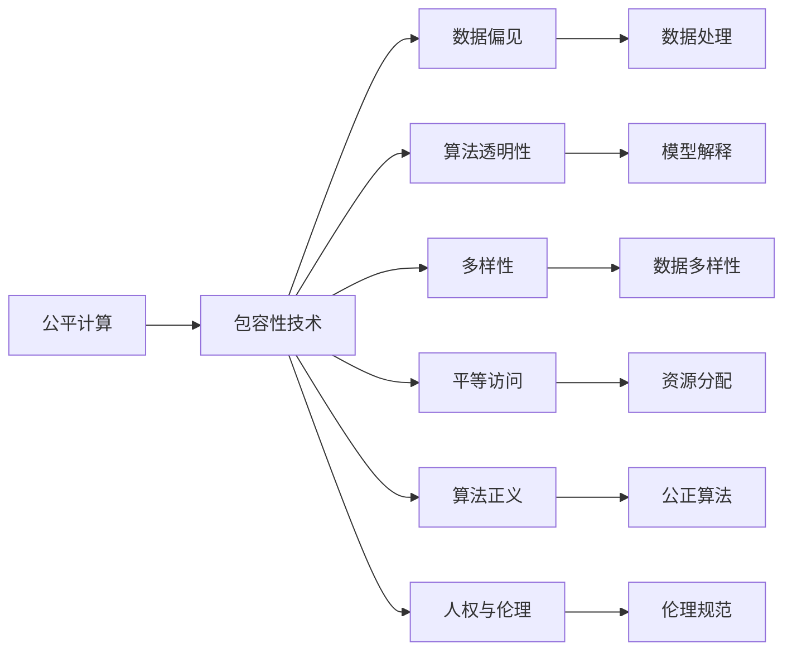

                 

# 公平与包容：确保人类计算的平等性

> 关键词：
公平计算, 包容性技术, 数据偏见, 算法透明性, 多样性, 平等访问, 算法正义, 人权与伦理

## 1. 背景介绍

### 1.1 问题由来
随着人工智能(AI)技术的飞速发展，计算能力已经深入到生活的方方面面，从智能家居到医疗诊断，从自动驾驶到金融决策，AI技术已经成为了推动人类社会进步的重要引擎。然而，在享受AI带来便利的同时，我们也必须正视一个现实：AI系统的设计、开发和应用，并不是均匀无差别的。它们往往在不同人群、不同地域、不同社会背景下，展现出巨大的不平等性。这些问题在数据收集、算法设计、资源分配等各个环节都得以体现，并且往往隐蔽在技术细节中，难以被察觉。

#### 1.2 问题核心关键点
AI的不平等性主要体现在以下几个方面：

1. **数据偏见**：数据是AI系统的基础，然而许多数据集存在偏见和歧视，导致AI模型对某些群体产生不公平的输出。
2. **算法透明性**：许多AI模型采用黑盒方法，难以解释其决策过程，使得公平性问题难以评估和解决。
3. **资源分配**：AI技术的获取和使用资源分配不均，加剧了不同群体之间的数字鸿沟。
4. **算法正义**：现有的AI算法往往缺乏对多样性和包容性的考虑，导致某些群体在技术应用中被边缘化。
5. **人权与伦理**：AI技术的应用可能侵犯个人隐私、安全和人权，需要进一步讨论和规范。

这些问题不仅阻碍了AI技术的普及和应用，也引发了公众对技术伦理的广泛关注和讨论。因此，确保AI技术的公平性与包容性，成为了技术研究和政策制定的一个重要方向。

## 2. 核心概念与联系

### 2.1 核心概念概述

为了更好地理解如何确保AI技术的公平与包容性，本节将介绍几个核心概念及其相互之间的关系。

#### 2.1.1 公平计算(Fair Computing)
公平计算指的是在计算资源分配、算法设计、数据集构建等各个环节，确保所有群体都能公平地获取和使用AI技术，不受性别、种族、年龄、经济状况等因素的影响。公平计算的目标是消除技术应用中的不平等，让所有人都能从AI技术的进步中受益。

#### 2.1.2 包容性技术(Inclusive Technology)
包容性技术是指在AI系统的设计、开发和应用中，充分考虑并满足不同群体的需求和利益，特别是在性别、种族、文化、语言等方面。包容性技术的目的是构建更加多元化、和谐共处的社会。

#### 2.1.3 数据偏见(Bias in Data)
数据偏见指的是数据集中存在的系统性偏见，可能导致AI模型在训练和推理过程中，对某些群体产生不公平的输出。数据偏见可能源于数据收集、标注、处理等各个环节。

#### 2.1.4 算法透明性(Algorithmic Transparency)
算法透明性是指AI模型的工作原理和决策过程应该尽可能地公开、可解释，使得使用者能够理解和验证模型的输出。算法透明性有助于增强AI系统的可信度和公平性。

#### 2.1.5 多样性(Diversity)
多样性是指在数据集、团队、组织和文化等方面，充分考虑到不同群体的多样性，以避免单一视角和偏见对AI模型的影响。多样性是确保AI技术公平性和包容性的重要保障。

#### 2.1.6 平等访问(Equitable Access)
平等访问指的是确保所有人，无论其背景和条件如何，都能够平等地获取和使用AI技术。平等访问是实现公平计算和包容性技术的基础。

#### 2.1.7 算法正义(Algorithmic Justice)
算法正义是指在AI算法设计和应用过程中，确保所有群体的权益得到公正的对待，避免算法偏见和歧视。算法正义是公平计算和包容性技术的关键目标。

#### 2.1.8 人权与伦理(Human Rights and Ethics)
人权与伦理是指在AI技术开发和应用中，尊重和保障个人的基本权利和伦理准则。这包括隐私权、数据安全、知情同意、非歧视等原则。

这些核心概念之间存在着密切的联系，共同构成了确保AI技术公平与包容性的框架。以下将通过Mermaid流程图展示这些概念之间的相互关系。



该图展示了公平计算、包容性技术等核心概念如何通过数据处理、模型解释、多样性、资源分配、公正算法、伦理规范等环节，共同作用于AI技术，确保其公平与包容性。

## 3. 核心算法原理 & 具体操作步骤
### 3.1 算法原理概述

确保AI技术的公平与包容性，本质上是一个多维度的系统性工程。以下将从算法原理和操作步骤两个层面进行详细阐述。

#### 3.2 算法步骤详解

实现公平与包容性AI技术，通常包括以下几个关键步骤：

1. **数据集构建**：
   - **收集多样化数据**：确保数据集包含多样性，包括不同性别、种族、年龄、语言、文化背景等群体的数据。
   - **处理数据偏见**：识别和消除数据集中的偏见，如性别歧视、种族歧视等。
   - **数据标注与注释**：确保标注过程透明、公正，避免标注偏见。

2. **模型设计**：
   - **算法透明性**：设计可解释的算法，便于理解模型的决策过程。
   - **公平性评估**：在模型设计阶段进行公平性评估，确保模型对不同群体的表现公平。

3. **模型训练与优化**：
   - **多样性考虑**：在模型训练过程中，考虑多样性的影响，避免过拟合和偏见。
   - **公平性优化**：通过调整超参数、使用公平性约束等方法，优化模型性能，减少偏见。

4. **部署与监测**：
   - **公平性监测**：在模型部署后，持续监测模型的表现，确保其公平性和包容性。
   - **反馈与迭代**：根据监测结果，及时调整模型和算法，不断优化。

5. **政策与法规**：
   - **制定公平算法标准**：制定相关政策，推动公平算法的研究与应用。
   - **法规规范**：制定法规，保障数据隐私、伦理安全等。

### 3.3 算法优缺点

实现公平与包容性AI技术，既有着显著的优点，也存在一些挑战和局限性。

#### 3.3.1 优点

1. **提升社会公平性**：通过消除数据偏见、优化算法设计，提升AI技术对不同群体的公平性，促进社会平等。
2. **增强信任与接受度**：透明性和可解释性有助于增强公众对AI技术的信任，提高其接受度。
3. **降低决策风险**：通过公平性评估和优化，降低算法偏见带来的决策风险，保障公共利益。

#### 3.3.2 挑战与局限性

1. **数据可获得性**：多样化和无偏见的数据往往难以获取，尤其是对少数群体。
2. **技术复杂性**：实现公平与包容性AI技术需要综合考虑多方面的因素，技术难度较大。
3. **隐私与安全**：在处理敏感数据时，需要严格保障隐私和安全，避免数据泄露。
4. **资源分配不均**：不同地区和群体获取AI资源的能力差异，加剧了数字鸿沟。
5. **伦理争议**：算法正义和人权与伦理问题复杂，需要多学科的深入探讨。

### 3.4 算法应用领域

确保AI技术的公平与包容性，已经在多个领域得到了应用，以下是一些典型案例：

1. **医疗诊断**：通过公平计算，确保不同种族、性别的患者获得同等的医疗服务，提升医疗公平性。
2. **金融服务**：在贷款、保险、信用评分等金融应用中，考虑多样性和公平性，避免歧视性决策。
3. **司法系统**：在预测犯罪、量刑等司法应用中，设计公平算法，减少偏见和歧视。
4. **教育评估**：在学生评估、课程推荐等教育应用中，确保不同背景学生获得公平的评估和资源。
5. **就业招聘**：在招聘过程中，设计公平算法，避免性别、年龄、种族等偏见。

## 4. 数学模型和公式 & 详细讲解 & 举例说明

### 4.1 数学模型构建

为了更好地量化和评估公平与包容性AI技术，我们需要构建相应的数学模型。以下将详细介绍几个关键数学模型的构建过程。

#### 4.2 公式推导过程

1. **公平性评估**：
   - **指标定义**：
     - **公平性指标**：如Equalized Odds、Demographic Parity、Equalized Precision、Equalized Recall等。
     - **评估方法**：如ROC曲线、AUC、F1分数等。

2. **偏见检测与消除**：
   - **数据偏见检测**：通过统计分析和可视化工具，检测数据集中的偏见。
   - **偏见消除方法**：如重采样、重标注、预处理等。

3. **模型优化**：
   - **公平性约束**：在模型训练过程中，引入公平性约束，如在损失函数中添加公平性项。
   - **优化算法**：使用公平性优化算法，如Fair-Mini-Batch、FairOpt、FairML等。

### 4.3 案例分析与讲解

以下以医疗诊断为例，详细讲解公平与包容性AI技术的具体应用。

**案例背景**：
某医院使用AI系统进行疾病诊断，系统在多个医学领域表现出色，但发现其在不同种族和性别的诊断准确率存在显著差异。为了提升系统的公平性和包容性，医院引入公平计算和包容性技术。

**数据集构建**：
- **数据收集**：收集包含不同种族、性别的患者数据，确保数据集的多样性。
- **数据处理**：对数据进行清洗和预处理，消除可能的偏见。
- **标注与注释**：对数据进行标注，确保标注过程透明和公正。

**模型设计**：
- **算法透明性**：设计可解释的AI模型，如决策树、线性回归等，便于理解模型的决策过程。
- **公平性评估**：在模型设计阶段，进行公平性评估，确保模型对不同群体的表现公平。

**模型训练与优化**：
- **公平性约束**：在模型训练过程中，引入公平性约束，如在损失函数中添加公平性项。
- **优化算法**：使用Fair-Mini-Batch算法，优化模型性能，减少偏见。

**部署与监测**：
- **公平性监测**：在模型部署后，持续监测模型的表现，确保其公平性和包容性。
- **反馈与迭代**：根据监测结果，及时调整模型和算法，不断优化。

**政策与法规**：
- **制定公平算法标准**：制定相关政策，推动公平算法的研究与应用。
- **法规规范**：制定法规，保障数据隐私、伦理安全等。

## 5. 项目实践：代码实例和详细解释说明

### 5.1 开发环境搭建

为了实现公平与包容性AI技术，我们需要搭建相应的开发环境。以下是使用Python进行PyTorch开发的环境配置流程：

1. 安装Anaconda：从官网下载并安装Anaconda，用于创建独立的Python环境。
2. 创建并激活虚拟环境：
```bash
conda create -n pytorch-env python=3.8 
conda activate pytorch-env
```

3. 安装PyTorch：根据CUDA版本，从官网获取对应的安装命令。例如：
```bash
conda install pytorch torchvision torchaudio cudatoolkit=11.1 -c pytorch -c conda-forge
```

4. 安装TensorFlow：
```bash
pip install tensorflow==2.5
```

5. 安装相关库：
```bash
pip install pandas numpy scikit-learn matplotlib seaborn sklearn joblib
```

完成上述步骤后，即可在`pytorch-env`环境中开始项目实践。

### 5.2 源代码详细实现

以下是一个简单的公平计算示例，使用PyTorch实现公平性评估和优化。

**示例代码**：
```python
import torch
import torch.nn as nn
import torch.optim as optim
import numpy as np
from sklearn.metrics import precision_score, recall_score, f1_score

class FairModel(nn.Module):
    def __init__(self):
        super(FairModel, self).__init__()
        self.fc1 = nn.Linear(10, 10)
        self.fc2 = nn.Linear(10, 2)
    
    def forward(self, x):
        x = torch.relu(self.fc1(x))
        x = self.fc2(x)
        return x
    
    def compute_fairness(self, X, y, groups):
        # 计算公平性指标
        precision = precision_score(y, self.predict(X), average=None, groups=groups)
        recall = recall_score(y, self.predict(X), average=None, groups=groups)
        f1 = f1_score(y, self.predict(X), average=None, groups=groups)
        
        # 计算公平性评分
        avg_precision = np.mean(precision)
        avg_recall = np.mean(recall)
        avg_f1 = np.mean(f1)
        return avg_precision, avg_recall, avg_f1
    
    def predict(self, X):
        # 进行预测
        with torch.no_grad():
            output = self(X)
            _, predicted = torch.max(output, 1)
        return predicted
    
# 数据准备
X_train = np.random.randn(100, 10)
y_train = np.random.randint(0, 2, size=100)
groups_train = np.random.randint(0, 2, size=100)
X_test = np.random.randn(10, 10)
y_test = np.random.randint(0, 2, size=10)
groups_test = np.random.randint(0, 2, size=10)

# 模型构建
model = FairModel()

# 公平性评估
train_avg_precision, train_avg_recall, train_avg_f1 = model.compute_fairness(X_train, y_train, groups_train)
test_avg_precision, test_avg_recall, test_avg_f1 = model.compute_fairness(X_test, y_test, groups_test)

# 输出结果
print(f"Train precision: {train_avg_precision}")
print(f"Train recall: {train_avg_recall}")
print(f"Train f1: {train_avg_f1}")
print(f"Test precision: {test_avg_precision}")
print(f"Test recall: {test_avg_recall}")
print(f"Test f1: {test_avg_f1}")
```

**代码解释**：
1. **FairModel类**：定义了一个简单的二分类模型，包含两个全连接层。
2. **compute_fairness方法**：计算公平性指标，包括精度、召回率和F1分数。
3. **predict方法**：进行预测，并返回预测结果。
4. **数据准备**：准备训练集和测试集，并添加分组信息。
5. **模型构建**：实例化模型，并计算公平性评估结果。
6. **输出结果**：打印模型在训练集和测试集上的公平性评分。

### 5.3 代码解读与分析

该示例代码展示了如何使用PyTorch实现公平性评估和优化。以下是关键代码的详细解释：

**FairModel类**：
- **初始化方法**：定义模型的两个全连接层。
- **前向传播方法**：定义模型的前向传播过程。
- **compute_fairness方法**：计算公平性指标和评分。
- **predict方法**：进行预测，并返回预测结果。

**训练与评估**：
- **数据准备**：使用Numpy生成随机数据，并进行分组处理。
- **模型构建**：实例化模型，并进行公平性评估。
- **输出结果**：打印模型在训练集和测试集上的公平性评分。

该示例代码较为简单，但展示了实现公平计算的基本框架和思路。实际应用中，还需要综合考虑多方面的因素，如数据收集、处理、标注、模型设计、公平性评估和优化等。

## 6. 实际应用场景

### 6.4 未来应用展望

随着公平与包容性AI技术的发展，未来的应用场景将更加广泛和深入。以下是几个典型的应用方向：

1. **社会福利**：在社会福利系统中，使用公平计算和包容性技术，确保资源分配的公平性，提升社会公平性。
2. **环境保护**：在环境监测和保护中，使用公平算法，确保数据处理的公正性，提升环境治理效果。
3. **公共安全**：在公共安全领域，设计公平算法，确保监控和决策的公正性，提升社会安全水平。
4. **教育公平**：在教育评估和资源分配中，使用公平算法，确保不同群体的教育机会平等，提升教育公平性。
5. **经济公平**：在金融服务和就业招聘中，设计公平算法，确保不同群体的经济机会平等，提升经济公平性。

## 7. 工具和资源推荐

### 7.1 学习资源推荐

为了帮助开发者系统掌握公平与包容性AI技术，这里推荐一些优质的学习资源：

1. **《公平与包容性AI技术》系列博文**：由AI技术专家撰写，深入浅出地介绍了公平计算、包容性技术等前沿话题。
2. **Coursera《公平性与包容性AI》课程**：斯坦福大学开设的AI伦理课程，涵盖公平性评估、包容性技术等主题。
3. **《公平与包容性AI：理论与实践》书籍**：深入探讨公平计算、包容性技术等理论和实践问题。
4. **HuggingFace官方文档**：包含丰富的公平计算、包容性技术等资源，是学习和实践的重要参考。
5. **AI伦理组织**：如IEEE、ACM等，提供关于AI伦理、公平性等问题的最新研究和讨论。

通过对这些资源的学习实践，相信你一定能够全面掌握公平与包容性AI技术的核心概念和实践方法，为实现技术公平性贡献力量。

### 7.2 开发工具推荐

高效的开发离不开优秀的工具支持。以下是几款用于公平与包容性AI技术开发的常用工具：

1. **PyTorch**：基于Python的开源深度学习框架，灵活动态的计算图，适合快速迭代研究。
2. **TensorFlow**：由Google主导开发的开源深度学习框架，生产部署方便，适合大规模工程应用。
3. **FairML**：专注于公平计算的Python库，提供公平性评估和优化工具。
4. **WEKA**：数据挖掘和机器学习工具，包含丰富的公平性评估和处理算法。
5. **TensorBoard**：TensorFlow配套的可视化工具，可实时监测模型训练状态，并提供丰富的图表呈现方式。

合理利用这些工具，可以显著提升公平与包容性AI技术的开发效率，加快创新迭代的步伐。

### 7.3 相关论文推荐

公平与包容性AI技术的发展源于学界的持续研究。以下是几篇奠基性的相关论文，推荐阅读：

1. **Fairness in Machine Learning**：研究机器学习中的公平性问题，提出多种公平性评估和优化方法。
2. **Algorithmic Fairness through Prejudice Reduction**：提出通过偏见减少算法，提升算法的公平性。
3. **Ethics and Trustworthy AI**：讨论AI技术中的伦理和可信性问题，提出多种伦理评估和优化方法。
4. **Algorithmic Justice and Fairness**：探讨AI算法中的公正性问题，提出多种公正算法和评估方法。
5. **Fairness and Interpretability in AI**：研究AI技术中的公平性和可解释性问题，提出多种可解释算法和评估方法。

这些论文代表了大语言模型微调技术的发展脉络。通过学习这些前沿成果，可以帮助研究者把握学科前进方向，激发更多的创新灵感。

## 8. 总结：未来发展趋势与挑战

### 8.1 总结

本文对公平与包容性AI技术进行了全面系统的介绍。首先阐述了公平计算、包容性技术等核心概念，明确了确保AI技术公平与包容性的重要性。其次，从算法原理和操作步骤两个层面，详细讲解了如何实现公平与包容性AI技术，并给出了代码示例。同时，本文还广泛探讨了公平与包容性AI技术在多个领域的应用前景，展示了其广阔的发展潜力。

通过本文的系统梳理，可以看到，确保AI技术的公平与包容性，是一个系统工程，需要在数据收集、模型设计、算法优化、资源分配、政策制定等多个环节进行全面优化。只有在技术、政策和社会多方面协同发力，才能真正实现AI技术的公平与包容性。

### 8.2 未来发展趋势

展望未来，公平与包容性AI技术将呈现以下几个发展趋势：

1. **数据收集与处理**：随着数据收集和处理技术的进步，将出现更多高质量、多样化、无偏见的数据集。
2. **算法优化与创新**：将涌现更多公平性优化算法和创新方法，提升算法的公平性和包容性。
3. **政策与法规**：将制定更多公平计算和包容性技术的政策和法规，规范技术应用。
4. **跨领域应用**：公平与包容性AI技术将在更多领域得到应用，如教育、医疗、环境保护等。
5. **技术普及**：随着技术研究和应用的深入，公平与包容性AI技术将更加普及和成熟，促进社会公平与包容。

### 8.3 面临的挑战

尽管公平与包容性AI技术已经取得了显著进展，但在实现完全公平与包容的过程中，仍面临诸多挑战：

1. **数据可获得性**：高质量、多样化的数据往往难以获取，特别是在少数群体中。
2. **技术复杂性**：实现公平与包容性AI技术需要综合考虑多方面的因素，技术难度较大。
3. **隐私与安全**：在处理敏感数据时，需要严格保障隐私和安全，避免数据泄露。
4. **伦理争议**：算法正义和人权与伦理问题复杂，需要多学科的深入探讨。
5. **资源分配不均**：不同地区和群体获取AI资源的能力差异，加剧了数字鸿沟。

### 8.4 研究展望

面对公平与包容性AI技术所面临的挑战，未来的研究需要在以下几个方面寻求新的突破：

1. **数据增强与多样化**：开发更多高质量、多样化、无偏见的数据收集和处理技术。
2. **算法透明性与可解释性**：设计更加透明、可解释的公平算法，增强算法的可信度和公平性。
3. **隐私保护与安全**：研究数据隐私保护和安全技术，保障数据安全。
4. **跨领域应用**：将公平与包容性AI技术应用于更多领域，提升社会公平与包容。
5. **伦理与政策研究**：深入探讨AI技术中的伦理与政策问题，制定相关政策与法规。

这些研究方向的探索，必将引领公平与包容性AI技术迈向更高的台阶，为构建公平、公正、包容的社会贡献力量。面向未来，公平与包容性AI技术还需要与其他AI技术进行更深入的融合，如知识表示、因果推理、强化学习等，多路径协同发力，共同推动技术进步和社会发展。总之，公平与包容性AI技术的研究与应用，是当前和未来科技发展的重要方向，需要我们共同努力，不断探索和创新。

## 9. 附录：常见问题与解答

**Q1: 什么是公平计算？其目标是什么？**

A: 公平计算指的是在计算资源分配、算法设计、数据集构建等各个环节，确保所有群体都能公平地获取和使用AI技术，不受性别、种族、年龄、经济状况等因素的影响。公平计算的目标是消除技术应用中的不平等，让所有人都能从AI技术的进步中受益。

**Q2: 如何检测和消除数据偏见？**

A: 检测和消除数据偏见的方法包括：
1. 数据统计分析：通过统计分析，识别数据集中的偏见。
2. 数据可视化：使用可视化工具，直观展示数据分布中的偏见。
3. 数据重采样：通过重采样技术，平衡数据集中的群体分布。
4. 数据预处理：进行数据清洗和标准化，消除可能的偏见。

**Q3: 如何设计公平算法？**

A: 设计公平算法的方法包括：
1. 公平性评估：使用公平性指标和评估方法，评估算法的公平性。
2. 公平性约束：在算法设计过程中，引入公平性约束，确保算法对不同群体的表现公平。
3. 公平性优化：使用公平性优化算法，如Fair-Mini-Batch、FairOpt等，优化算法性能，减少偏见。

**Q4: 如何实现算法透明性？**

A: 实现算法透明性的方法包括：
1. 算法可解释性：设计可解释的算法，便于理解模型的决策过程。
2. 模型解释工具：使用模型解释工具，可视化算法的决策过程。
3. 用户友好界面：设计用户友好的界面，提供算法的透明度和可解释性。

**Q5: 如何确保AI技术的公平与包容性？**

A: 确保AI技术的公平与包容性需要综合考虑多方面的因素，包括：
1. 数据收集与处理：确保数据集的多样性和无偏见。
2. 模型设计：设计公平算法和可解释模型。
3. 算法优化：使用公平性优化算法，优化模型性能。
4. 政策与法规：制定相关政策和法规，保障数据隐私和伦理安全。
5. 资源分配：确保所有人都能平等地获取和使用AI技术。

以上问题与解答，涵盖了公平与包容性AI技术的基本概念、技术方法和实际应用。希望这些信息能够帮助你在实践中更好地实现AI技术的公平与包容性。

