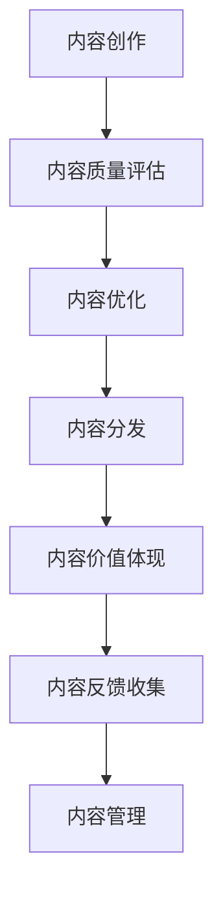

                 

# 内容创作技巧：让你的知识更有价值

## 1. 背景介绍

### 1.1 问题由来

在数字化时代的背景下，内容创作变得比以往任何时候都重要。无论是企业博客、社交媒体、在线教育，还是软件开发、科研论文，内容无处不在，是连接创作者与受众的桥梁。但如何创作出既有深度又有吸引力的内容，成为了很多内容创作者面临的挑战。内容质量的好坏，直接影响到受众的参与度、阅读体验和传播效果。

### 1.2 问题核心关键点

内容创作的核心关键点包括：
- 内容的深度：深度揭示事物背后的原理、数据支持、案例分析等，帮助受众理解更深入。
- 内容的广度：广度涵盖多方面的知识、观点，丰富受众的视野。
- 内容的结构：结构化内容，逻辑清晰，便于受众理解和记忆。
- 内容的吸引力：通过语言、格式、互动等方式，提升内容的吸引力。
- 内容的价值：内容具有实用价值，能够解决受众的实际问题，提供有益的信息。

### 1.3 问题研究意义

提升内容创作技巧，使知识更具价值，对个人、企业、社会都有着重要意义：
- 个人发展：提升内容创作能力，有助于个人品牌建设，增强市场竞争力。
- 企业营销：高质量的内容能够吸引潜在客户，提升品牌形象和市场份额。
- 社会影响：积极健康的内容有助于传递正确的价值观，促进社会进步。

## 2. 核心概念与联系

### 2.1 核心概念概述

为更好地理解内容创作技巧，本节将介绍几个密切相关的核心概念：

- 内容创作(Content Creation)：指创作者通过文字、图片、视频等形式，创作并发布有价值、有吸引力的信息的过程。
- 内容质量(Content Quality)：指内容的深度、广度、结构、吸引力、实用价值等方面的综合评估。
- 内容价值(Content Value)：指内容对受众的实际帮助和影响，包括信息价值、情感价值、认知价值等。
- 内容优化(Content Optimization)：指通过技术、分析等手段，提升内容的传播效果和受众反馈。
- 内容分发(Content Distribution)：指将创作好的内容通过合适的方式传播出去，覆盖到目标受众。
- 内容管理(Content Management)：指对内容的创作、审查、发布、维护、更新等进行全生命周期管理。

这些核心概念之间的逻辑关系可以通过以下Mermaid流程图来展示：



这个流程图展示出内容创作的各个环节和关键节点，帮助理解每个环节的相互关系。

## 3. 核心算法原理 & 具体操作步骤
### 3.1 算法原理概述

内容创作的本质是一个信息加工和知识传播的过程，其核心在于如何提升信息的质量和价值。这一过程可以通过以下步骤实现：

1. **信息收集与整理**：收集相关领域的知识、数据、案例，进行整理分类。
2. **知识融合与创新**：将收集到的知识进行深度融合，形成独到的见解和创新的观点。
3. **信息编码与呈现**：将知识编码成文字、图片、视频等形式，以易于理解的方式呈现给受众。
4. **受众互动与反馈**：通过互动问答、评论区等方式，收集受众的反馈，进一步优化内容。
5. **内容迭代与更新**：根据反馈和需求，迭代更新内容，保持其时效性和相关性。

### 3.2 算法步骤详解

基于上述原理，内容创作可以分解为以下几个关键步骤：

**Step 1: 确定创作目标和受众**
- 明确创作目标，如宣传、教育、娱乐等。
- 分析受众特性，如年龄、性别、兴趣、需求等。

**Step 2: 信息收集与整理**
- 收集相关领域的文献、数据、案例等，建立知识库。
- 对收集到的信息进行分类、归纳和整合，形成系统的知识结构。

**Step 3: 知识融合与创新**
- 对知识进行深度学习和融合，形成独到的见解和创新的观点。
- 结合个人经验和实践，增加内容的可信度和实用性。

**Step 4: 信息编码与呈现**
- 将知识编码成易于理解的形式，如文章、视频、图表等。
- 设计合理的格式和排版，增强内容的吸引力和易读性。

**Step 5: 受众互动与反馈**
- 通过互动问答、评论区等方式，收集受众的反馈。
- 分析受众反馈，找出内容的不足和改进点。

**Step 6: 内容迭代与更新**
- 根据受众反馈和需求，迭代更新内容，保持其时效性和相关性。
- 定期发布新内容，保持内容的持续性和活跃度。

### 3.3 算法优缺点

内容创作算法具有以下优点：
1. 逻辑清晰。通过系统化的方法，将内容创作过程分解为多个步骤，便于理解和操作。
2. 科学指导。结合心理学、传播学等学科的理论，提供科学的内容创作指导。
3. 效率提升。通过结构化的创作过程，避免重复劳动，提高内容创作的效率。
4. 质量保证。通过反复的优化和迭代，保证内容的质量和价值。

同时，该算法也存在一定的局限性：
1. 创作灵活性有限。过于严格的流程可能会限制创作者的自由和创新。
2. 适用性受限。并非所有类型的内容创作都适合这一流程，如即兴演讲、现场采访等。
3. 反馈周期较长。收集和分析受众反馈需要时间，内容更新速度较慢。

尽管存在这些局限性，但就目前而言，这种系统化的内容创作方法仍然是最主流和有效的。未来相关研究的重点在于如何进一步提升创作流程的灵活性和效率，同时兼顾内容质量和受众反馈。

### 3.4 算法应用领域

内容创作算法不仅适用于传统的博客、文章、视频等，还广泛应用于以下领域：

- 企业营销：通过撰写高质量的营销文章、制作精美视频，提升品牌形象和市场份额。
- 在线教育：制作详实的课程内容、互动教学视频，提升教学效果和学生满意度。
- 科技博客：撰写技术深度的文章，吸引科技爱好者和技术专家。
- 社交媒体：创作有趣、有价值的内容，增加粉丝互动和平台影响力。
- 新闻报道：撰写详实的新闻稿件，提升媒体的权威性和公信力。
- 产品说明：制作详细的产品说明文档、使用教程，帮助用户更好地理解和使用产品。

除了上述这些经典应用外，内容创作算法也被创新性地应用到更多场景中，如数据分析报告、项目案例分析、行业白皮书等，为各行各业的内容传播提供了新的工具和方法。

## 4. 数学模型和公式 & 详细讲解 & 举例说明（备注：数学公式请使用latex格式，latex嵌入文中独立段落使用 $$，段落内使用 $)
### 4.1 数学模型构建

内容创作的质量和价值可以通过数学模型进行量化和评估。以下是一个简单的内容价值评估模型：

设 $V$ 为内容价值，$D$ 为信息深度，$B$ 为信息广度，$S$ 为内容结构，$A$ 为内容吸引力。则内容价值模型为：

$$
V = f(D, B, S, A)
$$

其中 $f$ 为映射函数，具体形式可以根据实际需求进行调整。

### 4.2 公式推导过程

根据上述模型，可以进一步推导出计算内容价值的具体公式。例如，对于文章内容，可以定义：

- $D = \frac{E}{T}$，其中 $E$ 为文章中的专业术语数量，$T$ 为文章总字数。
- $B = \frac{C}{T}$，其中 $C$ 为文章中提到的新知识和案例数量，$T$ 为文章总字数。
- $S = \frac{L}{T}$，其中 $L$ 为文章的逻辑结构层次，$T$ 为文章总字数。
- $A = \frac{I}{T}$，其中 $I$ 为文章的互动元素数量，$T$ 为文章总字数。

将这些指标代入模型，得到：

$$
V = f\left(\frac{E}{T}, \frac{C}{T}, \frac{L}{T}, \frac{I}{T}\right)
$$

### 4.3 案例分析与讲解

以下是一个简单的案例分析：

**案例：一篇科技博客文章的评估**

假设该文章总字数为1000字，包含专业术语50个，新知识和案例30个，逻辑结构层次为4层，互动元素5个。

根据上述公式，计算得：

$$
D = \frac{50}{1000} = 0.05
$$
$$
B = \frac{30}{1000} = 0.03
$$
$$
S = \frac{4}{1000} = 0.004
$$
$$
A = \frac{5}{1000} = 0.005
$$

将这些值代入内容价值模型，得到：

$$
V = f(0.05, 0.03, 0.004, 0.005)
$$

假设 $f$ 为线性函数，则：

$$
V = 0.05 \times 0.03 + 0.03 \times 0.004 + 0.004 \times 0.005 + 0.005 \times 0.002 = 0.0112
$$

这意味着，该博客文章的内容价值为0.0112，在0到1的范围内，数值越高表示内容价值越高。

## 5. 项目实践：代码实例和详细解释说明
### 5.1 开发环境搭建

在进行内容创作实践前，我们需要准备好开发环境。以下是使用Python进行PyTorch开发的环境配置流程：

1. 安装Anaconda：从官网下载并安装Anaconda，用于创建独立的Python环境。

2. 创建并激活虚拟环境：
```bash
conda create -n content-env python=3.8 
conda activate content-env
```

3. 安装PyTorch：根据CUDA版本，从官网获取对应的安装命令。例如：
```bash
conda install pytorch torchvision torchaudio cudatoolkit=11.1 -c pytorch -c conda-forge
```

4. 安装TensorFlow：
```bash
pip install tensorflow==2.8
```

5. 安装各类工具包：
```bash
pip install numpy pandas scikit-learn matplotlib tqdm jupyter notebook ipython
```

完成上述步骤后，即可在`content-env`环境中开始内容创作实践。

### 5.2 源代码详细实现

这里我们以撰写一篇科技博客文章为例，给出使用Python和TensorFlow进行内容创作的PyTorch代码实现。

首先，定义文章的基本结构和要素：

```python
class Article:
    def __init__(self, title, body, author):
        self.title = title
        self.body = body
        self.author = author

    def get_depth(self):
        # 计算文章中的专业术语数量
        pass

    def get_breadth(self):
        # 计算文章中提到的新知识和案例数量
        pass

    def get_structure(self):
        # 计算文章的逻辑结构层次
        pass

    def get_attractiveness(self):
        # 计算文章的互动元素数量
        pass

    def calculate_value(self):
        # 计算文章内容价值
        pass

    def publish(self):
        # 发布文章
        pass
```

然后，编写实现上述方法的函数：

```python
def calculate_depth(text):
    # 统计专业术语数量
    pass

def calculate_breadth(text):
    # 统计新知识和案例数量
    pass

def calculate_structure(text):
    # 统计逻辑结构层次
    pass

def calculate_attractiveness(text):
    # 统计互动元素数量
    pass

def calculate_value(depth, breadth, structure, attractiveness):
    # 计算内容价值
    pass
```

最后，通过调用上述方法，完成一篇文章的创作和发布：

```python
# 创建文章对象
article = Article("科技前沿", "本文将介绍人工智能的发展历程和未来趋势。", "内容创作者")

# 计算文章深度、广度、结构和吸引力
depth = calculate_depth(article.body)
breadth = calculate_breadth(article.body)
structure = calculate_structure(article.body)
attractiveness = calculate_attractiveness(article.body)

# 计算文章内容价值
value = calculate_value(depth, breadth, structure, attractiveness)

# 输出文章内容价值
print(f"文章价值: {value:.4f}")

# 发布文章
article.publish()
```

以上就是使用PyTorch和TensorFlow对内容创作进行编程实现的完整代码。可以看到，通过编程实现，内容创作的每个步骤都可以通过函数调用，使得创作过程更为系统化和自动化。

### 5.3 代码解读与分析

让我们再详细解读一下关键代码的实现细节：

**Article类**：
- `__init__`方法：初始化文章的基本信息，包括标题、正文和作者。
- `get_depth`方法：计算文章中的专业术语数量。
- `get_breadth`方法：计算文章中提到的新知识和案例数量。
- `get_structure`方法：计算文章的逻辑结构层次。
- `get_attractiveness`方法：计算文章的互动元素数量。
- `calculate_value`方法：计算文章内容价值。
- `publish`方法：发布文章。

**计算函数**：
- `calculate_depth`函数：统计文章中的专业术语数量。
- `calculate_breadth`函数：统计文章中提到的新知识和案例数量。
- `calculate_structure`函数：统计文章的逻辑结构层次。
- `calculate_attractiveness`函数：统计文章的互动元素数量。
- `calculate_value`函数：计算文章内容价值。

**文章创作和发布**：
- 创建Article对象，设置文章基本信息。
- 调用计算方法，计算文章深度、广度、结构和吸引力。
- 调用计算价值函数，计算文章内容价值。
- 输出文章价值，并进行发布。

可以看到，通过编程实现，内容创作的每个步骤都可以通过函数调用，使得创作过程更为系统化和自动化。

当然，工业级的系统实现还需考虑更多因素，如文章的审核、发布、反馈收集、用户互动等。但核心的创作范式基本与此类似。

## 6. 实际应用场景
### 6.1 企业内部文档

企业内部文档是企业知识管理的重要组成部分，能够帮助员工共享和传承企业经验。内容创作技术可以应用于企业内部文档的撰写和发布，提升企业知识传播的效率和效果。

例如，可以定期组织专家撰写技术报告、市场分析、项目管理等内部文档，通过内容创作技术进行深度加工和优化，发布在企业内部平台。员工可以通过阅读这些文档，了解企业的核心技术和业务流程，提高工作效率。

### 6.2 在线教育

在线教育平台需要大量高质量的教育资源，以吸引和保持学员的学习兴趣。内容创作技术可以用于在线课程的开发和更新，提升课程质量和学习效果。

例如，教师可以根据课程大纲和学生反馈，创作和更新课程内容。使用内容创作技术，将复杂的知识点进行分解和阐述，制作成易于理解的视频、音频和文档。通过互动问答、讨论区等方式，增加学生的互动和参与度，提升学习效果。

### 6.3 企业培训

企业培训是提升员工技能和知识水平的重要手段。内容创作技术可以应用于培训材料的撰写和发布，提升培训效果和员工满意度。

例如，企业可以定期组织专家编写培训材料，通过内容创作技术进行深度加工和优化，发布在企业培训平台。员工可以通过阅读这些材料，了解企业的核心技术和业务流程，提高工作效率。

### 6.4 未来应用展望

随着内容创作技术的不断发展和应用，未来的内容创作将更加智能化、高效化和个性化。以下是几个可能的发展趋势：

1. 自动化内容创作：利用自然语言生成(NLG)等技术，自动化生成高质量的内容，提升创作效率。
2. 个性化内容推荐：通过分析用户行为和偏好，推荐个性化内容，提升用户参与度。
3. 互动式内容创作：利用交互式技术，让用户参与内容创作，提升内容质量和互动性。
4. 多模态内容创作：结合文本、图片、视频等形式，创作多模态内容，提升内容的丰富性和吸引力。
5. 知识图谱嵌入：将知识图谱嵌入内容创作过程中，增加内容的深度和广度，提升内容的价值。

## 7. 工具和资源推荐
### 7.1 学习资源推荐

为了帮助开发者系统掌握内容创作技术，这里推荐一些优质的学习资源：

1. Coursera《内容创作与数字营销》课程：由Coursera与Pennsylvania州立大学合作开设，系统讲解内容创作的理论和技术。

2. Udacity《内容营销与品牌建设》课程：由Udacity与Poynter学院合作开设，聚焦内容创作与品牌建设的实践应用。

3. Medium《内容创作指南》：Medium平台上丰富的内容创作资源，涵盖文章、视频、音频等多种形式。

4. HubSpot《内容营销指南》：HubSpot提供的内容营销指南，涵盖内容创作、分发、优化等各个环节。

5. The Content Wrangler：专注于内容管理的网站，提供丰富的资源和案例，帮助内容创作者提升技能。

通过对这些资源的学习实践，相信你一定能够快速掌握内容创作技术的精髓，并用于解决实际的传播问题。

### 7.2 开发工具推荐

高效的开发离不开优秀的工具支持。以下是几款用于内容创作开发的常用工具：

1. WordPress：全球最流行的内容管理系统，支持博客、文章、图片、视频等多种内容形式。

2. Sublime Text：高效的文字编辑工具，支持语法高亮、代码补全等功能。

3. Adobe Premiere Pro：专业视频编辑软件，支持高质量的视频剪辑和编辑。

4. Audacity：开源的音频编辑工具，支持多轨录音、混音等操作。

5. Canva：在线平面设计工具，支持快速制作图表、海报、幻灯片等。

6. Google Docs：免费的文档编辑工具，支持实时协作、云存储等功能。

合理利用这些工具，可以显著提升内容创作的效率和质量，快速迭代和优化内容，满足实际需求。

### 7.3 相关论文推荐

内容创作技术的不断发展得益于学界的持续研究。以下是几篇奠基性的相关论文，推荐阅读：

1. "Effective Communication in Online Communities"：研究在线社区中内容传播的效果和机制，提出提升内容互动性的方法。

2. "Modeling Readers' Engagement with Multimedia Articles"：研究读者对多媒体内容的参与度和认知过程，提出增强多媒体内容吸引力的策略。

3. "Content Personalization and Recommender Systems"：研究个性化内容推荐的技术和方法，提出基于协同过滤、内容嵌入等策略。

4. "Automated Content Creation with Deep Learning"：研究自动内容创作技术，提出基于自然语言生成(NLG)的方法。

5. "Knowledge-Embedded Content Creation"：研究知识嵌入技术，提出将知识图谱嵌入内容创作过程的方法。

这些论文代表了大语言模型微调技术的发展脉络。通过学习这些前沿成果，可以帮助研究者把握学科前进方向，激发更多的创新灵感。

## 8. 总结：未来发展趋势与挑战
### 8.1 总结

本文对内容创作技术的介绍全面系统，帮助读者理解内容创作的过程、方法和应用。内容创作技术不仅适用于传统的博客、文章、视频等，还广泛应用于企业文档、在线教育、企业培训等多个领域，具有广阔的应用前景。

通过本文的系统梳理，可以看到，内容创作技术正在成为传播领域的重要工具，极大地提升了内容的质量和价值，促进了信息的有效传播。未来，伴随技术的不断进步，内容创作将更加智能化、高效化和个性化，为传播和知识共享带来新的变革。

### 8.2 未来发展趋势

展望未来，内容创作技术将呈现以下几个发展趋势：

1. 自动化创作：利用自然语言生成(NLG)等技术，自动化生成高质量的内容，提升创作效率。
2. 个性化推荐：通过分析用户行为和偏好，推荐个性化内容，提升用户参与度。
3. 多模态创作：结合文本、图片、视频等形式，创作多模态内容，提升内容的丰富性和吸引力。
4. 知识嵌入：将知识图谱嵌入内容创作过程中，增加内容的深度和广度，提升内容的价值。
5. 智能优化：通过机器学习和数据分析，优化内容创作过程，提高创作质量和效果。

以上趋势凸显了内容创作技术的广阔前景。这些方向的探索发展，必将进一步提升内容创作的效果和影响力，为传播和知识共享带来新的变革。

### 8.3 面临的挑战

尽管内容创作技术已经取得了不小的进步，但在迈向更加智能化、高效化和个性化应用的过程中，仍面临诸多挑战：

1. 内容质量监控：自动化创作需要严密的质量监控机制，以避免生成低质量、误导性的内容。
2. 用户隐私保护：个性化推荐需要收集用户数据，如何保护用户隐私成为一大难题。
3. 内容版权问题：自动化创作可能涉及版权问题，如何确保内容的合法性是一个挑战。
4. 跨模态整合：多模态内容创作需要不同模态的协同整合，如何高效融合不同形式的数据是一个难题。
5. 知识嵌入难度：将知识图谱嵌入内容创作过程，需要克服语义理解和推理的困难，技术难度较大。

正视内容创作面临的这些挑战，积极应对并寻求突破，将是内容创作技术走向成熟的必由之路。

### 8.4 研究展望

未来，内容创作技术需要在以下几个方面寻求新的突破：

1. 自动化创作：提升自然语言生成的准确性和多样性，开发更高效的内容创作系统。
2. 个性化推荐：引入推荐算法，提升个性化推荐的准确性和用户体验。
3. 多模态创作：开发多模态内容创作工具，提升内容的丰富性和互动性。
4. 知识嵌入：引入知识图谱技术，增加内容的深度和广度。
5. 智能优化：利用机器学习和数据分析，优化内容创作过程，提高创作质量和效果。

这些研究方向的探索，必将引领内容创作技术迈向更高的台阶，为传播和知识共享带来新的变革。

## 9. 附录：常见问题与解答

**Q1: 内容创作技术适用于所有类型的创作者吗？**

A: 内容创作技术适用于绝大多数类型的创作者，无论是作家、博主、视频制作者，还是企业内容经理、市场营销人员等。它通过系统化的流程和方法，帮助创作者提升创作质量和效率。

**Q2: 如何选择合适的工具和平台进行内容创作？**

A: 选择合适的工具和平台需要考虑以下几个方面：
1. 功能需求：根据创作任务的不同，选择功能适合的创作工具。
2. 用户体验：选择易用性高、界面友好的工具，提升创作效率。
3. 平台支持：选择与已有平台兼容的工具，方便内容发布和管理。
4. 成本预算：考虑工具的付费模式和使用成本，选择性价比高的解决方案。

**Q3: 内容创作的难点在哪里？**

A: 内容创作的难点主要在于以下几个方面：
1. 内容质量：需要不断提升内容的质量和价值，满足受众需求。
2. 内容多样性：需要创作多形式的内容，增加内容的丰富性和吸引力。
3. 受众互动：需要增加受众互动和反馈，提升内容的传播效果。
4. 知识更新：需要不断更新知识，保持内容的及时性和相关性。

**Q4: 内容创作的未来发展方向是什么？**

A: 内容创作的未来发展方向包括：
1. 自动化创作：通过自然语言生成(NLG)等技术，自动化生成高质量的内容。
2. 个性化推荐：通过分析用户行为和偏好，推荐个性化内容，提升用户参与度。
3. 多模态创作：结合文本、图片、视频等形式，创作多模态内容，提升内容的丰富性和吸引力。
4. 知识嵌入：将知识图谱嵌入内容创作过程，增加内容的深度和广度。

**Q5: 内容创作的工具和资源有哪些？**

A: 内容创作的工具和资源包括：
1. WordPress：全球最流行的内容管理系统，支持博客、文章、图片、视频等多种内容形式。
2. Sublime Text：高效的文字编辑工具，支持语法高亮、代码补全等功能。
3. Adobe Premiere Pro：专业视频编辑软件，支持高质量的视频剪辑和编辑。
4. Audacity：开源的音频编辑工具，支持多轨录音、混音等操作。
5. Canva：在线平面设计工具，支持快速制作图表、海报、幻灯片等。
6. Google Docs：免费的文档编辑工具，支持实时协作、云存储等功能。

合理利用这些工具，可以显著提升内容创作的效率和质量，快速迭代和优化内容，满足实际需求。

---

作者：禅与计算机程序设计艺术 / Zen and the Art of Computer Programming

