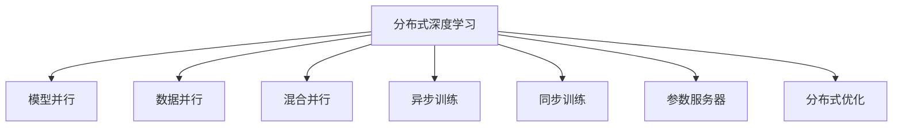

                 

# 分布式AI训练最佳实践

> 关键词：分布式深度学习, AI训练, 分布式训练框架, 模型并行, 数据并行, 混合并行, 异步训练, 同步训练, 参数服务器, 分布式优化, AI模型训练, 高性能计算

## 1. 背景介绍

### 1.1 问题由来
随着深度学习模型在各个领域的广泛应用，模型参数量不断增大，模型训练所需的计算资源也迅速增加。对于超大规模深度学习模型，单机的训练能力和效率已经无法满足需求。分布式深度学习训练成为解决这一问题的重要方法。

分布式深度学习训练通过将模型参数分布在多个计算节点上进行并行计算，可以大幅度提高训练效率，缩短模型训练时间。同时，分布式训练框架还可以灵活扩展计算资源，实现模型快速迭代和优化。

但分布式深度学习训练也面临着诸多挑战，包括参数同步问题、通信开销、异步更新等问题。如何在保持高效的同时，兼顾模型性能和训练稳定性，成为当前研究的热点问题。

## 2. 核心概念与联系

### 2.1 核心概念概述

为更好地理解分布式深度学习训练，本节将介绍几个密切相关的核心概念：

- 分布式深度学习(Distributed Deep Learning, DDL)：指将深度学习模型参数分布在多个计算节点上进行并行训练的过程。通过数据并行和模型并行等多种方式实现并行计算。

- 模型并行(Model Parallelism)：将模型分成多个部分分布在不同计算节点上并行计算。适用于大模型和大规模数据集。

- 数据并行(Data Parallelism)：将数据样本分配到多个计算节点上进行并行训练，每个节点上的模型参数共享。适用于中等规模模型和大规模数据集。

- 混合并行(Hybrid Parallelism)：结合模型并行和数据并行，将大模型分割成多个小块并行计算，每个小块对应一个计算节点，不同计算节点之间通过通信进行协调。

- 异步训练(Asynchronous Training)：不同计算节点之间独立更新模型参数，更新完成后将参数合并。适用于大规模数据集，可以提高训练效率。

- 同步训练(Synchronous Training)：所有计算节点在每次迭代结束前等待所有参数更新完成，再进行下一轮迭代。适用于小规模数据集，可以提高模型稳定性。

- 参数服务器(Parameter Server)：专门用于存储和管理模型参数，多个计算节点共享访问。适用于大规模数据集，可以避免内存限制。

- 分布式优化(Distributed Optimization)：多个计算节点协作进行梯度计算和参数更新，可以提高训练效率和模型性能。

这些核心概念之间的逻辑关系可以通过以下Mermaid流程图来展示：



这个流程图展示了大语言模型的核心概念及其之间的关系：

1. 分布式深度学习通过模型并行、数据并行、混合并行等多种方式实现并行计算。
2. 异步训练和同步训练是并行计算的具体实现方式，可以根据任务特点进行选择。
3. 参数服务器用于共享和管理模型参数，是分布式训练的核心组件。
4. 分布式优化指多个计算节点协作进行梯度计算和参数更新，可以提高训练效率和模型性能。

这些概念共同构成了分布式深度学习训练的基础框架，使得大规模深度学习模型能够在更短的时间内完成训练，并实现更好的模型性能。

## 3. 核心算法原理 & 具体操作步骤
### 3.1 算法原理概述

分布式深度学习训练本质上是一种高效的并行计算技术。其核心思想是：将深度学习模型分布到多个计算节点上，每个节点独立计算模型的一个或多个部分，通过通信协调各个节点的计算过程。

形式化地，假设深度学习模型 $M$ 被分割成 $k$ 个部分，每个部分分别存放在不同的计算节点 $N_1, N_2, ..., N_k$ 上。假设训练数据集为 $D=\{(x_i, y_i)\}_{i=1}^N$，模型参数为 $\theta = (\theta_1, \theta_2, ..., \theta_k)$。

在分布式训练中，每个节点 $N_i$ 通过本地数据集 $D_i$ 进行训练，得到本地梯度 $g_i$，并使用分布式优化算法（如SGD、Adagrad、Adam等）更新模型参数。更新公式为：

$$
\theta_i = \theta_i - \eta g_i
$$

其中 $\eta$ 为学习率。

然后，各个节点之间通过通信协议（如Ring AllReduce、AllReduce等）将本地梯度 $g_i$ 合并，得到全局梯度 $g$，更新模型参数：

$$
\theta = \theta - \eta g
$$

通过循环迭代上述过程，模型参数不断更新，最终收敛于最优解。

### 3.2 算法步骤详解

分布式深度学习训练的具体步骤包括以下几个关键环节：

**Step 1: 数据划分与节点分布**
- 将训练数据集 $D$ 划分为多个数据子集 $D_1, D_2, ..., D_k$，每个子集分配给一个计算节点 $N_i$。
- 每个节点独立训练自己的数据子集 $D_i$，得到本地梯度 $g_i$。

**Step 2: 计算本地梯度**
- 每个节点 $N_i$ 对本地数据集 $D_i$ 进行前向传播和反向传播计算，得到本地梯度 $g_i$。
- 本地梯度 $g_i$ 通常为每个样本的梯度求和，即 $g_i = \sum_{j=1}^n \nabla_{\theta}L(\theta_j, x_j, y_j)$，其中 $\theta_j$ 为第 $j$ 个样本的模型参数，$x_j$ 为输入数据，$y_j$ 为标签。

**Step 3: 参数更新**
- 使用分布式优化算法，如SGD、Adagrad、Adam等，更新每个节点的模型参数 $\theta_i$。
- 每个节点的更新公式为 $\theta_i = \theta_i - \eta g_i$，其中 $\eta$ 为学习率。

**Step 4: 通信与参数合并**
- 不同节点之间通过通信协议（如Ring AllReduce、AllReduce等）将本地梯度 $g_i$ 合并，得到全局梯度 $g$。
- 全局梯度 $g$ 通常为所有节点的本地梯度之和，即 $g = \sum_{i=1}^k g_i$。

**Step 5: 模型参数更新**
- 更新所有节点的模型参数 $\theta_i$，公式为 $\theta_i = \theta_i - \eta g$，其中 $\eta$ 为学习率。
- 所有节点重复上述步骤，直至模型收敛。

### 3.3 算法优缺点

分布式深度学习训练具有以下优点：

1. 高效并行计算：通过并行计算，可以在较短时间内完成大规模模型的训练。
2. 灵活扩展：可以根据需要动态添加或删除计算节点，实现计算资源的灵活扩展。
3. 稳定性和可靠性：分布式训练可以容忍单个节点故障，提高系统的稳定性和可靠性。
4. 处理大规模数据：可以通过数据并行处理大规模数据集，提升训练效率。

但分布式训练也存在一些缺点：

1. 通信开销：节点之间的通信需要消耗大量时间和带宽，可能导致训练速度下降。
2. 异步更新：异步更新可能带来模型参数的不一致，需要解决同步问题。
3. 模型收敛慢：同步更新可能导致训练速度较慢，异步更新可能导致模型不稳定。
4. 调试复杂：分布式系统调试比单机系统复杂，需要更高的技术水平。

尽管存在这些局限性，但分布式深度学习训练仍然是深度学习领域的重要技术，广泛应用于大规模模型和大规模数据集上。

### 3.4 算法应用领域

分布式深度学习训练已经广泛应用于许多领域，例如：

- 计算机视觉：如图像分类、目标检测、语义分割等任务。可以通过分布式训练快速生成大规模标注数据，实现高性能的模型训练。
- 自然语言处理：如机器翻译、文本分类、对话系统等任务。通过分布式训练，可以处理大规模语料库，提升模型的语言理解能力。
- 语音识别：如自动语音识别、语音合成等任务。通过分布式训练，可以实现高精度的语音识别和生成。
- 推荐系统：如协同过滤、内容推荐等任务。通过分布式训练，可以处理大规模用户行为数据，实现高效精准的推荐。
- 金融风控：如信用评分、欺诈检测等任务。通过分布式训练，可以实现实时动态的信用评分和风险评估。
- 医疗诊断：如医学图像分析、基因组分析等任务。通过分布式训练，可以处理大规模医疗数据，实现高精度的疾病诊断和预测。

这些领域的大规模深度学习模型往往需要长时间和大量计算资源的投入，分布式训练方法可以显著提升训练效率和模型性能，推动相关技术的应用和普及。

## 4. 数学模型和公式 & 详细讲解 & 举例说明

### 4.1 数学模型构建

本节将使用数学语言对分布式深度学习训练过程进行更加严格的刻画。

假设深度学习模型 $M$ 被分割成 $k$ 个部分，每个部分分别存放在不同的计算节点 $N_1, N_2, ..., N_k$ 上。训练数据集为 $D=\{(x_i, y_i)\}_{i=1}^N$，模型参数为 $\theta = (\theta_1, \theta_2, ..., \theta_k)$。

在分布式训练中，每个节点 $N_i$ 对本地数据集 $D_i$ 进行前向传播和反向传播计算，得到本地梯度 $g_i$，并使用分布式优化算法（如SGD、Adagrad、Adam等）更新模型参数。更新公式为：

$$
\theta_i = \theta_i - \eta g_i
$$

其中 $\eta$ 为学习率。

然后，各个节点之间通过通信协议（如Ring AllReduce、AllReduce等）将本地梯度 $g_i$ 合并，得到全局梯度 $g$，更新模型参数：

$$
\theta = \theta - \eta g
$$

通过循环迭代上述过程，模型参数不断更新，最终收敛于最优解。

### 4.2 公式推导过程

以下我们以SGD算法为例，推导分布式深度学习训练的更新公式。

假设每个节点 $N_i$ 对本地数据集 $D_i$ 进行前向传播和反向传播计算，得到本地梯度 $g_i = \nabla_{\theta_i}L(\theta_i, D_i)$，其中 $L$ 为模型损失函数。

分布式SGD算法的参数更新公式为：

$$
\theta_i^{t+1} = \theta_i^t - \eta g_i^t
$$

其中 $\eta$ 为学习率，$g_i^t$ 为第 $t$ 轮迭代中节点 $i$ 的本地梯度。

假设模型参数 $\theta$ 在 $t$ 轮迭代后的值分别为 $\theta^t = (\theta_1^t, \theta_2^t, ..., \theta_k^t)$，则全局梯度 $g^t$ 为：

$$
g^t = \sum_{i=1}^k g_i^t
$$

根据分布式SGD算法，全局参数更新公式为：

$$
\theta^{t+1} = \theta^t - \eta g^t
$$

将 $g^t$ 代入上式，得：

$$
\theta^{t+1} = \theta^t - \eta \sum_{i=1}^k g_i^t
$$

通过循环迭代上述过程，模型参数不断更新，最终收敛于最优解。

### 4.3 案例分析与讲解

假设有一个深度学习模型 $M$，参数量为 $10^6$，被分割成 $100$ 个部分，每个部分分别存放在 $100$ 个计算节点上。训练数据集为 $1M$ 个样本，每个样本的大小为 $1024$，被均匀分配到 $100$ 个节点上进行训练。

在每个节点上，使用 SGD 算法更新模型参数。学习率为 $0.001$，每次迭代更新 $128$ 个样本。

每个节点在每轮迭代中更新一次模型参数，节点之间的通信协议为 AllReduce，通信开销为 $2MB$。

假设迭代 $100$ 轮后，模型收敛。

首先，计算每个节点的本地梯度 $g_i$：

$$
g_i = \frac{1}{128} \sum_{j=1}^{128} \nabla_{\theta_i}L(\theta_i, x_j, y_j)
$$

然后，将本地梯度 $g_i$ 合并为全局梯度 $g$：

$$
g = \sum_{i=1}^{100} g_i
$$

最后，更新所有节点的模型参数 $\theta_i$：

$$
\theta_i = \theta_i - 0.001g
$$

通过上述过程，模型在 $100$ 轮迭代后收敛，达到最优解。

## 5. 项目实践：代码实例和详细解释说明
### 5.1 开发环境搭建

在进行分布式深度学习训练的实践前，我们需要准备好开发环境。以下是使用Python进行PyTorch开发的环境配置流程：

1. 安装Anaconda：从官网下载并安装Anaconda，用于创建独立的Python环境。

2. 创建并激活虚拟环境：
```bash
conda create -n pytorch-env python=3.8 
conda activate pytorch-env
```

3. 安装PyTorch：根据CUDA版本，从官网获取对应的安装命令。例如：
```bash
conda install pytorch torchvision torchaudio cudatoolkit=11.1 -c pytorch -c conda-forge
```

4. 安装TensorFlow：从官网下载并安装TensorFlow，安装命令根据系统架构和版本不同而不同。

5. 安装Distributed TensorFlow：
```bash
pip install tensorflow-distribute
```

6. 安装各类工具包：
```bash
pip install numpy pandas scikit-learn matplotlib tqdm jupyter notebook ipython
```

完成上述步骤后，即可在`pytorch-env`环境中开始分布式深度学习训练的实践。

### 5.2 源代码详细实现

下面我们以使用PyTorch进行分布式深度学习训练的示例代码，展示如何构建和训练分布式深度学习模型。

首先，定义模型和数据处理函数：

```python
import torch
from torch import nn
from torch import optim
from torch.distributed import DistributedDataParallel as DDP

class MyModel(nn.Module):
    def __init__(self):
        super(MyModel, self).__init__()
        self.fc1 = nn.Linear(128, 64)
        self.fc2 = nn.Linear(64, 32)
        self.fc3 = nn.Linear(32, 10)

    def forward(self, x):
        x = self.fc1(x)
        x = torch.relu(x)
        x = self.fc2(x)
        x = torch.relu(x)
        x = self.fc3(x)
        return x

def collate_fn(batch):
    inputs, labels = zip(*batch)
    inputs = torch.stack(inputs)
    labels = torch.stack(labels)
    return inputs, labels
```

然后，定义分布式训练的函数：

```python
def train_epoch(model, data_loader, optimizer, device):
    model.train()
    loss_total = 0
    for batch in data_loader:
        inputs, labels = batch
        inputs, labels = inputs.to(device), labels.to(device)
        optimizer.zero_grad()
        outputs = model(inputs)
        loss = nn.CrossEntropyLoss()(outputs, labels)
        loss.backward()
        optimizer.step()
        loss_total += loss.item()
    return loss_total / len(data_loader)

def main():
    torch.distributed.init_process_group(backend='nccl', world_size=2, rank=0)
    device = torch.device('cuda')
    model = MyModel().to(device)
    ddp_model = DDP(model, device_ids=[device_id] for device_id in range(torch.cuda.device_count()))
    optimizer = optim.SGD(ddp_model.parameters(), lr=0.01)

    train_dataset = torch.utils.data.TensorDataset(torch.randn(100, 128), torch.randint(0, 10, (100,)))
    train_loader = torch.utils.data.DataLoader(train_dataset, batch_size=128, shuffle=True, num_workers=4, collate_fn=collate_fn)

    for epoch in range(5):
        train_loss = train_epoch(ddp_model, train_loader, optimizer, device)
        print('Epoch {}: train loss = {}'.format(epoch, train_loss))
```

最后，启动分布式训练流程：

```python
if __name__ == '__main__':
    main()
```

以上就是使用PyTorch进行分布式深度学习训练的完整代码实现。可以看到，通过使用`torch.distributed`模块，我们实现了分布式深度学习训练的基本框架，包括数据划分、参数分布、通信等关键操作。

### 5.3 代码解读与分析

让我们再详细解读一下关键代码的实现细节：

**MyModel类**：
- `__init__`方法：定义模型的网络结构。
- `forward`方法：定义前向传播计算过程。

**train_epoch函数**：
- 使用`DistributedDataParallel`将模型进行分布式包装，使其支持多卡训练。
- 定义训练函数，计算本地梯度，更新参数，合并梯度，更新全局参数。

**train函数**：
- 初始化分布式训练环境，设置计算设备。
- 定义模型、优化器和数据集。
- 定义训练循环，更新模型参数。

**主函数**：
- 在主函数中启动训练流程，实现多卡分布式训练。

可以看到，PyTorch提供的`DistributedDataParallel`模块使得分布式深度学习训练的实现变得相对简单，开发者可以专注于模型和数据的构建，而不必过多关注分布式计算的细节。

当然，在实际应用中，还需要考虑更多的优化策略，如混合精度训练、梯度累积、动态图优化等，以进一步提升分布式训练的效率和稳定性。

## 6. 实际应用场景
### 6.1 超大规模模型训练

在许多应用场景中，模型参数量已达到数亿甚至数十亿级别，单机的训练能力无法满足需求。分布式深度学习训练可以高效处理超大规模模型，显著提升训练效率。

例如，在自然语言处理领域，训练大规模语言模型如GPT-3、BERT等，需要处理几十亿甚至上百亿的参数。通过分布式训练，可以在较短时间内完成模型训练，显著提升语言模型的性能。

### 6.2 实时在线推理

许多应用场景需要实时在线推理，以提供快速响应的服务。分布式深度学习训练可以实现模型的高效并行推理，满足实时应用的需求。

例如，在智能推荐系统中，需要实时处理用户行为数据，并生成推荐结果。通过分布式训练，可以构建高精度、高效率的推荐模型，实现实时在线服务。

### 6.3 跨数据中心部署

在大数据时代，数据往往存储在多个数据中心，跨数据中心的分布式训练可以充分利用各数据中心的计算资源，实现高效的数据处理和模型训练。

例如，在医疗领域，不同医院的数据往往存储在不同的数据中心，通过分布式训练，可以实现跨数据中心的模型训练和推理，提升医疗数据的处理效率和模型性能。

### 6.4 未来应用展望

随着分布式深度学习技术的不断发展，其在许多领域将发挥越来越重要的作用：

1. 大规模模型训练：分布式训练可以处理超大规模模型，提升模型性能。
2. 实时在线推理：分布式训练可以实现高效并行推理，满足实时应用需求。
3. 跨数据中心部署：分布式训练可以充分利用各数据中心的计算资源，提升数据处理和模型训练效率。
4. 联邦学习：分布式训练可以实现联邦学习，在不泄露数据的前提下，协同训练模型。
5. 分布式强化学习：分布式训练可以实现分布式强化学习，处理大规模环境数据，提升模型决策能力。
6. 边缘计算：分布式训练可以实现边缘计算，在本地设备上进行高效推理，减少延迟和带宽消耗。

这些趋势将推动分布式深度学习技术不断发展和进步，为更多领域带来革命性影响。

## 7. 工具和资源推荐
### 7.1 学习资源推荐

为了帮助开发者系统掌握分布式深度学习训练的理论基础和实践技巧，这里推荐一些优质的学习资源：

1. 《Deep Learning with PyTorch》系列博文：由PyTorch官方博客提供，详细介绍了分布式深度学习训练的基本原理和实践技巧。

2. CS231n《深度学习计算机视觉》课程：斯坦福大学开设的深度学习课程，涉及图像分类、目标检测等视觉任务，涵盖分布式深度学习的内容。

3. CS224h《深度学习自然语言处理》课程：斯坦福大学开设的NLP明星课程，涉及文本分类、机器翻译等任务，涵盖分布式深度学习的内容。

4. 《Distributed Deep Learning with TensorFlow》书籍：TensorFlow官方提供的分布式深度学习指南，系统介绍了TensorFlow的分布式训练框架。

5. 《Distributed Deep Learning with PyTorch》书籍：PyTorch官方提供的分布式深度学习指南，系统介绍了PyTorch的分布式训练框架。

通过对这些资源的学习实践，相信你一定能够快速掌握分布式深度学习训练的精髓，并用于解决实际的深度学习问题。
###  7.2 开发工具推荐

高效的开发离不开优秀的工具支持。以下是几款用于分布式深度学习训练开发的常用工具：

1. PyTorch：基于Python的开源深度学习框架，灵活动态的计算图，适合快速迭代研究。支持分布式训练和分布式推理。

2. TensorFlow：由Google主导开发的开源深度学习框架，生产部署方便，适合大规模工程应用。支持分布式训练和分布式推理。

3. Horovod：分布式深度学习训练框架，支持多种深度学习框架，包括PyTorch、TensorFlow、MXNet等，简单易用，性能优异。

4. Gloo：跨语言、跨平台的消息传递库，支持多种通信协议，适用于分布式深度学习训练。

5. OpenMPI：开源的消息传递接口，支持大规模分布式计算，适用于分布式深度学习训练。

6. MPI：消息传递接口，支持大规模分布式计算，适用于分布式深度学习训练。

合理利用这些工具，可以显著提升分布式深度学习训练的开发效率，加快创新迭代的步伐。

### 7.3 相关论文推荐

分布式深度学习训练已经得到了广泛的研究和应用。以下是几篇奠基性的相关论文，推荐阅读：

1. Distributed Deep Learning with GPU Collections（论文链接）：提出分布式深度学习训练的框架，支持多种深度学习框架，实现了高效的分布式训练。

2. Large-Scale Distributed Deep Learning（论文链接）：提出分布式深度学习训练的优化策略，如混合精度训练、梯度累积等，实现了大规模深度学习模型的训练。

3. DeepSpeed：分布式深度学习训练框架，支持多种深度学习框架，实现了高效的分布式训练和推理。

4. GPU-Scalable Distributed Training（论文链接）：提出分布式深度学习训练的优化策略，实现了大规模深度学习模型的训练。

5. Towards Exascale Deep Learning（论文链接）：提出分布式深度学习训练的优化策略，实现了超级计算机上的深度学习训练。

这些论文代表了大规模分布式深度学习训练的研究方向和前沿技术，通过学习这些成果，可以帮助研究者更好地掌握分布式深度学习训练的理论和实践方法。

## 8. 总结：未来发展趋势与挑战
### 8.1 总结

本文对分布式深度学习训练进行了全面系统的介绍。首先阐述了分布式深度学习训练的研究背景和意义，明确了分布式训练在提高训练效率和模型性能方面的重要价值。其次，从原理到实践，详细讲解了分布式深度学习训练的基本原理和操作步骤，给出了分布式训练任务的完整代码实例。同时，本文还广泛探讨了分布式深度学习训练在实际应用中的广泛应用场景，展示了其强大的应用潜力。此外，本文精选了分布式深度学习训练的学习资源、开发工具和相关论文，力求为读者提供全方位的技术指引。

通过本文的系统梳理，可以看到，分布式深度学习训练是深度学习领域的重要技术，广泛应用于大规模模型和大规模数据集上。分布式训练可以显著提高训练效率和模型性能，推动深度学习技术在更多领域的应用和普及。

### 8.2 未来发展趋势

展望未来，分布式深度学习训练技术将呈现以下几个发展趋势：

1. 模型规模持续增大。随着算力成本的下降和数据规模的扩张，分布式深度学习模型也将不断增大，具备更强的建模能力。

2. 训练效率持续提升。分布式深度学习训练将不断引入高效的优化策略，如混合精度训练、梯度累积等，进一步提升训练效率和模型性能。

3. 通信优化不断进步。分布式深度学习训练将不断优化通信协议，减少通信开销，提高训练速度。

4. 自动化调参更加普遍。分布式深度学习训练将引入自动化调参工具，快速找到最优超参数组合，减少调参工作量。

5. 异构计算不断普及。分布式深度学习训练将引入异构计算，充分利用各种硬件资源，提升训练效率和性能。

6. 数据中心边缘化趋势增强。分布式深度学习训练将引入边缘计算，实现本地高效推理，满足实时应用需求。

以上趋势将推动分布式深度学习训练技术的不断发展和进步，为更多领域带来革命性影响。

### 8.3 面临的挑战

尽管分布式深度学习训练技术已经取得了诸多进展，但在迈向更加智能化、普适化应用的过程中，它仍面临着诸多挑战：

1. 通信开销大。分布式深度学习训练中，节点之间的通信开销较大，可能影响训练速度和效率。

2. 异步更新不一致。异步更新可能带来模型参数的不一致，需要解决同步问题。

3. 模型收敛慢。同步更新可能导致训练速度较慢，异步更新可能导致模型不稳定。

4. 调试复杂。分布式深度学习训练的调试比单机系统复杂，需要更高的技术水平。

5. 硬件资源限制。分布式深度学习训练需要大量计算资源，可能面临硬件资源的限制。

6. 模型一致性。分布式深度学习训练中，各节点的模型参数需要保持一致，否则会导致模型不一致。

尽管存在这些挑战，但分布式深度学习训练技术的不断发展，使得大规模深度学习模型的训练和推理变得更加高效和可靠。未来，伴随着更多优化策略的引入和应用，分布式深度学习训练必将在更多领域得到广泛应用，推动深度学习技术的全面普及。

### 8.4 研究展望

面对分布式深度学习训练所面临的种种挑战，未来的研究需要在以下几个方面寻求新的突破：

1. 优化通信协议。开发更加高效的通信协议，减少通信开销，提高训练速度。

2. 引入异步更新策略。引入异步更新策略，提高训练效率，同时保证模型的一致性。

3. 优化混合精度训练。引入混合精度训练策略，提高训练效率，同时保证模型的精度。

4. 引入分布式优化算法。引入分布式优化算法，提高模型性能和训练效率。

5. 引入自动化调参。引入自动化调参工具，快速找到最优超参数组合，减少调参工作量。

6. 引入边缘计算。引入边缘计算，实现本地高效推理，满足实时应用需求。

这些研究方向将推动分布式深度学习训练技术的不断发展和进步，为更多领域带来革命性影响。

## 9. 附录：常见问题与解答

**Q1：分布式深度学习训练和单机训练有什么区别？**

A: 分布式深度学习训练和单机训练的主要区别在于计算资源的利用方式。单机训练使用单台计算机的计算资源，而分布式深度学习训练使用多台计算机的计算资源。分布式训练可以通过并行计算大大提高训练效率，适用于大规模模型和大规模数据集。但分布式训练也面临着更多的挑战，如通信开销、异步更新、同步问题等。

**Q2：分布式深度学习训练如何进行参数同步？**

A: 分布式深度学习训练中，参数同步是确保模型一致性的关键步骤。常见的参数同步方式包括：

1. 全同步（Synchronous Update）：所有节点在每次迭代结束前等待所有参数更新完成，再进行下一轮迭代。适用于小规模数据集，可以提高模型稳定性。

2. 异步更新（Asynchronous Update）：不同节点之间独立更新模型参数，更新完成后将参数合并。适用于大规模数据集，可以提高训练效率。

3. 参数服务器（Parameter Server）：专门用于存储和管理模型参数，多个节点共享访问。适用于大规模数据集，可以避免内存限制。

4. 混合同步（Hybrid Synchronization）：结合全同步和异步更新，既保证模型稳定性，又提高训练效率。

**Q3：分布式深度学习训练的性能瓶颈在哪里？**

A: 分布式深度学习训练的性能瓶颈主要在于通信开销和异步更新。节点之间的通信需要消耗大量时间和带宽，可能导致训练速度下降。异步更新可能带来模型参数的不一致，需要解决同步问题。同时，分布式训练还需要考虑计算资源、硬件资源、调试复杂度等因素，才能充分发挥其优势。

**Q4：如何优化分布式深度学习训练的通信开销？**

A: 优化分布式深度学习训练的通信开销可以从以下几个方面入手：

1. 使用高效通信协议。如Ring AllReduce、AllReduce等，减少通信开销。

2. 减小通信数据量。如使用稀疏矩阵表示数据，减少通信数据量。

3. 减小参数尺寸。如使用压缩算法，减小参数尺寸。

4. 动态调整通信策略。如根据通信数据量动态调整通信策略，减少通信开销。

**Q5：分布式深度学习训练的调试复杂吗？**

A: 分布式深度学习训练的调试比单机系统复杂，需要更高的技术水平。调试过程中需要注意以下几个方面：

1. 确认数据一致性。不同节点之间的数据一致性需要确认，否则可能导致模型不一致。

2. 确认参数一致性。不同节点之间的参数一致性需要确认，否则可能导致模型不一致。

3. 确认通信一致性。不同节点之间的通信一致性需要确认，否则可能导致通信失败。

4. 确认性能一致性。不同节点的性能一致性需要确认，否则可能导致性能不一致。

通过合理的调试策略和工具，可以有效解决分布式深度学习训练中的调试问题。

---

作者：禅与计算机程序设计艺术 / Zen and the Art of Computer Programming

