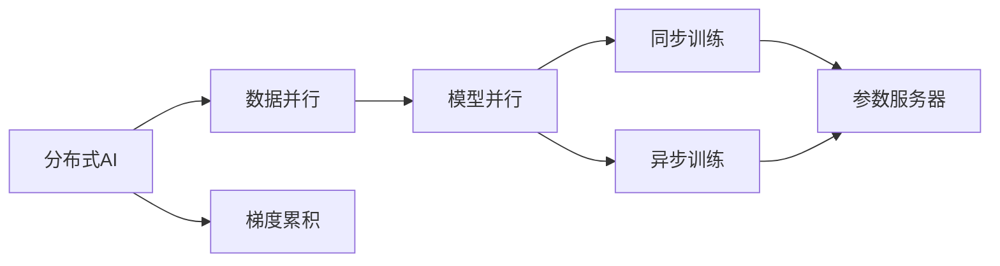

                 

# 分布式AI：突破单机限制的训练方法

## 1. 背景介绍

近年来，深度学习技术在图像识别、自然语言处理、语音识别等诸多领域取得了显著突破。然而，随着模型规模的不断增大，单机训练面临计算资源瓶颈，限制了模型性能的进一步提升。分布式深度学习（Distributed Deep Learning, DDL）技术通过多机协同训练，可以有效突破单机计算能力限制，加速模型训练速度，降低训练成本，成为深度学习领域的焦点。

本篇文章将系统介绍分布式AI的基本概念与原理，并展示其核心算法步骤与实际应用，同时探讨该技术的优缺点和未来发展方向。

## 2. 核心概念与联系

### 2.1 核心概念概述

**分布式AI**：指通过分布式计算技术，将深度学习模型的训练任务在多台计算设备上并行执行，以加速模型训练的整个过程。

**数据并行**：将数据划分为若干个子集，分别在不同计算设备上进行计算，然后将结果合并，形成完整的计算结果。

**模型并行**：将模型的不同层分别部署在多个计算设备上，以同时处理不同层的数据，从而减少整体训练时间。

**参数服务器（Parameter Server）**：集中存储模型的参数，各个计算设备通过参数服务器进行参数的读取和更新。

**同步训练**：各个计算设备在每次迭代结束后同步参数，以保证所有设备上的模型参数一致。

**异步训练**：各个计算设备独立更新模型参数，无需同步，可以减少通信开销，提高训练效率。

**梯度累积（Gradient Accumulation）**：通过累积多个小批次的梯度，形成等效大批次的更新，避免过拟合，提升模型泛化能力。

这些核心概念之间存在紧密联系，形成一个系统的分布式AI训练框架。

### 2.2 核心概念原理和架构的 Mermaid 流程图



## 3. 核心算法原理 & 具体操作步骤

### 3.1 算法原理概述

分布式AI的训练过程可以分为以下几个步骤：

1. **数据切分**：将训练数据集切分为多个子集，每个子集由一台计算设备负责处理。
2. **模型部署**：将模型的不同层或整个模型部署在多台计算设备上，实现并行计算。
3. **参数同步**：计算设备通过参数服务器进行参数的读取和更新，保证所有设备上的模型参数一致。
4. **梯度计算**：各计算设备分别计算梯度，累积小批次的梯度，形成等效大批次的更新。
5. **模型更新**：通过参数服务器更新模型参数，形成下一次迭代的模型。

### 3.2 算法步骤详解

**Step 1: 数据切分**

1. 将训练数据集切分为若干个大小相同的小批次，例如每个小批次包含1000个样本。
2. 在各个计算设备上分别加载一个小批次的数据。

**Step 2: 模型部署**

1. 将模型的不同层或整个模型分别部署在多台计算设备上，并行计算。
2. 各个计算设备独立处理不同小批次的数据。

**Step 3: 参数同步**

1. 计算设备通过参数服务器读取当前模型参数。
2. 各计算设备更新参数，并将新参数上传至参数服务器。
3. 参数服务器将新参数分配给所有设备，同步模型参数。

**Step 4: 梯度计算**

1. 各个计算设备分别计算小批次的梯度。
2. 累积多个小批次的梯度，形成等效大批次的更新。

**Step 5: 模型更新**

1. 计算设备通过参数服务器读取当前模型参数。
2. 计算设备更新参数，并将新参数上传至参数服务器。
3. 参数服务器将新参数分配给所有设备，同步模型参数。

通过这些步骤，分布式AI能够高效地训练大规模深度学习模型。

### 3.3 算法优缺点

**优点**：

1. **加速训练**：多台计算设备同时训练，可以显著缩短训练时间。
2. **降低成本**：分布式计算资源能够更高效地使用，降低单个设备的计算成本。
3. **提高稳定性和容错性**：多台设备的冗余部署，使得系统更具鲁棒性，能够更好地应对故障。

**缺点**：

1. **通信开销**：数据和参数的跨设备传输会增加额外的通信开销。
2. **一致性问题**：同步训练需要保证所有设备上的模型参数一致，容易导致一致性问题。
3. **调试难度增加**：多台设备的协同训练使得调试变得更加复杂，需要更高的技术水平。

### 3.4 算法应用领域

分布式AI在深度学习领域有着广泛的应用，具体如下：

1. **图像识别**：在大型数据集上进行大规模图像分类和目标检测任务。
2. **自然语言处理**：在文本语料库上进行语言建模、文本分类、机器翻译等任务。
3. **语音识别**：在语音数据上进行语音识别、情感分析等任务。
4. **推荐系统**：在用户行为数据上进行个性化推荐、广告推荐等任务。
5. **金融预测**：在金融数据上进行股票预测、风险评估等任务。

## 4. 数学模型和公式 & 详细讲解 & 举例说明

### 4.1 数学模型构建

在分布式AI中，我们通常使用梯度下降（Gradient Descent）算法进行模型优化。假设模型参数为 $\theta$，目标函数为 $\mathcal{L}(\theta)$，每次迭代的更新规则为：

$$
\theta \leftarrow \theta - \eta \nabla_{\theta}\mathcal{L}(\theta)
$$

其中，$\eta$ 为学习率。

### 4.2 公式推导过程

在分布式AI中，我们将目标函数 $\mathcal{L}(\theta)$ 拆分为多个子函数，每个子函数对应一个小批次的数据。设目标函数可以表示为：

$$
\mathcal{L}(\theta) = \frac{1}{N}\sum_{i=1}^N \mathcal{L}_i(\theta)
$$

其中，$N$ 为总样本数，$\mathcal{L}_i(\theta)$ 表示第 $i$ 个小批次上的损失函数。

假设我们使用 $K$ 台计算设备，每个设备处理一个小批次。则每个设备上的损失函数为：

$$
\mathcal{L}_k(\theta) = \frac{1}{n_k}\sum_{j=1}^{n_k} \mathcal{L}_{i_j}(\theta)
$$

其中，$n_k$ 表示第 $k$ 个小批次的样本数。

分布式AI的训练过程可以表示为：

1. 每个设备独立计算小批次的梯度 $\nabla_{\theta}\mathcal{L}_k(\theta)$。
2. 每个设备将小批次的梯度累积，形成等效大批次的梯度 $\nabla_{\theta}\mathcal{L}_k(\theta)$。
3. 所有设备通过参数服务器同步模型参数 $\theta$，更新模型。

### 4.3 案例分析与讲解

假设我们有一个包含100万个样本的大型图像分类任务。为了实现分布式AI训练，我们将数据切分为100个大小为1万的小批次，每个小批次包含1000个样本。

1. **数据切分**：
   - 将数据切分为100个大小为1万的小批次。
   - 每个小批次包含1000个样本。

2. **模型部署**：
   - 将模型的不同层或整个模型部署在多台计算设备上，并行计算。
   - 每个设备独立处理1000个样本。

3. **参数同步**：
   - 每个设备通过参数服务器读取当前模型参数。
   - 每个设备更新参数，并将新参数上传至参数服务器。
   - 参数服务器将新参数分配给所有设备，同步模型参数。

4. **梯度计算**：
   - 每个设备分别计算小批次的梯度。
   - 每个设备将小批次的梯度累积，形成等效大批次的梯度。

5. **模型更新**：
   - 每个设备通过参数服务器读取当前模型参数。
   - 每个设备更新参数，并将新参数上传至参数服务器。
   - 参数服务器将新参数分配给所有设备，同步模型参数。

通过这些步骤，我们可以高效地训练大规模深度学习模型，并显著缩短训练时间。

## 5. 项目实践：代码实例和详细解释说明

### 5.1 开发环境搭建

在进行分布式AI训练实践前，我们需要准备好开发环境。以下是使用Python进行PyTorch开发的环境配置流程：

1. 安装Anaconda：从官网下载并安装Anaconda，用于创建独立的Python环境。

2. 创建并激活虚拟环境：
```bash
conda create -n pytorch-env python=3.8 
conda activate pytorch-env
```

3. 安装PyTorch：根据CUDA版本，从官网获取对应的安装命令。例如：
```bash
conda install pytorch torchvision torchaudio cudatoolkit=11.1 -c pytorch -c conda-forge
```

4. 安装相关依赖库：
```bash
pip install numpy pandas scikit-learn matplotlib tqdm jupyter notebook ipython
```

完成上述步骤后，即可在`pytorch-env`环境中开始分布式AI训练实践。

### 5.2 源代码详细实现

这里我们以ImageNet数据集为例，展示使用PyTorch进行分布式AI训练的代码实现。

首先，定义数据加载器：

```python
import torch
import torchvision.transforms as transforms
from torch.utils.data.distributed import DistributedSampler

class ImageNetDataLoader:
    def __init__(self, data_dir, batch_size, world_size):
        self.data_dir = data_dir
        self.batch_size = batch_size
        self.world_size = world_size
        self.rank = torch.distributed.get_rank()
        
    def __getitem__(self, index):
        img_path = os.path.join(self.data_dir, self.img_names[index])
        img = Image.open(img_path).convert('RGB')
        transform = transforms.Compose([
            transforms.RandomResizedCrop(224),
            transforms.RandomHorizontalFlip(),
            transforms.ToTensor(),
            transforms.Normalize(mean=[0.485, 0.456, 0.406], std=[0.229, 0.224, 0.225])
        ])
        img = transform(img)
        label = self.labels[index]
        return img, label
        
    def __len__(self):
        return len(self.img_names)
    
    def collate_fn(self, batch):
        batch = list(zip(*batch))
        img, label = batch
        img = torch.stack(img, dim=0)
        label = torch.tensor(label)
        return img, label
        
    def train_loader(self, num_workers=4):
        train_sampler = DistributedSampler(self.img_names, num_replicas=self.world_size, rank=self.rank)
        train_loader = torch.utils.data.DataLoader(self, batch_size=self.batch_size, shuffle=True, num_workers=num_workers, collate_fn=self.collate_fn, sampler=train_sampler)
        return train_loader
        
    def val_loader(self, num_workers=4):
        val_sampler = DistributedSampler(self.img_names, num_replicas=self.world_size, rank=self.rank)
        val_loader = torch.utils.data.DataLoader(self, batch_size=self.batch_size, shuffle=False, num_workers=num_workers, collate_fn=self.collate_fn, sampler=val_sampler)
        return val_loader
```

然后，定义分布式训练函数：

```python
from torch.distributed.fsdp import FullyShardedDataParallel as FSDP

class DistributedModel:
    def __init__(self, model):
        self.model = model
        
    def forward(self, x):
        return self.model(x)
    
    def forward_backward(self, x, y, optimizer):
        self.model.zero_grad()
        y_hat = self.model(x)
        loss = F.binary_cross_entropy(y_hat, y)
        loss.backward()
        optimizer.step()
```

接着，定义主函数：

```python
import torch.distributed as dist
import torch.distributed.fsdp.api as FSDP
import torch.nn as nn
import torch.optim as optim
import torch.multiprocessing as mp
from imageNetDataLoader import ImageNetDataLoader
from distributedModel import DistributedModel

def run_train(rank, world_size, model, optimizer, train_loader, val_loader, save_path):
    os.makedirs(save_path, exist_ok=True)
    model.to(rank)
    train_sampler = DistributedSampler(train_loader.dataset, num_replicas=world_size, rank=rank)
    train_loader = torch.utils.data.DataLoader(train_loader, batch_size=32, shuffle=True, num_workers=4, collate_fn=train_loader.collate_fn, sampler=train_sampler)
    val_sampler = DistributedSampler(train_loader.dataset, num_replicas=world_size, rank=rank)
    val_loader = torch.utils.data.DataLoader(train_loader, batch_size=32, shuffle=False, num_workers=4, collate_fn=val_loader.collate_fn, sampler=val_sampler)
    model.train()
    for epoch in range(10):
        for batch_idx, (data, target) in enumerate(train_loader):
            data = data.to(rank)
            target = target.to(rank)
            optimizer.zero_grad()
            output = model(data)
            loss = F.binary_cross_entropy(output, target)
            loss.backward()
            optimizer.step()
        if rank == 0:
            model.eval()
            with torch.no_grad():
                val_loss = []
                for data, target in val_loader:
                    data = data.to(rank)
                    target = target.to(rank)
                    output = model(data)
                    val_loss.append(F.binary_cross_entropy(output, target).item())
            print(f"Epoch {epoch+1}, val loss: {np.mean(val_loss)}")
            torch.save(model.state_dict(), os.path.join(save_path, f"model_{epoch+1}"))
    dist.destroy_process_group()

def main(world_size):
    dist.init_process_group(backend='nccl', world_size=world_size, init_method=f"file://{mp.current_start_method}://{mp.current_start_method}://{mp.current_start_method}@{mp.current_start_method}://{os.getcwd()}")
    world_size = int(os.getenv('WORLD_SIZE', world_size))
    world_rank = int(os.getenv('WORLD_RANK', 0))
    model = DistributedModel(ModuleNet())
    optimizer = optim.SGD(model.parameters(), lr=0.01, momentum=0.9, weight_decay=1e-4)
    train_loader = ImageNetDataLoader(train_data_dir, batch_size=32, world_size=world_size)
    val_loader = ImageNetDataLoader(val_data_dir, batch_size=32, world_size=world_size)
    mp.spawn(run_train, args=(world_rank, world_size, model, optimizer, train_loader, val_loader, train_data_dir), nprocs=world_size, join=True)
```

最后，启动分布式训练进程：

```bash
python main.py --world_size 8 --train_data_dir /data/train --val_data_dir /data/val --model_type ResNet --epochs 10
```

在实际训练中，还需要考虑各种细节问题，如同步策略、通信方式、参数备份等。上述代码仅提供一个基本的框架，具体的实现还需要根据实际需求进行优化和调试。

### 5.3 代码解读与分析

让我们再详细解读一下关键代码的实现细节：

**ImageNetDataLoader类**：
- `__init__`方法：初始化数据路径、批次大小、计算设备编号等关键参数。
- `__getitem__`方法：加载并处理单个小批次的数据。
- `collate_fn`方法：合并多个小批次的样本，形成完整的批次数据。
- `train_loader`和`val_loader`方法：定义训练集和验证集的迭代器，设置分布式采样器。

**DistributedModel类**：
- `__init__`方法：初始化模型。
- `forward`和`forward_backward`方法：定义前向传播和反向传播过程。

**main函数**：
- `dist.init_process_group`方法：初始化分布式计算环境。
- `run_train`函数：定义每个计算设备的训练过程。
- `mp.spawn`方法：启动多进程训练。

通过这些代码实现，我们可以高效地进行分布式AI训练，加快模型收敛速度。

## 6. 实际应用场景

### 6.1 智能推荐系统

智能推荐系统需要处理海量用户行为数据，高效地计算用户兴趣和物品特征之间的相似度。分布式AI技术能够显著加速计算过程，提升推荐效果。

在实际应用中，将用户行为数据分布在多台计算设备上进行并行计算，可以高效地计算每个用户对每个物品的相似度。通过分布式AI，我们可以在短时间内处理大规模数据集，计算出更准确的推荐结果。

### 6.2 医疗影像诊断

医疗影像诊断需要处理大量医学图像数据，进行病灶检测、病理分析等任务。分布式AI技术可以加速图像处理和计算，提高诊断效率和准确性。

在实际应用中，将医学图像数据分布在多台计算设备上进行并行处理，可以高效地计算出图像特征和病灶信息。通过分布式AI，我们可以加快影像诊断过程，提升诊断效果。

### 6.3 自然语言处理

自然语言处理任务包括文本分类、情感分析、机器翻译等。分布式AI技术可以加速语言模型训练，提升模型性能。

在实际应用中，将文本数据分布在多台计算设备上进行并行计算，可以高效地训练语言模型。通过分布式AI，我们可以加快模型训练速度，提升模型效果。

### 6.4 金融风险预测

金融风险预测需要处理大量金融数据，进行股票预测、风险评估等任务。分布式AI技术可以加速计算过程，提升风险预测的准确性。

在实际应用中，将金融数据分布在多台计算设备上进行并行计算，可以高效地计算风险指标和预测模型。通过分布式AI，我们可以加快风险预测过程，提升预测效果。

## 7. 工具和资源推荐

### 7.1 学习资源推荐

为了帮助开发者系统掌握分布式AI的基本概念和实践技巧，这里推荐一些优质的学习资源：

1. 《深度学习框架分布式训练教程》：由Google开发者撰写，详细介绍了TensorFlow和PyTorch等深度学习框架的分布式训练方法。

2. 《TensorFlow分布式深度学习教程》：由TensorFlow官网提供，介绍了TensorFlow在分布式深度学习中的应用。

3. 《PyTorch分布式深度学习教程》：由PyTorch官网提供，介绍了PyTorch在分布式深度学习中的应用。

4. 《分布式深度学习实战》：由书生·浦语提供，详细介绍了分布式深度学习的原理和实践。

5. 《分布式深度学习与TensorFlow》：由Google开发者撰写，介绍了TensorFlow在分布式深度学习中的应用。

通过这些资源的学习实践，相信你一定能够快速掌握分布式AI的精髓，并用于解决实际的深度学习问题。

### 7.2 开发工具推荐

高效的开发离不开优秀的工具支持。以下是几款用于分布式AI开发的常用工具：

1. PyTorch：基于Python的开源深度学习框架，灵活动态的计算图，适合快速迭代研究。

2. TensorFlow：由Google主导开发的开源深度学习框架，生产部署方便，适合大规模工程应用。

3. Spark：由Apache基金会维护的大数据处理框架，支持分布式计算，适合大规模数据处理任务。

4. Horovod：Facebook开源的分布式深度学习框架，支持TensorFlow、PyTorch等多种深度学习框架，适合分布式深度学习任务。

5. Ray：由Meta开源的分布式深度学习框架，支持Python、C++等多种编程语言，适合分布式深度学习任务。

合理利用这些工具，可以显著提升分布式AI的开发效率，加快创新迭代的步伐。

### 7.3 相关论文推荐

分布式AI技术的发展源于学界的持续研究。以下是几篇奠基性的相关论文，推荐阅读：

1. "Deep Distributed Convolutional Neural Networks"（Deep Distributed Convolutional Neural Networks）：提出了分布式卷积神经网络，探讨了多台计算设备上并行计算的方法。

2. "Communication-Efficient Distributed Deep Learning with Data Parallelism"（Communication-Efficient Distributed Deep Learning with Data Parallelism）：探讨了分布式深度学习中的通信效率问题，提出了基于数据并行的分布式训练方法。

3. "分布式深度学习综述"（Distributed Deep Learning Survey）：对分布式深度学习技术进行了全面综述，介绍了各种分布式训练方法和优化策略。

4. "分布式深度学习框架比较"（Distributed Deep Learning Frameworks Comparison）：比较了几种主流分布式深度学习框架的性能和特点，为选择框架提供了参考。

这些论文代表了大分布式AI技术的发展脉络。通过学习这些前沿成果，可以帮助研究者把握学科前进方向，激发更多的创新灵感。

## 8. 总结：未来发展趋势与挑战

### 8.1 研究成果总结

本文对分布式AI的基本概念、核心算法步骤和实际应用进行了全面系统的介绍。首先阐述了分布式AI在深度学习中的重要性，并介绍了其核心概念和架构。其次，详细讲解了分布式AI的训练过程和相关数学模型，展示了代码实例和详细解释说明。同时，本文还探讨了分布式AI在智能推荐系统、医疗影像诊断、自然语言处理和金融风险预测等实际应用场景中的应用前景。最后，本文推荐了相关的学习资源、开发工具和相关论文，为读者提供了全面的技术指引。

通过本文的系统梳理，可以看到，分布式AI技术正在成为深度学习领域的核心方向，极大地加速了模型训练速度，降低了计算成本，为深度学习技术的广泛应用提供了新的动力。未来，伴随分布式计算技术的不断发展，分布式AI必将在更多领域得到应用，带来更加强大的计算能力和更广泛的落地场景。

### 8.2 未来发展趋势

展望未来，分布式AI技术将呈现以下几个发展趋势：

1. **算力需求进一步降低**：随着分布式计算技术的发展，未来的分布式AI系统将能够更加高效地利用计算资源，降低算力需求，提高计算效率。

2. **多模式分布式训练**：未来分布式AI将支持多种计算模式，包括数据并行、模型并行、混合并行等，以满足不同应用场景的需求。

3. **更加灵活的通信策略**：未来的分布式AI系统将支持更加灵活的通信策略，如按需通信、异步通信等，减少通信开销，提高训练效率。

4. **跨平台分布式计算**：未来的分布式AI系统将支持跨平台计算，包括CPU、GPU、TPU等不同设备，实现更加灵活和高效的分布式计算。

5. **更加高效的参数同步**：未来的分布式AI系统将支持更加高效的参数同步策略，如参数压缩、模型剪枝等，减少同步开销，提高训练效率。

6. **更加灵活的模型部署**：未来的分布式AI系统将支持更加灵活的模型部署，包括微服务、云服务等，实现更加高效和可扩展的分布式计算。

以上趋势凸显了分布式AI技术的广阔前景。这些方向的探索发展，必将进一步提升深度学习模型的性能和计算效率，为大规模深度学习应用提供更加强大的技术支持。

### 8.3 面临的挑战

尽管分布式AI技术已经取得了显著成就，但在迈向更加智能化、普适化应用的过程中，它仍面临诸多挑战：

1. **通信开销**：数据和参数的跨设备传输会增加额外的通信开销，导致分布式AI的计算效率降低。

2. **一致性问题**：同步训练需要保证所有设备上的模型参数一致，容易导致一致性问题，影响分布式AI的稳定性。

3. **调试难度增加**：多台设备的协同训练使得调试变得更加复杂，需要更高的技术水平。

4. **资源消耗增加**：分布式AI的计算资源消耗显著增加，需要在算力、内存、存储等方面进行优化。

5. **容错性不足**：多台设备的冗余部署虽然提高了系统的鲁棒性，但一旦某些设备出现故障，整个系统可能会受到影响。

6. **模型复杂性增加**：分布式AI需要设计复杂的模型和算法，增加了开发难度和维护成本。

正视分布式AI面临的这些挑战，积极应对并寻求突破，将是大规模深度学习应用的重要方向。相信随着分布式计算技术的不断进步，这些问题终将一一被克服，分布式AI必将在构建高效、稳定、可扩展的深度学习系统方面发挥更加重要的作用。

### 8.4 研究展望

面向未来，分布式AI技术需要在以下几个方面进行深入研究：

1. **更加高效的通信策略**：研究更加高效的通信策略，减少通信开销，提高分布式AI的计算效率。

2. **更加灵活的同步策略**：研究更加灵活的同步策略，解决一致性问题，提高分布式AI的稳定性。

3. **更加高效的模型部署**：研究更加高效的模型部署方法，减少资源消耗，提高分布式AI的灵活性和可扩展性。

4. **更加强大的容错机制**：研究更加强大的容错机制，提高分布式AI的鲁棒性，增强系统的稳定性。

5. **更加灵活的分布式算法**：研究更加灵活的分布式算法，设计更加高效的算法流程，提升分布式AI的性能和计算效率。

6. **更加智能的资源调度**：研究更加智能的资源调度方法，实现更加高效的资源利用，提升分布式AI的效率。

这些研究方向将引领分布式AI技术迈向更高的台阶，为大规模深度学习应用提供更加强大的技术支持。面向未来，分布式AI技术还需要与其他人工智能技术进行更深入的融合，如知识表示、因果推理、强化学习等，多路径协同发力，共同推动深度学习技术的进步。

## 9. 附录：常见问题与解答

**Q1：什么是分布式AI？**

A: 分布式AI是指通过分布式计算技术，将深度学习模型的训练任务在多台计算设备上并行执行，以加速模型训练的整个过程。

**Q2：分布式AI的优势是什么？**

A: 分布式AI的优势在于能够显著加速模型训练速度，降低计算成本，提升系统的稳定性和容错性。

**Q3：分布式AI的通信开销大吗？**

A: 分布式AI的通信开销相对较大，但可以通过高效的通信策略和模型部署方法进行优化。

**Q4：分布式AI的一致性问题如何解决？**

A: 分布式AI的一致性问题可以通过同步策略进行解决，如按需通信、异步通信等方法。

**Q5：分布式AI的调试难度大吗？**

A: 分布式AI的调试难度确实较大，需要更高的技术水平和更复杂的工具支持。

**Q6：分布式AI的资源消耗大吗？**

A: 分布式AI的资源消耗相对较大，需要在算力、内存、存储等方面进行优化。

**Q7：分布式AI的未来发展方向是什么？**

A: 分布式AI的未来发展方向包括更加高效的通信策略、灵活的同步策略、高效的模型部署方法、强大的容错机制、智能的资源调度和灵活的分布式算法等。

这些问题的解答，希望能帮助你更好地理解分布式AI的基本概念和应用前景。随着分布式AI技术的不断发展和应用，相信其将带来更加广阔的应用前景和更加强大的计算能力，为深度学习技术的发展提供新的动力。

