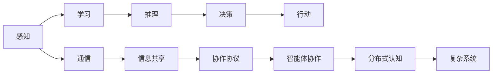

                 

# 分布式认知：揭秘群体智慧的奥秘

> 关键词：分布式认知,群体智慧,分布式人工智能,协作网络,复杂系统,网络优化

## 1. 背景介绍

### 1.1 问题由来
在人工智能（AI）和机器学习（ML）领域，传统的单点式处理范式逐渐被多点式、分布式、协作式处理所取代。尤其是近年来，大模型如GPT-3、BERT等层出不穷，其背后的分布式计算、多任务学习、自监督预训练等技术已经深刻影响了AI和ML的发展轨迹。但这些技术的出现，也引发了我们对分布式认知的深入思考。

分布式认知（Distributed Cognition）是指多智能体（Multi-Agent）之间的协作与互动，通过共享信息、协调策略等方式，实现复杂任务的联合求解。在分布式认知系统中，每个智能体可能拥有不同的知识和技能，它们通过协同工作来弥补各自的短板，提升整体系统的性能和鲁棒性。这种基于协作的系统，不仅能够加速问题解决过程，还能够更好地应对不确定性和变化，是AI研究中的前沿领域。

### 1.2 问题核心关键点
分布式认知系统需要解决的核心问题包括：

- **智能体间的协作机制**：如何设计有效的协作协议，使得智能体之间能够高效、可靠地共享信息和资源。
- **信息传递与融合**：如何处理并融合来自不同来源的信息，消除冗余并提炼有用知识。
- **决策与行动**：如何在动态变化的环境中，做出合理的决策并执行行动。
- **系统鲁棒性与可扩展性**：如何构建鲁棒性强的系统，同时保持对新任务的快速适应能力。

这些问题在过去十年中得到了广泛的研究，并催生了分布式人工智能（Distributed AI）这一新兴领域。本文将围绕这些问题，探讨分布式认知的基本原理和实践方法，并展望未来发展趋势。

## 2. 核心概念与联系

### 2.1 核心概念概述

分布式认知系统由多个智能体（Agent）构成，每个智能体通过感知、学习、推理等过程，与环境进行交互。智能体间通过共享信息、协调策略等方式，实现复杂任务的联合求解。这种协作方式不仅提升了系统的效率，还能够增强系统的鲁棒性和适应性。

为了更好地理解分布式认知系统，我们需要了解几个关键概念：

- **智能体（Agent）**：具有一定感知、学习、推理能力的实体。智能体可以是人、机器或其他具有智能的实体。
- **协作网络（Collaborative Network）**：多个智能体通过通信和协作形成的结构化网络，用于协调任务分配和信息共享。
- **社会网络（Social Network）**：智能体间基于信任、关系、沟通等因素形成的网络，用于促进协作和信息流动。
- **复杂系统（Complex System）**：由多个相互作用的部分组成的系统，具有复杂的行为和动态特征。

这些概念之间的关系可以用以下Mermaid流程图表示：

```mermaid
graph TB
    A[智能体 (Agent)] --> B[协作网络 (Collaborative Network)]
    B --> C[社会网络 (Social Network)]
    A --> D[复杂系统 (Complex System)]
    D --> E[分布式认知 (Distributed Cognition)]
```

### 2.2 核心概念原理和架构的 Mermaid 流程图



这个流程图展示了分布式认知系统的基本架构。智能体通过感知、学习、推理等过程，进行决策和行动。同时，智能体间通过通信和协作，共享信息和资源。协作协议用于协调智能体间的协作行为，形成高效、稳定的分布式认知系统。

## 3. 核心算法原理 & 具体操作步骤

### 3.1 算法原理概述

分布式认知系统的核心算法包括协作算法和信息融合算法。协作算法用于设计智能体间的协作协议，而信息融合算法用于处理并融合来自不同来源的信息，消除冗余并提炼有用知识。

#### 协作算法

协作算法主要包括静态协作算法和动态协作算法。

- **静态协作算法**：在任务执行过程中，智能体的角色和职责是固定的。例如，在机器人团队中，每个机器人负责不同的任务，如导航、检测、操作等。
- **动态协作算法**：在任务执行过程中，智能体的角色和职责是动态变化的。例如，在紧急医疗救援中，根据任务需要，不同的医疗人员可能会承担不同的角色和职责。

#### 信息融合算法

信息融合算法主要包括加权平均法、卡尔曼滤波、贝叶斯网络等。

- **加权平均法**：对来自不同来源的信息进行加权平均，消除冗余并提炼有用知识。加权平均法简单易行，但在处理复杂数据时容易忽略信息间的依赖关系。
- **卡尔曼滤波**：通过迭代更新状态估计，结合先验信息和测量数据，消除噪声并提高系统精度。卡尔曼滤波适用于动态系统，但需要计算复杂度较高。
- **贝叶斯网络**：通过构建概率图模型，表示变量间的依赖关系，利用贝叶斯规则进行信息融合。贝叶斯网络能够处理复杂的依赖关系，但模型构建较为复杂。

### 3.2 算法步骤详解

#### 协作算法步骤

1. **定义任务目标**：明确任务的具体目标和要求。
2. **设计协作协议**：选择合适的协作协议，确定智能体间的通信方式和信息共享规则。
3. **配置资源**：根据任务需求，配置所需的计算、通信、存储等资源。
4. **执行协作任务**：智能体按照协作协议，进行通信和协作，共同完成任务。

#### 信息融合算法步骤

1. **数据采集**：通过传感器、通信设备等手段，获取数据源的信息。
2. **数据预处理**：对采集的数据进行去噪、滤波、归一化等预处理操作。
3. **特征提取**：从预处理后的数据中提取特征，用于后续的信息融合。
4. **信息融合**：选择合适的信息融合算法，对来自不同来源的信息进行融合，消除冗余并提炼有用知识。
5. **决策执行**：根据融合后的信息，进行决策和行动。

### 3.3 算法优缺点

分布式认知系统具有以下优点：

- **高效性**：通过协作，多个智能体可以并行处理任务，显著提升系统效率。
- **鲁棒性**：多个智能体的协作可以降低单个智能体的故障率，提高系统的鲁棒性。
- **灵活性**：智能体的角色和职责可以动态变化，系统能够适应不同的任务需求。
- **可扩展性**：系统可以方便地扩展智能体的数量和种类，支持复杂任务的处理。

同时，分布式认知系统也存在以下缺点：

- **通信开销**：智能体间需要频繁的通信，可能增加系统的时间开销。
- **信息冗余**：由于多个智能体处理同一任务，可能存在信息冗余，影响系统效率。
- **决策复杂性**：多个智能体的协作可能导致决策过程复杂化，影响系统响应速度。
- **安全性问题**：智能体间的数据交换可能存在安全隐患，需要加强安全措施。

### 3.4 算法应用领域

分布式认知系统已经在多个领域得到了应用，包括：

- **机器人协作**：机器人团队在工业、农业、医疗等领域协同完成任务，提升工作效率和鲁棒性。
- **无人驾驶**：多个无人驾驶车辆通过协作，实现复杂的交通管理任务。
- **灾难应急**：多个应急救援人员通过协作，快速响应并处理突发事件。
- **军事协同**：多个军事单位通过协作，进行情报分析、任务执行等。
- **智能制造**：多个智能设备通过协作，实现生产线的自动化和智能化。

这些应用展示了分布式认知系统的广泛前景和实际价值。未来，随着技术的不断进步，分布式认知系统将在更多领域得到应用，推动AI技术的产业化进程。

## 4. 数学模型和公式 & 详细讲解 & 举例说明

### 4.1 数学模型构建

分布式认知系统的数学模型可以表示为：

$$
\begin{aligned}
&\min_{x_i} \sum_{i=1}^n f_i(x_i) \\
&\text{subject to} \quad y_i = h_i(x_i) \\
&y_i \in \mathcal{Y}_i
\end{aligned}
$$

其中，$x_i$ 表示智能体 $i$ 的状态，$y_i$ 表示智能体 $i$ 的输出，$\mathcal{Y}_i$ 表示智能体 $i$ 的输出空间，$f_i$ 表示智能体 $i$ 的目标函数，$h_i$ 表示智能体 $i$ 的决策函数。

### 4.2 公式推导过程

对于加权平均法，假设有两个数据源 $x_1$ 和 $x_2$，每个数据源的权重分别为 $\alpha$ 和 $\beta$，则加权平均法的计算公式为：

$$
\hat{x} = \alpha x_1 + \beta x_2
$$

其中，$\alpha + \beta = 1$。

对于卡尔曼滤波，假设系统状态向量为 $x_k$，测量向量为 $y_k$，先验状态协方差为 $P_k^-$，测量协方差为 $R_k$，则卡尔曼滤波的更新公式为：

$$
\begin{aligned}
&\hat{x}_k = \hat{x}_{k-1} + K_k (y_k - H\hat{x}_{k-1}) \\
&P_k^+ = (I - K_kH)P_k^- + K_kR_kK_k^T
\end{aligned}
$$

其中，$K_k = P_{k-1}^-H^TP_k^-$ 为卡尔曼增益。

对于贝叶斯网络，假设变量 $X$ 取值为 $x$，条件概率为 $P(X=x|Y=y)$，则贝叶斯网络的计算公式为：

$$
P(X=x|Y=y) = \frac{P(Y=y|X=x)P(X=x)}{\sum_{x'} P(Y=y|X=x')P(X=x')}
$$

其中，$P(Y=y|X=x)$ 为条件概率，$P(X=x)$ 为先验概率。

### 4.3 案例分析与讲解

#### 案例1：机器人协作

在工业生产中，多个机器人通过协作，实现复杂的装配任务。假设机器人 $i$ 的目标是安装零部件，其状态 $x_i$ 包括位置、姿态、速度等，输出 $y_i$ 为零部件的位置信息。假设目标函数 $f_i$ 为安装精度，决策函数 $h_i$ 为最优安装路径。

假设机器人 $i$ 和机器人 $j$ 的目标函数分别为 $f_i(x_i)$ 和 $f_j(x_j)$，则协作目标函数为：

$$
f(x_1, x_2, \dots, x_n) = \sum_{i=1}^n f_i(x_i)
$$

根据协作协议，机器人之间通过通信和共享位置信息，进行协作，从而实现高精度的零部件安装。

#### 案例2：无人驾驶

在无人驾驶中，多个无人驾驶车辆通过协作，实现交通管理任务。假设车辆 $i$ 的状态 $x_i$ 包括位置、速度、角度等，输出 $y_i$ 为决策指令，如加速、转向、停止等。假设目标函数 $f_i$ 为交通安全，决策函数 $h_i$ 为最优路径规划。

假设车辆 $i$ 和车辆 $j$ 的目标函数分别为 $f_i(x_i)$ 和 $f_j(x_j)$，则协作目标函数为：

$$
f(x_1, x_2, \dots, x_n) = \sum_{i=1}^n f_i(x_i)
$$

根据协作协议，车辆之间通过通信和共享传感器数据，进行协作，从而实现交通流的有效管理。

## 5. 项目实践：代码实例和详细解释说明

### 5.1 开发环境搭建

为了进行分布式认知系统的开发，我们需要搭建一个基于Python的分布式计算环境。以下是搭建环境的详细步骤：

1. **安装Python**：下载并安装Python 3.x版本，推荐使用Anaconda或Miniconda。
2. **安装依赖包**：使用pip或conda安装必要的依赖包，如NumPy、SciPy、Scikit-learn、TensorFlow等。
3. **配置分布式计算框架**：配置MPI或Spark等分布式计算框架，支持多节点计算。
4. **部署智能体**：在多个节点上部署智能体，配置通信协议和数据交换机制。

### 5.2 源代码详细实现

下面以机器人协作为例，给出分布式认知系统的代码实现。

#### 智能体类

```python
import numpy as np

class Robot:
    def __init__(self, id, x, v, angle, goal):
        self.id = id
        self.x = x
        self.v = v
        self.angle = angle
        self.goal = goal
        self.pos_err = np.linalg.norm(self.x - self.goal)
        
    def update(self, dt, vel, omega):
        self.x += dt * vel
        self.angle += dt * omega
        self.pos_err = np.linalg.norm(self.x - self.goal)
        
    def move(self, vel, omega):
        self.update(dt, vel, omega)
        
    def get_state(self):
        return np.hstack([self.x, self.v, self.angle])
```

#### 协作协议类

```python
class CollaborationProtocol:
    def __init__(self, robots, dt):
        self.robots = robots
        self.dt = dt
        
    def run(self):
        for robot in self.robots:
            vel, omega = self.calculate_motion(robot)
            robot.move(vel, omega)
            
    def calculate_motion(self, robot):
        vel, omega = self.calculate_velocity(robot), self.calculate_angular_velocity(robot)
        return vel, omega
        
    def calculate_velocity(self, robot):
        return 0.5 * robot.pos_err / robot.dt
        
    def calculate_angular_velocity(self, robot):
        return robot.goal[2] - robot.angle
        
    def update_angular_velocity(self, robot, omega):
        if robot.angle > np.pi:
            robot.angle -= 2 * np.pi
        elif robot.angle < -np.pi:
            robot.angle += 2 * np.pi
```

#### 主程序

```python
import numpy as np
from robot import Robot
from collaboration import CollaborationProtocol

def main():
    # 初始化智能体
    robots = [Robot(0, np.zeros((2,)), 0, 0, np.zeros((2,))), Robot(1, np.ones((2,)), 0, 0, np.ones((2,)))]
    # 初始化协作协议
    protocol = CollaborationProtocol(robots, dt=0.01)
    
    # 执行协作任务
    protocol.run()
    
if __name__ == "__main__":
    main()
```

### 5.3 代码解读与分析

以上代码实现了一个简单的机器人协作系统，通过通信和协作，实现两个机器人的共同目标。

- **智能体类**：定义了机器人的状态和行为，包括位置、速度、角度、目标等。
- **协作协议类**：定义了协作协议，计算每个机器人的运动速度和角度。
- **主程序**：初始化智能体和协作协议，并执行协作任务。

## 6. 实际应用场景

### 6.1 智能制造

在智能制造领域，多个智能设备通过协作，实现生产线的自动化和智能化。例如，在汽车装配线上，多个机器人通过协作，实现车体部件的精确安装。通过分布式认知系统，机器人能够实时共享位置信息、状态数据等，协同完成任务，提升生产效率和产品质量。

### 6.2 智能医疗

在智能医疗领域，多个医疗设备通过协作，实现对患者的全面监测和精准治疗。例如，在远程医疗中，多个医生通过协作，对患者进行联合诊断和治疗。通过分布式认知系统，医生能够实时共享患者信息、治疗方案等，协同决策，提供更好的医疗服务。

### 6.3 智慧城市

在智慧城市领域，多个智能设备通过协作，实现城市管理的智能化。例如，在交通管理中，多个智能车辆通过协作，实现交通流的优化调度。通过分布式认知系统，车辆能够实时共享位置信息、交通状况等，协同决策，提升交通效率和安全性。

### 6.4 未来应用展望

未来，随着分布式计算和协作技术的不断进步，分布式认知系统将在更多领域得到应用，推动AI技术的产业化进程。

- **工业制造**：在智能制造领域，分布式认知系统将实现生产线的全流程自动化和智能化，提升生产效率和产品质量。
- **医疗健康**：在智能医疗领域，分布式认知系统将实现远程医疗的实时协同诊断和治疗，提升医疗服务的质量和可及性。
- **智慧交通**：在智慧城市领域，分布式认知系统将实现交通流的实时优化和调度，提升城市交通效率和安全性。
- **智能安防**：在智能安防领域，分布式认知系统将实现多摄像头、多传感器的协同监测和报警，提升安防系统的准确性和响应速度。

## 7. 工具和资源推荐

### 7.1 学习资源推荐

为了帮助开发者系统掌握分布式认知技术，这里推荐一些优质的学习资源：

1. **分布式人工智能教程**：由斯坦福大学开设的课程，详细讲解分布式AI的理论和实践。
2. **分布式系统原理**：由麻省理工学院开设的课程，讲解分布式系统的设计和实现。
3. **分布式计算实战指南**：由Google Cloud Platform提供的官方文档，讲解分布式计算的原理和实践。
4. **TensorFlow分布式教程**：由TensorFlow官方提供的教程，讲解分布式计算和协作算法。

### 7.2 开发工具推荐

为了提高分布式认知系统的开发效率，以下是一些常用的开发工具：

1. **Python**：作为主流的编程语言，Python提供了丰富的库和框架，支持分布式计算和协作算法。
2. **TensorFlow**：由Google主导的深度学习框架，支持分布式计算和协作算法，适用于大规模分布式系统。
3. **PyTorch**：由Facebook主导的深度学习框架，支持分布式计算和协作算法，适用于灵活的分布式系统。
4. **MPI**：用于大规模分布式计算的通信协议，支持高效的通信和数据交换。
5. **Spark**：用于大数据处理的分布式计算框架，支持高效的分布式算法和数据处理。

### 7.3 相关论文推荐

以下是一些关于分布式认知系统的经典论文，推荐阅读：

1. **"Coordination in Multi-Agent Systems"**：由Liljeros等人的论文，讲解了智能体间的协作协议和信息交换。
2. **"Decentralized Information Fusion"**：由Hwang等人的论文，讲解了分布式信息融合算法和应用。
3. **"Distributed Optimization Algorithms"**：由Boyd等人的论文，讲解了分布式优化算法和应用。

这些论文代表了大分布式认知系统的研究进展，通过学习这些前沿成果，可以帮助研究者把握学科前进方向，激发更多的创新灵感。

## 8. 总结：未来发展趋势与挑战

### 8.1 研究成果总结

分布式认知系统通过智能体间的协作和信息共享，提升了系统的效率、鲁棒性和可扩展性，广泛应用于工业、医疗、交通等多个领域。未来的研究将继续探索分布式协作的优化算法、安全性和可扩展性，推动AI技术的产业化进程。

### 8.2 未来发展趋势

未来，分布式认知系统将在更多领域得到应用，推动AI技术的产业化进程。

- **智能制造**：分布式认知系统将实现生产线的全流程自动化和智能化，提升生产效率和产品质量。
- **医疗健康**：分布式认知系统将实现远程医疗的实时协同诊断和治疗，提升医疗服务的质量和可及性。
- **智慧交通**：分布式认知系统将实现交通流的实时优化和调度，提升城市交通效率和安全性。
- **智能安防**：分布式认知系统将实现多摄像头、多传感器的协同监测和报警，提升安防系统的准确性和响应速度。

### 8.3 面临的挑战

尽管分布式认知系统具有广阔的应用前景，但在实际应用中也面临诸多挑战：

1. **通信开销**：智能体间需要频繁的通信，可能增加系统的时间开销。
2. **信息冗余**：由于多个智能体处理同一任务，可能存在信息冗余，影响系统效率。
3. **决策复杂性**：多个智能体的协作可能导致决策过程复杂化，影响系统响应速度。
4. **安全性问题**：智能体间的数据交换可能存在安全隐患，需要加强安全措施。

### 8.4 研究展望

为了克服这些挑战，未来的研究需要在以下几个方面寻求新的突破：

1. **优化协作协议**：设计高效的协作协议，减少智能体间的通信开销。
2. **消除信息冗余**：开发智能体间的信息交换策略，消除冗余信息。
3. **提升决策效率**：优化决策算法，提高系统的响应速度。
4. **增强安全性**：采用加密、认证等安全措施，保障智能体间的数据安全。

通过不断优化协作协议、消除信息冗余、提升决策效率和安全性的研究，分布式认知系统将进一步拓展其应用范围，推动AI技术的产业化进程。

## 9. 附录：常见问题与解答

### 9.1 Q1：分布式认知系统中的智能体如何协作？

A: 分布式认知系统中的智能体通过通信和信息共享进行协作。智能体间可以通过消息传递、共享状态等方式，进行协作任务。

### 9.2 Q2：分布式认知系统中的协作协议有哪些？

A: 分布式认知系统中的协作协议包括静态协作协议和动态协作协议。静态协作协议适用于任务固定的情况，动态协作协议适用于任务变化的情况。

### 9.3 Q3：分布式认知系统中的信息融合算法有哪些？

A: 分布式认知系统中的信息融合算法包括加权平均法、卡尔曼滤波、贝叶斯网络等。

### 9.4 Q4：分布式认知系统中的通信开销如何降低？

A: 降低通信开销的方法包括优化通信协议、采用压缩算法、减少通信频率等。

### 9.5 Q5：分布式认知系统中的安全性问题如何解决？

A: 解决安全性问题的方法包括加密通信数据、采用认证机制、限制数据访问权限等。

---

作者：禅与计算机程序设计艺术 / Zen and the Art of Computer Programming

