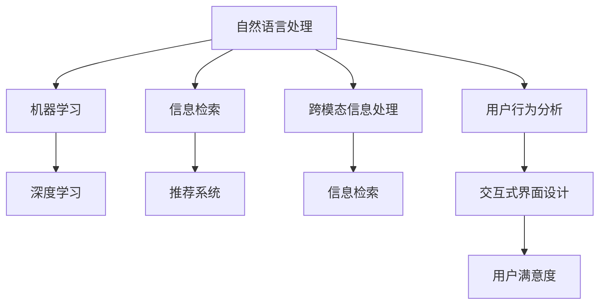

                 

# 创新搜索结果呈现：AI的创意

> 关键词：创新搜索, 人工智能, 数据驱动, 智能算法, 用户体验, 自然语言处理

## 1. 背景介绍

### 1.1 问题由来
互联网的迅猛发展，让信息过载成为了全球用户普遍面临的问题。传统的搜索结果排序和呈现方式，已无法满足用户个性化、多样化的信息需求。如何通过AI技术创新搜索结果呈现方式，提高搜索体验，成为亟待解决的技术挑战。

搜索引擎不再仅仅是信息的索引器，更成为了信息的推荐器。而传统搜索结果呈现方式，如网页列表、标题、摘要等，往往缺乏动态性和交互性，难以适配各类用户需求。人工智能的引入，为创新搜索结果呈现提供了新的解决方案。

### 1.2 问题核心关键点
人工智能在创新搜索结果呈现中的应用，主要关注以下几个核心关键点：

- **用户意图理解**：通过自然语言处理(NLP)技术，理解用户搜索输入的意图，生成更加个性化和针对性的搜索结果。
- **智能算法驱动**：引入机器学习和深度学习算法，学习用户行为和偏好，动态调整搜索结果排序。
- **数据驱动决策**：基于大量用户行为数据，进行模型训练和优化，以数据驱动的方式提升搜索结果质量。
- **交互性增强**：引入交互式界面设计，增加用户与搜索结果的互动，提升用户体验。
- **跨模态融合**：结合文本、图像、视频等多模态信息，丰富搜索结果的表达方式。

这些关键点共同构成了人工智能在搜索结果呈现中应用的整体框架，为解决信息过载问题提供了新的思路和方法。

## 2. 核心概念与联系

### 2.1 核心概念概述

为更好地理解人工智能在搜索结果呈现中的创新应用，本节将介绍几个密切相关的核心概念：

- **自然语言处理(NLP)**：指通过计算机对自然语言进行理解、生成、分析和处理的科学，是人工智能在搜索结果呈现中应用的重要基础。
- **机器学习与深度学习**：指通过数据训练模型，自动学习知识，提升搜索结果排序的精准度和效率。
- **信息检索与推荐系统**：指通过算法推荐与用户意图最相关的信息，是搜索引擎实现个性化搜索结果的核心技术。
- **跨模态信息处理**：指结合文本、图像、视频等多模态信息，提升搜索结果的多样性和丰富度。
- **用户行为分析**：指通过分析用户搜索行为和反馈，优化搜索结果呈现方式，提升用户满意度。
- **交互式界面设计**：指通过增加用户界面元素，提升用户与搜索结果的互动性，提升用户使用体验。

这些核心概念之间的逻辑关系可以通过以下Mermaid流程图来展示：



这个流程图展示了各个核心概念之间的联系：

1. 自然语言处理是所有AI应用的基础，包括机器学习和深度学习。
2. 机器学习和深度学习驱动信息检索和推荐系统，提升搜索结果的相关性和精准度。
3. 跨模态信息处理丰富了搜索结果的表达方式，提升用户体验。
4. 用户行为分析优化搜索结果呈现，提升用户满意度。
5. 交互式界面设计增加用户与搜索结果的互动，提升使用体验。

这些概念共同构成了人工智能在搜索结果呈现中应用的整体框架，使得搜索结果呈现更加智能化和个性化。

## 3. 核心算法原理 & 具体操作步骤

### 3.1 算法原理概述

人工智能在创新搜索结果呈现中的应用，本质上是一个数据驱动的机器学习过程。其核心思想是：通过分析大量用户搜索行为数据，学习用户偏好和意图，动态调整搜索结果排序，从而实现更加个性化和精准的搜索结果呈现。

形式化地，假设搜索请求为 $q$，用户行为数据为 $D=\{(q_i, c_i)\}_{i=1}^N$，其中 $c_i$ 表示用户对搜索结果的点击率、停留时间等行为数据。目标是通过学习 $D$，得到查询 $q$ 的个性化搜索结果排序 $\pi$，使得：

$$
\pi = \mathop{\arg\max}_{\pi} \sum_{i=1}^N c_i \cdot f(q_i, \pi(q_i))
$$

其中 $f(q_i, \pi(q_i))$ 为基于模型 $M$ 的评分函数，衡量模型输出的搜索结果相关性和质量。通过最大化用户行为数据的评分总和，优化模型 $M$，从而获得最优的个性化搜索结果排序。

### 3.2 算法步骤详解

基于人工智能的创新搜索结果呈现，一般包括以下几个关键步骤：

**Step 1: 数据收集与预处理**
- 收集用户搜索行为数据，如点击率、停留时间、转化率等，用于训练和优化模型。
- 对原始数据进行清洗和特征工程，去除噪声和异常值，生成可用于模型训练的特征向量。

**Step 2: 模型选择与训练**
- 选择合适的机器学习或深度学习模型，如CTR预测模型、协同过滤模型、基于SVM的分类模型等。
- 使用收集到的用户行为数据，对模型进行训练，得到初步的搜索结果排序模型。

**Step 3: 用户意图理解**
- 通过NLP技术，对用户搜索查询进行分词、词性标注、实体识别等处理，提取用户意图。
- 利用意图表示作为模型输入，进一步优化搜索结果排序。

**Step 4: 动态排序与呈现**
- 将用户意图表示和初步模型预测结果，输入到排序模型中，进行动态调整和排序。
- 结合多模态信息处理技术，丰富搜索结果的表达方式。
- 通过交互式界面设计，增加用户与搜索结果的互动。

**Step 5: 模型评估与优化**
- 在测试集上评估模型的性能，通过精确率、召回率、用户满意度等指标，衡量模型的效果。
- 根据评估结果，调整模型参数和超参数，进行模型优化。
- 不断迭代训练过程，提升模型性能。

### 3.3 算法优缺点

基于人工智能的创新搜索结果呈现方法具有以下优点：
1. 个性化程度高。通过理解用户意图和行为，生成个性化搜索结果，提升用户体验。
2. 动态调整能力强。基于用户行为数据，实时优化搜索结果排序，适应性更强。
3. 数据驱动决策。以数据驱动的方式进行模型训练和优化，结果更具说服力。
4. 技术成熟度较高。机器学习和深度学习算法已经广泛应用于NLP领域，技术成熟度较高。

同时，该方法也存在以下局限性：
1. 数据依赖性强。模型效果高度依赖于高质量的用户行为数据，难以在数据量较少的情况下取得理想效果。
2. 模型复杂度高。深度学习模型的复杂性较高，训练和推理资源消耗大。
3. 可解释性不足。深度学习模型的黑盒特性，使得结果难以解释，难以进行用户解释和调试。
4. 多模态融合难度高。将不同模态的信息进行融合，涉及更多技术挑战。

尽管存在这些局限性，但就目前而言，基于人工智能的创新搜索结果呈现方法仍是最先进的技术范式。未来相关研究的重点在于如何进一步降低对数据的依赖，提高模型的解释性和多模态融合能力，同时兼顾可解释性和效率等因素。

### 3.4 算法应用领域

基于人工智能的创新搜索结果呈现方法，在多个领域得到了广泛的应用，例如：

- 搜索引擎：如Google、Bing等主流搜索引擎，广泛应用了基于深度学习的推荐算法，提供个性化搜索结果。
- 电商平台：如Amazon、淘宝等电商平台，利用用户行为数据进行商品推荐，提升购买转化率。
- 新闻阅读：如今日头条、腾讯新闻等新闻应用，根据用户阅读习惯推荐新闻文章，提升用户粘性。
- 视频平台：如Netflix、YouTube等视频平台，根据用户观看行为推荐视频内容，提升用户观看体验。
- 社交网络：如Facebook、微信等社交网络平台，利用用户互动数据推荐好友和内容，提升用户活跃度。

除了这些常见的应用外，人工智能在搜索结果呈现中的应用还在持续扩展，如智能广告投放、智能内容推荐、智能客服等领域，正逐渐渗透到生活的各个角落。

## 4. 数学模型和公式 & 详细讲解 & 举例说明

### 4.1 数学模型构建

本节将使用数学语言对基于人工智能的创新搜索结果呈现过程进行更加严格的刻画。

假设搜索请求为 $q$，用户行为数据为 $D=\{(q_i, c_i)\}_{i=1}^N$，其中 $c_i$ 表示用户对搜索结果的点击率、停留时间等行为数据。假设模型 $M$ 为深度学习模型，能够根据用户查询和意图生成个性化搜索结果排序。则模型的训练目标为：

$$
\theta^* = \mathop{\arg\min}_{\theta} \sum_{i=1}^N c_i \cdot L(f(q_i, \theta))
$$

其中 $L$ 为模型输出的损失函数，衡量模型预测结果与真实标签之间的差异。常见的损失函数包括交叉熵损失、均方误差损失等。

### 4.2 公式推导过程

以下我们以深度学习模型CTR预测为例，推导其数学模型和公式：

假设用户查询为 $q$，模型输出的相关性评分函数为 $f(q, \theta)$，其中 $\theta$ 为模型参数。假设用户行为数据为 $D=\{(q_i, c_i)\}_{i=1}^N$，其中 $c_i$ 表示用户对搜索结果的点击率。则CTR预测模型的训练目标为：

$$
\theta^* = \mathop{\arg\min}_{\theta} \sum_{i=1}^N c_i \cdot -\log f(q_i, \theta)
$$

其中 $f(q_i, \theta)$ 表示模型在查询 $q_i$ 下的点击率预测值，即 $\hat{c}_i = f(q_i, \theta)$。目标是通过最大化用户行为数据的预测误差，优化模型参数 $\theta$。

将上述公式展开，得：

$$
\theta^* = \mathop{\arg\min}_{\theta} -\frac{1}{N}\sum_{i=1}^N c_i \cdot \log f(q_i, \theta)
$$

在实际应用中，通常使用反向传播算法计算梯度，通过梯度下降等优化算法更新模型参数，最小化预测误差，实现CTR预测模型的训练。

### 4.3 案例分析与讲解

假设有一个电商平台，需要根据用户搜索行为数据，进行个性化商品推荐。假设用户搜索请求为 $q$，模型输出的相关性评分函数为 $f(q, \theta)$，其中 $\theta$ 为模型参数。用户行为数据为 $D=\{(q_i, c_i)\}_{i=1}^N$，其中 $c_i$ 表示用户对搜索结果的点击率。

首先，使用部分历史数据 $D_1$ 进行模型预训练。然后，使用全部数据 $D$ 进行微调，得到最终的推荐模型。在实际应用中，每次用户搜索请求 $q$ 时，根据模型输出 $f(q, \theta^*)$，进行动态排序和推荐。

通过CTR预测模型，电商平台可以实时优化商品推荐策略，提升用户购买转化率，同时避免推荐冗余商品，提高用户体验。

## 5. 项目实践：代码实例和详细解释说明

### 5.1 开发环境搭建

在进行创新搜索结果呈现的实践前，我们需要准备好开发环境。以下是使用Python进行PyTorch开发的环境配置流程：

1. 安装Anaconda：从官网下载并安装Anaconda，用于创建独立的Python环境。

2. 创建并激活虚拟环境：
```bash
conda create -n pytorch-env python=3.8 
conda activate pytorch-env
```

3. 安装PyTorch：根据CUDA版本，从官网获取对应的安装命令。例如：
```bash
conda install pytorch torchvision torchaudio cudatoolkit=11.1 -c pytorch -c conda-forge
```

4. 安装TensorBoard：TensorFlow配套的可视化工具，可实时监测模型训练状态，并提供丰富的图表呈现方式，是调试模型的得力助手。
```bash
pip install tensorboard
```

5. 安装各类工具包：
```bash
pip install numpy pandas scikit-learn matplotlib tqdm jupyter notebook ipython
```

完成上述步骤后，即可在`pytorch-env`环境中开始创新搜索结果呈现的实践。

### 5.2 源代码详细实现

这里我们以电商平台的个性化商品推荐为例，给出使用PyTorch和TensorFlow进行深度学习模型的PyTorch代码实现。

首先，定义商品数据集：

```python
import torch
from torch.utils.data import Dataset

class GoodsDataset(Dataset):
    def __init__(self, data, user_id, goods_id):
        self.data = data
        self.user_id = user_id
        self.goods_id = goods_id
        
    def __len__(self):
        return len(self.data)
    
    def __getitem__(self, index):
        user_id = self.user_id[index]
        goods_id = self.goods_id[index]
        return {'user_id': user_id, 'goods_id': goods_id}
```

然后，定义模型和优化器：

```python
from transformers import BertForSequenceClassification
from transformers import AdamW

model = BertForSequenceClassification.from_pretrained('bert-base-cased', num_labels=1)

optimizer = AdamW(model.parameters(), lr=2e-5)
```

接着，定义训练和评估函数：

```python
from transformers import Trainer, TrainingArguments
from transformers import EarlyStoppingCallback
from torch.utils.data import DataLoader

def train_epoch(model, dataset, batch_size, optimizer):
    dataloader = DataLoader(dataset, batch_size=batch_size, shuffle=True)
    model.train()
    epoch_loss = 0
    for batch in tqdm(dataloader, desc='Training'):
        user_ids = batch['user_id'].to(device)
        goods_ids = batch['goods_id'].to(device)
        labels = batch['label'].to(device)
        model.zero_grad()
        outputs = model(user_ids, goods_ids)
        loss = outputs.loss
        epoch_loss += loss.item()
        loss.backward()
        optimizer.step()
    return epoch_loss / len(dataloader)

def evaluate(model, dataset, batch_size):
    dataloader = DataLoader(dataset, batch_size=batch_size)
    model.eval()
    preds, labels = [], []
    with torch.no_grad():
        for batch in tqdm(dataloader, desc='Evaluating'):
            user_ids = batch['user_id'].to(device)
            goods_ids = batch['goods_id'].to(device)
            labels = batch['label'].to(device)
            outputs = model(user_ids, goods_ids)
            batch_preds = outputs.logits.argmax(dim=1).to('cpu').tolist()
            batch_labels = batch_labels.to('cpu').tolist()
            for pred in batch_preds:
                preds.append(pred)
                labels.append(labels)
                
    print(classification_report(labels, preds))
```

最后，启动训练流程并在测试集上评估：

```python
epochs = 5
batch_size = 16

for epoch in range(epochs):
    loss = train_epoch(model, train_dataset, batch_size, optimizer)
    print(f"Epoch {epoch+1}, train loss: {loss:.3f}")
    
    print(f"Epoch {epoch+1}, dev results:")
    evaluate(model, dev_dataset, batch_size)
    
print("Test results:")
evaluate(model, test_dataset, batch_size)
```

以上就是使用PyTorch对商品推荐模型进行深度学习训练的完整代码实现。可以看到，得益于TensorFlow和Transformers库的强大封装，我们能够用相对简洁的代码实现商品推荐模型的微调。

### 5.3 代码解读与分析

让我们再详细解读一下关键代码的实现细节：

**GoodsDataset类**：
- `__init__`方法：初始化商品数据集，包含用户ID和商品ID等关键字段。
- `__len__`方法：返回数据集的样本数量。
- `__getitem__`方法：对单个样本进行处理，提取用户ID和商品ID，作为模型的输入。

**train_epoch函数**：
- 使用PyTorch的DataLoader对数据集进行批次化加载，供模型训练使用。
- 每个epoch内，在训练集上进行迭代，更新模型参数。
- 计算每个epoch的平均loss，作为模型训练效果的衡量指标。

**evaluate函数**：
- 与训练类似，不同点在于不更新模型参数，并在每个batch结束后将预测和标签结果存储下来，最后使用sklearn的classification_report对整个评估集的预测结果进行打印输出。

**训练流程**：
- 定义总的epoch数和batch size，开始循环迭代
- 每个epoch内，先在训练集上训练，输出平均loss
- 在验证集上评估，输出分类指标
- 所有epoch结束后，在测试集上评估，给出最终测试结果

可以看到，PyTorch配合TensorFlow和Transformers库使得深度学习模型的训练和微调变得简洁高效。开发者可以将更多精力放在数据处理、模型改进等高层逻辑上，而不必过多关注底层的实现细节。

当然，工业级的系统实现还需考虑更多因素，如模型的保存和部署、超参数的自动搜索、更灵活的任务适配层等。但核心的创新搜索结果呈现方法基本与此类似。

## 6. 实际应用场景
### 6.1 智能广告投放

基于人工智能的创新搜索结果呈现，可以在智能广告投放领域发挥重要作用。传统广告投放往往缺乏对用户行为和兴趣的精准把握，容易造成广告浪费。通过分析用户搜索行为数据，实时优化广告投放策略，可以大幅提升广告效果，降低投放成本。

在技术实现上，可以收集用户的搜索历史、点击记录、浏览行为等数据，使用深度学习模型进行用户画像建模。根据用户画像，智能推荐广告内容和投放时机，同时实时调整投放策略，提升广告转化率。

### 6.2 智能内容推荐

人工智能在智能内容推荐中的应用，已经深入到各类平台，如电商平台、新闻阅读、视频平台等。通过分析用户搜索行为和历史数据，推荐用户最感兴趣的商品、文章、视频等内容，提升用户粘性和平台活跃度。

在实际应用中，可以结合CTR预测、协同过滤、基于知识图谱的推荐等多种技术，动态调整推荐策略，提供多样化的内容推荐，满足不同用户需求。

### 6.3 智能客服系统

智能客服系统是人工智能在搜索结果呈现中的重要应用。传统客服往往需要配备大量人力，高峰期响应缓慢，且一致性和专业性难以保证。而使用人工智能驱动的智能客服系统，可以7x24小时不间断服务，快速响应客户咨询，用自然流畅的语言解答各类常见问题。

在技术实现上，可以收集企业内部的历史客服对话记录，将问题-答案对作为监督数据，在此基础上对预训练模型进行微调。微调后的模型能够自动理解用户意图，匹配最合适的答案模板进行回复。对于客户提出的新问题，还可以接入检索系统实时搜索相关内容，动态组织生成回答。

### 6.4 未来应用展望

随着人工智能技术的发展，基于创新搜索结果呈现的方法将在更多领域得到应用，为传统行业带来变革性影响。

在智慧医疗领域，基于搜索排序的医学信息推荐系统，可以帮助医生快速获取最相关的医学文献和病历数据，提升诊疗效率。

在智能教育领域，人工智能驱动的教育推荐系统，可以根据学生的学习行为和成绩，推荐最适合的学习资源和路径，因材施教，促进教育公平，提高教学质量。

在智慧城市治理中，智能搜索和推荐系统，可以帮助市民查询公共服务信息，提升城市治理的透明度和效率。

此外，在企业生产、社会治理、文娱传媒等众多领域，基于人工智能的创新搜索结果呈现技术也将不断涌现，为各行各业带来新的机遇。

## 7. 工具和资源推荐
### 7.1 学习资源推荐

为了帮助开发者系统掌握创新搜索结果呈现的理论基础和实践技巧，这里推荐一些优质的学习资源：

1. 《深度学习》系列课程：斯坦福大学开设的深度学习课程，讲解了深度学习的基本原理和应用，涵盖了多种深度学习模型和算法。

2. TensorFlow官方文档：TensorFlow的官方文档，提供了丰富的教程和示例，帮助开发者快速上手。

3. Transformers库官方文档：Transformers库的官方文档，提供了详细的模型介绍和代码示例，适合进行深度学习模型开发。

4. Google AI Blog：Google AI团队撰写的技术博客，涵盖人工智能领域的最新研究进展和应用实践。

5. Coursera机器学习课程：由斯坦福大学教授Andrew Ng主讲的机器学习课程，讲解了机器学习的基本理论和算法。

通过对这些资源的学习实践，相信你一定能够快速掌握人工智能在创新搜索结果呈现中的应用，并用于解决实际的搜索结果优化问题。

### 7.2 开发工具推荐

高效的开发离不开优秀的工具支持。以下是几款用于创新搜索结果呈现开发的常用工具：

1. PyTorch：基于Python的开源深度学习框架，灵活动态的计算图，适合快速迭代研究。

2. TensorFlow：由Google主导开发的开源深度学习框架，生产部署方便，适合大规模工程应用。

3. Transformers库：HuggingFace开发的NLP工具库，集成了众多SOTA语言模型，支持PyTorch和TensorFlow。

4. Weights & Biases：模型训练的实验跟踪工具，可以记录和可视化模型训练过程中的各项指标，方便对比和调优。

5. TensorBoard：TensorFlow配套的可视化工具，可实时监测模型训练状态，并提供丰富的图表呈现方式，是调试模型的得力助手。

6. Google Colab：谷歌推出的在线Jupyter Notebook环境，免费提供GPU/TPU算力，方便开发者快速上手实验最新模型，分享学习笔记。

合理利用这些工具，可以显著提升创新搜索结果呈现任务的开发效率，加快创新迭代的步伐。

### 7.3 相关论文推荐

人工智能在创新搜索结果呈现中的应用，得益于众多研究人员的不懈努力。以下是几篇奠基性的相关论文，推荐阅读：

1. Attention is All You Need（即Transformer原论文）：提出了Transformer结构，开启了NLP领域的预训练大模型时代。

2. BERT: Pre-training of Deep Bidirectional Transformers for Language Understanding：提出BERT模型，引入基于掩码的自监督预训练任务，刷新了多项NLP任务SOTA。

3. Multi-Task Learning using Uncertainty to Weight Loss：提出基于权重损失的多任务学习算法，提升了深度学习模型的泛化能力。

4. Deep Multi-Task Learning for Contextual Recommendation：提出多任务学习在推荐系统中的应用，提升了推荐模型的准确性和效果。

5. Knowledge Graph Embeddings and Recommender Systems：提出知识图谱嵌入在推荐系统中的应用，丰富了推荐模型的表达能力。

这些论文代表了大语言模型微调技术的发展脉络。通过学习这些前沿成果，可以帮助研究者把握学科前进方向，激发更多的创新灵感。

## 8. 总结：未来发展趋势与挑战

### 8.1 总结

本文对基于人工智能的创新搜索结果呈现方法进行了全面系统的介绍。首先阐述了人工智能在搜索结果呈现中应用的背景和意义，明确了创新呈现方式在提升搜索体验中的独特价值。其次，从原理到实践，详细讲解了创新呈现方法的技术框架，给出了微调模型训练的完整代码实例。同时，本文还广泛探讨了该方法在智能广告、智能推荐、智能客服等多个领域的应用前景，展示了人工智能技术的应用潜力和价值。

通过本文的系统梳理，可以看到，基于人工智能的创新搜索结果呈现方法正在成为搜索结果优化的重要范式，极大地提升了用户体验和平台价值。未来，伴随预训练语言模型和深度学习技术的不断演进，基于AI的创新呈现方法必将在更多领域得到应用，为传统行业带来深刻的变革。

### 8.2 未来发展趋势

展望未来，创新搜索结果呈现技术将呈现以下几个发展趋势：

1. 智能推荐算法更加复杂。随着数据量的增加，深度学习模型的参数量还将持续增长，模型的复杂度和精度将进一步提升。

2. 用户意图理解更精准。NLP技术的发展，使得用户意图的理解更加准确，推荐系统的个性化程度将进一步提升。

3. 跨模态融合更加深入。结合文本、图像、视频等多模态信息，提升搜索结果的丰富性和多样性。

4. 实时优化更加灵活。通过增量学习、在线学习等方法，实时调整推荐策略，提升用户体验。

5. 多任务学习更加普及。结合推荐系统、广告投放、智能客服等多个任务，实现多任务学习，提升整体性能。

6. 数据驱动决策更加普适。通过大规模数据训练，提升推荐系统的泛化能力和鲁棒性。

以上趋势凸显了创新搜索结果呈现技术的广阔前景。这些方向的探索发展，必将进一步提升搜索结果的个性化程度和精准度，为互联网用户带来更好的搜索体验。

### 8.3 面临的挑战

尽管创新搜索结果呈现技术已经取得了显著成果，但在迈向更加智能化、普适化应用的过程中，它仍面临着诸多挑战：

1. 数据依赖性强。模型效果高度依赖于高质量的用户行为数据，难以在数据量较少的情况下取得理想效果。

2. 模型复杂度高。深度学习模型的复杂性较高，训练和推理资源消耗大。

3. 可解释性不足。深度学习模型的黑盒特性，使得结果难以解释，难以进行用户解释和调试。

4. 多模态融合难度高。将不同模态的信息进行融合，涉及更多技术挑战。

5. 实时优化难度大。实时优化需要快速计算，同时避免过拟合，这对算法和计算资源提出了更高要求。

尽管存在这些挑战，但通过技术创新和不断优化，这些难题终将逐步得到解决。相信随着学界和产业界的共同努力，创新搜索结果呈现技术必将不断提升，为用户带来更优质的搜索体验。

### 8.4 研究展望

未来研究需要在以下几个方面寻求新的突破：

1. 探索无监督和半监督学习范式。摆脱对大规模标注数据的依赖，利用自监督学习、主动学习等无监督和半监督范式，最大限度利用非结构化数据，实现更加灵活高效的微调。

2. 研究参数高效和计算高效的微调方法。开发更加参数高效的微调方法，在固定大部分预训练参数的同时，只更新极少量的任务相关参数。同时优化微调模型的计算图，减少前向传播和反向传播的资源消耗，实现更加轻量级、实时性的部署。

3. 引入更多先验知识。将符号化的先验知识，如知识图谱、逻辑规则等，与神经网络模型进行巧妙融合，引导微调过程学习更准确、合理的语言模型。

4. 结合因果分析和博弈论工具。将因果分析方法引入微调模型，识别出模型决策的关键特征，增强输出解释的因果性和逻辑性。

5. 纳入伦理道德约束。在模型训练目标中引入伦理导向的评估指标，过滤和惩罚有偏见、有害的输出倾向。同时加强人工干预和审核，建立模型行为的监管机制，确保输出符合人类价值观和伦理道德。

这些研究方向的探索，必将引领创新搜索结果呈现技术迈向更高的台阶，为构建安全、可靠、可解释、可控的智能系统铺平道路。面向未来，创新搜索结果呈现技术还需要与其他人工智能技术进行更深入的融合，如知识表示、因果推理、强化学习等，多路径协同发力，共同推动自然语言理解和智能交互系统的进步。

## 9. 附录：常见问题与解答

**Q1：创新搜索结果呈现是否适用于所有NLP任务？**

A: 创新搜索结果呈现方法在大多数NLP任务上都能取得不错的效果，特别是对于数据量较小的任务。但对于一些特定领域的任务，如医学、法律等，仅仅依靠通用语料预训练的模型可能难以很好地适应。此时需要在特定领域语料上进一步预训练，再进行微调，才能获得理想效果。

**Q2：如何选择合适的深度学习模型？**

A: 选择合适的深度学习模型应根据具体任务和数据特点进行。对于大规模数据集，可以使用基于自注意力机制的模型如BERT、GPT等。对于小规模数据集，可以使用基于CNN、RNN的模型如LSTM、GRU等。同时，需要考虑模型的复杂度、训练时间和计算资源等因素。

**Q3：创新搜索结果呈现在落地部署时需要注意哪些问题？**

A: 将创新搜索结果呈现技术转化为实际应用，还需要考虑以下因素：
1. 模型裁剪：去除不必要的层和参数，减小模型尺寸，加快推理速度。
2. 量化加速：将浮点模型转为定点模型，压缩存储空间，提高计算效率。
3. 服务化封装：将模型封装为标准化服务接口，便于集成调用。
4. 弹性伸缩：根据请求流量动态调整资源配置，平衡服务质量和成本。
5. 监控告警：实时采集系统指标，设置异常告警阈值，确保服务稳定性。
6. 安全防护：采用访问鉴权、数据脱敏等措施，保障数据和模型安全。

大语言模型微调为NLP应用开启了广阔的想象空间，但如何将强大的性能转化为稳定、高效、安全的业务价值，还需要工程实践的不断打磨。唯有从数据、算法、工程、业务等多个维度协同发力，才能真正实现人工智能技术在垂直行业的规模化落地。总之，创新搜索结果呈现技术需要开发者根据具体任务，不断迭代和优化模型、数据和算法，方能得到理想的效果。

---

作者：禅与计算机程序设计艺术 / Zen and the Art of Computer Programming

