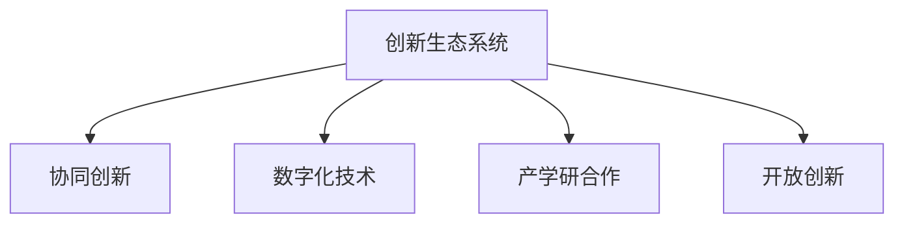

                 

# 创新生态系统管理：打造产学研协同创新平台

## 1. 背景介绍

### 1.1 问题由来

在当今快速变化的全球科技环境中，创新速度成为了企业能否在市场中占据优势的关键。然而，传统的创新模式往往过于线性和孤立，难以适应复杂多变的市场环境。面对这种挑战，越来越多的企业开始认识到，建立一个多维度、多层次的创新生态系统，能够更高效地整合资源，提升创新能力。

创新生态系统（Innovation Ecosystem）是一个由企业、大学、研究机构、政府机构、投资机构等组成的动态网络，通过信息、资源、人才的共享与协同，促进技术和知识的流动，从而推动整个产业的升级与变革。在创新生态系统中，各主体通过合作与竞争，推动技术的不断突破与商业化的进程。

近年来，随着数字化转型的加速，以及人工智能、大数据、区块链等前沿技术的快速发展，创新生态系统的构建变得尤为重要。数字化技术不仅能加速知识的传播与整合，还能通过数据驱动的方法，提高创新的精确性和效率。因此，如何在数字化时代，打造高效、协同的创新生态系统，成为了企业及科研机构关注的焦点。

### 1.2 问题核心关键点

构建创新生态系统涉及的关键点包括：

- **信息共享**：通过平台和网络，实现信息的高效传递与共享。
- **资源整合**：将不同主体的资源（包括资金、人才、技术等）进行高效整合，提升创新能力。
- **合作机制**：建立灵活的合作机制，促进不同主体之间的协同创新。
- **激励机制**：通过合理的激励机制，激发各主体的创新活力和参与热情。
- **数据治理**：确保数据安全与合规，构建可信的数据治理体系。

以上这些关键点共同构成了创新生态系统的核心框架，是实现高效协同创新的基础。本文将详细探讨这些关键点，并通过具体案例展示，阐述如何通过数字技术，打造一个高效、协同的创新生态系统。

## 2. 核心概念与联系

### 2.1 核心概念概述

为更好地理解如何构建高效的创新生态系统，本节将介绍几个关键概念：

- **创新生态系统（Innovation Ecosystem）**：由企业、大学、研究机构、政府机构、投资机构等组成的动态网络，通过信息、资源、人才的共享与协同，促进技术和知识的流动，从而推动整个产业的升级与变革。
- **协同创新（Collaborative Innovation）**：多个创新主体通过合作与竞争，共同推动技术的突破与商业化进程，实现1+1>2的效果。
- **数字化技术（Digital Technology）**：包括人工智能、大数据、区块链、物联网等，通过数据驱动的方法，提升创新的精确性和效率。
- **产学研合作（Industry-Academia-Research Collaboration）**：企业、大学和研究机构之间的合作，通过共同研发，加速技术的商业化应用。
- **开放创新（Open Innovation）**：通过开放的创新模式，吸引外部资源和创新成果，加速内部创新能力的提升。

这些核心概念之间的逻辑关系可以通过以下Mermaid流程图来展示：



这个流程图展示了创新生态系统的核心概念及其之间的关系：

1. 创新生态系统通过协同创新，整合数字化技术和产学研合作，推动开放创新。
2. 协同创新是创新生态系统的主要驱动力，通过企业、大学和研究机构的紧密合作，加速技术的突破与商业化。
3. 数字化技术是实现高效协同创新的关键工具，提升信息传递和资源整合的效率。
4. 产学研合作是创新生态系统的基础，通过各主体之间的知识共享与技术合作，加速创新成果的转化。
5. 开放创新则是创新生态系统的拓展，通过吸引外部资源和创新成果，加速内部创新能力的提升。

这些概念共同构成了创新生态系统的基本框架，是实现高效协同创新的关键要素。通过理解这些概念，我们可以更好地把握创新生态系统的构建方向和优化策略。

## 3. 核心算法原理 & 具体操作步骤
### 3.1 算法原理概述

在构建创新生态系统的过程中，数字化技术起着至关重要的作用。通过数字化技术，可以实现信息的高效传递、资源的动态整合以及协同创新的高效推进。本节将详细介绍基于数字化技术的创新生态系统管理算法原理，并给出具体的操作步骤。

创新生态系统的数字化管理，主要依赖于以下几个步骤：

1. **信息共享平台建设**：通过构建信息共享平台，实现数据、知识和成果的共享与协同。
2. **资源整合与优化**：通过数据分析和优化算法，实现资源的动态配置和优化。
3. **协同创新机制设计**：通过设计灵活的合作机制和激励机制，促进不同主体之间的协同创新。
4. **数据治理与安全保障**：通过数据治理和安全保障措施，确保数据的合规和安全。

### 3.2 算法步骤详解

#### 步骤1：信息共享平台建设

信息共享平台是创新生态系统的核心基础设施，通过平台实现信息的高效传递和共享。平台构建主要包括以下几个关键步骤：

1. **数据采集与清洗**：从不同的主体（如企业、大学、研究机构）采集数据，并进行清洗和整理。
2. **数据标准化与集成**：对采集到的数据进行标准化处理，并实现数据的集成和统一。
3. **信息管理系统设计**：设计信息管理系统，支持数据的存储、检索和共享。
4. **用户权限管理**：实现用户权限管理，保障数据的安全和合规。

#### 步骤2：资源整合与优化

资源整合与优化是创新生态系统的关键环节，通过数据分析和优化算法，实现资源的动态配置和优化。具体步骤如下：

1. **资源需求分析**：对不同主体（如项目、团队）的需求进行分析，识别出关键资源。
2. **资源供给分析**：对可用的资源进行分析和评估，包括资金、人才、技术等。
3. **资源匹配算法**：设计资源匹配算法，实现资源的高效分配和优化。
4. **动态调整机制**：建立动态调整机制，根据实时需求和供给情况，及时调整资源配置。

#### 步骤3：协同创新机制设计

协同创新机制是创新生态系统的核心驱动力，通过设计灵活的合作机制和激励机制，促进不同主体之间的协同创新。具体步骤如下：

1. **合作模式设计**：设计多样化的合作模式，包括联合研发、技术转让、股权投资等。
2. **激励机制设计**：设计合理的激励机制，包括利润分成、股权激励、科研经费等，激发各主体的创新活力和参与热情。
3. **绩效评估与反馈**：建立绩效评估与反馈机制，定期评估协同创新项目的进展和成果。
4. **风险管理**：设计风险管理机制，通过合同、保险等方式，降低合作风险。

#### 步骤4：数据治理与安全保障

数据治理与安全保障是创新生态系统的保障措施，通过数据治理和安全保障措施，确保数据的合规和安全。具体步骤如下：

1. **数据治理框架设计**：设计数据治理框架，包括数据分类、存储、访问、共享等标准和规范。
2. **数据安全策略**：设计数据安全策略，包括数据加密、访问控制、审计等措施。
3. **合规性管理**：建立合规性管理机制，确保数据的使用和共享符合法律法规和行业标准。
4. **隐私保护**：设计隐私保护措施，保障用户的隐私权和数据安全。

### 3.3 算法优缺点

基于数字化技术的创新生态系统管理算法具有以下优点：

1. **高效信息传递**：通过信息共享平台，实现信息的高效传递和共享，缩短信息传递时间。
2. **资源优化配置**：通过数据分析和优化算法，实现资源的动态配置和优化，提高资源利用效率。
3. **灵活合作机制**：设计多样化的合作机制，促进不同主体之间的协同创新，提高创新效率。
4. **数据安全保障**：通过数据治理和安全保障措施，确保数据的安全和合规，保障创新生态系统的稳定运行。

同时，该算法也存在一定的局限性：

1. **数据质量问题**：数据采集和清洗过程可能存在质量问题，影响信息的准确性和完整性。
2. **隐私保护难题**：在数据共享过程中，如何平衡数据利用和隐私保护，是一大挑战。
3. **技术复杂度高**：数字化技术的引入增加了系统的复杂性，需要高水平的技术支持和维护。
4. **合规风险**：在数据治理和安全保障过程中，需要严格遵循法律法规和行业标准，存在一定的合规风险。

尽管存在这些局限性，但就目前而言，基于数字化技术的创新生态系统管理算法仍然是实现高效协同创新的重要方法。未来相关研究的重点在于如何进一步降低数据质量问题和隐私保护的难度，提高系统的技术可行性和合规性，同时兼顾高效性与安全性等因素。

### 3.4 算法应用领域

基于数字化技术的创新生态系统管理算法已经在多个领域得到了广泛应用，例如：

- **科技公司**：通过构建创新生态系统，加速新技术的研发和应用，提升公司的创新能力和市场竞争力。
- **大学与研究机构**：通过与企业合作，推动研究成果的转化和应用，提升科研产出和转化率。
- **政府机构**：通过构建开放创新平台，吸引全球创新资源，推动国家科技创新体系的建设。
- **创业企业**：通过引入外部资源和创新成果，加速企业创新能力的提升，推动企业的快速成长。

除了上述这些经典应用外，基于数字化技术的创新生态系统管理算法还被创新性地应用到更多场景中，如智能制造、智慧城市、数字农业等，为各行各业带来了全新的突破。随着技术的不断进步和应用场景的不断扩展，创新生态系统管理将发挥越来越重要的作用，推动产业的数字化转型和升级。

## 4. 数学模型和公式 & 详细讲解 & 举例说明
### 4.1 数学模型构建

本节将使用数学语言对基于数字化技术的创新生态系统管理算法进行更加严格的刻画。

记创新生态系统为 $E = (N, D, R, C, M)$，其中：
- $N = \{n_1, n_2, ..., n_m\}$ 为创新生态系统中的主体集合，包括企业、大学、研究机构等。
- $D = \{d_1, d_2, ..., d_k\}$ 为数据资源集合，包括技术专利、科研成果、市场数据等。
- $R = \{r_1, r_2, ..., r_p\}$ 为资源集合，包括资金、人才、技术等。
- $C = \{c_1, c_2, ..., c_s\}$ 为协同创新合作模式集合，包括联合研发、技术转让、股权投资等。
- $M = \{m_1, m_2, ..., m_q\}$ 为激励机制集合，包括利润分成、股权激励、科研经费等。

定义创新生态系统的状态为 $S = (D_S, R_S, C_S, M_S)$，其中：
- $D_S$ 为当前可用的数据资源。
- $R_S$ 为当前可用的资源。
- $C_S$ 为当前使用的合作模式。
- $M_S$ 为当前使用的激励机制。

定义创新生态系统的目标函数为 $T(S) = \max\limits_{S} f(S)$，其中 $f(S)$ 为创新生态系统的综合收益函数。

在数字化管理过程中，需要对创新生态系统进行动态优化，以最大化创新收益。因此，引入优化算法 $\mathcal{A}$，实现对状态 $S$ 的动态调整，使得 $T(S)$ 达到最优值。

### 4.2 公式推导过程

以下我们以资源整合为例，推导资源优化匹配算法的详细步骤：

设 $D = \{d_1, d_2, ..., d_k\}$ 为数据资源集合，$R = \{r_1, r_2, ..., r_p\}$ 为资源集合，$R_S$ 为当前可用的资源。设 $M = \{m_1, m_2, ..., m_q\}$ 为激励机制集合，$M_S$ 为当前使用的激励机制。

资源优化匹配算法步骤如下：

1. 根据需求分析，确定 $D_S$ 中需要哪些资源 $r_i$。
2. 根据供给分析，确定 $R_S$ 中有哪些资源 $r_i$ 可以匹配。
3. 使用匹配算法 $\mathcal{A}$，实现资源 $r_i$ 的高效分配和优化。

匹配算法 $\mathcal{A}$ 的具体形式如下：

$$
\mathcal{A}(D_S, R_S) = \arg\min\limits_{\{r_i\}} \sum\limits_{r_i \in R_S} (d_i - r_i)^2
$$

其中，$(d_i - r_i)^2$ 表示资源 $r_i$ 与需求 $d_i$ 之间的差异，越小表示匹配效果越好。

在得到匹配结果后，根据 $M_S$ 中的激励机制，对匹配后的资源 $r_i$ 进行奖惩，进一步提升资源的利用效率。

### 4.3 案例分析与讲解

假设某创新生态系统中有 $n_1$ 家企业，$n_2$ 所大学，$n_3$ 个研究机构，共有 $d_1, d_2, ..., d_k$ 种数据资源，$R_S$ 为当前可用的资源，$C_S$ 为当前使用的合作模式，$M_S$ 为当前使用的激励机制。

企业 $n_1$ 需要资金 $r_1$ 和人才 $r_2$，大学 $n_2$ 需要资金 $r_3$ 和科研成果 $r_4$，研究机构 $n_3$ 需要资金 $r_5$ 和人才 $r_6$。

通过需求分析，发现 $d_1$ 需要资金 $r_1$，$d_2$ 需要资金 $r_3$，$d_3$ 需要人才 $r_2$，$d_4$ 需要科研成果 $r_4$，$d_5$ 需要人才 $r_6$，$d_6$ 需要资金 $r_5$。

根据供给分析，发现 $R_S = \{r_1, r_3, r_4, r_5\}$。

使用匹配算法 $\mathcal{A}$，实现资源的高效分配和优化：

$$
\mathcal{A}(D_S, R_S) = \arg\min\limits_{\{r_i\}} \sum\limits_{r_i \in R_S} (d_i - r_i)^2
$$

经过计算，匹配结果为 $d_1$ 匹配到 $r_1$，$d_2$ 匹配到 $r_3$，$d_3$ 匹配到 $r_2$，$d_4$ 匹配到 $r_4$，$d_5$ 匹配到 $r_5$，$d_6$ 匹配到 $r_6$。

根据 $M_S$ 中的激励机制，对匹配后的资源 $r_i$ 进行奖惩，进一步提升资源的利用效率。

通过以上步骤，实现了资源的优化匹配和高效利用，推动了创新生态系统的协同创新。

## 5. 项目实践：代码实例和详细解释说明
### 5.1 开发环境搭建

在进行创新生态系统管理实践前，我们需要准备好开发环境。以下是使用Python进行代码开发的环境配置流程：

1. 安装Anaconda：从官网下载并安装Anaconda，用于创建独立的Python环境。

2. 创建并激活虚拟环境：
```bash
conda create -n innovation-env python=3.8 
conda activate innovation-env
```

3. 安装相关Python包：
```bash
pip install numpy pandas sklearn matplotlib tqdm jupyter notebook ipython
```

完成上述步骤后，即可在`innovation-env`环境中开始开发实践。

### 5.2 源代码详细实现

这里我们以资源匹配为例，给出基于Python的创新生态系统管理算法的代码实现。

首先，定义数据和资源的基本类：

```python
import numpy as np
import pandas as pd

class DataResource:
    def __init__(self, name, demand):
        self.name = name
        self.demand = demand
        
class Resource:
    def __init__(self, name, supply):
        self.name = name
        self.supply = supply

class InnovationEcosystem:
    def __init__(self):
        self.data_resources = []
        self.resources = []
        self.cooperation_modes = []
        self.incentive_mechanisms = []
```

然后，实现资源匹配算法：

```python
class ResourceMatcher:
    def __init__(self, data_resources, resources):
        self.data_resources = data_resources
        self.resources = resources
        
    def match(self):
        result = {}
        for data_resource in self.data_resources:
            best_fit = None
            best_fit_score = float('inf')
            for resource in self.resources:
                score = (data_resource.demand - resource.supply)**2
                if score < best_fit_score:
                    best_fit = resource
                    best_fit_score = score
            result[data_resource.name] = best_fit.name
        return result
```

最后，进行测试和输出：

```python
data_resources = [
    DataResource('Funding', 100),
    DataResource('Talent', 20)
]

resources = [
    Resource('Funding', 120),
    Resource('Talent', 50),
    Resource('Patent', 30)
]

matcher = ResourceMatcher(data_resources, resources)
result = matcher.match()
print(result)
```

以上就是基于Python实现资源匹配算法的完整代码实例。可以看到，通过定义数据和资源类，并实现匹配算法，我们成功构建了一个简单的资源匹配系统。

### 5.3 代码解读与分析

让我们再详细解读一下关键代码的实现细节：

**DataResource类**：
- `__init__`方法：初始化数据资源的名称和需求量。

**Resource类**：
- `__init__`方法：初始化资源的名称和供给量。

**InnovationEcosystem类**：
- `__init__`方法：初始化创新生态系统的数据资源、资源、合作模式和激励机制。

**ResourceMatcher类**：
- `__init__`方法：初始化资源匹配器，接收数据资源和资源的列表。
- `match`方法：匹配算法，根据数据资源和资源的需求量，找到最优匹配结果。

**测试与输出**：
- 定义数据资源和资源的基本信息，创建匹配器并调用匹配算法，输出匹配结果。

可以看到，通过Python的基本类和方法，我们构建了一个简单的资源匹配系统，并通过优化算法实现了资源的动态配置和优化。

当然，实际的创新生态系统管理应用还需要考虑更多因素，如数据治理、激励机制设计、合作模式优化等。但核心的算法和思路基本与此类似。

## 6. 实际应用场景
### 6.1 科技公司

科技公司通过构建创新生态系统，加速新技术的研发和应用，提升公司的创新能力和市场竞争力。例如，某科技公司与大学和研究机构合作，共同开发新技术。公司提供资金和人才，大学和研究机构提供研究成果，通过资源匹配和激励机制，实现了高效的协同创新，推动了新技术的快速商业化。

### 6.2 大学与研究机构

大学与研究机构通过与企业合作，推动研究成果的转化和应用，提升科研产出和转化率。例如，某大学与企业合作，共同开发了一种新型医疗设备。大学提供技术支持和人才资源，企业提供资金和市场渠道，通过合作模式和激励机制，加速了技术成果的商业化进程。

### 6.3 政府机构

政府机构通过构建开放创新平台，吸引全球创新资源，推动国家科技创新体系的建设。例如，某国政府搭建了创新创业孵化平台，吸引全球的创新资源和创业团队。政府提供资金和政策支持，创业者提供创新项目和解决方案，通过资源匹配和激励机制，推动了创新项目的快速落地。

### 6.4 创业企业

创业企业通过引入外部资源和创新成果，加速企业创新能力的提升，推动企业的快速成长。例如，某创业企业通过参与行业联盟，获取了先进的技术和市场信息。公司利用这些资源，开发出新的产品和服务，并通过合作模式和激励机制，快速扩大了市场份额。

### 6.5 未来应用展望

随着数字化转型的加速和技术的不断进步，创新生态系统管理的应用场景将更加广泛。以下是一些未来应用展望：

1. **智慧城市**：通过构建智能化的城市创新生态系统，实现城市管理和服务的高效协同。例如，智能交通、智慧医疗、智能制造等。
2. **数字农业**：通过构建数字化的农业创新生态系统，实现农业生产和管理的高效协同。例如，精准农业、智能农机、农产品质量监控等。
3. **金融科技**：通过构建金融科技领域的创新生态系统，实现金融产品和服务的高效创新。例如，区块链技术、智能投顾、金融风险管理等。
4. **医疗健康**：通过构建医疗健康领域的创新生态系统，实现医疗技术和服务的协同创新。例如，远程医疗、医疗数据分析、健康管理等。
5. **环境保护**：通过构建环境保护领域的创新生态系统，实现环境保护技术的高效协同。例如，环境监测、污染治理、生态修复等。

未来，随着数字化技术的发展和应用场景的不断扩展，创新生态系统管理将发挥越来越重要的作用，推动各行各业的技术创新和产业升级。

## 7. 工具和资源推荐
### 7.1 学习资源推荐

为了帮助开发者系统掌握创新生态系统管理的技术基础和实践技巧，这里推荐一些优质的学习资源：

1. **《数字化转型与创新管理》系列博文**：由行业专家撰写，深入浅出地介绍了数字化转型和创新管理的理论基础和实践方法。

2. **MIT《创新工程与创业》课程**：麻省理工学院开设的创新管理课程，涵盖创新工程、商业模式、市场策略等内容，是理解创新生态系统管理的绝佳资源。

3. **《The Lean Startup》书籍**：Eric Ries所著，介绍了精益创业的方法和实践，是构建高效创新生态系统的经典之作。

4. **Open Innovation Wiki**：开放创新领域的权威资源库，汇集了大量关于开放创新和协同创新的研究成果和实践案例。

5. **INNOVATION HUB**：国际创新管理协会的官方网站，提供丰富的创新管理资源和网络交流平台。

通过对这些资源的学习实践，相信你一定能够快速掌握创新生态系统管理的技术精髓，并用于解决实际的创新问题。

### 7.2 开发工具推荐

高效的开发离不开优秀的工具支持。以下是几款用于创新生态系统管理开发的常用工具：

1. **Python**：作为数据科学和人工智能领域的通用编程语言，Python拥有丰富的科学计算和数据分析库，是进行创新生态系统管理的重要工具。

2. **R语言**：专门用于统计分析和数据可视化，拥有大量开源包，适用于创新生态系统的数据处理和分析。

3. **Tableau**：数据可视化的领先工具，能够帮助用户直观地展示数据和分析结果，是创新生态系统管理中的重要辅助工具。

4. **Tableau Public**：免费的Tableau在线平台，提供丰富的数据集和可视化模板，适合非技术人员使用。

5. **Jupyter Notebook**：交互式的编程环境，支持多种编程语言，适合进行数据探索和实验性研究。

合理利用这些工具，可以显著提升创新生态系统管理的开发效率，加快创新迭代的步伐。

### 7.3 相关论文推荐

创新生态系统管理的研究涉及多个学科，以下是几篇奠基性的相关论文，推荐阅读：

1. **《Innovation Ecosystems: The Next Era of Strategic Innovation Management》**：Acemoglu, Daron, Mowshowitz, David，介绍了创新生态系统的理论基础和管理方法，是理解创新生态系统的经典之作。

2. **《The New Landscape of Innovation》**：Forsberg, Henrik，探讨了数字化转型对创新生态系统的影响，强调了数据和信息在创新中的重要性。

3. **《Open Innovation: Researching Dynamic Capabilities and Sticky Information》**：Chesbrough, Henry，介绍了开放创新的概念和实践方法，是开放创新领域的经典论文。

4. **《Collaborative Innovation in Health Care》**：van der Aalst, Wil, Manteuffel, Joop，探讨了协同创新在医疗领域的应用，提供了具体的实践案例。

5. **《Distributed Innovation: An Overview of Research and Future Directions》**：Park, S. I., Goodman, M. J.，探讨了分布式创新的理论基础和实践方法，提供了丰富的案例和工具。

这些论文代表了大创新生态系统管理的研究方向，通过学习这些前沿成果，可以帮助研究者把握学科前进方向，激发更多的创新灵感。

## 8. 总结：未来发展趋势与挑战
### 8.1 总结

本文对创新生态系统管理进行了全面系统的介绍。首先阐述了创新生态系统的重要性，明确了数字化技术在其中的关键作用。其次，从原理到实践，详细讲解了基于数字化技术的创新生态系统管理算法原理，并给出具体的操作步骤。同时，本文还广泛探讨了创新生态系统在多个行业领域的应用前景，展示了其巨大的潜力和应用价值。

通过本文的系统梳理，可以看到，基于数字化技术的创新生态系统管理技术正在成为推动各行各业创新的重要手段。数字化技术不仅提升了信息传递和资源整合的效率，还推动了多主体之间的协同创新，为创新生态系统的构建提供了坚实的基础。未来，随着技术的不断进步和应用场景的不断扩展，创新生态系统管理将发挥越来越重要的作用，推动各行各业的数字化转型和升级。

### 8.2 未来发展趋势

展望未来，创新生态系统管理技术将呈现以下几个发展趋势：

1. **智能化转型**：通过引入人工智能和机器学习技术，实现创新过程的智能化决策和优化，提升创新效率和效果。
2. **跨界融合**：创新生态系统将进一步打破行业边界，实现跨行业、跨领域的协同创新。例如，金融与科技、医疗与互联网等。
3. **区块链技术**：通过区块链技术实现创新资源和数据的透明、可信管理，提高创新生态系统的安全和可靠性。
4. **开放式创新平台**：通过构建开放式的创新平台，吸引全球创新资源和人才，推动创新生态系统的全球化发展。
5. **数据驱动决策**：通过大数据和智能分析技术，实现创新决策的科学化和数据驱动，提升创新决策的精确性和有效性。
6. **可持续发展**：通过绿色技术和可持续发展理念，推动创新生态系统的环保和可持续发展，实现技术与社会的和谐发展。

这些趋势将推动创新生态系统向更加智能化、协同化、透明化、可持续化的方向发展，为各行业的创新提供更加高效、可靠、可持续的支持。

### 8.3 面临的挑战

尽管创新生态系统管理技术已经取得了显著进展，但在实现高效协同创新的过程中，仍面临诸多挑战：

1. **数据质量问题**：数据采集和处理过程中可能存在质量问题，影响信息的准确性和完整性。
2. **隐私保护难题**：在数据共享过程中，如何平衡数据利用和隐私保护，是一大挑战。
3. **技术复杂度高**：数字化技术的引入增加了系统的复杂性，需要高水平的技术支持和维护。
4. **合规风险**：在数据治理和安全保障过程中，需要严格遵循法律法规和行业标准，存在一定的合规风险。
5. **跨界协同难度**：实现跨行业、跨领域的协同创新，需要打破行业壁垒，建立高效的跨界合作机制。

尽管存在这些挑战，但随着技术的不断进步和实践经验的积累，创新生态系统管理将不断优化和改进，逐步克服这些难题，实现更加高效、协同的创新。

### 8.4 研究展望

未来，创新生态系统管理技术还需要在以下几个方面进行深入研究：

1. **数据质量提升**：探索高效的数据采集和清洗方法，提高数据的准确性和完整性。
2. **隐私保护机制**：设计更加有效的隐私保护机制，保障数据共享过程中的隐私权和数据安全。
3. **技术标准化**：建立标准化技术框架，提升系统的可扩展性和互操作性。
4. **跨界协同机制**：设计灵活的跨界合作机制，促进不同领域之间的协同创新。
5. **可持续发展**：推动绿色技术和可持续发展理念，实现创新生态系统的环保和可持续发展。

通过这些研究方向的探索，相信创新生态系统管理技术将不断优化和改进，为各行各业的创新提供更加高效、可靠、可持续的支持，推动科技和社会的发展进步。

## 9. 附录：常见问题与解答

**Q1：创新生态系统管理是否适用于所有行业？**

A: 创新生态系统管理在大多数行业中都能取得不错的效果，特别是对于数据驱动和技术密集型的行业，如科技、金融、医疗等。但对于一些传统行业，如农业、制造业等，可能还需要更多的定制化解决方案。

**Q2：如何选择适合的数字化工具和平台？**

A: 选择合适的数字化工具和平台，需要考虑多个因素，如行业特性、业务需求、技术栈等。可以参考行业内的最佳实践和成熟方案，如使用Tableau进行数据可视化，使用Jupyter Notebook进行数据探索，使用Python进行数据处理和分析等。

**Q3：如何保障数据安全和隐私？**

A: 保障数据安全和隐私，需要建立完善的数据治理和安全保障机制。包括数据加密、访问控制、审计等措施，确保数据在共享和使用过程中，符合法律法规和行业标准。

**Q4：如何设计灵活的合作机制？**

A: 设计灵活的合作机制，需要考虑多个因素，如参与主体的数量和类型、合作目标和方式等。可以参考开放式创新和协同创新的经典案例，设计多样化的合作模式和激励机制，促进多主体之间的协同创新。

**Q5：如何实现智能化转型？**

A: 实现智能化转型，需要引入人工智能和机器学习技术，对创新过程进行智能化决策和优化。可以通过智能分析、自然语言处理、智能推荐等技术，提升创新效率和效果。

通过本文的系统梳理，可以看到，基于数字化技术的创新生态系统管理技术正在成为推动各行各业创新的重要手段。数字化技术不仅提升了信息传递和资源整合的效率，还推动了多主体之间的协同创新，为创新生态系统的构建提供了坚实的基础。未来，随着技术的不断进步和应用场景的不断扩展，创新生态系统管理将发挥越来越重要的作用，推动各行各业的数字化转型和升级。相信通过不断优化和改进，创新生态系统管理技术将不断提升创新效率和效果，推动各行业在数字化时代的快速发展。

---

作者：禅与计算机程序设计艺术 / Zen and the Art of Computer Programming

