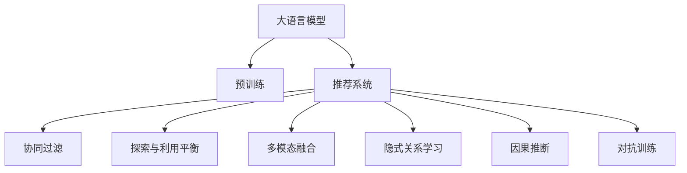

                 

# 利用LLM提升推荐系统的探索与利用平衡

## 1. 背景介绍

### 1.1 问题由来

推荐系统是互联网和电子商务领域的重要应用，旨在根据用户的历史行为、兴趣偏好等数据，为用户推荐合适的商品、服务、内容等。传统的推荐系统主要依赖于基于协同过滤和内容分析的算法，这些方法在一定程度上解决了推荐问题，但存在一些局限性。

- 协同过滤算法需要大量的用户行为数据，对于新用户的推荐效果较差。
- 内容分析方法往往难以捕捉用户兴趣的多样性，推荐结果可能存在偏差。

随着深度学习技术的兴起，大语言模型（Large Language Model，LLM）在推荐系统中的应用也逐渐受到关注。LLM通过大规模语料预训练，获得了强大的语言理解能力，可以用于挖掘用户需求和商品特征的隐式关系，从而提升推荐系统的效果。

### 1.2 问题核心关键点

大语言模型在推荐系统中的应用，主要体现在以下几个方面：

- **用户行为建模**：利用LLM对用户输入的文本信息进行语义理解，如搜索词、评论、评分等，从而捕捉用户的兴趣点。
- **商品特征提取**：通过LLM对商品描述、标题等文本信息进行语义分析，挖掘商品的关键特征。
- **隐式关系学习**：利用LLM学习用户和商品之间的隐式关联，如通过语义相似度计算等方法。
- **多模态融合**：将文本信息与图片、音频等多模态数据融合，构建更加丰富全面的推荐模型。
- **探索与利用平衡**：通过LLM对探索性数据进行建模，引导模型在推荐中平衡探索和利用。

## 2. 核心概念与联系

### 2.1 核心概念概述

为更好地理解大语言模型在推荐系统中的应用，本节将介绍几个密切相关的核心概念：

- **大语言模型**：指通过大规模语料预训练获得的语言模型，如BERT、GPT等。
- **预训练**：指在大规模无标签文本语料上，通过自监督学习任务训练通用语言模型的过程。
- **推荐系统**：根据用户的历史行为和兴趣偏好，推荐合适的商品、服务、内容等的系统。
- **协同过滤**：通过用户行为数据进行相似性匹配，推荐类似商品或服务的方法。
- **探索与利用平衡**：在推荐系统中，既要利用已有的历史数据，又要探索新的数据，以保持系统的多样性和创新性。
- **多模态融合**：将文本信息与图片、音频等多模态数据结合，构建更全面的推荐模型。
- **隐式关系学习**：利用模型学习用户和商品之间的隐式关联，提高推荐效果。
- **因果推断**：通过因果分析方法，识别推荐决策的关键因素，优化推荐效果。
- **对抗训练**：通过引入对抗样本，提高模型鲁棒性，减少推荐偏差。

这些核心概念之间的逻辑关系可以通过以下Mermaid流程图来展示：



这个流程图展示了大语言模型在推荐系统中的应用框架，及其与其他核心概念的联系：

1. 大语言模型通过预训练获得语言理解能力。
2. 推荐系统利用大语言模型进行用户行为建模和商品特征提取。
3. 协同过滤、探索与利用平衡、多模态融合等方法，进一步提升推荐效果。
4. 隐式关系学习、因果推断、对抗训练等技术，确保推荐的公平性、多样性和鲁棒性。

## 3. 核心算法原理 & 具体操作步骤
### 3.1 算法原理概述

基于大语言模型的推荐系统，本质上是一种基于语义相似度匹配的推荐方法。其核心思想是：通过预训练模型对用户输入和商品描述进行语义编码，计算用户和商品之间的语义相似度，从而进行推荐。

形式化地，假设预训练语言模型为 $M_{\theta}$，其中 $\theta$ 为预训练得到的模型参数。给定用户 $u$ 的描述文本 $x_u$ 和商品 $i$ 的描述文本 $x_i$，推荐系统目标为最大化用户 $u$ 对商品 $i$ 的评分 $y_{ui}$，即：

$$
\max_{\theta} \sum_{i=1}^{|\mathcal{I}|} \sum_{u=1}^{|\mathcal{U}|} y_{ui} \log P_{M_{\theta}}(y_{ui} | x_u, x_i)
$$

其中 $P_{M_{\theta}}(y_{ui} | x_u, x_i)$ 为模型在给定用户 $u$ 和商品 $i$ 的文本描述时，预测用户 $u$ 对商品 $i$ 的评分概率。通过最大化该概率的加权和，可以使得推荐系统更加符合用户的兴趣。

### 3.2 算法步骤详解

基于大语言模型的推荐系统一般包括以下几个关键步骤：

**Step 1: 准备预训练模型和数据集**
- 选择合适的预训练语言模型 $M_{\theta}$ 作为初始化参数，如 BERT、GPT等。
- 准备用户和商品的数据集，包括用户描述和商品描述，划分为训练集、验证集和测试集。一般要求文本与预训练数据的分布不要差异过大。

**Step 2: 添加任务适配层**
- 根据任务类型，在预训练模型顶层设计合适的输出层和损失函数。
- 对于评分任务，通常在顶层添加回归器或交叉熵回归器。
- 对于排名任务，通常使用排序损失函数，如pairwise hinge loss、listwise loss等。

**Step 3: 设置推荐超参数**
- 选择合适的优化算法及其参数，如 AdamW、SGD 等，设置学习率、批大小、迭代轮数等。
- 设置正则化技术及强度，包括权重衰减、Dropout、Early Stopping等。
- 确定冻结预训练参数的策略，如仅微调顶层，或全部参数都参与微调。

**Step 4: 执行梯度训练**
- 将训练集数据分批次输入模型，前向传播计算损失函数。
- 反向传播计算参数梯度，根据设定的优化算法和学习率更新模型参数。
- 周期性在验证集上评估模型性能，根据性能指标决定是否触发 Early Stopping。
- 重复上述步骤直到满足预设的迭代轮数或 Early Stopping 条件。

**Step 5: 测试和部署**
- 在测试集上评估推荐系统的性能，对比微调前后的精度提升。
- 使用微调后的模型对新样本进行推荐，集成到实际的应用系统中。
- 持续收集新的用户行为数据，定期重新微调模型，以适应数据分布的变化。

以上是基于大语言模型推荐系统的一般流程。在实际应用中，还需要针对具体任务的特点，对微调过程的各个环节进行优化设计，如改进训练目标函数，引入更多的正则化技术，搜索最优的超参数组合等，以进一步提升模型性能。

### 3.3 算法优缺点

基于大语言模型的推荐系统有以下优点：

1. **理解语义**：能够从文本描述中理解用户和商品的语义，从而进行更深层次的匹配和推荐。
2. **泛化能力强**：预训练语言模型具备强大的泛化能力，能够处理未知领域的数据。
3. **可解释性高**：推荐结果可以通过语义分析进行解释，有助于提升用户的信任感。
4. **灵活性高**：可以结合多种特征，如图片、音频等，构建更加丰富全面的推荐模型。
5. **适应性强**：在数据分布变化时，能够动态调整推荐策略，适应新场景。

同时，该方法也存在一定的局限性：

1. **计算成本高**：预训练语言模型参数量大，训练和推理成本较高。
2. **模型复杂度高**：推荐模型较为复杂，需要更多的训练数据和计算资源。
3. **数据稀疏性**：对于一些新商品或用户，缺乏足够的训练数据，推荐效果可能较差。
4. **过拟合风险**：在用户和商品描述复杂多样时，容易过拟合。
5. **实时性问题**：在实时推荐场景中，模型响应速度较慢，难以满足低延迟需求。

尽管存在这些局限性，但就目前而言，基于大语言模型的推荐系统仍具有广泛的应用前景，尤其是在商品推荐、内容推荐等领域。

## 4. 数学模型和公式 & 详细讲解 & 举例说明
### 4.1 数学模型构建

本节将使用数学语言对基于大语言模型的推荐系统进行更加严格的刻画。

假设预训练语言模型为 $M_{\theta}$，其中 $\theta$ 为模型参数。给定用户 $u$ 的描述文本 $x_u$ 和商品 $i$ 的描述文本 $x_i$，推荐系统的目标为最大化用户 $u$ 对商品 $i$ 的评分 $y_{ui}$，即：

$$
\max_{\theta} \sum_{i=1}^{|\mathcal{I}|} \sum_{u=1}^{|\mathcal{U}|} y_{ui} \log P_{M_{\theta}}(y_{ui} | x_u, x_i)
$$

其中 $P_{M_{\theta}}(y_{ui} | x_u, x_i)$ 为模型在给定用户 $u$ 和商品 $i$ 的文本描述时，预测用户 $u$ 对商品 $i$ 的评分概率。

假设 $M_{\theta}$ 在文本 $x$ 上的输出为 $\hat{y}=M_{\theta}(x)$，表示模型对文本 $x$ 的语义编码。则推荐系统的目标可以表示为：

$$
\max_{\theta} \sum_{i=1}^{|\mathcal{I}|} \sum_{u=1}^{|\mathcal{U}|} y_{ui} \log \hat{y}_{ui}
$$

其中 $\hat{y}_{ui}$ 为模型对用户 $u$ 和商品 $i$ 的评分预测。

### 4.2 公式推导过程

以下我们以评分任务为例，推导推荐系统的损失函数及其梯度的计算公式。

假设模型 $M_{\theta}$ 在用户描述 $x_u$ 和商品描述 $x_i$ 上的输出为 $\hat{y}_{ui}$。则评分任务的损失函数为交叉熵损失，定义为：

$$
L(u,i) = -y_{ui} \log \hat{y}_{ui} - (1-y_{ui}) \log (1-\hat{y}_{ui})
$$

将上式代入目标函数，得：

$$
\max_{\theta} \sum_{i=1}^{|\mathcal{I}|} \sum_{u=1}^{|\mathcal{U}|} L(u,i)
$$

对 $\theta$ 求梯度，得：

$$
\frac{\partial \max_{\theta} \sum_{i=1}^{|\mathcal{I}|} \sum_{u=1}^{|\mathcal{U}|} L(u,i)}{\partial \theta} = \sum_{i=1}^{|\mathcal{I}|} \sum_{u=1}^{|\mathcal{U}|} \nabla_{\theta} L(u,i)
$$

其中 $\nabla_{\theta} L(u,i)$ 为损失函数对参数 $\theta$ 的梯度，可通过反向传播算法高效计算。

在得到损失函数的梯度后，即可带入参数更新公式，完成模型的迭代优化。重复上述过程直至收敛，最终得到适应推荐任务的最优模型参数 $\theta^*$。

## 5. 项目实践：代码实例和详细解释说明
### 5.1 开发环境搭建

在进行推荐系统开发前，我们需要准备好开发环境。以下是使用Python进行PyTorch开发的环境配置流程：

1. 安装Anaconda：从官网下载并安装Anaconda，用于创建独立的Python环境。

2. 创建并激活虚拟环境：
```bash
conda create -n pytorch-env python=3.8 
conda activate pytorch-env
```

3. 安装PyTorch：根据CUDA版本，从官网获取对应的安装命令。例如：
```bash
conda install pytorch torchvision torchaudio cudatoolkit=11.1 -c pytorch -c conda-forge
```

4. 安装Transformers库：
```bash
pip install transformers
```

5. 安装各类工具包：
```bash
pip install numpy pandas scikit-learn matplotlib tqdm jupyter notebook ipython
```

完成上述步骤后，即可在`pytorch-env`环境中开始推荐系统开发。

### 5.2 源代码详细实现

下面我们以基于大语言模型的评分推荐系统为例，给出使用Transformers库对BERT模型进行评分推荐开发的PyTorch代码实现。

首先，定义评分推荐任务的数据处理函数：

```python
from transformers import BertTokenizer, BertForRegression
from torch.utils.data import Dataset
import torch

class RatingDataset(Dataset):
    def __init__(self, texts, ratings, tokenizer, max_len=128):
        self.texts = texts
        self.ratings = ratings
        self.tokenizer = tokenizer
        self.max_len = max_len
        
    def __len__(self):
        return len(self.texts)
    
    def __getitem__(self, item):
        text = self.texts[item]
        rating = self.ratings[item]
        
        encoding = self.tokenizer(text, return_tensors='pt', max_length=self.max_len, padding='max_length', truncation=True)
        input_ids = encoding['input_ids'][0]
        attention_mask = encoding['attention_mask'][0]
        
        # 对评分进行编码
        encoded_rating = float(rating)
        labels = torch.tensor(encoded_rating, dtype=torch.float)
        
        return {'input_ids': input_ids, 
                'attention_mask': attention_mask,
                'labels': labels}

# 数据加载
tokenizer = BertTokenizer.from_pretrained('bert-base-cased')

train_dataset = RatingDataset(train_texts, train_ratings, tokenizer)
dev_dataset = RatingDataset(dev_texts, dev_ratings, tokenizer)
test_dataset = RatingDataset(test_texts, test_ratings, tokenizer)
```

然后，定义模型和优化器：

```python
from transformers import BertForRegression, AdamW

model = BertForRegression.from_pretrained('bert-base-cased')

optimizer = AdamW(model.parameters(), lr=2e-5)
```

接着，定义训练和评估函数：

```python
from torch.utils.data import DataLoader
from tqdm import tqdm
from sklearn.metrics import mean_squared_error

device = torch.device('cuda') if torch.cuda.is_available() else torch.device('cpu')
model.to(device)

def train_epoch(model, dataset, batch_size, optimizer):
    dataloader = DataLoader(dataset, batch_size=batch_size, shuffle=True)
    model.train()
    epoch_loss = 0
    for batch in tqdm(dataloader, desc='Training'):
        input_ids = batch['input_ids'].to(device)
        attention_mask = batch['attention_mask'].to(device)
        labels = batch['labels'].to(device)
        model.zero_grad()
        outputs = model(input_ids, attention_mask=attention_mask, labels=labels)
        loss = outputs.loss
        epoch_loss += loss.item()
        loss.backward()
        optimizer.step()
    return epoch_loss / len(dataloader)

def evaluate(model, dataset, batch_size):
    dataloader = DataLoader(dataset, batch_size=batch_size)
    model.eval()
    preds, labels = [], []
    with torch.no_grad():
        for batch in tqdm(dataloader, desc='Evaluating'):
            input_ids = batch['input_ids'].to(device)
            attention_mask = batch['attention_mask'].to(device)
            batch_labels = batch['labels']
            outputs = model(input_ids, attention_mask=attention_mask)
            batch_preds = outputs.logits.mean(dim=1).to('cpu').tolist()
            batch_labels = batch_labels.to('cpu').tolist()
            for pred, label in zip(batch_preds, batch_labels):
                preds.append(pred)
                labels.append(label)
                
    print(mean_squared_error(labels, preds))
```

最后，启动训练流程并在测试集上评估：

```python
epochs = 5
batch_size = 16

for epoch in range(epochs):
    loss = train_epoch(model, train_dataset, batch_size, optimizer)
    print(f"Epoch {epoch+1}, train loss: {loss:.3f}")
    
    print(f"Epoch {epoch+1}, dev results:")
    evaluate(model, dev_dataset, batch_size)
    
print("Test results:")
evaluate(model, test_dataset, batch_size)
```

以上就是使用PyTorch对BERT进行评分推荐任务开发的完整代码实现。可以看到，得益于Transformers库的强大封装，我们可以用相对简洁的代码完成BERT模型的加载和评分推荐任务。

### 5.3 代码解读与分析

让我们再详细解读一下关键代码的实现细节：

**RatingDataset类**：
- `__init__`方法：初始化文本、评分、分词器等关键组件。
- `__len__`方法：返回数据集的样本数量。
- `__getitem__`方法：对单个样本进行处理，将文本输入编码为token ids，将评分编码为浮点数，并对其进行定长padding，最终返回模型所需的输入。

**数据加载**：
- 使用BertTokenizer对用户和商品的描述文本进行编码，转换为模型能够接受的格式。

**模型和优化器**：
- 使用BertForRegression模型进行评分预测，并使用AdamW优化器进行参数更新。

**训练和评估函数**：
- 使用PyTorch的DataLoader对数据集进行批次化加载，供模型训练和推理使用。
- 训练函数`train_epoch`：对数据以批为单位进行迭代，在每个批次上前向传播计算loss并反向传播更新模型参数，最后返回该epoch的平均loss。
- 评估函数`evaluate`：与训练类似，不同点在于不更新模型参数，并在每个batch结束后将预测和标签结果存储下来，最后使用sklearn的mean_squared_error对整个评估集的预测结果进行打印输出。

**训练流程**：
- 定义总的epoch数和batch size，开始循环迭代
- 每个epoch内，先在训练集上训练，输出平均loss
- 在验证集上评估，输出评分均方误差
- 所有epoch结束后，在测试集上评估，给出最终评分预测结果

可以看到，PyTorch配合Transformers库使得BERT评分推荐任务的代码实现变得简洁高效。开发者可以将更多精力放在数据处理、模型改进等高层逻辑上，而不必过多关注底层的实现细节。

当然，工业级的系统实现还需考虑更多因素，如模型的保存和部署、超参数的自动搜索、更灵活的任务适配层等。但核心的评分推荐范式基本与此类似。

## 6. 实际应用场景
### 6.1 电商推荐系统

基于大语言模型的推荐系统在电商领域的应用尤为广泛。用户对商品的评分、评论、反馈等文本信息，可以用于训练模型进行推荐。通过微调BERT等大语言模型，可以自动理解用户的文本描述，分析出用户的兴趣点，从而推荐符合用户需求的商品。

具体而言，可以收集用户的历史评分数据和评论内容，构建评分推荐任务的监督数据集。在此基础上对预训练模型进行微调，使其能够自动预测用户对商品的评分。根据评分结果，再进一步筛选推荐商品，确保推荐的精准度。

### 6.2 电影推荐系统

电影推荐系统主要关注用户对电影的评分和评价，基于大语言模型可以构建出更加精准的推荐模型。用户对电影的评分、评论和剧情描述等文本信息，可以用于训练模型进行推荐。

在具体实现中，可以通过微调BERT等大语言模型，对用户的评分和评论进行语义理解，分析出用户的偏好。同时，利用电影的名称、简介、演员等文本信息，构建出商品特征向量。通过计算用户和电影的语义相似度，进行推荐。

### 6.3 新闻推荐系统

新闻推荐系统需要根据用户的历史阅读记录和评论，推荐用户感兴趣的新闻内容。基于大语言模型，可以构建出更加智能化的新闻推荐系统。

具体而言，可以收集用户的历史阅读记录和评论内容，构建评分推荐任务的监督数据集。在此基础上对预训练模型进行微调，使其能够自动预测用户对新闻的评分。根据评分结果，再进一步筛选推荐新闻，确保推荐的精准度。

### 6.4 未来应用展望

随着大语言模型和推荐系统的发展，基于大语言模型的推荐方法将在更多领域得到应用，为推荐系统带来新的突破。

在智慧医疗领域，基于大语言模型的推荐系统可以用于推荐适合的医疗方案、药物等信息，提高医疗服务的个性化水平。

在智能教育领域，推荐系统可以用于推荐个性化的学习资源、课程等，提升学生的学习效率和效果。

在智慧城市治理中，推荐系统可以用于推荐交通出行、旅游景点等信息，提升城市管理的智能化水平。

此外，在企业生产、社会治理、文娱传媒等众多领域，基于大语言模型的推荐系统也将不断涌现，为各行各业带来变革性影响。相信随着技术的日益成熟，大语言模型推荐方法将不断拓展应用场景，为经济社会发展注入新的动力。

## 7. 工具和资源推荐
### 7.1 学习资源推荐

为了帮助开发者系统掌握大语言模型在推荐系统中的应用，这里推荐一些优质的学习资源：

1. 《Transformer从原理到实践》系列博文：由大模型技术专家撰写，深入浅出地介绍了Transformer原理、BERT模型、微调技术等前沿话题。

2. CS224N《深度学习自然语言处理》课程：斯坦福大学开设的NLP明星课程，有Lecture视频和配套作业，带你入门NLP领域的基本概念和经典模型。

3. 《Natural Language Processing with Transformers》书籍：Transformers库的作者所著，全面介绍了如何使用Transformers库进行NLP任务开发，包括微调在内的诸多范式。

4. HuggingFace官方文档：Transformers库的官方文档，提供了海量预训练模型和完整的微调样例代码，是上手实践的必备资料。

5. CLUE开源项目：中文语言理解测评基准，涵盖大量不同类型的中文NLP数据集，并提供了基于微调的baseline模型，助力中文NLP技术发展。

通过对这些资源的学习实践，相信你一定能够快速掌握大语言模型在推荐系统中的应用，并用于解决实际的推荐问题。
###  7.2 开发工具推荐

高效的开发离不开优秀的工具支持。以下是几款用于大语言模型推荐系统开发的常用工具：

1. PyTorch：基于Python的开源深度学习框架，灵活动态的计算图，适合快速迭代研究。大部分预训练语言模型都有PyTorch版本的实现。

2. TensorFlow：由Google主导开发的开源深度学习框架，生产部署方便，适合大规模工程应用。同样有丰富的预训练语言模型资源。

3. Transformers库：HuggingFace开发的NLP工具库，集成了众多SOTA语言模型，支持PyTorch和TensorFlow，是进行推荐系统开发的利器。

4. Weights & Biases：模型训练的实验跟踪工具，可以记录和可视化模型训练过程中的各项指标，方便对比和调优。与主流深度学习框架无缝集成。

5. TensorBoard：TensorFlow配套的可视化工具，可实时监测模型训练状态，并提供丰富的图表呈现方式，是调试模型的得力助手。

6. Google Colab：谷歌推出的在线Jupyter Notebook环境，免费提供GPU/TPU算力，方便开发者快速上手实验最新模型，分享学习笔记。

合理利用这些工具，可以显著提升大语言模型推荐系统的开发效率，加快创新迭代的步伐。

### 7.3 相关论文推荐

大语言模型和推荐系统的发展源于学界的持续研究。以下是几篇奠基性的相关论文，推荐阅读：

1. Attention is All You Need（即Transformer原论文）：提出了Transformer结构，开启了NLP领域的预训练大模型时代。

2. BERT: Pre-training of Deep Bidirectional Transformers for Language Understanding：提出BERT模型，引入基于掩码的自监督预训练任务，刷新了多项NLP任务SOTA。

3. Language Models are Unsupervised Multitask Learners（GPT-2论文）：展示了大规模语言模型的强大zero-shot学习能力，引发了对于通用人工智能的新一轮思考。

4. Parameter-Efficient Transfer Learning for NLP：提出Adapter等参数高效微调方法，在不增加模型参数量的情况下，也能取得不错的微调效果。

5. Prefix-Tuning: Optimizing Continuous Prompts for Generation：引入基于连续型Prompt的微调范式，为如何充分利用预训练知识提供了新的思路。

6. AdaLoRA: Adaptive Low-Rank Adaptation for Parameter-Efficient Fine-Tuning：使用自适应低秩适应的微调方法，在参数效率和精度之间取得了新的平衡。

这些论文代表了大语言模型推荐系统的发展脉络。通过学习这些前沿成果，可以帮助研究者把握学科前进方向，激发更多的创新灵感。

## 8. 总结：未来发展趋势与挑战
### 8.1 总结

本文对基于大语言模型的推荐系统进行了全面系统的介绍。首先阐述了大语言模型和推荐系统在研究背景和应用意义，明确了推荐系统在大语言模型帮助下，能够更好地理解用户需求和商品特征，提升推荐效果。其次，从原理到实践，详细讲解了大语言模型在推荐系统中的应用流程和关键步骤，给出了推荐系统开发的完整代码实例。同时，本文还广泛探讨了推荐系统在电商、电影、新闻等领域的应用前景，展示了推荐系统的广泛应用潜力。此外，本文精选了推荐系统的各类学习资源，力求为读者提供全方位的技术指引。

通过本文的系统梳理，可以看到，基于大语言模型的推荐系统正在成为NLP领域的重要范式，极大地拓展了推荐系统的应用边界，催生了更多的落地场景。受益于大规模语料的预训练，推荐系统能够处理更复杂的文本信息，提供更加个性化、精准的推荐结果，为电子商务、娱乐、教育等领域带来革命性的变革。未来，伴随大语言模型和推荐技术的持续演进，基于大语言模型的推荐系统必将在更广阔的应用领域大放异彩，深刻影响人类的生产生活方式。

### 8.2 未来发展趋势

展望未来，大语言模型在推荐系统中的应用将呈现以下几个发展趋势：

1. **模型规模持续增大**：随着算力成本的下降和数据规模的扩张，预训练语言模型的参数量还将持续增长。超大规模语言模型蕴含的丰富语言知识，有望支撑更加复杂多变的推荐任务。

2. **多模态融合**：将文本信息与图片、音频等多模态数据结合，构建更丰富的推荐模型。多模态信息的融合，将显著提升推荐系统的效果和多样性。

3. **探索与利用平衡**：通过大语言模型对探索性数据进行建模，引导推荐系统在推荐中平衡探索和利用。未来的推荐系统将更加注重用户的新需求和兴趣变化，提高推荐的多样性和新颖性。

4. **因果推断**：通过因果分析方法，识别推荐决策的关键因素，优化推荐效果。因果推断方法将使得推荐系统更加透明、可解释，用户可以更容易理解推荐依据。

5. **对抗训练**：通过引入对抗样本，提高推荐系统的鲁棒性，减少推荐偏差。对抗训练方法将使得推荐系统更加安全、可靠。

6. **联邦学习**：在大规模分布式环境下，通过联邦学习技术，利用各方的数据资源，提高推荐模型的泛化能力和鲁棒性。

以上趋势凸显了大语言模型在推荐系统中的应用前景。这些方向的探索发展，必将进一步提升推荐系统的效果和多样性，为推荐系统在各领域的落地应用提供新的突破。

### 8.3 面临的挑战

尽管大语言模型在推荐系统中的应用已经取得了一定的进展，但在迈向更加智能化、普适化应用的过程中，它仍面临着诸多挑战：

1. **数据稀疏性**：对于一些新商品或用户，缺乏足够的训练数据，推荐效果可能较差。如何提高数据收集和处理的效率，扩大数据覆盖面，是一个重要挑战。

2. **计算成本高**：预训练语言模型参数量大，训练和推理成本较高。如何降低计算成本，提高推荐系统的实时性，是一个重要挑战。

3. **模型复杂度高**：推荐模型较为复杂，需要更多的训练数据和计算资源。如何简化模型结构，提高模型效率，是一个重要挑战。

4. **实时性问题**：在实时推荐场景中，模型响应速度较慢，难以满足低延迟需求。如何提高推荐系统的响应速度，优化模型性能，是一个重要挑战。

5. **数据隐私保护**：在推荐系统中，如何保护用户的隐私数据，防止数据泄露和滥用，是一个重要挑战。

6. **推荐公平性**：如何确保推荐系统的公平性，避免推荐偏差，是一个重要挑战。

7. **数据标注成本**：大规模标注数据获取成本高，如何降低数据标注成本，提高数据标注质量，是一个重要挑战。

正视推荐系统面临的这些挑战，积极应对并寻求突破，将是大语言模型推荐系统走向成熟的必由之路。相信随着学界和产业界的共同努力，这些挑战终将一一被克服，大语言模型推荐系统必将在构建人机协同的智能推荐体系中扮演越来越重要的角色。

### 8.4 研究展望

面对大语言模型在推荐系统中的应用，未来的研究需要在以下几个方面寻求新的突破：

1. **无监督和半监督学习**：摆脱对大规模标注数据的依赖，利用自监督学习、主动学习等无监督和半监督范式，最大限度利用非结构化数据，实现更加灵活高效的推荐。

2. **参数高效和计算高效的微调方法**：开发更加参数高效的微调方法，在固定大部分预训练参数的同时，只更新极少量的任务相关参数。同时优化微调模型的计算图，减少前向传播和反向传播的资源消耗，实现更加轻量级、实时性的部署。

3. **多模态推荐系统**：将文本信息与图片、音频等多模态数据结合，构建更丰富的推荐模型。多模态信息的融合，将显著提升推荐系统的效果和多样性。

4. **因果推荐系统**：通过因果分析方法，识别推荐决策的关键因素，优化推荐效果。因果推断方法将使得推荐系统更加透明、可解释，用户可以更容易理解推荐依据。

5. **联邦推荐系统**：在大规模分布式环境下，通过联邦学习技术，利用各方的数据资源，提高推荐模型的泛化能力和鲁棒性。

6. **知识图谱与推荐系统融合**：将符号化的先验知识，如知识图谱、逻辑规则等，与神经网络模型进行巧妙融合，引导推荐过程学习更准确、合理的推荐结果。

7. **对抗训练与推荐系统融合**：通过引入对抗样本，提高推荐系统的鲁棒性，减少推荐偏差。对抗训练方法将使得推荐系统更加安全、可靠。

这些研究方向的探索，必将引领大语言模型推荐系统技术迈向更高的台阶，为推荐系统在各领域的落地应用提供新的突破。相信随着技术的不断进步，大语言模型推荐系统将不断拓展应用场景，为经济社会发展注入新的动力。

## 9. 附录：常见问题与解答

**Q1：基于大语言模型的推荐系统是否适用于所有推荐任务？**

A: 基于大语言模型的推荐系统在大多数推荐任务上都能取得不错的效果，特别是对于数据量较小的任务。但对于一些特定领域的任务，如医学、法律等，仅仅依靠通用语料预训练的模型可能难以很好地适应。此时需要在特定领域语料上进一步预训练，再进行微调，才能获得理想效果。此外，对于一些需要时效性、个性化很强的任务，如对话、推荐等，微调方法也需要针对性的改进优化。

**Q2：微调过程中如何选择合适的学习率？**

A: 微调的学习率一般要比预训练时小1-2个数量级，如果使用过大的学习率，容易破坏预训练权重，导致过拟合。一般建议从1e-5开始调参，逐步减小学习率，直至收敛。也可以使用warmup策略，在开始阶段使用较小的学习率，再逐渐过渡到预设值。需要注意的是，不同的优化器(如AdamW、Adafactor等)以及不同的学习率调度策略，可能需要设置不同的学习率阈值。

**Q3：采用大语言模型推荐时会面临哪些资源瓶颈？**

A: 目前主流的预训练大模型动辄以亿计的参数规模，对算力、内存、存储都提出了很高的要求。GPU/TPU等高性能设备是必不可少的，但即便如此，超大批次的训练和推理也可能遇到显存不足的问题。因此需要采用一些资源优化技术，如梯度积累、混合精度训练、模型并行等，来突破硬件瓶颈。同时，模型的存储和读取也可能占用大量时间和空间，需要采用模型压缩、稀疏化存储等方法进行优化。

**Q4：如何缓解微调过程中的过拟合问题？**

A: 过拟合是微调面临的主要挑战，尤其是在用户和商品描述复杂多样时，容易过拟合。常见的缓解策略包括：
1. 数据增强：通过回译、近义替换等方式扩充训练集。
2. 正则化：使用L2正则、Dropout、Early Stopping等避免过拟合。
3. 对抗训练：引入对抗样本，提高模型鲁棒性。
4. 参数高效微调：只调整少量参数(如Adapter、Prefix等)，减小过拟合风险。
5. 多模型集成：训练多个微调模型，取平均输出，抑制过拟合。

这些策略往往需要根据具体任务和数据特点进行灵活组合。只有在数据、模型、训练、推理等各环节进行全面优化，才能最大限度地发挥大语言模型微调的威力。

**Q5：如何提高推荐系统的实时性？**

A: 推荐系统的实时性问题可以通过以下几个方面进行优化：
1. 模型剪枝：通过剪枝技术去除冗余参数，减小模型大小，提高推理速度。
2. 量化加速：将浮点模型转为定点模型，压缩存储空间，提高计算效率。
3. 分布式训练：在分布式环境下，通过多机协同训练，提高训练速度。
4. 异构计算：利用GPU、TPU等异构硬件资源，提高计算效率。
5. 缓存技术：使用缓存技术，减少模型推理过程中的计算量，提高响应速度。

合理利用这些技术，可以有效提高推荐系统的实时性，满足用户对低延迟的需求。

**Q6：如何保护推荐系统的数据隐私？**

A: 推荐系统的数据隐私保护可以通过以下几个方面进行优化：
1. 数据匿名化：通过对用户数据进行去标识化处理，保护用户隐私。
2. 差分隐私：通过差分隐私技术，在数据使用过程中，减少对用户隐私的损害。
3. 联邦学习：在大规模分布式环境下，通过联邦学习技术，保护用户隐私。
4. 安全计算：使用安全计算技术，保护数据在传输和存储过程中的安全性。

合理利用这些技术，可以有效保护推荐系统的数据隐私，防止数据泄露和滥用。

---

作者：禅与计算机程序设计艺术 / Zen and the Art of Computer Programming

