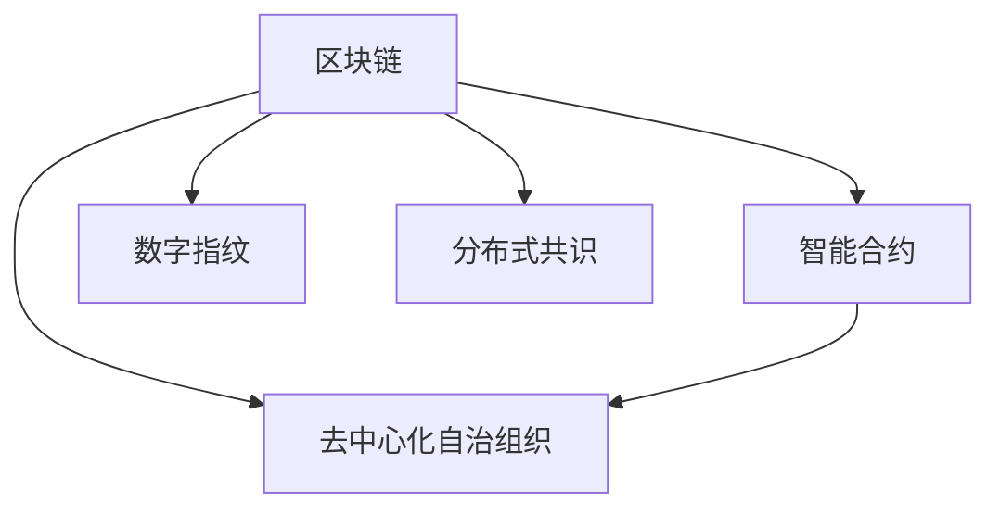

                 

## 1. 背景介绍

在数字化时代，知识产权（Intellectual Property，IP）的价值不断增长，其保护与管理的难度也在不断增加。传统的IP保护手段如专利申请、版权登记等虽然有效，但存在响应速度慢、程序复杂、法律漏洞等缺陷。因此，寻求一种更为高效、透明、安全的IP保护新方式，成为亟待解决的问题。区块链技术作为一种分布式账本技术，具备去中心化、不可篡改、透明可信等特点，具备在IP保护领域发挥巨大潜力的条件。

### 1.1 问题由来

知识产权保护面临的挑战主要包括以下几个方面：

- **响应速度慢**：传统的IP保护方式程序繁琐，响应时间长，难以应对侵权行为的发展变化。
- **程序复杂**：涉及多个国家和地区的法律规定，程序复杂，增加了IP保护的成本和难度。
- **法律漏洞**：各国法律对IP的保护程度和方式存在差异，存在法律漏洞和灰色地带。
- **维权困难**：当IP被侵权时，往往需要耗费大量的时间和资源进行举证和维权。

这些挑战催生了对区块链技术在知识产权保护领域应用的需求。区块链的去中心化、不可篡改、透明可信等特点，使其成为保护知识产权的理想工具。

## 2. 核心概念与联系

### 2.1 核心概念概述

为更好地理解区块链技术在IP保护中的应用，本节将介绍几个密切相关的核心概念：

- **区块链（Blockchain）**：一种分布式账本技术，通过去中心化网络中的节点共识机制，维护一个不可篡改的交易记录链，用于记录、验证和传输数据。
- **智能合约（Smart Contract）**：运行在区块链上的自执行合约，通过代码逻辑自动执行合同条款，实现自动化的知识产权交易和保护。
- **数字指纹（Digital Fingerprint）**：用于验证IP内容完整性的哈希值，可以用于验证作品的原始性和防止篡改。
- **分布式共识（Distributed Consensus）**：区块链系统中的共识机制，确保所有节点的数据一致性，防止单点故障和数据篡改。
- **去中心化自治组织（DAO）**：由代码和规则驱动的组织，可以在区块链上自主决策和管理IP相关事务。

这些核心概念之间的逻辑关系可以通过以下Mermaid流程图来展示：



这个流程图展示了大语言模型的核心概念及其之间的关系：

1. 区块链通过分布式共识和数字指纹等技术，确保了其安全性和不可篡改性。
2. 智能合约利用区块链的技术基础，实现自动化的IP交易和保护。
3. 数字指纹用于验证IP内容的完整性和原始性。
4. 去中心化自治组织通过代码和规则，实现自治化的IP管理。

这些核心概念共同构成了区块链在IP保护领域的核心技术框架，使其能够高效、透明地管理和保护IP。

## 3. 核心算法原理 & 具体操作步骤

### 3.1 算法原理概述

利用区块链技术保护知识产权，其核心算法原理基于分布式账本和智能合约技术，通过以下几个步骤实现IP的保护和管理：

1. **数字指纹生成与验证**：对IP内容进行哈希计算，生成数字指纹。通过区块链的不可篡改性，验证IP的完整性和原始性。
2. **智能合约自动执行**：在区块链上部署智能合约，自动执行IP的交易和管理。如版权登记、授权使用、侵权举证等。
3. **去中心化自治组织治理**：利用DAO机制，通过代码和规则，实现IP的自动管理和决策。
4. **分布式共识机制**：通过区块链的共识机制，确保所有节点数据的一致性和透明性，防止单点故障和数据篡改。

### 3.2 算法步骤详解

利用区块链技术保护知识产权的一般步骤如下：

**Step 1: 数字指纹生成**
- 对IP内容进行哈希计算，生成数字指纹。使用SHA-256、MD5等算法。
- 将数字指纹存储在区块链上，用于验证IP内容的完整性和原始性。

**Step 2: 智能合约部署**
- 在区块链上部署智能合约，定义IP的使用、授权、转移等规则。
- 通过代码逻辑自动执行合同条款，实现自动化的IP管理。

**Step 3: 授权使用**
- 通过智能合约设置IP的授权使用规则，包括使用期限、使用方式、付费标准等。
- 授权方与被授权方在智能合约上进行操作，如签署授权协议、支付费用等。

**Step 4: 侵权举证**
- 当IP被侵权时，通过智能合约提供侵权证据，触发自动化的举证流程。
- 智能合约自动记录侵权行为，提供诉讼证据，减少侵权举证的复杂性和成本。

**Step 5: 治理与监督**
- 通过DAO机制，对IP的使用和管理进行监督和治理。
- 利用代码和规则，确保IP管理的透明性和自治性。

### 3.3 算法优缺点

利用区块链技术保护知识产权具有以下优点：

1. **透明性**：所有交易记录公开透明，可追溯性高，有助于解决维权困难。
2. **去中心化**：无需依赖第三方机构，减少了程序复杂性和法律漏洞。
3. **不可篡改**：区块链的不可篡改性确保了IP内容的完整性和原始性。
4. **自动化**：智能合约自动执行合同条款，提高了IP管理的效率和准确性。

同时，该方法也存在一定的局限性：

1. **技术门槛高**：区块链和智能合约技术的复杂性，使得一般用户难以直接使用。
2. **性能瓶颈**：大规模交易和智能合约的执行可能会影响区块链的性能。
3. **隐私问题**：某些IP内容可能涉及隐私，不适合公开存储。
4. **法律合规性**：不同国家和地区的法律规定不同，需要进一步探索合规性问题。

尽管存在这些局限性，但区块链在IP保护领域的应用前景广阔，具有巨大的潜力。

### 3.4 算法应用领域

区块链技术在知识产权保护中的应用领域包括但不限于：

- **版权管理**：对音乐、文学、视频等作品的版权进行登记和授权。
- **专利管理**：对专利的申请、授权、转移等进行自动化的管理。
- **商标管理**：对商标的注册、使用、转让等进行透明的管理。
- **数字艺术品管理**：对数字艺术品的内容、所有权和交易进行管理。
- **开源软件管理**：对开源软件的贡献、授权和分发进行管理。

## 4. 数学模型和公式 & 详细讲解 & 举例说明

### 4.1 数学模型构建

本节将使用数学语言对区块链技术在IP保护中的应用进行更加严格的刻画。

设IP内容为 $D$，其数字指纹为 $F$，通过哈希函数计算得到：

$$
F = \text{Hash}(D)
$$

其中 $\text{Hash}$ 为哈希函数，常用的有 SHA-256、MD5 等。

在区块链上，每个区块记录的交易包括数字指纹 $F$ 和相关的元数据，用于验证IP的完整性和原始性。

### 4.2 公式推导过程

以版权登记为例，推导数字指纹生成与验证的公式：

假设版权内容为 $D$，其数字指纹为 $F$。数字指纹的计算公式为：

$$
F = \text{Hash}(D)
$$

验证版权内容完整性和原始性的步骤如下：

1. 对原始版权内容 $D$ 进行哈希计算，得到 $F_1$。
2. 从区块链上获取版权的元数据，并计算其数字指纹 $F_2$。
3. 比较 $F_1$ 和 $F_2$，若相等，则版权内容完整且未被篡改。

### 4.3 案例分析与讲解

**案例：数字艺术品版权保护**

假设艺术家张三创作了一幅数字艺术品 $A$，其数字指纹为 $F_A$。通过区块链对其版权进行登记，步骤如下：

1. 对艺术品 $A$ 进行哈希计算，生成数字指纹 $F_A$。
2. 将 $F_A$ 和相关元数据（如艺术家信息、创作时间等）存储在区块链上。
3. 其他用户想要获取或使用该艺术品时，通过智能合约验证其数字指纹是否与区块链上的 $F_A$ 一致。

如果一致，则表示艺术品未被篡改，用户可以正常获取和使用。

## 5. 项目实践：代码实例和详细解释说明

### 5.1 开发环境搭建

在进行区块链IP保护项目开发前，我们需要准备好开发环境。以下是使用Solidity进行以太坊智能合约开发的指南：

1. 安装Node.js和npm：
```bash
sudo apt-get install nodejs
npm install -g truffle
```

2. 安装以太坊钱包：
```bash
npm install -g ganache-cli
```

3. 创建Truffle项目：
```bash
truffle init MyIPProject
```

4. 编写智能合约代码，并编译部署到以太坊区块链：
```javascript
// 1. 定义版权登记合约
pragma solidity ^0.8.0;
contract CopyrightRegistry {
    uint256 public copyrightID;
    uint256 public author;
    uint256 public creationTime;
    uint256 public lastUpdateTime;
    uint256 public fingerprint;
    string public title;
    string public description;
    bytes32 public url;
    address owner;
    address[] operators;
    event OwnerChanged(uint256 indexed _newOwner);
    constructor(uint256 _copyrightID, uint256 _author, uint256 _creationTime, uint256 _lastUpdateTime, uint256 _fingerprint, string memory _title, string memory _description, bytes32 memory _url, address _owner, address[] _operators) public {
        self.copyrightID = _copyrightID;
        self.author = _author;
        self.creationTime = _creationTime;
        self.lastUpdateTime = _lastUpdateTime;
        self.fingerprint = _fingerprint;
        self.title = _title;
        self.description = _description;
        self.url = _url;
        self.owner = _owner;
        self.operators = _operators;
    }
    function getCopyrightInfo() public view returns (uint256, uint256, uint256, uint256, uint256, string memory, string memory, bytes32, address, address[] memory) {
        return (copyrightID, author, creationTime, lastUpdateTime, fingerprint, title, description, url, owner, operators);
    }
    function updateCopyrightInfo(uint256 _copyrightID, uint256 _author, uint256 _creationTime, uint256 _lastUpdateTime, uint256 _fingerprint, string memory _title, string memory _description, bytes32 memory _url, address _owner, address[] memory _operators) public {
        require(msg.sender == owner);
        self.author = _author;
        self.creationTime = _creationTime;
        self.lastUpdateTime = _lastUpdateTime;
        self.fingerprint = _fingerprint;
        self.title = _title;
        self.description = _description;
        self.url = _url;
        self.owner = _owner;
        self.operators = _operators;
        emit OwnerChanged(owner);
    }
}
```

5. 编译并部署合约：
```bash
truffle compile
truffle migrate
```

6. 测试智能合约：
```javascript
// 1. 部署合约
var CopyrightRegistry = artifacts.require("CopyrightRegistry");
module.exports = function(deployer) {
    deployer.deploy(CopyrightRegistry, 1, 0x123456789, 0x123456789, 0x123456789, 0x123456789, "Title", "Description", "url", 0x123456789, [0x123456789]);
}
```

完成上述步骤后，即可在以太坊区块链上使用智能合约进行版权登记和管理。

### 5.2 源代码详细实现

下面是使用Solidity编写的版权登记合约代码，实现了版权信息的存储、验证和更新功能：

```javascript
// 1. 定义版权登记合约
pragma solidity ^0.8.0;
contract CopyrightRegistry {
    uint256 public copyrightID;
    uint256 public author;
    uint256 public creationTime;
    uint256 public lastUpdateTime;
    uint256 public fingerprint;
    string public title;
    string public description;
    bytes32 public url;
    address owner;
    address[] operators;
    event OwnerChanged(uint256 indexed _newOwner);
    constructor(uint256 _copyrightID, uint256 _author, uint256 _creationTime, uint256 _lastUpdateTime, uint256 _fingerprint, string memory _title, string memory _description, bytes32 memory _url, address _owner, address[] memory _operators) public {
        self.copyrightID = _copyrightID;
        self.author = _author;
        self.creationTime = _creationTime;
        self.lastUpdateTime = _lastUpdateTime;
        self.fingerprint = _fingerprint;
        self.title = _title;
        self.description = _description;
        self.url = _url;
        self.owner = _owner;
        self.operators = _operators;
    }
    function getCopyrightInfo() public view returns (uint256, uint256, uint256, uint256, uint256, string memory, string memory, bytes32, address, address[] memory) {
        return (copyrightID, author, creationTime, lastUpdateTime, fingerprint, title, description, url, owner, operators);
    }
    function updateCopyrightInfo(uint256 _copyrightID, uint256 _author, uint256 _creationTime, uint256 _lastUpdateTime, uint256 _fingerprint, string memory _title, string memory _description, bytes32 memory _url, address _owner, address[] memory _operators) public {
        require(msg.sender == owner);
        self.author = _author;
        self.creationTime = _creationTime;
        self.lastUpdateTime = _lastUpdateTime;
        self.fingerprint = _fingerprint;
        self.title = _title;
        self.description = _description;
        self.url = _url;
        self.owner = _owner;
        self.operators = _operators;
        emit OwnerChanged(owner);
    }
}
```

### 5.3 代码解读与分析

让我们再详细解读一下关键代码的实现细节：

**CopyrightRegistry合约**：
- 定义了版权信息（如版权ID、作者、创作时间、数字指纹等）和版权管理权限（如所有者、授权人等）。
- 使用事件（Event）记录所有者变更记录，确保透明性。

**getCopyrightInfo函数**：
- 获取版权信息的公共函数，用户可以查询版权信息。
- 通过函数返回版权ID、作者、创作时间、数字指纹等关键信息。

**updateCopyrightInfo函数**：
- 更新版权信息的函数，只有所有者才能进行操作。
- 更新版权信息后，触发OwnerChanged事件，记录所有者变更。

## 6. 实际应用场景

### 6.1 智能合约自动执行版权管理

在版权登记后，通过智能合约可以实现自动化的版权管理，如版权转让、授权使用等。以版权转让为例，用户可以通过智能合约进行以下操作：

1. 查看版权信息：使用getCopyrightInfo函数获取版权详细信息。
2. 发起转让请求：调用转让函数，发起版权转让请求。
3. 接受转让请求：所有者接受转让请求，将版权转让给新所有者。
4. 使用版权：新所有者或授权人使用版权，调用授权函数。

### 6.2 分布式共识机制与去中心化自治组织

区块链的去中心化自治组织（DAO）机制，可以用于版权管理的决策和监督。通过DAO机制，版权所有者可以自主决策和管理版权事务，如设置使用规则、收取版权费用等。

在DAO机制下，版权所有者可以在区块链上对版权进行投票决策，确保版权管理的透明性和自治性。例如，版权所有者可以通过智能合约设置版权使用规则，如付费标准、使用期限等，确保版权管理的公平性和合理性。

### 6.3 数字指纹验证与防篡改

数字指纹技术可以用于验证IP内容的完整性和原始性。在版权登记时，生成版权内容的数字指纹，并存储在区块链上。用户获取版权内容时，通过智能合约验证数字指纹是否与区块链上的数字指纹一致。如果一致，则表示版权内容未被篡改，可以放心使用。

## 7. 工具和资源推荐

### 7.1 学习资源推荐

为了帮助开发者系统掌握区块链技术在IP保护中的应用，这里推荐一些优质的学习资源：

1. 《区块链原理与实践》系列博文：由区块链技术专家撰写，深入浅出地介绍了区块链技术原理、应用场景和开发方法。

2. 《以太坊智能合约实战》课程：ETH Labs提供的以太坊智能合约实战课程，涵盖了智能合约的开发、测试和部署等关键技术。

3. 《Solidity官方文档》：Solidity官方文档，提供了丰富的智能合约开发教程和样例代码，是学习和实践Solidity的必备资源。

4. 《IPFS基础教程》：IPFS官方提供的IPFS基础教程，介绍了IPFS的基本原理和应用场景，适合入门学习。

5. 《区块链开发入门指南》：Coinbase提供的区块链开发入门指南，涵盖区块链技术栈、开发工具和最佳实践。

通过对这些资源的学习实践，相信你一定能够快速掌握区块链技术在IP保护中的应用，并用于解决实际的IP保护问题。

### 7.2 开发工具推荐

高效的开发离不开优秀的工具支持。以下是几款用于区块链IP保护开发的常用工具：

1. Truffle：由ConsenSys开发的以太坊开发框架，提供智能合约的开发、测试和部署功能。
2. Ganache：以太坊本地的开发和测试工具，支持智能合约的本地部署和调试。
3. Remix：以太坊的集成开发环境，提供智能合约的在线开发和测试。
4. MetaMask：以太坊的官方钱包，支持智能合约的交互和操作。
5. Web3.js：以太坊的JavaScript库，提供与以太坊区块链的交互功能。

合理利用这些工具，可以显著提升区块链IP保护任务的开发效率，加快创新迭代的步伐。

### 7.3 相关论文推荐

区块链技术在IP保护领域的发展源于学界的持续研究。以下是几篇奠基性的相关论文，推荐阅读：

1. "A Survey on Intellectual Property Rights in Blockchain"：对区块链在IP保护领域的应用进行全面综述。
2. "Blockchain for Intellectual Property Management: A Survey"：对区块链在版权、专利、商标等IP保护中的应用进行深入探讨。
3. "Smart Contracts for Intellectual Property Protection: A Survey"：对区块链智能合约在IP保护中的应用进行深入分析。
4. "Blockchain and Distributed Ledger Technologies for Digital Copyright Management"：对区块链在数字版权管理中的应用进行详细分析。
5. "Intellectual Property Rights Management on Blockchain: Opportunities and Challenges"：对区块链在IP管理中的机会和挑战进行深入探讨。

这些论文代表了大语言模型微调技术的发展脉络。通过学习这些前沿成果，可以帮助研究者把握学科前进方向，激发更多的创新灵感。

## 8. 总结：未来发展趋势与挑战

### 8.1 总结

本文对区块链技术在知识产权保护中的应用进行了全面系统的介绍。首先阐述了区块链技术在IP保护领域的研究背景和意义，明确了区块链技术在提高IP保护效率、降低维权成本等方面的独特价值。其次，从原理到实践，详细讲解了区块链技术在IP保护中的应用流程，包括数字指纹生成与验证、智能合约自动执行、去中心化自治组织治理等关键步骤。同时，本文还广泛探讨了区块链技术在版权管理、专利管理、商标管理等各个领域的实际应用，展示了区块链技术在IP保护领域的应用前景。最后，本文精选了区块链技术的各类学习资源，力求为读者提供全方位的技术指引。

通过本文的系统梳理，可以看到，区块链技术在IP保护领域具备巨大的潜力，能够高效、透明地管理和保护IP。未来，伴随区块链技术的不断发展，其应用将更加广泛，有望在各个IP保护场景中发挥重要作用。

### 8.2 未来发展趋势

展望未来，区块链技术在IP保护领域将呈现以下几个发展趋势：

1. **普及度提升**：随着区块链技术的成熟和应用成本的降低，其在IP保护领域的应用将更加广泛，逐渐普及到各个行业。
2. **技术融合**：区块链技术将与其他新兴技术，如物联网、大数据、人工智能等进行深度融合，提升IP保护的效果和效率。
3. **法律合规性增强**：随着区块链技术的普及，各国法律对区块链技术的监管和合规性要求将逐步增强，保障IP保护的法律合规性。
4. **全球化治理**：通过DAO机制，建立全球化的IP保护治理框架，提升IP保护的透明度和公平性。
5. **隐私保护**：在确保IP保护透明性的同时，注重隐私保护，避免敏感信息的泄露。

以上趋势凸显了区块链技术在IP保护领域的广阔前景。这些方向的探索发展，必将进一步提升IP保护的效果和效率，为经济社会发展提供坚实的技术保障。

### 8.3 面临的挑战

尽管区块链技术在IP保护领域具备巨大的潜力，但在实际应用中仍面临诸多挑战：

1. **技术复杂性**：区块链和智能合约技术的复杂性，使得一般用户难以直接使用。
2. **性能瓶颈**：大规模交易和智能合约的执行可能会影响区块链的性能。
3. **法律合规性**：不同国家和地区的法律规定不同，需要进一步探索合规性问题。
4. **隐私保护**：在确保IP保护透明性的同时，需要注重隐私保护，避免敏感信息的泄露。
5. **技术门槛**：需要大量的技术投入，对于一般用户而言，可能存在较高的门槛。

尽管存在这些挑战，但区块链在IP保护领域的应用前景广阔，具有巨大的潜力。未来需要进一步探索技术、法律、隐私等多方面的问题，推动区块链技术在IP保护领域的普及和应用。

### 8.4 研究展望

面对区块链技术在IP保护领域面临的挑战，未来的研究需要在以下几个方面寻求新的突破：

1. **简化技术门槛**：开发更加友好的开发工具和框架，降低区块链和智能合约的入门门槛。
2. **优化性能瓶颈**：通过链上链下混合架构、分片技术等手段，提升区块链的性能和可扩展性。
3. **加强法律合规性**：研究区块链技术的法律合规性问题，建立合规性框架和规范。
4. **提升隐私保护**：开发隐私保护技术，确保IP保护的透明性和隐私性。
5. **多技术融合**：探索区块链与其他新兴技术，如物联网、大数据、人工智能等的深度融合，提升IP保护的效果和效率。

这些研究方向的探索，必将引领区块链技术在IP保护领域的不断发展，为IP保护提供更高效、透明、安全的解决方案。

## 9. 附录：常见问题与解答

**Q1：区块链技术在IP保护中的应用有哪些优势？**

A: 区块链技术在IP保护中的应用具有以下优势：

1. **透明性**：所有交易记录公开透明，可追溯性高，有助于解决维权困难。
2. **去中心化**：无需依赖第三方机构，减少了程序复杂性和法律漏洞。
3. **不可篡改**：区块链的不可篡改性确保了IP内容的完整性和原始性。
4. **自动化**：智能合约自动执行合同条款，提高了IP管理的效率和准确性。

**Q2：数字指纹技术如何验证IP内容的完整性和原始性？**

A: 数字指纹技术通过哈希计算生成IP内容的数字指纹，将其存储在区块链上。在获取IP内容时，通过智能合约验证数字指纹是否与区块链上的数字指纹一致。如果一致，则表示IP内容未被篡改，可以放心使用。

**Q3：区块链技术在IP保护中的应用面临哪些挑战？**

A: 区块链技术在IP保护中的应用面临以下挑战：

1. **技术复杂性**：区块链和智能合约技术的复杂性，使得一般用户难以直接使用。
2. **性能瓶颈**：大规模交易和智能合约的执行可能会影响区块链的性能。
3. **法律合规性**：不同国家和地区的法律规定不同，需要进一步探索合规性问题。
4. **隐私保护**：在确保IP保护透明性的同时，需要注重隐私保护，避免敏感信息的泄露。
5. **技术门槛**：需要大量的技术投入，对于一般用户而言，可能存在较高的门槛。

**Q4：区块链技术在IP保护中的应用前景如何？**

A: 区块链技术在IP保护中的应用前景广阔，具备以下发展趋势：

1. **普及度提升**：随着区块链技术的成熟和应用成本的降低，其在IP保护领域的应用将更加广泛，逐渐普及到各个行业。
2. **技术融合**：区块链技术将与其他新兴技术，如物联网、大数据、人工智能等进行深度融合，提升IP保护的效果和效率。
3. **法律合规性增强**：随着区块链技术的普及，各国法律对区块链技术的监管和合规性要求将逐步增强，保障IP保护的法律合规性。
4. **全球化治理**：通过DAO机制，建立全球化的IP保护治理框架，提升IP保护的透明度和公平性。
5. **隐私保护**：在确保IP保护透明性的同时，注重隐私保护，避免敏感信息的泄露。

这些趋势凸显了区块链技术在IP保护领域的广阔前景。这些方向的探索发展，必将进一步提升IP保护的效果和效率，为经济社会发展提供坚实的技术保障。

---

作者：禅与计算机程序设计艺术 / Zen and the Art of Computer Programming

