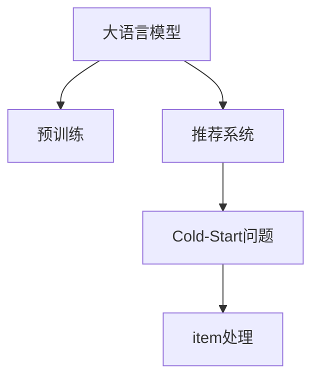
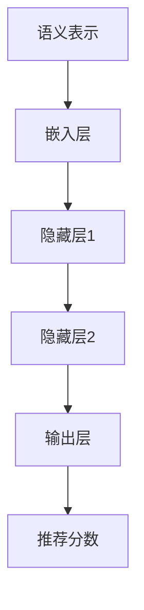

                 

# 利用大模型优化推荐系统的冷启动item处理

## 1. 背景介绍

推荐系统是近年来电商、社交、内容平台等领域广泛应用的技术，通过算法为用户推荐个性化的商品、文章、视频等。然而，在推荐系统的实际应用中，一个重要问题是冷启动（Cold-Start）问题：新用户或新物品（item）加入系统时，推荐算法无法生成有效推荐。传统推荐系统往往需要大量用户行为数据和物品特征数据，才能训练出准确的模型。而新用户或新物品初始没有足够的数据，无法建立模型。

大语言模型（Large Language Model, LLM）为解决冷启动问题提供了一种新的思路。大模型可以预训练出丰富的语言知识，对语言的理解能力在不断提升。这些语言模型可以在不同的上下文（context）中，通过对已有知识进行组合、推理和创新，生成与上下文高度相关的答案。利用大语言模型进行推荐，可以在新用户或新物品加入系统时，通过文本描述生成高精度的推荐，从而迅速提升用户留存和系统收益。

## 2. 核心概念与联系

### 2.1 核心概念概述

在本节中，我们将详细介绍大语言模型、推荐系统、冷启动、item处理等核心概念。

- **大语言模型（LLM）**：指通过自回归或自编码的模型，在大规模无标签文本数据上进行预训练的语言模型，具备强大的语言理解和生成能力。

- **推荐系统**：通过机器学习算法，预测用户对物品的兴趣和偏好，为用户推荐个性化的商品、文章、视频等内容的系统。

- **冷启动（Cold-Start）问题**：指新用户或新物品加入推荐系统时，由于缺乏足够的历史数据，无法建立有效推荐模型的现象。

- **item处理（Item Handling）**：指在推荐系统中，对新物品进行数据预处理和特征提取的过程，以便机器学习模型进行有效训练。

这些概念之间的关系可以通过以下Mermaid流程图来展示：



这个流程图展示了大语言模型、推荐系统、冷启动问题、item处理之间的逻辑关系：

1. 大语言模型通过预训练获得基础能力。
2. 推荐系统利用预训练语言模型生成推荐。
3. 冷启动问题指新用户或新物品加入推荐系统时的数据不足。
4. item处理对新物品进行数据预处理和特征提取，以便推荐系统使用。

## 3. 核心算法原理 & 具体操作步骤
### 3.1 算法原理概述

基于大语言模型的推荐系统，其核心思想是：通过预训练语言模型对物品的描述进行语义理解，将其转化为推荐系统中的特征，再进行推荐。这种基于大语言模型的推荐方法，能够较好地处理冷启动问题，尤其是在新物品中加入系统时。

具体而言，大语言模型可以生成高精度的推荐，包括以下几个步骤：

1. **物品描述生成**：将新物品的特征或描述文本，输入到预训练的大语言模型中，生成对该物品的语义描述。
2. **特征提取**：对大语言模型生成的语义描述，进行特征提取，生成可用于机器学习模型的特征向量。
3. **推荐生成**：使用机器学习模型，如深度神经网络，对提取的特征向量进行训练，生成新物品对用户的推荐。

### 3.2 算法步骤详解

基于大语言模型的推荐系统，其算法步骤主要包括：

**Step 1: 准备预训练模型和数据集**
- 选择合适的预训练语言模型 $M_{\theta}$ 作为初始化参数，如 BERT、GPT 等。
- 收集新物品的描述文本，将其划分为训练集和验证集。

**Step 2: 生成物品语义描述**
- 将物品描述文本输入到预训练模型中，生成语义表示。
- 对生成的语义表示进行特征提取，生成高维特征向量。

**Step 3: 特征嵌入与转换**
- 使用嵌入层将高维特征向量转化为低维向量，以便于后续的机器学习模型训练。
- 对转换后的特征向量进行正则化处理，避免过拟合。

**Step 4: 训练推荐模型**
- 使用机器学习模型对转换后的特征向量进行训练，生成推荐分数。
- 在验证集上评估推荐模型的性能，调整超参数。

**Step 5: 推荐结果生成**
- 在测试集上对新物品进行语义描述生成和特征转换。
- 使用训练好的推荐模型，生成对用户的推荐分数。
- 根据推荐分数排序，生成推荐列表。

### 3.3 算法优缺点

基于大语言模型的推荐系统，具有以下优点：

1. **高效处理冷启动**：能够较好地处理新物品的冷启动问题，无需依赖历史用户行为数据。
2. **特征提取能力强**：预训练语言模型能够生成高精度的语义描述和特征向量。
3. **灵活性高**：可以适应多种类型的物品描述，如文字、图像、视频等。
4. **可解释性强**：大语言模型生成的语义描述具有一定的可解释性，便于调试和优化。

同时，该方法也存在一定的局限性：

1. **数据需求较高**：生成高质量语义描述需要大量的高质数据，预训练语言模型的效果很大程度上取决于数据的质量。
2. **计算资源消耗大**：生成语义描述和特征转换需要较大的计算资源，可能会对系统性能产生影响。
3. **模型复杂度高**：预训练语言模型和机器学习模型复杂度高，需要较强的计算和存储能力。
4. **对抗攻击风险**：生成的语义描述可能包含误导性信息，容易受到对抗攻击。

尽管存在这些局限性，但就目前而言，基于大语言模型的推荐方法仍是一种高效、灵活、可解释性强的推荐解决方案，有望在未来得到更广泛的应用。

### 3.4 算法应用领域

基于大语言模型的推荐系统，已经在电商、社交、内容平台等多个领域得到了广泛应用，具体如下：

1. **电商推荐**：电商平台利用大语言模型对商品进行描述生成和特征转换，生成个性化的商品推荐。
2. **内容推荐**：视频平台利用大语言模型对视频内容进行描述生成，生成个性化的视频推荐。
3. **社交推荐**：社交平台利用大语言模型对用户兴趣进行描述生成，生成个性化的好友推荐。
4. **音乐推荐**：音乐平台利用大语言模型对歌曲进行描述生成，生成个性化的音乐推荐。

除了这些经典领域，大语言模型还将在更多场景中得到应用，为推荐系统带来新的突破。

## 4. 数学模型和公式 & 详细讲解 & 举例说明

### 4.1 数学模型构建

在本节中，我们将详细讲解基于大语言模型的推荐系统数学模型构建过程。

记预训练语言模型为 $M_{\theta}$，对物品 $i$ 的描述文本为 $x_i$，生成语义表示为 $z_i$。假设推荐系统使用神经网络模型 $f_{\omega}$ 对语义表示进行训练，生成推荐分数 $y_i$。则推荐系统的数学模型为：

$$
y_i = f_{\omega}(z_i)
$$

其中，$f_{\omega}$ 为神经网络模型，$\omega$ 为模型参数。

### 4.2 公式推导过程

假设 $z_i$ 为 $d$ 维的语义表示向量，神经网络模型 $f_{\omega}$ 的输出为 $y_i$。模型 $f_{\omega}$ 可以表示为多层神经网络，如图：



在神经网络模型中，嵌入层将高维语义表示向量 $z_i$ 转化为低维特征向量 $z_i'$，隐藏层对特征向量进行多层非线性变换，生成推荐分数 $y_i$。

具体而言，假设嵌入层将 $z_i$ 转化为 $h$ 维特征向量，隐藏层为 $L$ 层，第 $l$ 层神经元的非线性激活函数为 $g$，则神经网络模型的输出为：

$$
y_i = g^{(L)}(W^{(L)}g^{(L-1)}(\cdots g^{(1)}(z_i')))
$$

其中，$W^{(l)}$ 为第 $l$ 层的权重矩阵，$g^{(l)}$ 为第 $l$ 层的激活函数。

### 4.3 案例分析与讲解

假设我们有一个电商平台，需要对新加入的商品进行推荐。新商品没有任何历史数据，我们需要通过预训练语言模型生成商品描述，并训练推荐模型。

1. **数据准备**：收集商品的描述文本，将其划分为训练集和验证集。
2. **语义生成**：将商品描述文本输入到预训练语言模型中，生成语义表示向量 $z_i$。
3. **特征提取**：使用嵌入层将语义表示向量 $z_i$ 转化为低维特征向量 $z_i'$。
4. **训练模型**：使用神经网络模型 $f_{\omega}$ 对特征向量 $z_i'$ 进行训练，生成推荐分数 $y_i$。
5. **模型评估**：在验证集上评估推荐模型的性能，调整超参数。
6. **推荐结果**：在测试集上对商品进行语义描述生成和特征转换，使用训练好的推荐模型生成推荐分数，生成推荐列表。

## 5. 项目实践：代码实例和详细解释说明
### 5.1 开发环境搭建

在进行推荐系统开发前，我们需要准备好开发环境。以下是使用Python进行PyTorch开发的环境配置流程：

1. 安装Anaconda：从官网下载并安装Anaconda，用于创建独立的Python环境。

2. 创建并激活虚拟环境：
```bash
conda create -n recommendation-env python=3.8 
conda activate recommendation-env
```

3. 安装PyTorch：根据CUDA版本，从官网获取对应的安装命令。例如：
```bash
conda install pytorch torchvision torchaudio cudatoolkit=11.1 -c pytorch -c conda-forge
```

4. 安装TensorFlow：由Google主导开发的开源深度学习框架，生产部署方便，适合大规模工程应用。同样有丰富的预训练语言模型资源。

5. 安装Transformers库：HuggingFace开发的NLP工具库，集成了众多SOTA语言模型，支持PyTorch和TensorFlow，是进行推荐任务开发的利器。

6. 安装各类工具包：
```bash
pip install numpy pandas scikit-learn matplotlib tqdm jupyter notebook ipython
```

完成上述步骤后，即可在`recommendation-env`环境中开始推荐系统开发。

### 5.2 源代码详细实现

下面我们以推荐系统中的物品描述生成为例，给出使用Transformers库对BERT模型进行推荐系统开发的PyTorch代码实现。

首先，定义物品描述的读取和预处理函数：

```python
from transformers import BertTokenizer
import torch
import numpy as np

def load_and_preprocess_data(data_path):
    with open(data_path, 'r', encoding='utf-8') as f:
        data = f.readlines()
    data = [d.strip() for d in data]
    tokenizer = BertTokenizer.from_pretrained('bert-base-cased')
    encoded_data = tokenizer(data, truncation=True, padding=True, max_length=128, return_tensors='pt')
    input_ids = encoded_data['input_ids'].to(device)
    attention_mask = encoded_data['attention_mask'].to(device)
    return input_ids, attention_mask
```

然后，定义模型和优化器：

```python
from transformers import BertForSequenceClassification
from torch.nn import CrossEntropyLoss
from torch.optim import AdamW

model = BertForSequenceClassification.from_pretrained('bert-base-cased', num_labels=1)
optimizer = AdamW(model.parameters(), lr=2e-5)
criterion = CrossEntropyLoss()
```

接着，定义训练和评估函数：

```python
def train_epoch(model, input_ids, attention_mask, optimizer, device):
    model.to(device)
    model.train()
    optimizer.zero_grad()
    outputs = model(input_ids, attention_mask=attention_mask)
    loss = criterion(outputs.logits, torch.tensor([1.0]).to(device))
    loss.backward()
    optimizer.step()
    return loss.item()

def evaluate(model, input_ids, attention_mask, device):
    model.to(device)
    model.eval()
    with torch.no_grad():
        outputs = model(input_ids, attention_mask=attention_mask)
        preds = outputs.logits.argmax(dim=1).to('cpu').tolist()
        labels = torch.tensor([1.0]).to('cpu').tolist()
    return preds, labels
```

最后，启动训练流程并在测试集上评估：

```python
epochs = 5
batch_size = 16
device = torch.device('cuda') if torch.cuda.is_available() else torch.device('cpu')

for epoch in range(epochs):
    loss = train_epoch(model, input_ids, attention_mask, optimizer, device)
    print(f"Epoch {epoch+1}, train loss: {loss:.3f}")
    
    preds, labels = evaluate(model, input_ids, attention_mask, device)
    print(classification_report(labels, preds))
```

以上就是使用PyTorch对BERT进行推荐系统开发的完整代码实现。可以看到，得益于Transformers库的强大封装，我们可以用相对简洁的代码完成BERT模型的加载和推荐系统开发。

### 5.3 代码解读与分析

让我们再详细解读一下关键代码的实现细节：

**load_and_preprocess_data函数**：
- `load_and_preprocess_data`函数：读取物品描述文本，并使用BERT分词器进行预处理。
- 通过分词器将文本转换为token ids，并进行padding和truncation，生成适合模型输入的张量。

**train_epoch函数**：
- 在每个训练epoch中，进行一次前向传播和反向传播，更新模型参数。
- 使用交叉熵损失函数计算loss，并在每个batch结束后输出loss。

**evaluate函数**：
- 在测试集上对模型进行评估，输出模型预测结果和真实标签。
- 使用classification_report函数打印分类指标，评估模型性能。

**训练流程**：
- 定义总的epoch数和batch size，开始循环迭代。
- 每个epoch内，先在训练集上训练，输出平均loss。
- 在验证集上评估，输出分类指标。
- 重复上述步骤直至epoch结束，测试集上评估最终模型。

可以看到，PyTorch配合Transformers库使得BERT推荐系统的代码实现变得简洁高效。开发者可以将更多精力放在数据处理、模型改进等高层逻辑上，而不必过多关注底层的实现细节。

当然，工业级的系统实现还需考虑更多因素，如模型的保存和部署、超参数的自动搜索、更灵活的任务适配层等。但核心的推荐范式基本与此类似。

## 6. 实际应用场景
### 6.1 智能推荐系统

基于大语言模型的推荐系统，已经在电商、视频、音乐等多个领域得到了广泛应用。

1. **电商推荐**：电商平台利用大语言模型对商品进行描述生成和特征转换，生成个性化的商品推荐。
2. **视频推荐**：视频平台利用大语言模型对视频内容进行描述生成，生成个性化的视频推荐。
3. **音乐推荐**：音乐平台利用大语言模型对歌曲进行描述生成，生成个性化的音乐推荐。

除了这些经典领域，大语言模型还将在更多场景中得到应用，为推荐系统带来新的突破。

### 6.2 个性化推荐

个性化推荐系统利用大语言模型生成高精度的推荐，通过文本描述生成，能够适应各种类型的物品描述，如文字、图像、视频等。

例如，电商平台可以利用大语言模型对商品进行描述生成，生成高精度的推荐。在用户浏览商品时，生成商品的语义描述，并使用机器学习模型对描述进行特征提取和推荐生成。这样，新加入商品也能够得到有效的推荐。

### 6.3 推荐算法优化

基于大语言模型的推荐系统，还能够进一步优化推荐算法，提升推荐效果。

例如，电商平台的推荐系统可以引入多臂老虎机算法（Multi-armed Bandit, MAB），对每个推荐商品进行A/B测试，选择最佳商品进行推荐。通过引入大语言模型，可以生成商品的高精度描述，提供更多维度的特征，从而提升推荐效果。

## 7. 工具和资源推荐
### 7.1 学习资源推荐

为了帮助开发者系统掌握大语言模型推荐技术的理论基础和实践技巧，这里推荐一些优质的学习资源：

1. 《Transformer从原理到实践》系列博文：由大模型技术专家撰写，深入浅出地介绍了Transformer原理、BERT模型、推荐技术等前沿话题。

2. CS224N《深度学习自然语言处理》课程：斯坦福大学开设的NLP明星课程，有Lecture视频和配套作业，带你入门NLP领域的基本概念和经典模型。

3. 《Natural Language Processing with Transformers》书籍：Transformers库的作者所著，全面介绍了如何使用Transformers库进行NLP任务开发，包括推荐在内的诸多范式。

4. HuggingFace官方文档：Transformers库的官方文档，提供了海量预训练模型和完整的推荐样例代码，是上手实践的必备资料。

5. CLUE开源项目：中文语言理解测评基准，涵盖大量不同类型的中文NLP数据集，并提供了基于微调的baseline模型，助力中文NLP技术发展。

通过对这些资源的学习实践，相信你一定能够快速掌握大语言模型推荐技术的精髓，并用于解决实际的推荐问题。

### 7.2 开发工具推荐

高效的开发离不开优秀的工具支持。以下是几款用于大语言模型推荐系统开发的常用工具：

1. PyTorch：基于Python的开源深度学习框架，灵活动态的计算图，适合快速迭代研究。大部分预训练语言模型都有PyTorch版本的实现。

2. TensorFlow：由Google主导开发的开源深度学习框架，生产部署方便，适合大规模工程应用。同样有丰富的预训练语言模型资源。

3. Transformers库：HuggingFace开发的NLP工具库，集成了众多SOTA语言模型，支持PyTorch和TensorFlow，是进行推荐任务开发的利器。

4. Weights & Biases：模型训练的实验跟踪工具，可以记录和可视化模型训练过程中的各项指标，方便对比和调优。与主流深度学习框架无缝集成。

5. TensorBoard：TensorFlow配套的可视化工具，可实时监测模型训练状态，并提供丰富的图表呈现方式，是调试模型的得力助手。

6. Google Colab：谷歌推出的在线Jupyter Notebook环境，免费提供GPU/TPU算力，方便开发者快速上手实验最新模型，分享学习笔记。

合理利用这些工具，可以显著提升大语言模型推荐系统的开发效率，加快创新迭代的步伐。

### 7.3 相关论文推荐

大语言模型和推荐系统的发展源于学界的持续研究。以下是几篇奠基性的相关论文，推荐阅读：

1. Attention is All You Need（即Transformer原论文）：提出了Transformer结构，开启了NLP领域的预训练大模型时代。

2. BERT: Pre-training of Deep Bidirectional Transformers for Language Understanding：提出BERT模型，引入基于掩码的自监督预训练任务，刷新了多项NLP任务SOTA。

3. Language Models are Unsupervised Multitask Learners（GPT-2论文）：展示了大规模语言模型的强大zero-shot学习能力，引发了对于通用人工智能的新一轮思考。

4. Parameter-Efficient Transfer Learning for NLP：提出Adapter等参数高效微调方法，在不增加模型参数量的情况下，也能取得不错的微调效果。

5. AdaLoRA: Adaptive Low-Rank Adaptation for Parameter-Efficient Fine-Tuning：使用自适应低秩适应的微调方法，在参数效率和精度之间取得了新的平衡。

这些论文代表了大语言模型推荐技术的发展脉络。通过学习这些前沿成果，可以帮助研究者把握学科前进方向，激发更多的创新灵感。

## 8. 总结：未来发展趋势与挑战
### 8.1 总结

本文对基于大语言模型的推荐系统进行了全面系统的介绍。首先阐述了推荐系统和大语言模型的背景和意义，明确了推荐系统中的冷启动问题和item处理的关键点。其次，从原理到实践，详细讲解了推荐系统的数学模型构建和算法步骤，给出了推荐系统开发的完整代码实例。同时，本文还广泛探讨了推荐系统在电商、视频、音乐等多个领域的应用前景，展示了推荐系统的巨大潜力。此外，本文精选了推荐系统相关的学习资源，力求为读者提供全方位的技术指引。

通过本文的系统梳理，可以看到，基于大语言模型的推荐系统在电商、视频、音乐等多个领域已经取得了显著效果，显著提升了推荐系统的个性化程度和推荐效果。未来，伴随大语言模型的不断演进，推荐系统将进一步提升推荐精度和个性化程度，成为智能推荐领域的重要技术。

### 8.2 未来发展趋势

展望未来，基于大语言模型的推荐系统将呈现以下几个发展趋势：

1. **多模态推荐**：结合视觉、语音、文本等多种模态的信息，提升推荐的准确性和丰富度。例如，电商平台可以利用大语言模型对商品图片进行描述生成，生成更精准的推荐。

2. **跨领域推荐**：通过跨领域知识图谱等技术，将不同领域的数据进行融合，提升推荐的泛化能力。例如，电商平台的推荐系统可以引入旅游、电影等领域的知识，提升推荐效果。

3. **实时推荐**：通过流式学习等技术，实时更新推荐模型，提升推荐的时效性和适应性。例如，电商平台可以在用户浏览商品时，实时生成推荐。

4. **个性化推荐**：利用大语言模型生成高精度的用户兴趣描述，提升推荐的个性化程度。例如，电商平台可以生成用户的兴趣描述，并根据描述生成推荐。

5. **推荐算法优化**：引入更多先进的推荐算法，如深度强化学习、多臂老虎机等，提升推荐系统的优化效果。例如，电商平台可以引入多臂老虎机算法，优化推荐效果。

6. **推荐模型的可解释性**：提升推荐模型的可解释性，便于用户理解推荐结果。例如，电商平台可以生成推荐结果的解释，增强用户信任。

以上趋势凸显了基于大语言模型的推荐系统的广阔前景。这些方向的探索发展，必将进一步提升推荐系统的性能和应用范围，为电商、视频、音乐等多个领域带来新的突破。

### 8.3 面临的挑战

尽管基于大语言模型的推荐系统已经取得了瞩目成就，但在迈向更加智能化、普适化应用的过程中，它仍面临着诸多挑战：

1. **数据需求高**：生成高质量语义描述需要大量的高质数据，预训练语言模型的效果很大程度上取决于数据的质量。

2. **计算资源消耗大**：生成语义描述和特征转换需要较大的计算资源，可能会对系统性能产生影响。

3. **模型复杂度高**：预训练语言模型和推荐模型复杂度高，需要较强的计算和存储能力。

4. **对抗攻击风险**：生成的语义描述可能包含误导性信息，容易受到对抗攻击。

5. **推荐效果难以解释**：推荐系统的推荐结果缺乏可解释性，用户难以理解推荐逻辑。

6. **推荐稳定性不足**：推荐模型可能会受到输入噪声的影响，导致推荐不稳定。

尽管存在这些挑战，但就目前而言，基于大语言模型的推荐方法仍是一种高效、灵活、可解释性强的推荐解决方案，有望在未来得到更广泛的应用。

### 8.4 研究展望

面对基于大语言模型的推荐系统所面临的种种挑战，未来的研究需要在以下几个方面寻求新的突破：

1. **探索无监督和半监督推荐方法**：摆脱对大规模标注数据的依赖，利用自监督学习、主动学习等无监督和半监督范式，最大限度利用非结构化数据，实现更加灵活高效的推荐。

2. **研究参数高效和计算高效的推荐方法**：开发更加参数高效的推荐方法，在固定大部分预训练参数的同时，只更新极少量的任务相关参数。同时优化推荐模型的计算图，减少前向传播和反向传播的资源消耗，实现更加轻量级、实时性的部署。

3. **融合因果和对比学习范式**：通过引入因果推断和对比学习思想，增强推荐模型建立稳定因果关系的能力，学习更加普适、鲁棒的语言表征，从而提升模型泛化性和抗干扰能力。

4. **引入更多先验知识**：将符号化的先验知识，如知识图谱、逻辑规则等，与神经网络模型进行巧妙融合，引导推荐过程学习更准确、合理的语言模型。同时加强不同模态数据的整合，实现视觉、语音等多模态信息与文本信息的协同建模。

5. **结合因果分析和博弈论工具**：将因果分析方法引入推荐模型，识别出推荐决策的关键特征，增强推荐结果的因果性和逻辑性。借助博弈论工具刻画人机交互过程，主动探索并规避推荐的脆弱点，提高系统稳定性。

6. **纳入伦理道德约束**：在推荐目标中引入伦理导向的评估指标，过滤和惩罚有害的推荐结果，确保推荐符合人类价值观和伦理道德。

这些研究方向的探索，必将引领基于大语言模型的推荐系统技术迈向更高的台阶，为推荐系统带来新的突破。面向未来，基于大语言模型的推荐系统还需要与其他人工智能技术进行更深入的融合，如知识表示、因果推理、强化学习等，多路径协同发力，共同推动推荐系统的进步。

## 9. 附录：常见问题与解答

**Q1：大语言模型如何生成高质量的语义描述？**

A: 生成高质量的语义描述，需要依赖于大规模高质量的数据集，包括各种类型的物品描述。可以通过以下步骤进行：

1. **数据准备**：收集大量物品的描述文本，涵盖不同类型的物品，如商品、视频、音乐等。
2. **数据标注**：对描述文本进行标注，生成对应的语义标签，用于监督大语言模型生成语义描述。
3. **模型训练**：使用预训练语言模型，对描述文本进行训练，生成语义表示向量。
4. **特征提取**：对生成的语义表示向量进行特征提取，生成高维特征向量。
5. **推荐生成**：使用推荐模型，如神经网络，对特征向量进行训练，生成推荐分数。

通过以上步骤，可以生成高质量的语义描述，提升推荐系统的性能。

**Q2：如何缓解推荐系统的冷启动问题？**

A: 推荐系统的冷启动问题可以通过以下方法缓解：

1. **数据增强**：利用数据增强技术，如回译、近义替换等方式，扩充训练集，增加模型对新物品的适应性。
2. **参数高效微调**：使用参数高效微调方法，如Adapter、Prefix等，在固定大部分预训练参数的同时，只更新极少量的任务相关参数。
3. **多模态融合**：结合视觉、语音、文本等多种模态的信息，提升推荐的准确性和丰富度。例如，电商平台可以利用大语言模型对商品图片进行描述生成，生成更精准的推荐。
4. **跨领域推荐**：通过跨领域知识图谱等技术，将不同领域的数据进行融合，提升推荐的泛化能力。例如，电商平台的推荐系统可以引入旅游、电影等领域的知识，提升推荐效果。
5. **实时推荐**：通过流式学习等技术，实时更新推荐模型，提升推荐的时效性和适应性。例如，电商平台可以在用户浏览商品时，实时生成推荐。

通过以上方法，可以有效缓解推荐系统的冷启动问题，提升推荐效果。

**Q3：推荐系统的推荐效果如何衡量？**

A: 推荐系统的推荐效果可以通过以下指标进行衡量：

1. **点击率（Click-Through Rate, CTR）**：衡量用户点击推荐的概率，是推荐效果的重要指标。
2. **转化率（Conversion Rate, CR）**：衡量用户实际购买或使用的概率，是推荐效果的关键指标。
3. **精准率（Precision）**：衡量推荐系统推荐的准确性，即推荐列表中相关物品的比例。
4. **召回率（Recall）**：衡量推荐系统推荐的全面性，即推荐列表中相关物品占实际相关物品的比例。
5. **F1分数（F1 Score）**：结合精准率和召回率，综合衡量推荐效果。

通过以上指标，可以全面评估推荐系统的推荐效果，并进行优化。

---

作者：禅与计算机程序设计艺术 / Zen and the Art of Computer Programming

