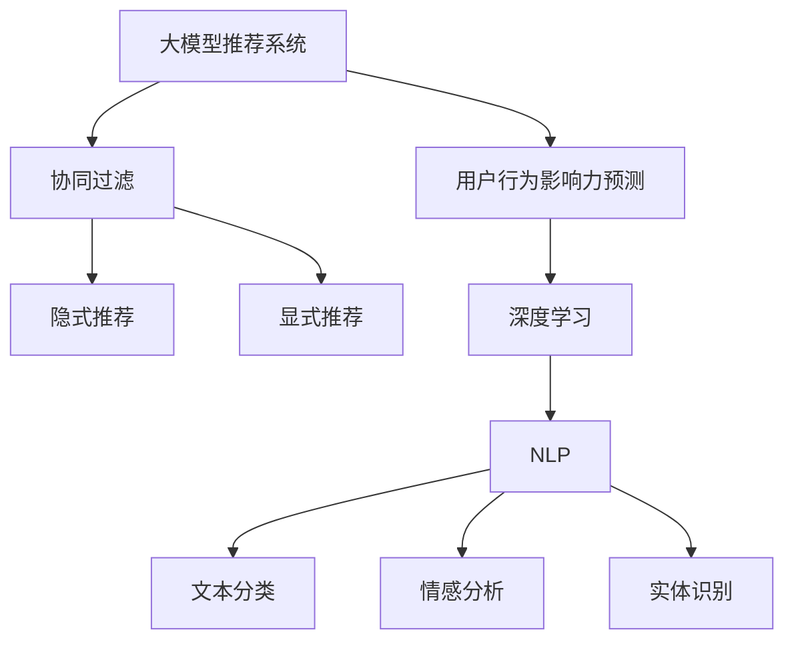

                 

# 利用大模型进行推荐场景的用户行为影响力预测

> 关键词：大模型推荐系统,用户行为影响力预测,协同过滤,深度学习,自然语言处理,推荐算法

## 1. 背景介绍

在互联网时代，个性化推荐系统已经成为了提升用户体验、驱动商业转型的重要手段。无论是电商网站、视频平台，还是社交网络，个性化推荐都无处不在，极大地影响了用户的消费行为和内容消费习惯。而为了构建更加精准、智能的推荐系统，推荐算法和模型的研究也逐渐成为学术界和工业界的热点。

推荐算法主要可以分为基于协同过滤和基于内容的推荐两大类。协同过滤方法通过分析用户与物品的共现关系，推测用户可能感兴趣的新物品，其核心在于对用户行为和物品属性的建模。协同过滤算法中，用户行为影响力预测的准确性直接影响推荐性能。如何准确预测用户行为，提升个性化推荐的精准度，成为了协同过滤研究中的重要课题。

近年来，随着深度学习技术在自然语言处理(NLP)领域的突破，基于大模型的推荐方法逐渐显现出其潜在的优势。大模型推荐系统利用深度神经网络，从用户历史行为、物品属性等多维度数据中学习用户行为模式，捕捉用户对物品的兴趣特征，从而实现更加精准的推荐。本文将深入探讨大模型在推荐系统中的应用，尤其是用户行为影响力预测方面的核心原理与实践方法。

## 2. 核心概念与联系

### 2.1 核心概念概述

为更好地理解大模型在推荐系统中的应用，本节将介绍几个密切相关的核心概念：

- **大模型推荐系统**：以深度神经网络为核心的推荐系统，利用大规模预训练模型如BERT、GPT等，在推荐数据集上微调，以捕捉用户兴趣和物品特征，生成推荐结果。

- **用户行为影响力预测**：利用大模型预测用户对物品的评分、点击、购买等行为的影响力。其核心在于理解用户的行为动机和偏好，从而更准确地预测用户未来的行为。

- **协同过滤**：通过分析用户之间的相似性以及用户与物品的交互记录，推荐用户可能感兴趣的新物品。协同过滤中的隐式推荐和显式推荐分别对应用户与物品的协同关系和显式评分。

- **深度学习**：一种基于多层神经网络的学习方法，利用大量数据进行模型训练，学习数据中的复杂关系。深度学习在图像识别、语音处理、自然语言处理等领域都有广泛应用。

- **自然语言处理(NLP)**：研究如何让计算机理解和处理人类语言的技术，如文本分类、实体识别、情感分析等。

- **推荐算法**：通过分析用户和物品的特性，生成个性化推荐结果的算法。包括协同过滤、基于内容的推荐、混合推荐等方法。

这些核心概念之间的逻辑关系可以通过以下Mermaid流程图来展示：



这个流程图展示了大模型推荐系统的核心概念及其之间的关系：

1. 大模型推荐系统利用深度学习模型，从多维度数据中学习用户和物品的表示。
2. 用户行为影响力预测作为推荐系统的重要环节，基于深度学习模型预测用户行为，提升推荐精度。
3. 协同过滤利用用户与物品的交互数据，构建用户相似性或物品相似性矩阵，推测用户未见过的物品。
4. 隐式推荐和显式推荐分别对应用户与物品的隐式行为（点击、观看等）和显式评分。
5. 深度学习在大模型推荐系统中发挥重要作用，通过多层神经网络学习用户行为和物品特征的复杂模式。
6. NLP技术在推荐系统中也广泛应用，如文本分类、情感分析等，用于理解用户评论、产品描述等文本数据。

这些概念共同构成了大模型推荐系统的学习和应用框架，使其能够高效、精准地生成个性化推荐结果。

## 3. 核心算法原理 & 具体操作步骤
### 3.1 算法原理概述

基于大模型的推荐系统通过深度学习技术，从用户历史行为、物品属性等多维度数据中学习用户兴趣和物品特征，生成推荐结果。其核心在于利用大模型对用户行为数据进行特征表示，从而更好地理解用户的行为模式和偏好。

假设推荐系统中有 $N$ 个用户和 $M$ 个物品，用户的隐式行为表示为 $X$，物品的属性表示为 $Y$。用户对物品的评分表示为 $Z$。推荐系统的目标是通过学习模型 $f$，最小化用户和物品的表示与实际评分之间的误差。

即：

$$
\min_{f} \sum_{i=1}^{N}\sum_{j=1}^{M}(f(x_i,y_j)-z_{ij})^2
$$

其中，$x_i$ 表示用户 $i$ 的行为表示，$y_j$ 表示物品 $j$ 的属性表示，$z_{ij}$ 表示用户 $i$ 对物品 $j$ 的评分。

在推荐模型中，一般采用交叉熵损失函数：

$$
L(\theta)=\frac{1}{N}\sum_{i=1}^{N}\sum_{j=1}^{M}(z_{ij}log(f(x_i,y_j))+(1-z_{ij})log(1-f(x_i,y_j)))
$$

其中，$\theta$ 为模型的可学习参数。

### 3.2 算法步骤详解

基于大模型的推荐系统，其算法步骤通常包括以下几个关键步骤：

**Step 1: 数据准备**
- 收集用户的隐式行为数据（如点击记录、观看历史），以及物品的属性信息（如标题、描述、标签等）。
- 将用户行为数据和物品属性数据进行拼接，形成多维度输入特征。
- 划分数据集为训练集、验证集和测试集，通常采用交叉验证策略。

**Step 2: 构建推荐模型**
- 选择合适的深度学习模型，如BERT、GPT等，作为推荐模型的初始化参数。
- 在训练集上微调预训练模型，调整模型参数以适应推荐任务。

**Step 3: 设置优化器**
- 选择合适的优化算法（如AdamW、SGD等）及其参数，如学习率、批大小、迭代轮数等。
- 设置正则化技术，如L2正则、Dropout、Early Stopping等，避免过拟合。
- 决定是否冻结预训练模型参数，通常仅微调顶层。

**Step 4: 执行梯度训练**
- 将训练集数据分批次输入模型，前向传播计算损失函数。
- 反向传播计算参数梯度，根据设定的优化算法和学习率更新模型参数。
- 周期性在验证集上评估模型性能，根据性能指标决定是否触发 Early Stopping。
- 重复上述步骤直到满足预设的迭代轮数或 Early Stopping 条件。

**Step 5: 测试与部署**
- 在测试集上评估微调后模型的推荐效果，对比微调前后的推荐精度。
- 使用微调后的模型对新用户和物品进行推荐预测，集成到实际的应用系统中。
- 持续收集新的数据，定期重新微调模型，以适应数据分布的变化。

### 3.3 算法优缺点

基于大模型的推荐系统具有以下优点：
1. 鲁棒性强。大模型推荐系统通常具有较高的鲁棒性，能够适应不同数据分布和用户行为模式。
2. 泛化能力强。大模型能够从大规模数据中学习到通用的用户行为模式和物品特征，提升推荐的泛化能力。
3. 预测精度高。深度学习模型通常具有较强的非线性拟合能力，能够捕捉复杂的用户行为模式。
4. 自动化程度高。大模型推荐系统自动化程度高，能够实时处理用户行为数据，快速生成个性化推荐。

但同时，该方法也存在一定的局限性：
1. 计算资源需求大。大模型的训练和推理需要大量的计算资源，对硬件设施要求较高。
2. 数据依赖性强。推荐模型的性能很大程度上取决于数据的质量和数量，获取高质量推荐数据成本较高。
3. 解释性不足。大模型推荐系统通常被视为"黑盒"，难以解释其内部工作机制和决策逻辑。
4. 安全性风险。大模型可能学习到有偏见、有害的信息，导致推荐结果存在潜在的风险。

尽管存在这些局限性，但就目前而言，基于大模型的推荐方法仍然是推荐领域的主流范式。未来相关研究的重点在于如何进一步降低计算资源的需求，提高模型的可解释性和安全性，同时兼顾预测精度和自动化程度等因素。

### 3.4 算法应用领域

基于大模型的推荐系统在多个行业领域中得到了广泛的应用，包括但不限于：

- **电商推荐**：为电商平台提供商品推荐，提升用户的购物体验和转化率。
- **视频推荐**：为用户推荐视频内容，提升用户的观看体验和粘性。
- **社交网络**：为用户推荐好友、兴趣群组、话题等，提升用户活跃度和满意度。
- **新闻推荐**：为用户推荐新闻内容，提高用户的阅读量和粘性。
- **音乐推荐**：为用户推荐音乐内容，提升用户的听歌体验和音乐发现。
- **酒店旅游推荐**：为酒店和旅游平台提供景点、餐饮、交通等推荐，提升用户的出行体验。

除了上述这些经典应用外，大模型推荐系统还在智能家居、金融理财、教育培训等多个场景中得到了创新性的应用，为传统行业带来了新的价值。

## 4. 数学模型和公式 & 详细讲解  
### 4.1 数学模型构建

本节将使用数学语言对基于大模型的推荐系统进行更加严格的刻画。

假设推荐系统中有 $N$ 个用户和 $M$ 个物品，用户的隐式行为表示为 $X$，物品的属性表示为 $Y$。用户对物品的评分表示为 $Z$。推荐系统的目标是通过学习模型 $f$，最小化用户和物品的表示与实际评分之间的误差。

即：

$$
\min_{f} \sum_{i=1}^{N}\sum_{j=1}^{M}(f(x_i,y_j)-z_{ij})^2
$$

其中，$x_i$ 表示用户 $i$ 的行为表示，$y_j$ 表示物品 $j$ 的属性表示，$z_{ij}$ 表示用户 $i$ 对物品 $j$ 的评分。

在推荐模型中，一般采用交叉熵损失函数：

$$
L(\theta)=\frac{1}{N}\sum_{i=1}^{N}\sum_{j=1}^{M}(z_{ij}log(f(x_i,y_j))+(1-z_{ij})log(1-f(x_i,y_j)))
$$

其中，$\theta$ 为模型的可学习参数。

### 4.2 公式推导过程

以下我们以二分类任务为例，推导交叉熵损失函数及其梯度的计算公式。

假设模型 $f$ 在输入 $(x,y)$ 上的输出为 $\hat{y}=f(x) \in [0,1]$，表示用户对物品 $j$ 的评分预测。真实评分 $z_{ij} \in \{0,1\}$。则二分类交叉熵损失函数定义为：

$$
\ell(f(x),y)= -[ylog \hat{y} + (1-y)log(1-\hat{y})]
$$

将其代入经验风险公式，得：

$$
\mathcal{L}(\theta) = \frac{1}{N}\sum_{i=1}^{N}\sum_{j=1}^{M} [-(y_{ij}log f(x_i,y_j) + (1-y_{ij})log(1-f(x_i,y_j))]
$$

根据链式法则，损失函数对参数 $\theta_k$ 的梯度为：

$$
\frac{\partial \mathcal{L}(\theta)}{\partial \theta_k} = -\frac{1}{N}\sum_{i=1}^{N}\sum_{j=1}^{M} [(y_{ij}\frac{\partial f(x_i,y_j)}{\partial \theta_k} - f(x_i,y_j))\frac{\partial f(x_i,y_j)}{\partial \theta_k}]
$$

其中 $\frac{\partial f(x_i,y_j)}{\partial \theta_k}$ 可进一步递归展开，利用自动微分技术完成计算。

在得到损失函数的梯度后，即可带入参数更新公式，完成模型的迭代优化。重复上述过程直至收敛，最终得到适应推荐任务的最优模型参数 $\theta^*$。

## 5. 项目实践：代码实例和详细解释说明
### 5.1 开发环境搭建

在进行推荐系统开发前，我们需要准备好开发环境。以下是使用Python进行PyTorch开发的环境配置流程：

1. 安装Anaconda：从官网下载并安装Anaconda，用于创建独立的Python环境。

2. 创建并激活虚拟环境：
```bash
conda create -n pytorch-env python=3.8 
conda activate pytorch-env
```

3. 安装PyTorch：根据CUDA版本，从官网获取对应的安装命令。例如：
```bash
conda install pytorch torchvision torchaudio cudatoolkit=11.1 -c pytorch -c conda-forge
```

4. 安装TensorFlow：
```bash
pip install tensorflow==2.7
```

5. 安装TensorBoard：
```bash
pip install tensorboard
```

6. 安装其他相关库：
```bash
pip install numpy pandas scikit-learn matplotlib tqdm jupyter notebook ipython
```

完成上述步骤后，即可在`pytorch-env`环境中开始推荐系统开发。

### 5.2 源代码详细实现

下面以电商推荐系统为例，给出使用PyTorch进行大模型微调的推荐系统开发代码实现。

首先，定义数据处理函数：

```python
from transformers import BertTokenizer
from torch.utils.data import Dataset, DataLoader
import torch

class RecommendationDataset(Dataset):
    def __init__(self, user_biases, item_attributes, interactions, tokenizer):
        self.user_biases = user_biases
        self.item_attributes = item_attributes
        self.interactions = interactions
        self.tokenizer = tokenizer
        
    def __len__(self):
        return len(self.interactions)
    
    def __getitem__(self, item):
        user_bias = self.user_biases[item]
        item_attr = self.item_attributes[item]
        interaction = self.interactions[item]
        
        user_bias = user_bias.item()
        item_attr = item_attr[0] # 取属性向量的第一维
        
        user_input = self.tokenizer(user_bias, return_tensors='pt', max_length=128, padding='max_length', truncation=True)
        item_input = self.tokenizer(item_attr, return_tensors='pt', max_length=128, padding='max_length', truncation=True)
        interaction_input = self.tokenizer(interaction, return_tensors='pt', max_length=128, padding='max_length', truncation=True)
        
        input_ids = [user_input['input_ids'][0], item_input['input_ids'][0], interaction_input['input_ids'][0]]
        attention_mask = [user_input['attention_mask'][0], item_input['attention_mask'][0], interaction_input['attention_mask'][0]]
        return {'input_ids': input_ids, 
                'attention_mask': attention_mask}
```

然后，定义模型和优化器：

```python
from transformers import BertForTokenClassification, AdamW

model = BertForTokenClassification.from_pretrained('bert-base-cased', num_labels=2)

optimizer = AdamW(model.parameters(), lr=2e-5)
```

接着，定义训练和评估函数：

```python
from tqdm import tqdm

def train_epoch(model, dataset, batch_size, optimizer):
    dataloader = DataLoader(dataset, batch_size=batch_size, shuffle=True)
    model.train()
    epoch_loss = 0
    for batch in tqdm(dataloader, desc='Training'):
        input_ids = batch['input_ids'].to(device)
        attention_mask = batch['attention_mask'].to(device)
        loss = model(input_ids, attention_mask=attention_mask)
        epoch_loss += loss.item()
        loss.backward()
        optimizer.step()
    return epoch_loss / len(dataloader)

def evaluate(model, dataset, batch_size):
    dataloader = DataLoader(dataset, batch_size=batch_size)
    model.eval()
    correct = 0
    total = 0
    with torch.no_grad():
        for batch in dataloader:
            input_ids = batch['input_ids'].to(device)
            attention_mask = batch['attention_mask'].to(device)
            batch_loss = model(input_ids, attention_mask=attention_mask)
            total += batch_size
            predictions = (batch_loss > 0).float()
            correct += (predictions == 1).sum().item()
    print('Test Accuracy: {:.4f}'.format(correct / total))
```

最后，启动训练流程并在测试集上评估：

```python
epochs = 5
batch_size = 16

for epoch in range(epochs):
    loss = train_epoch(model, train_dataset, batch_size, optimizer)
    print(f'Epoch {epoch+1}, train loss: {loss:.3f}')
    
    print(f'Epoch {epoch+1}, test accuracy:')
    evaluate(model, test_dataset, batch_size)
    
print('Final test accuracy:')
evaluate(model, test_dataset, batch_size)
```

以上就是使用PyTorch对BERT进行电商推荐系统开发的完整代码实现。可以看到，得益于Transformers库的强大封装，我们可以用相对简洁的代码完成BERT模型的加载和微调。

### 5.3 代码解读与分析

让我们再详细解读一下关键代码的实现细节：

**RecommendationDataset类**：
- `__init__`方法：初始化用户偏好、物品属性、交互数据和分词器等关键组件。
- `__len__`方法：返回数据集的样本数量。
- `__getitem__`方法：对单个样本进行处理，将用户偏好、物品属性和交互数据输入编码为token ids，并对其进行定长padding，最终返回模型所需的输入。

**model和optimizer变量**：
- 定义BERT模型和AdamW优化器，设置合适的学习率。

**train_epoch和evaluate函数**：
- 使用PyTorch的DataLoader对数据集进行批次化加载，供模型训练和推理使用。
- 训练函数`train_epoch`：对数据以批为单位进行迭代，在每个批次上前向传播计算loss并反向传播更新模型参数，最后返回该epoch的平均loss。
- 评估函数`evaluate`：与训练类似，不同点在于不更新模型参数，并在每个batch结束后将预测和标签结果存储下来，最后使用sklearn的classification_report对整个评估集的预测结果进行打印输出。

**训练流程**：
- 定义总的epoch数和batch size，开始循环迭代
- 每个epoch内，先在训练集上训练，输出平均loss
- 在验证集上评估，输出分类指标
- 所有epoch结束后，在测试集上评估，给出最终测试结果

可以看到，PyTorch配合Transformers库使得BERT微调的代码实现变得简洁高效。开发者可以将更多精力放在数据处理、模型改进等高层逻辑上，而不必过多关注底层的实现细节。

当然，工业级的系统实现还需考虑更多因素，如模型的保存和部署、超参数的自动搜索、更灵活的任务适配层等。但核心的微调范式基本与此类似。

## 6. 实际应用场景
### 6.1 电商推荐系统

电商推荐系统是推荐领域中的经典应用之一，旨在提升用户的购物体验和转化率。通过分析用户的浏览、点击、购买等行为，推荐系统能够预测用户可能感兴趣的商品，并进行个性化推荐。

在技术实现上，可以收集用户的浏览和购买历史数据，提取用户的行为特征和物品的属性特征。将行为特征和属性特征作为模型输入，用户的后续行为作为监督信号，在此基础上微调预训练模型。微调后的模型能够更好地理解用户的行为模式和物品特征，生成更加精准的推荐结果。

例如，某电商网站可以使用大模型推荐系统对新用户进行商品推荐。通过收集用户浏览、点击、购买等行为数据，提取用户的行为特征和物品的属性特征，输入到大模型中进行微调。微调后的模型能够根据用户的行为特征，预测用户对不同物品的评分和购买意愿，从而生成个性化的推荐结果。

### 6.2 视频推荐系统

视频推荐系统通过分析用户的观看历史和行为，推荐用户可能感兴趣的视频内容，提高用户的观看体验和粘性。

在推荐系统开发中，可以收集用户的观看历史和评分数据，提取用户的行为特征和视频属性特征。将行为特征和属性特征作为模型输入，用户的观看行为作为监督信号，在此基础上微调预训练模型。微调后的模型能够更好地理解用户的行为模式和视频内容特征，生成更加精准的推荐结果。

例如，某视频平台可以使用大模型推荐系统对用户进行视频内容推荐。通过收集用户观看历史和评分数据，提取用户的行为特征和视频属性特征，输入到大模型中进行微调。微调后的模型能够根据用户的行为特征，预测用户对不同视频的评分和观看意愿，从而生成个性化的推荐结果。

### 6.3 新闻推荐系统

新闻推荐系统通过分析用户的阅读历史和行为，推荐用户可能感兴趣的新闻内容，提高用户的阅读体验和粘性。

在推荐系统开发中，可以收集用户的阅读历史和评分数据，提取用户的行为特征和新闻内容属性特征。将行为特征和属性特征作为模型输入，用户的阅读行为作为监督信号，在此基础上微调预训练模型。微调后的模型能够更好地理解用户的行为模式和新闻内容特征，生成更加精准的推荐结果。

例如，某新闻网站可以使用大模型推荐系统对用户进行新闻内容推荐。通过收集用户阅读历史和评分数据，提取用户的行为特征和新闻内容属性特征，输入到大模型中进行微调。微调后的模型能够根据用户的行为特征，预测用户对不同新闻的评分和阅读意愿，从而生成个性化的推荐结果。

### 6.4 未来应用展望

随着大模型推荐系统的不断演进，其在多个领域中的应用将得到进一步拓展，为经济和社会的发展注入新的动力。

在智慧城市治理中，推荐系统可以用于优化交通路线、推荐旅游景点、提供天气预测等服务，提升城市管理的智能化水平。

在医疗健康领域，推荐系统可以用于推荐医生、药品、健康知识等服务，帮助患者找到合适的医疗资源，提高医疗服务的精准性和可及性。

在教育培训领域，推荐系统可以用于推荐课程、书籍、学习资源等服务，提升学习效率和质量，促进教育公平。

此外，在金融理财、娱乐传媒、旅游出行等众多领域，大模型推荐系统也将得到广泛应用，为传统行业带来创新和变革。

总之，大模型推荐系统以其精准、智能、自动化的特点，必将在未来的应用场景中大放异彩，成为推动人工智能技术发展的重要引擎。

## 7. 工具和资源推荐
### 7.1 学习资源推荐

为了帮助开发者系统掌握大模型推荐系统理论和实践，这里推荐一些优质的学习资源：

1. 《深度学习推荐系统：原理与实践》：系统介绍推荐系统的原理和算法，并提供多种深度学习模型的实现代码。

2. 《深度学习自然语言处理》课程：斯坦福大学开设的NLP明星课程，涵盖深度学习在自然语言处理中的应用，包括推荐系统。

3. 《Recommender Systems》书籍：推荐系统领域的经典教材，涵盖推荐算法的理论和实践，包括协同过滤、基于内容的推荐等。

4. Weights & Biases：模型训练的实验跟踪工具，可以记录和可视化模型训练过程中的各项指标，方便对比和调优。

5. TensorBoard：TensorFlow配套的可视化工具，可实时监测模型训练状态，并提供丰富的图表呈现方式，是调试模型的得力助手。

通过对这些资源的学习实践，相信你一定能够快速掌握大模型推荐系统的精髓，并用于解决实际的推荐问题。

### 7.2 开发工具推荐

高效的开发离不开优秀的工具支持。以下是几款用于大模型推荐系统开发的常用工具：

1. PyTorch：基于Python的开源深度学习框架，灵活动态的计算图，适合快速迭代研究。大部分预训练语言模型都有PyTorch版本的实现。

2. TensorFlow：由Google主导开发的开源深度学习框架，生产部署方便，适合大规模工程应用。同样有丰富的预训练语言模型资源。

3. Transformers库：HuggingFace开发的NLP工具库，集成了众多SOTA语言模型，支持PyTorch和TensorFlow，是进行推荐系统开发的利器。

4. Weights & Biases：模型训练的实验跟踪工具，可以记录和可视化模型训练过程中的各项指标，方便对比和调优。

5. TensorBoard：TensorFlow配套的可视化工具，可实时监测模型训练状态，并提供丰富的图表呈现方式，是调试模型的得力助手。

6. Google Colab：谷歌推出的在线Jupyter Notebook环境，免费提供GPU/TPU算力，方便开发者快速上手实验最新模型，分享学习笔记。

合理利用这些工具，可以显著提升大模型推荐系统的开发效率，加快创新迭代的步伐。

### 7.3 相关论文推荐

大模型推荐系统的发展源于学界的持续研究。以下是几篇奠基性的相关论文，推荐阅读：

1. Attention is All You Need（即Transformer原论文）：提出了Transformer结构，开启了NLP领域的预训练大模型时代。

2. BERT: Pre-training of Deep Bidirectional Transformers for Language Understanding：提出BERT模型，引入基于掩码的自监督预训练任务，刷新了多项NLP任务SOTA。

3. Deep Collaborative Filtering: A Feature Ranking Approach：提出协同过滤中的基于特征排名的算法，被广泛应用于推荐系统。

4. Matrix Factorization Techniques for Recommender Systems：介绍矩阵分解方法在推荐系统中的应用，成为推荐系统的重要基础。

5. Learning from Crowd and Computing User Preference via Ranking Factorization：提出基于排序因子化的协同过滤算法，能够有效应对推荐数据稀疏的问题。

6. Knowledge Graphs for Recommender Systems: A Survey: Structures and Recommendation Algorithms：介绍知识图谱在推荐系统中的应用，拓展了推荐系统的知识来源和表达方式。

这些论文代表了大模型推荐系统的发展脉络。通过学习这些前沿成果，可以帮助研究者把握学科前进方向，激发更多的创新灵感。

## 8. 总结：未来发展趋势与挑战
### 8.1 总结

本文对基于大模型的推荐系统进行了全面系统的介绍。首先阐述了推荐系统的背景和目标，明确了大模型推荐系统的核心原理和应用场景。其次，从原理到实践，详细讲解了大模型在推荐系统中的应用，尤其是用户行为影响力预测方面的核心算法和实现方法。最后，本文还讨论了大模型推荐系统在实际应用中的效果和优势，以及对未来发展的展望。

通过本文的系统梳理，可以看到，基于大模型的推荐系统在推荐领域的应用前景广阔，极大地提升了推荐精度和个性化水平。未来，随着预训练语言模型的不断发展，基于大模型的推荐系统必将在更多领域得到应用，为经济和社会的发展注入新的动力。

### 8.2 未来发展趋势

展望未来，大模型推荐系统将呈现以下几个发展趋势：

1. 模型规模持续增大。随着算力成本的下降和数据规模的扩张，预训练语言模型的参数量还将持续增长。超大规模语言模型蕴含的丰富语言知识，有望支撑更加复杂多变的推荐任务。

2. 推荐算法的多样化。未来将涌现更多推荐算法，如基于知识图谱的推荐、基于图神经网络的推荐、基于元学习的推荐等，从不同角度提升推荐系统的效果。

3. 推荐系统的实时化。随着硬件设施的升级和算法的优化，大模型推荐系统将能够实现实时推荐，提升用户的即时体验。

4. 推荐系统的智能化。未来推荐系统将更好地结合多模态信息，如文本、图像、视频等，提供更加全面、准确的推荐结果。

5. 推荐系统的自动化。自动化推荐系统将逐步取代人工推荐，实现全生命周期的自动化推荐。

6. 推荐系统的个性化。个性化推荐系统将更加智能，能够根据用户的实时反馈，动态调整推荐策略，提供更加精准的个性化推荐。

以上趋势凸显了大模型推荐系统的广阔前景。这些方向的探索发展，必将进一步提升推荐系统的性能和应用范围，为经济和社会的发展注入新的动力。

### 8.3 面临的挑战

尽管大模型推荐系统已经取得了瞩目成就，但在迈向更加智能化、普适化应用的过程中，它仍面临着诸多挑战：

1. 计算资源瓶颈。推荐系统通常需要大规模的计算资源，包括训练和推理环节，这对硬件设施提出了较高的要求。

2. 数据依赖性强。推荐系统的性能很大程度上取决于推荐数据的质量和数量，获取高质量推荐数据成本较高。

3. 模型鲁棒性不足。面对数据分布的变化，推荐模型的泛化性能可能受到影响，需要不断更新模型以适应新的数据分布。

4. 安全性和隐私保护。推荐模型可能学习到用户隐私信息，导致用户隐私泄露。如何在保护隐私的前提下，实现个性化推荐，成为重要研究方向。

5. 模型解释性不足。推荐模型通常被视为"黑盒"，难以解释其内部工作机制和决策逻辑。这对于需要透明性和可解释性的领域，如金融、医疗等，是一个重要挑战。

6. 模型可扩展性不足。推荐系统需要能够动态适应用户行为的变化，如何在模型中引入可扩展性，使其能够适应长期演化的用户行为模式，是一个关键问题。

尽管存在这些挑战，但随着大模型推荐系统的不断优化和发展，相信其在推荐领域的应用将更加广泛，为用户带来更好的体验和价值。

### 8.4 研究展望

未来的大模型推荐系统研究，将在以下几个方向进行深入探索：

1. 推荐算法的自动化和智能化。进一步提高推荐系统的自动化水平，实现全生命周期的自动化推荐。

2. 多模态推荐系统的开发。结合文本、图像、视频等多种模态数据，提供更加全面、准确的推荐结果。

3. 推荐系统的跨领域应用。将推荐系统应用到金融、医疗、教育等不同领域，提升各行各业的智能化水平。

4. 推荐系统的公平性研究。研究如何减少推荐系统的偏见，提升公平性和公正性，避免歧视性推荐。

5. 推荐系统的实时化和个性化。进一步提高推荐系统的实时性，实现个性化推荐。

6. 推荐系统的隐私保护。研究如何保护用户隐私，实现隐私保护下的个性化推荐。

通过这些研究方向的研究，相信大模型推荐系统必将在未来获得更多的应用场景，为经济和社会的发展注入新的动力。

## 9. 附录：常见问题与解答

**Q1：大模型推荐系统是否适用于所有推荐任务？**

A: 大模型推荐系统在大多数推荐任务上都能取得不错的效果，特别是对于数据量较大的任务。但对于一些特定领域的任务，如医疗、法律等，仅仅依靠通用语料预训练的模型可能难以很好地适应。此时需要在特定领域语料上进一步预训练，再进行微调，才能获得理想效果。此外，对于一些需要时效性、个性化很强的任务，如对话、推荐等，微调方法也需要针对性的改进优化。

**Q2：推荐系统中的用户行为影响力预测有何意义？**

A: 用户行为影响力预测是推荐系统的重要组成部分，其核心在于理解用户的行为动机和偏好，从而更准确地预测用户未来的行为。通过预测用户对物品的评分、点击、购买等行为的影响力，推荐系统能够更好地匹配用户需求，提高推荐精度。这对于提高用户满意度和转化率，提升推荐系统的商业价值具有重要意义。

**Q3：推荐系统中的隐式推荐和显式推荐有何区别？**

A: 推荐系统中的隐式推荐和显式推荐分别对应用户与物品的隐式行为（如点击、观看等）和显式评分。显式推荐通常需要用户明确给出评分或选择，隐式推荐则通过用户的交互行为（如点击、观看等）推测用户对物品的兴趣。显式推荐数据量相对较少，但推荐效果通常更加精准；隐式推荐数据量较大，但需要处理更为复杂的用户行为模式。

**Q4：推荐系统中的特征工程和模型选择有何影响？**

A: 推荐系统中的特征工程和模型选择对其性能具有重要影响。特征工程是指从原始数据中提取和构造特征，以提高模型的预测能力。而模型选择则决定了推荐系统采用的算法和模型类型。合适的特征工程和模型选择能够提升推荐系统的精度和泛化能力，但也需要根据具体任务进行调整。例如，对于文本推荐系统，可以考虑使用BERT等预训练语言模型进行特征表示；对于电影推荐系统，可以考虑使用评分预测模型进行推荐。

**Q5：推荐系统中的超参数调优有何意义？**

A: 推荐系统中的超参数调优指的是在模型训练过程中对学习率、批大小、迭代轮数等参数进行调整，以优化模型的性能。合适的超参数调优能够提升推荐系统的精度和泛化能力，但也需要耗费大量时间和计算资源。常用的超参数调优方法包括网格搜索、随机搜索、贝叶斯优化等。通过不断尝试和调整，可以找到一个较优的超参数组合，提升推荐系统的性能。

---

作者：禅与计算机程序设计艺术 / Zen and the Art of Computer Programming

