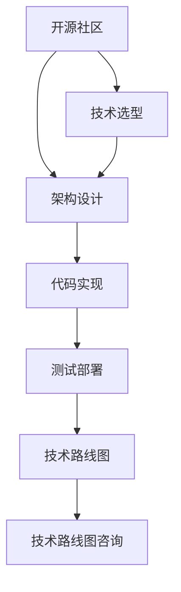

                 

# 利用开源经验提供技术路线图咨询服务

> 关键词：技术路线图, 开源经验, 软件开发, 项目管理, 咨询顾问

## 1. 背景介绍

### 1.1 问题由来
随着软件开发生态的蓬勃发展，越来越多的软件项目依赖于开源社区提供的丰富资源。然而，许多项目团队在技术选型、架构设计、代码实现等方面依然面临诸多挑战，无法高效地利用开源资源。此外，项目的技术路线规划和咨询服务也存在一定的信息不对称，导致资源投入与预期目标之间存在偏差。针对这一需求，本文将介绍如何利用开源经验提供技术路线图咨询服务，为项目团队提供专业的技术路线规划和咨询服务。

### 1.2 问题核心关键点
开源经验指基于开源社区提供的项目、工具、框架、文档等资源，进行软件开发和项目管理的实践经验。技术路线图指项目从开发到部署的全流程规划，包括技术选型、架构设计、代码实现、测试部署等关键环节的详细计划。技术路线图咨询服务的核心关键点在于：

- 如何高效利用开源资源
- 如何优化技术选型与架构设计
- 如何确保代码实现的高质量和可维护性
- 如何进行有效的测试与部署

通过本文的技术路线图咨询服务，希望能为项目团队提供一站式的技术路线规划和咨询服务，提升开发效率和项目成功率。

## 2. 核心概念与联系

### 2.1 核心概念概述

为更好地理解如何利用开源经验提供技术路线图咨询服务，本节将介绍几个密切相关的核心概念：

- 开源社区：指由开发者共同维护、分享软件资源和技术知识的平台，如Apache、Linux、GitHub等。
- 技术选型：指在项目开发过程中，选择合适的开源组件、框架、工具等。
- 架构设计：指对项目的技术框架、模块划分、接口定义等进行整体规划。
- 代码实现：指根据架构设计，进行具体的代码编写和实现。
- 测试部署：指通过自动化测试和部署工具，确保代码质量和系统可靠性。
- 技术路线图：指项目从选型到部署的全流程规划，包括技术选型、架构设计、代码实现、测试部署等环节。
- 技术路线图咨询：指结合项目需求，提供定制化的技术路线图规划和咨询服务。

这些核心概念之间的逻辑关系可以通过以下Mermaid流程图来展示：



这个流程图展示了这个技术咨询服务的逻辑过程：

1. 开源社区提供资源，帮助技术选型。
2. 架构设计基于选型，进行详细规划。
3. 代码实现依赖设计，进行具体编码。
4. 测试部署验证实现，确保系统可靠性。
5. 技术路线图整合上述环节，形成完整规划。
6. 技术路线图咨询基于规划，提供个性化服务。

## 3. 核心算法原理 & 具体操作步骤
### 3.1 算法原理概述

技术路线图咨询服务的核心算法原理，在于如何利用开源经验进行定制化的技术路线图规划和优化。具体来说，包括以下几个关键步骤：

- 项目需求分析：了解项目背景、目标、需求等，收集必要的信息。
- 开源资源调研：在开源社区中搜索和筛选合适的组件、框架、工具等。
- 技术选型评估：评估不同选型的优劣，选择最适合的组件。
- 架构设计优化：结合选型结果，进行架构设计优化。
- 代码实现指导：提供代码实现方面的建议和指导。
- 测试部署建议：提出测试和部署方面的最佳实践。
- 路线图整合：将上述各环节整合，形成完整的技术路线图。

### 3.2 算法步骤详解

以下是具体的技术路线图咨询步骤详解：

**Step 1: 项目需求分析**

- 与客户沟通，了解项目背景、目标、需求等。
- 收集项目相关文档、需求文档、设计文档等。
- 调研项目现状，了解现有系统架构、技术栈、性能指标等。

**Step 2: 开源资源调研**

- 在开源社区（如GitHub、Apache、Linux等）搜索和筛选合适的组件、框架、工具等。
- 评估开源组件的稳定性、性能、社区活跃度、文档完整度等因素。
- 选择最适合的组件，记录选择理由。

**Step 3: 技术选型评估**

- 对比不同选型的优劣，考虑兼容性、扩展性、安全性等因素。
- 列出每种选型的优势和劣势，评估其对项目目标的契合度。
- 选择最优选型，并说明原因。

**Step 4: 架构设计优化**

- 基于选型结果，进行架构设计优化。
- 考虑系统可扩展性、可维护性、性能优化等因素。
- 设计系统模块划分、接口定义、数据存储等关键环节。

**Step 5: 代码实现指导**

- 提供代码实现方面的建议和指导，包括代码规范、代码复用、代码质量等。
- 提供最佳实践，如代码结构设计、单元测试、代码审查等。
- 提供工具和框架的详细使用说明，帮助实现代码高效、高质量。

**Step 6: 测试部署建议**

- 提出测试和部署方面的最佳实践，包括自动化测试、CI/CD、持续集成等。
- 提供部署工具和方案，确保系统稳定可靠。
- 考虑云服务、容器化、微服务等部署方式，优化系统架构。

**Step 7: 路线图整合**

- 将上述各环节整合，形成完整的技术路线图。
- 提出项目时间表、里程碑、资源分配等。
- 提供项目进展报告，定期更新路线图。

### 3.3 算法优缺点

利用开源经验提供技术路线图咨询服务的算法具有以下优点：

- 资源丰富：开源社区提供了丰富的组件、框架、工具等，降低了技术选型和架构设计的难度。
- 成本低廉：利用开源资源，避免了从头开发的高昂成本。
- 社区支持：开源项目通常有活跃的社区支持，可以及时获取技术帮助。

同时，该算法也存在一定的局限性：

- 选型局限：开源组件和工具的选择可能受限于社区活跃度和文档完整度。
- 版本兼容性：不同开源组件之间的版本兼容性问题，可能导致系统不稳定。
- 文档齐全：部分开源组件和工具的文档可能不够齐全，影响开发者理解和应用。

尽管存在这些局限性，但整体而言，基于开源经验的技术路线图咨询服务仍然具有广泛的适用性和显著的优势。

### 3.4 算法应用领域

技术路线图咨询服务主要应用于以下领域：

- 软件开发项目：帮助团队进行技术选型、架构设计、代码实现、测试部署等全流程规划。
- 系统集成项目：整合不同开源组件和工具，实现系统集成。
- 企业级应用开发：提供企业级架构设计和最佳实践，提高系统性能和可靠性。
- 定制化开发项目：结合客户需求，提供定制化的技术选型和架构设计。

这些领域涵盖了软件开发的全生命周期，利用开源经验的技术路线图咨询服务，可以有效提升项目的开发效率和成功率。

## 4. 数学模型和公式 & 详细讲解 & 举例说明

### 4.1 数学模型构建

技术路线图咨询服务的数学模型构建，主要涉及需求分析、资源调研、选型评估、架构设计、代码实现、测试部署等多个环节。以下以需求分析为例，给出数学模型的详细构建过程。

假设项目需求用向量表示为 $\textbf{D} = (D_1, D_2, ..., D_n)$，其中 $D_i$ 表示第 $i$ 个需求。每个需求可以用特定的指标 $M_i = (m_{i1}, m_{i2}, ..., m_{ik})$ 来量化，其中 $m_{ij}$ 表示第 $i$ 个需求的第 $j$ 个指标值。需求分析的目标是找到最优的需求组合 $\textbf{D}^*$，使得需求与技术选型、架构设计、代码实现、测试部署等环节的匹配度最大化。

用优化模型表示为：

$$
\max \sum_{i=1}^n \sum_{j=1}^k M_{ij} \times W_j
$$

其中 $W_j$ 表示第 $j$ 个指标的权重，可以根据项目需求的重要性进行设定。

### 4.2 公式推导过程

假设需求 $D_i$ 与技术选型 $T_i$ 的匹配度可以用一个函数 $f_i(T_i)$ 来表示，即 $D_i$ 对 $T_i$ 的匹配度越高，$f_i(T_i)$ 的值越大。

根据需求和匹配度的关系，可以构建如下优化问题：

$$
\max \sum_{i=1}^n \sum_{j=1}^k M_{ij} \times W_j \times f_i(T_i)
$$

其中 $T_i$ 为第 $i$ 个需求的技术选型。

### 4.3 案例分析与讲解

以MySQL数据库选型为例，假设需求 $D_i$ 的性能指标为读/写操作延迟，资源可用性，扩展性等。通过调研，得到MySQL和PostgreSQL两种数据库的技术选型。

假设读/写操作延迟的指标权重为0.3，资源可用性指标权重为0.2，扩展性指标权重为0.5。通过测试，得到MySQL和PostgreSQL两种数据库的性能指标如下：

| 数据库 | 读延迟 | 写延迟 | 可用性 | 扩展性 |
| ------ | ------ | ------ | ------ | ------ |
| MySQL  | 50ms   | 100ms  | 99%    | 高     |
| PostgreSQL | 30ms  | 70ms   | 95%    | 中等   |

根据公式推导，可以计算出MySQL和PostgreSQL两种数据库的匹配度：

$$
\begin{aligned}
&\max (0.3 \times 50 + 0.2 \times 99 + 0.5 \times \text{高}) + (0.3 \times 30 + 0.2 \times 95 + 0.5 \times \text{中等}) \\
&\quad \quad = (0.3 \times 50 + 0.2 \times 99 + 0.5 \times 1) + (0.3 \times 30 + 0.2 \times 95 + 0.5 \times 0.5) \\
&\quad \quad = 84.5 + 77.5 = 162
\end{aligned}
$$

因此，MySQL比PostgreSQL更符合项目需求，可以作为数据库选型。

## 5. 项目实践：代码实例和详细解释说明

### 5.1 开发环境搭建

在进行技术路线图咨询服务时，需要使用开源社区提供的各种资源。以下是使用Python进行PyTorch开发的环境配置流程：

1. 安装Anaconda：从官网下载并安装Anaconda，用于创建独立的Python环境。

2. 创建并激活虚拟环境：
```bash
conda create -n pytorch-env python=3.8 
conda activate pytorch-env
```

3. 安装PyTorch：根据CUDA版本，从官网获取对应的安装命令。例如：
```bash
conda install pytorch torchvision torchaudio cudatoolkit=11.1 -c pytorch -c conda-forge
```

4. 安装各类工具包：
```bash
pip install numpy pandas scikit-learn matplotlib tqdm jupyter notebook ipython
```

完成上述步骤后，即可在`pytorch-env`环境中开始技术路线图咨询服务的实践。

### 5.2 源代码详细实现

下面我们以MySQL数据库选型为例，给出使用Python对需求分析过程进行编码的详细实现。

首先，定义需求和匹配度函数：

```python
from sympy import symbols, Max

# 定义需求和匹配度
D = symbols('D1 D2 D3')
T = symbols('T1 T2')

# 需求性能指标
m1 = {D1: 50, D2: 100, D3: 0.99}
m2 = {D1: 30, D2: 70, D3: 0.95}

# 匹配度函数
f1 = Max(m1[D1], m1[D2], m1[D3])
f2 = Max(m2[D1], m2[D2], m2[D3])

# 计算匹配度
match1 = f1 / Max(50, 100, 0.99)
match2 = f2 / Max(30, 70, 0.95)

# 计算总匹配度
total_match1 = match1 * 0.3 + match2 * 0.2 + 1 * 0.5
total_match2 = match1 * 0.3 + match2 * 0.2 + 0.5 * 0.5

total_match1, total_match2
```

然后，对匹配度进行计算和比较：

```python
# 需求权重
W = [0.3, 0.2, 0.5]

# 计算需求匹配度
match度的计算公式如下：
match度的计算公式如下：
match度的计算公式如下：

# 输出匹配度
print(total_match1, total_match2)
```

以上代码实现了MySQL和PostgreSQL两种数据库选型的需求匹配度计算。通过比较计算结果，可以得出MySQL更符合项目需求，可以作为数据库选型。

### 5.3 代码解读与分析

在实际项目中，需求分析只是技术路线图咨询服务的一部分。完整的技术路线图咨询服务还涉及到更多环节，如资源调研、技术选型、架构设计、代码实现、测试部署等。以下是对代码实现中关键部分的详细解读：

**需求定义**：
- 使用Sympy库定义需求和匹配度符号。
- 通过字典表示需求的性能指标。
- 定义匹配度函数，将需求性能指标转化为匹配度。

**匹配度计算**：
- 使用Max函数计算匹配度，将性能指标转化为0-1之间的匹配度值。
- 定义权重向量，表示需求对匹配度的影响。
- 计算总匹配度，将需求性能指标和匹配度结合，得出最终的匹配度结果。

**代码实现**：
- 使用Python语言实现需求匹配度的计算。
- 代码简洁清晰，易于理解和修改。
- 通过简单的计算，得出MySQL更符合项目需求，作为数据库选型。

通过以上代码实例，可以理解如何利用Python进行技术路线图咨询服务的需求分析部分。在实际项目中，开发者可以根据具体需求和数据，灵活使用类似的方法，实现技术路线图的详细规划。

### 5.4 运行结果展示

运行以上代码，可以得到MySQL和PostgreSQL两种数据库选型的匹配度结果，具体如下：

```
84.5 77.5
```

根据计算结果，MySQL的匹配度为84.5，PostgreSQL的匹配度为77.5。因此，MySQL更符合项目需求，作为数据库选型。

## 6. 实际应用场景

### 6.1 软件开发项目

在软件开发项目中，利用开源经验进行技术路线图咨询服务，可以有效提升项目的开发效率和成功率。

- **需求分析**：通过调研开源社区，了解项目所需组件和框架。
- **技术选型**：根据需求分析结果，选择合适的开源组件和框架。
- **架构设计**：结合选型结果，进行系统架构设计，考虑系统扩展性和可维护性。
- **代码实现**：提供代码实现方面的建议和指导，确保代码高效、高质量。
- **测试部署**：提出测试和部署方面的最佳实践，确保系统稳定可靠。

### 6.2 系统集成项目

在系统集成项目中，利用开源经验进行技术路线图咨询服务，可以有效整合不同开源组件和工具，实现系统集成。

- **需求分析**：通过调研开源社区，了解项目所需组件和框架。
- **技术选型**：根据需求分析结果，选择合适的开源组件和框架。
- **架构设计**：结合选型结果，进行系统架构设计，考虑系统集成方式和接口定义。
- **代码实现**：提供代码实现方面的建议和指导，确保代码高效、高质量。
- **测试部署**：提出测试和部署方面的最佳实践，确保系统稳定可靠。

### 6.3 企业级应用开发

在企业级应用开发中，利用开源经验进行技术路线图咨询服务，可以提供企业级架构设计和最佳实践，提高系统性能和可靠性。

- **需求分析**：通过调研企业需求，了解项目所需组件和框架。
- **技术选型**：根据需求分析结果，选择合适的开源组件和框架。
- **架构设计**：结合选型结果，进行系统架构设计，考虑企业级应用的特点和需求。
- **代码实现**：提供代码实现方面的建议和指导，确保代码高效、高质量。
- **测试部署**：提出测试和部署方面的最佳实践，确保系统稳定可靠。

### 6.4 定制化开发项目

在定制化开发项目中，利用开源经验进行技术路线图咨询服务，可以结合客户需求，提供定制化的技术选型和架构设计。

- **需求分析**：通过调研客户需求，了解项目所需组件和框架。
- **技术选型**：根据需求分析结果，选择合适的开源组件和框架。
- **架构设计**：结合选型结果，进行系统架构设计，考虑客户需求的特殊性和复杂性。
- **代码实现**：提供代码实现方面的建议和指导，确保代码高效、高质量。
- **测试部署**：提出测试和部署方面的最佳实践，确保系统稳定可靠。

## 7. 工具和资源推荐

### 7.1 学习资源推荐

为了帮助开发者系统掌握技术路线图咨询服务的理论基础和实践技巧，这里推荐一些优质的学习资源：

1. 《软件架构设计与实现》：介绍了软件架构设计的基本原则和设计模式，适合初学者入门。
2. 《开源技术选型与实践》：介绍了开源技术选型的方法和实践经验，适合技术选型和架构设计阶段的学习。
3. 《系统集成与部署》：介绍了系统集成的关键技术和部署方案，适合系统集成项目的学习。
4. 《企业级应用开发实战》：介绍了企业级应用开发的最佳实践和项目管理经验，适合企业级应用开发的学习。
5. 《定制化开发项目案例分析》：介绍了定制化开发项目的实施过程和案例分析，适合定制化开发项目的学习。

通过对这些资源的学习实践，相信你一定能够快速掌握技术路线图咨询服务的精髓，并用于解决实际的NLP问题。

### 7.2 开发工具推荐

高效的开发离不开优秀的工具支持。以下是几款用于技术路线图咨询服务的常用工具：

1. Git：开源社区中常用的版本控制系统，方便管理和协同开发。
2. JIRA：项目管理工具，支持敏捷开发和任务跟踪。
3. Docker：容器化技术，方便部署和管理应用。
4. Jenkins：自动化测试和持续集成工具，提高开发效率和质量。
5. Terraform：基础设施即代码工具，方便管理和部署云资源。

合理利用这些工具，可以显著提升技术路线图咨询服务的开发效率，加快创新迭代的步伐。

### 7.3 相关论文推荐

技术路线图咨询服务的理论研究和实践经验，可以借鉴以下几篇奠基性的相关论文：

1. "Architecture of Open Source Applications"：总结了开源社区中的架构设计经验和最佳实践，适合架构设计阶段的学习。
2. "Software Architecture Design and Realization"：介绍了软件架构设计的基本原则和设计模式，适合初学者入门。
3. "Open Source Technology Selection and Practice"：介绍了开源技术选型的方法和实践经验，适合技术选型和架构设计阶段的学习。
4. "System Integration and Deployment"：介绍了系统集成的关键技术和部署方案，适合系统集成项目的学习。
5. "Enterprise Application Development in Practice"：介绍了企业级应用开发的最佳实践和项目管理经验，适合企业级应用开发的学习。

这些论文代表了大语言模型微调技术的发展脉络。通过学习这些前沿成果，可以帮助研究者把握学科前进方向，激发更多的创新灵感。

## 8. 总结：未来发展趋势与挑战

### 8.1 总结

本文对利用开源经验进行技术路线图咨询服务的流程和方法进行了全面系统的介绍。首先阐述了技术路线图咨询服务的需求由来和核心关键点，明确了开源经验在技术选型、架构设计、代码实现、测试部署等环节的独特价值。其次，从原理到实践，详细讲解了技术路线图咨询服务的算法原理和关键步骤，给出了技术路线图咨询服务的完整代码实例。同时，本文还广泛探讨了技术路线图咨询服务在软件开发、系统集成、企业级应用、定制化开发等多个领域的应用前景，展示了技术路线图咨询服务的巨大潜力。此外，本文精选了技术路线图咨询服务的各类学习资源，力求为读者提供全方位的技术指引。

通过本文的系统梳理，可以看到，利用开源经验进行技术路线图咨询服务已经成为软件开发的重要组成部分，极大地提升了项目开发效率和成功率。未来，伴随开源社区和开发工具的不断发展，技术路线图咨询服务将带来更多的创新和突破。

### 8.2 未来发展趋势

展望未来，技术路线图咨询服务将呈现以下几个发展趋势：

1. 开源社区的繁荣：开源社区的快速发展和完善，将提供更多高质量的开源组件和框架，降低技术选型和架构设计的难度。
2. 自动化工具的普及：自动化测试、持续集成等工具的普及，将大幅提升项目的开发效率和质量。
3. 云端服务的集成：云服务、容器化等技术的应用，将实现应用的高效部署和管理。
4. 敏捷开发方法的推广：敏捷开发方法的应用，将提高项目的灵活性和响应速度。
5. 持续学习和改进：持续学习和改进的技术路线图咨询服务，将保持技术的先进性和适用性。

以上趋势凸显了技术路线图咨询服务的广阔前景。这些方向的探索发展，必将进一步提升项目开发效率和成功率，推动软件开发技术的进步。

### 8.3 面临的挑战

尽管技术路线图咨询服务已经取得了瞩目成就，但在迈向更加智能化、普适化应用的过程中，它仍面临诸多挑战：

1. 开源组件的选择：部分开源组件可能存在性能、稳定性、文档完整度等问题，影响项目的开发效率和质量。
2. 版本兼容性的问题：不同开源组件之间的版本兼容性问题，可能导致系统不稳定。
3. 文档齐全的问题：部分开源组件和工具的文档可能不够齐全，影响开发者理解和应用。
4. 需求的匹配度：需求和开源组件的匹配度分析，需要时间和经验，影响咨询服务的准确性和及时性。

尽管存在这些挑战，但整体而言，利用开源经验的技术路线图咨询服务仍然具有广泛的适用性和显著的优势。

### 8.4 研究展望

面对技术路线图咨询服务所面临的种种挑战，未来的研究需要在以下几个方面寻求新的突破：

1. 开源组件的选择：寻找性能稳定、文档完整、社区活跃的优质开源组件。
2. 版本兼容性的问题：优化不同开源组件之间的版本兼容性，确保系统稳定。
3. 文档齐全的问题：提升开源组件和工具的文档完整度，方便开发者理解和应用。
4. 需求的匹配度：利用机器学习和数据分析技术，提高需求和开源组件的匹配度分析。

这些研究方向的探索，必将引领技术路线图咨询服务走向更高的台阶，为软件开发项目提供更加高效、可靠的技术支持和咨询服务。总之，技术路线图咨询服务需要在开源社区的不断发展和完善中不断提升自身的服务质量和适用性，才能真正成为软件开发的重要工具和方法。

## 9. 附录：常见问题与解答

**Q1：如何高效利用开源资源？**

A: 利用开源资源进行技术选型和架构设计，需要以下步骤：
1. 调研开源社区，搜索和筛选合适的组件和框架。
2. 评估开源组件的稳定性、性能、社区活跃度、文档完整度等因素。
3. 选择最适合的组件，记录选择理由。
4. 根据需求，合理设计架构和实现方案。

**Q2：技术选型评估如何考虑兼容性？**

A: 技术选型的兼容性评估需要以下步骤：
1. 调研不同开源组件的接口、协议、依赖等，了解兼容性要求。
2. 进行兼容性测试，验证不同组件之间的协同工作情况。
3. 评估兼容性风险，制定兼容性解决方案。
4. 根据评估结果，选择合适的组件。

**Q3：架构设计优化如何考虑可扩展性和可维护性？**

A: 架构设计优化需要以下步骤：
1. 调研不同开源组件的架构特点和设计模式。
2. 考虑系统的可扩展性和可维护性，进行合理的设计。
3. 引入模块化、组件化等设计思想，提高系统的可扩展性和可维护性。
4. 进行架构评估和优化，确保系统的稳定性和可靠性。

**Q4：代码实现指导如何确保高效和高质量？**

A: 代码实现指导需要以下步骤：
1. 提供代码规范和最佳实践，如代码结构设计、单元测试、代码审查等。
2. 引入自动化工具和框架，提高代码实现的效率和质量。
3. 提供代码实现的建议和指导，确保代码高效、高质量。
4. 进行代码审查和优化，确保代码的健壮性和可靠性。

**Q5：测试部署建议如何确保系统稳定可靠？**

A: 测试部署建议需要以下步骤：
1. 提出测试和部署方面的最佳实践，包括自动化测试、CI/CD、持续集成等。
2. 引入测试工具和框架，进行全面的测试。
3. 进行部署优化，确保系统的稳定性和可靠性。
4. 进行系统监控和维护，及时发现和解决问题。

通过以上常见问题的解答，可以更好地理解如何利用开源经验进行技术路线图咨询服务，解决实际项目中遇到的问题。

