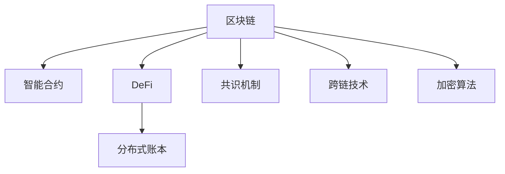

                 

# 利用技术优势进行区块链创新

> 关键词：区块链,智能合约,DeFi,分布式账本,加密算法,共识机制,跨链技术

## 1. 背景介绍

### 1.1 问题由来

区块链技术的兴起，彻底改变了传统金融和商业的运作模式。它以去中心化、不可篡改、透明公开的特性，为人们带来了全新的价值传递方式。然而，随着区块链技术的逐渐成熟，现有区块链系统的一些固有问题也逐渐暴露，例如：交易速度慢、费用高、扩展性差、安全性有待提升等。

为应对这些问题，区块链社区进行了不懈探索，提出了各种改进方案和技术创新。包括Layer 2扩展技术、跨链技术、隐私计算、零知识证明等。本文将重点探讨这些技术如何赋能区块链创新，并阐述其原理与优势。

### 1.2 问题核心关键点

当前区块链技术面临的关键问题主要包括：

- 交易速度：普通区块链的交易速度通常每秒只能处理几个交易，无法满足大规模应用的需求。
- 费用高昂：交易费用受区块链网络拥堵程度的影响较大，可能导致用户成本大幅上升。
- 扩展性差：现有区块链网络大多基于区块链共识机制，扩展性受限。
- 安全性问题：虽然区块链具有不可篡改的特性，但在智能合约中可能存在漏洞，导致资金安全问题。

为解决这些问题，区块链社区提出了多种技术方案，本文将详细分析这些技术的原理与优势，并探讨其在实际应用中的潜力。

## 2. 核心概念与联系

### 2.1 核心概念概述

为更好地理解区块链技术创新，本节将介绍几个关键概念：

- 区块链(Blockchain)：一种分布式账本技术，通过记录、验证和存储交易数据，实现去中心化、透明和不可篡改的记录。
- 智能合约(Smart Contract)：一种自动化的合约，通过代码实现合同条款，当满足特定条件时，智能合约会自动执行相应操作。
- DeFi（去中心化金融）：基于区块链技术构建的金融服务，包括借贷、交易、保险、稳定币等。
- 分布式账本(Distributed Ledger)：多个节点共同维护的账本，每个节点都有账本副本，确保数据一致性。
- 共识机制(Consensus Mechanism)：通过特定算法达成一致，确保区块链网络中所有节点的交易记录一致。
- 跨链技术(Cross-Chain)：实现不同区块链网络间的互联互通，解决链间数据传输和交互问题。
- 加密算法(Cryptography)：用于保护数据和身份安全的加密技术，如公钥加密、哈希函数等。

这些核心概念之间的逻辑关系可以通过以下Mermaid流程图来展示：



这个流程图展示了大语言模型的核心概念及其之间的关系：

1. 区块链以分布式账本为基础，通过共识机制实现交易记录的一致性。
2. 智能合约通过代码实现交易规则，提高交易的自动化和效率。
3. DeFi利用区块链技术构建新型金融服务。
4. 分布式账本保证数据的一致性和安全性。
5. 跨链技术实现不同区块链网络间的互通，扩展区块链应用场景。
6. 加密算法保障数据和交易的安全性。

这些核心概念共同构成了区块链技术的框架，使得区块链能够应用于各种场景，提供去中心化、透明、安全的价值传递和存储服务。

## 3. 核心算法原理 & 具体操作步骤
### 3.1 算法原理概述

区块链技术的核心算法主要涉及加密算法、共识机制和智能合约等方面。以下将逐一介绍这些关键算法的原理。

#### 3.1.1 加密算法

加密算法是区块链技术的重要组成部分，用于保护数据的安全性。主要分为公钥加密和哈希函数两类。

- 公钥加密：使用公钥加密信息，只有私钥持有者才能解密。在区块链中，公钥和地址绑定，私钥用于签名验证。
- 哈希函数：将任意长度的消息压缩为固定长度的哈希值，保证数据不可篡改。常见的哈希算法包括SHA-256、MD5等。

#### 3.1.2 共识机制

共识机制是区块链网络中达成一致的算法，确保所有节点对交易记录的共识。常见的共识机制包括：

- 工作量证明(Proof of Work, PoW)：通过计算复杂数学难题获得记账权。
- 权益证明(Proof of Stake, PoS)：根据持有代币数量和投票权获得记账权。
- 委托权益证明(Delegated Proof of Stake, DPoS)：由代币持有者选举若干个记账节点，由这些节点轮流记账。

#### 3.1.3 智能合约

智能合约是运行在区块链上的代码，自动执行合同条款。主要包括：

- 事件驱动：根据特定事件触发智能合约执行。
- 自动执行：满足条件时，智能合约自动执行操作。
- 可编程性：通过代码实现复杂逻辑。
- 不可篡改性：一旦部署，智能合约不可修改。

### 3.2 算法步骤详解

基于上述算法，区块链技术的核心步骤如下：

#### 3.2.1 构建分布式账本

分布式账本由多个节点共同维护，每个节点都有完整的账本副本。账本记录所有交易信息，并通过共识机制达成一致。

#### 3.2.2 设计智能合约

根据业务需求，设计智能合约的逻辑和规则。智能合约代码部署在区块链上，自动执行交易和操作。

#### 3.2.3 实现加密算法

选择合适的加密算法保护数据安全，如使用公钥加密、哈希函数等。

#### 3.2.4 选择共识机制

根据区块链网络的特点和需求，选择合适的共识机制，如PoW、PoS、DPoS等。

#### 3.2.5 部署跨链技术

实现不同区块链网络间的互操作性，支持链间数据传输和交互。

#### 3.2.6 应用DeFi服务

利用智能合约实现去中心化金融服务，如借贷、交易、保险等。

### 3.3 算法优缺点

区块链技术具有以下优点：

- 去中心化：无中央控制中心，安全性高。
- 透明公开：所有交易记录公开，可追溯。
- 不可篡改：区块链通过加密算法和共识机制保证数据不可篡改。

但同时也存在以下缺点：

- 扩展性差：现有区块链网络大多基于PoW或PoS共识机制，扩展性受限。
- 交易速度慢：普通区块链的交易速度较慢，无法满足大规模应用需求。
- 费用高昂：交易费用受网络拥堵程度的影响较大，可能导致用户成本上升。
- 安全性问题：尽管区块链具有不可篡改的特性，但在智能合约中可能存在漏洞，导致资金安全问题。

### 3.4 算法应用领域

区块链技术已经在多个领域得到应用，包括金融、供应链、医疗、版权保护等。以下是几个典型的应用场景：

- 金融服务：DeFi利用智能合约实现去中心化借贷、交易、保险等金融服务。
- 供应链管理：通过区块链记录供应链的每一个环节，实现透明和可追溯。
- 数字资产交易：如比特币、以太坊等，通过区块链实现去中心化资产交易。
- 版权保护：通过区块链记录作品的创作和传播信息，防止侵权。
- 政府治理：利用区块链进行投票、审计、信息公开等。

## 4. 数学模型和公式 & 详细讲解 & 举例说明

### 4.1 数学模型构建

本节将使用数学语言对区块链技术进行更加严格的刻画。

记区块链网络为$N$个节点组成的集合，每个节点有一个公钥$k_i$和一个私钥$s_i$。交易信息通过加密算法$E$进行加密，智能合约通过函数$f$执行操作。

### 4.2 公式推导过程

假设某节点$A$发起一笔交易，交易信息$M$通过公钥加密算法$E$加密得到密文$C$。其他节点$B$收到密文$C$后，通过私钥$s_i$验证签名$S$，验证通过后，将交易信息$M$和交易记录$T$存入账本。智能合约$f$根据$M$和$T$执行相应的操作。

数学表达式如下：

$$
C = E(k_i, M) \\
S = s_i \times C \\
\text{验证签名：} \\
B \text{ 验证通过后：} \\
M' = f(k_i, T) \\
$$

其中，$k_i$和$s_i$分别为节点$A$和$B$的公钥和私钥，$E$和$f$分别为加密算法和智能合约。

### 4.3 案例分析与讲解

以比特币的交易为例，分析其核心数学模型和算法流程。

比特币使用SHA-256哈希算法进行交易数据的加密，使用ECDSA公钥加密算法进行签名验证。每个比特币节点都维护一份完整的区块链账本，通过工作量证明(Proof of Work, PoW)共识机制达成一致。

交易过程如下：

1. 节点$A$发起一笔交易，将交易数据$M$进行SHA-256哈希计算，生成哈希值$H(M)$。
2. 节点$A$使用私钥$s_A$生成签名$S$。
3. 节点$B$收到交易数据$M$和签名$S$后，验证$S$的合法性。
4. 节点$B$将交易数据$M$和哈希值$H(M)$存入账本。
5. 其他节点$C$、$D$等通过工作量证明共识机制达成一致，更新账本。

## 5. 项目实践：代码实例和详细解释说明

### 5.1 开发环境搭建

在进行区块链项目开发前，我们需要准备好开发环境。以下是使用Python进行Hyperledger Fabric开发的环境配置流程：

1. 安装Anaconda：从官网下载并安装Anaconda，用于创建独立的Python环境。

2. 创建并激活虚拟环境：
```bash
conda create -n fabric-env python=3.8 
conda activate fabric-env
```

3. 安装Hyperledger Fabric：
```bash
conda install hyperledger-fabric -c conda-forge
```

4. 安装各类工具包：
```bash
pip install flask flask-restful jinja2 pycrypto pybouncer
```

5. 启动Hyperledger Fabric网络：
```bash
hfc sim-network --peer-count 3 --orderer-count 1 --channel-count 1 --channel-org1-id Org1 --channel-org2-id Org2
```

6. 创建区块链网络：
```bash
peer register --channel-id channel
peer add --orderer-orderer.example.com --org-name Org1 --peer-cert-file peer1/ca/cert.pem --cert-chain-file peer1/ca/certs/peer1-cert.pem --tls-cert-file peer1/tls/server1.pem --tls-key-file peer1/tls/server1-key.pem
peer add --orderer-orderer.example.com --org-name Org2 --peer-cert-file peer2/ca/cert.pem --cert-chain-file peer2/ca/certs/peer2-cert.pem --tls-cert-file peer2/tls/server2.pem --tls-key-file peer2/tls/server2-key.pem
```

完成上述步骤后，即可在`fabric-env`环境中开始区块链项目开发。

### 5.2 源代码详细实现

下面我们以智能合约为例，给出使用Hyperledger Fabric对智能合约进行开发的PyTorch代码实现。

首先，定义智能合约的函数：

```python
from hyperledger import fabric
from hyperledger.fabric.contract import Contract

class MyContract(Contract):
    def __init__(self):
        super(MyContract, self).__init__()
        self.a = 0
        self.b = 0
        self.c = 0
    
    @fabric.commiter(chaincode='mychaincode')
    def add(self, a, b):
        self.a = a
        self.b = b
        self.c = self.a + self.b
        return self.c
    
    @fabric.commiter(chaincode='mychaincode')
    def update(self, c):
        self.c = c
        return self.c
```

然后，创建一个新的智能合约实例：

```python
mycontract = MyContract(fabric.isms和社会保障信息)
mycontract.add(2, 3)
mycontract.update(5)
```

最后，启动智能合约并调用函数：

```python
peer install chaincode
peer add chaincode --path /path/to/mychaincode
peer add chaincode --path /path/to/mychaincode
```

即完成了Hyperledger Fabric智能合约的开发与部署。可以看到，利用Hyperledger Fabric，开发者可以轻松地实现智能合约的编写、部署和调用，方便高效地开发区块链应用。

### 5.3 代码解读与分析

让我们再详细解读一下关键代码的实现细节：

**MyContract类**：
- `__init__`方法：初始化智能合约的状态变量。
- `add`方法：接收两个参数a和b，将它们相加并更新状态变量c。
- `update`方法：接收一个参数c，更新状态变量c。

**智能合约实例的创建与调用**：
- 使用`MyContract`类创建一个智能合约实例，并通过`add`和`update`方法进行调用。

通过以上步骤，完成了智能合约的开发与部署。在实际应用中，智能合约可以用于记录资产所有权、执行合同条款等，提供高效、透明的自动化服务。

## 6. 实际应用场景
### 6.1 智能合约应用

智能合约是区块链技术的重要应用场景之一，可以广泛应用于各种金融和非金融服务。例如：

- 借贷合同：自动记录借款、还款信息，智能合约根据约定执行自动还款。
- 资产管理：自动记录资产所有权、租赁信息，智能合约根据约定执行买卖、租赁等操作。
- 供应链管理：记录供应链的每一个环节，智能合约自动验证节点操作，确保信息透明和可追溯。

### 6.2 跨链技术应用

跨链技术是区块链技术的另一重要方向，实现不同区块链网络间的互联互通。常见应用场景包括：

- 链间交易：实现不同区块链网络间的资产互操作。
- 链间共识：实现不同区块链网络间的共识机制协同工作。
- 链间智能合约：在不同区块链网络上部署智能合约，实现跨链互操作。

### 6.3 未来应用展望

随着区块链技术的不断成熟，未来的应用场景将更加多样化，涵盖更多行业。

- 政府治理：利用区块链进行投票、审计、信息公开等。
- 数字身份：利用区块链进行数字身份验证，提高身份认证的安全性和效率。
- 物联网：利用区块链记录物联网设备的运行状态和数据，实现设备之间的协同工作。

未来，区块链技术将在更多领域得到应用，为各行各业带来新的变革和机遇。

## 7. 工具和资源推荐
### 7.1 学习资源推荐

为帮助开发者系统掌握区块链技术的原理和实践，以下是一些推荐的资源：

1. 《区块链原理与应用》系列博文：由区块链技术专家撰写，深入浅出地介绍了区块链原理、共识机制、智能合约等核心概念。

2. 《比特币原理与技术》书籍：比特币社区权威书籍，系统介绍了比特币的工作原理、技术实现和应用场景。

3. 《以太坊智能合约实战》书籍：以太坊社区经典教材，详细讲解了以太坊智能合约的开发与实践。

4. Hyperledger官方文档：Hyperledger Fabric官方文档，提供了丰富的开发和部署示例，帮助开发者快速上手区块链开发。

5. IPFS官网：分布式文件系统IPFS的官方资源库，包含大量文档和代码示例，帮助开发者掌握分布式存储技术。

6. 《区块链技术创新与挑战》课程：区块链技术在线课程，由知名高校和区块链专家联合打造，涵盖区块链技术基础和创新方向。

通过对这些资源的学习实践，相信你一定能够系统掌握区块链技术，并将其应用于实际项目开发。

### 7.2 开发工具推荐

高效的开发离不开优秀的工具支持。以下是几款用于区块链开发常用的工具：

1. Hyperledger Fabric：由Linux基金会主导的开源区块链框架，支持智能合约的编写和部署。

2. Ethereum：由Vitalik Buterin等人创立的智能合约平台，支持以太坊智能合约的编写和部署。

3. IPFS：分布式文件系统，用于存储和传输大文件，支持去中心化存储。

4. Web3.js：以太坊官方提供的JavaScript库，方便开发者构建基于Web的区块链应用。

5. Truffle：以太坊智能合约的开发和测试工具，提供丰富的开发环境和自动化测试框架。

6. Remix：以太坊智能合约的开发环境，提供可视化的合约编辑器和测试工具。

合理利用这些工具，可以显著提升区块链应用的开发效率，加快创新迭代的步伐。

### 7.3 相关论文推荐

区块链技术的快速发展离不开学界的持续研究。以下是几篇奠基性的相关论文，推荐阅读：

1. Bitcoin: A Peer-to-Peer Electronic Cash System（比特币白皮书）：比特币创始人中本聪发表的比特币技术白皮书，奠定了区块链技术的基础。

2. Ethereum Whitepaper: A Next-Generation Smart Contract and Decentralized Application Platform（以太坊白皮书）：以太坊创始人Vitalik Buterin发表的以太坊技术白皮书，提出了智能合约的概念。

3. Smart Contracts: Solid-State Programming and Decentralized Applications（智能合约论文）：以太坊社区著名论文，详细讨论了智能合约的原理和应用。

4. Consensus Algorithms in Blockchain（区块链共识算法论文）：分析了区块链网络中常用的共识算法，如PoW、PoS等。

5. Practical Byzantine Fault Tolerance（实用的拜占庭容错）：以太坊社区著名论文，详细介绍了以太坊的拜占庭容错机制。

这些论文代表了大语言模型微调技术的发展脉络。通过学习这些前沿成果，可以帮助研究者把握学科前进方向，激发更多的创新灵感。

## 8. 总结：未来发展趋势与挑战
### 8.1 总结

本文对区块链技术进行了全面系统的介绍，重点阐述了其核心概念、核心算法和操作步骤，并详细讲解了智能合约、跨链技术等应用。同时，本文还广泛探讨了区块链技术的未来发展趋势和面临的挑战。

通过本文的系统梳理，可以看到，区块链技术正在不断成熟，应用范围不断扩大。未来，随着技术的发展和应用场景的丰富，区块链技术必将在更多领域发挥重要作用，深刻影响人们的生产生活方式。

### 8.2 未来发展趋势

展望未来，区块链技术将呈现以下几个发展趋势：

1. 链上智能合约：利用区块链执行复杂的智能合约，实现自动化和高效率。
2. 跨链互操作：实现不同区块链网络间的互联互通，提高区块链网络的扩展性和互操作性。
3. 去中心化金融（DeFi）：构建基于区块链的去中心化金融服务，实现无中介的金融操作。
4. 分布式身份：利用区块链进行数字身份验证，提高身份认证的安全性和效率。
5. 数据隐私：利用区块链保护数据隐私，实现数据安全存储和传输。

这些趋势凸显了区块链技术的广阔前景。随着技术的不断演进和应用场景的丰富，区块链技术将在更多领域发挥重要作用，为人类带来全新的价值传递和信息管理方式。

### 8.3 面临的挑战

尽管区块链技术已经取得了显著成果，但在迈向大规模应用的过程中，仍面临诸多挑战：

1. 扩展性瓶颈：现有区块链网络大多基于PoW或PoS共识机制，扩展性受限。
2. 交易速度慢：普通区块链的交易速度较慢，无法满足大规模应用需求。
3. 安全性问题：尽管区块链具有不可篡改的特性，但在智能合约中可能存在漏洞，导致资金安全问题。
4. 治理机制：如何设计有效的区块链治理机制，确保网络安全和稳定运行，是区块链技术面临的重要问题。

### 8.4 研究展望

针对区块链技术面临的挑战，未来的研究需要在以下几个方面寻求新的突破：

1. 提高扩展性：开发新的共识算法，提高区块链网络的扩展性和互操作性。
2. 加速交易速度：开发Layer 2扩展技术，提高区块链的交易速度和扩展性。
3. 增强安全性：开发新的智能合约技术，增强合约的安全性和鲁棒性。
4. 设计有效的治理机制：建立有效的区块链治理机制，确保网络安全和稳定运行。
5. 探索跨链互操作：开发新的跨链技术，实现不同区块链网络间的互联互通。

这些研究方向的探索，必将引领区块链技术走向更高的台阶，为人类带来更安全、高效、可控的价值传递和信息管理方式。只有勇于创新、敢于突破，才能不断拓展区块链技术的边界，推动人类社会向数字化、智能化迈进。

## 9. 附录：常见问题与解答

**Q1：什么是区块链？**

A: 区块链是一种分布式账本技术，通过记录、验证和存储交易数据，实现去中心化、透明和不可篡改的记录。

**Q2：区块链的核心算法有哪些？**

A: 区块链的核心算法包括加密算法、共识机制和智能合约等。其中，加密算法用于保护数据的安全性；共识机制用于达成交易记录的一致性；智能合约用于自动化交易操作。

**Q3：区块链的应用场景有哪些？**

A: 区块链技术已经在金融、供应链、医疗、版权保护等领域得到应用。例如，DeFi利用智能合约实现去中心化借贷、交易、保险等金融服务；供应链管理通过区块链实现透明和可追溯；数字资产交易如比特币、以太坊等，通过区块链实现去中心化资产交易。

**Q4：区块链面临的挑战有哪些？**

A: 区块链技术面临的挑战主要包括扩展性瓶颈、交易速度慢、安全性问题和治理机制设计等。

**Q5：区块链的未来发展趋势有哪些？**

A: 区块链技术的未来发展趋势包括提高扩展性、加速交易速度、增强安全性、设计有效的治理机制和探索跨链互操作等。

---

作者：禅与计算机程序设计艺术 / Zen and the Art of Computer Programming

