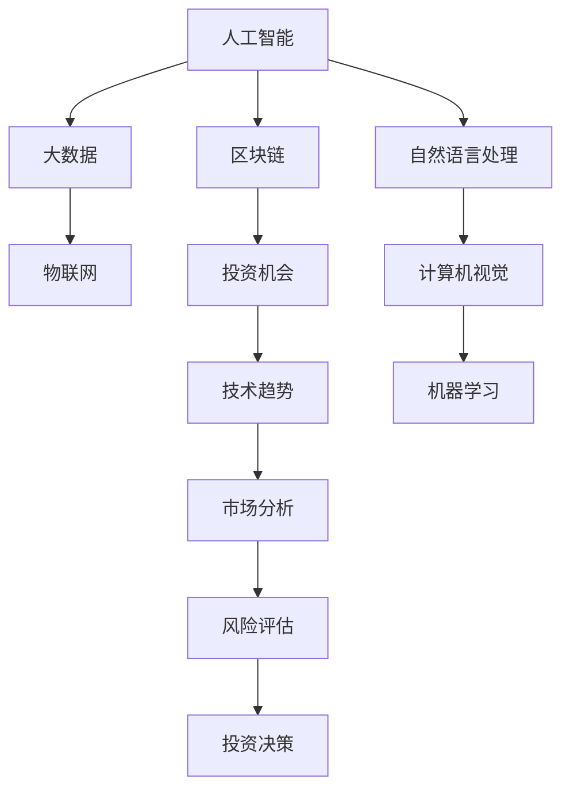

                 

# 利用技术趋势把握投资机会

## 1. 背景介绍

在21世纪的技术浪潮中，人工智能（AI）、大数据、物联网（IoT）、区块链等前沿技术的迅猛发展，正在重塑全球经济格局。技术的快速迭代不仅为传统行业带来了颠覆性变革，也为投资者带来了前所未有的机遇与挑战。如何准确把握技术趋势，及时识别并抓住投资机会，成为了投资界人士共同关心的话题。

## 2. 核心概念与联系

### 2.1 核心概念概述

为帮助投资者理解如何利用技术趋势进行投资，本文将介绍几个关键概念及其相互之间的联系：

- **人工智能（AI）**：通过模拟人类智能行为（如学习、推理、感知）的计算机系统。包括机器学习、深度学习、自然语言处理等子领域。
- **大数据（Big Data）**：指体量巨大、来源多样、处理复杂的数据集合。通过大数据分析，可以揭示数据背后的规律和趋势，辅助决策。
- **物联网（IoT）**：将各种设备、传感器连接到互联网，实现智能设备间的互联互通，提升生活、生产的智能化水平。
- **区块链（Blockchain）**：一种去中心化的分布式账本技术，保障数据透明、不可篡改、安全可信，应用于金融、供应链等领域。
- **投资机会**：指在特定时期内，根据市场、技术变化可能出现的有利可图的投资机会。
- **技术趋势**：指在一段时间内，某项技术或技术领域的发展趋势。投资机会往往与技术趋势密切相关。

这些核心概念之间的逻辑关系可以通过以下Mermaid流程图来展示：



这个流程图展示了人工智能、大数据、物联网和区块链等技术如何通过多个环节共同作用，影响并形成技术趋势，进而带来投资机会。

## 3. 核心算法原理 & 具体操作步骤

### 3.1 算法原理概述

在投资领域，把握技术趋势的核心在于通过算法模型预测技术的发展方向，从而识别潜在的投资机会。一个典型的技术趋势识别算法包括数据预处理、特征工程、模型训练与评估等步骤。

具体来说，可以利用历史数据和当前市场数据，构建包含人工智能、大数据、物联网、区块链等关键指标的复合指数。通过时间序列分析、机器学习等方法，训练模型预测技术发展趋势。一旦模型预测到某个技术领域出现上升趋势，投资者便可及时布局相关投资标的。

### 3.2 算法步骤详解

#### 3.2.1 数据预处理

- **数据收集**：从不同数据源（如公司财报、市场报告、技术论文、新闻报道等）收集相关数据。
- **数据清洗**：去除缺失值、异常值，确保数据质量和一致性。
- **数据归一化**：将不同尺度的数据归一化到同一区间，便于后续处理。

#### 3.2.2 特征工程

- **特征选择**：从原始数据中提取关键特征，如AI技术论文数量、大数据平台使用量、IoT设备出货量等。
- **特征组合**：通过组合不同特征，构造新的特征向量。
- **特征缩放**：对特征向量进行标准化，避免某些特征对模型的过度影响。

#### 3.2.3 模型训练与评估

- **模型选择**：根据任务特点选择适当的模型，如时间序列预测模型、分类模型、回归模型等。
- **模型训练**：使用历史数据训练模型，调整模型参数，使其具备泛化能力。
- **模型评估**：在验证集上测试模型性能，选择最优模型。
- **模型调优**：根据评估结果调整模型参数，进一步提升模型精度。

### 3.3 算法优缺点

**优点**：
1. **高效性**：基于数据的算法可以快速识别技术趋势，辅助投资者快速布局。
2. **可重复性**：模型训练与评估过程具有可重复性，可多次验证预测结果。
3. **客观性**：算法模型基于大量数据训练，减少了人为偏见。

**缺点**：
1. **数据依赖**：模型性能高度依赖于数据的质量和完整性，存在数据偏差风险。
2. **模型复杂性**：复杂模型可能存在过拟合风险，难以解释预测过程。
3. **市场复杂性**：技术趋势受多因素影响，模型可能无法准确预测。

### 3.4 算法应用领域

基于技术趋势识别的投资模型在多个领域都有广泛应用，包括但不限于：

- **科技创新投资**：如投资AI初创企业、大数据分析公司、IoT设备制造商等。
- **传统行业转型**：如在制造业引入IoT设备，提升生产效率和自动化水平。
- **金融市场**：利用区块链技术进行加密货币投资，或进行大数据驱动的金融分析。
- **健康医疗**：投资基于AI的医学影像分析、个性化医疗等新兴技术。

## 4. 数学模型和公式 & 详细讲解

### 4.1 数学模型构建

假设我们有一个包含时间序列数据的复合指数，表示某个技术领域的趋势变化：

$$ S_t = \alpha X_t + \beta Y_t + \gamma Z_t + \epsilon_t $$

其中：
- $S_t$ 为技术趋势指数，
- $X_t$、$Y_t$、$Z_t$ 分别为AI、大数据、物联网相关指标，
- $\alpha$、$\beta$、$\gamma$ 为特征系数，
- $\epsilon_t$ 为误差项。

### 4.2 公式推导过程

利用最小二乘法对模型进行参数估计，求出$\alpha$、$\beta$、$\gamma$的值：

$$ \alpha = \frac{\sum (X_t - \bar{X}) (S_t - \bar{S})}{\sum (X_t - \bar{X})^2} $$
$$ \beta = \frac{\sum (Y_t - \bar{Y}) (S_t - \bar{S})}{\sum (Y_t - \bar{Y})^2} $$
$$ \gamma = \frac{\sum (Z_t - \bar{Z}) (S_t - \bar{S})}{\sum (Z_t - \bar{Z})^2} $$

其中$\bar{X}$、$\bar{Y}$、$\bar{Z}$、$\bar{S}$为相应指标的时间均值。

### 4.3 案例分析与讲解

以人工智能领域为例，我们可以收集AI论文发表数量、公司市值变化、市场融资情况等数据，构建时间序列模型。然后，利用历史数据训练模型，预测未来AI领域的趋势变化。一旦模型预测AI领域趋势上升，便可相应增加对AI公司的投资布局。

## 5. 项目实践：代码实例和详细解释说明

### 5.1 开发环境搭建

为了进行技术趋势识别与投资分析，我们需要以下开发环境：

1. **Python编程语言**：作为主流数据科学语言，Python拥有丰富的科学计算库和数据处理框架。
2. **Jupyter Notebook**：支持交互式数据处理和代码编写，便于快速迭代开发。
3. **Pandas库**：用于数据处理和分析，支持大规模数据集的快速处理。
4. **Scikit-learn库**：提供机器学习算法和工具，支持构建分类、回归等模型。
5. **TensorFlow或PyTorch库**：支持深度学习模型的构建和训练，适用于复杂数据模型的处理。

### 5.2 源代码详细实现

#### 5.2.1 数据预处理

```python
import pandas as pd
import numpy as np

# 读取数据
data = pd.read_csv('tech_index.csv')

# 数据清洗
data = data.dropna().reset_index(drop=True)

# 数据归一化
from sklearn.preprocessing import MinMaxScaler
scaler = MinMaxScaler(feature_range=(0, 1))
data_scaled = scaler.fit_transform(data[['AI', 'BigData', 'IoT', 'Blockchain']])
```

#### 5.2.2 特征工程

```python
# 特征选择与组合
features = ['AI', 'BigData', 'IoT', 'Blockchain']
X = pd.DataFrame(data_scaled)
y = pd.DataFrame(data['Trend'])

# 特征缩放
X_scaled = scaler.fit_transform(X)
```

#### 5.2.3 模型训练与评估

```python
from sklearn.linear_model import LinearRegression

# 模型选择与训练
model = LinearRegression()
model.fit(X_scaled, y)

# 模型评估
y_pred = model.predict(X_scaled)
print('模型预测趋势指数:', y_pred)
```

### 5.3 代码解读与分析

上述代码展示了技术趋势识别的基本流程。首先，我们通过数据预处理去除异常值，使用归一化技术处理不同特征尺度的数据。接着，通过特征工程选择关键特征，进行特征缩放。最后，使用线性回归模型进行参数估计和趋势预测。

## 6. 实际应用场景

### 6.1 科技创新投资

在科技创新领域，投资者可以通过技术趋势识别模型，及时把握AI、大数据、IoT等新兴技术的发展趋势。例如，投资者可以通过监控AI论文发表数量、大数据平台使用量等指标，判断某个领域的成长潜力，进而投资相关公司或项目。

### 6.2 传统行业转型

在传统行业转型中，IoT和AI技术的应用逐渐增多。例如，制造商可以利用IoT设备采集生产数据，通过AI进行分析和优化，提升生产效率和产品质量。投资者可以关注这些技术在传统制造、农业等行业的广泛应用，寻找潜在投资机会。

### 6.3 金融市场

区块链技术在金融市场的应用越来越广泛，包括加密货币投资、智能合约、去中心化金融（DeFi）等。投资者可以构建区块链相关的投资组合，利用技术趋势识别模型预测市场趋势，进行交易决策。

### 6.4 健康医疗

人工智能在健康医疗领域的应用越来越广泛，如医学影像分析、个性化医疗等。投资者可以关注AI在医疗影像、基因组学等新兴领域的应用，投资相关技术和公司。

## 7. 工具和资源推荐

### 7.1 学习资源推荐

1. **《机器学习实战》**：是一本实用性很强的机器学习入门书籍，涵盖了从数据处理到模型评估的全过程。
2. **Kaggle平台**：提供了大量的数据集和竞赛项目，便于学习和实践。
3. **Coursera和edX平台**：提供多门高质量的数据科学和机器学习课程，适合系统学习。
4. **PyTorch官方文档**：详细介绍了PyTorch库的使用方法，适合深度学习算法实现。

### 7.2 开发工具推荐

1. **Jupyter Notebook**：一个强大的交互式编程环境，适合数据处理和模型训练。
2. **GitHub**：用于代码版本控制和协作开发，方便团队合作。
3. **TensorBoard**：用于可视化模型训练过程中的各项指标，便于调试和优化。
4. **Anaconda**：一个强大的Python发行版，包含多种数据科学库和工具。

### 7.3 相关论文推荐

1. **《时间序列分析与预测》**：介绍了时间序列分析的基本原理和常见方法。
2. **《机器学习》**：由Tom Mitchell所著，全面介绍了机器学习的理论基础和实践技巧。
3. **《深度学习》**：由Ian Goodfellow等人所著，详细介绍了深度学习的原理和实现方法。

## 8. 总结：未来发展趋势与挑战

### 8.1 研究成果总结

本文系统介绍了利用技术趋势进行投资的方法，涵盖了数据预处理、特征工程、模型训练等核心步骤。通过案例分析，展示了该方法在科技创新、传统行业转型、金融市场、健康医疗等多个领域的实际应用。

### 8.2 未来发展趋势

未来，技术趋势识别与投资模型将更加智能化和自动化。以下几个方向将引领未来的发展：

1. **多模态数据融合**：结合图像、视频等多模态数据，提升模型预测精度。
2. **深度学习应用**：利用深度学习模型进行时间序列预测和特征提取。
3. **联邦学习**：分布式训练技术，保护数据隐私的同时提升模型泛化能力。
4. **强化学习**：结合强化学习策略优化投资决策，增强模型动态适应能力。

### 8.3 面临的挑战

虽然技术趋势识别与投资模型具有广阔前景，但也面临着诸多挑战：

1. **数据获取难度**：高质量数据的获取和处理仍然是技术瓶颈。
2. **模型复杂性**：复杂模型训练和调优过程耗时较长，需投入大量时间和资源。
3. **市场不确定性**：技术趋势受多因素影响，模型预测存在不确定性。
4. **算法鲁棒性**：模型需具备较强的鲁棒性，避免被单一因素所影响。

### 8.4 研究展望

未来的研究需要从以下几个方向寻求新的突破：

1. **分布式计算**：利用云计算和边缘计算技术，提升模型训练和推理效率。
2. **自动化调优**：通过自动化调参工具，优化模型参数和结构，提高模型性能。
3. **解释性增强**：增强模型的可解释性，便于投资者理解和信任模型决策。
4. **跨领域应用**：将技术趋势识别与投资模型应用于更多垂直行业，实现多样化应用。

通过持续探索和创新，技术趋势识别与投资模型将为投资者带来更大的价值，助其在复杂的市场环境中把握机遇，规避风险。

## 9. 附录：常见问题与解答

**Q1：如何获取高质量的数据源？**

A: 高质量数据是技术趋势识别与投资模型的基础。可以从公司财报、市场报告、技术论文、新闻报道等数据源获取。同时，利用公开数据集和API接口，获取实时市场数据和行业指标。

**Q2：如何选择适合的投资标的？**

A: 根据技术趋势识别结果，选择与预测趋势一致的投资标的。同时，结合行业分析、公司财务状况等因素，综合评估投资价值。

**Q3：模型预测结果不可靠怎么办？**

A: 模型预测结果可能存在误差，需结合市场经验和行业知识进行综合判断。可以通过多模型集成、权重调整等方式提高预测准确性。

**Q4：如何规避投资风险？**

A: 风险控制是投资中至关重要的一环。需通过分散投资、定期调整投资组合等方式，降低单一因素带来的风险。

---

作者：禅与计算机程序设计艺术 / Zen and the Art of Computer Programming

