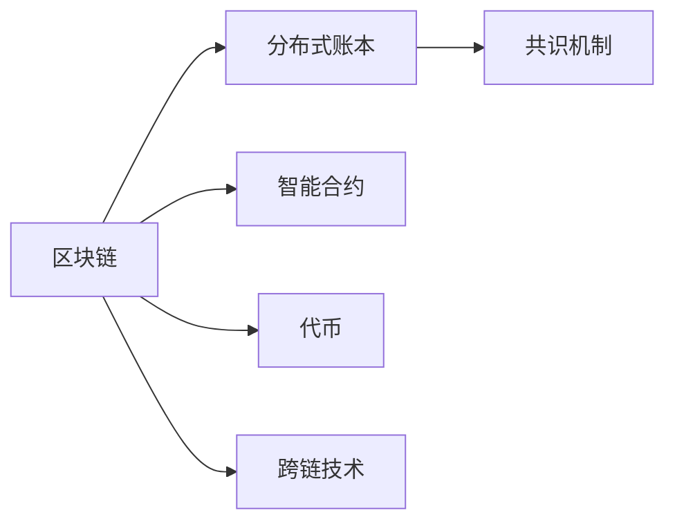

                 

## 1. 背景介绍

区块链技术自2009年诞生以来，已经引起了全球的广泛关注和热议。作为一种去中心化的分布式账本技术，区块链不仅颠覆了传统的金融交易方式，还在供应链管理、版权保护、医疗健康等多个领域展现出巨大的应用潜力。本文将详细探讨区块链技术的原理、核心概念、应用实践，并对其未来发展趋势与挑战进行全面分析，以期为开发者提供深入理解区块链技术的框架和路径。

## 2. 核心概念与联系

### 2.1 核心概念概述

区块链（Blockchain）是一种去中心化的分布式账本技术，通过加密技术保证交易数据的安全性和完整性，实现无需信任即能达成共识的目标。其核心概念包括：

- **区块链**（Blockchain）：由多个数据块（Block）按时间顺序组成的一条链式结构，每个数据块包含一组交易记录和前一个数据块的哈希值。
- **分布式账本**（Distributed Ledger）：通过多个节点共同维护的账本，每个节点保存一份完整的账本副本。
- **共识机制**（Consensus Mechanism）：通过算法和规则确保网络中所有节点就账本状态达成一致，如PoW（工作量证明）、PoS（权益证明）、DPoS（授权证明）等。
- **智能合约**（Smart Contract）：运行在区块链上的自动化合约，可以自动执行合同条款，无需人工干预。
- **代币（Token）**：区块链上的数字资产单位，用于记录交易信息，如比特币、以太坊等。
- **跨链技术**（Cross-chain Technology）：实现不同区块链之间的互联互通，实现资产和数据的无缝交换。

这些核心概念通过Mermaid流程图连接起来：



### 2.2 核心概念原理和架构

区块链系统由多个组件组成，包括数据层、网络层、共识层、智能合约层、激励层和应用层。各层之间通过接口连接，共同构成一个完整的区块链生态系统。

- **数据层**：记录交易数据，并保证数据的不可篡改性和可追溯性。
- **网络层**：负责节点间的通信和信息传播，确保数据的安全传输。
- **共识层**：通过共识算法确保网络中所有节点就账本状态达成一致，防止恶意节点篡改数据。
- **智能合约层**：运行在区块链上的自动化合约，自动执行合同条款，无需人工干预。
- **激励层**：通过奖励机制激励节点参与记账，确保网络的安全性和稳定性。
- **应用层**：提供区块链技术的应用场景，如金融、供应链、医疗等。

这些核心组件通过不断的迭代和发展，共同支撑起区块链技术的强大功能和广泛应用。

## 3. 核心算法原理 & 具体操作步骤

### 3.1 算法原理概述

区块链的算法原理主要包括以下几个方面：

- **哈希算法**（Hash Algorithm）：将交易数据转换为固定长度的哈希值，保证数据的唯一性和不可篡改性。
- **加密算法**（Encryption Algorithm）：通过公钥和私钥加密交易数据，保证数据的隐私性和安全性。
- **共识算法**（Consensus Algorithm）：通过算法和规则确保网络中所有节点就账本状态达成一致，防止恶意节点篡改数据。

### 3.2 算法步骤详解

基于区块链技术的去中心化应用（DApp）开发一般包括以下几个关键步骤：

**Step 1: 选择区块链平台**

- 根据应用需求，选择合适的区块链平台。如比特币、以太坊等。

**Step 2: 设计智能合约**

- 使用Solidity、Vyper等智能合约语言编写DApp的逻辑。
- 定义交易事件的触发条件和执行逻辑。

**Step 3: 部署智能合约**

- 将智能合约部署到区块链上，生成合约地址。

**Step 4: 测试和调试**

- 使用测试网进行合约测试，调试发现的问题。
- 模拟真实场景，验证合约的稳定性和安全性。

**Step 5: 部署上线**

- 在主网上部署合约，进行实际应用测试。
- 定期监控合约状态，处理异常情况。

### 3.3 算法优缺点

区块链技术的优点：

- 去中心化：不需要中心化的第三方机构，所有节点共同维护账本。
- 安全性：通过加密和共识算法确保交易数据的安全性和完整性。
- 透明度：交易数据公开透明，可追溯性高。
- 不可篡改：数据一旦写入区块链，难以被篡改。

区块链技术的缺点：

- 交易速度慢：由于共识算法需要时间验证，交易速度较慢。
- 能源消耗高：共识算法如PoW消耗大量电力。
- 可扩展性差：单个区块链系统难以处理海量数据。
- 开发复杂度高：需要具备区块链开发和智能合约编写等技术。

### 3.4 算法应用领域

区块链技术已经在金融、供应链、版权保护、医疗等多个领域得到广泛应用：

- **金融领域**：实现去中心化的交易和结算，降低交易成本，提高交易效率。
- **供应链管理**：通过区块链记录货物流向，实现供应链的全程追溯。
- **版权保护**：记录作品的创作和授权信息，防止侵权行为。
- **医疗健康**：记录患者病历和诊疗信息，实现医疗数据的共享和互操作。
- **能源行业**：记录能源的生产和消费信息，实现能源市场的透明化和高效化。

## 4. 数学模型和公式 & 详细讲解

### 4.1 数学模型构建

区块链的数学模型主要包括以下几个方面：

- **哈希算法**：哈希函数$H$将任意长度的数据映射为固定长度的哈希值。哈希值的特点是不可逆、唯一性、抗碰撞。
- **加密算法**：公钥密码系统如RSA，椭圆曲线密码系统如ECC，用于保证交易数据的隐私性。
- **共识算法**：如PoW，共识节点通过计算复杂的工作量（hashing）来获得记账权，保证账本的安全性和一致性。

### 4.2 公式推导过程

以PoW为例，推导其共识算法的基本过程：

1. 每个节点都试图通过解决一个数学难题来获取记账权。难题为找到一个哈希值，使得该哈希值以某种方式与前一个区块的哈希值相关联。
2. 节点通过不断尝试不同的哈希值，直到找到符合要求的哈希值。
3. 找到符合要求的哈希值后，节点将该哈希值提交给网络进行验证。
4. 如果验证通过，节点将该哈希值添加到账本中，并获得记账权。

### 4.3 案例分析与讲解

假设有一个简单的区块链系统，包含一个区块（Block），其中包含一个交易（Transaction）和一个前一区块的哈希值（Previous Hash）。交易的哈希值由其内容生成，前一区块的哈希值由前一区块的内容生成。

使用椭圆曲线加密算法来确保交易的隐私性。每个节点都试图通过计算一个满足条件的哈希值来获得记账权。

具体步骤如下：

1. 生成一个随机数作为非对称加密中的私钥（$privateKey$）。
2. 使用椭圆曲线加密算法生成公钥（$publicKey$）。
3. 将交易内容（$transaction$）、公钥（$publicKey$）和非对称加密算法（$encryptionAlgorithm$）作为输入，生成交易哈希值（$hash$）。
4. 将交易哈希值（$hash$）、前一区块的哈希值（$previousHash$）和随机数（$randomNumber$）作为输入，生成当前区块的哈希值（$currentHash$）。
5. 将当前区块的哈希值（$currentHash$）、前一区块的哈希值（$previousHash$）和当前区块的交易哈希值（$transactionHash$）存储在区块中。

## 5. 项目实践：代码实例和详细解释说明

### 5.1 开发环境搭建

进行区块链项目开发，需要以下开发环境：

1. **区块链平台**：如比特币、以太坊等。
2. **智能合约开发工具**：如Solidity、Vyper等。
3. **测试网络**：如Ropsten、Rinkeby等。
4. **开发工具**：如Git、Visual Studio Code等。

### 5.2 源代码详细实现

以以太坊智能合约为例，以下是一个简单的智能合约代码实现：

```solidity
// SPDX-License-Identifier: MIT
pragma solidity ^0.8.0;

contract SimpleToken {
    uint256 public balanceOf(address player);
    uint256 public totalSupply;

    event Transfer(address indexed from, address indexed to, uint256 amount);

    constructor(uint256 initialSupply) {
        totalSupply = initialSupply;
        balanceOf(msg.sender) = initialSupply;
    }

    function transfer(address recipient, uint256 amount) public {
        require(msg.sender != address(0), "Sender address cannot be 0x0");
        require(recipient != address(0), "Recipient address cannot be 0x0");
        require(amount > 0, "Amount must be greater than 0");
        require(balanceOf(msg.sender) >= amount, "Insufficient balance");
        balanceOf(msg.sender) -= amount;
        balanceOf(recipient) += amount;
        emit Transfer(msg.sender, recipient, amount);
    }
}
```

### 5.3 代码解读与分析

**变量定义**：
- `uint256 public balanceOf(address player)`：记录每个地址的余额。
- `uint256 public totalSupply`：记录总供应量。
- `event Transfer(address indexed from, address indexed to, uint256 amount)`：记录转账事件。

**构造函数**：
- `constructor(uint256 initialSupply)`：初始化总供应量和玩家余额。

**转账函数**：
- `function transfer(address recipient, uint256 amount) public`：实现转账功能。
- `require(msg.sender != address(0), "Sender address cannot be 0x0")`：判断发送地址是否合法。
- `require(recipient != address(0), "Recipient address cannot be 0x0")`：判断接收地址是否合法。
- `require(amount > 0, "Amount must be greater than 0")`：判断转账金额是否合法。
- `require(balanceOf(msg.sender) >= amount, "Insufficient balance")`：判断发送地址的余额是否足够。
- `balanceOf(msg.sender) -= amount`：扣除发送地址的余额。
- `balanceOf(recipient) += amount`：增加接收地址的余额。
- `emit Transfer(msg.sender, recipient, amount)`：记录转账事件。

## 6. 实际应用场景

### 6.1 智能合约贷款

智能合约贷款系统可以在不依赖中介机构的情况下，实现借贷双方的自动交易。借贷双方通过智能合约设定贷款条款和还款条件，系统自动执行合同条款，确保交易的公正性和透明度。

### 6.2 供应链金融

通过区块链技术，可以实现供应链的全程追溯和监管。供应链上的各个节点将交易数据记录在区块链上，确保数据的不可篡改性和可追溯性。金融机构可以根据区块链上的交易数据进行贷款审批，降低信贷风险。

### 6.3 数字身份认证

数字身份认证系统通过区块链记录用户的身份信息，确保数据的隐私性和安全性。用户可以通过数字身份在多个应用场景中验证身份，无需频繁提供身份证明，提高用户的便利性和安全性。

### 6.4 未来应用展望

区块链技术的未来发展趋势：

1. **跨链互操作**：实现不同区块链之间的互联互通，解决不同区块链之间的数据孤岛问题。
2. **高可用性**：提升区块链系统的容错性和可扩展性，提高系统的可用性和稳定性。
3. **共识算法优化**：开发新的共识算法，提高交易速度和安全性。
4. **智能合约标准化**：制定智能合约的标准和规范，提高智能合约的可扩展性和互操作性。
5. **隐私保护**：开发隐私保护技术，确保交易数据的隐私性和安全性。

## 7. 工具和资源推荐

### 7.1 学习资源推荐

1. **《区块链技术与安全》**：张艳国著，介绍区块链技术的原理和应用，适合初学者入门。
2. **《以太坊智能合约开发实战》**：王晓峰著，详细介绍以太坊智能合约的开发和应用，适合实战练习。
3. **《区块链与人工智能》**：吴恩达著，介绍区块链与人工智能的结合应用，适合深度学习开发者。
4. **Solidity官方文档**：Solidity官方文档，提供详细的智能合约开发指南和示例代码。
5. **CSDN区块链社区**：国内最大的技术交流社区，提供丰富的区块链开发资源和技术文章。

### 7.2 开发工具推荐

1. **Git**：版本控制工具，方便代码的协同开发和版本管理。
2. **Visual Studio Code**：轻量级开发工具，支持智能合约的编写和测试。
3. **Truffle**：以太坊智能合约开发框架，提供丰富的开发工具和插件。
4. **Web3.js**：以太坊开发的JavaScript库，方便与以太坊网络的交互。
5. **MyEtherWallet**：轻量级的以太坊钱包，支持私钥管理和交易操作。

### 7.3 相关论文推荐

1. **《比特币白皮书》**：Satoshi Nakamoto著，介绍比特币的原理和设计思想。
2. **《以太坊白皮书》**：Vitalik Buterin著，介绍以太坊的技术架构和应用场景。
3. **《以太坊2.0共识机制》**：以太坊官方博客，介绍以太坊2.0的共识机制和升级方案。
4. **《跨链互操作性研究》**：张晓宇等著，介绍跨链技术的研究现状和未来趋势。

## 8. 总结：未来发展趋势与挑战

### 8.1 总结

本文详细介绍了区块链技术的原理、核心概念和应用实践，探讨了区块链技术的未来发展趋势与挑战。区块链技术作为一种去中心化的分布式账本技术，具有去中心化、安全性、透明度等优点，已经在金融、供应链、医疗等多个领域得到广泛应用。但区块链技术在交易速度、可扩展性、开发复杂度等方面也面临诸多挑战。未来，需要不断优化区块链技术，提升其应用范围和性能。

### 8.2 未来发展趋势

1. **跨链技术**：实现不同区块链之间的互联互通，解决数据孤岛问题。
2. **共识算法优化**：开发新的共识算法，提高交易速度和安全性。
3. **隐私保护**：开发隐私保护技术，确保交易数据的隐私性和安全性。
4. **智能合约标准化**：制定智能合约的标准和规范，提高智能合约的可扩展性和互操作性。
5. **高可用性**：提升区块链系统的容错性和可扩展性，提高系统的可用性和稳定性。

### 8.3 面临的挑战

1. **交易速度慢**：由于共识算法需要时间验证，交易速度较慢。
2. **能源消耗高**：共识算法如PoW消耗大量电力。
3. **可扩展性差**：单个区块链系统难以处理海量数据。
4. **开发复杂度高**：需要具备区块链开发和智能合约编写等技术。
5. **隐私保护不足**：交易数据的隐私性难以完全保障。

### 8.4 研究展望

区块链技术的未来研究需要在以下几个方面寻求新的突破：

1. **跨链互操作**：实现不同区块链之间的互联互通，解决数据孤岛问题。
2. **共识算法优化**：开发新的共识算法，提高交易速度和安全性。
3. **隐私保护**：开发隐私保护技术，确保交易数据的隐私性和安全性。
4. **智能合约标准化**：制定智能合约的标准和规范，提高智能合约的可扩展性和互操作性。
5. **高可用性**：提升区块链系统的容错性和可扩展性，提高系统的可用性和稳定性。

## 9. 附录：常见问题与解答

### Q1: 什么是区块链？

**A**: 区块链是一种去中心化的分布式账本技术，通过加密技术保证交易数据的安全性和完整性，实现无需信任即能达成共识的目标。

### Q2: 区块链和比特币有什么区别？

**A**: 区块链是分布式账本技术，比特币是区块链的一种应用。比特币使用区块链技术来记录交易信息，通过工作量证明（PoW）共识算法确保交易的合法性和安全性。

### Q3: 智能合约是什么？

**A**: 智能合约是运行在区块链上的自动化合约，可以自动执行合同条款，无需人工干预。通过代码实现合同条款，保证执行的公正性和透明性。

### Q4: 区块链技术有哪些应用场景？

**A**: 区块链技术已经在金融、供应链、版权保护、医疗等多个领域得到广泛应用。如智能合约贷款、供应链金融、数字身份认证等。

---

作者：禅与计算机程序设计艺术 / Zen and the Art of Computer Programming

