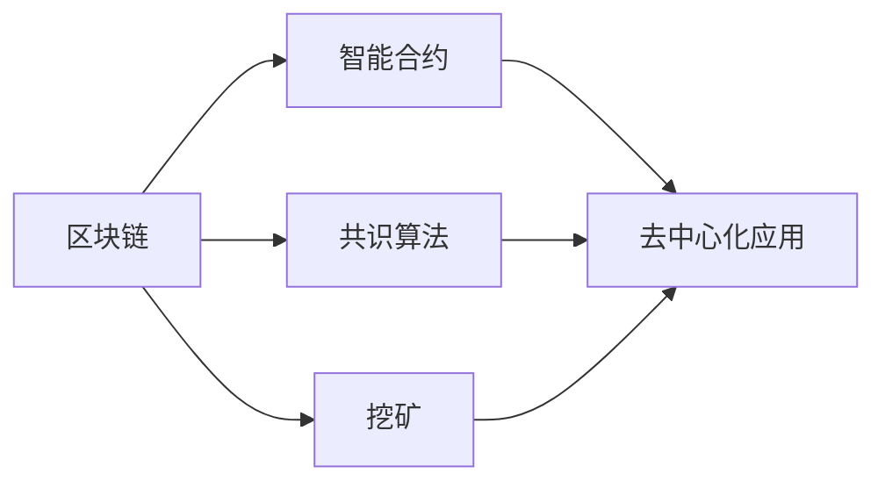

                 

# 区块链技术：去中心化应用开发

> 关键词：区块链,智能合约,去中心化,去中心化应用,区块链开发,区块链技术

## 1. 背景介绍

### 1.1 问题由来

区块链作为一种去中心化的分布式账本技术，自2008年出现以来，已经引起了全球范围内的广泛关注和热烈讨论。比特币作为第一个成功应用区块链技术的金融产品，不仅引发了全球范围内的加密货币热潮，也推动了区块链技术向其他领域的广泛应用。

随着区块链技术的不断发展和成熟，越来越多的企业和开发者开始探索其应用潜力，去中心化应用（Decentralized Applications，简称DApps）便是其中最具前景和意义的领域之一。DApps作为一种建立在区块链上的应用形式，能够实现数据和计算的去中心化，提升系统的透明度、安全性和可信度。

然而，区块链技术的复杂性和技术门槛，使其在DApps开发上存在诸多挑战。本文将从基础原理到实践细节，全面解析区块链技术，探讨如何高效、安全地开发去中心化应用。

## 2. 核心概念与联系

### 2.1 核心概念概述

为更好地理解区块链技术，本节将介绍几个核心概念：

- 区块链(Blockchain)：一种基于分布式账本的技术，通过去中心化的方式记录和验证交易信息，保证其不可篡改性和透明性。

- 智能合约(Smart Contract)：一段可以自动执行、控制和管理交易的代码，部署在区块链上后，能够自动执行并验证合同条款。

- 共识算法(Consensus Algorithm)：一种保证区块链网络中所有节点达成共识的机制，确保网络安全和稳定运行。

- 挖矿(Mining)：通过计算机硬件求解复杂的数学难题，将新交易打包成区块，并通过网络广播给其他节点确认的过程。

- 去中心化应用(Decentralized Applications, DApps)：基于区块链技术的分布式应用，具有去中心化、透明性、安全性等特性。

- 共识节点(Consensus Node)：在区块链网络中，负责验证交易、维护共识的节点。

这些核心概念通过如下Mermaid流程图进行关联展示：



这个流程图展示了区块链与智能合约、共识算法、挖矿、DApps等核心概念之间的紧密联系，以及它们在构建去中心化应用时的角色。

## 3. 核心算法原理 & 具体操作步骤
### 3.1 算法原理概述

区块链技术的核心原理可以概括为以下几点：

1. **分布式账本(Distributed Ledger)**：区块链网络中的每个节点都维护了一个完整的、一致的分布式账本副本。

2. **不可篡改性(Immutability)**：一旦数据被记录在区块链上，就无法被篡改或删除。

3. **共识机制(Consensus)**：通过共识算法，保证所有节点对同一数据的最终状态达成一致。

4. **挖矿(Proof of Work, PoW)**：一种通过计算复杂数学难题来验证新区块的方法，保证系统的安全和去中心化。

5. **智能合约(Smart Contracts)**：在区块链上执行的可编程合约，实现自动化的交易和逻辑处理。

这些原理共同构成了区块链技术的基础框架，使得其能够实现去中心化、安全性和透明性等特性。

### 3.2 算法步骤详解

区块链技术的核心步骤主要包括：

1. **构建和广播交易(Transaction)**：用户通过区块链网络广播交易，交易包含发送方、接收方、金额等信息。

2. **挖矿验证(Proof of Work)**：矿工节点通过求解复杂的数学难题来验证交易，并将交易打包成区块。

3. **区块打包与广播(Blocks)**：矿工将验证过的交易打包成区块，并将区块广播给其他节点。

4. **共识与确认(Consensus)**：节点通过共识算法验证区块内容，确保数据的正确性和一致性。

5. **区块链接与追加(Blockchain)**：新区块被添加到现有区块链的尾部，形成完整的分布式账本。

通过这些步骤，区块链网络实现了去中心化、不可篡改、透明和可验证的交易记录和状态更新。

### 3.3 算法优缺点

区块链技术的优缺点如下：

**优点**：

1. **去中心化(Decentralization)**：无需中心化机构，通过共识机制保证数据的一致性。

2. **透明性(Transparency)**：所有交易数据公开可见，可追溯、可验证。

3. **安全性(Security)**：通过加密和共识机制，保障数据的安全性和不可篡改性。

4. **去信任化(Trustlessness)**：无需信任中介机构，节点间通过算法直接进行信任交互。

**缺点**：

1. **性能瓶颈**：由于去中心化的特性，区块链网络的处理速度较慢。

2. **能源消耗高**：PoW共识机制需要大量的计算资源，能耗较大。

3. **技术门槛高**：区块链技术涉及复杂的密码学和分布式系统原理，开发难度较大。

4. **扩展性有限**：当前区块链系统普遍存在扩展性不足的问题，难以处理大规模数据和用户。

5. **法律和监管不确定性**：不同国家和地区对区块链和加密货币的监管政策各异，法律环境不稳定。

尽管存在这些缺点，但区块链技术的核心优势使其在金融、供应链、智能合约等多个领域展示了巨大的应用潜力。

### 3.4 算法应用领域

区块链技术在以下几个领域具有重要应用价值：

1. **金融**：如加密货币交易、支付系统、智能合约、身份认证等。

2. **供应链管理**：通过区块链追踪物流信息、提高供应链透明度。

3. **医疗健康**：实现患者数据隐私保护、医疗记录共享、医疗费用支付等。

4. **政府服务**：电子投票、电子公证、去中心化公共记录等。

5. **版权保护**：通过区块链记录和证明版权信息，防止盗版和侵权。

6. **物联网**：区块链确保设备之间的数据安全传输和隐私保护。

以上领域只是区块链技术的部分应用，随着技术的不断成熟和扩展，区块链将会在更多领域发挥重要作用。

## 4. 数学模型和公式 & 详细讲解  
### 4.1 数学模型构建

区块链网络中的交易通过散列函数进行验证和打包，智能合约通过编程语言编写并部署在区块链上。下面以比特币为例，介绍其核心数学模型和公式。

比特币的交易验证过程基于哈希函数和椭圆曲线加密技术。交易包括输入和输出，每个输入关联一个UTXO（未花费输出），输出则指定接收方和金额。

交易验证过程如下：

1. 输入：每个UTXO关联一个公钥和一个哈希值，哈希值是对前一个交易的输出进行哈希计算得到。

2. 输出：输出指定接收方地址和金额。

3. 验证：验证过程通过求解椭圆曲线上的离散对数问题，确保交易的有效性和一致性。

椭圆曲线方程为：

$$ y^2 = x^3 + ax + b $$

其中，$(x,y)$是椭圆曲线上的点，$a$和$b$是椭圆曲线的参数。

交易验证过程如下：

- 随机生成一个私钥 $d$，通过椭圆曲线计算公钥 $(x_1,y_1)$。
- 根据公钥 $(x_1,y_1)$ 计算哈希值 $H$。
- 将 $H$ 与椭圆曲线参数 $a$ 和 $b$ 代入椭圆曲线方程，计算得到 $y_2$。
- 如果 $y_1 = y_2$，则交易有效，否则无效。

### 4.2 公式推导过程

椭圆曲线方程的推导过程如下：

1. 将椭圆曲线方程 $y^2 = x^3 + ax + b$ 带入椭圆曲线点 $(x_1,y_1)$ 的坐标，得到：
$$ y_1^2 = x_1^3 + ax_1 + b $$

2. 将上式两边同时乘以一个随机数 $k$，得到：
$$ k \cdot y_1^2 = k \cdot (x_1^3 + ax_1 + b) $$

3. 将上式变形为椭圆曲线方程的形式：
$$ k \cdot y_1^2 = (k \cdot x_1)^3 + k \cdot a \cdot x_1 + k \cdot b $$

4. 将 $k \cdot y_1$ 和 $k \cdot x_1$ 分别记为 $y_2$ 和 $x_2$，得到椭圆曲线上的新点 $(x_2,y_2)$。

5. 通过求解椭圆曲线上的离散对数问题，验证新点的有效性。

离散对数问题是一个计算难题，难于逆向求解。因此，椭圆曲线加密技术保证了交易的安全性和不可篡改性。

### 4.3 案例分析与讲解

以比特币的智能合约为例，分析智能合约的核心实现和关键技术。

假设甲乙双方要通过智能合约进行一笔交易，智能合约定义了交易的条款和执行条件。智能合约的实现过程如下：

1. 甲方通过比特币网络广播智能合约代码，并将所需支付的比特币锁定在合约地址上。

2. 智能合约代码被广播到比特币网络，节点通过共识机制验证代码的有效性。

3. 智能合约被部署到区块链上，并开始执行。

4. 当满足特定条件时，智能合约自动执行交易，释放锁定在合约地址上的比特币。

智能合约的执行过程需要依赖智能合约编程语言，如Solidity、Serum等。智能合约编程语言提供了丰富的数据类型和函数库，可以方便地实现各种复杂的逻辑和算法。

## 5. 项目实践：代码实例和详细解释说明
### 5.1 开发环境搭建

在进行区块链开发前，需要搭建开发环境。以下是使用Ethereum平台的开发环境配置流程：

1. 安装Node.js：Ethereum依赖Node.js环境，从官网下载并安装。

2. 安装Ganache：Ganache是Ethereum官方的本地测试网络，可以模拟Ethereum网络进行开发测试。

3. 安装Ethereum客户端：如Metamask、MyEtherWallet等，用于管理私钥和进行交易。

4. 安装Solidity开发工具：如Remix IDE、Truffle框架等，提供智能合约的编写、测试和部署工具。

5. 安装Git版本控制系统：如GitHub等，用于版本管理和代码协作。

完成上述步骤后，即可在Ethereum平台上进行智能合约的开发和测试。

### 5.2 源代码详细实现

这里我们以Ethereum的智能合约为例，给出智能合约的源代码实现。

首先，定义智能合约的接口：

```solidity
// SPDX-License-Identifier: MIT
pragma solidity ^0.8.0;

contract SimpleStorage {
    uint256 public value;

    function set(uint256 x) public {
        value = x;
    }

    function get() public view returns (uint256) {
        return value;
    }
}
```

然后，使用Solidity编写智能合约的代码：

```solidity
pragma solidity ^0.8.0;

contract SimpleStorage {
    uint256 private value;

    function set(uint256 x) public {
        value = x;
    }

    function get() public view returns (uint256) {
        return value;
    }

    function update() public {
        value = value + 1;
    }

    function reset() public {
        value = 0;
    }
}
```

以上智能合约定义了一个简单的状态变量 `value`，并提供了 `set`、`get`、`update` 和 `reset` 等函数，用于操作状态变量的值。

### 5.3 代码解读与分析

让我们再详细解读一下关键代码的实现细节：

**SimpleStorage类**：
- `constructor`方法：定义智能合约的状态变量 `value` 的初始值。
- `set`方法：设置 `value` 的值，需要接收一个参数 `x`。
- `get`方法：获取 `value` 的值，不改变状态变量。
- `update`方法：将 `value` 的值加1，模拟状态变量的更新。
- `reset`方法：将 `value` 的值重置为0，模拟状态变量的重置。

**接口定义**：
- 使用 `public` 关键字定义接口函数，表示这些函数可以被外部调用。
- 使用 `view` 关键字定义只读函数，表示函数不会修改状态变量。

**私有变量**：
- 使用 `private` 关键字定义私有变量，表示这些变量只能在合约内部访问。

**更新和重置函数**：
- 通过 `value = value + 1` 更新状态变量，模拟用户的交互。
- 通过 `value = 0` 重置状态变量，模拟回滚操作。

**测试代码**：
- 使用 `it`关键字定义测试用例，可以编写多个测试用例进行单元测试。
- 使用 `assert` 关键字验证测试结果是否符合预期。
- 使用 `mock` 关键字模拟合约状态，避免实际运行时修改状态变量的值。

通过上述代码实现，我们可以验证智能合约的逻辑和功能，确保其在实际应用中的正确性和安全性。

### 5.4 运行结果展示

通过编写和部署智能合约，我们可以进行以下操作：

1. 部署智能合约：使用 `remix-ide`部署智能合约到区块链网络。

2. 调用合约函数：使用 `MyEtherWallet`等工具调用智能合约的函数。

3. 验证合约状态：使用 `eth.getBalance`函数检查智能合约的状态变量值。

通过这些操作，我们可以测试智能合约的正确性、可靠性和安全性。

## 6. 实际应用场景
### 6.1 智能合约

智能合约是区块链技术的核心应用之一，可以自动执行、控制和管理交易，实现去中心化的自动执行和验证。

例如，在供应链管理中，可以通过智能合约记录物流信息，确保商品从生产到销售的每一步都能被追溯和验证。通过智能合约，可以自动化支付运费、清关、保险等费用，简化交易流程，降低成本。

在金融领域，智能合约可以自动执行各种金融合约，如股票交易、贷款协议、保险合同等。例如，在股票交易中，可以通过智能合约自动执行买卖订单，减少中间环节，提高交易效率和透明度。

### 6.2 去中心化身份认证

去中心化身份认证是一种基于区块链技术的身份验证方式，可以保证用户的身份信息安全、隐私保护。

例如，在医疗健康领域，可以通过区块链存储用户的健康记录和身份信息，确保数据的安全性和隐私性。通过去中心化身份认证，用户可以自主管理自己的健康数据，防止数据泄露和滥用。

在政府服务领域，可以通过去中心化身份认证，实现电子投票、电子公证等政府服务，提高政府的透明度和公信力。

### 6.3 去中心化金融(DeFi)

去中心化金融(DeFi)是一种基于区块链技术的金融应用，旨在实现去中心化的金融服务，如借贷、保险、投资等。

例如，在DeFi中，用户可以通过智能合约进行借贷和投资，无需中介机构的参与，降低交易成本和风险。通过去中心化金融，可以实现更加透明、公平、可信的金融服务。

在保险领域，可以通过智能合约自动执行保险合同，减少保险公司和投保人的交易成本，提高保险理赔效率。

### 6.4 未来应用展望

未来，随着区块链技术的不断成熟和应用场景的拓展，区块链技术将会在更多领域发挥重要作用。

1. **智能合约**：随着智能合约技术的进一步发展，智能合约将会在金融、供应链、物联网等领域得到更广泛的应用，实现自动化的合约执行和管理。

2. **去中心化身份认证**：去中心化身份认证技术将会被广泛应用于医疗健康、政府服务、电子商务等领域，保护用户的身份信息安全和隐私保护。

3. **去中心化金融(DeFi)**：去中心化金融将会在金融服务、保险、供应链等领域得到更广泛的应用，提供更加透明、公平、可信的金融服务。

4. **区块链+物联网**：通过区块链技术，可以实现物联网设备之间的数据安全和隐私保护，提高物联网系统的可靠性和安全性。

5. **区块链+大数据**：通过区块链技术，可以实现大数据的安全存储和共享，保护数据的完整性和隐私性。

## 7. 工具和资源推荐
### 7.1 学习资源推荐

为了帮助开发者系统掌握区块链技术的基础和实践，这里推荐一些优质的学习资源：

1. 《区块链原理与实践》书籍：比特币和区块链技术的奠基之作，深入浅出地介绍了区块链的基础原理和应用场景。

2. 《Solidity智能合约开发实战》课程：由Solidity官方提供，详细讲解智能合约的编写、测试和部署流程。

3. Udacity《区块链和以太坊》课程：全面介绍了区块链和以太坊的基本概念和技术，适合初学者入门。

4 《区块链开发者指南》书籍：提供区块链技术的全面介绍，包括共识机制、挖矿、智能合约等核心内容。

5 以太坊官方文档：提供以太坊平台的详细文档和API，适合开发者参考和使用。

通过对这些资源的学习实践，相信你一定能够快速掌握区块链技术的精髓，并用于解决实际的DApps问题。

### 7.2 开发工具推荐

高效的区块链开发离不开优秀的工具支持。以下是几款用于区块链开发常用的工具：

1. Truffle框架：以太坊官方提供的开发框架，提供智能合约的编写、测试和部署工具。

2. Remix IDE：以太坊官方提供的智能合约开发环境，支持Solidity语言的编写和测试。

3. MetaMask：以太坊官方提供的浏览器插件，支持智能合约的编写、测试和部署。

4. ConsenSys Academy：以太坊社区提供的在线学习平台，提供区块链技术的全面课程和实战项目。

5. Web3.js：一款支持以太坊和其他区块链平台的JavaScript库，提供与区块链的交互接口。

合理利用这些工具，可以显著提升区块链开发和测试的效率，加快创新迭代的步伐。

### 7.3 相关论文推荐

区块链技术的发展源于学界的持续研究。以下是几篇奠基性的相关论文，推荐阅读：

1. Satoshi Nakamoto《比特币白皮书》：比特币和区块链技术的奠基之作，阐述了区块链的去中心化、安全性和透明性。

2. Vitalik Buterin《以太坊白皮书》：以太坊和智能合约技术的奠基之作，阐述了智能合约的自动执行和管理机制。

3. Nielsen《区块链和共识算法》：介绍了区块链中的共识算法，如PoW、PoS、DPoS等，并分析其优缺点。

4. Miller《去中心化金融研究》：阐述了DeFi技术的核心思想和应用场景，探讨了去中心化金融的发展趋势。

5. Goldfeder《区块链和加密货币法律》：介绍了区块链和加密货币的法律环境，探讨了区块链技术的监管挑战。

这些论文代表了大规模区块链技术的发展脉络。通过学习这些前沿成果，可以帮助研究者把握学科前进方向，激发更多的创新灵感。

## 8. 总结：未来发展趋势与挑战

### 8.1 总结

本文对区块链技术的核心概念和实践进行了全面系统的介绍。首先阐述了区块链技术的原理和核心组件，明确了智能合约、共识算法、挖矿、DApps等关键技术在区块链中的角色和作用。其次，从理论到实践，详细讲解了区块链技术的具体实现步骤和关键算法，提供了智能合约的代码实例。同时，本文还探讨了区块链技术在金融、供应链、智能合约等多个领域的应用前景，展示了区块链技术的广阔应用前景。

通过本文的系统梳理，可以看到，区块链技术通过去中心化、透明性和安全性等特性，在数字经济和智能化转型中发挥着越来越重要的作用。未来，伴随区块链技术的不断成熟和扩展，去中心化应用将会更加广泛地应用于各行各业，提升社会的透明度、安全性和效率。

### 8.2 未来发展趋势

展望未来，区块链技术的发展趋势如下：

1. **智能合约普及化**：随着智能合约技术的进一步发展，智能合约将会在更多领域得到应用，实现自动化的合约执行和管理。

2. **去中心化金融(DeFi)兴起**：去中心化金融将会在金融服务、保险、供应链等领域得到更广泛的应用，提供更加透明、公平、可信的金融服务。

3. **区块链+物联网**：通过区块链技术，可以实现物联网设备之间的数据安全和隐私保护，提高物联网系统的可靠性和安全性。

4. **区块链+大数据**：通过区块链技术，可以实现大数据的安全存储和共享，保护数据的完整性和隐私性。

5. **区块链+AI**：区块链和人工智能技术的融合，可以提升系统的智能性和自动化水平，实现更加高效、可靠的应用场景。

6. **跨链技术发展**：不同区块链平台之间的互操作性将得到提升，实现跨链交易和数据共享。

以上趋势凸显了区块链技术的巨大潜力，这些方向的探索发展，将进一步推动区块链技术的创新和应用。

### 8.3 面临的挑战

尽管区块链技术已经取得了显著成果，但在迈向更加智能化、普适化应用的过程中，仍面临诸多挑战：

1. **技术复杂度**：区块链技术涉及复杂的密码学和分布式系统原理，开发难度较大，需要跨学科的深入理解和实践。

2. **性能瓶颈**：区块链网络的扩展性和处理速度较慢，难以应对大规模数据和用户需求。

3. **能耗问题**：PoW共识机制需要大量的计算资源，能耗较大，难以支持大规模应用。

4. **法律和监管不确定性**：不同国家和地区对区块链和加密货币的监管政策各异，法律环境不稳定。

5. **安全性问题**：区块链网络的安全性和隐私保护仍存在挑战，需要进一步提升。

6. **技术标准不统一**：不同区块链平台之间的技术标准不统一，难以实现互操作性和互通性。

7. **生态系统不完善**：区块链生态系统尚未完全成熟，需要更多的开发和应用支持。

正视区块链技术面临的这些挑战，积极应对并寻求突破，将使区块链技术更加成熟和完善。

### 8.4 研究展望

未来，区块链技术的深入研究可以从以下几个方面进行：

1. **共识算法优化**：研究新的共识算法，提升区块链网络的性能和安全性。

2. **跨链技术**：研究区块链之间的互操作性，实现跨链交易和数据共享。

3. **去中心化应用开发**：研究去中心化应用的开发技术和应用场景，提升DApps的效率和可靠性。

4. **区块链+AI**：研究区块链和人工智能技术的融合，提升系统的智能性和自动化水平。

5. **隐私保护技术**：研究区块链的隐私保护技术，保护用户的隐私和数据安全。

6. **智能合约优化**：研究智能合约的优化和优化技术，提升智能合约的执行效率和安全性。

通过这些研究方向，相信区块链技术将在未来的数字化转型中发挥更加重要的作用，推动社会的智能化和普适化进程。

## 9. 附录：常见问题与解答

**Q1：区块链技术有哪些特点？**

A: 区块链技术具有以下几个核心特点：

1. **去中心化(Decentralization)**：无需中心化机构，通过共识机制保证数据的一致性。

2. **透明性(Transparency)**：所有交易数据公开可见，可追溯、可验证。

3. **安全性(Security)**：通过加密和共识机制，保障数据的安全性和不可篡改性。

4. **去信任化(Trustlessness)**：无需信任中介机构，节点间通过算法直接进行信任交互。

5. **不可篡改性(Immutability)**：一旦数据被记录在区块链上，就无法被篡改或删除。

6. **智能合约(Smart Contracts)**：在区块链上执行的可编程合约，实现自动化的交易和逻辑处理。

**Q2：如何部署智能合约？**

A: 智能合约的部署过程如下：

1. 使用Truffle框架编写智能合约代码，并使用`truffle compile`命令编译智能合约。

2. 使用`truffle migrate`命令部署智能合约到区块链网络，指定合约地址和资金。

3. 在智能合约中定义所需的初始化资金和部署参数。

4. 通过智能合约的函数进行交互，如设置状态变量、调用合约函数等。

5. 通过`truffle deploy`命令重新部署智能合约，确保其正确性和可靠性。

**Q3：如何验证区块链网络的安全性？**

A: 区块链网络的安全性主要依赖共识机制和加密技术。以下是一些验证区块链网络安全性的方法：

1. 共识算法验证：研究共识算法的安全性，如PoW、PoS、DPoS等，确保区块链网络的稳定性和一致性。

2. 加密技术验证：验证区块链的加密技术，如椭圆曲线加密、SHA-256等，确保数据的安全性和不可篡改性。

3. 智能合约验证：验证智能合约的逻辑和代码，确保其正确性和可靠性。

4. 共识节点验证：验证共识节点的可靠性和安全性，确保网络的安全性和稳定性。

5. 区块链分析工具：使用区块链分析工具，如Blockscout、Etherscan等，分析区块链网络的活动和交易情况。

通过这些方法，可以全面验证区块链网络的安全性，确保其可靠性和稳定性。

**Q4：如何实现智能合约的自动化执行？**

A: 智能合约的自动化执行主要依赖智能合约代码的设计和编写。以下是实现智能合约自动化执行的步骤：

1. 定义智能合约的逻辑和功能，如状态变量的定义、合约函数的实现等。

2. 编写智能合约代码，并使用Solidity等语言进行编写。

3. 在智能合约中定义所需的初始化资金和部署参数。

4. 通过智能合约的函数进行交互，如设置状态变量、调用合约函数等。

5. 在区块链网络中部署智能合约，并验证其正确性和可靠性。

6. 通过智能合约的函数进行自动化执行，如自动执行交易、验证合同条款等。

通过这些步骤，可以实现智能合约的自动化执行，提升系统的效率和可靠性。

---

作者：禅与计算机程序设计艺术 / Zen and the Art of Computer Programming

