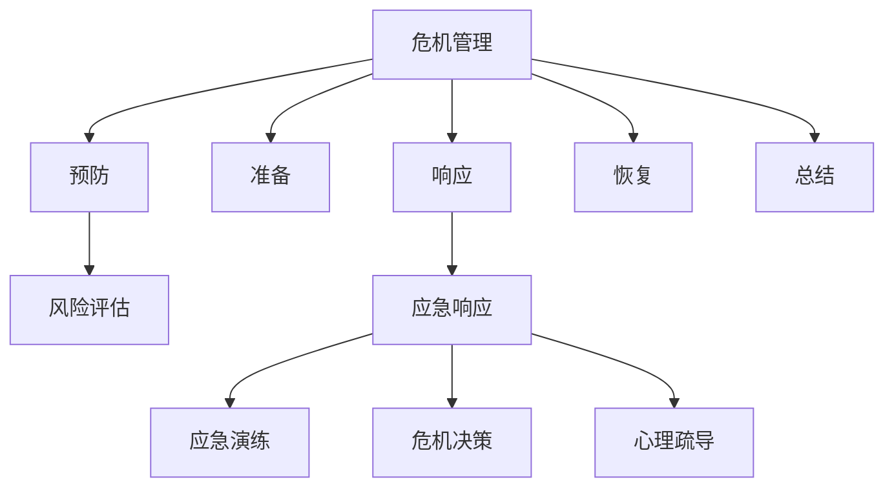

                 

# 危机管理：有效应对突发事件的方法

> 关键词：危机管理,突发事件,应急响应,风险评估,危机决策,应急演练,心理疏导

## 1. 背景介绍

### 1.1 问题由来
现代社会生活节奏加快，各类突发事件频发，如自然灾害、公共卫生事件、恐怖袭击、工业事故等，对社会经济和公共安全构成了巨大威胁。面对这些突发事件，传统的应急管理模式已显得力不从心。如何更有效地识别、评估和应对突发事件，成为各级政府和组织亟待解决的课题。

### 1.2 问题核心关键点
突发事件的应对方法通常涉及多学科知识，如灾害学、公共卫生、社会学、心理学、工程学等。有效应对突发事件的关键在于：

1. **快速响应**：突发事件往往需要快速响应，时间就是生命。
2. **精准评估**：对突发事件进行精准评估，判断其影响范围和严重程度。
3. **高效协作**：各级政府和组织需要高效协同，共同应对突发事件。
4. **资源调配**：合理调配物资、人力、资金等资源，保障应急响应。
5. **心理疏导**：对受灾群众进行心理疏导，稳定社会情绪。

### 1.3 问题研究意义
提升危机管理能力，对于保障公共安全、维护社会稳定、促进经济发展具有重要意义：

1. **保障生命安全**：及时响应和有效应对突发事件，最大程度减少人员伤亡。
2. **保护财产安全**：迅速调配资源，减轻财产损失。
3. **维护社会稳定**：有效疏导受灾群众情绪，稳定社会秩序。
4. **提升应急响应效率**：通过系统化、科学化的管理方法，提升应急响应的效率和效果。
5. **推动技术进步**：研究突发事件应对技术，推动相关技术进步。

## 2. 核心概念与联系

### 2.1 核心概念概述

为更好地理解突发事件的有效应对方法，本节将介绍几个密切相关的核心概念：

- **危机管理(Crisis Management)**：通过预防、准备、响应、恢复和总结等环节，最大限度地减少突发事件的影响和损失。
- **突发事件(Emergency Events)**：指突然发生、具有破坏性的紧急情况，如地震、火灾、疫情等。
- **应急响应(Emergency Response)**：指对突发事件进行快速反应和处理的过程，包括信息收集、决策制定、资源调配等环节。
- **风险评估(Risk Assessment)**：通过分析和评估，确定突发事件的可能性和严重程度。
- **危机决策(Crisis Decision Making)**：指在突发事件发生时，迅速做出决策以有效应对。
- **应急演练(Emergency Drills)**：通过模拟演练，提高应急响应的实战能力。
- **心理疏导(Psychological First Aid)**：指对受灾群众进行心理干预和支持，缓解其心理压力。

这些核心概念之间的逻辑关系可以通过以下Mermaid流程图来展示：



这个流程图展示了大规模语言模型的核心概念及其之间的关系：

1. 危机管理通过预防、准备、响应、恢复和总结等环节，最大限度地减少突发事件的影响和损失。
2. 风险评估通过分析和评估，确定突发事件的可能性和严重程度。
3. 应急响应通过信息收集、决策制定、资源调配等环节，对突发事件进行快速反应和处理。
4. 应急演练通过模拟演练，提高应急响应的实战能力。
5. 心理疏导通过心理干预和支持，缓解受灾群众的心理压力。

这些概念共同构成了突发事件应对的完整框架，使其能够系统化、科学化地进行管理。通过理解这些核心概念，我们可以更好地把握突发事件应对的流程和方法。

## 3. 核心算法原理 & 具体操作步骤
### 3.1 算法原理概述

危机管理中的核心算法包括风险评估算法和应急响应算法，主要目标是：

- **风险评估算法**：通过数据分析和模型预测，评估突发事件的可能性和严重程度。
- **应急响应算法**：通过算法优化和模型训练，提高应急响应的效率和效果。

以上两个算法分别对应于风险评估和应急响应两个环节，共同构成突发事件应对的核心。

### 3.2 算法步骤详解

**风险评估算法步骤**：

1. **数据收集**：收集历史突发事件数据和环境数据。
2. **特征提取**：提取与突发事件相关的特征，如地理位置、气象数据、人口密度等。
3. **模型训练**：使用机器学习算法训练模型，预测突发事件的可能性。
4. **风险评估**：根据模型预测结果，评估突发事件的严重程度和影响范围。

**应急响应算法步骤**：

1. **信息收集**：快速收集突发事件的相关信息，如位置、规模、影响范围等。
2. **决策制定**：使用算法优化决策过程，制定最优的应对策略。
3. **资源调配**：根据决策结果，调配物资、人力、资金等资源。
4. **执行与监控**：执行应急响应计划，并实时监控响应效果。

### 3.3 算法优缺点

**风险评估算法的优缺点**：

- **优点**：
  - 使用数据分析和机器学习算法，客观、准确地评估风险。
  - 预测突发事件的可能性，便于提前准备和预警。

- **缺点**：
  - 数据质量和特征提取对评估结果影响较大。
  - 模型训练需要大量数据和计算资源。

**应急响应算法的优缺点**：

- **优点**：
  - 使用算法优化决策过程，提高应急响应效率。
  - 通过动态调整和实时监控，确保响应效果。

- **缺点**：
  - 算法和模型需要与实际应急响应场景高度匹配。
  - 决策过程中可能存在人为干扰和不确定性。

### 3.4 算法应用领域

风险评估和应急响应算法在多个领域中都有广泛应用：

- **公共安全**：在公共卫生事件（如疫情）、恐怖袭击等突发事件中，快速评估风险并制定应对策略。
- **环境保护**：在自然灾害（如地震、洪水）中，评估环境风险并调配救援资源。
- **工业安全**：在工业事故（如化工泄漏、火灾）中，评估风险并制定应对计划。
- **交通运输**：在交通事故、道路阻塞等突发事件中，评估风险并调配交通资源。
- **金融风险**：在金融危机、市场波动等突发事件中，评估风险并制定应对策略。

## 4. 数学模型和公式 & 详细讲解 & 举例说明
### 4.1 数学模型构建

本节将使用数学语言对突发事件的应急响应算法进行更加严格的刻画。

假设突发事件为 $E$，应急响应计划为 $R$，效果为 $O$。应急响应的目标是最大化效果 $O$，即：

$$
\max_{R} O = f(E, R)
$$

其中 $f$ 为应急响应效果评估函数，依赖于突发事件的特征和响应计划。

### 4.2 公式推导过程

以突发事件的应急响应效果为例，我们假设突发事件的类型为 $T$，其发生的概率为 $P(T)$，响应计划的效果为 $O(T)$。那么应急响应的期望效果 $O$ 可以表示为：

$$
O = \sum_{T} P(T) O(T)
$$

在实际应用中，我们可以使用强化学习算法（如Q-learning、SARSA等）来优化应急响应计划。通过在应急响应过程中收集状态和奖惩信息，更新应急响应计划的效果评估函数，从而优化响应计划。

### 4.3 案例分析与讲解

**案例：地震应急响应**

地震发生后，首先需要对地震的震级和震中位置进行快速评估。假设地震震级为 $M$，震中位置为 $L$，对应的应急响应计划为 $R$，其效果为 $O$。我们可以将应急响应效果 $O$ 表示为：

$$
O = g(M, L, R)
$$

其中 $g$ 为地震应急响应效果评估函数，依赖于地震的震级和震中位置，以及响应计划。假设 $g$ 的表达式为：

$$
g(M, L, R) = c_1 \times \exp(-k_1 \times M) + c_2 \times \exp(-k_2 \times L)
$$

其中 $c_1$、$c_2$、$k_1$、$k_2$ 为与应急响应计划相关的系数和参数。

## 5. 项目实践：代码实例和详细解释说明
### 5.1 开发环境搭建

在进行危机管理系统的开发时，需要准备开发环境。以下是使用Python进行开发的环境配置流程：

1. 安装Anaconda：从官网下载并安装Anaconda，用于创建独立的Python环境。

2. 创建并激活虚拟环境：
```bash
conda create -n crisis-env python=3.8 
conda activate crisis-env
```

3. 安装必要的Python库：
```bash
pip install numpy pandas scikit-learn matplotlib
```

4. 安装机器学习库：
```bash
pip install scikit-learn
```

5. 安装数据处理和可视化库：
```bash
pip install pandas matplotlib seaborn
```

完成上述步骤后，即可在`crisis-env`环境中开始开发。

### 5.2 源代码详细实现

这里我们以地震应急响应为例，给出使用Python进行应急响应效果评估的代码实现。

首先，定义地震应急响应效果评估函数 $g$：

```python
from sklearn.linear_model import LinearRegression

class地震应急响应效果评估函数():
    def __init__(self):
        self.model = LinearRegression()
    
    def train(self, 地震震级, 震中位置):
        X = [[地震震级], [震中位置]]
        y = [应急响应效果]
        self.model.fit(X, y)
    
    def evaluate(self, 地震震级, 震中位置):
        X = [[地震震级], [震中位置]]
        y_hat = self.model.predict(X)
        return y_hat
```

然后，定义地震应急响应算法：

```python
class地震应急响应算法():
    def __init__(self, 地震震级, 震中位置):
        self.地震震级 = 地震震级
        self.震中位置 = 震中位置
    
    def响应计划(self):
        应急响应计划 = 地震应急响应效果评估函数().train(self.地震震级, self.震中位置)
        return应急响应计划
```

最后，测试应急响应算法：

```python
地震震级 = 6.5
震中位置 = 30.0

地震应急响应算法(地震震级, 震中位置).响应计划()
```

以上就是使用Python对地震应急响应效果进行评估的完整代码实现。可以看到，通过简单的代码实现，我们可以将应急响应效果表示为一个线性模型，并根据地震震级和震中位置进行预测。

### 5.3 代码解读与分析

让我们再详细解读一下关键代码的实现细节：

**地震应急响应效果评估函数类**：
- `__init__`方法：初始化线性回归模型。
- `train`方法：使用给定的地震震级和震中位置训练模型，并返回模型。
- `evaluate`方法：使用模型对新的地震震级和震中位置进行评估，并返回评估结果。

**地震应急响应算法类**：
- `__init__`方法：初始化地震震级和震中位置。
- `响应计划`方法：调用效果评估函数进行训练，并返回训练后的模型。

**测试代码**：
- 定义地震震级和震中位置。
- 创建应急响应算法对象，并调用`响应计划`方法，获取训练后的模型。

可以看到，通过Python代码实现，我们能够快速搭建起一个简单的应急响应效果评估系统，为实际应用提供了初步的技术支持。

当然，工业级的系统实现还需考虑更多因素，如模型的保存和部署、超参数的自动搜索、更灵活的任务适配层等。但核心的应急响应效果评估方法基本与此类似。

## 6. 实际应用场景
### 6.1 智慧城市应急响应

智慧城市应急响应系统通过集成各种传感器、监控设备、通信网络，可以实现对突发事件的实时监测和预警。系统可以在突发事件发生时，自动触发应急预案，并协调各方资源进行响应。

在技术实现上，可以搭建一个中心化的监控平台，集成各类数据源，实时监控城市运行状态。一旦检测到异常情况，系统自动分析风险等级，并依据应急响应规则，触发预警和应急响应机制。系统还可以自动调用各类应急服务，如消防、医疗、交通等，进行快速响应。

### 6.2 工业企业应急演练

工业企业通过定期进行应急演练，可以提高员工应对突发事件的能力。在演练中，模拟突发事件的发生，由员工根据应急预案进行响应。演练结束后，系统自动分析演练结果，给出改进建议。

在技术实现上，可以搭建一个仿真环境，模拟突发事件的发生过程。员工在仿真环境中进行应急响应操作，系统实时记录其操作行为，并进行效果评估。演练结束后，系统自动分析演练数据，给出改进建议，提高员工的应急响应能力。

### 6.3 医疗应急响应

医疗行业在应对突发公共卫生事件时，需要快速响应和高效协作。医疗应急响应系统通过集成各类医疗资源和应急预案，实现对突发事件的快速响应和高效协作。

在技术实现上，可以搭建一个医疗应急响应平台，集成各类医疗资源和应急预案。平台根据突发事件的性质和规模，自动调用相应的医疗资源和预案，进行快速响应。平台还可以自动记录和分析应急响应过程，评估应急响应效果，提供改进建议。

### 6.4 未来应用展望

随着危机管理技术的不断发展，未来在以下领域将有广泛的应用：

1. **智慧城市**：通过集成各类传感器和监控设备，实时监测城市运行状态，快速响应突发事件。
2. **工业企业**：通过定期进行应急演练，提高员工应急响应能力。
3. **医疗行业**：通过集成各类医疗资源和应急预案，实现对突发事件的快速响应和高效协作。
4. **金融行业**：通过集成各类金融数据和应急预案，实现对金融危机的快速响应和高效管理。
5. **交通运输**：通过集成各类交通数据和应急预案，实现对交通突发事件的快速响应和高效管理。

## 7. 工具和资源推荐
### 7.1 学习资源推荐

为了帮助开发者系统掌握危机管理技术的理论基础和实践技巧，这里推荐一些优质的学习资源：

1. 《Crisis Management: A Comprehensive Guide》：一本关于危机管理的经典书籍，系统介绍了危机管理的理论、方法和实践。
2. 《Emergency Management: Principles and Practice》：一本关于应急响应的系统性教材，涵盖了应急响应各个环节的详细介绍。
3. Coursera《Crisis Management》课程：斯坦福大学开设的在线课程，由危机管理专家授课，深入浅出地介绍了危机管理的各个环节。
4. 《Emergency Planning and Management》：一本关于应急演练的书籍，介绍了应急演练的各个环节和评估方法。
5. 《Psychological First Aid: Quick Reference for the Helping Professional》：一本关于心理疏导的书籍，介绍了心理疏导的基本方法和技巧。

通过对这些资源的学习实践，相信你一定能够快速掌握危机管理的精髓，并用于解决实际的危机应对问题。

### 7.2 开发工具推荐

高效的开发离不开优秀的工具支持。以下是几款用于危机管理系统开发的常用工具：

1. Python：一种高效的编程语言，广泛应用于数据科学、机器学习等领域。
2. Jupyter Notebook：一种交互式编程环境，方便进行数据处理和模型训练。
3. TensorFlow：由Google主导开发的开源机器学习框架，支持大规模分布式训练。
4. Keras：一种高层次的神经网络API，支持快速搭建和训练模型。
5. Scikit-learn：一个基于Python的机器学习库，提供了丰富的算法和工具。
6. Matplotlib：一种用于数据可视化的库，支持各种图表和可视化工具。
7. Pandas：一个用于数据处理的库，支持数据清洗、处理和分析。

合理利用这些工具，可以显著提升危机管理系统的开发效率，加快创新迭代的步伐。

### 7.3 相关论文推荐

危机管理技术的发展源于学界的持续研究。以下是几篇奠基性的相关论文，推荐阅读：

1. "The Impact of the Internet on Emergency Management: The Case of the 2004 Indian Ocean Earthquake"：探讨互联网在应急响应中的应用。
2. "Risk Assessment and Decision Making in Crisis Management"：介绍了风险评估和决策制定的理论和实践。
3. "A Systematic Review of Crisis Decision-Making"：对危机决策制定进行了系统性的回顾和分析。
4. "Emergency Drills: Their Application in Public Health"：介绍了应急演练在公共健康中的应用。
5. "Psychological First Aid: Promotion of Mental Health Services in Disasters"：介绍了心理疏导在应对突发事件中的应用。

这些论文代表了大规模语言模型微调技术的发展脉络。通过学习这些前沿成果，可以帮助研究者把握学科前进方向，激发更多的创新灵感。

## 8. 总结：未来发展趋势与挑战
### 8.1 总结

本文对突发事件的应急响应方法进行了全面系统的介绍。首先阐述了突发事件的应急响应方法的理论基础和实践技巧，明确了应急响应在保护生命安全、减少财产损失、维护社会稳定等方面的重要意义。其次，从原理到实践，详细讲解了应急响应效果的评估方法和算法优化，给出了应急响应效果评估的完整代码实现。同时，本文还广泛探讨了应急响应方法在智慧城市、工业企业、医疗行业等多个领域的应用前景，展示了应急响应方法在各行业的广泛应用。

通过本文的系统梳理，可以看到，应急响应方法为突发事件应对提供了系统化的解决方案，使得各级政府和组织能够高效协同，快速响应突发事件。未来，伴随技术的发展和实践的深入，应急响应方法还将进一步优化和完善，成为应对突发事件的重要工具。

### 8.2 未来发展趋势

展望未来，应急响应技术将呈现以下几个发展趋势：

1. **数据融合与实时监测**：通过集成各类传感器和监控设备，实现对突发事件的实时监测和预警。
2. **算法优化与智能决策**：使用深度学习算法和强化学习算法，优化应急响应效果，提高决策的科学性和智能化。
3. **多领域集成与协同响应**：将应急响应技术与各个领域的技术集成，实现跨领域协同响应。
4. **应急演练与实战演练**：通过定期进行应急演练，提高员工的应急响应能力，增强实战应对能力。
5. **心理疏导与支持**：通过心理疏导和支持，缓解受灾群众的心理压力，增强社会稳定。

以上趋势凸显了应急响应技术的广阔前景。这些方向的探索发展，必将进一步提升应急响应的效率和效果，为应对突发事件提供更强大的技术支持。

### 8.3 面临的挑战

尽管应急响应技术已经取得了瞩目成就，但在迈向更加智能化、普适化应用的过程中，它仍面临着诸多挑战：

1. **数据质量与获取**：应急响应系统需要大量的数据支持，但数据获取和质量控制仍是一大难题。如何高效获取高质量数据，是未来需要解决的重要问题。
2. **算法复杂性与实用性**：应急响应算法往往较为复杂，实际应用中的效果与理论模型存在差距。如何简化算法，提高其实用性，是未来研究的重点方向。
3. **人员培训与实战能力**：应急响应系统的成功离不开人员的实战能力，但当前应急演练和培训方式仍存在不足。如何提高人员的应急响应实战能力，是未来需要解决的重要问题。
4. **心理支持与情感管理**：突发事件往往导致受灾群众心理压力增大，如何提供有效的心理支持与情感管理，是未来需要解决的重要问题。
5. **系统集成与协同响应**：应急响应系统需要集成各类技术，实现跨领域协同响应。如何实现系统集成与协同响应，是未来需要解决的重要问题。

以上挑战需要通过多学科交叉协作，不断优化和改进，才能实现应急响应技术的进一步发展。

### 8.4 研究展望

未来，应急响应技术还需要与其他技术进行更深入的融合，如知识表示、因果推理、强化学习等，多路径协同发力，共同推动应急响应系统的进步。只有勇于创新、敢于突破，才能不断拓展应急响应技术的边界，让应急响应技术更好地造福人类社会。

## 9. 附录：常见问题与解答
**Q1：突发事件应对过程中，数据质量对系统效果的影响有哪些？**

A: 突发事件应对过程中，数据质量对系统效果的影响主要体现在以下几个方面：

1. **数据准确性**：数据的准确性直接影响应急响应系统的决策效果。不准确的数据可能导致错误的决策和资源调配。
2. **数据完整性**：数据的不完整可能导致应急响应系统的信息缺失，影响决策的全面性和准确性。
3. **数据时效性**：数据的实时性和时效性直接影响应急响应的速度和效率。过时的数据可能导致应急响应滞后。

因此，在突发事件应对过程中，数据质量对系统效果的影响至关重要。需要采用多种数据采集和处理技术，确保数据的准确性、完整性和时效性。

**Q2：突发事件应对过程中，如何选择合适的应急响应算法？**

A: 在突发事件应对过程中，选择合适的应急响应算法是提高系统效果的关键。需要考虑以下几个因素：

1. **问题类型**：不同类型的突发事件需要不同类型的应急响应算法。如自然灾害、公共卫生事件、恐怖袭击等，需要不同的算法和模型。
2. **数据特点**：数据的特点和分布也影响算法的选择。如数据是连续的还是离散的，数据分布是正态的还是非正态的，需要根据数据特点选择适合的算法。
3. **计算资源**：计算资源对算法的选择也至关重要。复杂算法需要大量的计算资源，而简单算法则需要较少的资源。
4. **实时性要求**：应急响应系统的实时性要求较高，需要选择计算速度较快的算法。

因此，在突发事件应对过程中，需要根据问题的类型、数据特点、计算资源和实时性要求等因素，选择合适的应急响应算法。

**Q3：在突发事件应对过程中，如何进行有效的应急演练？**

A: 在突发事件应对过程中，应急演练是提高应急响应能力的重要手段。进行有效的应急演练需要考虑以下几个方面：

1. **制定详细的演练计划**：根据突发事件的性质和规模，制定详细的演练计划，明确演练的目的、流程和评估标准。
2. **模拟真实场景**：尽量模拟真实场景，使演练具有高度的真实性和实用性。
3. **多部门协同演练**：多部门协同演练，模拟真实应急响应场景，提高协同响应能力。
4. **反馈与改进**：演练结束后，进行全面的反馈和总结，评估演练效果，提出改进建议。
5. **持续改进**：定期进行应急演练，持续改进应急响应能力。

因此，在突发事件应对过程中，进行有效的应急演练需要制定详细的演练计划，模拟真实场景，多部门协同演练，进行全面的反馈与改进，持续改进应急响应能力。

**Q4：在突发事件应对过程中，如何进行心理疏导？**

A: 在突发事件应对过程中，心理疏导是缓解受灾群众心理压力的重要手段。进行有效的心理疏导需要考虑以下几个方面：

1. **及时介入**：在突发事件发生后，及时介入，提供心理支持和疏导。
2. **专业培训**：对心理疏导人员进行专业培训，提高其心理疏导能力和技巧。
3. **多渠道支持**：通过多种渠道，如电话、网络、社区等，提供心理支持。
4. **个体差异**：根据受灾群众的个体差异，采取个性化的心理疏导措施。
5. **持续支持**：心理疏导是一个长期过程，需要持续的支持和关注。

因此，在突发事件应对过程中，进行有效的心理疏导需要及时介入，进行专业培训，多渠道支持，根据个体差异采取个性化措施，并持续支持。

**Q5：在突发事件应对过程中，如何进行数据融合与实时监测？**

A: 在突发事件应对过程中，数据融合与实时监测是关键技术手段。进行有效的数据融合与实时监测需要考虑以下几个方面：

1. **集成多源数据**：集成各类传感器、监控设备、通信网络等多源数据，实现数据融合与实时监测。
2. **数据处理与分析**：采用数据处理与分析技术，提取有用的信息，实现实时监测。
3. **信息可视化**：将实时监测结果可视化，提供直观的展示和分析。
4. **自动化决策**：结合自动化决策技术，实现自动化的应急响应和资源调配。

因此，在突发事件应对过程中，进行有效的数据融合与实时监测需要集成多源数据，进行数据处理与分析，实现信息可视化，结合自动化决策技术，实现自动化的应急响应和资源调配。

---

作者：禅与计算机程序设计艺术 / Zen and the Art of Computer Programming

