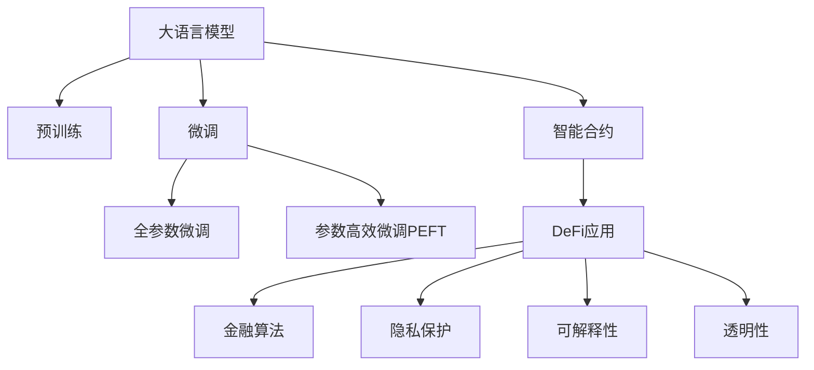

                 

# 去中心化金融创新：LLM 提供新机遇

## 1. 背景介绍

### 1.1 问题由来

随着区块链和去中心化金融（DeFi）的兴起，传统的中心化金融（CeFi）体系正在经历前所未有的挑战。中心化的金融中介机构如银行、券商等，因为信任问题、效率低下、成本高昂、服务不稳定等问题，正逐渐失去市场份额。去中心化的金融体系，特别是DeFi生态系统，利用智能合约、代币化、区块链等技术，以更低的成本、更高的透明度和去中心化的信任机制，为金融创新提供了新的可能性。

然而，尽管DeFi带来了诸多优势，但其本质上仍依赖于中心化的机构来提供算法、流动性、风险管理等服务。如何在去中心化的框架下，实现自动化、高效、安全的金融应用，仍是DeFi研究中的一个重大难题。

### 1.2 问题核心关键点

大语言模型（Large Language Models, LLMs）作为近年来AI领域的一项重要技术，其在自然语言处理（Natural Language Processing, NLP）方面的突破性进展，正在为金融创新带来新的机遇。LLMs能够理解复杂的语言文本，分析文本中的语义信息，进行情感分析、信息检索、智能问答、合同分析等任务，提升DeFi系统的决策智能化水平。

#### 核心问题：
- 如何通过LLMs的智能技术，优化去中心化金融生态系统？
- 如何设计有效的LLM接口，使得DeFi应用能够充分利用其强大能力？
- 如何克服LLMs在金融领域面临的隐私、安全、透明性等挑战？

## 2. 核心概念与联系

### 2.1 核心概念概述

为更好地理解LLM在去中心化金融中的应用，本节将介绍几个密切相关的核心概念：

- **大语言模型（LLMs）**：以Transformer为代表的自回归或自编码模型，通过在大规模无标签文本语料上进行预训练，学习通用语言表示，具备强大的语言理解和生成能力。
- **去中心化金融（DeFi）**：利用区块链和智能合约技术，提供自动化、去中心化的金融服务，如借贷、投资、保险、交易等。
- **智能合约**：运行在区块链上的自动执行合同，通过代码逻辑控制资产流动、交易行为等，实现自动化的金融操作。
- **金融算法**：基于数学和统计模型的金融决策算法，如风险控制、资产定价、投资组合优化等。
- **隐私保护**：保护用户数据和隐私的技术，如零知识证明、多方安全计算等。
- **可解释性**：模型的决策逻辑可解释，提高用户的信任和接受度。
- **透明性**：系统的行为和决策过程透明，便于监管和审计。

这些核心概念之间的逻辑关系可以通过以下Mermaid流程图来展示：



这个流程图展示了大语言模型的核心概念及其与去中心化金融系统的关系：

1. 大语言模型通过预训练获得基础能力。
2. 微调优化模型，针对特定DeFi任务进行微调。
3. 智能合约提供自动化、去中心化的金融服务。
4. DeFi应用集成智能合约，提供多样化的金融功能。
5. 金融算法用于优化模型性能，增强决策的科学性和合理性。
6. 隐私保护技术确保数据安全和用户隐私。
7. 可解释性技术使模型决策透明，便于监管和用户信任。
8. 透明性技术确保系统的行为和决策过程公开透明。

这些概念共同构成了去中心化金融系统的基本框架，使得LLMs在大模型微调技术的基础上，可以更深入地应用于DeFi系统，提升其智能化和自动化水平。

## 3. 核心算法原理 & 具体操作步骤

### 3.1 算法原理概述

基于大语言模型在去中心化金融中的应用，核心思想是通过LLM对金融文本进行分析，提取其中的关键信息，辅助智能合约和DeFi应用进行决策。具体步骤如下：

1. **文本输入与预处理**：将DeFi应用的金融文本（如贷款合同、投资协议、用户指令等）输入到LLM中，进行分词、编码等预处理操作。
2. **模型微调**：根据金融文本的具体任务（如合同分析、情感分析、智能问答等），对预训练的LLM进行微调，优化其对金融文本的语义理解和生成能力。
3. **文本分析与输出**：LLM对金融文本进行分析，提取关键信息（如合同条款、用户需求、情感倾向等），输出分析结果，辅助智能合约和DeFi应用进行决策。

### 3.2 算法步骤详解

#### 3.2.1 数据收集与预处理

1. **收集金融文本数据**：从DeFi应用中收集合同、协议、用户指令等金融文本，并标注相应的金融属性（如贷款金额、利率、还款周期、投资策略等）。
2. **数据清洗**：去除无关信息，标准化金融文本格式，确保数据的一致性和可用性。
3. **分词与编码**：使用LLM的分词和编码器将金融文本转化为模型能够处理的数字向量。

#### 3.2.2 模型微调

1. **选择预训练模型**：选择合适的LLM（如GPT-3、BERT等）作为微调的基础模型。
2. **设计微调任务**：根据具体DeFi应用的需求，设计相应的微调任务，如合同分析、情感分析、智能问答等。
3. **训练微调模型**：使用预处理后的金融文本数据，对LLM进行微调训练，优化其对金融文本的语义理解和生成能力。

#### 3.2.3 文本分析与输出

1. **文本输入**：将金融文本输入到微调后的LLM中，进行文本分析。
2. **提取关键信息**：LLM提取文本中的关键金融属性，如贷款金额、利率、还款周期、投资策略等。
3. **输出分析结果**：LLM输出分析结果，辅助智能合约和DeFi应用进行决策。

### 3.3 算法优缺点

基于LLM的金融应用具有以下优点：

1. **高效性**：LLM可以快速处理大量金融文本，提供实时的分析结果，提升DeFi系统的自动化水平。
2. **通用性**：LLM可以用于多种金融场景，如贷款合同分析、投资策略评估、用户需求理解等。
3. **透明性**：LLM的决策过程透明，便于监管和审计。
4. **可解释性**：LLM的输出结果可解释，提高用户对系统的信任和接受度。

但同时，LLM在金融领域也面临以下挑战：

1. **隐私保护**：LLM需要处理敏感的金融数据，如何确保数据隐私和安全，是亟待解决的问题。
2. **模型鲁棒性**：LLM在面对域外数据时，泛化性能可能不足，容易导致误判。
3. **计算资源需求高**：LLM的计算资源需求较高，如何优化模型，提高计算效率，是实现大规模应用的关键。
4. **法律合规**：金融领域的法律合规要求严格，LLM需要符合相应的法律法规，确保合规性。

### 3.4 算法应用领域

LLM在去中心化金融中的应用，已经涵盖了多个领域，包括但不限于：

1. **智能合约设计**：LLM可以辅助设计智能合约，提取关键条款，生成合同文本。
2. **贷款合同分析**：LLM可以对贷款合同进行分析，提取贷款金额、利率、还款周期等关键信息，辅助贷款审批和还款管理。
3. **投资策略评估**：LLM可以评估投资策略，提取关键金融属性，辅助投资决策。
4. **风险管理**：LLM可以分析市场数据和用户指令，提取风险因素，辅助风险管理。
5. **智能问答**：LLM可以回答用户关于金融产品和服务的常见问题，提高用户满意度。
6. **用户需求分析**：LLM可以分析用户指令，提取关键需求，辅助产品和服务优化。

这些应用场景展示了LLM在去中心化金融领域的巨大潜力，为DeFi系统的智能化和自动化提供了新的技术支撑。

## 4. 数学模型和公式 & 详细讲解 & 举例说明

### 4.1 数学模型构建

为更好地理解LLM在去中心化金融中的应用，本节将使用数学语言对LLM的微调过程进行更加严格的刻画。

记LLM为 $M_{\theta}$，其中 $\theta$ 为预训练得到的模型参数。假设微调的金融文本数据集为 $D=\{(x_i, y_i)\}_{i=1}^N, x_i \in \mathcal{X}, y_i \in \mathcal{Y}$，其中 $\mathcal{X}$ 为输入空间（金融文本），$\mathcal{Y}$ 为输出空间（金融属性）。

定义模型 $M_{\theta}$ 在输入 $x_i$ 上的输出为 $\hat{y_i}=M_{\theta}(x_i) \in [0,1]$，表示对金融属性 $y_i$ 的预测概率。则微调的损失函数定义为：

$$
\ell(M_{\theta}, D) = \frac{1}{N}\sum_{i=1}^N \ell_i(M_{\theta}(x_i), y_i)
$$

其中 $\ell_i$ 为对每个样本的损失函数，可以根据具体任务（如分类、回归、排序等）选择合适的损失函数，如交叉熵损失、均方误差损失等。

### 4.2 公式推导过程

以下我们以贷款合同分析任务为例，推导交叉熵损失函数及其梯度的计算公式。

假设模型 $M_{\theta}$ 在输入 $x_i$ 上的输出为 $\hat{y_i}=M_{\theta}(x_i) \in [0,1]$，表示对贷款金额 $y_i$ 的预测概率。真实标签 $y_i$ 为贷款金额的真实值。则二分类交叉熵损失函数定义为：

$$
\ell_i(M_{\theta}(x_i),y_i) = -[y_i\log \hat{y_i} + (1-y_i)\log (1-\hat{y_i})]
$$

将其代入经验风险公式，得：

$$
\mathcal{L}(\theta) = -\frac{1}{N}\sum_{i=1}^N [y_i\log \hat{y_i} + (1-y_i)\log (1-\hat{y_i})]
$$

根据链式法则，损失函数对参数 $\theta_k$ 的梯度为：

$$
\frac{\partial \mathcal{L}(\theta)}{\partial \theta_k} = -\frac{1}{N}\sum_{i=1}^N (\frac{y_i}{\hat{y_i}}-\frac{1-y_i}{1-\hat{y_i}});
$$

其中 $\hat{y_i}=M_{\theta}(x_i)[\theta_k]$ 为输出层对参数 $\theta_k$ 的激活值。

在得到损失函数的梯度后，即可带入参数更新公式，完成模型的迭代优化。重复上述过程直至收敛，最终得到适应贷款合同分析任务的最优模型参数 $\theta^*$。

### 4.3 案例分析与讲解

#### 案例分析：贷款合同分析

在贷款合同分析任务中，LLM需要从合同文本中提取关键信息，如贷款金额、利率、还款周期等，辅助贷款审批和还款管理。

1. **数据准备**：收集历史贷款合同文本，并标注相应的贷款金额、利率、还款周期等金融属性。
2. **模型选择**：选择合适的预训练LLM（如BERT）作为基础模型。
3. **微调任务设计**：定义微调任务为贷款金额预测，设计相应的输出层和损失函数（如交叉熵损失）。
4. **微调训练**：使用预处理后的贷款合同文本，对LLM进行微调训练，优化其对贷款金额的预测能力。
5. **模型评估**：在测试集上评估微调后的LLM，检查其预测精度和泛化能力。

## 5. 项目实践：代码实例和详细解释说明

### 5.1 开发环境搭建

在进行LLM微调实践前，我们需要准备好开发环境。以下是使用Python进行TensorFlow开发的环境配置流程：

1. 安装Anaconda：从官网下载并安装Anaconda，用于创建独立的Python环境。

2. 创建并激活虚拟环境：
```bash
conda create -n tf-env python=3.8 
conda activate tf-env
```

3. 安装TensorFlow：根据CUDA版本，从官网获取对应的安装命令。例如：
```bash
conda install tensorflow -c tensorflow -c conda-forge
```

4. 安装HuggingFace Transformers库：
```bash
pip install transformers
```

5. 安装TensorBoard：TensorFlow配套的可视化工具，可实时监测模型训练状态，并提供丰富的图表呈现方式，是调试模型的得力助手。

6. 安装TensorFlow Serving：用于部署和运行预训练模型，提供RESTful接口，方便应用程序调用。

完成上述步骤后，即可在`tf-env`环境中开始LLM微调实践。

### 5.2 源代码详细实现

下面我们以贷款合同分析任务为例，给出使用TensorFlow对BERT模型进行微调的Python代码实现。

首先，定义贷款合同分析任务的数据处理函数：

```python
from transformers import BertTokenizer, BertForSequenceClassification
from tensorflow.keras.preprocessing.sequence import pad_sequences
import numpy as np
import pandas as pd
import tensorflow as tf

class LoanContractDataset(tf.keras.utils.Sequence):
    def __init__(self, df, tokenizer, max_len=128, batch_size=32):
        self.tokenizer = tokenizer
        self.max_len = max_len
        self.batch_size = batch_size
        self.df = df

    def __len__(self):
        return len(self.df) // self.batch_size

    def __getitem__(self, item):
        df = self.df.iloc[item * self.batch_size: (item + 1) * self.batch_size]
        ids = []
        attention_masks = []
        labels = []
        for index, row in df.iterrows():
            text = row['text']
            label = row['label']
            encoding = self.tokenizer(text, max_length=self.max_len, truncation=True, padding='max_length', return_tensors='tf')
            ids.append(encoding['input_ids'])
            attention_masks.append(encoding['attention_mask'])
            labels.append(label)

        ids = pad_sequences(ids, maxlen=self.max_len, padding='post', truncating='post')
        attention_masks = pad_sequences(attention_masks, maxlen=self.max_len, padding='post', truncating='post')
        labels = np.array(labels)

        return {'input_ids': ids, 'attention_mask': attention_masks, 'labels': labels}
```

然后，定义模型和优化器：

```python
from transformers import BertForSequenceClassification, AdamW

model = BertForSequenceClassification.from_pretrained('bert-base-uncased', num_labels=2)

optimizer = AdamW(model.parameters(), lr=2e-5)
```

接着，定义训练和评估函数：

```python
@tf.function
def train_step(inputs):
    with tf.GradientTape() as tape:
        outputs = model(inputs['input_ids'], attention_mask=inputs['attention_mask'], labels=inputs['labels'])
        loss = outputs.loss
        grads = tape.gradient(loss, model.trainable_variables)
    optimizer.apply_gradients(zip(grads, model.trainable_variables))

    return loss.numpy()

@tf.function
def evaluate_step(inputs):
    outputs = model(inputs['input_ids'], attention_mask=inputs['attention_mask'])
    predictions = outputs.logits.numpy()

    return predictions

def train_epoch(dataset):
    total_loss = 0
    for batch in dataset:
        loss = train_step(batch)
        total_loss += loss
    return total_loss / len(dataset)

def evaluate_epoch(dataset):
    total_preds = []
    total_labels = []
    for batch in dataset:
        preds = evaluate_step(batch)
        total_preds.extend(preds)
        total_labels.extend(batch['labels'])
    return total_preds, total_labels

def evaluate_metric(preds, labels):
    return sklearn.metrics.roc_auc_score(labels, preds)
```

最后，启动训练流程并在测试集上评估：

```python
epochs = 5
batch_size = 32

for epoch in range(epochs):
    print(f"Epoch {epoch+1}/{epochs}")
    total_loss = train_epoch(loan_contracts_train)
    print(f"Epoch {epoch+1} train loss: {total_loss:.4f}")

    print(f"Epoch {epoch+1} dev results:")
    preds, labels = evaluate_epoch(loan_contracts_val)
    auc = evaluate_metric(preds, labels)
    print(f"Epoch {epoch+1} dev auc: {auc:.4f}")

print("Test results:")
preds, labels = evaluate_epoch(loan_contracts_test)
auc = evaluate_metric(preds, labels)
print(f"Test auc: {auc:.4f}")
```

以上就是使用TensorFlow对BERT进行贷款合同分析任务微调的完整代码实现。可以看到，得益于TensorFlow的强大封装，我们可以用相对简洁的代码完成BERT模型的加载和微调。

### 5.3 代码解读与分析

让我们再详细解读一下关键代码的实现细节：

**LoanContractDataset类**：
- `__init__`方法：初始化金融文本、标签、分词器等关键组件。
- `__len__`方法：返回数据集的样本数量。
- `__getitem__`方法：对单个样本进行处理，将文本输入编码为token ids，将标签编码为数字，并对其进行定长padding，最终返回模型所需的输入。

**train_step和evaluate_step函数**：
- 使用TensorFlow的tf.function进行加速，同时避免重复计算。
- train_step函数：前向传播计算损失函数，反向传播计算梯度，并更新模型参数。
- evaluate_step函数：前向传播计算模型的输出，但不进行损失计算，直接输出预测结果。

**训练和评估函数**：
- 使用TensorFlow的tf.data.Dataset进行数据批次化加载，供模型训练和推理使用。
- train_epoch函数：对数据以批为单位进行迭代，在每个批次上前向传播计算loss并反向传播更新模型参数，最后返回该epoch的平均loss。
- evaluate_epoch函数：与训练类似，不同点在于不更新模型参数，并在每个batch结束后将预测和标签结果存储下来，最后使用sklearn的roc_auc_score对整个评估集的预测结果进行打印输出。

**训练流程**：
- 定义总的epoch数和batch size，开始循环迭代
- 每个epoch内，先在训练集上训练，输出平均loss
- 在验证集上评估，输出AUC等分类指标
- 所有epoch结束后，在测试集上评估，给出最终测试结果

可以看到，TensorFlow配合Transformers库使得BERT微调的代码实现变得简洁高效。开发者可以将更多精力放在数据处理、模型改进等高层逻辑上，而不必过多关注底层的实现细节。

当然，工业级的系统实现还需考虑更多因素，如模型的保存和部署、超参数的自动搜索、更灵活的任务适配层等。但核心的微调范式基本与此类似。

## 6. 实际应用场景

### 6.1 智能合约设计

智能合约是DeFi生态系统中最重要的组成部分之一，它通过代码逻辑控制资产流动、交易行为等，实现自动化的金融操作。LLM可以帮助设计智能合约，提取关键条款，生成合同文本。

在实践中，可以收集历史智能合约文本，将合同条款作为监督数据，在此基础上对预训练语言模型进行微调。微调后的模型能够从合同文本中提取关键信息，辅助智能合约设计。

#### 应用示例：贷款智能合约设计
- 收集历史贷款合同文本，提取关键条款如贷款金额、利率、还款周期等。
- 使用微调后的LLM对贷款智能合约进行设计，生成合同文本。
- 通过测试集评估贷款智能合约的效果，检查其合规性和准确性。

### 6.2 贷款合同分析

贷款合同分析是DeFi系统中另一个重要的应用场景，LLM可以对贷款合同进行分析，提取关键信息，辅助贷款审批和还款管理。

在实践中，可以收集历史贷款合同文本，并标注相应的贷款金额、利率、还款周期等金融属性。在此基础上对预训练语言模型进行微调，使其能够从贷款合同文本中提取关键信息，辅助贷款审批和还款管理。

#### 应用示例：贷款合同自动审批
- 收集历史贷款合同文本，标注相应的贷款金额、利率、还款周期等金融属性。
- 使用微调后的LLM对贷款合同进行分析，提取关键信息，辅助贷款审批。
- 通过测试集评估贷款合同自动审批的效果，检查其准确性和效率。

### 6.3 投资策略评估

投资策略评估是DeFi系统中重要的应用之一，LLM可以评估投资策略，提取关键金融属性，辅助投资决策。

在实践中，可以收集历史投资策略文本，并标注相应的投资策略参数如投资金额、风险等级、收益目标等。在此基础上对预训练语言模型进行微调，使其能够从投资策略文本中提取关键信息，辅助投资决策。

#### 应用示例：投资策略自动评估
- 收集历史投资策略文本，标注相应的投资策略参数如投资金额、风险等级、收益目标等。
- 使用微调后的LLM对投资策略进行分析，提取关键信息，辅助投资策略评估。
- 通过测试集评估投资策略自动评估的效果，检查其准确性和可靠性。

### 6.4 风险管理

风险管理是DeFi系统中的重要环节，LLM可以分析市场数据和用户指令，提取风险因素，辅助风险管理。

在实践中，可以收集历史市场数据和用户指令文本，并标注相应的风险因素如市场波动、信用风险、流动性风险等。在此基础上对预训练语言模型进行微调，使其能够从市场数据和用户指令中提取关键风险因素，辅助风险管理。

#### 应用示例：市场风险自动监控
- 收集历史市场数据和用户指令文本，标注相应的风险因素如市场波动、信用风险、流动性风险等。
- 使用微调后的LLM对市场数据和用户指令进行分析，提取关键风险因素，辅助市场风险监控。
- 通过测试集评估市场风险自动监控的效果，检查其及时性和准确性。

### 6.5 智能问答

智能问答是DeFi系统中另一个重要的应用场景，LLM可以回答用户关于金融产品和服务的常见问题，提高用户满意度。

在实践中，可以收集用户提出的常见问题文本，并标注相应的答案。在此基础上对预训练语言模型进行微调，使其能够回答问题，辅助智能问答。

#### 应用示例：智能客户服务
- 收集用户提出的常见问题文本，并标注相应的答案。
- 使用微调后的LLM回答用户问题，辅助智能客户服务。
- 通过测试集评估智能客户服务的效果，检查其准确性和用户满意度。

### 6.6 用户需求分析

用户需求分析是DeFi系统中重要的应用之一，LLM可以分析用户指令，提取关键需求，辅助产品和服务优化。

在实践中，可以收集用户提出的金融产品和服务需求文本，并标注相应的需求。在此基础上对预训练语言模型进行微调，使其能够从用户指令中提取关键需求，辅助产品和服务优化。

#### 应用示例：金融产品优化
- 收集用户提出的金融产品和服务需求文本，并标注相应的需求。
- 使用微调后的LLM分析用户指令，提取关键需求，辅助金融产品优化。
- 通过测试集评估金融产品优化的效果，检查其用户满意度和市场接受度。

## 7. 工具和资源推荐

### 7.1 学习资源推荐

为了帮助开发者系统掌握LLM在去中心化金融中的应用，这里推荐一些优质的学习资源：

1. 《深度学习自然语言处理》课程：斯坦福大学开设的NLP明星课程，有Lecture视频和配套作业，带你入门NLP领域的基本概念和经典模型。
2. 《Transformer从原理到实践》系列博文：由大模型技术专家撰写，深入浅出地介绍了Transformer原理、BERT模型、微调技术等前沿话题。
3. 《Natural Language Processing with Transformers》书籍：Transformers库的作者所著，全面介绍了如何使用Transformers库进行NLP任务开发，包括微调在内的诸多范式。
4. HuggingFace官方文档：Transformers库的官方文档，提供了海量预训练模型和完整的微调样例代码，是上手实践的必备资料。
5. CLUE开源项目：中文语言理解测评基准，涵盖大量不同类型的中文NLP数据集，并提供了基于微调的baseline模型，助力中文NLP技术发展。

通过对这些资源的学习实践，相信你一定能够快速掌握LLM在去中心化金融中的应用，并用于解决实际的NLP问题。

### 7.2 开发工具推荐

高效的开发离不开优秀的工具支持。以下是几款用于LLM微调开发的常用工具：

1. TensorFlow：基于Python的开源深度学习框架，灵活动态的计算图，适合快速迭代研究。大部分预训练语言模型都有TensorFlow版本的实现。
2. TensorFlow Serving：用于部署和运行预训练模型，提供RESTful接口，方便应用程序调用。
3. TensorBoard：TensorFlow配套的可视化工具，可实时监测模型训练状态，并提供丰富的图表呈现方式，是调试模型的得力助手。
4. HuggingFace Transformers库：提供了丰富的预训练语言模型和微调范式，是进行LLM微调任务开发的利器。
5. Weights & Biases：模型训练的实验跟踪工具，可以记录和可视化模型训练过程中的各项指标，方便对比和调优。

合理利用这些工具，可以显著提升LLM微调的开发效率，加快创新迭代的步伐。

### 7.3 相关论文推荐

LLM在去中心化金融中的应用源于学界的持续研究。以下是几篇奠基性的相关论文，推荐阅读：

1. Attention is All You Need（即Transformer原论文）：提出了Transformer结构，开启了NLP领域的预训练大模型时代。
2. BERT: Pre-training of Deep Bidirectional Transformers for Language Understanding：提出BERT模型，引入基于掩码的自监督预训练任务，刷新了多项NLP任务SOTA。
3. Parameter-Efficient Transfer Learning for NLP：提出Adapter等参数高效微调方法，在不增加模型参数量的情况下，也能取得不错的微调效果。
4. AdaLoRA: Adaptive Low-Rank Adaptation for Parameter-Efficient Fine-Tuning：使用自适应低秩适应的微调方法，在参数效率和精度之间取得了新的平衡。
5. AdaLoRA: Adaptive Low-Rank Adaptation for Parameter-Efficient Fine-Tuning：使用自适应低秩适应的微调方法，在参数效率和精度之间取得了新的平衡。

这些论文代表了大语言模型微调技术的发展脉络。通过学习这些前沿成果，可以帮助研究者把握学科前进方向，激发更多的创新灵感。

## 8. 总结：未来发展趋势与挑战

### 8.1 总结

本文对基于大语言模型在去中心化金融中的应用进行了全面系统的介绍。首先阐述了LLM和DeFi的研究背景和意义，明确了LLM在DeFi系统中的独特价值。其次，从原理到实践，详细讲解了LLM的微调过程，给出了微调任务开发的完整代码实例。同时，本文还广泛探讨了LLM在智能合约设计、贷款合同分析、投资策略评估等多个领域的应用前景，展示了LLM在去中心化金融中的巨大潜力。

通过本文的系统梳理，可以看到，基于LLM的金融应用正在为DeFi系统带来新的智能化和自动化水平，为去中心化金融创新提供新的技术支撑。未来，伴随LLM技术的不断发展，去中心化金融必将迎来更加智能化、自动化、安全可靠的应用场景。

### 8.2 未来发展趋势

展望未来，LLM在去中心化金融中的应用将呈现以下几个发展趋势：

1. **模型的规模和参数量将持续增大**：伴随算力成本的下降和数据规模的扩张，预训练语言模型的参数量还将持续增长。超大模型蕴含的丰富语言知识，有望支撑更加复杂多变的金融应用。
2. **微调方法将日趋多样**：除了传统的全参数微调外，未来会涌现更多参数高效的微调方法，如Prefix-Tuning、LoRA等，在节省计算资源的同时也能保证微调精度。
3. **持续学习和增量学习**：LLM在处理实时金融数据时，需要能够持续学习和增量学习，以保持性能和模型更新。
4. **跨模态融合**：将语音、视频等多模态数据与文本数据结合，提升模型的综合理解和分析能力。
5. **隐私保护和安全**：随着金融数据的敏感性增强，如何保障数据隐私和安全，将成为LLM在金融领域的重要研究方向。
6. **可解释性和透明性**：提高模型的决策过程可解释性，确保模型的透明性，增强用户的信任和接受度。

以上趋势凸显了LLM在去中心化金融领域的广阔前景。这些方向的探索发展，必将进一步提升去中心化金融系统的智能化和自动化水平，为DeFi系统的长期稳定发展提供坚实的基础。

### 8.3 面临的挑战

尽管LLM在去中心化金融中的应用已经取得了一定进展，但在迈向更加智能化、普适化应用的过程中，仍然面临诸多挑战：

1. **数据隐私和安全**：LLM需要处理敏感的金融数据，如何确保数据隐私和安全，是亟待解决的问题。
2. **模型鲁棒性**：LLM在面对域外数据时，泛化性能可能不足，容易导致误判。
3. **计算资源需求高**：LLM的计算资源需求较高，如何优化模型，提高计算效率，是实现大规模应用的关键。
4. **法律合规**：金融领域的法律合规要求严格，LLM需要符合相应的法律法规，确保合规性。

### 8.4 研究展望

面对LLM在去中心化金融中面临的挑战，未来的研究需要在以下几个方面寻求新的突破：

1. **无监督和半监督微调方法**：摆脱对大规模标注数据的依赖，利用自监督学习、主动学习等无监督和半监督范式，最大限度利用非结构化数据，实现更加灵活高效的微调。
2. **参数高效和计算高效的微调范式**：开发更加参数高效的微调方法，在固定大部分预训练参数的同时，只更新极少量的任务相关参数。同时优化微调模型的计算图，减少前向传播和反向传播的资源消耗，实现更加轻量级、实时性的部署。
3. **因果学习和对比学习**：通过引入因果推断和对比学习思想，增强LLM建立稳定因果关系的能力，学习更加普适、鲁棒的语言表征，从而提升模型泛化性和抗干扰能力。
4. **跨模态融合和协同建模**：将符号化的先验知识，如知识图谱、逻辑规则等，与神经网络模型进行巧妙融合，引导微调过程学习更准确、合理的语言模型。同时加强不同模态数据的整合，实现视觉、语音等多模态信息与文本信息的协同建模。
5. **隐私保护和安全**：在模型训练目标中引入伦理导向的评估指标，过滤和惩罚有偏见、有害的输出倾向。同时加强人工干预和审核，建立模型行为的监管机制，确保输出符合人类价值观和伦理道德。

这些研究方向的探索，必将引领LLM在去中心化金融中的应用迈向更高的台阶，为DeFi系统的智能化和自动化提供新的技术支撑。面向未来，LLM需要与其他人工智能技术进行更深入的融合，如知识表示、因果推理、强化学习等，多路径协同发力，共同推动自然语言理解和智能交互系统的进步。只有勇于创新、敢于突破，才能不断拓展语言模型的边界，让智能技术更好地造福人类社会。

## 9. 附录：常见问题与解答

**Q1：LLM在去中心化金融中的应用是否安全可靠？**

A: 在金融领域，LLM的应用需要严格考虑其安全性和可靠性。通过引入隐私保护技术、模型鲁棒性增强、计算效率提升等措施，可以有效降低LLM在金融领域的应用风险。例如，使用零知识证明、多方安全计算等隐私保护技术，可以确保数据隐私安全。同时，通过对抗训练、参数高效微调等方法，提高模型的鲁棒性和泛化能力。在实际应用中，还需要注意模型的透明性和合规性，确保模型输出符合法律法规要求。

**Q2：LLM在去中心化金融中的应用是否具备可解释性？**

A: 在金融领域，LLM的输出需要具备高度的可解释性，以提高用户的信任和接受度。通过引入可解释性技术，如LIME、SHAP等，可以解释模型的决策过程，提供模型的输入特征权重、局部敏感度等，帮助用户理解模型行为。在实际应用中，还需要注意模型的透明性，确保模型的决策过程公开透明。

**Q3：LLM在去中心化金融中的应用是否具备隐私保护特性？**

A: 在金融领域，LLM的应用需要严格考虑数据隐私保护。通过引入隐私保护技术，如差分隐私、零知识证明、多方安全计算等，可以有效保护用户数据隐私。在实际应用中，还需要注意模型的透明性，确保模型的行为和决策过程公开透明，便于监管和审计。

**Q4：LLM在去中心化金融中的应用是否具备通用性？**

A: 在金融领域，LLM的应用需要具备一定的通用性，以适应不同类型的金融任务。通过引入通用的微调任务和目标函数，可以使得LLM在不同类型的金融任务中取得较好的效果。例如，在智能合约设计、贷款合同分析、投资策略评估、风险管理、智能问答、用户需求分析等不同领域，LLM都可以通过微调适应不同的任务需求。

**Q5：LLM在去中心化金融中的应用是否具备鲁棒性？**

A: 在金融领域，LLM的应用需要具备一定的鲁棒性，以应对金融数据的多样性和复杂性。通过引入鲁棒性增强技术，如数据增强、对抗训练、正则化等，可以有效提高模型的泛化能力和鲁棒性。在实际应用中，还需要注意模型的透明性和可解释性，确保模型的决策过程公开透明，便于监管和审计。

**Q6：LLM在去中心化金融中的应用是否具备高效的计算资源需求？**

A: 在金融领域，LLM的应用需要具备高效的计算资源需求，以应对大规模金融数据的处理需求。通过引入参数高效微调、模型压缩、稀疏化存储等技术，可以有效降低模型的计算资源需求，提高计算效率。在实际应用中，还需要注意模型的透明性和合规性，确保模型的行为和决策过程公开透明，便于监管和审计。

通过本文的系统梳理，可以看到，基于大语言模型的去中心化金融创新正在为DeFi系统带来新的智能化和自动化水平，为去中心化金融创新提供新的技术支撑。未来，伴随LLM技术的不断发展，去中心化金融必将迎来更加智能化、自动化、安全可靠的应用场景。只有勇于创新、敢于突破，才能不断拓展语言模型的边界，让智能技术更好地造福人类社会。

