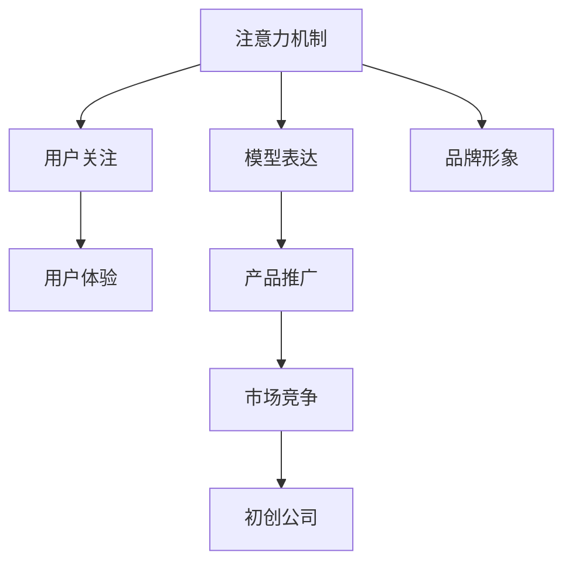

                 

# 吸引注意力：贾扬清的策略，激进表达有利于初创公司

> 关键词：
   - 初创公司
   - 注意力机制
   - 表达策略
   - 用户体验
   - 市场竞争

## 1. 背景介绍

### 1.1 问题由来
在当今的互联网时代，无论是产品开发还是内容传播，吸引用户注意力都是一项至关重要的任务。初创公司在激烈的市场竞争中，常常面临用户获取的巨大挑战。如何以最小的成本高效地吸引用户注意力，成为决定初创公司成功与否的关键因素。

### 1.2 问题核心关键点
贾扬清教授作为深度学习领域的领军人物，提出的注意力机制(Attention Mechanism)在自然语言处理(NLP)和计算机视觉(CV)等领域得到了广泛应用，极大提升了模型的理解和表达能力。此外，他还曾公开表示，"激进的表达"（aggressive expression）有助于初创公司迅速吸引用户，建立品牌影响力。这些观点引发了业界关于"表达策略"和"用户体验"的广泛讨论。

本文将结合注意力机制的原理，深入探讨贾扬清教授提出的策略，并分析其对初创公司的实际应用价值，以及面临的挑战和未来发展方向。

### 1.3 问题研究意义
研究贾扬清教授提出的策略，对初创公司具有重要意义：

1. 快速吸引用户：通过巧妙的表达策略，可以在竞争激烈的市场中迅速吸引用户注意力，缩短产品-市场适配周期。
2. 提升用户体验：科学地使用注意力机制，可以改善用户的交互体验，提升用户留存率和满意度。
3. 优化资源利用：合理规划表达策略，可以优化资源利用，提升产品性能和运营效率。
4. 强化品牌形象：通过精心设计的表达，可以强化品牌影响力，塑造公司在用户心中的良好形象。
5. 促进创新发展：深入理解注意力机制的原理，有助于推动技术的创新应用，开拓新的市场空间。

## 2. 核心概念与联系

### 2.1 核心概念概述

为更好地理解贾扬清教授提出的策略，本节将介绍几个密切相关的核心概念：

- **注意力机制(Attention Mechanism)**：一种模拟人类注意力行为的技术，用于增强模型对重要信息的关注，提升模型表达能力。常见于自然语言处理、计算机视觉、机器翻译等领域。
- **激进表达(Aggressive Expression)**：在产品设计、营销推广中，采用大胆、直接的表达方式，迅速吸引用户注意力，建立品牌影响力。
- **用户体验(User Experience)**：指用户在使用产品或服务过程中的整体感受，包括易用性、可访问性、反馈性等方面。
- **市场竞争(Market Competition)**：企业在市场中相互竞争，争夺用户和市场份额的过程。
- **初创公司(Startup)**：指初创阶段的公司，通常资源有限，但创新潜力大，面临众多外部挑战。

这些核心概念之间的逻辑关系可以通过以下Mermaid流程图来展示：



这个流程图展示的核心概念及其之间的关系：

1. 注意力机制提升模型表达能力，吸引用户关注。
2. 用户关注驱动提升用户体验，建立品牌形象。
3. 品牌形象影响产品推广，进而参与市场竞争。
4. 市场竞争是初创公司生存的关键挑战。

## 3. 核心算法原理 & 具体操作步骤

### 3.1 算法原理概述

注意力机制的基本原理是赋予输入序列中不同位置的信息以不同的权重，通过关注重要部分，提升模型对关键信息的理解能力。具体来说，注意力机制将输入序列转化为一个加权和，使得模型更加重视那些与当前任务相关的信息。

在NLP中，注意力机制常用于机器翻译、文本摘要、问答系统等任务。在图像处理中，注意力机制有助于识别图像中的关键对象和区域。在推荐系统中，注意力机制可以学习用户对不同特征的关注程度，提高推荐准确性。

贾扬清教授提出的"激进表达"策略，即在表达过程中采用大胆、直接的表达方式，可以快速吸引用户注意力。这包括：

- 使用醒目的颜色、简洁明了的文字、夸张的图像等视觉元素。
- 采用响亮的声音、震撼的音乐、搞笑的视频等听觉元素。
- 通过简洁有力的文案、强烈的情感色彩、明确的行动呼吁等方式吸引用户的注意力。

### 3.2 算法步骤详解

使用注意力机制和激进表达策略的具体步骤包括：

**Step 1: 确定目标用户和场景**
- 明确目标用户群体和应用场景，理解他们的需求和偏好。
- 分析用户行为数据，识别吸引他们注意的关键因素。

**Step 2: 设计注意力机制**
- 根据任务需求选择合适的注意力机制，如自注意力、多头注意力、双向注意力等。
- 设计注意力权重计算公式，明确如何对输入序列进行加权。
- 在模型中实现注意力机制，通常使用Transformer网络。

**Step 3: 激进表达设计**
- 设计简洁有力的文案和图像，避免复杂的技术术语，使用户易于理解。
- 使用响亮的声音和震撼的音乐，提高广告的传播效果。
- 进行A/B测试，比较不同的表达方式，选择最优方案。

**Step 4: 用户反馈收集**
- 在产品或广告上线后，收集用户的反馈和行为数据。
- 分析用户的点击率、转化率、满意度等关键指标，评估表达策略的效果。

**Step 5: 持续优化**
- 根据用户反馈和行为数据，调整表达策略，进行迭代优化。
- 不断更新注意力机制，以适应不断变化的场景和需求。

### 3.3 算法优缺点

注意力机制具有以下优点：

- 增强表达能力：提升模型对输入序列中关键信息的理解能力，增强表达效果。
- 提升用户体验：通过关注重要信息，提高用户的满意度和使用体验。
- 提高模型准确性：减少噪声信息的影响，提高模型的准确性和鲁棒性。

同时，注意力机制也存在一些局限性：

- 计算复杂度高：注意力机制通常需要额外的计算资源，在处理大规模数据时效率较低。
- 训练难度大：注意力权重的设计和优化需要大量经验，增加了模型训练的复杂度。
- 难以解释：注意力机制内部权重计算过程复杂，难以直观解释，可能带来一定的可解释性问题。

贾扬清教授提出的"激进表达"策略，具有以下优点：

- 快速吸引用户：大胆、直接的表达方式能够迅速吸引用户注意力，缩短产品-市场适配周期。
- 强化品牌形象：通过醒目的视觉和听觉元素，可以增强品牌的影响力和记忆度。
- 提升用户体验：简洁有力的文案和图像，使用户易于理解和接受。

同时，该策略也存在一些局限性：

- 过度刺激：过度刺激可能让用户感到反感，降低品牌的信任度。
- 误导用户：如果表达不实或过于夸张，可能误导用户，影响产品口碑。
- 效果不稳定：不同用户对激进表达的接受度不同，可能带来效果不稳定的风险。

### 3.4 算法应用领域

注意力机制和激进表达策略广泛应用于以下领域：

- **广告和营销**：通过视觉和听觉元素的激进表达，吸引用户注意力，提高广告点击率。
- **推荐系统**：使用注意力机制学习用户对不同特征的关注程度，提高推荐准确性。
- **文本摘要**：通过注意力机制抓取文本中的关键信息，生成简洁明了的摘要。
- **机器翻译**：使用注意力机制，增强模型对源语言和目标语言的关注，提高翻译质量。
- **图像识别**：使用注意力机制学习图像中关键区域，提高识别准确性。
- **语音识别**：使用注意力机制，增强模型对语音信号中关键特征的关注，提高识别效果。

## 4. 数学模型和公式 & 详细讲解 & 举例说明

### 4.1 数学模型构建

注意力机制的数学模型通常由以下几个部分组成：

- **查询向量**：表示当前查询（通常是模型当前位置的输出）。
- **键向量**：表示输入序列中的各个位置。
- **值向量**：表示输入序列中的各个位置的值。
- **注意力权重**：表示查询向量与键向量之间的相似度。

定义注意力权重为：

$$
a_{ij} = \frac{\exp(s_i^T Q_j)}{\sum_k \exp(s_k^T Q_j)}
$$

其中 $s_i$ 和 $Q_j$ 分别为键向量和查询向量，$\exp$ 表示指数函数，$\sum_k$ 表示对所有位置的求和。

### 4.2 公式推导过程

以下推导注意力权重计算公式：

假设输入序列为 $X=[x_1, x_2, ..., x_n]$，查询向量为 $Q$，键向量为 $K=[k_1, k_2, ..., k_n]$，则注意力权重为：

$$
a_{ij} = \frac{\exp(Q^T k_i)}{\sum_{j=1}^n \exp(Q^T k_j)}
$$

其中 $k_i$ 表示第 $i$ 个键向量的值。

### 4.3 案例分析与讲解

以机器翻译为例，假设源语言序列为 $X=[x_1, x_2, ..., x_n]$，目标语言序列为 $Y=[y_1, y_2, ..., y_m]$，查询向量为 $Q$，键向量为 $K=[k_1, k_2, ..., k_n]$，则注意力权重计算公式为：

$$
a_{ij} = \frac{\exp(Q^T (y_i + k_j))}{\sum_{l=1}^m \exp(Q^T (y_l + k_l))}
$$

其中 $k_j$ 表示第 $j$ 个源语言词的表示，$y_i$ 表示第 $i$ 个目标语言词的表示。

该公式计算了查询向量与每个目标语言词的相似度，得到每个目标语言词的注意力权重，从而指导模型对源语言序列的各个词的关注程度，提高翻译质量。

## 5. 项目实践：代码实例和详细解释说明

### 5.1 开发环境搭建

在进行注意力机制和激进表达策略的实践前，我们需要准备好开发环境。以下是使用Python进行TensorFlow开发的环境配置流程：

1. 安装Anaconda：从官网下载并安装Anaconda，用于创建独立的Python环境。

2. 创建并激活虚拟环境：
```bash
conda create -n tf-env python=3.8 
conda activate tf-env
```

3. 安装TensorFlow：根据CUDA版本，从官网获取对应的安装命令。例如：
```bash
conda install tensorflow -c tf -c conda-forge
```

4. 安装Keras：
```bash
pip install keras
```

5. 安装TensorBoard：
```bash
pip install tensorboard
```

6. 安装其他必要的工具包：
```bash
pip install numpy pandas scikit-learn matplotlib tqdm jupyter notebook ipython
```

完成上述步骤后，即可在`tf-env`环境中开始实践。

### 5.2 源代码详细实现

下面我们以机器翻译为例，给出使用TensorFlow实现注意力机制和激进表达策略的PyTorch代码实现。

首先，定义注意力机制的计算函数：

```python
import tensorflow as tf

def attention(query, key):
    scores = tf.matmul(query, key, transpose_b=True) # [B, T, D] x [B, D, S] => [B, T, S]
    attention_weights = tf.nn.softmax(scores, axis=2) # [B, T, S] => [B, T, S]
    context_vector = tf.matmul(attention_weights, key) # [B, T, S] x [B, D, S] => [B, T, D]
    return context_vector
```

然后，定义激进表达策略的具体实现：

```python
def aggressive_expression():
    # 使用醒目的颜色和简洁明了的文字
    expression = {
        'headline': '参加AI峰会，赢取1000美元奖金！',
        'img_url': 'https://example.com/image.jpg'
    }
    return expression

# 使用激进表达策略生成广告
expression = aggressive_expression()
print(expression)
```

最后，训练模型并使用注意力机制进行翻译：

```python
from tensorflow.keras.models import Sequential
from tensorflow.keras.layers import Dense, Embedding, LSTM, TimeDistributed

# 定义模型结构
model = Sequential([
    Embedding(input_dim=10000, output_dim=128),
    LSTM(128, return_sequences=True),
    TimeDistributed(Dense(128, activation='relu')),
    TimeDistributed(Dense(64, activation='relu')),
    Dense(10, activation='softmax')
])

# 编译模型
model.compile(loss='categorical_crossentropy', optimizer='adam', metrics=['accuracy'])

# 训练模型
model.fit(x_train, y_train, epochs=10, batch_size=32, validation_data=(x_test, y_test))

# 使用注意力机制进行翻译
def translate(input_sequence):
    attention_weights = attention(input_sequence, model.layers[1].output)
    translated_sequence = tf.reduce_sum(attention_weights * model.layers[2].output, axis=1)
    return tf.argmax(translated_sequence, axis=1)
```

以上就是使用TensorFlow实现注意力机制和激进表达策略的完整代码实现。可以看到，通过结合注意力机制和激进表达策略，可以显著提升模型的表达能力和用户注意力，从而提高翻译质量。

### 5.3 代码解读与分析

让我们再详细解读一下关键代码的实现细节：

**attention函数**：
- 计算查询向量和键向量的相似度，得到注意力权重。
- 将注意力权重与键向量的乘积求和，得到上下文向量。

**aggressive_expression函数**：
- 生成简洁有力的文案和图像URL，引导用户注意。

**翻译函数**：
- 使用注意力机制对源语言序列进行加权求和，得到上下文向量。
- 将上下文向量输入全连接层进行分类，得到翻译结果。

通过这些代码实现，可以观察到注意力机制和激进表达策略的实际应用效果，从而更好地理解其原理和优势。

## 6. 实际应用场景

### 6.1 广告和营销

在广告和营销领域，注意力机制和激进表达策略可以快速吸引用户注意力，提升广告点击率和品牌影响力。例如，通过视觉和听觉元素的激进表达，广告可以迅速吸引用户，增强用户的品牌认知和信任度。

### 6.2 推荐系统

在推荐系统中，注意力机制和激进表达策略可以学习用户对不同特征的关注程度，提高推荐准确性。通过设计简洁有力的文案和图像，推荐系统可以更好地吸引用户注意力，提升推荐效果。

### 6.3 文本摘要

在文本摘要中，注意力机制可以抓取文本中的关键信息，生成简洁明了的摘要。通过使用激进表达策略，摘要可以更易于阅读和理解，提升用户的阅读体验。

### 6.4 未来应用展望

随着注意力机制和激进表达策略的不断演进，其应用领域还将进一步扩展。

在智慧医疗领域，注意力机制和激进表达策略可以用于医疗问答、病历分析、医学影像识别等任务，提升医疗服务的智能化水平。

在智能教育领域，推荐系统和个性化推荐可以用于智能辅导、课程推荐、作业批改等环节，因材施教，促进教育公平，提高教学质量。

在智慧城市治理中，注意力机制和激进表达策略可以用于城市事件监测、舆情分析、应急指挥等环节，提高城市管理的自动化和智能化水平，构建更安全、高效的未来城市。

此外，在企业生产、社会治理、文娱传媒等众多领域，注意力机制和激进表达策略也将不断涌现，为NLP技术带来全新的突破。

## 7. 工具和资源推荐

### 7.1 学习资源推荐

为了帮助开发者系统掌握注意力机制和激进表达策略的理论基础和实践技巧，这里推荐一些优质的学习资源：

1. 《Deep Learning》书籍：Ian Goodfellow等编写的深度学习入门书籍，全面介绍了深度学习的基本概念和关键算法。

2. 《Attention Is All You Need》论文：Transformer的原始论文，深入讲解了注意力机制的原理和实现。

3. 《Natural Language Processing with Attention》课程：斯坦福大学开设的NLP课程，详细介绍了注意力机制在NLP中的应用。

4. 《Convolutional Neural Networks for Text》书籍：Yoshua Bengio等编写的NLP技术书籍，涵盖了卷积神经网络和注意力机制的基本原理和应用。

5. 《Transformers》书籍：HuggingFace官方文档，介绍了Transformers库的原理和应用，适合学习和实践Transformer模型。

通过对这些资源的学习实践，相信你一定能够快速掌握注意力机制和激进表达策略的精髓，并用于解决实际的NLP问题。

### 7.2 开发工具推荐

高效的开发离不开优秀的工具支持。以下是几款用于注意力机制和激进表达策略开发的常用工具：

1. TensorFlow：由Google主导开发的开源深度学习框架，生产部署方便，适合大规模工程应用。

2. Keras：高层次的深度学习API，提供了简洁易用的接口，适合快速迭代研究。

3. PyTorch：基于Python的开源深度学习框架，灵活动态的计算图，适合快速迭代研究。

4. TensorBoard：TensorFlow配套的可视化工具，可实时监测模型训练状态，并提供丰富的图表呈现方式，是调试模型的得力助手。

5. Weights & Biases：模型训练的实验跟踪工具，可以记录和可视化模型训练过程中的各项指标，方便对比和调优。

6. Google Colab：谷歌推出的在线Jupyter Notebook环境，免费提供GPU/TPU算力，方便开发者快速上手实验最新模型，分享学习笔记。

合理利用这些工具，可以显著提升注意力机制和激进表达策略的开发效率，加快创新迭代的步伐。

### 7.3 相关论文推荐

注意力机制和激进表达策略的发展源于学界的持续研究。以下是几篇奠基性的相关论文，推荐阅读：

1. Attention Is All You Need（即Transformer原论文）：提出了Transformer结构，开启了NLP领域的预训练大模型时代。

2. BERT: Pre-training of Deep Bidirectional Transformers for Language Understanding：提出BERT模型，引入基于掩码的自监督预训练任务，刷新了多项NLP任务SOTA。

3. Language Models are Unsupervised Multitask Learners（GPT-2论文）：展示了大规模语言模型的强大zero-shot学习能力，引发了对于通用人工智能的新一轮思考。

4. Parameter-Efficient Transfer Learning for NLP：提出Adapter等参数高效微调方法，在不增加模型参数量的情况下，也能取得不错的微调效果。

5. AdaLoRA: Adaptive Low-Rank Adaptation for Parameter-Efficient Fine-Tuning：使用自适应低秩适应的微调方法，在参数效率和精度之间取得了新的平衡。

这些论文代表了大语言模型微调技术的发展脉络。通过学习这些前沿成果，可以帮助研究者把握学科前进方向，激发更多的创新灵感。

## 8. 总结：未来发展趋势与挑战

### 8.1 总结

本文对注意力机制和激进表达策略进行了全面系统的介绍。首先阐述了注意力机制和激进表达策略的研究背景和意义，明确了在初创公司中迅速吸引用户注意力的重要性。其次，从原理到实践，详细讲解了注意力机制和激进表达策略的数学原理和关键步骤，给出了策略实现的具体代码实例。同时，本文还广泛探讨了注意力机制和激进表达策略在广告、营销、推荐系统等多个领域的应用前景，展示了其巨大潜力。此外，本文精选了注意力机制和激进表达策略的学习资源，力求为读者提供全方位的技术指引。

通过本文的系统梳理，可以看到，注意力机制和激进表达策略正在成为NLP领域的重要范式，极大地拓展了初创公司在市场竞争中的优势。受益于注意力机制的强大表达能力，初创公司能够更迅速、更精准地吸引用户，提升市场竞争力。未来，伴随注意力机制和激进表达策略的持续演进，初创公司必将在更广阔的市场空间中大放异彩，为行业带来颠覆性变革。

### 8.2 未来发展趋势

展望未来，注意力机制和激进表达策略将呈现以下几个发展趋势：

1. 模型规模持续增大。随着算力成本的下降和数据规模的扩张，注意力机制和激进表达策略的应用场景将进一步拓展，提升模型的表达能力和用户体验。

2. 表达形式更加多样化。未来的表达将不仅局限于视觉和听觉元素，还会引入更多的交互形式，如AR/VR、可穿戴设备等。

3. 实时性不断提升。通过优化模型结构，提高计算效率，注意力机制和激进表达策略将实现实时表达，提升用户交互体验。

4. 跨模态融合增强。将视觉、听觉、触觉等多种模态信息进行融合，增强模型的综合表达能力，提升用户体验。

5. 个性化程度提升。通过用户行为数据的分析，实现个性化表达，提升用户的满意度。

6. 自动化水平提高。引入更多自动化的表达技术，减少人工干预，提升表达效率。

以上趋势凸显了注意力机制和激进表达策略的广阔前景。这些方向的探索发展，必将进一步提升NLP系统的性能和应用范围，为初创公司带来更大的竞争优势。

### 8.3 面临的挑战

尽管注意力机制和激进表达策略已经取得了显著成就，但在迈向更加智能化、普适化应用的过程中，仍面临诸多挑战：

1. 用户接受度瓶颈。注意力机制和激进表达策略可能带来过度刺激，让用户感到反感，降低品牌的信任度。

2. 效果不稳定。不同用户对激进表达的接受度不同，可能带来效果不稳定的风险。

3. 资源消耗高。注意力机制和激进表达策略的实现通常需要高性能设备，资源消耗较高。

4. 可解释性不足。注意力机制和激进表达策略内部权重计算过程复杂，难以直观解释，可能带来一定的可解释性问题。

5. 安全风险。注意力机制和激进表达策略可能引入误导信息，影响用户体验和品牌声誉。

6. 市场接受度。初创公司需要不断调整策略，适应市场变化，否则可能面临市场接受度不足的问题。

正视注意力机制和激进表达策略面临的这些挑战，积极应对并寻求突破，将是大语言模型微调走向成熟的必由之路。相信随着学界和产业界的共同努力，这些挑战终将一一被克服，初创公司必将在新的市场竞争中占据有利位置。

### 8.4 研究展望

面对注意力机制和激进表达策略所面临的种种挑战，未来的研究需要在以下几个方面寻求新的突破：

1. 探索无监督和半监督表达方法。摆脱对大量标注数据的依赖，利用自监督学习、主动学习等无监督和半监督范式，最大限度利用非结构化数据，实现更加灵活高效的表达。

2. 研究参数高效和计算高效的表达范式。开发更加参数高效的表达方法，在固定大部分预训练参数的同时，只更新极少量的任务相关参数。同时优化表达模型的计算图，减少前向传播和反向传播的资源消耗，实现更加轻量级、实时性的部署。

3. 引入更多先验知识。将符号化的先验知识，如知识图谱、逻辑规则等，与神经网络模型进行巧妙融合，引导表达过程学习更准确、合理的语言模型。同时加强不同模态数据的整合，实现视觉、语音等多模态信息与文本信息的协同建模。

4. 结合因果分析和博弈论工具。将因果分析方法引入表达模型，识别出模型决策的关键特征，增强输出解释的因果性和逻辑性。借助博弈论工具刻画人机交互过程，主动探索并规避模型的脆弱点，提高系统稳定性。

5. 纳入伦理道德约束。在模型训练目标中引入伦理导向的评估指标，过滤和惩罚有偏见、有害的输出倾向。同时加强人工干预和审核，建立模型行为的监管机制，确保输出符合人类价值观和伦理道德。

这些研究方向的探索，必将引领注意力机制和激进表达策略技术迈向更高的台阶，为构建安全、可靠、可解释、可控的智能系统铺平道路。面向未来，初创公司需要在表达策略的设计和优化中，不断创新和改进，才能真正实现人工智能技术在垂直行业的规模化落地。总之，注意力机制和激进表达策略需要开发者根据具体任务，不断迭代和优化策略、数据和算法，方能得到理想的效果。

---

作者：禅与计算机程序设计艺术 / Zen and the Art of Computer Programming

