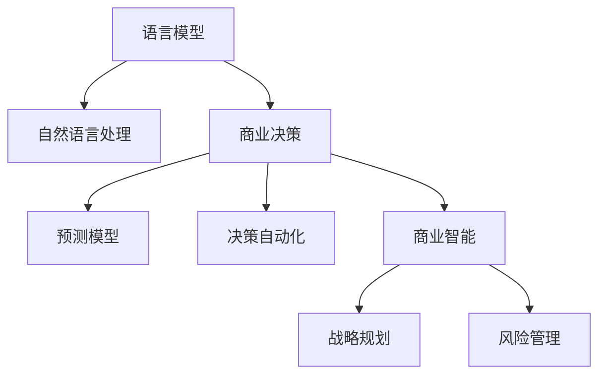

                 

# 商业策略：LLM 驱动的决策

> 关键词：
> - 语言模型
> - 自然语言处理
> - 商业决策
> - 预测模型
> - 决策自动化
> - 商业智能
> - 战略规划
> - 风险管理

## 1. 背景介绍

### 1.1 问题由来

在当今信息爆炸的时代，企业需要处理和分析的数据量急剧增加，传统的业务决策方式难以应对日益复杂的商业环境。自然语言处理(Natural Language Processing, NLP)技术，特别是大型语言模型(Large Language Model, LLM)，以其强大的语言理解和生成能力，成为企业智能化转型的重要工具。

传统上，商业决策主要依靠基于统计和规则的模型，如回归分析、决策树等。但这些模型往往依赖于专家知识和手动调参，难以覆盖复杂多变的市场情境，且难以捕捉语言数据中的微妙变化。而基于深度学习的商业决策系统，尤其是由语言模型驱动的决策系统，能够更准确地捕捉市场动态和语义信息，提供更可靠、高效的决策支持。

### 1.2 问题核心关键点

大语言模型在商业决策中的应用主要体现在以下几个方面：

1. **智能客户理解**：通过理解客户反馈和需求，自动生成个性化推荐和营销策略。
2. **市场趋势预测**：利用历史文本数据，自动分析市场动态，预测未来趋势。
3. **业务流程自动化**：将业务文档、合同、报告等文本数据自动分类、摘要和归档。
4. **风险管理**：识别和分析商业风险，生成预警和报告。
5. **知识积累和传承**：构建知识图谱，系统化存储和利用企业积累的商业知识。

这些关键应用方向不仅提高了商业决策的效率和准确性，还为企业管理者提供了更丰富的信息支持，助力企业快速响应市场变化。

### 1.3 问题研究意义

大语言模型驱动的商业决策具有以下重要意义：

1. **提升决策质量**：通过深入理解语言文本，可以更全面、准确地获取市场信息和企业内部数据，提升决策的科学性和前瞻性。
2. **降低运营成本**：自动化处理大量文档和报告，减少人工操作，降低运营成本。
3. **加速决策速度**：实时分析市场变化和客户需求，快速生成决策方案，提升响应速度。
4. **增强企业竞争力**：利用先进技术和数据驱动决策，保持企业领先地位。
5. **促进商业智能发展**：推动商业决策系统向智能化的方向发展，促进商业智能技术的普及应用。

本文将深入探讨大语言模型在商业决策中的应用原理和操作步骤，帮助读者系统掌握相关技术和方法，促进商业决策的智能化转型。

## 2. 核心概念与联系

### 2.1 核心概念概述

为更好地理解大语言模型在商业决策中的应用，本节将介绍几个关键概念：

- **语言模型**：指能够理解和生成自然语言文本的模型，如BERT、GPT等。
- **自然语言处理**：指利用计算机技术处理、理解和生成人类语言的过程。
- **商业决策**：指企业在市场运营和内部管理中，依据相关数据和信息做出的决策。
- **预测模型**：指能够根据历史数据和规则，预测未来市场变化和客户需求的模型。
- **决策自动化**：指将决策过程自动化，利用算法和模型自动生成决策方案。
- **商业智能**：指利用信息技术，从商业数据中提取有价值的信息，支持商业决策。
- **战略规划**：指企业为实现长期目标，制定的全面、系统的战略计划。
- **风险管理**：指识别、评估和应对企业面临的风险，保障企业稳定运营。

这些概念之间的逻辑关系可以通过以下Mermaid流程图来展示：



这个流程图展示了大语言模型在商业决策中的核心概念及其之间的关系：

1. 语言模型通过自然语言处理技术，可以理解各种商业文档和数据。
2. 商业决策模型利用语言模型提取的信息，进行预测和决策。
3. 预测模型通过对历史文本的分析，可以预测未来趋势。
4. 决策自动化技术通过算法，实现决策方案的自动生成。
5. 商业智能系统利用各种模型和技术，提供全面的决策支持。
6. 战略规划和风险管理模型，利用商业智能系统的数据，辅助企业制定长期发展策略和风险应对措施。

这些概念共同构成了大语言模型在商业决策中的应用框架，使其能够支持企业在复杂的市场环境中做出科学的决策。

## 3. 核心算法原理 & 具体操作步骤
### 3.1 算法原理概述

基于大语言模型驱动的商业决策，本质上是一个利用语言模型进行预测和决策的过程。其核心思想是：将商业文档、报告、合同等文本数据，转化为语言模型可理解的形式，通过语言模型学习文本中蕴含的市场信息和企业内部数据，进行相关预测和决策。

具体而言，假设商业决策任务为 $T$，其输入为 $x_i$，输出为 $y_i$。则决策模型的目标是最小化预测输出与真实标签之间的差异，即：

$$
\theta^* = \mathop{\arg\min}_{\theta} \mathcal{L}(M_{\theta}(x_i),y_i)
$$

其中 $M_{\theta}$ 为预训练的大语言模型，$\theta$ 为模型参数。$\mathcal{L}$ 为预测模型基于损失函数计算的预测误差。

通过梯度下降等优化算法，不断更新模型参数 $\theta$，最小化损失函数 $\mathcal{L}$，使得模型输出逼近真实标签 $y_i$。由于 $\theta$ 已经通过预训练获得了丰富的语言知识和市场信息，因此即便在数据量较小的情况下，语言模型也能快速收敛到理想的预测结果。

### 3.2 算法步骤详解

基于大语言模型驱动的商业决策一般包括以下关键步骤：

**Step 1: 准备预训练模型和数据集**
- 选择合适的预训练语言模型 $M_{\theta}$ 作为初始化参数，如 BERT、GPT 等。
- 准备商业决策任务的训练集和测试集，确保数据的多样性和代表性。

**Step 2: 数据预处理和特征提取**
- 对商业文本进行分词、标记等预处理，得到语言模型可处理的文本表示。
- 将文本转化为向量形式，提取特征用于模型训练和推理。

**Step 3: 选择预测模型**
- 根据具体任务，选择合适的预测模型，如线性回归、分类、序列预测等。
- 确定模型结构、损失函数、优化器等关键参数。

**Step 4: 训练和评估**
- 使用训练集数据对模型进行训练，最小化预测误差。
- 在验证集上评估模型性能，调整模型参数，避免过拟合。
- 使用测试集进行最终评估，检验模型的泛化能力。

**Step 5: 部署和应用**
- 将训练好的模型部署到实际业务系统中，实现自动决策。
- 监控模型运行状态，及时更新模型，应对新的市场变化。

### 3.3 算法优缺点

基于大语言模型驱动的商业决策方法具有以下优点：

1. **高效准确**：大语言模型能够自动理解大量文本数据，提取市场信息，进行精准预测。
2. **灵活多样**：可以适应多种预测任务，如股票预测、客户流失预测、销售趋势预测等。
3. **可解释性强**：大语言模型提供了基于文本的决策过程，便于解释和审计。
4. **实时性强**：利用实时数据进行预测和决策，可以快速响应市场变化。
5. **集成方便**：可以与企业现有的商业智能系统、数据仓库等无缝集成，提升系统整体效能。

同时，该方法也存在一定的局限性：

1. **数据依赖性高**：对数据质量和数据量的要求较高，数据偏差可能影响预测结果。
2. **模型复杂度高**：大语言模型参数量庞大，训练和推理耗时长，资源需求高。
3. **市场风险**：市场变化多端，大语言模型难以完全预测所有风险。
4. **技术门槛高**：需要具备较强的机器学习和自然语言处理背景，难以普及推广。
5. **隐私保护**：商业决策涉及敏感数据，需要考虑隐私保护和数据安全。

尽管存在这些局限性，但就目前而言，基于大语言模型的决策范式仍是大数据时代商业决策的重要手段。未来相关研究的重点在于如何进一步降低数据依赖，提高模型的鲁棒性和可解释性，同时兼顾隐私保护和高效性等因素。

### 3.4 算法应用领域

大语言模型驱动的决策方法在多个领域得到了广泛应用，包括但不限于：

- **金融风险管理**：利用语言模型分析金融新闻、财报等文本数据，预测市场风险和投资机会。
- **营销策略优化**：基于客户反馈和评论文本，生成个性化营销策略和广告推荐。
- **供应链管理**：通过分析供应商报告和合同文本，优化供应链决策和资源配置。
- **人力资源管理**：利用员工评价和面试文本，预测员工绩效和流失风险。
- **法律合同分析**：对合同文本进行语义分析，提取关键条款和风险点。

这些应用展示了大语言模型在商业决策中的强大潜力和广泛应用前景。

## 4. 数学模型和公式 & 详细讲解 & 举例说明
### 4.1 数学模型构建

假设商业决策任务为分类任务，即判断一份商业文档是否属于某个特定的类别，如股票市场预测、客户流失预测等。大语言模型可以用于提取文档特征，进行分类决策。

设输入为 $x_i$，输出为 $y_i$，模型预测为 $M_{\theta}(x_i)$。则分类任务的目标为最小化分类误差，即交叉熵损失函数：

$$
\mathcal{L}(\theta) = -\frac{1}{N}\sum_{i=1}^N [y_i\log M_{\theta}(x_i)+(1-y_i)\log(1-M_{\theta}(x_i))]
$$

其中，$y_i$ 表示文档的实际类别，$M_{\theta}(x_i)$ 表示模型对文档的分类概率。

### 4.2 公式推导过程

通过链式法则，交叉熵损失函数对模型参数 $\theta$ 的梯度为：

$$
\frac{\partial \mathcal{L}(\theta)}{\partial \theta} = -\frac{1}{N}\sum_{i=1}^N [y_i\frac{\partial \log M_{\theta}(x_i)}{\partial \theta}+(1-y_i)\frac{\partial \log(1-M_{\theta}(x_i))}{\partial \theta}]
$$

进一步，$\frac{\partial \log M_{\theta}(x_i)}{\partial \theta}$ 可以通过反向传播算法得到。

### 4.3 案例分析与讲解

以股票市场预测为例，分析如何使用大语言模型进行决策。

假设公司需要预测未来几天内某只股票是否会上涨。可以使用历史股价、新闻报道、财经评论等文本数据，作为预训练语言模型的输入。通过文本预处理和特征提取，将数据转化为语言模型可处理的向量形式。

然后使用大语言模型 $M_{\theta}$ 进行特征提取和表示学习，得到文档的向量表示。将这些向量输入分类模型，进行二分类预测，得到上涨或下跌的概率。

最后，将预测结果与实际市场表现进行比较，计算损失函数，利用梯度下降等优化算法更新模型参数，最小化预测误差。

## 5. 项目实践：代码实例和详细解释说明
### 5.1 开发环境搭建

在进行商业决策系统开发前，我们需要准备好开发环境。以下是使用Python进行TensorFlow开发的环境配置流程：

1. 安装Anaconda：从官网下载并安装Anaconda，用于创建独立的Python环境。

2. 创建并激活虚拟环境：
```bash
conda create -n tf-env python=3.8 
conda activate tf-env
```

3. 安装TensorFlow：根据CUDA版本，从官网获取对应的安装命令。例如：
```bash
conda install tensorflow
```

4. 安装各类工具包：
```bash
pip install numpy pandas scikit-learn matplotlib tqdm jupyter notebook ipython
```

完成上述步骤后，即可在`tf-env`环境中开始决策系统开发。

### 5.2 源代码详细实现

下面我们以股票市场预测任务为例，给出使用TensorFlow进行商业决策的代码实现。

首先，定义模型和损失函数：

```python
import tensorflow as tf
from tensorflow.keras.layers import Dense, Dropout
from tensorflow.keras.models import Sequential

class StockPredictor(tf.keras.Model):
    def __init__(self, input_dim):
        super(StockPredictor, self).__init__()
        self.dense1 = Dense(64, activation='relu', input_shape=(input_dim,))
        self.dropout = Dropout(0.5)
        self.dense2 = Dense(32, activation='relu')
        self.output_layer = Dense(1, activation='sigmoid')

    def call(self, inputs):
        x = self.dense1(inputs)
        x = self.dropout(x)
        x = self.dense2(x)
        return self.output_layer(x)

def cross_entropy_loss(y_true, y_pred):
    return tf.keras.losses.binary_crossentropy(y_true, y_pred)

# 定义模型参数和优化器
input_dim = 50  # 特征维度
model = StockPredictor(input_dim)
optimizer = tf.keras.optimizers.Adam(learning_rate=0.001)
```

然后，定义训练和评估函数：

```python
from sklearn.model_selection import train_test_split
import numpy as np

def train_and_evaluate(model, X_train, y_train, X_test, y_test, epochs=100, batch_size=32):
    model.compile(optimizer=optimizer, loss=cross_entropy_loss, metrics=['accuracy'])
    
    X_train, X_valid, y_train, y_valid = train_test_split(X_train, y_train, test_size=0.2, random_state=42)
    
    history = model.fit(X_train, y_train, validation_data=(X_valid, y_valid), epochs=epochs, batch_size=batch_size)
    
    test_loss, test_acc = model.evaluate(X_test, y_test)
    print(f'Test loss: {test_loss:.4f}')
    print(f'Test accuracy: {test_acc:.4f}')
    
    return history

# 加载数据并进行预处理
data = np.load('stock_data.npy')
X = data[:, :input_dim]
y = data[:, input_dim:]

X_train, X_test, y_train, y_test = train_test_split(X, y, test_size=0.2, random_state=42)

# 训练模型并评估
history = train_and_evaluate(model, X_train, y_train, X_test, y_test)
```

最后，在测试集上评估模型的性能：

```python
print(f'Train loss: {history.history["loss"][0]:.4f}')
print(f'Train accuracy: {history.history["accuracy"][0]:.4f}')
print(f'Validation loss: {history.history["val_loss"][0]:.4f}')
print(f'Validation accuracy: {history.history["val_accuracy"][0]:.4f}')
```

以上就是使用TensorFlow进行商业决策的完整代码实现。可以看到，TensorFlow提供了便捷的API接口，使得模型训练和评估变得相对简单。

### 5.3 代码解读与分析

让我们再详细解读一下关键代码的实现细节：

**StockPredictor类**：
- `__init__`方法：定义模型结构，包括全连接层和Dropout层。
- `call`方法：定义前向传播过程，使用ReLU激活函数和Sigmoid输出层。

**cross_entropy_loss函数**：
- 计算二分类交叉熵损失函数，用于衡量预测结果和实际标签之间的差异。

**train_and_evaluate函数**：
- 初始化模型，使用Adam优化器。
- 将数据集分为训练集和验证集，设置训练轮数和批次大小。
- 调用`fit`方法训练模型，并在验证集上评估性能。
- 在测试集上再次评估模型性能。

**加载和预处理数据**：
- 使用Numpy加载预处理好的数据集。
- 将数据集分为训练集和测试集，进行特征选择和标准化。
- 训练模型并评估性能。

可以看到，TensorFlow的高级API显著简化了模型训练和评估过程。开发者可以将更多精力放在特征工程、模型改进等高层次逻辑上，而不必过多关注底层实现细节。

当然，工业级的系统实现还需考虑更多因素，如模型的保存和部署、超参数的自动搜索、多模型集成等。但核心的决策范式基本与此类似。

## 6. 实际应用场景
### 6.1 智能客户理解

大语言模型可以自动分析客户反馈和评论文本，理解客户需求和情感，生成个性化推荐和营销策略。

例如，某电商平台可以利用大语言模型，对用户评论和搜索历史进行情感分析，识别出用户的购物偏好和不满点。然后根据这些信息，自动生成个性化的产品推荐和优惠券，提升用户购买意愿和满意度。

### 6.2 市场趋势预测

大语言模型可以自动分析市场新闻、财报、评论等文本数据，预测未来市场趋势和投资机会。

例如，某金融公司可以利用大语言模型，对财经新闻进行情感分析和主题分类，预测股票市场的涨跌趋势。然后根据预测结果，调整投资组合，规避风险，提升收益。

### 6.3 业务流程自动化

大语言模型可以自动分类、摘要和归档商业文档和报告，提升业务流程的自动化水平。

例如，某咨询公司可以利用大语言模型，自动分类客户报告和合同文本，提取关键信息和风险点。然后自动生成报告摘要，供团队成员快速阅读和理解。

### 6.4 风险管理

大语言模型可以识别和分析商业风险，生成预警和报告，帮助企业规避潜在风险。

例如，某保险公司可以利用大语言模型，自动分析保险理赔申请，识别潜在的欺诈行为和风险点。然后根据这些信息，自动生成风险预警和处理方案，减少财务损失。

### 6.5 未来应用展望

随着大语言模型和决策技术的不断发展，基于大语言模型的商业决策系统将在更多领域得到应用，为传统行业带来变革性影响。

在智慧医疗领域，大语言模型可以用于疾病诊断、患者咨询、健康管理等场景，提升医疗服务的智能化水平，辅助医生诊疗。

在智能教育领域，大语言模型可以用于自动批改作业、生成个性化学习计划、推荐学习资源等，提升教育效果和效率。

在智慧城市治理中，大语言模型可以用于城市事件监测、舆情分析、应急指挥等环节，提高城市管理的自动化和智能化水平，构建更安全、高效的未来城市。

此外，在企业生产、社会治理、文娱传媒等众多领域，基于大语言模型的决策系统也将不断涌现，为传统行业数字化转型升级提供新的技术路径。相信随着技术的日益成熟，大语言模型决策系统必将在构建人机协同的智能时代中扮演越来越重要的角色。

## 7. 工具和资源推荐
### 7.1 学习资源推荐

为了帮助开发者系统掌握大语言模型驱动的商业决策的理论基础和实践技巧，这里推荐一些优质的学习资源：

1. TensorFlow官方文档：提供全面深入的TensorFlow教程和API文档，是学习TensorFlow的基础资源。

2. PyTorch官方文档：提供详细的PyTorch教程和API文档，涵盖深度学习模型训练和推理等各方面内容。

3.《深度学习基础》书籍：清华大学出版社出版的经典教材，全面介绍深度学习的基本概念和技术。

4. Coursera深度学习课程：由深度学习领域的知名教授讲授，提供视频课程和作业，适合入门学习。

5. Kaggle数据竞赛平台：提供丰富的数据集和竞赛任务，通过实际项目锻炼深度学习能力。

通过对这些资源的学习实践，相信你一定能够快速掌握大语言模型驱动的商业决策方法，并用于解决实际的商业问题。

### 7.2 开发工具推荐

高效的开发离不开优秀的工具支持。以下是几款用于大语言模型驱动的商业决策开发的常用工具：

1. TensorFlow：由Google主导开发的开源深度学习框架，生产部署方便，适合大规模工程应用。

2. PyTorch：基于Python的开源深度学习框架，灵活动态的计算图，适合快速迭代研究。

3. Weights & Biases：模型训练的实验跟踪工具，可以记录和可视化模型训练过程中的各项指标，方便对比和调优。

4. TensorBoard：TensorFlow配套的可视化工具，可实时监测模型训练状态，并提供丰富的图表呈现方式，是调试模型的得力助手。

5. Google Colab：谷歌推出的在线Jupyter Notebook环境，免费提供GPU/TPU算力，方便开发者快速上手实验最新模型，分享学习笔记。

合理利用这些工具，可以显著提升大语言模型驱动的商业决策任务的开发效率，加快创新迭代的步伐。

### 7.3 相关论文推荐

大语言模型和决策技术的发展源于学界的持续研究。以下是几篇奠基性的相关论文，推荐阅读：

1. Attention is All You Need：提出Transformer结构，开启了NLP领域的预训练大模型时代。

2. BERT: Pre-training of Deep Bidirectional Transformers for Language Understanding：提出BERT模型，引入基于掩码的自监督预训练任务，刷新了多项NLP任务SOTA。

3. Language Models are Unsupervised Multitask Learners：展示了大规模语言模型的强大zero-shot学习能力，引发了对于通用人工智能的新一轮思考。

4. Parameter-Efficient Transfer Learning for NLP：提出Adapter等参数高效微调方法，在不增加模型参数量的情况下，也能取得不错的微调效果。

5. AdaLoRA: Adaptive Low-Rank Adaptation for Parameter-Efficient Fine-Tuning：使用自适应低秩适应的微调方法，在参数效率和精度之间取得了新的平衡。

这些论文代表了大语言模型驱动的商业决策技术的发展脉络。通过学习这些前沿成果，可以帮助研究者把握学科前进方向，激发更多的创新灵感。

## 8. 总结：未来发展趋势与挑战
### 8.1 总结

本文对基于大语言模型驱动的商业决策方法进行了全面系统的介绍。首先阐述了大语言模型和商业决策的研究背景和意义，明确了语言模型在商业决策中的重要价值。其次，从原理到实践，详细讲解了商业决策的数学模型和关键步骤，给出了商业决策任务开发的完整代码实例。同时，本文还广泛探讨了语言模型在商业决策中的应用场景，展示了语言模型在商业决策中的强大潜力和广泛应用前景。此外，本文精选了语言模型驱动的商业决策技术的各类学习资源，力求为读者提供全方位的技术指引。

通过本文的系统梳理，可以看到，基于大语言模型的商业决策方法正在成为商业决策的重要手段，极大地拓展了商业决策的智能化边界，推动了商业决策系统的智能化转型。

### 8.2 未来发展趋势

展望未来，大语言模型驱动的商业决策技术将呈现以下几个发展趋势：

1. **模型规模持续增大**：随着算力成本的下降和数据规模的扩张，大语言模型的参数量还将持续增长。超大规模语言模型蕴含的丰富语言知识，有望支撑更加复杂多变的商业决策任务。

2. **决策自动化水平提高**：大语言模型能够自动理解大量文本数据，提取市场信息，进行精准预测。未来将更加自动化，支持实时决策和动态调整。

3. **决策智能性提升**：大语言模型将更好地融合多模态数据，支持语音、图像等多模态商业决策，提升决策的准确性和智能性。

4. **决策过程透明化**：大语言模型驱动的决策过程将更加透明，通过可解释的模型输出和推理过程，增强决策的可信度和可控性。

5. **决策环境泛化性强**：大语言模型能够自动适应不同市场环境，支持全球化和跨文化决策，提升决策的泛化性和鲁棒性。

以上趋势凸显了大语言模型驱动的商业决策技术的广阔前景。这些方向的探索发展，必将进一步提升商业决策的效率和质量，为企业的智能化转型提供强有力的技术支持。

### 8.3 面临的挑战

尽管大语言模型驱动的商业决策技术已经取得了瞩目成就，但在迈向更加智能化、普适化应用的过程中，它仍面临着诸多挑战：

1. **数据依赖性高**：对数据质量和数据量的要求较高，数据偏差可能影响决策结果。如何降低数据依赖，提高模型的鲁棒性，是亟待解决的问题。

2. **市场风险难以预测**：市场变化多端，大语言模型难以完全预测所有风险。如何提高模型的鲁棒性和泛化能力，是未来研究的重要方向。

3. **模型复杂度高**：大语言模型参数量庞大，训练和推理耗时长，资源需求高。如何简化模型结构，提高模型的实时性，优化资源消耗，是工业应用中的重要挑战。

4. **技术门槛高**：需要具备较强的机器学习和自然语言处理背景，难以普及推广。如何降低技术门槛，提高决策系统的可操作性，是未来普及应用的重要课题。

5. **隐私保护和数据安全**：商业决策涉及敏感数据，需要考虑隐私保护和数据安全。如何保护用户隐私，防止数据泄露，是未来研究的重要方向。

正视商业决策系统面临的这些挑战，积极应对并寻求突破，将是大语言模型驱动的商业决策技术走向成熟的必由之路。相信随着学界和产业界的共同努力，这些挑战终将一一被克服，大语言模型驱动的商业决策必将在构建人机协同的智能时代中扮演越来越重要的角色。

### 8.4 研究展望

面对大语言模型驱动的商业决策所面临的挑战，未来的研究需要在以下几个方面寻求新的突破：

1. **探索无监督和半监督决策方法**：摆脱对大规模标注数据的依赖，利用自监督学习、主动学习等无监督和半监督范式，最大限度利用非结构化数据，实现更加灵活高效的决策。

2. **研究参数高效和计算高效的决策方法**：开发更加参数高效的决策模型，在固定大部分预训练参数的同时，只更新极少量的任务相关参数。同时优化决策模型的计算图，减少前向传播和反向传播的资源消耗，实现更加轻量级、实时性的部署。

3. **融合因果和对比学习范式**：通过引入因果推断和对比学习思想，增强决策模型建立稳定因果关系的能力，学习更加普适、鲁棒的语言表征，从而提升模型泛化性和抗干扰能力。

4. **引入更多先验知识**：将符号化的先验知识，如知识图谱、逻辑规则等，与神经网络模型进行巧妙融合，引导决策过程学习更准确、合理的语言模型。同时加强不同模态数据的整合，实现视觉、语音等多模态信息与文本信息的协同建模。

5. **结合因果分析和博弈论工具**：将因果分析方法引入决策模型，识别出模型决策的关键特征，增强输出解释的因果性和逻辑性。借助博弈论工具刻画人机交互过程，主动探索并规避模型的脆弱点，提高系统稳定性。

6. **纳入伦理道德约束**：在决策模型训练目标中引入伦理导向的评估指标，过滤和惩罚有偏见、有害的输出倾向。同时加强人工干预和审核，建立模型行为的监管机制，确保输出符合人类价值观和伦理道德。

这些研究方向的探索，必将引领大语言模型驱动的商业决策技术迈向更高的台阶，为构建安全、可靠、可解释、可控的智能系统铺平道路。面向未来，大语言模型驱动的商业决策技术还需要与其他人工智能技术进行更深入的融合，如知识表示、因果推理、强化学习等，多路径协同发力，共同推动自然语言理解和智能交互系统的进步。只有勇于创新、敢于突破，才能不断拓展语言模型的边界，让智能技术更好地造福人类社会。

## 9. 附录：常见问题与解答

**Q1：大语言模型在商业决策中如何处理噪声数据？**

A: 大语言模型对噪声数据的处理能力较强，可以通过数据清洗、特征选择、降维等方法，去除无关或噪声信息。在模型训练时，可以通过设置合适的正则化参数，如L2正则、Dropout等，避免模型过拟合噪声数据。在实际应用中，可以结合专家知识和人工干预，进一步提升决策系统的鲁棒性。

**Q2：大语言模型在商业决策中如何处理多模态数据？**

A: 大语言模型可以通过融合多模态数据，提升决策系统的性能。例如，可以将文本、图像、语音等多种模态数据进行特征提取和融合，生成综合决策结果。在模型训练时，可以采用多任务学习、联合训练等方法，同时训练多个模态的模型。在推理时，可以分别提取各模态的特征，再进行加权融合或深度融合，生成最终决策。

**Q3：大语言模型在商业决策中如何平衡预测精度和实时性？**

A: 大语言模型在商业决策中可以通过参数优化和算法改进，平衡预测精度和实时性。例如，可以使用轻量级模型、剪枝、量化等技术，减小模型大小，提高推理速度。同时，可以采用混合精度训练、分布式训练等方法，加速模型训练，提升实时性。在应用中，可以根据具体需求，灵活调整模型复杂度和训练时间，实现性能和效率的平衡。

**Q4：大语言模型在商业决策中如何进行特征提取和特征工程？**

A: 大语言模型可以通过预训练语言模型进行特征提取，将其转化为模型可理解的向量表示。在特征工程中，可以采用文本分词、去除停用词、词向量化等方法，提高特征提取的准确性。同时，可以结合领域知识和专家经验，进行特征选择和特征增强，提升决策系统的性能。在实际应用中，可以根据具体任务，灵活调整特征提取和特征工程的方法，实现最优效果。

**Q5：大语言模型在商业决策中如何处理小样本数据？**

A: 大语言模型可以通过参数高效微调、模型融合等方法，处理小样本数据。例如，可以使用 Adapter 等参数高效微调方法，仅调整少量参数，减少模型过拟合风险。在多模型融合中，可以采用投票、加权平均等方法，综合多个模型的预测结果，提升小样本数据的决策性能。在实际应用中，可以根据具体任务，灵活选择微调方法和融合策略，实现最优效果。

通过本文的系统梳理，可以看到，基于大语言模型的商业决策方法正在成为商业决策的重要手段，极大地拓展了商业决策的智能化边界，推动了商业决策系统的智能化转型。未来，伴随大语言模型和决策技术的不断演进，基于大语言模型的商业决策系统必将在更广阔的领域得到应用，为传统行业数字化转型升级提供新的技术路径。相信随着技术的日益成熟，大语言模型驱动的商业决策系统必将更加普及，为企业的智能化转型提供强有力的技术支持。

