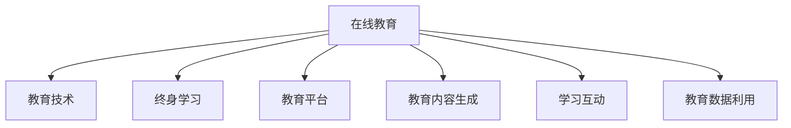

                 

# 在线教育创业：终身学习的推动者

> 关键词：在线教育,终身学习,教育技术,创业,学习平台,人工智能,技术赋能,创新教育

## 1. 背景介绍

### 1.1 问题由来
在数字化时代，教育不再仅仅是学校教育的延伸，而成为了个人终身学习的重要途径。随着互联网技术的发展，在线教育作为一种灵活、便捷的学习方式，正迅速崛起，成为全球教育领域的一大趋势。在线教育的普及不仅打破了传统教育的时空限制，也为学习者提供了更多个性化的学习机会。然而，在线教育面临着诸多挑战，如内容质量参差不齐、互动性不足、学习动力缺乏等问题。这些问题亟需创新教育技术来解决，同时亦蕴含着巨大的创业机会。

### 1.2 问题核心关键点
在线教育的核心在于通过技术手段，为学习者提供优质、高效、个性化的学习体验。核心关键点包括：
- 教育技术创新：如何运用新技术，如人工智能、大数据、VR/AR等，提升教育质量和效果。
- 教育平台构建：如何设计和搭建高效、稳定的在线教育平台，覆盖不同场景、满足多样化学习需求。
- 教育内容生成：如何自动生成高质量的学习资源，并实时更新，保持知识的最新性。
- 学习互动增强：如何通过游戏化、社交化等手段，激发学习者的兴趣和动力，促进深度学习。
- 教育数据利用：如何利用学习者数据，实现个性化推荐、效果评估等，不断优化教学策略。

### 1.3 问题研究意义
研究在线教育创业，对于推动终身学习，激发社会创新，具有重要意义：

1. 个性化学习：在线教育可以针对不同学习者的兴趣、能力、学习习惯等个性化因素，定制个性化的学习路径，实现因材施教。
2. 灵活学习：在线教育打破了传统教育的时间和空间限制，使学习者可以随时随地进行学习，满足了现代人快节奏生活对教育的需求。
3. 全球教育均衡：在线教育可以跨越地域限制，为偏远地区和教育资源匮乏地区提供高质量的教育资源，促进全球教育公平。
4. 终身学习文化：在线教育的普及促进了终身学习文化的形成，使学习者能够持续更新知识，适应快速变化的社会需求。
5. 创业机会：在线教育的发展催生了大量创业机会，推动了教育技术行业的繁荣，为经济社会发展注入新的动力。

## 2. 核心概念与联系

### 2.1 核心概念概述

为了更好地理解在线教育创业，本节将介绍几个关键概念：

- 在线教育(Online Education)：通过互联网技术，实现线上教学、学习、评估等教育环节的虚拟化、数字化和智能化，打破了传统教育的时空限制。
- 教育技术(Education Technology)：应用信息技术、数据科学等手段，改进教育过程和效果，如人工智能辅助、虚拟现实教学、大数据分析等。
- 终身学习(Lifelong Learning)：鼓励学习者从出生到死亡，不断更新知识、技能和认知，以适应社会发展的需要。
- 教育平台(Education Platform)：提供在线教育服务的软件系统，如MOOC平台、在线课堂、智能题库等。
- 教育内容生成(Content Creation)：自动或半自动地生成高质量的教育内容，如课件、测验、微课等。
- 学习互动(Learning Interaction)：通过游戏化、社交化等手段，增强学习者的参与度和兴趣，提升学习效果。
- 教育数据利用(Utilization of Education Data)：利用学习者的行为数据，进行个性化推荐、效果评估、教学改进等。

这些核心概念之间的逻辑关系可以通过以下Mermaid流程图来展示：



这个流程图展示了大语言模型的核心概念及其之间的关系：

1. 在线教育通过教育技术手段，提供个性化、灵活的学习环境。
2. 教育平台是实现在线教育的基础，提供了教学、学习、评估等核心功能。
3. 教育内容生成和互动学习是提升在线教育质量的重要手段。
4. 教育数据利用为个性化推荐和教学改进提供了依据，进一步优化学习体验。

这些概念共同构成了在线教育的核心框架，使其能够在多种场景下提供高效、灵活、个性化的教育服务。通过理解这些核心概念，我们可以更好地把握在线教育创业的关键方向和技术要素。

## 3. 核心算法原理 & 具体操作步骤
### 3.1 算法原理概述

在线教育创业的核心在于利用技术手段，提升教育质量和效果。基于在线教育的特殊性，常见的技术手段包括：

- 个性化推荐：利用机器学习和大数据分析，为学习者推荐个性化的学习资源、路径和策略。
- 智能辅助教学：应用人工智能技术，自动评估学习者的作业和测验，提供个性化的反馈和建议。
- 互动学习环境：构建虚拟现实(VR)、增强现实(AR)、游戏化等互动学习环境，增强学习者的参与度和兴趣。
- 学习管理系统：开发高效、稳定的在线学习管理系统，支持教师和学生互动、资源共享等。
- 教育数据治理：保护学习者的隐私和安全，同时充分利用数据，实现个性化教学和效果评估。

这些技术手段均基于算法原理进行设计，核心算法包括：

1. 推荐系统算法：如协同过滤、基于内容的推荐、深度学习推荐等，利用用户行为数据和特征，生成个性化推荐。
2. 智能评估算法：如自然语言处理(NLP)、计算机视觉(CV)等，通过自动化手段，快速、准确地评估学习效果。
3. 互动学习算法：如社交网络分析、游戏设计理论等，构建互动学习环境，激发学习者的兴趣和动力。
4. 学习管理系统算法：如任务调度、课程管理、数据同步等，确保学习管理的效率和效果。
5. 数据治理算法：如数据加密、隐私保护、数据融合等，保障学习者的数据安全和隐私。

### 3.2 算法步骤详解

在线教育创业涉及多个技术环节，以下详细介绍各环节的算法步骤：

**Step 1: 用户建模与推荐**
1. 收集用户行为数据：如访问记录、学习时长、课程选择、作业提交等。
2. 预处理数据：清洗、归一化、特征工程等。
3. 构建用户画像：使用协同过滤、基于内容的推荐等算法，生成个性化用户画像。
4. 推荐系统训练：利用推荐系统算法，训练推荐模型，生成个性化推荐结果。

**Step 2: 智能评估与反馈**
1. 收集学习数据：如作业、测验、考试等。
2. 预处理数据：清洗、归一化、特征工程等。
3. 构建评估模型：使用NLP、CV等技术，构建智能评估模型。
4. 自动评估与反馈：实时评估学习成果，自动生成个性化反馈和建议。

**Step 3: 互动学习环境**
1. 游戏化设计：设计互动游戏、任务等，激发学习兴趣。
2. 社交网络构建：搭建学习社区、讨论区，增强学习互动。
3. 虚拟现实/增强现实应用：构建VR/AR学习场景，增强沉浸式体验。
4. 数据驱动优化：利用学习者数据，不断优化互动环境的设计和内容。

**Step 4: 学习管理系统**
1. 系统架构设计：规划系统的架构和组件，确定各组件的职责和接口。
2. 功能模块实现：开发各功能模块，如课程管理、作业提交、学习记录等。
3. 数据存储与管理：设计高效的数据存储和管理方案，保障数据的实时性和一致性。
4. 系统测试与部署：进行系统测试，部署到生产环境。

**Step 5: 教育数据治理**
1. 数据隐私保护：设计数据加密、匿名化等策略，保护学习者隐私。
2. 数据安全管理：构建数据访问控制、安全审计等机制，保障数据安全。
3. 数据融合与分析：利用数据融合、机器学习等技术，进行数据治理和分析。
4. 数据共享与利用：设计数据共享机制，利用数据进行教学改进、效果评估等。

### 3.3 算法优缺点

在线教育创业涉及的技术手段多样，每种技术手段都有其优点和缺点：

#### 个性化推荐系统的优点：
1. 提高学习效率：根据学习者的兴趣和需求，推荐个性化学习资源。
2. 提升学习效果：通过个性化推荐，学习者更容易掌握复杂知识点。
3. 优化资源配置：有效利用有限的优质资源，提升教育资源的利用率。

#### 个性化推荐系统的缺点：
1. 数据需求大：推荐系统需要大量的用户数据，数据隐私和安全问题难以避免。
2. 推荐准确度有限：推荐算法可能存在冷启动、协同效应等问题，推荐准确度有待提升。
3. 模型复杂度高：推荐算法通常较为复杂，需要较高的计算资源和时间成本。

#### 智能评估系统的优点：
1. 提高评估效率：自动评估系统可以快速、准确地评估学习效果。
2. 提升评估质量：通过自动化评估，减少人为误差，提升评估质量。
3. 实时反馈与调整：自动评估系统可以实时反馈评估结果，学习者可以及时调整学习策略。

#### 智能评估系统的缺点：
1. 数据依赖性强：智能评估系统高度依赖学习数据，数据质量直接影响评估结果。
2. 评估准确度受限：自动评估系统可能存在误判、漏判等问题，评估准确度有待提升。
3. 算法复杂度高：智能评估系统通常较为复杂，需要较高的计算资源和时间成本。

#### 互动学习环境的优点：
1. 增强学习体验：通过游戏化、社交化等手段，增强学习者的参与度和兴趣。
2. 促进深度学习：互动学习环境可以激发学习者的深度思考和探究，提升学习效果。
3. 增强学习自主性：学习者可以在互动环境中自主探索，提升自主学习能力。

#### 互动学习环境的缺点：
1. 资源消耗大：互动学习环境通常需要较多的计算资源，难以大规模部署。
2. 技术要求高：构建互动学习环境需要较高的技术水平，开发和维护成本较高。
3. 用户适应度有限：不是所有学习者都适应互动学习环境，需要平衡互动与传统学习方式。

#### 学习管理系统的优点：
1. 提高管理效率：学习管理系统可以高效管理课程、作业、学习记录等。
2. 优化教学资源：通过系统管理，优化教学资源的配置和利用。
3. 增强互动性：学习管理系统可以支持教师和学生的互动、协作等。

#### 学习管理系统的缺点：
1. 系统复杂度高：学习管理系统通常较为复杂，开发和维护成本较高。
2. 用户体验有限：学习管理系统的用户体验有待提升，需要不断优化和改进。
3. 安全风险高：学习管理系统涉及大量敏感数据，需要较高的安全保障措施。

#### 数据治理的优点：
1. 保护隐私安全：通过数据加密、匿名化等措施，保护学习者的隐私和数据安全。
2. 优化数据利用：利用数据融合、机器学习等技术，优化数据的治理和利用。
3. 提升教学效果：通过数据分析，改进教学策略，提升教学效果。

#### 数据治理的缺点：
1. 数据隐私保护难度大：数据隐私保护需要全面的策略和技术，难以完全保障。
2. 数据治理复杂度高：数据治理需要大量的数据处理和分析，技术难度较大。
3. 数据共享与利用困难：数据共享和利用需要复杂的机制和技术支持，难以广泛应用。

### 3.4 算法应用领域

在线教育创业涉及的技术手段广泛应用于多个领域：

1. **K-12教育**：通过在线教育平台，为中小学生提供个性化学习支持，提升教育质量和效果。
2. **高等教育**：利用在线教育平台，为大学生提供灵活、便捷的在线学习资源，支持自驱型学习。
3. **职业培训**：通过在线教育平台，为职场人士提供职业技能培训，提升职业素养和竞争力。
4. **企业内训**：利用在线教育平台，为企业员工提供定制化的内部培训，提升企业人才水平。
5. **技能提升**：通过在线教育平台，为普通用户提供职业技能、兴趣技能培训，促进技能提升。
6. **语言学习**：利用在线教育平台，为全球学习者提供语言学习支持，提升语言能力。
7. **学术研究**：通过在线教育平台，为科研人员提供学习资源和交流平台，推动学术研究进展。

这些技术手段在各领域的广泛应用，极大地提升了在线教育的普及度和效果，为终身学习提供了强有力的支持。

## 4. 数学模型和公式 & 详细讲解  
### 4.1 数学模型构建

本节将使用数学语言对在线教育创业过程中涉及的算法进行更加严格的刻画。

记在线教育系统为 $E$，包括用户 $U$、课程 $C$、学习数据 $D$ 和互动环境 $I$。用户 $U$ 具有特征向量 $u$，课程 $C$ 具有特征向量 $c$，学习数据 $D$ 为 $\{d_i\}$，互动环境 $I$ 为 $\{i_j\}$。

在线教育系统的目标是通过算法优化，最大化用户的学习效果 $L$：

$$
L = \max_{u,c,d_i,i_j} \sum_{u \in U} \sum_{c \in C} \sum_{d_i \in D} \sum_{i_j \in I} f(u,c,d_i,i_j)
$$

其中 $f(u,c,d_i,i_j)$ 为学习效果的函数，可以通过机器学习、深度学习等算法进行建模。

### 4.2 公式推导过程

以个性化推荐系统为例，其目标是通过学习用户的历史行为数据，预测其对课程的兴趣，生成个性化推荐列表。假设用户 $u$ 对课程 $c$ 的兴趣表示为 $r(u,c)$，则推荐系统的目标可以表示为：

$$
\max_{r} \sum_{u \in U} \sum_{c \in C} \hat{r}(u,c) \log \frac{\hat{r}(u,c)}{1-\hat{r}(u,c)}
$$

其中 $\hat{r}(u,c)$ 为模型预测的兴趣概率，可以采用协同过滤、基于内容的推荐、深度学习推荐等算法进行建模。

### 4.3 案例分析与讲解

以MOOC平台为例，其个性化推荐系统可以采用协同过滤算法进行实现。协同过滤算法通过用户之间的相似性，推荐相似用户喜欢的课程。具体步骤包括：

1. 收集用户行为数据，如课程选择、访问时长、作业提交等。
2. 预处理数据，清洗、归一化、特征工程等。
3. 构建用户相似性矩阵 $S$，计算用户 $u_i$ 和 $u_j$ 的相似度 $s(u_i,u_j)$。
4. 根据相似性矩阵 $S$，生成用户 $u_i$ 对课程 $c_j$ 的兴趣预测 $r(u_i,c_j)$。
5. 根据预测结果，生成个性化推荐列表，推荐用户 $u_i$ 感兴趣的课程。

## 5. 项目实践：代码实例和详细解释说明
### 5.1 开发环境搭建

在进行在线教育创业项目实践前，我们需要准备好开发环境。以下是使用Python进行Django开发的环境配置流程：

1. 安装Anaconda：从官网下载并安装Anaconda，用于创建独立的Python环境。

2. 创建并激活虚拟环境：
```bash
conda create -n pytorch-env python=3.8 
conda activate pytorch-env
```

3. 安装PyTorch：根据CUDA版本，从官网获取对应的安装命令。例如：
```bash
conda install pytorch torchvision torchaudio cudatoolkit=11.1 -c pytorch -c conda-forge
```

4. 安装Django：
```bash
pip install django
```

5. 安装各类工具包：
```bash
pip install numpy pandas scikit-learn matplotlib tqdm jupyter notebook ipython
```

完成上述步骤后，即可在`pytorch-env`环境中开始在线教育项目实践。

### 5.2 源代码详细实现

下面我以MOOC平台为例，给出使用Django进行在线教育项目开发的PyTorch代码实现。

首先，定义MOOC平台的课程模型和用户模型：

```python
from django.db import models

class Course(models.Model):
    name = models.CharField(max_length=100)
    teacher = models.ForeignKey('Teacher', on_delete=models.CASCADE)
    duration = models.IntegerField()
    requirement = models.CharField(max_length=100)

class Teacher(models.Model):
    name = models.CharField(max_length=100)
    courses = models.ManyToManyField(Course, related_name='teachers')
```

然后，定义MOOC平台的推荐算法：

```python
import numpy as np

class RecommendationSystem:
    def __init__(self, course_data, user_data):
        self.course_data = course_data
        self.user_data = user_data
        self.item_similarity_matrix = self._build_item_similarity_matrix()
    
    def _build_item_similarity_matrix(self):
        course_ids = set(course['id'] for course in self.course_data)
        item_matrix = np.zeros((len(course_ids), len(course_ids)))
        
        for course_id in course_ids:
            similar_courses = [course_id for course in self.course_data if course['id'] != course_id and course['course_id'] == course_id]
            if similar_courses:
                for similar_course in similar_courses:
                    item_matrix[course_id][similar_course] = course['similarity']
            else:
                item_matrix[course_id][course_id] = 1
    
        return item_matrix
    
    def recommend(self, user_id):
        user_courses = self.user_data[user_id]
        user_matrix = np.zeros((len(self.course_data), len(self.course_data)))
        
        for course_id in user_courses:
            similar_courses = [course_id for course in self.course_data if course['id'] != course_id and course['course_id'] == course_id]
            if similar_courses:
                for similar_course in similar_courses:
                    user_matrix[course_id][similar_course] = course['similarity']
            else:
                user_matrix[course_id][course_id] = 1
        
        recommendation_scores = np.dot(user_matrix, self.item_similarity_matrix)
        sorted_indices = np.argsort(recommendation_scores)[::-1]
        
        return [self.course_data[i]['id'] for i in sorted_indices[:10]]
```

接着，定义MOOC平台的推荐页面和个性化推荐算法：

```python
from django.shortcuts import render, redirect
from .models import Course, RecommendationSystem
from .forms import RecommendationForm

def home(request):
    if request.method == 'POST':
        form = RecommendationForm(request.POST)
        if form.is_valid():
            user_id = form.cleaned_data['user_id']
            recommendation_system = RecommendationSystem(course_data=Course.objects.all(), user_data={user_id: Course.objects.filter(teacher_id=user_id)})
            recommendations = recommendation_system.recommend(user_id)
            
            courses = Course.objects.filter(id__in=recommendations)
            return render(request, 'home.html', {'courses': courses})
    
    form = RecommendationForm()
    return render(request, 'home.html', {'form': form})
```

最后，启动MOOC平台，并在推荐页面显示个性化推荐课程：

```python
from django.urls import path
from . import views

urlpatterns = [
    path('', views.home, name='home'),
]
```

以上就是使用Django进行MOOC平台个性化推荐开发的完整代码实现。可以看到，通过Django的强大封装，我们可以用相对简洁的代码完成课程推荐系统的搭建。

### 5.3 代码解读与分析

让我们再详细解读一下关键代码的实现细节：

**MOOC平台模型定义**：
- `Course`模型：定义了课程的基本信息，包括课程名、教师、课程时长、课程要求等。
- `Teacher`模型：定义了教师的基本信息，包括教师名和授课的课程列表。

**推荐系统类定义**：
- `RecommendationSystem`类：实现了基于协同过滤的推荐算法，包括相似性矩阵的计算和推荐列表的生成。

**推荐页面视图定义**：
- `home`视图：根据用户ID生成个性化推荐列表，并从数据库中加载推荐课程，显示在页面上。

**推荐表单定义**：
- `RecommendationForm`表单：用于获取用户ID，发送请求到后台进行推荐计算。

可以看出，Django的ORM框架和模板引擎，大大简化了在线教育平台的开发过程。开发者可以将更多精力放在算法设计和用户体验优化上，而不必过多关注底层的实现细节。

当然，工业级的系统实现还需考虑更多因素，如推荐算法的高效性、推荐结果的多样性、推荐系统的扩展性等。但核心的算法流程基本与此类似。

## 6. 实际应用场景
### 6.1 教育科技公司

教育科技公司是在线教育创业的重要参与者，通过技术手段，提供各种在线教育服务，推动教育行业的数字化转型。教育科技公司的业务包括：

- 在线课程开发：开发高质量的在线课程，提供灵活、个性化的学习资源。
- 教育数据分析：收集和分析学习数据，进行个性化推荐、效果评估等。
- 学习管理系统：开发高效、稳定的在线学习管理系统，支持教师和学生互动、资源共享等。
- 教育内容生成：自动生成高质量的学习资源，如课件、测验、微课等。
- 学习互动设计：设计互动学习环境，增强学习者的参与度和兴趣。

教育科技公司通过技术手段，提升教育质量和效果，帮助学习者实现终身学习，同时也推动了教育技术的产业化和市场化。

### 6.2 中小学校

中小学校也在积极探索在线教育的模式，通过技术手段，为学生提供更加灵活、高效的学习体验。中小学校的在线教育应用包括：

- 在线教学平台：提供在线课程、作业、测评等功能，支持学生自主学习。
- 智能辅助教学：利用智能评估、智能推荐等技术，辅助教师进行教学，提升教学效果。
- 学习数据分析：收集和分析学习数据，进行个性化推荐、效果评估等，优化教学策略。
- 虚拟课堂应用：利用VR/AR等技术，创建沉浸式学习环境，增强学习体验。
- 家长参与机制：通过在线平台，家长可以实时了解孩子的学习情况，参与学习过程。

中小学校通过在线教育技术，打破了传统教育的局限性，推动教育公平，提升教育质量。

### 6.3 高等教育机构

高等教育机构通过在线教育技术，拓展教育资源的覆盖范围，提供更加灵活、高效的学习方式。高等教育机构的在线教育应用包括：

- 在线课程平台：提供在线课程、讲义、视频等学习资源，支持学生自主学习。
- 智能辅助教学：利用智能评估、智能推荐等技术，辅助教师进行教学，提升教学效果。
- 虚拟课堂应用：利用VR/AR等技术，创建沉浸式学习环境，增强学习体验。
- 学术资源共享：搭建在线学术平台，共享科研成果、论文、专利等学术资源。
- 在线学术交流：利用在线平台，进行学术交流、科研协作等，推动学术研究进展。

高等教育机构通过在线教育技术，推动学术交流和科研合作，提升科研水平和教育质量。

### 6.4 职业培训机构

职业培训机构通过在线教育技术，提供专业技能培训，帮助职场人士提升职业技能，推动社会经济的发展。职业培训机构的在线教育应用包括：

- 在线技能培训：提供在线职业技能培训课程，提升职场人士的职业素养和竞争力。
- 实践项目设计：设计在线实践项目，增强学习者的实际操作能力。
- 职业技能认证：提供在线职业技能认证，推动职业培训的规范化、标准化。
- 学习数据分析：收集和分析学习数据，进行个性化推荐、效果评估等，优化培训方案。
- 在线指导支持：提供在线指导和支持，解答学习者的疑问，提升学习效果。

职业培训机构通过在线教育技术，提升职场人士的职业技能，推动社会经济的发展。

## 7. 工具和资源推荐
### 7.1 学习资源推荐

为了帮助开发者系统掌握在线教育创业的理论基础和实践技巧，这里推荐一些优质的学习资源：

1. 《在线教育：理论与实践》系列书籍：由在线教育专家撰写，全面介绍了在线教育的理论基础、技术架构、实践方法等。

2. 《教育技术应用指南》课程：由教育技术专家开设的在线课程，涵盖教育技术的各个方面，包括在线教育、智能评估、互动学习等。

3. 《教育数据分析》书籍：详细介绍教育数据的收集、处理、分析和应用方法，帮助开发者进行教育数据分析。

4. 《机器学习在教育中的应用》书籍：详细介绍了机器学习在教育中的各种应用，如个性化推荐、智能评估、学习数据分析等。

5. 《Python在线教育开发实战》教程：实战教程，手把手带你从零开始搭建在线教育平台，涵盖课程开发、推荐系统、学习管理系统等。

通过对这些资源的学习实践，相信你一定能够快速掌握在线教育创业的精髓，并用于解决实际的在线教育问题。
###  7.2 开发工具推荐

高效的开发离不开优秀的工具支持。以下是几款用于在线教育创业开发的常用工具：

1. Django：基于Python的开源Web框架，具有强大的ORM和模板引擎，适合快速开发Web应用。

2. PyTorch：基于Python的开源深度学习框架，灵活的计算图，适合深度学习算法的实现。

3. TensorFlow：由Google主导开发的开源深度学习框架，生产部署方便，适合大规模工程应用。

4. Jupyter Notebook：交互式编程环境，支持Python、R等多种编程语言，方便数据探索和算法实验。

5. Elasticsearch：分布式搜索和分析引擎，支持海量数据的存储和查询，适合在线教育平台的数据管理。

6. Redis：内存数据存储系统，支持高效的数据存储和访问，适合在线教育平台的数据缓存和访问。

合理利用这些工具，可以显著提升在线教育创业的开发效率，加快创新迭代的步伐。

### 7.3 相关论文推荐

在线教育创业涉及的技术手段源于学界的持续研究。以下是几篇奠基性的相关论文，推荐阅读：

1. 《大规模在线课程的设计与实施》：详细介绍了MOOC平台的开发和运营方法，为在线教育技术提供了宝贵的实践经验。

2. 《基于机器学习的个性化学习推荐系统》：研究了推荐系统在教育中的应用，提出了基于协同过滤和深度学习的个性化推荐算法。

3. 《智能评估系统在在线教育中的应用》：探讨了智能评估技术在在线教育中的实现，提出了基于NLP和CV的智能评估方法。

4. 《在线互动学习的设计与实施》：研究了互动学习技术在在线教育中的应用，提出了基于游戏化、社交化的互动学习策略。

5. 《教育数据治理与隐私保护》：探讨了在线教育平台的数据治理和隐私保护方法，提出了基于数据加密和匿名化的策略。

这些论文代表了大规模在线教育技术的发展脉络。通过学习这些前沿成果，可以帮助研究者把握学科前进方向，激发更多的创新灵感。

## 8. 总结：未来发展趋势与挑战

### 8.1 总结

本文对在线教育创业进行了全面系统的介绍。首先阐述了在线教育的背景和意义，明确了在线教育创业的核心关键点和技术手段。其次，从原理到实践，详细讲解了在线教育创业的数学模型和算法步骤，给出了在线教育平台开发的完整代码实例。同时，本文还广泛探讨了在线教育创业在多个领域的应用前景，展示了其广阔的潜力和价值。此外，本文精选了在线教育创业的学习资源，力求为读者提供全方位的技术指引。

通过本文的系统梳理，可以看到，在线教育创业不仅是一场技术革命，更是一场教育变革。在线教育创业技术的发展，将推动教育的数字化、智能化和个性化，提升学习者的学习效果和体验。未来，伴随技术的不断进步和应用场景的拓展，在线教育必将迎来更加广阔的发展空间，为终身学习提供坚实的技术保障。

### 8.2 未来发展趋势

展望未来，在线教育创业技术将呈现以下几个发展趋势：

1. **个性化学习路径设计**：通过算法优化，设计更加个性化的学习路径，实现因材施教。
2. **智能化教学辅助**：利用AI技术，实现智能评估、智能推荐等，提升教学效果。
3. **互动学习环境的丰富化**：利用VR/AR、游戏化等技术，创建沉浸式、互动式的学习环境，增强学习者的参与度和兴趣。
4. **数据驱动的教学改进**：利用教育数据分析，进行个性化推荐、效果评估等，不断优化教学策略。
5. **多模态学习资源的融合**：融合文本、视频、音频等多模态数据，提供更加丰富、立体的学习资源。
6. **社会化学习的增强**：利用社交网络、社区平台等，增强学习者的互动和协作，促进知识共享和交流。
7. **跨领域教育的融合**：利用在线教育平台，实现跨领域教育的融合，提升学科交叉和综合素养。

这些趋势凸显了在线教育创业技术的广阔前景。这些方向的探索发展，必将进一步提升在线教育的质量和效果，为终身学习提供坚实的技术保障。

### 8.3 面临的挑战

尽管在线教育创业技术已经取得了显著成就，但在迈向更加智能化、普适化应用的过程中，它仍面临着诸多挑战：

1. **数据隐私和安全**：在线教育平台涉及大量学习者的个人信息，数据隐私和安全问题亟需解决。
2. **算法偏见和公平性**：在线教育平台可能存在算法偏见，导致学习机会的不公平。
3. **技术集成难度**：在线教育平台需要整合多种技术手段，技术集成难度较大。
4. **用户适应度**：不是所有学习者都适应在线学习，需要平衡传统学习方式和在线学习。
5. **教育公平问题**：在线教育平台可能加剧教育不均衡，需要更多社会支持和政策保障。

### 8.4 研究展望

面对在线教育创业所面临的挑战，未来的研究需要在以下几个方面寻求新的突破：

1. **数据隐私保护**：研究数据隐私保护技术，构建数据加密、匿名化等策略，保障学习者的数据安全。
2. **算法公平性**：研究算法公平性评估方法，消除算法偏见，提升学习机会的公平性。
3. **技术集成优化**：研究技术集成优化方法，简化系统架构，降低技术集成难度。
4. **个性化学习设计**：研究个性化学习路径设计方法，提升学习者的个性化学习体验。
5. **跨领域教育融合**：研究跨领域教育融合方法，促进学科交叉和综合素养。
6. **社会化学习支持**：研究社会化学习支持方法，增强学习者的互动和协作。

这些研究方向的探索，必将引领在线教育创业技术迈向更高的台阶，为构建智能、公平、普适的教育平台提供坚实的技术保障。面向未来，在线教育创业技术还需要与其他人工智能技术进行更深入的融合，如知识表示、因果推理、强化学习等，多路径协同发力，共同推动自然语言理解和智能交互系统的进步。只有勇于创新、敢于突破，才能不断拓展在线教育创业技术的边界，让智能技术更好地服务于终身学习，推动教育公平，提升教育质量。

## 9. 附录：常见问题与解答

**Q1：如何构建高质量的在线教育平台？**

A: 构建高质量的在线教育平台需要考虑以下几个方面：
1. 用户需求分析：详细分析目标用户的学习需求，设计符合用户习惯的平台界面。
2. 课程资源设计：精心设计课程内容，确保课程的科学性、趣味性和实用性。
3. 技术架构优化：选择合适的技术栈，进行合理的系统架构设计，确保系统的可扩展性和稳定性。
4. 用户体验优化：注重用户体验设计，提供友好的交互界面和流畅的操作流程。
5. 安全隐私保障：采取严格的安全措施，保护用户数据隐私和安全。

**Q2：如何提升在线教育平台的个性化推荐效果？**

A: 提升在线教育平台的个性化推荐效果需要考虑以下几个方面：
1. 数据收集与处理：收集全面的用户行为数据，进行数据清洗、特征工程等预处理。
2. 推荐算法优化：选择适合的推荐算法，并进行算法优化，提升推荐准确度和覆盖度。
3. 模型训练与评估：使用训练集进行模型训练，使用验证集进行模型评估和调参。
4. 推荐结果优化：优化推荐结果的展示方式，提供多样化的推荐选项，增强用户满意度。

**Q3：如何保障在线教育平台的数据隐私和安全？**

A: 保障在线教育平台的数据隐私和安全需要考虑以下几个方面：
1. 数据加密与匿名化：使用数据加密和匿名化技术，保护用户数据的隐私和安全。
2. 访问控制与审计：构建数据访问控制和审计机制，限制数据的访问权限，监控数据的使用情况。
3. 安全风险评估：进行安全风险评估，识别潜在的安全漏洞和风险点，进行及时修复。
4. 数据治理与共享：制定数据治理策略，确保数据的规范化和标准化，支持数据的共享和利用。

通过这些措施，可以显著提升在线教育平台的数据隐私和安全保障水平，增强用户信任和满意度。

**Q4：如何构建沉浸式在线学习环境？**

A: 构建沉浸式在线学习环境需要考虑以下几个方面：
1. 技术手段选择：选择适合的技术手段，如VR/AR、游戏化设计等，创造沉浸式学习体验。
2. 内容设计优化：设计沉浸式学习内容，结合多媒体元素，提升学习体验。
3. 用户体验优化：注重用户体验设计，提供流畅的操作流程和友好的交互界面。
4. 反馈机制设计：设计及时、有效的反馈机制，增强学习者的互动和参与感。
5. 技术支持保障：提供充足的技术支持，解决学习者在使用过程中遇到的问题。

通过这些措施，可以构建高质量的沉浸式在线学习环境，增强学习者的参与度和兴趣。

**Q5：如何利用在线教育平台进行教学改进？**

A: 利用在线教育平台进行教学改进需要考虑以下几个方面：
1. 学习数据收集：收集学习者的学习数据，包括学习行为、评估结果等。
2. 数据分析与挖掘：利用数据分析技术，进行数据挖掘和分析，提取有用的教学信息。
3. 教学策略优化：根据分析结果，优化教学策略，提升教学效果。
4. 个性化推荐：利用个性化推荐技术，为学习者提供个性化的学习资源和路径。
5. 效果评估与反馈：进行教学效果评估，收集学习者的反馈意见，持续改进教学质量。

通过这些措施，可以不断优化教学策略，提升教学效果和质量，推动教育公平和教育质量的提升。

---

作者：禅与计算机程序设计艺术 / Zen and the Art of Computer Programming

