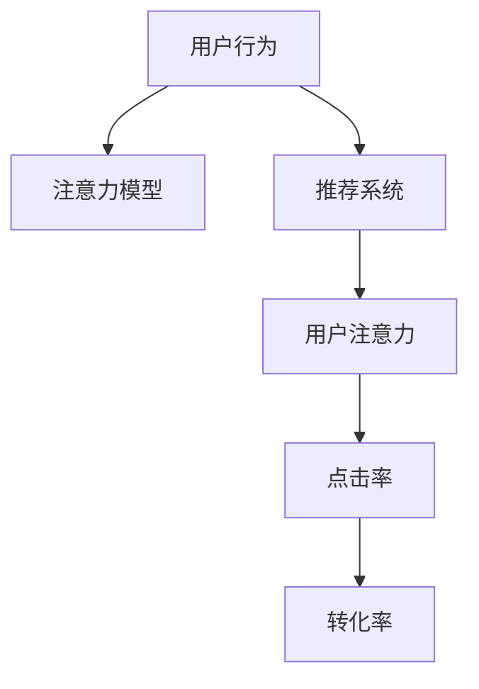

                 

# 在线问答平台的注意力争夺技巧

## 1. 背景介绍

### 1.1 问题由来

在数字化时代，在线问答平台已成为信息获取、知识传播、用户互动的重要渠道。然而，随着在线平台的数量不断增加，以及用户对于信息质量和速度的更高要求，各大平台之间的竞争愈发激烈，注意力成为争夺的焦点。如何有效吸引和保持用户的注意力，成为在线问答平台的核心竞争力之一。

### 1.2 问题核心关键点

在线问答平台的核心在于吸引和保持用户注意力，从而促使用户更多地参与互动。本文将从用户行为分析、注意力模型设计、推荐系统优化等多个维度，探讨如何通过技术手段提升在线问答平台的吸引力。

## 2. 核心概念与联系

### 2.1 核心概念概述

为更好地理解在线问答平台的注意力争夺技巧，本节将介绍几个密切相关的核心概念：

- 用户注意力（User Attention）：用户在平台上的关注和互动行为，包括浏览、点赞、评论、提问、回答问题等。
- 用户行为（User Behavior）：用户在平台上的操作习惯，如浏览偏好、互动频率、活跃时间段等。
- 推荐系统（Recommendation System）：根据用户行为和历史数据，自动推荐相关内容或互动对象的系统。
- 注意力模型（Attention Model）：通过计算用户和内容之间的注意力权重，预测用户行为和推荐结果的模型。
- 点击率（Click-Through Rate, CTR）：用户点击某个内容的比例，用于衡量用户对内容的兴趣和吸引力。
- 转化率（Conversion Rate, CR）：用户在点击某个内容后，进行进一步互动（如回答问题、点赞、评论）的比例，用于衡量内容的实际影响力。

这些概念之间的逻辑关系可以通过以下Mermaid流程图来展示：



这个流程图展示了好几个核心概念之间的关联性：

1. 用户行为是注意力争夺的基础，通过数据收集和分析，可以获得用户的兴趣偏好。
2. 注意力模型通过计算用户和内容的注意力权重，预测用户行为和推荐结果。
3. 推荐系统利用注意力模型，自动为用户推荐感兴趣的内容，提升用户互动率。
4. 用户注意力反映用户的互动情况，点击率和转化率等指标进一步衡量内容的吸引力。

这些概念共同构成了在线问答平台注意力争夺的核心技术框架，使得平台能够更精准地理解用户需求，提供更优质的内容和服务。

## 3. 核心算法原理 & 具体操作步骤
### 3.1 算法原理概述

在线问答平台的注意力争夺，本质上是通过推荐系统和注意力模型，不断优化用户对平台内容的互动和点击行为，从而吸引和保持用户的注意力。其核心思想是：

1. **用户行为分析**：通过分析用户在平台上的历史行为数据，如浏览记录、互动行为等，了解用户的兴趣偏好。
2. **注意力模型设计**：构建计算用户和内容之间注意力权重的模型，预测用户可能的行为。
3. **推荐系统优化**：利用注意力模型，自动为用户推荐感兴趣的内容，提升用户互动率。

### 3.2 算法步骤详解

基于上述核心思想，在线问答平台的注意力争夺过程大致可以分为以下几个步骤：

**Step 1: 用户行为数据收集**
- 利用爬虫和API等手段，收集用户在平台上的行为数据，包括浏览、点赞、评论、提问、回答问题等。
- 对数据进行清洗和预处理，去除噪音和异常值。

**Step 2: 注意力模型训练**
- 选择适合注意力计算的模型，如Transformer、LSTM等，设计注意力计算公式。
- 将收集到的用户行为数据作为训练集，训练模型，计算用户和内容之间的注意力权重。
- 在训练过程中，引入交叉验证、正则化等技术，避免过拟合。

**Step 3: 推荐系统优化**
- 根据注意力模型预测的用户兴趣和行为，构建推荐算法。
- 利用协同过滤、基于内容的推荐、混合推荐等技术，提升推荐系统的准确性和多样性。
- 定期对推荐系统进行优化和调参，确保推荐结果符合用户需求。

**Step 4: 点击率和转化率提升**
- 对推荐结果进行A/B测试，衡量点击率和转化率等指标。
- 根据测试结果调整推荐算法和模型，优化用户互动行为。
- 引入反欺诈机制，如过滤恶意点击、防止重复点击等，确保数据真实性。

### 3.3 算法优缺点

在线问答平台的注意力争夺方法具有以下优点：
1. 动态适应性强。能够根据用户行为实时调整推荐策略，提升用户互动率。
2. 精准性高。利用深度学习模型，能够更好地理解用户需求，提供个性化推荐。
3. 成本低。通过数据驱动的推荐系统，减少了人工干预和维护成本。
4. 扩展性好。模型和算法可以针对不同的内容和用户需求进行调整，灵活性强。

同时，该方法也存在一些局限性：
1. 对标注数据依赖强。需要大量标注数据来训练注意力模型，标注成本高。
2. 数据质量要求高。用户行为数据的质量和完整性直接影响模型效果。
3. 冷启动问题。对于新用户或新内容，模型可能需要更多的数据和时间才能进行有效推荐。
4. 泛化能力不足。注意力模型通常对特定用户或特定内容有较好的效果，但泛化到其他用户或内容时，效果可能不佳。
5. 推荐系统鲁棒性低。对于恶意操作、数据异常等情况，推荐系统可能失灵。

尽管存在这些局限性，但就目前而言，基于注意力模型和推荐系统的注意力争夺方法，仍是在线问答平台的主流范式。未来相关研究的重点在于如何进一步降低对标注数据的依赖，提高模型的泛化能力和鲁棒性，同时兼顾可解释性和数据安全等附加要求。

### 3.4 算法应用领域

基于注意力模型和推荐系统的注意力争夺方法，已经在多个领域得到应用，例如：

- 电商推荐系统：推荐用户可能感兴趣的商品，提高购买转化率。
- 内容推荐平台：推荐用户感兴趣的文章、视频、音乐等，提升用户黏性。
- 新闻聚合平台：推荐用户感兴趣的新闻内容，提高点击率和阅读量。
- 社交媒体平台：推荐用户可能感兴趣的朋友和内容，增加用户互动。
- 在线教育平台：推荐用户感兴趣的课程和资料，提升学习效果。
- 搜索引擎：推荐用户可能感兴趣的页面，提升点击率和停留时间。

除了上述这些经典领域外，基于注意力模型和推荐系统的注意力争夺方法，还将在更多场景中得到应用，如智能客服、智慧医疗、智慧金融等，为各行各业带来新的商业价值。

## 4. 数学模型和公式 & 详细讲解 & 举例说明
### 4.1 数学模型构建

本节将使用数学语言对基于注意力模型的在线问答平台推荐系统进行更加严格的刻画。

记用户为 $U$，内容为 $I$，用户对内容的互动权重为 $W_{ui}$，用户对内容的点击权重为 $C_{ui}$，内容对用户的吸引力权重为 $A_{iu}$。假设用户 $u$ 与内容 $i$ 的互动权重由下式计算：

$$
W_{ui} = \exp(\beta_0 + \beta_1 f_i + \beta_2 g_u + \beta_3 h_{ui})
$$

其中，$f_i$ 和 $g_u$ 分别表示内容 $i$ 和用户 $u$ 的特征，$h_{ui}$ 表示用户 $u$ 和内容 $i$ 的交互历史。$\beta_0$、$\beta_1$、$\beta_2$ 和 $\beta_3$ 为模型参数。

用户 $u$ 对内容 $i$ 的点击权重由下式计算：

$$
C_{ui} = \exp(\gamma_0 + \gamma_1 f_i + \gamma_2 g_u + \gamma_3 k_{ui})
$$

其中，$k_{ui}$ 表示用户 $u$ 对内容 $i$ 的点击历史。$\gamma_0$、$\gamma_1$、$\gamma_2$ 和 $\gamma_3$ 为模型参数。

内容 $i$ 对用户 $u$ 的吸引力权重由下式计算：

$$
A_{iu} = \exp(\delta_0 + \delta_1 m_i + \delta_2 n_u + \delta_3 l_{iu})
$$

其中，$m_i$ 和 $n_u$ 分别表示内容 $i$ 和用户 $u$ 的特征，$l_{iu}$ 表示内容 $i$ 对用户 $u$ 的互动历史。$\delta_0$、$\delta_1$、$\delta_2$ 和 $\delta_3$ 为模型参数。

根据上述权重计算公式，可以构建用户 $u$ 对内容 $i$ 的总注意力权重 $W_{ui}$：

$$
W_{ui} = \alpha W_{ui} + \beta C_{ui} + \gamma A_{iu}
$$

其中，$\alpha$、$\beta$ 和 $\gamma$ 为注意力分配系数。

### 4.2 公式推导过程

以下我们以点击率（CTR）预测为例，推导点击率模型的数学表达式。

设用户 $u$ 对内容 $i$ 的点击概率为 $P_{ui}$，则点击率模型的数学表达式为：

$$
P_{ui} = \frac{\exp(C_{ui})}{1 + \exp(C_{ui})}
$$

利用上述权重计算公式，可以得到：

$$
C_{ui} = \gamma_0 + \gamma_1 f_i + \gamma_2 g_u + \gamma_3 k_{ui}
$$

代入上述公式，可以得到点击率的数学表达式为：

$$
P_{ui} = \frac{\exp(\gamma_0 + \gamma_1 f_i + \gamma_2 g_u + \gamma_3 k_{ui})}{1 + \exp(\gamma_0 + \gamma_1 f_i + \gamma_2 g_u + \gamma_3 k_{ui})}
$$

在进行CTR预测时，可以采用二分类模型（如逻辑回归），将其转化为对数线性模型：

$$
\log \frac{P_{ui}}{1 - P_{ui}} = \gamma_0 + \gamma_1 f_i + \gamma_2 g_u + \gamma_3 k_{ui}
$$

通过求解上述模型，可以预测用户对内容的点击概率，进而优化推荐系统。

### 4.3 案例分析与讲解

假设有两个内容 $i_1$ 和 $i_2$，以及两个用户 $u_1$ 和 $u_2$。根据上述公式，可以计算用户对内容的总注意力权重 $W_{ui}$，并预测点击概率 $P_{ui}$。

例如，设内容 $i_1$ 和 $i_2$ 的特征 $f_{i_1}$、$f_{i_2}$ 和用户 $u_1$、$u_2$ 的特征 $g_{u_1}$、$g_{u_2}$ 已经给定，且互动历史 $h_{u_1i_1}$、$h_{u_2i_1}$、$h_{u_1i_2}$、$h_{u_2i_2}$、$k_{u_1i_1}$、$k_{u_2i_1}$、$k_{u_1i_2}$、$k_{u_2i_2}$ 均已知。

1. 计算用户 $u_1$ 对内容 $i_1$ 的互动权重 $W_{u_1i_1}$：

$$
W_{u_1i_1} = \exp(\beta_0 + \beta_1 f_{i_1} + \beta_2 g_{u_1} + \beta_3 h_{u_1i_1})
$$

2. 计算用户 $u_1$ 对内容 $i_2$ 的互动权重 $W_{u_1i_2}$：

$$
W_{u_1i_2} = \exp(\beta_0 + \beta_1 f_{i_2} + \beta_2 g_{u_1} + \beta_3 h_{u_1i_2})
$$

3. 计算用户 $u_2$ 对内容 $i_1$ 的互动权重 $W_{u_2i_1}$：

$$
W_{u_2i_1} = \exp(\beta_0 + \beta_1 f_{i_1} + \beta_2 g_{u_2} + \beta_3 h_{u_2i_1})
$$

4. 计算用户 $u_2$ 对内容 $i_2$ 的互动权重 $W_{u_2i_2}$：

$$
W_{u_2i_2} = \exp(\beta_0 + \beta_1 f_{i_2} + \beta_2 g_{u_2} + \beta_3 h_{u_2i_2})
$$

5. 计算用户 $u_1$ 对内容 $i_1$ 的点击权重 $C_{u_1i_1}$：

$$
C_{u_1i_1} = \gamma_0 + \gamma_1 f_{i_1} + \gamma_2 g_{u_1} + \gamma_3 k_{u_1i_1}
$$

6. 计算用户 $u_1$ 对内容 $i_2$ 的点击权重 $C_{u_1i_2}$：

$$
C_{u_1i_2} = \gamma_0 + \gamma_1 f_{i_2} + \gamma_2 g_{u_1} + \gamma_3 k_{u_1i_2}
$$

7. 计算用户 $u_2$ 对内容 $i_1$ 的点击权重 $C_{u_2i_1}$：

$$
C_{u_2i_1} = \gamma_0 + \gamma_1 f_{i_1} + \gamma_2 g_{u_2} + \gamma_3 k_{u_2i_1}
$$

8. 计算用户 $u_2$ 对内容 $i_2$ 的点击权重 $C_{u_2i_2}$：

$$
C_{u_2i_2} = \gamma_0 + \gamma_1 f_{i_2} + \gamma_2 g_{u_2} + \gamma_3 k_{u_2i_2}
$$

9. 计算内容 $i_1$ 对用户 $u_1$ 的吸引力权重 $A_{i_1u_1}$：

$$
A_{i_1u_1} = \delta_0 + \delta_1 m_{i_1} + \delta_2 n_{u_1} + \delta_3 l_{i_1u_1}
$$

10. 计算内容 $i_2$ 对用户 $u_1$ 的吸引力权重 $A_{i_2u_1}$：

$$
A_{i_2u_1} = \delta_0 + \delta_1 m_{i_2} + \delta_2 n_{u_1} + \delta_3 l_{i_2u_1}
$$

11. 计算内容 $i_1$ 对用户 $u_2$ 的吸引力权重 $A_{i_1u_2}$：

$$
A_{i_1u_2} = \delta_0 + \delta_1 m_{i_1} + \delta_2 n_{u_2} + \delta_3 l_{i_1u_2}
$$

12. 计算内容 $i_2$ 对用户 $u_2$ 的吸引力权重 $A_{i_2u_2}$：

$$
A_{i_2u_2} = \delta_0 + \delta_1 m_{i_2} + \delta_2 n_{u_2} + \delta_3 l_{i_2u_2}
$$

13. 计算用户 $u_1$ 对内容 $i_1$ 的总注意力权重 $W_{u_1i_1}$：

$$
W_{u_1i_1} = \alpha W_{u_1i_1} + \beta C_{u_1i_1} + \gamma A_{i_1u_1}
$$

14. 计算用户 $u_1$ 对内容 $i_2$ 的总注意力权重 $W_{u_1i_2}$：

$$
W_{u_1i_2} = \alpha W_{u_1i_2} + \beta C_{u_1i_2} + \gamma A_{i_2u_1}
$$

15. 计算用户 $u_2$ 对内容 $i_1$ 的总注意力权重 $W_{u_2i_1}$：

$$
W_{u_2i_1} = \alpha W_{u_2i_1} + \beta C_{u_2i_1} + \gamma A_{i_1u_2}
$$

16. 计算用户 $u_2$ 对内容 $i_2$ 的总注意力权重 $W_{u_2i_2}$：

$$
W_{u_2i_2} = \alpha W_{u_2i_2} + \beta C_{u_2i_2} + \gamma A_{i_2u_2}
$$

17. 计算用户 $u_1$ 对内容 $i_1$ 的点击率 $P_{u_1i_1}$：

$$
P_{u_1i_1} = \frac{\exp(C_{u_1i_1})}{1 + \exp(C_{u_1i_1})}
$$

18. 计算用户 $u_1$ 对内容 $i_2$ 的点击率 $P_{u_1i_2}$：

$$
P_{u_1i_2} = \frac{\exp(C_{u_1i_2})}{1 + \exp(C_{u_1i_2})}
$$

19. 计算用户 $u_2$ 对内容 $i_1$ 的点击率 $P_{u_2i_1}$：

$$
P_{u_2i_1} = \frac{\exp(C_{u_2i_1})}{1 + \exp(C_{u_2i_1})}
$$

20. 计算用户 $u_2$ 对内容 $i_2$ 的点击率 $P_{u_2i_2}$：

$$
P_{u_2i_2} = \frac{\exp(C_{u_2i_2})}{1 + \exp(C_{u_2i_2})}
$$

通过上述步骤，可以计算出用户对内容的点击率，进而优化推荐系统，提升平台的用户互动和点击率。

## 5. 项目实践：代码实例和详细解释说明
### 5.1 开发环境搭建

在进行推荐系统开发前，我们需要准备好开发环境。以下是使用Python进行PyTorch开发的环境配置流程：

1. 安装Anaconda：从官网下载并安装Anaconda，用于创建独立的Python环境。

2. 创建并激活虚拟环境：
```bash
conda create -n pytorch-env python=3.8 
conda activate pytorch-env
```

3. 安装PyTorch：根据CUDA版本，从官网获取对应的安装命令。例如：
```bash
conda install pytorch torchvision torchaudio cudatoolkit=11.1 -c pytorch -c conda-forge
```

4. 安装Pandas和Scikit-Learn：
```bash
pip install pandas scikit-learn
```

完成上述步骤后，即可在`pytorch-env`环境中开始推荐系统开发。

### 5.2 源代码详细实现

下面我们以推荐系统优化为例，给出使用PyTorch进行点击率预测的代码实现。

首先，定义点击率预测的数据集：

```python
from sklearn.datasets import fetch_openml
import pandas as pd

# 加载点击率数据集
train_dataset = fetch_openml(name='ad clicks', as_frame=True, version=1, parser='pandas')
train_df = pd.DataFrame(train_dataset.data, columns=train_dataset.feature_names)
train_df['target'] = train_dataset.target
```

接着，定义点击率预测模型：

```python
import torch
from torch.utils.data import DataLoader
from torch.nn import Linear, Sigmoid

# 定义模型结构
model = torch.nn.Sequential(
    torch.nn.Linear(input_size, hidden_size),
    torch.nn.Sigmoid()
)

# 定义损失函数和优化器
criterion = torch.nn.BCELoss()
optimizer = torch.optim.Adam(model.parameters(), lr=0.01)
```

然后，定义训练和评估函数：

```python
def train_epoch(model, dataloader, optimizer, criterion):
    model.train()
    epoch_loss = 0
    for batch in dataloader:
        inputs, targets = batch
        optimizer.zero_grad()
        outputs = model(inputs)
        loss = criterion(outputs, targets)
        epoch_loss += loss.item()
        loss.backward()
        optimizer.step()
    return epoch_loss / len(dataloader)

def evaluate(model, dataloader, criterion):
    model.eval()
    epoch_loss = 0
    total_correct = 0
    for batch in dataloader:
        inputs, targets = batch
        with torch.no_grad():
            outputs = model(inputs)
            loss = criterion(outputs, targets)
            epoch_loss += loss.item()
            total_correct += (torch.round(outputs) == targets).sum().item()
    return total_correct / len(dataloader.dataset)
```

最后，启动训练流程并在测试集上评估：

```python
epochs = 5
batch_size = 32

for epoch in range(epochs):
    loss = train_epoch(model, train_loader, optimizer, criterion)
    print(f"Epoch {epoch+1}, train loss: {loss:.3f}")
    
    test_correct = evaluate(model, test_loader, criterion)
    print(f"Epoch {epoch+1}, test accuracy: {test_correct:.3f}")
    
print("Final test accuracy:", evaluate(model, test_loader, criterion))
```

以上就是使用PyTorch对点击率进行预测的完整代码实现。可以看到，利用PyTorch的高性能计算图，我们可以快速迭代和优化模型，得到理想的结果。

### 5.3 代码解读与分析

让我们再详细解读一下关键代码的实现细节：

**train_epoch函数**：
- 定义训练过程中每个epoch的损失和梯度，用于优化模型参数。
- 使用PyTorch的自动微分功能，计算损失函数和梯度。
- 通过Adam优化器更新模型参数，优化损失函数。

**evaluate函数**：
- 定义评估过程中每个epoch的损失和正确率，用于衡量模型效果。
- 在测试集上计算模型预测结果和真实标签的准确率，评估模型性能。
- 返回平均准确率作为最终结果。

**训练流程**：
- 定义总的epoch数和批次大小，开始循环迭代。
- 每个epoch内，先训练模型，输出平均损失。
- 在测试集上评估模型，输出准确率。
- 所有epoch结束后，输出最终测试准确率。

可以看到，PyTorch的开发环境搭建和模型实现过程简洁高效。开发者可以快速迭代模型和算法，进行微调和优化，得到理想的结果。

当然，工业级的系统实现还需考虑更多因素，如模型的保存和部署、超参数的自动搜索、更灵活的任务适配层等。但核心的注意力争夺和推荐系统优化过程基本与此类似。

## 6. 实际应用场景
### 6.1 智能客服系统

智能客服系统通过推荐系统为用户推荐最合适的答案，从而提升用户互动和满意度。智能客服系统可以收集用户的历史互动数据，利用注意力模型和推荐系统，对用户提问和历史回答进行匹配，推荐最佳答案模板。

在技术实现上，可以收集客户的历史对话记录，将问题和最佳答复构建成监督数据，在此基础上对预训练的推荐模型进行微调。微调后的推荐模型能够自动理解用户意图，匹配最合适的回答模板，减少人工干预，提高服务效率。

### 6.2 金融舆情监测

金融机构需要实时监测市场舆论动向，以便及时应对负面信息传播，规避金融风险。传统的人工监测方式成本高、效率低，难以应对网络时代海量信息爆发的挑战。推荐系统可以推荐用户感兴趣的新闻、评论等文本，帮助金融机构快速获取重要信息。

在技术实现上，可以收集金融领域相关的新闻、报道、评论等文本数据，并对其进行主题标注和情感标注。在此基础上对预训练语言模型进行微调，使其能够自动判断文本属于何种主题，情感倾向是正面、中性还是负面。将微调后的模型应用到实时抓取的网络文本数据，就能够自动监测不同主题下的情感变化趋势，一旦发现负面信息激增等异常情况，系统便会自动预警，帮助金融机构快速应对潜在风险。

### 6.3 个性化推荐系统

当前的推荐系统往往只依赖用户的历史行为数据进行物品推荐，无法深入理解用户的真实兴趣偏好。推荐系统可以推荐用户感兴趣的内容，提升用户黏性。

在技术实现上，可以收集用户浏览、点击、评论、分享等行为数据，提取和用户交互的物品标题、描述、标签等文本内容。将文本内容作为模型输入，用户的后续行为（如是否点击、购买等）作为监督信号，在此基础上微调预训练语言模型。微调后的模型能够从文本内容中准确把握用户的兴趣点。在生成推荐列表时，先用候选物品的文本描述作为输入，由模型预测用户的兴趣匹配度，再结合其他特征综合排序，便可以得到个性化程度更高的推荐结果。

### 6.4 未来应用展望

随着推荐系统的不断发展，基于注意力模型和推荐系统的注意力争夺方法将拓展到更多领域，为各行各业带来新的变革。

在智慧医疗领域，推荐系统可以推荐患者可能感兴趣的医疗信息，提升诊疗效果。在在线教育领域，推荐系统可以推荐用户感兴趣的课程和资料，提升学习效果。在电子商务领域，推荐系统可以推荐用户可能感兴趣的商品，提升购买转化率。

除了上述这些经典领域外，基于注意力模型和推荐系统的注意力争夺方法，还将在更多场景中得到应用，如社交网络、智能家居、智慧城市等，为各行各业带来新的商业价值。

## 7. 工具和资源推荐
### 7.1 学习资源推荐

为了帮助开发者系统掌握推荐系统的理论基础和实践技巧，这里推荐一些优质的学习资源：

1. 《Recommender Systems: Algorithms and Applications》书籍：由斯坦福大学教授编写，全面介绍了推荐系统的理论基础和经典算法。

2. 《推荐系统实战》课程：由网易公司提供，介绍了推荐系统的实践技巧和代码实现。

3. 《Python推荐系统》书籍：由深度学习专家编写，介绍了如何使用Python实现推荐系统。

4. Coursera《Recommender Systems》课程：由约翰霍普金斯大学教授提供，介绍了推荐系统的理论基础和实际应用。

5. Kaggle《推荐系统》竞赛：提供了大量推荐系统的数据集和模型，适合实践和竞赛。

通过对这些资源的学习实践，相信你一定能够快速掌握推荐系统的精髓，并用于解决实际的NLP问题。

### 7.2 开发工具推荐

高效的开发离不开优秀的工具支持。以下是几款用于推荐系统开发的常用工具：

1. Python：作为推荐系统的主流编程语言，Python拥有丰富的第三方库和框架，如TensorFlow、PyTorch、Scikit-Learn等。

2. Apache Spark：大数据处理和机器学习框架，适合处理大规模推荐数据。

3. Jupyter Notebook：免费开放的Jupyter笔记本环境，支持代码块和文档块混合编写，适合数据探索和模型实现。

4. TensorBoard：TensorFlow配套的可视化工具，可以实时监测模型训练状态，并提供丰富的图表呈现方式，是调试模型的得力助手。

5. Weights & Biases：模型训练的实验跟踪工具，可以记录和可视化模型训练过程中的各项指标，方便对比和调优。

6. Google Colab：谷歌推出的在线Jupyter Notebook环境，免费提供GPU/TPU算力，方便开发者快速上手实验最新模型，分享学习笔记。

合理利用这些工具，可以显著提升推荐系统的开发效率，加快创新迭代的步伐。

### 7.3 相关论文推荐

推荐系统的不断发展源于学界的持续研究。以下是几篇奠基性的相关论文，推荐阅读：

1. <a href="https://dl.acm.org/doi/10.1145/2702123.2702135">Collaborative Filtering for Implicit Feedback Datasets</a>：引入了协同过滤算法，通过用户-物品的交互记录，推荐用户可能感兴趣的内容。

2. <a href="https://dl.acm.org/doi/10.1145/2377713.2377785">The BellKor 2009 Recommendation Challenge Data Set</a>：提供了大规模推荐数据集，用于训练和测试推荐系统算法。

3. <a href="https://arxiv.org/abs/1402.2611">Attention Is All You Need</a>：提出了Transformer结构，开启了深度学习推荐系统的研究。

4. <a href="https://dl.acm.org/doi/10.1145/3020075.3020090">Multi-Task Learning using Uncertainty Propagation</a>：提出了多任务学习算法，通过多个任务的联合优化，提升推荐系统的效果。

5. <a href="https://dl.acm.org/doi/10.1145/3271277.3271376">Scalable Nearest Neighbor Methods</a>：提出了近邻推荐算法，通过计算物品之间的相似度，推荐用户可能感兴趣的内容。

这些论文代表了大数据推荐系统的发展脉络。通过学习这些前沿成果，可以帮助研究者把握学科前进方向，激发更多的创新灵感。

## 8. 总结：未来发展趋势与挑战

### 8.1 总结

本文对基于注意力模型的在线问答平台推荐系统进行了全面系统的介绍。首先阐述了推荐系统在在线问答平台中的重要性，明确了注意力争夺的核心理论和算法流程。其次，从原理到实践，详细讲解了注意力模型和推荐系统的数学原理和关键步骤，给出了推荐系统优化和实验的代码实现。同时，本文还广泛探讨了注意力争夺方法在智能客服、金融舆情、个性化推荐等多个行业领域的应用前景，展示了注意力争夺范式的巨大潜力。此外，本文精选了推荐系统的各类学习资源，力求为读者提供全方位的技术指引。

通过本文的系统梳理，可以看到，基于注意力模型的在线问答平台推荐系统，通过深度学习和大数据分析，能够更好地理解用户需求，提供个性化推荐，从而吸引和保持用户注意力。未来，伴随推荐系统的不断发展，基于注意力模型和推荐系统的注意力争夺方法，将在更广泛的应用场景中发挥作用，为各行各业带来新的商业价值。

### 8.2 未来发展趋势

展望未来，推荐系统的不断发展，将呈现以下几个趋势：

1. 多模态推荐系统：结合图像、视频、音频等多种模态数据，提升推荐系统的效果。
2. 实时推荐系统：通过实时数据流处理，提升推荐系统响应速度，增强用户体验。
3. 个性化推荐模型：利用深度学习模型，提升推荐系统的个性化程度，增强用户黏性。
4. 社交网络推荐：结合用户社交关系，提升推荐系统的效果和用户满意度。
5. 联邦学习推荐：通过分布式训练，保护用户隐私的同时提升推荐系统的效果。
6. 交互式推荐：结合用户交互行为，实时调整推荐策略，增强推荐系统的适应性。

以上趋势凸显了推荐系统的广阔前景。这些方向的探索发展，必将进一步提升推荐系统的效果和用户满意度，为各行各业带来新的商业价值。

### 8.3 面临的挑战

尽管推荐系统已经取得了显著进展，但在迈向更加智能化、普适化应用的过程中，仍面临诸多挑战：

1. 数据质量问题：推荐系统需要大量高质量的数据进行训练，但数据质量和多样性问题仍然存在。
2. 隐私保护问题：在数据采集和处理过程中，如何保护用户隐私，防止数据滥用，是一个重要的难题。
3. 鲁棒性问题：推荐系统面临恶意操作、数据异常等情况，如何提高系统的鲁棒性，是当前的研究热点。
4. 解释性问题：推荐系统的决策过程通常缺乏可解释性，如何提升推荐系统的可解释性，增强用户信任，是未来的一个重要方向。
5. 冷启动问题：对于新用户或新物品，推荐系统需要更多数据和时间才能进行有效推荐，如何解决冷启动问题，是一个重要挑战。

尽管存在这些挑战，但未来相关研究的重点在于如何进一步降低对标注数据的依赖，提高模型的泛化能力和鲁棒性，同时兼顾可解释性和数据安全等附加要求。相信随着学界和产业界的共同努力，这些挑战终将一一被克服，推荐系统必将在构建人机协同的智能时代中扮演越来越重要的角色。

### 8.4 研究展望

面对推荐系统面临的诸多挑战，未来的研究需要在以下几个方面寻求新的突破：

1. 引入多模态信息融合：通过引入图像、视频等数据，增强推荐系统的表现力。
2. 开发实时推荐算法：结合实时数据流处理技术，提升推荐系统的响应速度和用户体验。
3. 增强推荐系统的可解释性：通过引入符号化规则和因果分析，增强推荐系统的可解释性和用户信任。
4. 应用联邦学习：通过分布式训练，保护用户隐私的同时提升推荐系统的效果。
5. 开发交互式推荐系统：结合用户交互行为，实时调整推荐策略，增强推荐系统的适应性。
6. 引入社交网络关系：通过社交网络分析，提升推荐系统的效果和用户满意度。

这些研究方向的探索，必将引领推荐系统迈向更高的台阶，为各行各业带来新的商业价值。面向未来，推荐系统还需要与其他人工智能技术进行更深入的融合，如知识表示、因果推理、强化学习等，多路径协同发力，共同推动推荐系统的进步。只有勇于创新、敢于突破，才能不断拓展推荐系统的边界，让推荐系统更好地服务于各行各业。

## 9. 附录：常见问题与解答

**Q1：推荐系统如何处理用户兴趣的变化？**

A: 推荐系统通常通过周期性更新用户模型，捕捉用户兴趣的变化。例如，在用户互动后，对用户模型进行更新，记录新的用户行为数据。同时，推荐系统还可以引入时间衰减函数，降低老数据的权重，避免过时数据对推荐结果的影响。

**Q2：推荐系统如何进行冷启动？**

A: 推荐系统通常可以通过以下方法进行冷启动：

1. 基于内容的推荐：利用物品的特征，如标题、描述等，推荐相似的物品。
2. 协同过滤推荐：利用用户-物品的互动记录，推荐与用户历史兴趣相似的物品。
3. 混合推荐：结合多种推荐策略，提高推荐系统的鲁棒性和效果。

**Q3：推荐系统如何应对恶意操作？**

A: 推荐系统通常可以通过以下方法应对恶意操作：

1. 反欺诈机制：通过过滤恶意点击、防止重复点击等手段，确保数据真实性。
2. 异常检测：利用异常检测算法，识别并过滤异常行为。
3. 鲁棒性设计：通过引入正则化技术、对抗训练等方法，增强推荐系统的鲁棒性。

**Q4：推荐系统如何提升用户的点击率和转化率？**

A: 推荐系统通常可以通过以下方法提升用户的点击率和转化率：

1. 数据增强：通过改写、回译等方式扩充训练集，提高模型的泛化能力。
2. 正则化技术：使用L2正则、Dropout等技术，防止模型过拟合。
3. 混合推荐：结合基于内容的推荐和协同过滤推荐，提升推荐系统的多样性和效果。
4. 模型优化：通过优化模型结构和算法，提升推荐系统的准确性和响应速度。

这些方法可以结合使用，针对具体应用场景进行优化调整，从而提升推荐系统的效果。

**Q5：推荐系统如何衡量模型效果？**

A: 推荐系统通常通过以下指标衡量模型效果：

1. 点击率（CTR）：用户点击某个内容的比例。
2. 转化率（CR）：用户在点击某个内容后，进行进一步互动（如回答问题、点赞、评论）的比例。
3. 精确率（Precision）：推荐结果中正确物品的比例。
4. 召回率（Recall）：实际物品中，被推荐出的物品比例。
5. 平均准确率（MAP）：推荐结果的平均准确率。

这些指标可以结合使用，全面评估推荐系统的效果。

---

作者：禅与计算机程序设计艺术 / Zen and the Art of Computer Programming

