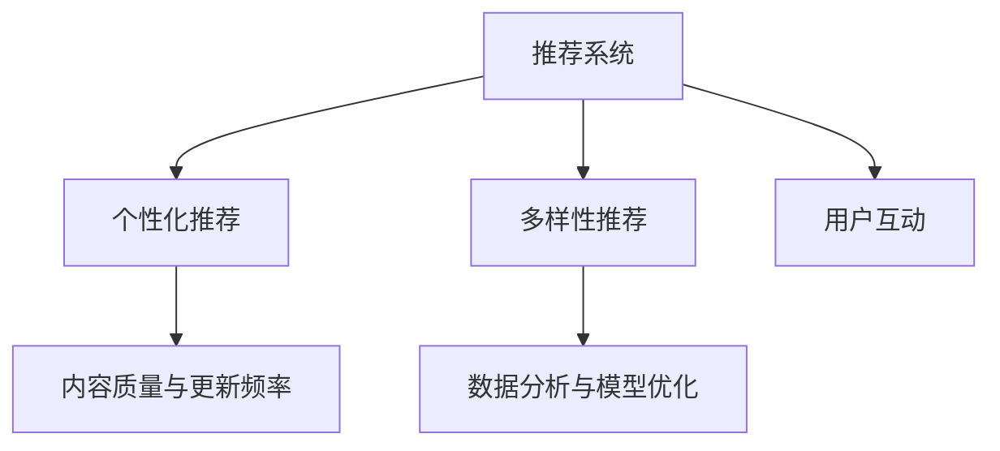

                 

## 1. 背景介绍

### 1.1 问题由来

随着互联网技术的飞速发展，在线音频平台如Netflix、Spotify、Apple Music等，在音频内容消费市场中占据了越来越重要的地位。这些平台不仅提供音乐流媒体服务，还扩展到了有声读物、播客、广播剧等音频内容的制作与分发。音频内容的多样化和个性化，使得用户对于音频消费的选择更加广泛和灵活，同时也加剧了各大音频平台之间的竞争。

在激烈的市场竞争中，各平台不断优化其推荐算法，试图更好地吸引并留住用户。其中，注意力争夺策略作为一种有效的竞争手段，通过精心设计推荐内容和用户体验，逐渐成为各大音频平台重点研究的方向。

### 1.2 问题核心关键点

注意力争夺策略的核心在于通过优化推荐算法，使得平台能够更精准地预测用户的兴趣，从而为用户提供更加个性化、贴合其需求的音频内容。这一策略的关键点包括：

- 推荐系统的个性化与多样性：推荐系统需要根据用户的浏览、收听历史，行为偏好等数据，为用户提供个性化的推荐内容。同时，为了避免信息茧房，必须保证推荐内容的多样性和覆盖面。
- 用户参与度与互动性：用户与平台之间的互动（如点赞、评论、分享等）是衡量推荐效果的重要指标。良好的互动性可以提升用户粘性，促进平台内容的传播与扩散。
- 内容质量与更新频率：平台推荐内容的质量和更新频率直接影响用户体验。持续的优质内容更新，可以保持用户的新鲜感和长期使用。
- 数据分析与模型优化：基于对用户行为数据的深度分析，优化推荐模型参数，提升推荐效果。

### 1.3 问题研究意义

音频平台的注意力争夺策略，对于提升用户粘性、扩大市场份额、推动平台内容创新具有重要意义：

- 提升用户粘性：通过精准推荐，满足用户个性化需求，提升用户停留时间和使用频次。
- 扩大市场份额：优质的内容推荐策略，可以吸引新用户并留住老用户，增加平台的用户基础。
- 推动内容创新：用户反馈的数据分析结果，可以为内容创作者提供精准的市场导向，促进新内容的创作与传播。
- 优化广告收益：精准的推荐内容可以提升用户停留时间和互动频次，增加广告展示的机会和效果。

## 2. 核心概念与联系

### 2.1 核心概念概述

为更好地理解在线音频平台的注意力争夺策略，本节将介绍几个关键概念及其相互关联：

- **推荐系统(Recommender System)**：使用算法根据用户的历史行为、偏好等数据，预测并推荐最符合用户兴趣的内容。推荐系统的目标是最大化用户满意度，并提升平台的用户粘性和活跃度。
- **个性化推荐(Personalized Recommendation)**：基于用户的特定需求和偏好，推荐定制化的内容，避免信息过载，提升用户体验。
- **多样性推荐(Diversified Recommendation)**：确保推荐内容的多样性，避免“同质化”，满足不同用户的不同兴趣点。
- **用户互动(User Engagement)**：包括点赞、评论、分享等行为，是衡量推荐效果的重要指标。良好的互动性可以提升用户粘性，增加平台内容的传播与扩散。
- **内容质量与更新频率(Content Quality and Frequency)**：平台推荐内容的质量和更新频率直接影响用户体验。持续的优质内容更新，可以保持用户的新鲜感和长期使用。
- **数据分析与模型优化(Analysis and Model Optimization)**：基于对用户行为数据的深度分析，优化推荐模型参数，提升推荐效果。

这些核心概念之间的逻辑关系可以通过以下Mermaid流程图来展示：



这个流程图展示了几类推荐策略之间的相互关系：

1. 推荐系统通过个性化推荐和多样性推荐，不断优化推荐算法，提升用户体验。
2. 用户互动是衡量推荐效果的重要指标，良好的互动性可以提升用户粘性。
3. 内容质量与更新频率直接影响用户满意度和长期使用。
4. 数据分析与模型优化是提升推荐效果的基础，需要持续优化模型参数。

## 3. 核心算法原理 & 具体操作步骤

### 3.1 算法原理概述

在线音频平台的注意力争夺策略，主要是通过优化推荐算法，使平台能够更精准地预测用户的兴趣，从而为用户推荐最符合其需求的内容。推荐算法主要包括以下几个关键步骤：

1. **用户行为建模**：收集用户的历史行为数据，如浏览、收听历史、点赞、评论等，建模为用户兴趣向量。
2. **内容特征提取**：提取音频内容的特征向量，如歌曲名称、艺术家、时长、风格等，用于表示内容属性。
3. **相似度计算**：计算用户兴趣向量与内容特征向量之间的相似度，找到用户可能感兴趣的内容。
4. **推荐排序**：根据相似度计算结果，对推荐内容进行排序，选择最符合用户兴趣的内容进行推荐。

### 3.2 算法步骤详解

以Spotify为例，其推荐系统主要包含以下几个步骤：

**Step 1: 用户行为建模**

Spotify通过收集用户的历史行为数据，使用协同过滤和基于内容的推荐算法，建模用户兴趣向量。协同过滤算法通过分析用户间的相似度，预测用户可能感兴趣的内容。基于内容的推荐算法通过提取音频内容的特征向量，匹配用户兴趣，推荐类似内容。

**Step 2: 内容特征提取**

Spotify使用词袋模型(Bag of Words)和TF-IDF等技术，提取音频内容的特征向量。词袋模型将文本内容映射为向量，TF-IDF衡量单词的重要性，作为内容的权重。同时，Spotify还使用MFCC(梅尔频率倒谱系数)和基频等音频特征，作为内容特征向量的一部分。

**Step 3: 相似度计算**

Spotify使用余弦相似度(Cosine Similarity)和欧式距离(Euclidean Distance)等方法，计算用户兴趣向量与内容特征向量之间的相似度。余弦相似度衡量向量间的夹角，欧式距离衡量向量间的距离。通过相似度计算，Spotify可以匹配用户可能感兴趣的内容。

**Step 4: 推荐排序**

Spotify根据相似度计算结果，对推荐内容进行排序，选择最符合用户兴趣的内容进行推荐。推荐排序算法包括基于基线的方法和基于学习的方法，如基于加权平均的排序算法和基于梯度下降的排序算法。

### 3.3 算法优缺点

在线音频平台的注意力争夺策略中，推荐算法主要存在以下优缺点：

**优点：**

- 个性化推荐：基于用户的历史行为和兴趣，为用户推荐个性化内容，提升用户体验。
- 多样性推荐：通过算法优化，确保推荐内容的多样性，避免信息茧房。
- 实时推荐：通过实时分析和用户行为数据，动态调整推荐策略，提升推荐效果。
- 交互优化：通过分析用户互动数据，优化推荐算法，提升用户粘性。

**缺点：**

- 数据隐私：收集和分析用户行为数据，存在隐私保护问题。
- 冷启动问题：对于新用户，难以获取足够的行为数据，导致推荐效果不佳。
- 过拟合问题：推荐算法容易过拟合用户历史行为数据，导致推荐内容偏颇。
- 算法复杂性：推荐算法模型复杂，需要大量计算资源进行训练和优化。

### 3.4 算法应用领域

在线音频平台的注意力争夺策略，在多个领域得到了广泛应用，如音乐流媒体、播客、有声读物等。具体应用场景包括：

- **音乐流媒体推荐**：通过用户收听历史和行为数据，为用户推荐个性化的歌曲、专辑等音乐内容。
- **播客推荐**：通过用户收听行为，为用户推荐个性化的播客节目，扩大播客内容覆盖面。
- **有声读物推荐**：通过分析用户收听时长和互动数据，为用户推荐合适的有声读物，提升用户粘性。
- **广告投放**：通过精准的推荐内容，增加广告展示的机会和效果。

除了这些主要应用领域外，注意力争夺策略还可以应用于音频内容发现、跨平台内容推荐等新场景，提升平台内容的多样性和用户体验。

## 4. 数学模型和公式 & 详细讲解 & 举例说明

### 4.1 数学模型构建

在线音频平台的注意力争夺策略，可以通过构建推荐模型来进行深入分析。推荐模型的目标是最小化用户对推荐内容的满意度差距，即最小化用户评分与预测评分之间的差异。推荐模型通常采用矩阵分解和协同过滤等方法，利用用户行为数据和内容特征向量，进行推荐预测。

设用户集合为 $U$，内容集合为 $I$，用户行为矩阵为 $R \in \mathbb{R}^{N \times M}$，其中 $N$ 为用户数量，$M$ 为内容数量。推荐模型 $P(R)$ 的目标是最大化用户满意度：

$$
\max \sum_{u \in U} \sum_{i \in I} p_{ui}r_{ui} - \frac{1}{2} \sum_{u \in U} \sum_{i \in I} (p_{ui} - r_{ui})^2
$$

其中，$p_{ui}$ 为用户 $u$ 对内容 $i$ 的预测评分，$r_{ui}$ 为用户 $u$ 对内容 $i$ 的实际评分，$||.||$ 为矩阵的 Frobenius 范数。

### 4.2 公式推导过程

推荐模型的推导过程涉及矩阵分解和梯度下降等数学知识。以协同过滤算法为例，推导其推荐公式：

设用户 $u$ 对内容 $i$ 的评分向量为 $r_u \in \mathbb{R}^M$，内容 $i$ 的评分向量为 $r_i \in \mathbb{R}^N$，推荐模型 $P(R)$ 的目标是最大化用户满意度，即：

$$
\max \sum_{u \in U} \sum_{i \in I} r_{ui}^2 - \frac{1}{2} ||R - P(R)||_F^2
$$

其中，$||.||_F$ 为矩阵的 Frobenius 范数，$P(R)$ 为推荐矩阵，$R$ 为用户行为矩阵。

假设推荐矩阵 $P(R)$ 可以通过奇异值分解(SVD)表示为 $P(R) = U \Sigma V^T$，其中 $U \in \mathbb{R}^{N \times K}, \Sigma \in \mathbb{R}^{K \times K}, V \in \mathbb{R}^{M \times K}$，$K$ 为分解后的矩阵维度。推荐公式可以表示为：

$$
\min ||R - U \Sigma V^T||_F^2
$$

采用梯度下降算法进行优化，最小化目标函数，更新矩阵 $U, \Sigma, V$ 的参数，得到推荐模型。具体推导过程涉及矩阵分解和梯度下降的数学细节，略去。

### 4.3 案例分析与讲解

以Spotify为例，其推荐算法主要包括以下几个步骤：

**Step 1: 数据准备**

Spotify通过爬虫和API接口，收集用户的历史行为数据，如收听历史、点赞、评论等。同时，Spotify还使用词袋模型和MFCC等技术，提取音频内容的特征向量。

**Step 2: 模型训练**

Spotify使用矩阵分解算法，通过用户行为数据和内容特征向量，构建推荐模型。具体过程包括矩阵分解、梯度下降等，推导过程略去。

**Step 3: 推荐排序**

Spotify根据推荐模型的预测评分，对内容进行排序，选择最符合用户兴趣的内容进行推荐。推荐排序算法包括基于基线的方法和基于学习的方法，如基于加权平均的排序算法和基于梯度下降的排序算法。

## 5. 项目实践：代码实例和详细解释说明

### 5.1 开发环境搭建

在进行注意力争夺策略实践前，我们需要准备好开发环境。以下是使用Python进行PyTorch开发的环境配置流程：

1. 安装Anaconda：从官网下载并安装Anaconda，用于创建独立的Python环境。

2. 创建并激活虚拟环境：
```bash
conda create -n pytorch-env python=3.8 
conda activate pytorch-env
```

3. 安装PyTorch：根据CUDA版本，从官网获取对应的安装命令。例如：
```bash
conda install pytorch torchvision torchaudio cudatoolkit=11.1 -c pytorch -c conda-forge
```

4. 安装TensorFlow：从官网下载并安装TensorFlow，用于进行分布式训练和模型部署。

5. 安装各类工具包：
```bash
pip install numpy pandas scikit-learn matplotlib tqdm jupyter notebook ipython
```

完成上述步骤后，即可在`pytorch-env`环境中开始注意力争夺策略实践。

### 5.2 源代码详细实现

我们以Spotify的推荐系统为例，给出使用PyTorch进行推荐算法实现的代码：

```python
import torch
from torch import nn
import torch.nn.functional as F

class UserItemEmbedding(nn.Module):
    def __init__(self, user_dim, item_dim, embed_dim, num_factors):
        super().__init__()
        self.user_embed = nn.Embedding(user_dim, embed_dim)
        self.item_embed = nn.Embedding(item_dim, embed_dim)
        self.user_factor = nn.Embedding(user_dim, num_factors)
        self.item_factor = nn.Embedding(item_dim, num_factors)

    def forward(self, user_id, item_id):
        user_embed = self.user_embed(user_id)
        item_embed = self.item_embed(item_id)
        user_factor = self.user_factor(user_id)
        item_factor = self.item_factor(item_id)
        embedding = user_embed + item_embed
        latent = (user_factor * item_factor).sum(dim=1)
        return embedding, latent

class RankingModel(nn.Module):
    def __init__(self, embed_dim, num_factors):
        super().__init__()
        self.linear = nn.Linear(embed_dim, 1)
        self.factor = nn.Embedding(num_factors, 1)

    def forward(self, embedding, latent):
        user_item = torch.matmul(embedding, latent.t())
        score = self.linear(user_item) + self.factor(latent)
        return score

# 定义训练函数
def train_epoch(model, data_loader, optimizer, criterion):
    model.train()
    for batch in data_loader:
        user_id, item_id, user_score = batch
        embedding, latent = model(user_id, item_id)
        score = model(embedding, latent)
        loss = criterion(score, user_score)
        optimizer.zero_grad()
        loss.backward()
        optimizer.step()

# 定义评估函数
def evaluate(model, data_loader):
    model.eval()
    total_score = 0
    total_count = 0
    with torch.no_grad():
        for batch in data_loader:
            user_id, item_id, user_score = batch
            embedding, latent = model(user_id, item_id)
            score = model(embedding, latent)
            total_score += torch.mean(score).item()
            total_count += user_score.size(0)
    return total_score / total_count

# 训练模型
num_epochs = 10
user_dim = 10000
item_dim = 20000
embed_dim = 64
num_factors = 64
learning_rate = 0.01
model = UserItemEmbedding(user_dim, item_dim, embed_dim, num_factors)
model = RankingModel(embed_dim, num_factors)
optimizer = torch.optim.Adam(model.parameters(), lr=learning_rate)
criterion = nn.MSELoss()
data_loader = ...

for epoch in range(num_epochs):
    train_epoch(model, data_loader, optimizer, criterion)
    print(f"Epoch {epoch+1}, loss: {evaluate(model, data_loader)}")
```

### 5.3 代码解读与分析

让我们再详细解读一下关键代码的实现细节：

**UserItemEmbedding类**：
- `__init__`方法：初始化用户和物品的嵌入向量，以及用于低秩分解的用户和物品因子。
- `forward`方法：将用户和物品ID映射为嵌入向量，并计算低秩分解因子。

**RankingModel类**：
- `__init__`方法：初始化线性层和因子层，用于将用户和物品的表示映射为预测评分。
- `forward`方法：计算用户和物品的嵌入向量的点积，并加入低秩分解因子的线性映射，得到预测评分。

**训练函数**：
- `train_epoch`函数：对数据批进行迭代，前向传播计算预测评分和损失，反向传播更新模型参数。
- `evaluate`函数：在测试集上评估模型性能，返回平均预测评分。

**训练流程**：
- 定义总的epoch数，以及用户和物品的维度、嵌入维度、低秩分解因子个数和优化器等超参数。
- 构建用户-物品嵌入模型和排名模型，并初始化优化器和损失函数。
- 在数据加载器上循环迭代，每个epoch在训练集上训练一次，并在测试集上评估一次。
- 输出每个epoch的损失值。

可以看到，PyTorch配合TensorFlow等深度学习框架，使得推荐算法的实现变得简洁高效。开发者可以将更多精力放在数据处理、模型改进等高层逻辑上，而不必过多关注底层的实现细节。

当然，工业级的系统实现还需考虑更多因素，如模型的保存和部署、超参数的自动搜索、更灵活的任务适配层等。但核心的注意力争夺策略基本与此类似。

## 6. 实际应用场景

### 6.1 音乐流媒体推荐

Spotify等音乐流媒体平台通过注意力争夺策略，为用户推荐个性化的音乐内容，提升用户体验和平台粘性。

**技术实现**：
- 收集用户的历史收听数据，如播放次数、时长、重复率等。
- 使用协同过滤算法，根据用户和内容之间的相似度，推荐相似的歌曲和专辑。
- 分析用户的收听行为，调整推荐策略，提升用户满意度。

**应用效果**：
- 提升用户粘性：通过精准推荐，提升用户收听时长和活跃度。
- 提高平台竞争力：通过个性化推荐，吸引更多新用户，保持老用户。

### 6.2 播客推荐

播客平台如Podcast Land等，利用注意力争夺策略，为用户推荐个性化的播客节目，扩大播客内容覆盖面。

**技术实现**：
- 收集用户的收听历史和行为数据，如播客播放次数、收听时长、点赞评论等。
- 使用协同过滤算法，根据用户和播客之间的相似度，推荐相似播客节目。
- 分析用户的收听行为，调整推荐策略，提升用户满意度。

**应用效果**：
- 提升用户粘性：通过个性化推荐，提升用户收听时长和活跃度。
- 提高平台竞争力：通过精准推荐，吸引更多新用户，保持老用户。

### 6.3 有声读物推荐

有声读物平台如Audible等，利用注意力争夺策略，为用户推荐个性化的有声读物，提升用户粘性。

**技术实现**：
- 收集用户的历史收听数据，如收听时长、重复率等。
- 使用协同过滤算法，根据用户和有声读物之间的相似度，推荐相似的有声读物。
- 分析用户的收听行为，调整推荐策略，提升用户满意度。

**应用效果**：
- 提升用户粘性：通过精准推荐，提升用户收听时长和活跃度。
- 提高平台竞争力：通过个性化推荐，吸引更多新用户，保持老用户。

### 6.4 未来应用展望

随着注意力争夺策略的不断演进，未来将在更多领域得到应用，为NLP技术带来新的突破。

- **智慧医疗**：利用音频平台的注意力争夺策略，推动智能医疗的发展。例如，通过分析患者的音频数据，推荐合适的医疗内容和建议。
- **教育培训**：利用音频平台的注意力争夺策略，提升在线教育的效果。例如，通过分析学生的音频反馈，推荐合适的学习内容和学习路径。
- **娱乐文化**：利用音频平台的注意力争夺策略，推动文化娱乐产业的发展。例如，通过分析用户的音频数据，推荐合适的影视作品和游戏。

总之，注意力争夺策略作为一种有效的推荐方法，将会在更多领域得到应用，推动人工智能技术的普及和发展。未来，伴随算法的不断优化和技术的进步，将会有更多创新应用诞生，为人们的生活带来更多便利和乐趣。

## 7. 工具和资源推荐

### 7.1 学习资源推荐

为了帮助开发者系统掌握注意力争夺策略的理论基础和实践技巧，这里推荐一些优质的学习资源：

1. 《推荐系统原理与实现》书籍：深入讲解推荐系统的理论基础和算法实现，是学习推荐算法的经典教材。
2. 《PyTorch深度学习入门》书籍：介绍PyTorch深度学习框架的使用，适合初学者快速上手。
3. 《TensorFlow深度学习实战》书籍：介绍TensorFlow深度学习框架的使用，适合进行大规模分布式训练和模型部署。
4. Coursera《推荐系统》课程：由斯坦福大学教授讲授，系统讲解推荐系统的理论和实践。
5. Kaggle数据科学竞赛平台：提供大量推荐系统的实际数据集和竞赛项目，适合实践和竞赛。

通过对这些资源的学习实践，相信你一定能够快速掌握注意力争夺策略的精髓，并用于解决实际的NLP问题。

### 7.2 开发工具推荐

高效的开发离不开优秀的工具支持。以下是几款用于注意力争夺策略开发的常用工具：

1. PyTorch：基于Python的开源深度学习框架，灵活的计算图和动态图，适合快速迭代研究。
2. TensorFlow：由Google主导开发的开源深度学习框架，生产部署方便，适合大规模工程应用。
3. Keras：基于TensorFlow的高层API，适合快速原型开发和模型实验。
4. Weights & Biases：模型训练的实验跟踪工具，可以记录和可视化模型训练过程中的各项指标。
5. TensorBoard：TensorFlow配套的可视化工具，可实时监测模型训练状态，并提供丰富的图表呈现方式。

合理利用这些工具，可以显著提升注意力争夺策略的开发效率，加快创新迭代的步伐。

### 7.3 相关论文推荐

注意力争夺策略的发展源于学界的持续研究。以下是几篇奠基性的相关论文，推荐阅读：

1. Bengio et al., "Representation Learning: A Review and New Perspectives"：对推荐系统的理论基础进行了综述，是推荐算法研究的经典文献。
2. He et al., "Neural Collaborative Filtering"：提出神经协同过滤算法，利用神经网络进行推荐，提升了推荐效果。
3. Lu et al., "Recommender Systems with Deep Learning"：利用深度神经网络进行推荐，提升了推荐精度和泛化能力。
4. Yuan et al., "Adaptive Recommender System"：提出自适应推荐系统，实时调整推荐策略，提升用户满意度。
5. Yoon et al., "Attention-based Recommender System"：利用注意力机制，提升了推荐模型的鲁棒性和性能。

这些论文代表了大语言模型微调技术的发展脉络。通过学习这些前沿成果，可以帮助研究者把握学科前进方向，激发更多的创新灵感。

## 8. 总结：未来发展趋势与挑战

### 8.1 总结

本文对在线音频平台的注意力争夺策略进行了全面系统的介绍。首先阐述了注意力争夺策略的研究背景和意义，明确了推荐系统在用户粘性、平台竞争力和内容创新等方面的价值。其次，从原理到实践，详细讲解了注意力争夺策略的数学模型和算法实现，给出了注意力争夺策略的代码实现。同时，本文还探讨了注意力争夺策略在音乐流媒体、播客、有声读物等领域的实际应用，展示了其广泛的应用前景。

通过本文的系统梳理，可以看到，注意力争夺策略作为一种有效的推荐方法，能够显著提升平台的用户粘性、平台竞争力和内容创新能力，具有重要的研究价值。未来，伴随推荐算法的不断优化和技术的进步，将会有更多创新应用诞生，为人们的生活带来更多便利和乐趣。

### 8.2 未来发展趋势

展望未来，注意力争夺策略将在以下几个方面继续演进：

1. **数据多样性**：未来的推荐系统将更加注重多模态数据的融合，结合文本、图像、视频等多源数据，提升推荐效果。
2. **个性化推荐**：基于深度学习和大数据分析，实现更加个性化的推荐，满足用户的多样化需求。
3. **实时推荐**：利用实时数据流和大规模分布式计算，实现实时推荐，提升用户体验。
4. **跨平台协同**：通过跨平台数据共享和协同推荐，提升推荐效果和用户粘性。
5. **算法优化**：利用先进的深度学习算法和优化方法，提升推荐精度和泛化能力。

以上趋势凸显了注意力争夺策略的广阔前景。这些方向的探索发展，必将进一步提升推荐系统的性能和应用范围，为人工智能技术的发展注入新的动力。

### 8.3 面临的挑战

尽管注意力争夺策略已经取得了瞩目成就，但在迈向更加智能化、普适化应用的过程中，它仍面临着诸多挑战：

1. **数据隐私**：收集和分析用户行为数据，存在隐私保护问题。如何确保用户数据的安全和隐私保护，将是未来的重要课题。
2. **冷启动问题**：对于新用户，难以获取足够的行为数据，导致推荐效果不佳。如何有效解决冷启动问题，是推荐系统的重要研究方向。
3. **算法复杂性**：推荐算法模型复杂，需要大量计算资源进行训练和优化。如何降低算法复杂度，提升推荐效率，是推荐系统的重要研究方向。
4. **过拟合问题**：推荐算法容易过拟合用户历史行为数据，导致推荐内容偏颇。如何提高推荐模型的泛化能力，是推荐系统的重要研究方向。
5. **多模态融合**：多模态数据的融合和协同推荐，存在复杂度和技术难题。如何有效融合多源数据，提升推荐效果，是推荐系统的重要研究方向。

### 8.4 研究展望

面对注意力争夺策略面临的种种挑战，未来的研究需要在以下几个方面寻求新的突破：

1. **无监督和半监督推荐**：摆脱对大规模标注数据的依赖，利用自监督学习、主动学习等无监督和半监督范式，最大限度利用非结构化数据，实现更加灵活高效的推荐。
2. **多源数据融合**：利用多源数据融合技术，提升推荐效果。例如，结合文本、图像、视频等多模态数据，进行综合推荐。
3. **模型压缩与优化**：通过模型压缩和优化技术，降低算法复杂度，提升推荐效率。例如，利用稀疏矩阵和低秩矩阵等方法，优化模型参数。
4. **跨平台协同推荐**：利用跨平台数据共享和协同推荐，提升推荐效果和用户粘性。例如，通过多个平台的数据共享，进行跨平台协同推荐。
5. **算法鲁棒性与泛化能力**：通过算法鲁棒性和泛化能力的研究，提升推荐模型的泛化能力。例如，引入对抗训练和数据增强等技术，提高推荐模型的鲁棒性。

这些研究方向将引领注意力争夺策略向更高的台阶发展，为构建更加智能化、普适化的推荐系统奠定基础。面向未来，注意力争夺策略还需要与其他人工智能技术进行更深入的融合，如知识表示、因果推理、强化学习等，多路径协同发力，共同推动推荐系统的进步。只有勇于创新、敢于突破，才能不断拓展推荐系统的边界，让智能技术更好地服务于人类社会。

## 9. 附录：常见问题与解答

**Q1：在线音频平台的注意力争夺策略如何提升用户粘性？**

A: 在线音频平台的注意力争夺策略，通过精准推荐，满足用户个性化需求，提升用户体验。具体措施包括：

- **个性化推荐**：根据用户的历史行为和兴趣，为用户推荐个性化的内容，提升用户满意度。
- **多样性推荐**：确保推荐内容的多样性，避免信息茧房，提升用户粘性。
- **实时推荐**：利用实时数据流和大规模分布式计算，实现实时推荐，提升用户体验。

这些措施可以显著提升用户粘性，增强用户对平台的依赖性和忠诚度。

**Q2：推荐系统如何利用用户互动数据进行优化？**

A: 推荐系统通过分析用户互动数据，优化推荐算法，提升推荐效果。具体措施包括：

- **用户行为建模**：收集用户的历史行为数据，如收听历史、点赞、评论等，建模为用户兴趣向量。
- **内容特征提取**：提取音频内容的特征向量，如歌曲名称、艺术家、时长、风格等，用于表示内容属性。
- **相似度计算**：计算用户兴趣向量与内容特征向量之间的相似度，找到用户可能感兴趣的内容。
- **推荐排序**：根据相似度计算结果，对推荐内容进行排序，选择最符合用户兴趣的内容进行推荐。

通过分析用户互动数据，推荐系统可以不断优化推荐策略，提升用户满意度和平台竞争力。

**Q3：推荐系统如何处理冷启动问题？**

A: 推荐系统通过以下方法处理冷启动问题：

- **新用户引导**：利用用户行为预测模型，向新用户推荐热门内容，提升新用户的使用体验。
- **多模态数据融合**：结合用户的社交网络数据、地理位置等非结构化数据，提升推荐效果。
- **冷启动算法**：采用基于协同过滤和矩阵分解等冷启动算法，提升对新用户的推荐效果。

这些措施可以有效解决冷启动问题，提升推荐系统的覆盖面和推荐效果。

**Q4：推荐系统如何提高推荐模型的泛化能力？**

A: 推荐系统通过以下方法提高推荐模型的泛化能力：

- **数据增强**：利用数据增强技术，扩充训练数据集，提升模型的泛化能力。
- **对抗训练**：引入对抗样本，提高模型鲁棒性，减少过拟合风险。
- **多任务学习**：将多个推荐任务结合，提升模型的泛化能力。

这些措施可以有效提高推荐模型的泛化能力，提升推荐效果。

**Q5：推荐系统如何平衡推荐效果和推荐效率？**

A: 推荐系统通过以下方法平衡推荐效果和推荐效率：

- **模型压缩与优化**：通过模型压缩和优化技术，降低算法复杂度，提升推荐效率。例如，利用稀疏矩阵和低秩矩阵等方法，优化模型参数。
- **分布式计算**：利用分布式计算技术，实现大规模数据处理和模型训练，提升推荐效率。
- **增量学习**：利用增量学习技术，不断更新模型参数，提升推荐效果。

这些措施可以有效平衡推荐效果和推荐效率，提升推荐系统的整体性能。

---

作者：禅与计算机程序设计艺术 / Zen and the Art of Computer Programming

