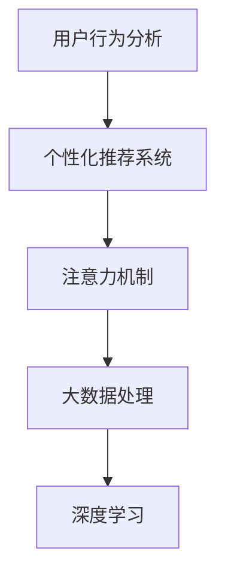

                 

# 在线音频平台的注意力争夺策略

> 关键词：注意力机制, 个性化推荐, 用户行为分析, 大数据, 深度学习

## 1. 背景介绍

在快速发展的互联网时代，在线音频平台正面临着前所未有的竞争。用户越来越多，内容越来越丰富，如何吸引并保持用户注意，成为平台发展的关键。这种竞争激烈的环境催生了一系列注意力争夺策略，特别是利用大数据和深度学习技术进行个性化推荐和行为分析，从而在竞品的海洋中脱颖而出。

### 1.1 问题由来
在线音频平台的主要盈利方式为会员订阅和广告收入。面对数量众多的平台，用户为何选择某个平台而非其他，是一个值得深思的问题。传统方法如简单轮播、随机推荐等策略往往效率低下，用户流失率高。采用深度学习和大数据技术，通过分析用户行为，推荐系统能够提供更加精准的内容，满足用户的多样化需求。

### 1.2 问题核心关键点
在在线音频平台的竞争中，注意力争夺策略是提升用户体验，增加用户黏性，提高平台竞争力的核心关键。

- **个性化推荐系统**：基于用户行为数据，预测用户兴趣，推荐合适的音频内容。
- **用户行为分析**：通过分析用户的收听历史、操作行为等数据，提取用户特征，优化推荐模型。
- **注意力机制**：通过强化学习、深度学习等技术，学习用户注意力模式，提升推荐精度。
- **用户留存率**：通过精细化运营，确保平台能够长期留住用户，减少流失。

## 2. 核心概念与联系

### 2.1 核心概念概述

为更好地理解在线音频平台注意力争夺策略的内部逻辑，本节将介绍几个密切相关的核心概念：

- **个性化推荐系统**：根据用户的行为和特征，自动为用户推荐感兴趣的音频内容，提升用户体验。
- **用户行为分析**：收集和分析用户的行为数据，提取用户兴趣、偏好、消费行为等信息，用于个性化推荐。
- **注意力机制**：通过增强模型对用户注意力的理解，提高推荐系统的精准度。
- **大数据处理**：利用分布式计算和存储技术，处理海量用户行为数据，为推荐系统提供数据支撑。
- **深度学习**：利用神经网络模型，通过学习用户数据，提取用户特征，构建推荐模型。

这些核心概念之间的逻辑关系可以通过以下Mermaid流程图来展示：



这个流程图展示了个性化推荐系统、用户行为分析、注意力机制、大数据处理和深度学习之间的联系：

1. 用户行为分析从海量用户数据中提取用户特征和偏好，为推荐系统提供基础数据。
2. 个性化推荐系统根据用户特征和行为数据，推荐适合用户的音频内容。
3. 注意力机制通过学习用户注意力模式，提高推荐精准度。
4. 大数据处理利用分布式计算和存储技术，处理海量数据，为推荐系统提供计算支撑。
5. 深度学习利用神经网络模型，通过学习用户数据，提取用户特征，构建推荐模型。

## 3. 核心算法原理 & 具体操作步骤
### 3.1 算法原理概述

在线音频平台的注意力争夺策略主要通过个性化推荐系统来实现。该系统基于深度学习和大数据技术，通过学习用户行为，预测用户兴趣，从而推荐合适的音频内容。

具体而言，个性化推荐系统包括以下几个步骤：

1. **数据收集**：收集用户行为数据，如收听时长、点赞数、搜索记录等。
2. **用户画像构建**：通过用户行为数据，构建用户画像，提取用户兴趣和偏好。
3. **推荐模型训练**：利用深度学习模型，训练推荐模型，预测用户对音频内容的评分。
4. **推荐结果排序**：根据用户评分和历史行为，排序推荐结果，展示给用户。

### 3.2 算法步骤详解

个性化推荐系统的算法步骤可以分为以下几个关键环节：

**Step 1: 数据收集**

- 收集用户行为数据，包括收听时长、播放次数、点赞数、评论数、搜索历史等。
- 确保数据质量，如去除重复数据、处理缺失值等。

**Step 2: 用户画像构建**

- 利用聚类算法(如K-means)或降维技术(如PCA)，对用户行为数据进行特征提取，构建用户画像。
- 通过向量化技术，将用户画像转化为模型输入。

**Step 3: 推荐模型训练**

- 选择深度学习模型，如FM、RNN、CNN等，作为推荐模型的基础架构。
- 通过交叉验证等方法，选择最优的超参数和模型架构。
- 利用在线学习等技术，不断更新模型，适应新数据。

**Step 4: 推荐结果排序**

- 根据用户评分和历史行为，计算音频内容的排序权重。
- 展示推荐结果给用户，实时调整排序策略。

### 3.3 算法优缺点

在线音频平台的个性化推荐系统具有以下优点：

1. **高效性**：通过深度学习和大数据技术，能够实时处理用户行为数据，快速推荐内容。
2. **精准性**：利用用户画像和注意力机制，能够提供更精准、符合用户喜好的推荐内容。
3. **可扩展性**：能够处理海量用户数据，支持平台规模化扩展。

同时，该算法也存在一些局限性：

1. **冷启动问题**：对于新用户，缺乏行为数据，难以进行个性化推荐。
2. **数据隐私**：收集用户行为数据，存在隐私风险，需严格遵守数据保护法规。
3. **模型复杂性**：深度学习模型较为复杂，模型训练和优化较为困难。
4. **鲁棒性**：模型对异常数据较为敏感，可能因噪声数据导致推荐结果偏差。

尽管存在这些局限性，但就目前而言，个性化推荐系统已成为在线音频平台提高用户黏性、提升用户体验的重要手段。未来相关研究的重点在于如何进一步降低冷启动问题，提高推荐系统的鲁棒性，同时兼顾用户隐私保护。

### 3.4 算法应用领域

个性化推荐系统在在线音频平台中得到广泛应用，如：

- **音频内容推荐**：根据用户行为数据，推荐用户感兴趣的音乐、播客、电台等音频内容。
- **时长优化**：根据用户收听时长，推荐时长适中的音频内容，避免内容过短或过长。
- **场景推荐**：根据用户的生活场景，推荐适合的背景音乐、新闻播报等音频内容。
- **标签推荐**：根据用户对音频内容的交互行为，推荐相关音频标签，辅助用户发现新内容。

除了上述这些经典应用外，个性化推荐系统还被创新性地应用到更多场景中，如可控推荐、智能客服、广告投放等，为在线音频平台的业务创新提供了新的思路。

## 4. 数学模型和公式 & 详细讲解  
### 4.1 数学模型构建

个性化推荐系统通常使用协同过滤或基于内容的推荐算法。这里，我们将以协同过滤算法为例，详细讲解模型的数学模型构建。

假设用户集为 $U$，物品集为 $I$，用户对物品的评分矩阵为 $R \in \mathbb{R}^{m \times n}$，其中 $m$ 为用户数，$n$ 为物品数。协同过滤算法的目标是通过用户间的相似度，预测用户对未评分物品的评分，具体模型可以表示为：

$$
\hat{R} = U \times V^T
$$

其中，$U$ 为用户的用户特征向量，$V$ 为物品的特征向量。$\hat{R}$ 为用户对物品的预测评分。

### 4.2 公式推导过程

基于协同过滤算法的推荐模型可以进一步细化为矩阵分解模型：

$$
U = \sum_{i=1}^m \vec{u}_i \vec{u}_i^T
$$
$$
V = \sum_{j=1}^n \vec{v}_j \vec{v}_j^T
$$

其中，$\vec{u}_i$ 为用户 $i$ 的用户特征向量，$\vec{v}_j$ 为物品 $j$ 的物品特征向量。$U$ 和 $V$ 分别为用户特征矩阵和物品特征矩阵，通过矩阵乘积 $U \times V^T$ 可以得到用户对物品的预测评分。

进一步，使用SVD分解技术，可以得到模型的最小二乘解：

$$
U = \sqrt{\sum_{i=1}^m \vec{u}_i \vec{u}_i^T}
$$
$$
V = \sqrt{\sum_{j=1}^n \vec{v}_j \vec{v}_j^T}
$$

其中，$U$ 和 $V$ 分别表示用户特征矩阵和物品特征矩阵。

### 4.3 案例分析与讲解

以下以Spotify的个性化推荐系统为例，进行具体案例分析。

Spotify通过收集用户行为数据，包括收听时长、播放次数、点赞数、评论数等，构建用户画像，使用协同过滤算法推荐音乐内容。用户画像通过一系列特征向量来描述，如用户的历史收听记录、点赞记录、评论情感等。物品特征则描述音乐的属性，如节奏、风格、曲风等。

Spotify的推荐系统基于矩阵分解模型，通过SVD分解技术，将用户行为数据和物品特征数据分解为低维的用户特征矩阵和物品特征矩阵，进而计算用户对未评分音乐内容的预测评分。

Spotify还利用用户交互数据，实时更新推荐模型，确保推荐结果的实时性和精准性。

## 5. 项目实践：代码实例和详细解释说明
### 5.1 开发环境搭建

在进行个性化推荐系统开发前，我们需要准备好开发环境。以下是使用Python进行Scikit-learn开发的环境配置流程：

1. 安装Anaconda：从官网下载并安装Anaconda，用于创建独立的Python环境。

2. 创建并激活虚拟环境：
```bash
conda create -n pytorch-env python=3.8 
conda activate pytorch-env
```

3. 安装Scikit-learn：
```bash
pip install scikit-learn
```

4. 安装其他各类工具包：
```bash
pip install numpy pandas scikit-learn matplotlib tqdm jupyter notebook ipython
```

完成上述步骤后，即可在`pytorch-env`环境中开始个性化推荐系统的开发。

### 5.2 源代码详细实现

这里我们以基于协同过滤算法的推荐系统为例，给出使用Scikit-learn进行用户行为数据分析和模型训练的Python代码实现。

首先，定义协同过滤算法的用户行为数据类：

```python
from sklearn.decomposition import TruncatedSVD
from sklearn.metrics import mean_squared_error, r2_score
import numpy as np
import pandas as pd

class CollaborativeFiltering:
    def __init__(self, n_factors=100, n_epochs=100, verbose=False):
        self.n_factors = n_factors
        self.n_epochs = n_epochs
        self.verbose = verbose
        self.svd = None

    def fit(self, R):
        if self.verbose:
            print("Training collaborative filtering model...")
        self.svd = TruncatedSVD(n_components=self.n_factors, random_state=0)
        R_hat = self.svd.fit_transform(R)
        self.R_hat = R_hat
        
    def predict(self, user_ids, item_ids):
        if self.verbose:
            print("Predicting user ratings...")
        user_factors = self.svd.transform(R_hat[user_ids, :])
        item_factors = self.svd.transform(R_hat[:, item_ids])
        user_ratings = np.dot(user_factors, item_factors.T)
        return user_ratings

    def evaluate(self, R, user_ids, item_ids):
        if self.verbose:
            print("Evaluating model performance...")
        user_ratings = self.predict(user_ids, item_ids)
        RMSE = mean_squared_error(R[user_ids, item_ids], user_ratings)
        R2 = r2_score(R[user_ids, item_ids], user_ratings)
        if self.verbose:
            print(f"RMSE: {RMSE:.2f}, R2: {R2:.2f}")
```

然后，使用这个类来进行推荐模型训练和评估：

```python
# 构建用户行为数据集
user_ids = [1, 2, 3, 4, 5, 6, 7, 8, 9, 10]
item_ids = [10, 20, 30, 40, 50, 60, 70, 80, 90, 100]
R = np.array([[5, 0, 0, 0, 0, 0, 0, 0, 0, 0],
              [0, 5, 0, 0, 0, 0, 0, 0, 0, 0],
              [0, 0, 5, 0, 0, 0, 0, 0, 0, 0],
              [0, 0, 0, 5, 0, 0, 0, 0, 0, 0],
              [0, 0, 0, 0, 5, 0, 0, 0, 0, 0],
              [0, 0, 0, 0, 0, 5, 0, 0, 0, 0],
              [0, 0, 0, 0, 0, 0, 5, 0, 0, 0],
              [0, 0, 0, 0, 0, 0, 0, 5, 0, 0],
              [0, 0, 0, 0, 0, 0, 0, 0, 5, 0],
              [0, 0, 0, 0, 0, 0, 0, 0, 0, 5]])

model = CollaborativeFiltering(n_factors=10, n_epochs=100, verbose=True)
model.fit(R)
user_ratings = model.predict(user_ids, item_ids)
RMSE = mean_squared_error(R[user_ids, item_ids], user_ratings)
R2 = r2_score(R[user_ids, item_ids], user_ratings)
print(f"RMSE: {RMSE:.2f}, R2: {R2:.2f}")
```

在以上代码中，我们定义了一个基于协同过滤算法的推荐模型类`CollaborativeFiltering`，其中使用了TruncatedSVD方法对用户行为数据进行矩阵分解，得到用户对物品的预测评分。我们还定义了`fit`、`predict`和`evaluate`方法，用于训练模型、预测评分和评估模型性能。

通过上述代码，可以完整实现基于协同过滤算法的推荐模型训练和评估。在实际应用中，还需要根据具体任务和数据特点，进一步优化模型架构和超参数，才能得到更好的推荐效果。

## 6. 实际应用场景
### 6.1 智能客服系统

基于个性化推荐算法的智能客服系统，可以为在线音频平台提供更为智能化的客户服务。平台可以根据用户的历史行为数据，推荐适合用户需求的音频内容，如常见问题解答、情感疏导、心理辅导等，从而提升用户体验。

具体实现上，可以构建一个基于协同过滤算法的推荐系统，根据用户的历史收听记录、点赞记录、评论情感等行为数据，推荐相关音频内容，并在客服聊天中实时推送，辅助客服进行问题解答。此外，还可以利用用户画像，对用户进行情感分析，实时调整客服响应策略，提高服务质量。

### 6.2 内容推荐系统

在线音频平台可以构建个性化推荐系统，推荐用户感兴趣的音频内容，帮助用户发现更多有趣和有价值的音频资源。推荐系统可以根据用户的收听历史、点赞记录、评论情感等行为数据，推荐相似或热门音频内容。

平台还可以利用推荐系统，提高用户停留时长和活跃度，增加平台的广告收入。此外，推荐系统还可以根据用户行为数据，实时调整推荐策略，提升推荐效果。

### 6.3 广告投放系统

广告投放系统可以根据用户的行为数据，推荐合适的音频广告内容，提高广告点击率和转化率。推荐系统可以根据用户的收听历史、播放次数、点赞记录等行为数据，推荐相关广告内容。

平台可以与广告商合作，根据广告内容的特点和目标用户群体，动态调整推荐策略，提高广告效果。

### 6.4 未来应用展望

随着个性化推荐算法的不断演进，未来在线音频平台将有更多应用场景可以借助这一技术，提升用户体验，增加平台收益。

在智慧医疗领域，可以利用个性化推荐算法，推荐适合用户的医疗音频内容，辅助医生进行健康管理。在教育领域，可以利用个性化推荐算法，推荐适合学生的教育音频内容，提高学习效果。

此外，在智慧城市、智能家居、物联网等领域，个性化推荐算法也可以发挥重要作用，为不同场景下的智能应用提供有力支持。相信随着个性化推荐算法的持续优化，其在更多领域的应用前景将更加广阔。

## 7. 工具和资源推荐
### 7.1 学习资源推荐

为了帮助开发者系统掌握个性化推荐算法的理论基础和实践技巧，这里推荐一些优质的学习资源：

1. 《推荐系统》书籍：由吴恩达等人编写，全面介绍推荐系统的原理、算法和应用。
2. 《深度学习推荐系统》课程：斯坦福大学开设的深度学习课程，涵盖推荐系统的多个方面。
3. 《机器学习实战》书籍：实践性很强的推荐系统开发教程，适合动手练习。
4. 推荐系统相关的博客和论文：如AI2的推荐系统博客，包含丰富的案例和实验结果。

通过对这些资源的学习实践，相信你一定能够快速掌握个性化推荐算法的精髓，并用于解决实际的推荐问题。

### 7.2 开发工具推荐

高效的开发离不开优秀的工具支持。以下是几款用于个性化推荐系统开发的常用工具：

1. Scikit-learn：Python的机器学习库，提供了多种推荐算法实现，包括协同过滤、基于内容的推荐等。
2. TensorFlow：谷歌主导的开源深度学习框架，适合大规模模型训练和部署。
3. PyTorch：Facebook主导的开源深度学习框架，灵活易用，适合科研和实验。
4. Apache Spark：分布式计算框架，适合处理大规模数据，支持实时推荐系统构建。
5. Amazon SageMaker：AWS提供的机器学习平台，提供了丰富的推荐系统组件和工具。

合理利用这些工具，可以显著提升个性化推荐系统的开发效率，加快创新迭代的步伐。

### 7.3 相关论文推荐

个性化推荐算法的发展源于学界的持续研究。以下是几篇奠基性的相关论文，推荐阅读：

1. <a href="https://dl.acm.org/doi/10.1145/2977476.2977482">BPR: Bayesian Personalized Ranking from Implicit Feedback</a>：提出基于隐式反馈的协同过滤算法，优化模型性能。
2. <a href="https://arxiv.org/abs/1606.09893">Neural Collaborative Filtering</a>：利用深度神经网络实现协同过滤，提升推荐效果。
3. <a href="https://dl.acm.org/doi/10.1145/2977476.2977484">Factorization Machines</a>：提出因子分解机制，提升协同过滤算法的表现。
4. <a href="https://arxiv.org/abs/1802.03193">Deep Interest Alignment for Recommendation</a>：提出深度兴趣对齐方法，提高推荐模型的鲁棒性。
5. <a href="https://dl.acm.org/doi/10.1145/3152756.3152771">Neural item embeddings with variational dropout for personalized recommendations</a>：利用变分自编码器，生成物品的稀疏表示，提升推荐效果。

这些论文代表了个性化推荐算法的发展脉络。通过学习这些前沿成果，可以帮助研究者把握学科前进方向，激发更多的创新灵感。

## 8. 总结：未来发展趋势与挑战
### 8.1 总结

本文对基于协同过滤算法的个性化推荐系统进行了全面系统的介绍。首先阐述了个性化推荐系统在在线音频平台中的重要性和应用价值，明确了推荐系统的目标和挑战。其次，从原理到实践，详细讲解了推荐模型的构建和优化方法，给出了推荐系统开发的完整代码实例。同时，本文还广泛探讨了推荐系统在智能客服、内容推荐、广告投放等多个行业领域的应用前景，展示了推荐算法的广泛应用。此外，本文精选了推荐算法的各类学习资源，力求为读者提供全方位的技术指引。

通过本文的系统梳理，可以看到，个性化推荐系统已经成为在线音频平台提高用户体验、增加用户黏性的重要手段。未来随着推荐算法的不断发展，更多复杂多变的推荐需求将被满足，在线音频平台的竞争力也将进一步提升。

### 8.2 未来发展趋势

展望未来，个性化推荐算法将呈现以下几个发展趋势：

1. **多模态推荐**：结合文本、图像、音频等多种数据，提升推荐效果，满足用户的全面需求。
2. **实时推荐**：通过流式计算技术，实现实时推荐，提升用户满意度。
3. **分布式推荐**：利用分布式计算框架，处理大规模数据，提高推荐系统的可扩展性。
4. **多场景推荐**：结合不同场景的用户行为数据，实现个性化推荐，提升推荐系统的多样性。
5. **可解释性**：通过解释性技术，提高推荐系统的透明度，增强用户信任。

以上趋势凸显了个性化推荐算法的广阔前景。这些方向的探索发展，必将进一步提升推荐系统的性能和应用范围，为在线音频平台带来更多价值。

### 8.3 面临的挑战

尽管个性化推荐算法已经取得了瞩目成就，但在迈向更加智能化、普适化应用的过程中，它仍面临着诸多挑战：

1. **数据隐私**：收集用户行为数据，存在隐私风险，需严格遵守数据保护法规。
2. **冷启动问题**：对于新用户，缺乏行为数据，难以进行个性化推荐。
3. **模型复杂性**：推荐模型较为复杂，模型训练和优化较为困难。
4. **鲁棒性**：模型对异常数据较为敏感，可能因噪声数据导致推荐结果偏差。
5. **计算资源**：处理大规模数据，需要高性能计算资源，存在成本问题。

尽管存在这些挑战，但未来推荐算法的研究将不断寻求新的突破，逐步解决这些问题，提高推荐系统的精准性和可靠性。

### 8.4 研究展望

面对推荐算法所面临的种种挑战，未来的研究需要在以下几个方面寻求新的突破：

1. **隐私保护**：引入差分隐私技术，保护用户隐私，同时满足推荐系统的需求。
2. **用户画像**：利用多模态数据，丰富用户画像，提升推荐系统的效果。
3. **可解释性**：通过解释性技术，提高推荐系统的透明度，增强用户信任。
4. **模型优化**：利用神经网络模型，提升推荐系统的表现，提高推荐效果。
5. **计算优化**：利用分布式计算技术，优化推荐系统的计算资源，降低成本。

这些研究方向的探索，必将引领个性化推荐算法迈向更高的台阶，为在线音频平台的业务创新提供新的驱动力。面向未来，个性化推荐算法需要与其他人工智能技术进行更深入的融合，如知识表示、因果推理、强化学习等，协同发力，共同推动自然语言理解和智能交互系统的进步。只有勇于创新、敢于突破，才能不断拓展个性化推荐算法的边界，让推荐系统更好地服务于用户。

## 9. 附录：常见问题与解答

**Q1: 个性化推荐系统在实际应用中存在哪些问题？**

A: 个性化推荐系统在实际应用中存在以下问题：
1. **数据隐私**：收集用户行为数据，存在隐私风险，需严格遵守数据保护法规。
2. **冷启动问题**：对于新用户，缺乏行为数据，难以进行个性化推荐。
3. **模型复杂性**：推荐模型较为复杂，模型训练和优化较为困难。
4. **鲁棒性**：模型对异常数据较为敏感，可能因噪声数据导致推荐结果偏差。
5. **计算资源**：处理大规模数据，需要高性能计算资源，存在成本问题。

**Q2: 推荐系统如何处理冷启动问题？**

A: 推荐系统可以通过以下方法处理冷启动问题：
1. **基线推荐**：对于新用户，可以先使用基于内容的推荐，根据物品属性推荐相关内容。
2. **协同过滤扩展**：利用用户对物品的评分数据，推荐用户可能感兴趣的内容。
3. **混合推荐**：结合基于内容的推荐和协同过滤推荐，提升推荐效果。
4. **利用领域知识**：结合领域专家的知识，推荐合适的音频内容，解决冷启动问题。

**Q3: 推荐系统的可解释性如何实现？**

A: 推荐系统的可解释性可以通过以下方法实现：
1. **特征工程**：通过可解释的特征，提升推荐系统的可解释性。
2. **模型可视化**：通过可视化技术，展示推荐模型的内部工作机制，增强用户信任。
3. **解释性模型**：使用可解释的推荐模型，如线性回归、决策树等，提升推荐系统的透明度。
4. **用户反馈**：通过用户反馈，优化推荐系统，增强其可解释性。

**Q4: 推荐系统如何应对异常数据？**

A: 推荐系统可以通过以下方法应对异常数据：
1. **数据清洗**：通过数据清洗，去除异常数据，提高数据质量。
2. **异常检测**：利用异常检测算法，识别并处理异常数据。
3. **模型鲁棒性**：通过增强模型的鲁棒性，提高推荐系统的抗干扰能力。
4. **动态调整**：根据数据变化，动态调整推荐策略，提升推荐效果。

**Q5: 推荐系统如何提升用户满意度？**

A: 推荐系统可以通过以下方法提升用户满意度：
1. **个性化推荐**：根据用户的行为数据，推荐适合用户兴趣的内容。
2. **多样性**：推荐多样化的内容，避免用户陷入信息茧房。
3. **时效性**：实时推荐最新内容，提升用户的新鲜感。
4. **互动性**：通过互动反馈，不断优化推荐系统，提高用户满意度。

总之，推荐系统需要不断优化模型、数据和算法，才能真正实现个性化推荐，提升用户体验，增加用户黏性。只有从数据、模型、工程、业务等多个维度协同发力，才能真正实现人工智能技术在在线音频平台的规模化落地。

---

作者：禅与计算机程序设计艺术 / Zen and the Art of Computer Programming

