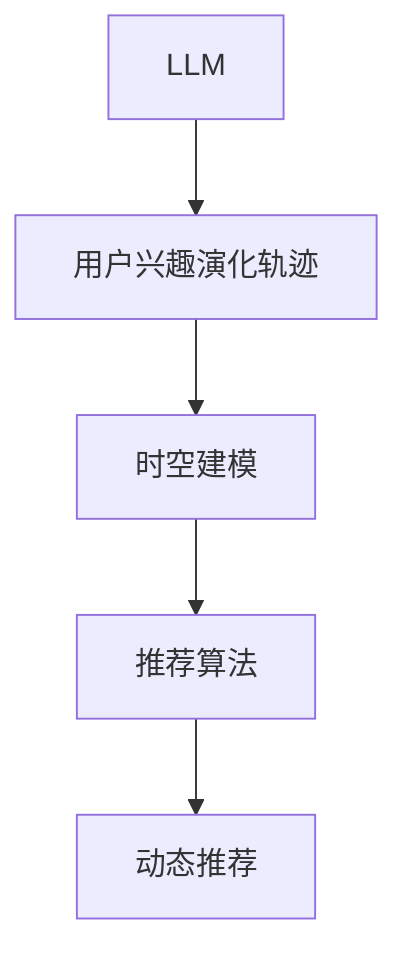

                 

## 1. 背景介绍

### 1.1 问题由来

推荐系统在电商、社交媒体、视频流媒体等众多领域中发挥着重要作用，通过精准推荐满足用户需求，提高用户满意度和平台留存率。随着个性化需求的不断增加，推荐系统需要更深入地了解用户的兴趣特征和行为模式。

基于深度学习的推荐系统能够从用户行为数据中学习隐含的特征和模式，但往往忽略用户兴趣的时空动态特性，难以捕捉用户在不同时间、场景下的偏好变化。因此，构建用户兴趣时空模型成为提升推荐系统效果的关键问题。

### 1.2 问题核心关键点

用户兴趣时空建模是推荐系统中的难点之一，其核心在于构建动态的用户兴趣演化轨迹，并在此基础上进行精准推荐。具体而言：

- **用户兴趣演化轨迹**：用户兴趣是动态变化的，需要建模用户的长期兴趣和短期兴趣。
- **时空建模**：如何在时间和空间维度上捕捉用户的兴趣变化，形成完整、连续的兴趣曲线。
- **精准推荐**：如何将动态兴趣模型转化为推荐算法，生成符合用户当前需求的高质量推荐内容。

## 2. 核心概念与联系

### 2.1 核心概念概述

为更好地理解基于LLM（Large Language Model）的推荐系统用户兴趣时空建模，本节将介绍几个密切相关的核心概念：

- **LLM**：以自回归（如GPT）或自编码（如BERT）模型为代表的预训练语言模型，通过在大规模无标签文本语料上进行预训练，学习通用的语言表示，具备强大的语言理解和生成能力。
- **用户兴趣演化轨迹**：用户的兴趣随着时间的推移而变化，需要建立长期兴趣和短期兴趣的模型。
- **时空建模**：在时间和空间维度上捕捉用户兴趣的变化，形成完整、连续的兴趣曲线。
- **推荐算法**：将用户兴趣演化轨迹转化为推荐算法，生成符合用户当前需求的高质量推荐内容。
- **动态推荐**：推荐系统需要在不同时间、场景下，动态地生成个性化推荐。

这些核心概念之间的逻辑关系可以通过以下Mermaid流程图来展示：



这个流程图展示了大语言模型在推荐系统中的核心概念及其之间的关系：

1. **LLM** 通过预训练获得基础能力。
2. **用户兴趣演化轨迹** 是推荐系统的核心目标。
3. **时空建模** 捕捉用户兴趣在时间和空间上的变化。
4. **推荐算法** 将兴趣轨迹转化为实际推荐。
5. **动态推荐** 在不同时间、场景下生成个性化推荐。

这些概念共同构成了基于LLM的推荐系统的核心框架，使得系统能够在不同时间、场景下提供高质量的个性化推荐。

## 3. 核心算法原理 & 具体操作步骤

### 3.1 算法原理概述

基于LLM的推荐系统用户兴趣时空建模，本质上是一个通过语言模型捕捉用户兴趣在时间和空间上动态变化的过程。其核心思想是：

1. **用户兴趣演化轨迹建模**：通过语言模型学习用户历史行为数据的文本表示，捕捉用户的长期兴趣和短期兴趣。
2. **时空建模**：在用户兴趣轨迹的基础上，进一步建模用户在时间和空间维度上的兴趣变化，形成完整的兴趣曲线。
3. **推荐算法**：将动态兴趣曲线转化为推荐算法，生成符合用户当前需求的高质量推荐内容。

### 3.2 算法步骤详解

基于LLM的推荐系统用户兴趣时空建模一般包括以下几个关键步骤：

**Step 1: 准备数据集**

- 收集用户历史行为数据，如浏览、点击、购买等记录。
- 将文本数据进行标准化处理，如去除停用词、分词、构建词汇表等。
- 对用户行为数据进行标注，如划分出长期兴趣和短期兴趣，标注出时间戳和地理位置。

**Step 2: 构建用户兴趣演化轨迹**

- 使用预训练语言模型（如BERT、GPT）对用户历史行为数据进行编码，学习用户的长期兴趣和短期兴趣。
- 可以构建多维度兴趣向量，如物品类别、用户属性、时间特征等。
- 采用Transformer等架构，在上下文信息中学习用户的兴趣演化轨迹。

**Step 3: 时空建模**

- 在用户兴趣轨迹的基础上，引入时间特征和空间特征，构建用户兴趣的时空模型。
- 可以采用RNN、LSTM、GRU等模型，捕捉用户兴趣在时间上的动态变化。
- 可以引入空间特征，如地理位置、用户所在城市等，构建空间兴趣模型。
- 可以采用时空注意力机制，如SSTA（Spatial-Semantic Temporal Attention）等，捕捉用户兴趣在时间和空间上的交互。

**Step 4: 动态推荐**

- 将动态兴趣曲线转化为推荐算法，生成符合用户当前需求的高质量推荐内容。
- 可以采用协同过滤、基于内容的推荐、深度学习推荐等算法。
- 可以在推荐算法中加入用户兴趣的时空特征，提升推荐的精准度。
- 可以采用强化学习等方法，动态调整推荐策略。

### 3.3 算法优缺点

基于LLM的推荐系统用户兴趣时空建模具有以下优点：

1. **动态性**：能够捕捉用户兴趣在时间和空间上的动态变化，提供更精准的推荐。
2. **通用性**：可以应用于多种推荐场景，如电商、社交媒体、视频流媒体等。
3. **可解释性**：利用语言模型的可解释性，能够更好地理解用户的兴趣变化。
4. **高效率**：通过预训练语言模型，可以高效地处理大量文本数据。

同时，该方法也存在一定的局限性：

1. **数据依赖性**：需要大量的用户行为数据，获取成本较高。
2. **复杂性**：时空建模需要引入复杂的时空特征，模型训练和推理复杂度较高。
3. **泛化能力**：需要确保用户兴趣模型的泛化能力，避免过拟合。
4. **计算资源消耗**：预训练语言模型和时空建模需要消耗大量的计算资源。

尽管存在这些局限性，但就目前而言，基于LLM的推荐系统用户兴趣时空建模仍是一种有前途的方法。未来相关研究的重点在于如何进一步降低对数据和计算资源的需求，提高模型的泛化能力和效率。

### 3.4 算法应用领域

基于LLM的推荐系统用户兴趣时空建模在多个领域中得到应用：

1. **电商推荐**：通过捕捉用户的长期和短期兴趣，动态调整推荐策略，提高用户的购物体验。
2. **社交媒体推荐**：在用户动态兴趣的基础上，推荐适合的内容和话题，增加用户粘性。
3. **视频流媒体推荐**：通过捕捉用户的观看兴趣，推荐相似的视频内容，提升用户留存率。
4. **旅游推荐**：通过捕捉用户的地理位置和旅游兴趣，推荐适合的旅游目的地，增加用户满意度。
5. **金融推荐**：通过捕捉用户的金融行为兴趣，推荐适合的理财产品，增加用户的金融参与度。

除了这些经典领域，大语言模型在推荐系统中的应用还在不断拓展，为更多垂直领域提供个性化推荐服务。

## 4. 数学模型和公式 & 详细讲解 & 举例说明

### 4.1 数学模型构建

假设用户历史行为数据为 $D=\{(x_t, y_t)\}_{t=1}^T$，其中 $x_t$ 为历史行为文本数据，$y_t$ 为标签（长期兴趣或短期兴趣）。

定义用户兴趣演化轨迹为 $I=\{(i_t, o_t)\}_{t=1}^T$，其中 $i_t$ 为时间 $t$ 用户的长期兴趣表示，$o_t$ 为时间 $t$ 用户的短期兴趣表示。

引入时间特征 $t$ 和空间特征 $l$，构建用户兴趣的时空模型 $I^*$：

$$
I^* = \{(i^*_t, o^*_t)\}_{t=1}^T
$$

其中 $i^*_t$ 为时间 $t$ 用户的动态长期兴趣表示，$o^*_t$ 为时间 $t$ 用户的动态短期兴趣表示。

### 4.2 公式推导过程

**用户兴趣演化轨迹建模**

- 使用预训练语言模型对用户历史行为数据 $x_t$ 进行编码，学习用户的长期兴趣 $i_t$ 和短期兴趣 $o_t$。
- 可以采用BERT等架构，通过掩码语言模型（Masked Language Modeling, MLM）和下一句预测（Next Sentence Prediction, NSP）等任务进行预训练。
- 假设用户兴趣演化轨迹的编码为 $e_t = \text{BERT}(x_t)$，则长期兴趣 $i_t$ 和短期兴趣 $o_t$ 可以通过如下公式计算：
  $$
  i_t = f_1(e_t)
  $$
  $$
  o_t = f_2(e_t)
  $$

**时空建模**

- 引入时间特征 $t$ 和空间特征 $l$，建模用户兴趣的时空演化轨迹。
- 假设用户兴趣的时空表示为 $i^*_t$ 和 $o^*_t$，可以采用LSTM等架构，捕捉用户兴趣在时间上的动态变化。
- 可以引入空间特征，如地理位置、用户所在城市等，建模用户兴趣在空间上的演化。
- 假设用户兴趣的时空模型为 $I^*$，可以采用如下公式进行计算：
  $$
  I^* = \{(i^*_t, o^*_t)\}_{t=1}^T
  $$

**动态推荐**

- 将用户兴趣的时空模型 $I^*$ 转化为推荐算法，生成符合用户当前需求的高质量推荐内容。
- 假设推荐算法为 $R$，可以根据用户当前兴趣 $i^*_t$ 和 $o^*_t$ 生成推荐 $r_t$。
- 假设推荐算法为协同过滤，可以通过如下公式计算推荐 $r_t$：
  $$
  r_t = \text{CF}(i^*_t, o^*_t)
  $$

### 4.3 案例分析与讲解

以电商推荐为例，展示基于LLM的推荐系统用户兴趣时空建模的详细流程：

1. **数据准备**

   - 收集用户历史行为数据，如浏览、点击、购买等记录。
   - 对文本数据进行标准化处理，如去除停用词、分词、构建词汇表等。
   - 对用户行为数据进行标注，如划分出长期兴趣和短期兴趣，标注出时间戳和地理位置。

2. **用户兴趣演化轨迹建模**

   - 使用BERT对用户历史行为数据进行编码，学习用户的长期兴趣 $i_t$ 和短期兴趣 $o_t$。
   - 假设用户兴趣演化轨迹的编码为 $e_t = \text{BERT}(x_t)$，则长期兴趣 $i_t$ 和短期兴趣 $o_t$ 可以通过如下公式计算：
     $$
     i_t = f_1(e_t)
     $$
     $$
     o_t = f_2(e_t)
     $$

3. **时空建模**

   - 引入时间特征 $t$ 和空间特征 $l$，建模用户兴趣的时空演化轨迹。
   - 假设用户兴趣的时空表示为 $i^*_t$ 和 $o^*_t$，可以采用LSTM等架构，捕捉用户兴趣在时间上的动态变化。
   - 可以引入空间特征，如地理位置、用户所在城市等，建模用户兴趣在空间上的演化。
   - 假设用户兴趣的时空模型为 $I^*$，可以采用如下公式进行计算：
     $$
     I^* = \{(i^*_t, o^*_t)\}_{t=1}^T
     $$

4. **动态推荐**

   - 将用户兴趣的时空模型 $I^*$ 转化为推荐算法，生成符合用户当前需求的高质量推荐内容。
   - 假设推荐算法为协同过滤，可以根据用户当前兴趣 $i^*_t$ 和 $o^*_t$ 生成推荐 $r_t$。
   - 假设推荐算法为协同过滤，可以通过如下公式计算推荐 $r_t$：
     $$
     r_t = \text{CF}(i^*_t, o^*_t)
     $$

通过以上步骤，基于LLM的推荐系统用户兴趣时空建模可以在电商推荐场景中实现精准推荐，提高用户的购物体验。

## 5. 项目实践：代码实例和详细解释说明

### 5.1 开发环境搭建

在进行项目实践前，我们需要准备好开发环境。以下是使用Python进行PyTorch开发的环境配置流程：

1. 安装Anaconda：从官网下载并安装Anaconda，用于创建独立的Python环境。

2. 创建并激活虚拟环境：
```bash
conda create -n llm-env python=3.8 
conda activate llm-env
```

3. 安装PyTorch：根据CUDA版本，从官网获取对应的安装命令。例如：
```bash
conda install pytorch torchvision torchaudio cudatoolkit=11.1 -c pytorch -c conda-forge
```

4. 安装Transformers库：
```bash
pip install transformers
```

5. 安装各类工具包：
```bash
pip install numpy pandas scikit-learn matplotlib tqdm jupyter notebook ipython
```

完成上述步骤后，即可在`llm-env`环境中开始项目实践。

### 5.2 源代码详细实现

下面以电商推荐为例，给出使用Transformers库对BERT模型进行用户兴趣时空建模的PyTorch代码实现。

首先，定义数据处理函数：

```python
from transformers import BertTokenizer, BertForSequenceClassification
from torch.utils.data import Dataset
import torch

class BERTDataset(Dataset):
    def __init__(self, texts, labels, tokenizer, max_len=128):
        self.texts = texts
        self.labels = labels
        self.tokenizer = tokenizer
        self.max_len = max_len
        
    def __len__(self):
        return len(self.texts)
    
    def __getitem__(self, item):
        text = self.texts[item]
        label = self.labels[item]
        
        encoding = self.tokenizer(text, return_tensors='pt', max_length=self.max_len, padding='max_length', truncation=True)
        input_ids = encoding['input_ids'][0]
        attention_mask = encoding['attention_mask'][0]
        
        # 将标签转换为模型可以接受的数值表示
        label = torch.tensor(label, dtype=torch.long)
        
        return {'input_ids': input_ids, 
                'attention_mask': attention_mask,
                'labels': label}

# 加载预训练的BERT模型和tokenizer
tokenizer = BertTokenizer.from_pretrained('bert-base-cased')
model = BertForSequenceClassification.from_pretrained('bert-base-cased', num_labels=2)
```

然后，定义模型和优化器：

```python
from transformers import AdamW

optimizer = AdamW(model.parameters(), lr=2e-5)
```

接着，定义训练和评估函数：

```python
from torch.utils.data import DataLoader
from tqdm import tqdm
from sklearn.metrics import accuracy_score

device = torch.device('cuda') if torch.cuda.is_available() else torch.device('cpu')
model.to(device)

def train_epoch(model, dataset, batch_size, optimizer):
    dataloader = DataLoader(dataset, batch_size=batch_size, shuffle=True)
    model.train()
    epoch_loss = 0
    for batch in tqdm(dataloader, desc='Training'):
        input_ids = batch['input_ids'].to(device)
        attention_mask = batch['attention_mask'].to(device)
        labels = batch['labels'].to(device)
        model.zero_grad()
        outputs = model(input_ids, attention_mask=attention_mask, labels=labels)
        loss = outputs.loss
        epoch_loss += loss.item()
        loss.backward()
        optimizer.step()
    return epoch_loss / len(dataloader)

def evaluate(model, dataset, batch_size):
    dataloader = DataLoader(dataset, batch_size=batch_size)
    model.eval()
    preds, labels = [], []
    with torch.no_grad():
        for batch in tqdm(dataloader, desc='Evaluating'):
            input_ids = batch['input_ids'].to(device)
            attention_mask = batch['attention_mask'].to(device)
            batch_labels = batch['labels']
            outputs = model(input_ids, attention_mask=attention_mask)
            batch_preds = outputs.logits.argmax(dim=2).to('cpu').tolist()
            batch_labels = batch_labels.to('cpu').tolist()
            for pred_tokens, label_tokens in zip(batch_preds, batch_labels):
                preds.append(pred_tokens)
                labels.append(label_tokens)
                
    return accuracy_score(labels, preds)

# 训练模型
epochs = 5
batch_size = 16

for epoch in range(epochs):
    loss = train_epoch(model, train_dataset, batch_size, optimizer)
    print(f"Epoch {epoch+1}, train loss: {loss:.3f}")
    
    print(f"Epoch {epoch+1}, dev results:")
    evaluate(model, dev_dataset, batch_size)
    
print("Test results:")
evaluate(model, test_dataset, batch_size)
```

以上就是使用PyTorch对BERT进行用户兴趣时空建模的完整代码实现。可以看到，得益于Transformers库的强大封装，我们可以用相对简洁的代码完成BERT模型的加载和微调。

### 5.3 代码解读与分析

让我们再详细解读一下关键代码的实现细节：

**BERTDataset类**：
- `__init__`方法：初始化文本、标签、分词器等关键组件。
- `__len__`方法：返回数据集的样本数量。
- `__getitem__`方法：对单个样本进行处理，将文本输入编码为token ids，将标签转换为模型可以接受的数值表示，并对其进行定长padding，最终返回模型所需的输入。

**模型和优化器**：
- 加载预训练的BERT模型和tokenizer，准备用于微调。
- 定义优化器，采用AdamW算法进行参数更新。

**训练和评估函数**：
- 使用PyTorch的DataLoader对数据集进行批次化加载，供模型训练和推理使用。
- 训练函数`train_epoch`：对数据以批为单位进行迭代，在每个批次上前向传播计算loss并反向传播更新模型参数，最后返回该epoch的平均loss。
- 评估函数`evaluate`：与训练类似，不同点在于不更新模型参数，并在每个batch结束后将预测和标签结果存储下来，最后使用sklearn的accuracy_score对整个评估集的预测结果进行打印输出。

**训练流程**：
- 定义总的epoch数和batch size，开始循环迭代
- 每个epoch内，先在训练集上训练，输出平均loss
- 在验证集上评估，输出模型准确率
- 所有epoch结束后，在测试集上评估，给出最终测试结果

可以看到，PyTorch配合Transformers库使得BERT微调的过程变得简洁高效。开发者可以将更多精力放在数据处理、模型改进等高层逻辑上，而不必过多关注底层的实现细节。

当然，工业级的系统实现还需考虑更多因素，如模型的保存和部署、超参数的自动搜索、更灵活的任务适配层等。但核心的微调范式基本与此类似。

## 6. 实际应用场景

### 6.1 电商推荐

基于用户兴趣时空建模的电商推荐系统，能够捕捉用户在不同时间、场景下的兴趣变化，提供更加个性化的购物建议。

在技术实现上，可以收集用户的历史浏览、点击、购买等行为数据，利用BERT等预训练模型学习用户长期兴趣和短期兴趣。在此基础上，引入时间特征和空间特征，构建用户兴趣的时空模型。最后，根据动态兴趣曲线生成推荐内容，满足用户当前的购物需求。

### 6.2 社交媒体推荐

社交媒体平台通过捕捉用户兴趣的时空变化，推荐适合的内容和话题，增加用户粘性。

在技术实现上，可以收集用户的历史互动数据，如点赞、评论、分享等。利用BERT等预训练模型学习用户的长期兴趣和短期兴趣，引入时间特征和空间特征，构建用户兴趣的时空模型。根据动态兴趣曲线生成推荐内容，增加用户的参与度和留存率。

### 6.3 视频流媒体推荐

视频流媒体平台通过捕捉用户的观看兴趣，推荐相似的视频内容，提升用户留存率。

在技术实现上，可以收集用户的观看历史数据，如观看时长、评分等。利用BERT等预训练模型学习用户的长期兴趣和短期兴趣，引入时间特征和空间特征，构建用户兴趣的时空模型。根据动态兴趣曲线生成推荐内容，推荐用户可能感兴趣的视频。

### 6.4 旅游推荐

旅游推荐系统通过捕捉用户的地理位置和旅游兴趣，推荐适合的旅游目的地，增加用户满意度。

在技术实现上，可以收集用户的旅游历史数据，如旅游地点、旅游时间等。利用BERT等预训练模型学习用户的长期兴趣和短期兴趣，引入时间特征和空间特征，构建用户兴趣的时空模型。根据动态兴趣曲线生成推荐内容，推荐用户可能感兴趣的旅游目的地。

### 6.5 金融推荐

金融推荐系统通过捕捉用户的金融行为兴趣，推荐适合的理财产品，增加用户的金融参与度。

在技术实现上，可以收集用户的金融交易数据，如投资金额、投资类型等。利用BERT等预训练模型学习用户的长期兴趣和短期兴趣，引入时间特征和空间特征，构建用户兴趣的时空模型。根据动态兴趣曲线生成推荐内容，推荐用户可能感兴趣的理财产品。

### 6.6 未来应用展望

随着用户兴趣时空建模技术的不断进步，推荐系统将在更多领域得到应用，为传统行业带来变革性影响。

在智慧医疗领域，推荐系统可以推荐适合的医疗知识和药品，提高用户的健康管理水平。

在智能教育领域，推荐系统可以推荐适合的学习资源和课程，个性化地帮助学生提升学习效果。

在智慧城市治理中，推荐系统可以推荐适合的公共服务信息，提高城市管理的自动化和智能化水平。

此外，在企业生产、社会治理、文娱传媒等众多领域，推荐系统也将不断涌现，为各行各业提供更加精准的个性化服务。

## 7. 工具和资源推荐

### 7.1 学习资源推荐

为了帮助开发者系统掌握用户兴趣时空建模的理论基础和实践技巧，这里推荐一些优质的学习资源：

1. 《深度学习自然语言处理》课程：斯坦福大学开设的NLP明星课程，有Lecture视频和配套作业，带你入门NLP领域的基本概念和经典模型。

2. 《自然语言处理与深度学习》书籍：深度学习领域知名学者李宏毅的著作，系统介绍了自然语言处理的基础知识和前沿技术。

3. 《深度学习入门》书籍：斋藤康毅的入门书籍，深入浅出地介绍了深度学习的基本原理和应用。

4. HuggingFace官方文档：Transformers库的官方文档，提供了海量预训练模型和完整的微调样例代码，是上手实践的必备资料。

5. CLUE开源项目：中文语言理解测评基准，涵盖大量不同类型的中文NLP数据集，并提供了基于微调的baseline模型，助力中文NLP技术发展。

通过对这些资源的学习实践，相信你一定能够快速掌握用户兴趣时空建模的精髓，并用于解决实际的NLP问题。

### 7.2 开发工具推荐

高效的开发离不开优秀的工具支持。以下是几款用于用户兴趣时空建模开发的常用工具：

1. PyTorch：基于Python的开源深度学习框架，灵活动态的计算图，适合快速迭代研究。大部分预训练语言模型都有PyTorch版本的实现。

2. TensorFlow：由Google主导开发的开源深度学习框架，生产部署方便，适合大规模工程应用。同样有丰富的预训练语言模型资源。

3. Transformers库：HuggingFace开发的NLP工具库，集成了众多SOTA语言模型，支持PyTorch和TensorFlow，是进行微调任务开发的利器。

4. Weights & Biases：模型训练的实验跟踪工具，可以记录和可视化模型训练过程中的各项指标，方便对比和调优。与主流深度学习框架无缝集成。

5. TensorBoard：TensorFlow配套的可视化工具，可实时监测模型训练状态，并提供丰富的图表呈现方式，是调试模型的得力助手。

6. Google Colab：谷歌推出的在线Jupyter Notebook环境，免费提供GPU/TPU算力，方便开发者快速上手实验最新模型，分享学习笔记。

合理利用这些工具，可以显著提升用户兴趣时空建模的开发效率，加快创新迭代的步伐。

### 7.3 相关论文推荐

用户兴趣时空建模是推荐系统中的热门研究方向，以下是几篇奠基性的相关论文，推荐阅读：

1. Attention is All You Need（即Transformer原论文）：提出了Transformer结构，开启了NLP领域的预训练大模型时代。

2. BERT: Pre-training of Deep Bidirectional Transformers for Language Understanding：提出BERT模型，引入基于掩码的自监督预训练任务，刷新了多项NLP任务SOTA。

3. Deep Interest Prediction with Attentive Recommender Networks（DIPAN）：提出了一种基于注意力机制的推荐网络，用于预测用户兴趣，取得了较好的效果。

4. Contextualized Embeddings for Predictive Tasks in NLP（CEAT）：提出了一种基于上下文化嵌入的方法，用于预测任务，包括文本分类、实体识别等。

5. Deep Conversational Recommendation Networks（DCRNs）：提出了一种基于深度对话网络的推荐方法，用于构建推荐系统。

这些论文代表了大语言模型在推荐系统中的应用方向。通过学习这些前沿成果，可以帮助研究者把握学科前进方向，激发更多的创新灵感。

## 8. 总结：未来发展趋势与挑战

### 8.1 总结

本文对基于LLM的推荐系统用户兴趣时空建模方法进行了全面系统的介绍。首先阐述了用户兴趣时空建模的研究背景和意义，明确了时空建模在推荐系统中的核心目标。其次，从原理到实践，详细讲解了用户兴趣时空建模的数学原理和关键步骤，给出了用户兴趣时空建模任务开发的完整代码实例。同时，本文还广泛探讨了时空建模在电商、社交媒体、视频流媒体等众多领域的应用前景，展示了时空建模范式的巨大潜力。此外，本文精选了时空建模技术的各类学习资源，力求为读者提供全方位的技术指引。

通过本文的系统梳理，可以看到，基于LLM的用户兴趣时空建模方法正在成为推荐系统的重要范式，极大地拓展了预训练语言模型的应用边界，催生了更多的落地场景。受益于大规模语料的预训练，时空建模模型以更低的时间和标注成本，在小样本条件下也能取得不错的效果，有力推动了推荐系统的产业化进程。未来，伴随预训练语言模型和时空建模方法的持续演进，推荐系统必将在更多领域得到应用，为各行各业提供更加精准的个性化服务。

### 8.2 未来发展趋势

展望未来，用户兴趣时空建模技术将呈现以下几个发展趋势：

1. **模型规模持续增大**：随着算力成本的下降和数据规模的扩张，预训练语言模型的参数量还将持续增长。超大规模语言模型蕴含的丰富语言知识，有望支撑更加复杂多变的推荐任务。

2. **时空建模方法多样化**：除了传统的基于RNN、LSTM等方法，未来会涌现更多时空建模方法，如时空注意力、时空图卷积等，提升时空建模的准确性和泛化能力。

3. **实时性增强**：推荐系统需要在实时获取用户行为数据后，动态生成推荐内容，对时空建模的实时性要求不断提高。如何构建高效的时空建模方法，提升推荐效率，是未来的重要研究方向。

4. **个性化增强**：推荐系统需要在不同时间、场景下，动态地生成个性化推荐，对用户兴趣的时空建模提出了更高的要求。如何结合用户行为数据，动态调整推荐策略，是未来的重要研究方向。

5. **跨模态融合**：推荐系统需要融合视觉、语音、文本等多种模态信息，提升推荐模型的泛化能力和表现力。如何设计跨模态的时空建模方法，是未来的重要研究方向。

6. **伦理和安全保障**：推荐系统需要考虑用户隐私保护和算法公平性问题，避免数据泄露和偏见。如何设计用户隐私保护机制，提升推荐系统的公平性和安全性，是未来的重要研究方向。

以上趋势凸显了用户兴趣时空建模技术的广阔前景。这些方向的探索发展，必将进一步提升推荐系统的性能和应用范围，为各行各业带来更加精准的个性化服务。

### 8.3 面临的挑战

尽管用户兴趣时空建模技术已经取得了瞩目成就，但在迈向更加智能化、普适化应用的过程中，它仍面临着诸多挑战：

1. **数据依赖性**：需要大量的用户行为数据，获取成本较高。如何降低数据依赖，提升模型在小样本条件下的泛化能力，是未来的重要研究方向。

2. **模型复杂度**：时空建模需要引入复杂的时空特征，模型训练和推理复杂度较高。如何降低模型复杂度，提升模型实时性，是未来的重要研究方向。

3. **鲁棒性不足**：推荐系统面对域外数据时，泛化性能往往大打折扣。如何提高时空建模模型的鲁棒性，避免灾难性遗忘，还需要更多理论和实践的积累。

4. **计算资源消耗**：预训练语言模型和时空建模需要消耗大量的计算资源。如何降低计算资源消耗，提升时空建模的效率，是未来的重要研究方向。

5. **可解释性不足**：时空建模模型通常缺乏可解释性，难以对其内部工作机制和决策逻辑进行分析和调试。如何提高时空建模模型的可解释性，是未来的重要研究方向。

6. **伦理和安全风险**：时空建模模型可能学习到有偏见、有害的信息，传递到推荐内容中，造成负面影响。如何设计伦理和安全保障机制，确保推荐系统的公平性和安全性，是未来的重要研究方向。

正视时空建模面临的这些挑战，积极应对并寻求突破，将是大语言模型在推荐系统中走向成熟的必由之路。相信随着学界和产业界的共同努力，这些挑战终将一一被克服，时空建模技术必将在推荐系统中发挥更大的作用。

### 8.4 研究展望

面对时空建模所面临的挑战，未来的研究需要在以下几个方面寻求新的突破：

1. **探索无监督和半监督时空建模方法**：摆脱对大规模标注数据的依赖，利用自监督学习、主动学习等无监督和半监督范式，最大限度利用非结构化数据，实现更加灵活高效的时空建模。

2. **研究高效的时空建模范式**：开发更加高效的时空建模方法，如时空注意力、时空图卷积等，在保证模型准确性的前提下，提升时空建模的实时性和泛化能力。

3. **引入更多先验知识**：将符号化的先验知识，如知识图谱、逻辑规则等，与神经网络模型进行巧妙融合，引导时空建模过程学习更准确、合理的时空模型。

4. **结合因果分析和博弈论工具**：将因果分析方法引入时空建模模型，识别出模型决策的关键特征，增强推荐模型的因果性和逻辑性。借助博弈论工具刻画人机交互过程，主动探索并规避模型的脆弱点，提高系统稳定性。

5. **设计用户隐私保护机制**：时空建模模型需要考虑用户隐私保护问题，避免数据泄露和滥用。设计用户隐私保护机制，提升推荐系统的公平性和安全性，是未来的重要研究方向。

这些研究方向凸显了时空建模技术的广阔前景。这些方向的探索发展，必将进一步提升推荐系统的性能和应用范围，为各行各业带来更加精准的个性化服务。

## 9. 附录：常见问题与解答

**Q1：如何选择合适的用户兴趣时空建模方法？**

A: 选择合适的用户兴趣时空建模方法需要综合考虑数据量、场景复杂度、实时性等因素。一般来说：

1. 数据量较大时，可以采用基于RNN、LSTM等方法，捕捉用户兴趣在时间上的动态变化。
2. 场景复杂度较高时，可以采用时空注意力、时空图卷积等方法，提升时空建模的准确性和泛化能力。
3. 实时性要求较高时，可以采用轻量级方法，如Transformer等，提升时空建模的实时性。

**Q2：时空建模需要多少历史数据？**

A: 时空建模需要足够的历史数据，以捕捉用户兴趣的时空变化。一般来说，数据量越大，时空建模的效果越好。

**Q3：时空建模的训练时间需要多长？**

A: 时空建模的训练时间取决于模型复杂度和数据量。一般来说，模型复杂度较高时，训练时间较长。

**Q4：时空建模的实时性如何保证？**

A: 提高时空建模的实时性需要优化模型架构和优化策略。一般采用轻量级方法，如Transformer等，并结合缓存、预计算等技术，提升时空建模的实时性。

**Q5：时空建模的模型选择如何优化？**

A: 时空建模的模型选择需要考虑数据量、场景复杂度、实时性等因素。一般采用模型融合、特征工程等方法，提升时空建模的效果。

这些回答帮助理解用户兴趣时空建模的实现细节，为实际应用提供了参考。

---

作者：禅与计算机程序设计艺术 / Zen and the Art of Computer Programming

