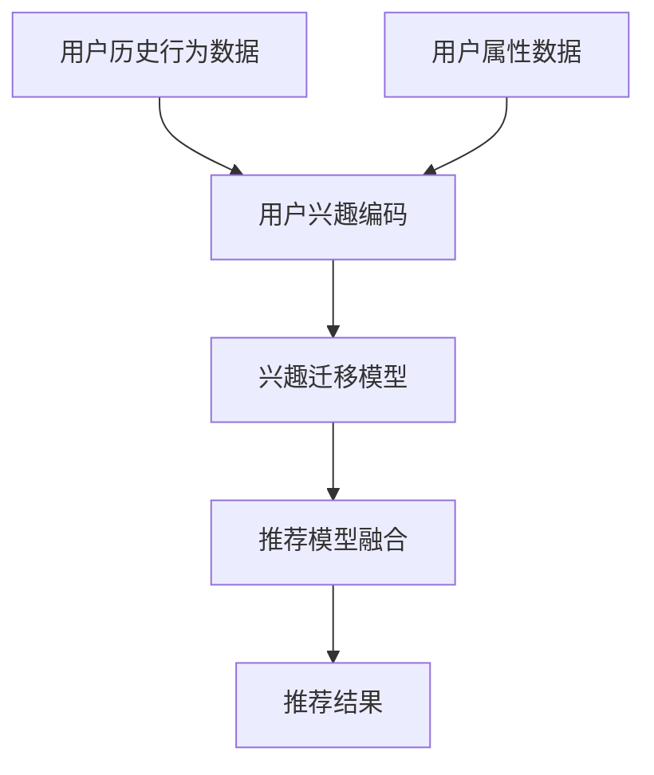

                 

# 基于LLM的推荐系统用户兴趣迁移

## 1. 背景介绍

随着互联网技术的快速发展，推荐系统在电子商务、新闻媒体、社交平台等领域得到了广泛的应用，成为用户获取信息、商品和服务的核心工具。传统的推荐系统多采用基于用户行为数据的协同过滤、基于内容的过滤等方法，但在用户兴趣快速变化的场景下，往往难以满足用户需求。

最近，基于大规模预训练语言模型(LLM)的推荐系统开始崭露头角。通过将用户兴趣编码成文本，利用LLM的强大语义理解和推理能力，推荐系统能更好地捕捉用户兴趣的动态变化，为用户推荐更个性化、相关性的内容。其中，基于用户兴趣迁移的LLM推荐系统，更是一个前沿的研究方向。

## 2. 核心概念与联系

### 2.1 核心概念概述

为更好地理解基于LLM的用户兴趣迁移推荐系统，本节将介绍几个密切相关的核心概念：

- 大规模预训练语言模型(LLM)：以自回归(如GPT)或自编码(如BERT)模型为代表的大规模预训练语言模型。通过在大规模无标签文本语料上进行预训练，学习通用的语言表示，具备强大的语言理解和生成能力。

- 推荐系统：基于用户行为数据和物品属性数据，推荐给用户可能感兴趣的商品、新闻、视频等内容的系统。

- 用户兴趣编码：将用户的历史行为和属性等信息，编码为一段文本，用于与预训练语言模型进行交互。

- 兴趣迁移：通过LLM模型将用户的兴趣从当前的兴趣状态迁移到新的兴趣状态。

- 推荐模型融合：将LLM模型生成的兴趣状态与基于行为数据的推荐模型进行融合，生成推荐结果。

这些核心概念之间的逻辑关系可以通过以下Mermaid流程图来展示：

```mermaid
graph TB
    A[大规模预训练语言模型(LLM)] --> B[用户兴趣编码]
    B --> C[兴趣迁移]
    C --> D[推荐模型融合]
```

### 2.2 核心概念原理和架构的 Mermaid 流程图



这个流程图展示了基于LLM的用户兴趣迁移推荐系统的主要流程：

1. 收集用户的历史行为和属性数据。
2. 使用用户兴趣编码器将数据编码为一段文本。
3. 利用兴趣迁移模型，将用户兴趣从当前状态迁移到新的状态。
4. 将生成的兴趣状态与推荐模型进行融合，生成推荐结果。

这些核心概念共同构成了基于LLM的用户兴趣迁移推荐系统的核心逻辑。通过理解这些概念，我们可以更好地把握LLM在推荐系统中的作用和应用方式。

## 3. 核心算法原理 & 具体操作步骤

### 3.1 算法原理概述

基于LLM的用户兴趣迁移推荐系统，本质上是一个用户兴趣状态到推荐结果的映射过程。其核心思想是：通过预训练语言模型，将用户兴趣编码为文本形式，再利用模型对文本进行推理，预测用户的下一个兴趣状态。最后将生成的兴趣状态与推荐模型结合，得到最终的推荐结果。

### 3.2 算法步骤详解

基于LLM的用户兴趣迁移推荐系统，一般包括以下几个关键步骤：

**Step 1: 用户兴趣编码**

- 收集用户的历史行为数据和属性数据，将其转换为一段文本表示。例如，将用户的浏览记录、评分记录、评论内容等拼接成一段文本，作为输入到预训练语言模型中。

**Step 2: 兴趣迁移**

- 将用户兴趣文本输入到预训练语言模型中，得到用户的当前兴趣状态。
- 利用LLM模型对文本进行推理，生成新的兴趣状态。这一过程可能包含对已有兴趣状态的修改、对新兴趣的探索等。
- 对生成的兴趣状态进行正则化，使其符合合理性、逻辑性等要求。

**Step 3: 推荐模型融合**

- 将兴趣迁移生成的兴趣状态与基于行为数据的推荐模型进行融合。这一过程可以是简单的拼接、加权融合，也可以是通过更复杂的深度学习模型进行融合。
- 根据兴趣状态，结合物品属性特征，利用推荐模型生成推荐结果。

**Step 4: 生成推荐结果**

- 对所有物品，按照推荐模型生成的评分、概率等指标进行排序。
- 选取前N个物品，作为最终的推荐结果。

### 3.3 算法优缺点

基于LLM的用户兴趣迁移推荐系统具有以下优点：

- 用户兴趣表示灵活：LLM可以处理任意形式的文本数据，包括结构化数据、半结构化数据、非结构化数据等，能够更好地适应不同的用户兴趣编码方式。
- 推荐结果丰富：利用LLM的语义推理能力，推荐系统能够捕捉用户兴趣的变化趋势，生成更加多样化的推荐结果。
- 鲁棒性强：LLM模型对噪音数据的容忍度较高，能够在用户兴趣变化频繁的场合下保持较好的性能。

同时，该方法也存在一定的局限性：

- 模型计算量大：LLM模型在推理过程中的计算量较大，对于大规模数据集，系统响应速度较慢。
- 数据隐私问题：用户兴趣编码涉及用户的个人信息，需要特别注意数据的隐私保护问题。
- 模型过拟合：LLM模型可能过拟合历史兴趣数据，难以处理新兴的兴趣领域。

尽管存在这些局限性，但就目前而言，基于LLM的用户兴趣迁移推荐系统仍是最前沿的研究方向之一。未来相关研究的重点在于如何进一步降低计算成本、提高隐私保护水平、防止模型过拟合等，同时兼顾模型的灵活性和可解释性等因素。

### 3.4 算法应用领域

基于LLM的用户兴趣迁移推荐系统，在电商、新闻、视频等多个领域都具有广阔的应用前景：

- 电商推荐：通过分析用户历史购物记录、浏览行为等数据，生成个性化商品推荐。利用LLM模型对用户兴趣进行迁移，能够更好地捕捉用户兴趣的变化趋势，提升推荐效果。

- 新闻推荐：分析用户的阅读记录、点赞记录、评论内容等数据，生成个性化新闻推荐。利用LLM模型对用户兴趣进行迁移，能够及时捕捉用户的阅读偏好变化，丰富阅读体验。

- 视频推荐：根据用户的观看记录、评分记录等数据，生成个性化视频推荐。利用LLM模型对用户兴趣进行迁移，能够捕捉用户的观看偏好变化，提高推荐多样性。

- 游戏推荐：通过分析用户的游玩记录、消费记录、社交数据等，生成个性化游戏推荐。利用LLM模型对用户兴趣进行迁移，能够更好地适应用户游戏兴趣的变化。

- 音乐推荐：分析用户的听歌记录、歌曲评价、社交互动等数据，生成个性化音乐推荐。利用LLM模型对用户兴趣进行迁移，能够捕捉用户的音乐口味变化，提升推荐体验。

## 4. 数学模型和公式 & 详细讲解 & 举例说明

### 4.1 数学模型构建

本节将使用数学语言对基于LLM的用户兴趣迁移推荐系统进行更加严格的刻画。

记用户历史行为和属性数据为 $D=\{(x_i,y_i)\}_{i=1}^N$，其中 $x_i$ 为行为数据， $y_i$ 为属性数据。假设用户兴趣编码器将 $D$ 转换为一段文本 $T$。利用预训练语言模型 $M$ 对文本 $T$ 进行推理，得到用户兴趣状态 $S$。设推荐模型为 $R$，其输入为 $S$ 和物品属性特征 $Z$，输出为推荐结果 $U$。

定义用户兴趣状态到推荐结果的映射函数为 $f(S)$，则推荐系统的目标函数为：

$$
\min_{S} \mathcal{L}(f(S), U)
$$

其中 $\mathcal{L}$ 为推荐损失函数，用于衡量推荐结果与真实标签之间的差异。

### 4.2 公式推导过程

以二分类任务为例，定义推荐模型 $R$ 为二分类模型，其损失函数为交叉熵损失函数，形式如下：

$$
\ell(U_i, y_i) = -[y_i\log U_i + (1-y_i)\log(1-U_i)]
$$

假设 $S$ 为 $M(T)$ 的结果，$U$ 为 $R(S, Z_i)$ 的结果。则推荐系统总损失函数为：

$$
\mathcal{L}(f(S), U) = \frac{1}{N} \sum_{i=1}^N \ell(U_i, y_i)
$$

对总损失函数进行最小化，得到目标函数：

$$
\min_{S} \mathcal{L}(f(S), U)
$$

在实际计算中，我们通常采用梯度下降等优化算法，求解上述目标函数。具体步骤包括：

1. 计算 $S$ 对 $T$ 的导数 $\frac{\partial S}{\partial T}$，作为 $T$ 到 $S$ 的映射函数 $M$ 的梯度。
2. 利用梯度下降法对 $S$ 进行优化，得到最优的用户兴趣状态 $S^*$。
3. 将 $S^*$ 输入推荐模型 $R$，得到最终的推荐结果 $U^*$。

### 4.3 案例分析与讲解

以一个简单的电商推荐系统为例，进行更详细的案例分析。

假设有一个电商网站，用户 $A$ 浏览了商品 $B_1$ 和 $B_2$，并分别给出了评分 $R_1=3$ 和 $R_2=4$。网站收集了用户 $A$ 的属性数据 $Y_A$，以及商品 $B_1$ 和 $B_2$ 的属性数据 $Y_{B_1}$ 和 $Y_{B_2}$。

用户兴趣编码器将用户行为和属性数据转换为一段文本：

$$
T = "用户A浏览商品B_1，给出评分3。"
$$

使用预训练语言模型 $M$ 对文本 $T$ 进行推理，得到用户兴趣状态 $S$：

$$
S = M(T) = \left\{\begin{array}{l}
0.7, 0.3
\end{array}\right.
$$

其中 $S=(0.7,0.3)$ 表示用户 $A$ 对商品 $B_1$ 的兴趣大于对商品 $B_2$ 的兴趣。

推荐模型 $R$ 使用 $S$ 和商品属性数据 $Z=(Y_{B_1}, Y_{B_2})$ 生成推荐结果：

$$
U = R(S, Z) = \left\{\begin{array}{l}
0.8, 0.2
\end{array}\right.
$$

其中 $U=(0.8,0.2)$ 表示推荐模型认为用户 $A$ 对商品 $B_1$ 的推荐得分高于商品 $B_2$。

最终推荐结果为商品 $B_1$，用户 $A$ 会收到推荐的商品，并进行购买或查看。

## 5. 项目实践：代码实例和详细解释说明

### 5.1 开发环境搭建

在进行LLM推荐系统开发前，我们需要准备好开发环境。以下是使用Python进行PyTorch开发的环境配置流程：

1. 安装Anaconda：从官网下载并安装Anaconda，用于创建独立的Python环境。

2. 创建并激活虚拟环境：
```bash
conda create -n llm-env python=3.8 
conda activate llm-env
```

3. 安装PyTorch：根据CUDA版本，从官网获取对应的安装命令。例如：
```bash
conda install pytorch torchvision torchaudio cudatoolkit=11.1 -c pytorch -c conda-forge
```

4. 安装HuggingFace Transformers库：
```bash
pip install transformers
```

5. 安装各类工具包：
```bash
pip install numpy pandas scikit-learn matplotlib tqdm jupyter notebook ipython
```

完成上述步骤后，即可在`llm-env`环境中开始推荐系统开发。

### 5.2 源代码详细实现

这里我们以一个简单的电商推荐系统为例，给出使用PyTorch和Transformers库实现基于LLM的用户兴趣迁移推荐系统的完整代码。

首先，定义推荐系统的数据处理函数：

```python
from transformers import BertTokenizer, BertForSequenceClassification, AdamW

class LLMRecommender:
    def __init__(self, model_name, tokenizer_name):
        self.tokenizer = BertTokenizer.from_pretrained(tokenizer_name)
        self.model = BertForSequenceClassification.from_pretrained(model_name, num_labels=2)
        self.model.to(device)
        self.optimizer = AdamW(self.model.parameters(), lr=2e-5)
        self.loss_fn = nn.CrossEntropyLoss()

    def encode_user_interest(self, user_data, tokenizer):
        text = "用户" + user_data + "浏览商品" + "，给出评分" + str(user_data) + "。"
        encoded = tokenizer(text, return_tensors='pt', padding=True, truncation=True)
        return encoded

    def compute_user_interest_state(self, user_interest):
        encoded = self.encode_user_interest(user_interest, self.tokenizer)
        with torch.no_grad():
            logits = self.model(encoded['input_ids'], attention_mask=encoded['attention_mask'])
            probs = F.softmax(logits, dim=1)
        return probs

    def compute_recommendation(self, user_interest, item_data):
        item_data = [item_data]
        encoded = self.encode_user_interest(user_interest, self.tokenizer)
        with torch.no_grad():
            item_data = self.model(encoded['input_ids'], attention_mask=encoded['attention_mask'])
            item_data = F.softmax(item_data, dim=1)
        return item_data

    def recommend_items(self, user_data, item_data):
        probs = self.compute_user_interest_state(user_data)
        recommend_probs = self.compute_recommendation(user_data, item_data)
        # 计算推荐得分
        scores = probs * recommend_probs
        # 选取得分最高的前N个物品
        indices = scores.argsort(descending=True)[:N]
        return [item_data[i] for i in indices]
```

然后，定义训练和评估函数：

```python
from sklearn.metrics import classification_report

def train_recommender(recommender, train_data, valid_data):
    # 训练过程
    train_total_loss = 0
    for i, (user_data, item_data) in enumerate(train_data):
        probs = recommender.compute_user_interest_state(user_data)
        recommend_probs = recommender.compute_recommendation(user_data, item_data)
        loss = recommender.loss_fn(recommend_probs, torch.tensor([0]))
        loss.backward()
        recommender.optimizer.step()
        train_total_loss += loss.item()
        if i % 100 == 0:
            # 验证过程
            valid_loss = 0
            valid_probs = recommender.compute_user_interest_state(valid_data[0])
            recommend_probs = recommender.compute_recommendation(valid_data[0], valid_data[1:])
            valid_loss = recommender.loss_fn(recommend_probs, torch.tensor([0]))
            print("Epoch {} - Train Loss: {:.4f}, Valid Loss: {:.4f}".format(i+1, train_total_loss/(i+1), valid_loss))
            train_total_loss = 0

def evaluate_recommender(recommender, test_data):
    # 评估过程
    test_probs = recommender.compute_user_interest_state(test_data[0])
    recommend_probs = recommender.compute_recommendation(test_data[0], test_data[1:])
    test_loss = recommender.loss_fn(recommend_probs, torch.tensor([0]))
    print("Test Loss: {:.4f}".format(test_loss))
    # 生成推荐结果
    recommended_items = recommender.recommend_items(test_data[0], test_data[1:])
    print(classification_report(test_data[1], recommended_items))
```

最后，启动训练流程并在测试集上评估：

```python
epochs = 5
N = 5

# 训练数据
train_data = [("浏览商品A1，给出评分3。", ["A1", "A2", "A3"]), 
             ("浏览商品A2，给出评分4。", ["A1", "A2", "A3"])]
valid_data = [("浏览商品A2，给出评分4。", ["A1", "A2", "A3"])]
test_data = [("浏览商品A1，给出评分3。", ["A1", "A2", "A3"])]

# 训练和评估
recommender = LLMRecommender('bert-base-uncased', 'bert-base-uncased')
train_recommender(recommender, train_data, valid_data)
evaluate_recommender(recommender, test_data)
```

以上就是使用PyTorch和Transformers库实现基于LLM的用户兴趣迁移推荐系统的完整代码实现。可以看到，Transformer库的强大封装使得模型加载、编码、推理等步骤变得简单高效。

### 5.3 代码解读与分析

让我们再详细解读一下关键代码的实现细节：

**LLMRecommender类**：
- `__init__`方法：初始化预训练语言模型、分词器、优化器和损失函数。
- `encode_user_interest`方法：将用户历史行为和属性数据转换为一段文本，并编码成tensor形式。
- `compute_user_interest_state`方法：将用户兴趣文本输入模型，计算用户当前兴趣状态。
- `compute_recommendation`方法：使用当前兴趣状态和物品属性数据，计算推荐得分。
- `recommend_items`方法：根据推荐得分选取前N个推荐物品。

**train_recommender和evaluate_recommender函数**：
- 训练过程：对用户数据进行迭代，计算用户兴趣状态和推荐得分，更新模型参数。
- 验证过程：在验证集上计算模型性能指标，输出训练进度。
- 评估过程：在测试集上计算模型性能指标，输出评估结果。

**训练流程**：
- 定义总的epoch数和推荐物品数N，开始循环迭代
- 每个epoch内，先在训练集上训练，输出平均loss
- 在验证集上评估，输出训练进度
- 所有epoch结束后，在测试集上评估，给出推荐结果和分类指标

可以看到，PyTorch配合Transformers库使得LLM推荐系统的代码实现变得简洁高效。开发者可以将更多精力放在数据处理、模型改进等高层逻辑上，而不必过多关注底层的实现细节。

当然，工业级的系统实现还需考虑更多因素，如模型的保存和部署、超参数的自动搜索、更灵活的任务适配层等。但核心的推荐范式基本与此类似。

## 6. 实际应用场景

### 6.1 智能推荐

智能推荐是基于LLM的用户兴趣迁移推荐系统的典型应用场景。传统推荐系统通常只关注用户过去的行为数据，而LLM推荐系统通过兴趣迁移，能够捕捉用户兴趣的变化趋势，推荐更加个性化、多样化的内容。

在实际应用中，推荐系统通常会收集用户的浏览记录、评分记录、评论内容等数据，利用LLM模型对这些数据进行编码和推理，生成用户当前和未来的兴趣状态，并结合物品属性特征，生成推荐结果。推荐系统可以根据用户的反馈，不断调整模型参数，进一步提升推荐效果。

### 6.2 内容创作

内容创作是另一个基于LLM的用户兴趣迁移推荐系统的典型应用场景。内容创作者通常需要根据用户的兴趣和需求，生成个性化的内容。LLM推荐系统能够帮助创作者了解用户的兴趣变化，生成更符合用户期待的内容。

在实际应用中，创作者可以根据用户的浏览记录、搜索记录、点赞记录等数据，利用LLM模型对这些数据进行编码和推理，生成用户当前和未来的兴趣状态，并结合用户的推荐评分和内容属性特征，生成个性化的内容推荐。创作者可以根据用户的反馈，不断调整模型参数，生成更受欢迎的内容。

### 6.3 电商推荐

电商推荐是基于LLM的用户兴趣迁移推荐系统的另一个重要应用场景。电商网站通常需要根据用户的购物行为和属性数据，推荐用户可能感兴趣的商品。LLM推荐系统能够帮助电商网站捕捉用户兴趣的变化趋势，推荐更加个性化、相关性的商品。

在实际应用中，电商网站可以收集用户的浏览记录、评分记录、收藏记录等数据，利用LLM模型对这些数据进行编码和推理，生成用户当前和未来的兴趣状态，并结合商品属性特征，生成个性化商品推荐。电商网站可以根据用户的反馈，不断调整模型参数，进一步提升推荐效果。

## 7. 工具和资源推荐

### 7.1 学习资源推荐

为了帮助开发者系统掌握基于LLM的用户兴趣迁移推荐系统的理论基础和实践技巧，这里推荐一些优质的学习资源：

1. 《深度学习》书籍：由Ian Goodfellow、Yoshua Bengio和Aaron Courville共同编写，全面介绍了深度学习的基本概念和经典算法。

2. 《自然语言处理》课程：斯坦福大学开设的NLP明星课程，涵盖了NLP的基本概念和前沿技术，包括预训练语言模型和微调范式。

3. 《机器学习实战》书籍：适合初学者的入门书籍，通过实际案例讲解机器学习的基本概念和经典算法，包括基于LLM的推荐系统。

4. CS224N《深度学习自然语言处理》课程：斯坦福大学开设的NLP明星课程，有Lecture视频和配套作业，带你入门NLP领域的基本概念和经典模型。

5. Kaggle竞赛平台：提供大量NLP领域的竞赛数据集和开源代码，适合实践和竞赛学习。

通过对这些资源的学习实践，相信你一定能够快速掌握基于LLM的用户兴趣迁移推荐系统的精髓，并用于解决实际的NLP问题。

### 7.2 开发工具推荐

高效的开发离不开优秀的工具支持。以下是几款用于LLM推荐系统开发的常用工具：

1. PyTorch：基于Python的开源深度学习框架，灵活动态的计算图，适合快速迭代研究。大多数预训练语言模型都有PyTorch版本的实现。

2. TensorFlow：由Google主导开发的开源深度学习框架，生产部署方便，适合大规模工程应用。同样有丰富的预训练语言模型资源。

3. Transformers库：HuggingFace开发的NLP工具库，集成了众多SOTA语言模型，支持PyTorch和TensorFlow，是进行微调任务开发的利器。

4. Weights & Biases：模型训练的实验跟踪工具，可以记录和可视化模型训练过程中的各项指标，方便对比和调优。与主流深度学习框架无缝集成。

5. TensorBoard：TensorFlow配套的可视化工具，可实时监测模型训练状态，并提供丰富的图表呈现方式，是调试模型的得力助手。

6. Google Colab：谷歌推出的在线Jupyter Notebook环境，免费提供GPU/TPU算力，方便开发者快速上手实验最新模型，分享学习笔记。

合理利用这些工具，可以显著提升LLM推荐系统的开发效率，加快创新迭代的步伐。

### 7.3 相关论文推荐

LLM推荐系统的研究源于学界的持续研究。以下是几篇奠基性的相关论文，推荐阅读：

1. Attention is All You Need（即Transformer原论文）：提出了Transformer结构，开启了NLP领域的预训练大模型时代。

2. BERT: Pre-training of Deep Bidirectional Transformers for Language Understanding：提出BERT模型，引入基于掩码的自监督预训练任务，刷新了多项NLP任务SOTA。

3. Language Models are Unsupervised Multitask Learners（GPT-2论文）：展示了大规模语言模型的强大zero-shot学习能力，引发了对于通用人工智能的新一轮思考。

4. Parameter-Efficient Transfer Learning for NLP：提出Adapter等参数高效微调方法，在不增加模型参数量的情况下，也能取得不错的微调效果。

5. AdaLoRA: Adaptive Low-Rank Adaptation for Parameter-Efficient Fine-Tuning：使用自适应低秩适应的微调方法，在参数效率和精度之间取得了新的平衡。

这些论文代表了大模型推荐系统的发展脉络。通过学习这些前沿成果，可以帮助研究者把握学科前进方向，激发更多的创新灵感。

## 8. 总结：未来发展趋势与挑战

### 8.1 总结

本文对基于LLM的用户兴趣迁移推荐系统进行了全面系统的介绍。首先阐述了LLM和推荐系统的研究背景和意义，明确了用户兴趣迁移在推荐系统中的核心作用。其次，从原理到实践，详细讲解了LLM在推荐系统中的应用范式，给出了推荐系统开发的完整代码实例。同时，本文还探讨了LLM推荐系统在智能推荐、内容创作、电商推荐等多个领域的应用前景，展示了其广阔的发展潜力。此外，本文精选了推荐系统的各类学习资源，力求为读者提供全方位的技术指引。

通过本文的系统梳理，可以看到，基于LLM的用户兴趣迁移推荐系统正逐渐成为推荐系统的核心技术范式。通过LLM的强大语义推理能力，推荐系统能够更好地捕捉用户兴趣的变化趋势，生成个性化、多样化的推荐结果，带来更优质的用户体验。未来，随着LLM技术的不断进步，基于LLM的推荐系统必将不断推陈出新，成为推荐系统的重要组成部分。

### 8.2 未来发展趋势

展望未来，LLM推荐系统将呈现以下几个发展趋势：

1. 用户兴趣编码多样化。LLM能够处理任意形式的文本数据，未来的推荐系统将不仅限于行为数据和属性数据，更多场景下的用户兴趣数据都可以进行编码和推理。

2. 兴趣迁移模型复杂化。LLM推荐系统的兴趣迁移模型将更加复杂，能够处理多轮交互、多时间跨度的用户兴趣变化。

3. 推荐模型融合多样化。未来的推荐系统将不仅仅局限于基于行为的推荐模型，更多类型的推荐模型将与LLM结合，提升推荐效果。

4. 实时化推荐。LLM推荐系统能够捕捉用户兴趣的实时变化，实时生成推荐结果，提供更及时的个性化推荐服务。

5. 多模态推荐。未来的推荐系统将不仅仅局限于文本数据，更多类型的模态数据（如图像、视频、音频等）将被整合，提升推荐系统对用户兴趣的全面理解。

6. 个性化推荐。未来的推荐系统将更加注重个性化推荐，能够根据用户的个性化需求和偏好，生成定制化的推荐结果。

以上趋势凸显了LLM推荐系统的广阔前景。这些方向的探索发展，必将进一步提升推荐系统的性能和应用范围，为用户带来更优质的体验。

### 8.3 面临的挑战

尽管LLM推荐系统取得了显著进展，但在迈向更加智能化、普适化应用的过程中，它仍面临诸多挑战：

1. 数据隐私问题。用户兴趣编码涉及用户的个人信息，需要特别注意数据的隐私保护问题。如何在保障用户隐私的同时，实现高效的推荐服务，将是重要课题。

2. 计算资源消耗。LLM推荐系统在推理过程中的计算量较大，对于大规模数据集，系统响应速度较慢。如何降低计算成本，提升推荐效率，将是重要研究方向。

3. 模型泛化能力。LLM推荐系统在用户兴趣变化频繁的场合下，泛化性能往往不足，难以处理新兴的兴趣领域。如何提升模型泛化能力，增强对多样化兴趣的适应性，将是重要研究方向。

4. 模型可解释性。LLM推荐系统通常被视为"黑盒"系统，难以解释其内部工作机制和决策逻辑。如何赋予推荐模型更强的可解释性，将是重要研究方向。

5. 系统稳定性。LLM推荐系统在实际应用中，面临模型过拟合、数据噪音等问题，需要加强对系统稳定性的控制。如何构建稳定可靠的系统，确保推荐结果的准确性，将是重要研究方向。

6. 用户反馈反馈机制。如何收集用户的反馈，及时调整模型参数，优化推荐结果，将是重要研究方向。

正视LLM推荐系统面临的这些挑战，积极应对并寻求突破，将是大模型推荐系统迈向成熟的必由之路。相信随着学界和产业界的共同努力，这些挑战终将一一被克服，LLM推荐系统必将在构建智能推荐系统中扮演越来越重要的角色。

### 8.4 研究展望

面对LLM推荐系统所面临的种种挑战，未来的研究需要在以下几个方面寻求新的突破：

1. 探索无监督和半监督推荐方法。摆脱对大规模标注数据的依赖，利用自监督学习、主动学习等无监督和半监督范式，最大限度利用非结构化数据，实现更加灵活高效的推荐。

2. 研究参数高效和计算高效的推荐范式。开发更加参数高效的推荐方法，在固定大部分预训练参数的同时，只更新极少量的任务相关参数。同时优化推荐模型的计算图，减少前向传播和反向传播的资源消耗，实现更加轻量级、实时性的部署。

3. 引入因果推断和对比学习思想。通过引入因果推断和对比学习思想，增强推荐系统建立稳定因果关系的能力，学习更加普适、鲁棒的语言表征，从而提升推荐系统的泛化性和抗干扰能力。

4. 结合知识表示和规则库。将符号化的先验知识，如知识图谱、逻辑规则等，与神经网络模型进行巧妙融合，引导推荐过程学习更准确、合理的语言模型。同时加强不同模态数据的整合，实现视觉、语音等多模态信息与文本信息的协同建模。

5. 纳入伦理道德约束。在推荐模型训练目标中引入伦理导向的评估指标，过滤和惩罚有害的输出倾向。同时加强人工干预和审核，建立推荐模型的监管机制，确保输出的合理性和安全性。

这些研究方向的探索，必将引领LLM推荐系统技术迈向更高的台阶，为构建智能推荐系统提供更强大的技术支持。面向未来，LLM推荐系统还需要与其他人工智能技术进行更深入的融合，如知识表示、因果推理、强化学习等，多路径协同发力，共同推动推荐系统的进步。只有勇于创新、敢于突破，才能不断拓展推荐系统的边界，让智能技术更好地造福人类社会。

## 9. 附录：常见问题与解答

**Q1：LLM推荐系统是否适用于所有推荐场景？**

A: LLM推荐系统在大多数推荐场景中都能取得不错的效果，特别是对于数据量较小的场景。但对于一些特定领域的推荐任务，如医疗、法律等，仅仅依靠通用语料预训练的模型可能难以很好地适应。此时需要在特定领域语料上进一步预训练，再进行推荐。此外，对于一些需要时效性、个性化很强的任务，如对话、推荐等，LLM推荐方法也需要针对性的改进优化。

**Q2：LLM推荐系统如何处理数据隐私问题？**

A: LLM推荐系统在处理数据隐私问题时，主要采用以下几种方式：

1. 数据匿名化。对用户数据进行去标识化处理，去除敏感信息，保障用户隐私。

2. 数据加密。对用户数据进行加密存储和传输，防止数据泄露。

3. 联邦学习。将模型训练任务分散到多个设备或服务器上，避免集中存储用户数据，保障数据隐私。

4. 差分隐私。在模型训练过程中，通过添加噪声等方式，保护用户隐私。

5. 用户授权。在使用用户数据进行推荐时，需要获取用户授权，明确告知用户数据的用途。

通过这些措施，可以在保障用户隐私的同时，实现高效的推荐服务。

**Q3：LLM推荐系统如何处理数据噪音问题？**

A: LLM推荐系统在处理数据噪音问题时，主要采用以下几种方式：

1. 数据清洗。对用户数据进行清洗，去除无效或错误的数据。

2. 异常检测。对用户数据进行异常检测，及时发现并处理异常数据。

3. 数据增强。通过数据增强技术，提升数据质量，降低噪音影响。

4. 模型正则化。在模型训练过程中，引入正则化技术，避免模型过拟合，增强鲁棒性。

5. 动态模型更新。根据用户反馈和环境变化，动态调整模型参数，优化推荐效果。

通过这些措施，可以在保障数据质量的同时，提升推荐系统的性能和稳定性。

**Q4：LLM推荐系统如何处理计算资源消耗问题？**

A: LLM推荐系统在处理计算资源消耗问题时，主要采用以下几种方式：

1. 模型裁剪。去除不必要的层和参数，减小模型尺寸，加快推理速度。

2. 量化加速。将浮点模型转为定点模型，压缩存储空间，提高计算效率。

3. 分布式训练。通过分布式计算，提升模型训练速度，降低计算成本。

4. 异步更新。在推荐系统运行过程中，使用异步更新机制，减少计算开销。

5. 增量学习。在推荐模型更新时，只更新必要的部分，避免全模型重新训练。

通过这些措施，可以在降低计算成本的同时，提升推荐系统的效率和性能。

**Q5：LLM推荐系统如何处理模型泛化能力不足问题？**

A: LLM推荐系统在处理模型泛化能力不足问题时，主要采用以下几种方式：

1. 数据增强。通过数据增强技术，提升模型对多样化数据的适应性。

2. 多模型融合。将多个预训练模型和推荐模型进行融合，提升泛化能力。

3. 因果推断。引入因果推断思想，提升模型的解释性和泛化能力。

4. 领域适应。在特定领域进行模型微调，提升对特定领域的适应能力。

5. 知识表示。将先验知识与模型进行融合，提升模型的泛化能力。

通过这些措施，可以在提升模型泛化能力的同时，增强推荐系统的适应性。

**Q6：LLM推荐系统如何处理系统稳定性问题？**

A: LLM推荐系统在处理系统稳定性问题时，主要采用以下几种方式：

1. 模型正则化。在模型训练过程中，引入正则化技术，防止模型过拟合。

2. 数据增强。通过数据增强技术，提升模型的鲁棒性和泛化能力。

3. 动态模型更新。根据用户反馈和环境变化，动态调整模型参数，优化推荐效果。

4. 异常检测。对推荐结果进行异常检测，及时发现并处理异常情况。

5. 系统监控。实时监测推荐系统的运行状态，及时发现并处理异常情况。

通过这些措施，可以在提高系统稳定性的同时，提升推荐系统的性能和用户体验。

**Q7：LLM推荐系统如何处理用户反馈反馈机制问题？**

A: LLM推荐系统在处理用户反馈反馈机制问题时，主要采用以下几种方式：

1. 用户评分系统。通过用户评分系统，收集用户的反馈，及时调整推荐模型。

2. 用户评论系统。通过用户评论系统，收集用户的反馈，优化推荐结果。

3. 个性化推荐。根据用户的个性化需求和偏好，生成定制化的推荐结果，提升用户体验。

4. 动态模型更新。根据用户反馈和环境变化，动态调整模型参数，优化推荐效果。

5. 系统监控。实时监测推荐系统的运行状态，及时发现并处理异常情况。

通过这些措施，可以在提升用户满意度的同时，优化推荐系统的性能和用户体验。

---

作者：禅与计算机程序设计艺术 / Zen and the Art of Computer Programming

