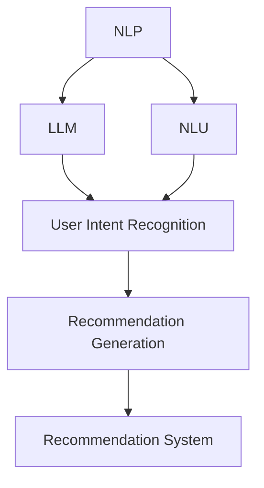

                 

# 基于LLM的推荐系统用户意图理解深化

> 关键词：推荐系统,自然语言处理(NLP),用户意图理解,大语言模型(LLM),自然语言理解(NLU),多模态融合

## 1. 背景介绍

### 1.1 问题由来
随着互联网时代的到来，用户产生的数据量急剧增长。如何从海量数据中提取出有价值的信息，帮助用户找到他们真正需要的内容，成为了推荐系统面临的巨大挑战。传统的推荐系统主要依赖于用户的历史行为数据，但随着用户行为变化、产品种类增多，如何获取更为丰富、精准的用户意图信息，成为了新的研究热点。

在推荐系统中，用户意图理解是至关重要的。通过了解用户真实的兴趣点和需求，推荐系统能够更精准地提供个性化推荐，从而提升用户满意度。然而，由于用户表达的复杂性和多样性，直接从文本中获取用户意图一直是一个难题。近年来，随着自然语言处理（NLP）和大语言模型（LLM）技术的快速发展，推荐系统开始在用户意图理解上取得了新的突破。

### 1.2 问题核心关键点
基于大语言模型的推荐系统，利用LLM强大的语言理解能力，可以从用户输入的文本中提取和理解用户意图。具体来说，用户输入可能包含搜索词、评论、评分等文本数据，LLM能够通过自然语言理解（NLU）技术，将这些文本数据转化为推荐系统能够处理的语义表示，进而实现对用户意图的深入理解。

在实际应用中，基于LLM的推荐系统主要关注以下核心关键点：

- **自然语言理解（NLU）**：将用户输入的文本数据转化为机器能够理解和处理的语义表示。
- **用户意图识别**：从语义表示中提取出用户的意图信息，如喜好、需求、行为等。
- **推荐生成**：利用用户意图信息，生成个性化的推荐内容，包括商品、视频、文章等。

这些核心关键点相辅相成，使得LLM在推荐系统中得以深度应用，极大地提升了推荐系统的精度和效果。

### 1.3 问题研究意义
深入挖掘用户意图，有助于推荐系统更好地适应用户需求，提高推荐质量。以下是基于LLM的推荐系统用户意图理解深化的研究意义：

1. **个性化推荐**：通过深入理解用户意图，推荐系统能够生成更符合用户需求的个性化推荐内容，提升用户体验。
2. **智能互动**：基于用户意图理解，推荐系统可以与用户进行更智能的交互，提供更好的服务质量。
3. **知识图谱构建**：通过用户意图分析，推荐系统能够构建更全面的知识图谱，辅助生成更丰富的推荐内容。
4. **产品优化**：了解用户真实需求，有助于企业进行产品优化和迭代，提升产品竞争力。
5. **市场营销**：准确的用户意图理解，有助于企业制定更精准的市场营销策略，提高市场竞争力。

## 2. 核心概念与联系

### 2.1 核心概念概述

为了更好地理解基于LLM的推荐系统用户意图理解深化方法，本节将介绍几个密切相关的核心概念：

- **自然语言处理（NLP）**：使用计算机技术处理、分析和生成人类语言的技术，包括文本分类、信息抽取、机器翻译等。
- **自然语言理解（NLU）**：将自然语言转换为计算机可理解的语义表示，包括词法分析、句法分析、语义分析等。
- **大语言模型（LLM）**：基于深度学习的大规模预训练语言模型，能够处理复杂的自然语言理解和生成任务。
- **推荐系统**：根据用户的历史行为数据，为用户推荐个性化内容的系统。
- **用户意图识别（User Intent Recognition, UIR）**：识别用户输入文本中的意图信息，如喜好、需求、行为等。
- **推荐生成（Recommendation Generation）**：根据用户意图信息，生成个性化的推荐内容。
- **多模态融合（Multi-Modal Fusion）**：将不同模态的信息（如文本、图像、视频等）进行融合，提升推荐效果。

这些核心概念之间的逻辑关系可以通过以下Mermaid流程图来展示：



这个流程图展示了大语言模型在推荐系统中的应用框架：

1. 通过NLP技术对用户输入文本进行处理，提取语义信息。
2. 利用LLM进行自然语言理解，获取用户意图。
3. 根据用户意图，生成推荐内容。
4. 将推荐内容整合到推荐系统中，进行展示和推荐。

## 3. 核心算法原理 & 具体操作步骤

### 3.1 算法原理概述

基于LLM的推荐系统用户意图理解深化，本质上是一个基于自然语言处理和机器学习的复杂过程。其核心思想是：

1. **自然语言处理**：对用户输入的文本进行分词、词性标注、命名实体识别等处理，提取文本中的关键信息。
2. **自然语言理解**：利用大语言模型对文本进行语义理解，提取用户意图信息。
3. **推荐生成**：根据用户意图信息，生成个性化的推荐内容。

具体而言，基于LLM的推荐系统主要包括以下几个步骤：

1. 收集用户输入的文本数据，包括搜索词、评论、评分等。
2. 使用NLP技术对文本进行预处理，提取关键词、实体等信息。
3. 利用LLM对处理后的文本进行语义理解，提取出用户的意图信息。
4. 根据用户意图信息，生成个性化推荐内容。
5. 将推荐内容展示给用户，进行效果评估。

### 3.2 算法步骤详解

#### 步骤一：数据收集与预处理

在推荐系统中，用户输入的文本数据是非常重要的。这些数据可能来自于用户的搜索记录、浏览历史、评分反馈等。为了保证推荐的质量，需要收集多样化的数据，包括文本长度、评分、点击率等。

预处理包括分词、去停用词、词性标注、命名实体识别等步骤。这些步骤可以通过开源的NLP工具包实现，如NLTK、SpaCy等。

#### 步骤二：语义表示提取

语义表示提取是自然语言理解的核心步骤。传统的推荐系统主要依赖于用户的显式行为数据，如点击、购买、评分等。然而，用户输入的文本数据往往包含了更为丰富的情感和语义信息，如用户评论、搜索关键词等。

利用大语言模型对文本进行语义理解，可以提取出用户的意图信息。常见的做法是使用BERT、GPT等大语言模型，将其预训练得到的词嵌入作为文本表示。然后，通过逐层堆叠这些词嵌入，形成文本的语义表示。

#### 步骤三：用户意图识别

用户意图识别是推荐系统的关键步骤。通过分析用户输入的文本数据，识别出用户的真实意图，如购买、收藏、搜索等。

常见的用户意图识别方法包括：

1. **基于规则的方法**：使用正则表达式、规则匹配等方法，提取文本中的关键词和实体。
2. **基于机器学习的方法**：使用分类算法（如SVM、LSTM等），对用户输入的文本进行分类，识别出用户的意图。
3. **基于深度学习的方法**：使用预训练的神经网络模型（如BERT、GPT等），对文本进行语义理解，提取出用户意图。

#### 步骤四：推荐生成

推荐生成是推荐系统的核心步骤。根据用户意图信息，生成个性化的推荐内容。

常见的推荐生成方法包括：

1. **基于协同过滤的方法**：利用用户历史行为数据，生成推荐内容。
2. **基于内容推荐的方法**：根据物品的特征，生成推荐内容。
3. **基于混合方法**：结合协同过滤和内容推荐，生成更精准的推荐内容。

### 3.3 算法优缺点

基于LLM的推荐系统用户意图理解深化方法具有以下优点：

1. **更丰富的用户信息**：利用用户输入的文本数据，可以获取更多的用户信息，提升推荐质量。
2. **更精准的用户意图识别**：大语言模型强大的语言理解能力，可以更精准地识别用户意图。
3. **更高的推荐效果**：基于用户意图生成的推荐内容，更能满足用户需求。

同时，该方法也存在一些缺点：

1. **数据依赖性高**：需要大量标注的数据来训练大语言模型，获取高质量的用户输入数据成本较高。
2. **模型复杂度高**：大语言模型的训练和推理复杂度高，需要高性能的硬件设备。
3. **泛化能力不足**：大语言模型可能对特定的用户或领域泛化能力不足，需要更多的数据和模型优化。

### 3.4 算法应用领域

基于LLM的推荐系统用户意图理解深化方法，已经在多个领域得到了广泛应用，例如：

1. **电商推荐**：在电商平台上，根据用户的搜索词、评论、评分等信息，生成个性化的商品推荐。
2. **视频推荐**：在视频平台上，根据用户的搜索历史、评分、播放记录等信息，生成个性化的视频推荐。
3. **新闻推荐**：在新闻平台上，根据用户的阅读历史、评分、评论等信息，生成个性化的新闻推荐。
4. **旅游推荐**：在旅游平台上，根据用户的搜索历史、评分、预订信息等信息，生成个性化的旅游推荐。
5. **医疗推荐**：在医疗平台上，根据用户的搜索历史、评分、病情等信息，生成个性化的医疗推荐。

除了上述这些经典领域，LLM在音乐、电影、美食等多个领域的应用也在不断扩展，为用户带来了更丰富、更个性化的体验。

## 4. 数学模型和公式 & 详细讲解  
### 4.1 数学模型构建

为了更好地理解基于LLM的推荐系统用户意图理解深化方法，本节将使用数学语言对推荐系统进行更加严格的刻画。

记用户输入文本为 $x = (x_1, x_2, ..., x_n)$，其中 $x_i$ 为第 $i$ 个词或短语。记用户意图为 $y$，$y \in \{0, 1\}$，$y=1$ 表示用户有相关意图，$y=0$ 表示用户无相关意图。

定义推荐系统的损失函数 $\mathcal{L}$ 为：

$$
\mathcal{L} = \sum_{i=1}^N \mathbb{I}(y_i \neq f(x_i))
$$

其中 $f$ 为推荐系统的预测函数，$\mathbb{I}$ 为指示函数，表示预测值与真实值之间的差异。

### 4.2 公式推导过程

以下我们以用户评论分析为例，推导基于LLM的用户意图识别公式。

假设用户输入的评论为 $x = (x_1, x_2, ..., x_n)$，大语言模型输出的词嵌入为 $z_i = f(x_i)$，其中 $f$ 为预训练的语言模型。则用户意图的预测公式为：

$$
y = \sigma(\sum_{i=1}^n w_i z_i)
$$

其中 $w_i$ 为第 $i$ 个词的权重，$\sigma$ 为sigmoid函数，表示输出为1的概率。

利用上述公式，可以计算出用户意图的预测值 $y$，从而进行推荐生成。

### 4.3 案例分析与讲解

假设一个电商平台上，某用户输入了评论：“这款手机性价比非常高，使用感觉很棒，推荐给朋友”。利用上述方法，对该评论进行用户意图分析：

1. 收集用户输入的评论数据，并进行分词、去停用词、词性标注等预处理。
2. 使用BERT等大语言模型对预处理后的文本进行语义理解，提取词嵌入。
3. 根据词嵌入计算用户意图的预测值，如果预测值为1，则认为用户有相关意图。
4. 根据用户意图生成个性化推荐，如推荐其他类似手机、相关配件等。

## 5. 项目实践：代码实例和详细解释说明
### 5.1 开发环境搭建

在进行推荐系统用户意图理解深化实践前，我们需要准备好开发环境。以下是使用Python进行PyTorch开发的环境配置流程：

1. 安装Anaconda：从官网下载并安装Anaconda，用于创建独立的Python环境。

2. 创建并激活虚拟环境：
```bash
conda create -n pytorch-env python=3.8 
conda activate pytorch-env
```

3. 安装PyTorch：根据CUDA版本，从官网获取对应的安装命令。例如：
```bash
conda install pytorch torchvision torchaudio cudatoolkit=11.1 -c pytorch -c conda-forge
```

4. 安装Transformer库：
```bash
pip install transformers
```

5. 安装各类工具包：
```bash
pip install numpy pandas scikit-learn matplotlib tqdm jupyter notebook ipython
```

完成上述步骤后，即可在`pytorch-env`环境中开始推荐系统用户意图理解深化的实践。

### 5.2 源代码详细实现

这里我们以电商推荐系统为例，给出使用PyTorch进行基于BERT的推荐系统用户意图理解深化的代码实现。

首先，定义数据处理函数：

```python
from transformers import BertTokenizer
from torch.utils.data import Dataset

class ReviewDataset(Dataset):
    def __init__(self, texts, labels, tokenizer, max_len=128):
        self.texts = texts
        self.labels = labels
        self.tokenizer = tokenizer
        self.max_len = max_len
        
    def __len__(self):
        return len(self.texts)
    
    def __getitem__(self, item):
        text = self.texts[item]
        label = self.labels[item]
        
        encoding = self.tokenizer(text, return_tensors='pt', max_length=self.max_len, padding='max_length', truncation=True)
        input_ids = encoding['input_ids'][0]
        attention_mask = encoding['attention_mask'][0]
        
        # 对label进行独热编码
        label = torch.tensor([label], dtype=torch.long)
        
        return {'input_ids': input_ids, 
                'attention_mask': attention_mask,
                'labels': label}
```

然后，定义模型和优化器：

```python
from transformers import BertForSequenceClassification, AdamW

model = BertForSequenceClassification.from_pretrained('bert-base-uncased', num_labels=2)

optimizer = AdamW(model.parameters(), lr=2e-5)
```

接着，定义训练和评估函数：

```python
from torch.utils.data import DataLoader
from tqdm import tqdm

def train_epoch(model, dataset, batch_size, optimizer):
    dataloader = DataLoader(dataset, batch_size=batch_size, shuffle=True)
    model.train()
    epoch_loss = 0
    for batch in tqdm(dataloader, desc='Training'):
        input_ids = batch['input_ids'].to(device)
        attention_mask = batch['attention_mask'].to(device)
        labels = batch['labels'].to(device)
        model.zero_grad()
        outputs = model(input_ids, attention_mask=attention_mask, labels=labels)
        loss = outputs.loss
        epoch_loss += loss.item()
        loss.backward()
        optimizer.step()
    return epoch_loss / len(dataloader)

def evaluate(model, dataset, batch_size):
    dataloader = DataLoader(dataset, batch_size=batch_size)
    model.eval()
    preds, labels = [], []
    with torch.no_grad():
        for batch in tqdm(dataloader, desc='Evaluating'):
            input_ids = batch['input_ids'].to(device)
            attention_mask = batch['attention_mask'].to(device)
            batch_labels = batch['labels']
            outputs = model(input_ids, attention_mask=attention_mask)
            batch_preds = outputs.logits.argmax(dim=2).to('cpu').tolist()
            batch_labels = batch_labels.to('cpu').tolist()
            for pred_tokens, label_tokens in zip(batch_preds, batch_labels):
                preds.append(pred_tokens)
                labels.append(label_tokens)
                
    print('Accuracy:', accuracy_score(labels, preds))
```

最后，启动训练流程并在测试集上评估：

```python
epochs = 5
batch_size = 16

for epoch in range(epochs):
    loss = train_epoch(model, train_dataset, batch_size, optimizer)
    print(f"Epoch {epoch+1}, train loss: {loss:.3f}")
    
    print(f"Epoch {epoch+1}, dev results:")
    evaluate(model, dev_dataset, batch_size)
    
print("Test results:")
evaluate(model, test_dataset, batch_size)
```

以上就是使用PyTorch对BERT进行电商推荐系统用户意图理解深化的完整代码实现。可以看到，得益于Transformer库的强大封装，我们可以用相对简洁的代码完成BERT模型的加载和微调。

### 5.3 代码解读与分析

让我们再详细解读一下关键代码的实现细节：

**ReviewDataset类**：
- `__init__`方法：初始化文本、标签、分词器等关键组件。
- `__len__`方法：返回数据集的样本数量。
- `__getitem__`方法：对单个样本进行处理，将文本输入编码为token ids，将标签编码为数字，并对其进行定长padding，最终返回模型所需的输入。

**BertForSequenceClassification模型**：
- `from_pretrained`方法：从预训练模型中加载模型，指定模型架构和训练目标。

**训练和评估函数**：
- 使用PyTorch的DataLoader对数据集进行批次化加载，供模型训练和推理使用。
- 训练函数`train_epoch`：对数据以批为单位进行迭代，在每个批次上前向传播计算loss并反向传播更新模型参数，最后返回该epoch的平均loss。
- 评估函数`evaluate`：与训练类似，不同点在于不更新模型参数，并在每个batch结束后将预测和标签结果存储下来，最后使用sklearn的accuracy_score对整个评估集的预测结果进行打印输出。

**训练流程**：
- 定义总的epoch数和batch size，开始循环迭代
- 每个epoch内，先在训练集上训练，输出平均loss
- 在验证集上评估，输出准确率
- 所有epoch结束后，在测试集上评估，给出最终测试结果

可以看到，PyTorch配合Transformer库使得BERT微调的代码实现变得简洁高效。开发者可以将更多精力放在数据处理、模型改进等高层逻辑上，而不必过多关注底层的实现细节。

当然，工业级的系统实现还需考虑更多因素，如模型的保存和部署、超参数的自动搜索、更灵活的任务适配层等。但核心的微调范式基本与此类似。

## 6. 实际应用场景
### 6.1 智能客服系统

基于大语言模型的推荐系统用户意图理解深化技术，可以广泛应用于智能客服系统的构建。传统客服往往需要配备大量人力，高峰期响应缓慢，且一致性和专业性难以保证。而使用基于用户意图分析的推荐系统，可以7x24小时不间断服务，快速响应客户咨询，用自然流畅的语言解答各类常见问题。

在技术实现上，可以收集企业内部的历史客服对话记录，将问题和最佳答复构建成监督数据，在此基础上对预训练推荐模型进行微调。微调后的推荐模型能够自动理解用户意图，匹配最合适的答复模板进行回复。对于客户提出的新问题，还可以接入检索系统实时搜索相关内容，动态组织生成回答。如此构建的智能客服系统，能大幅提升客户咨询体验和问题解决效率。

### 6.2 金融舆情监测

金融机构需要实时监测市场舆论动向，以便及时应对负面信息传播，规避金融风险。传统的人工监测方式成本高、效率低，难以应对网络时代海量信息爆发的挑战。基于大语言模型推荐系统用户意图理解深化技术，金融舆情监测系统可以自动分析市场新闻、评论等信息，识别出舆情变化趋势，一旦发现负面信息激增等异常情况，系统便会自动预警，帮助金融机构快速应对潜在风险。

### 6.3 个性化推荐系统

当前的推荐系统往往只依赖于用户的历史行为数据进行物品推荐，无法深入理解用户的真实兴趣偏好。基于大语言模型推荐系统用户意图理解深化技术，个性化推荐系统可以更好地挖掘用户行为背后的语义信息，从而提供更精准、多样的推荐内容。

在实践中，可以收集用户浏览、点击、评论、分享等行为数据，提取和用户交互的物品标题、描述、标签等文本内容。将文本内容作为模型输入，用户的后续行为（如是否点击、购买等）作为监督信号，在此基础上微调预训练语言模型。微调后的模型能够从文本内容中准确把握用户的兴趣点。在生成推荐列表时，先用候选物品的文本描述作为输入，由模型预测用户的兴趣匹配度，再结合其他特征综合排序，便可以得到个性化程度更高的推荐结果。

### 6.4 未来应用展望

随着大语言模型推荐系统用户意图理解深化技术的发展，基于用户意图分析的推荐系统将在更多领域得到应用，为传统行业带来变革性影响。

在智慧医疗领域，基于用户意图分析的医疗问答、病历分析、药物研发等应用将提升医疗服务的智能化水平，辅助医生诊疗，加速新药开发进程。

在智能教育领域，基于用户意图分析的作业批改、学情分析、知识推荐等方面，因材施教，促进教育公平，提高教学质量。

在智慧城市治理中，基于用户意图分析的城市事件监测、舆情分析、应急指挥等环节，提高城市管理的自动化和智能化水平，构建更安全、高效的未来城市。

此外，在企业生产、社会治理、文娱传媒等众多领域，基于大语言模型推荐系统用户意图理解深化的人工智能应用也将不断涌现，为经济社会发展注入新的动力。相信随着技术的日益成熟，用户意图分析方法将成为推荐系统的核心技术，推动人工智能技术在各个领域的普及和应用。

## 7. 工具和资源推荐
### 7.1 学习资源推荐

为了帮助开发者系统掌握大语言模型推荐系统用户意图理解深化的理论基础和实践技巧，这里推荐一些优质的学习资源：

1. 《深度学习》系列博文：由大模型技术专家撰写，深入浅出地介绍了深度学习的基本概念和常用技术，包括自然语言处理、推荐系统等。

2. CS229《机器学习》课程：斯坦福大学开设的机器学习经典课程，涵盖了机器学习的基本理论和算法，包括监督学习、无监督学习等。

3. 《深度学习推荐系统：算法与应用》书籍：全面介绍了推荐系统的理论基础和实际应用，包括用户意图分析、协同过滤、内容推荐等。

4. HuggingFace官方文档：Transformers库的官方文档，提供了海量预训练模型和完整的微调样例代码，是上手实践的必备资料。

5. Rekomender开源项目：推荐系统测评基准，涵盖大量不同类型的推荐系统数据集，并提供了基于微调的baseline模型，助力推荐系统技术发展。

通过对这些资源的学习实践，相信你一定能够快速掌握大语言模型推荐系统用户意图理解深化的精髓，并用于解决实际的推荐问题。
### 7.2 开发工具推荐

高效的开发离不开优秀的工具支持。以下是几款用于大语言模型推荐系统用户意图理解深化开发的常用工具：

1. PyTorch：基于Python的开源深度学习框架，灵活动态的计算图，适合快速迭代研究。大部分预训练语言模型都有PyTorch版本的实现。

2. TensorFlow：由Google主导开发的开源深度学习框架，生产部署方便，适合大规模工程应用。同样有丰富的预训练语言模型资源。

3. Transformers库：HuggingFace开发的NLP工具库，集成了众多SOTA语言模型，支持PyTorch和TensorFlow，是进行推荐系统用户意图理解深化开发的利器。

4. Weights & Biases：模型训练的实验跟踪工具，可以记录和可视化模型训练过程中的各项指标，方便对比和调优。与主流深度学习框架无缝集成。

5. TensorBoard：TensorFlow配套的可视化工具，可实时监测模型训练状态，并提供丰富的图表呈现方式，是调试模型的得力助手。

6. Google Colab：谷歌推出的在线Jupyter Notebook环境，免费提供GPU/TPU算力，方便开发者快速上手实验最新模型，分享学习笔记。

合理利用这些工具，可以显著提升大语言模型推荐系统用户意图理解深化的开发效率，加快创新迭代的步伐。

### 7.3 相关论文推荐

大语言模型推荐系统用户意图理解深化技术的发展源于学界的持续研究。以下是几篇奠基性的相关论文，推荐阅读：

1. Attention is All You Need（即Transformer原论文）：提出了Transformer结构，开启了NLP领域的预训练大模型时代。

2. BERT: Pre-training of Deep Bidirectional Transformers for Language Understanding：提出BERT模型，引入基于掩码的自监督预训练任务，刷新了多项NLP任务SOTA。

3. Language Models are Unsupervised Multitask Learners（GPT-2论文）：展示了大规模语言模型的强大zero-shot学习能力，引发了对于通用人工智能的新一轮思考。

4. Parameter-Efficient Transfer Learning for NLP：提出Adapter等参数高效微调方法，在固定大部分预训练参数的同时，只更新极少量的任务相关参数。

5. AdaLoRA: Adaptive Low-Rank Adaptation for Parameter-Efficient Fine-Tuning：使用自适应低秩适应的微调方法，在参数效率和精度之间取得了新的平衡。

这些论文代表了大语言模型推荐系统用户意图理解深化技术的发展脉络。通过学习这些前沿成果，可以帮助研究者把握学科前进方向，激发更多的创新灵感。

## 8. 总结：未来发展趋势与挑战

### 8.1 总结

本文对基于大语言模型的推荐系统用户意图理解深化方法进行了全面系统的介绍。首先阐述了大语言模型和推荐系统的研究背景和意义，明确了用户意图理解在推荐系统中的重要性和挑战。其次，从原理到实践，详细讲解了推荐系统用户意图分析的数学原理和关键步骤，给出了推荐系统用户意图分析的完整代码实例。同时，本文还广泛探讨了用户意图理解在电商、智能客服、金融舆情、个性化推荐等多个领域的应用前景，展示了用户意图分析范式的巨大潜力。此外，本文精选了用户意图分析的相关学习资源，力求为读者提供全方位的技术指引。

通过本文的系统梳理，可以看到，基于大语言模型的推荐系统用户意图理解深化技术正在成为推荐系统的重要范式，极大地提升了推荐系统的个性化和智能化水平，为用户带来了更精准、更优质的推荐体验。未来，伴随大语言模型的不断演进，用户意图理解将进一步深化，为推荐系统的发展注入新的动力。

### 8.2 未来发展趋势

展望未来，大语言模型推荐系统用户意图理解深化技术将呈现以下几个发展趋势：

1. **更丰富的用户数据来源**：除了传统的用户行为数据，未来还将利用文本评论、社交媒体、图片等更多维度的数据来源，全面提升用户意图理解能力。
2. **更精准的用户意图识别**：利用大语言模型强大的语言理解能力，将逐步从显式行为数据向隐式语义数据迈进，提升用户意图识别的准确性和泛化能力。
3. **更智能的推荐生成**：基于用户意图分析，结合多模态数据融合、知识图谱等技术，生成更精准、更具个性化的推荐内容。
4. **更高效的模型训练和推理**：利用分布式训练、压缩算法、硬件加速等技术，提升推荐系统的训练和推理效率。
5. **更强大的跨领域适应能力**：大语言模型能够学习通用的语言表示，将逐步拓展到更多领域，提升推荐系统的普适性和可靠性。

以上趋势凸显了大语言模型推荐系统用户意图理解深化技术的广阔前景。这些方向的探索发展，必将进一步提升推荐系统的精度和效果，为用户带来更优质的推荐体验。

### 8.3 面临的挑战

尽管大语言模型推荐系统用户意图理解深化技术已经取得了瞩目成就，但在迈向更加智能化、普适化应用的过程中，它仍面临着诸多挑战：

1. **数据隐私和安全**：推荐系统依赖大量用户数据，如何保护用户隐私，避免数据泄露，是一个重要的问题。
2. **模型鲁棒性**：大语言模型可能对特定的用户或领域泛化能力不足，需要更多的数据和模型优化。
3. **计算资源需求高**：大语言模型的训练和推理复杂度高，需要高性能的硬件设备。
4. **模型可解释性不足**：推荐系统用户意图分析模型的内部工作机制难以解释，用户难以理解其决策逻辑。
5. **模型泛化能力不足**：不同领域、不同语境下，推荐系统的表现可能存在差异。

### 8.4 研究展望

面对大语言模型推荐系统用户意图理解深化技术所面临的挑战，未来的研究需要在以下几个方面寻求新的突破：

1. **用户数据隐私保护**：研究如何在保护用户隐私的前提下，充分利用用户数据，提升推荐系统的性能。
2. **模型鲁棒性增强**：研究如何提高模型的泛化能力，使其在不同领域、不同场景下都能表现稳定。
3. **高效计算资源利用**：研究如何优化模型训练和推理过程，降低对高性能硬件设备的依赖。
4. **模型可解释性增强**：研究如何增强模型的可解释性，使用户能够理解和信任推荐系统的决策过程。
5. **多模态数据融合**：研究如何更好地融合不同模态的数据，提升推荐系统的智能化水平。

这些研究方向需要跨学科的协作，涉及算法、数据、伦理等多个方面，只有综合考虑，才能推动大语言模型推荐系统用户意图理解深化技术迈向成熟，更好地服务于社会和经济的发展。

## 9. 附录：常见问题与解答

**Q1：大语言模型推荐系统用户意图理解深化是否适用于所有推荐系统？**

A: 大语言模型推荐系统用户意图理解深化在大多数推荐系统中都能取得不错的效果，特别是对于数据量较小的推荐系统。但对于一些特定的推荐系统，如内容推荐系统，大语言模型的效果可能不如协同过滤等传统方法。因此，在实际应用中需要根据具体场景选择合适的推荐方法。

**Q2：用户意图识别方法是否影响推荐系统的性能？**

A: 用户意图识别的准确性对推荐系统的性能有直接影响。用户意图识别越准确，推荐系统的个性化推荐效果越好。然而，用户意图识别需要大量标注数据进行训练，且模型的复杂度较高，在实际应用中需要权衡数据量和模型性能之间的关系。

**Q3：如何应对推荐系统中的冷启动问题？**

A: 冷启动问题是推荐系统中的一个常见问题，即新用户的推荐效果较差。解决这个问题的方法包括：
1. 利用用户的搜索词、评论等文本数据，进行用户意图分析。
2. 利用预训练模型对新用户进行初始化，使用户能够更快地适应系统。
3. 结合多模态数据，如图片、视频等，提升对新用户的理解。

**Q4：用户意图理解范式是否具有普适性？**

A: 用户意图理解范式在电商、金融、医疗等多个领域都有广泛应用。然而，不同领域的用户意图理解范式可能存在差异，需要根据具体领域的特点进行优化和调整。此外，不同的用户意图理解范式之间也存在互补性，可以结合使用，提升推荐系统的综合表现。

**Q5：用户意图理解范式如何与其他技术结合？**

A: 用户意图理解范式可以与协同过滤、内容推荐、知识图谱等技术进行结合，提升推荐系统的综合性能。例如，在电商推荐中，可以结合协同过滤和用户意图分析，生成更精准的推荐结果。在医疗推荐中，可以结合知识图谱和用户意图分析，提供更专业的医疗建议。

通过本文的系统梳理，可以看到，基于大语言模型的推荐系统用户意图理解深化技术正在成为推荐系统的核心技术，极大地提升了推荐系统的个性化和智能化水平。未来，伴随大语言模型的不断演进，用户意图理解将进一步深化，为推荐系统的发展注入新的动力。然而，用户意图理解范式也面临着数据隐私、模型鲁棒性、计算资源等挑战，需要在多个方面进行综合考虑，才能推动大语言模型推荐系统用户意图理解深化技术迈向成熟，更好地服务于社会和经济的发展。

