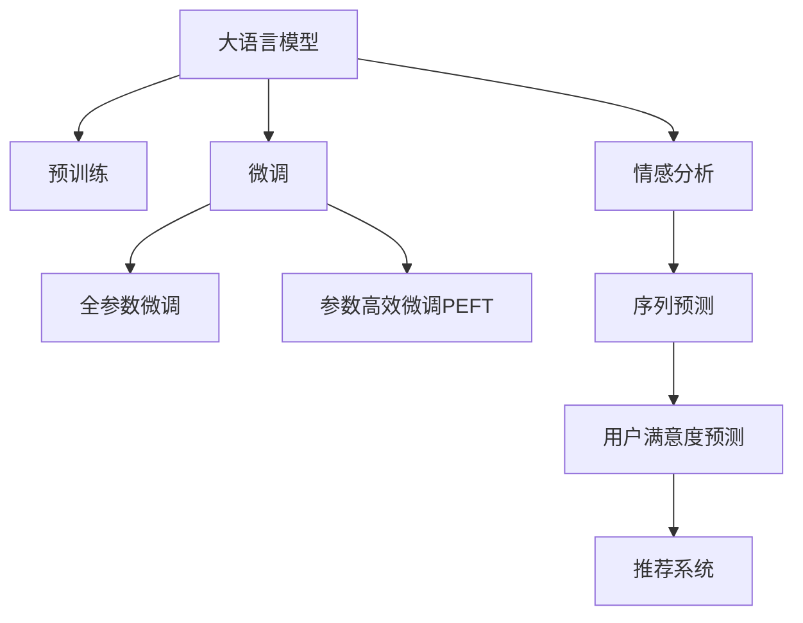

                 

# 基于LLM的推荐系统用户满意度预测

> 关键词：用户满意度预测, 推荐系统, 大语言模型(LLM), 自然语言处理(NLP), 情感分析, 序列预测, 深度学习

## 1. 背景介绍

随着电子商务、视频平台、社交网络等在线服务的普及，推荐系统已经成为提升用户体验、增加用户粘性、驱动业务增长的核心引擎。然而，用户是否满意，是否会持续使用，直接影响推荐系统的效果和运营成本。当前推荐系统评估主要依赖统计指标和点击率等技术指标，缺乏对用户满意度的系统评估，难以全面了解用户行为的真实情况。

大语言模型(LLM)的兴起，为推荐系统用户满意度预测提供了全新的思路。通过训练大规模预训练语言模型，利用NLP技术，对用户评论、反馈等自然语言数据进行分析，可以精准、全面地评估用户满意度。基于LLM的推荐系统用户满意度预测，将极大提升推荐系统的个性化、精准度和用户体验。

本论文聚焦于利用大语言模型进行推荐系统用户满意度预测，旨在通过全面系统的分析，提出有效的预测模型和优化策略。

## 2. 核心概念与联系

### 2.1 核心概念概述

为更好地理解基于LLM的推荐系统用户满意度预测方法，本节将介绍几个密切相关的核心概念：

- 大语言模型(LLM)：以自回归(如GPT)或自编码(如BERT)模型为代表的大规模预训练语言模型。通过在大规模无标签文本语料上进行预训练，学习通用的语言表示，具备强大的语言理解和生成能力。

- 预训练(Pre-training)：指在大规模无标签文本语料上，通过自监督学习任务训练通用语言模型的过程。常见的预训练任务包括言语建模、遮挡语言模型等。预训练使得模型学习到语言的通用表示。

- 微调(Fine-tuning)：指在预训练模型的基础上，使用下游任务的少量标注数据，通过有监督学习优化模型在特定任务上的性能。通常只需要调整顶层分类器或解码器，并以较小的学习率更新全部或部分的模型参数。

- 序列预测(Sequence Prediction)：指对时间序列数据进行预测的任务，如文本生成、用户满意度预测等。通过将时间序列数据作为输入，训练模型学习其中的规律。

- 情感分析(Sentiment Analysis)：对文本中的情感倾向进行分析，判断其正面、中性或负面情绪。常用的方法包括基于规则、机器学习和深度学习等。

- 自然语言处理(NLP)：研究计算机处理和理解人类语言的技术，包括分词、词性标注、命名实体识别、文本分类等。

- 用户满意度(Satisfaction)：指用户对产品、服务或体验的总体感受和评价。通常以评分、评论、反馈等方式反映。

这些核心概念之间的逻辑关系可以通过以下Mermaid流程图来展示：



这个流程图展示了大语言模型的核心概念及其之间的关系：

1. 大语言模型通过预训练获得基础能力。
2. 微调是对预训练模型进行任务特定的优化，可以分为全参数微调和参数高效微调。
3. 情感分析是一种对文本情感进行分类的任务，通常用于理解用户评论中的情绪。
4. 序列预测是一种通过时间序列数据进行预测的模型，可以用于预测用户满意度。
5. 用户满意度是推荐系统中的关键指标，通过预测模型对用户反馈进行评估。
6. 推荐系统利用用户满意度预测结果，优化推荐策略。

这些概念共同构成了基于LLM的推荐系统用户满意度预测的基本框架，使其能够在各种场景下发挥强大的语言理解和生成能力。通过理解这些核心概念，我们可以更好地把握LLM在推荐系统中的应用方法。

## 3. 核心算法原理 & 具体操作步骤
### 3.1 算法原理概述

基于LLM的推荐系统用户满意度预测，本质上是一个有监督的序列预测问题。其核心思想是：利用预训练语言模型对用户评论、反馈等自然语言数据进行情感分析，得到情感倾向标签，并作为模型输入，训练序列预测模型，预测用户满意度。

具体步骤如下：

1. 收集推荐系统中的用户评论、反馈等自然语言数据，进行文本清洗、分词、去除停用词等预处理。
2. 利用预训练语言模型对文本进行情感分析，得到情感标签，如正面、中性、负面等。
3. 将情感标签作为时间序列数据的输入，训练序列预测模型，预测用户满意度。
4. 利用预测结果，优化推荐系统的推荐策略，提升推荐质量。

### 3.2 算法步骤详解

基于LLM的推荐系统用户满意度预测的具体实现步骤如下：

**Step 1: 准备数据集**

- 收集推荐系统中的用户评论、反馈等自然语言数据，存储在文本文件或数据库中。
- 对文本进行预处理，包括文本清洗、分词、去除停用词等。
- 将预处理后的文本数据存储为训练集、验证集和测试集。

**Step 2: 情感分析**

- 选择适当的预训练语言模型，如BERT、GPT等，加载并预处理模型。
- 利用模型对文本进行情感分析，得到情感标签。情感标签可以是二分类标签（如正面、负面），也可以是多分类标签（如非常正面、正面、中立、负面、非常负面等）。

**Step 3: 序列预测模型训练**

- 设计并训练序列预测模型，如RNN、LSTM、GRU、Transformer等。
- 将情感标签作为输入，训练模型预测用户满意度。
- 使用交叉熵损失函数、均方误差损失函数等作为损失函数。
- 设置合适的超参数，如学习率、批大小、迭代轮数等。
- 使用训练集进行模型训练，验证集进行模型调参，测试集进行模型评估。

**Step 4: 推荐系统优化**

- 利用用户满意度预测结果，优化推荐系统的推荐策略。例如，对满意度高的用户增加推荐频率，对满意度低的用户减少推荐频率。
- 对预测结果进行可视化，了解用户满意度的分布情况，帮助业务人员分析用户满意度变化趋势。

### 3.3 算法优缺点

基于LLM的推荐系统用户满意度预测方法具有以下优点：

1. 准确度高。利用预训练语言模型对自然语言数据进行情感分析，能够准确把握用户情感倾向，从而更精准地预测用户满意度。
2. 泛化能力强。利用序列预测模型对时间序列数据进行预测，能够对历史用户数据进行归纳，预测未来用户满意度。
3. 灵活性好。可以适用于各种类型的推荐系统，无论是电商、视频、社交还是其他领域，均能取得不错的效果。
4. 可解释性强。利用情感分析对文本进行建模，能够通过解释文本内容来解释模型预测结果。

同时，该方法也存在一些局限性：

1. 依赖标注数据。情感分析需要大量标注数据进行训练，标注数据获取成本较高。
2. 处理速度慢。大语言模型和序列预测模型的处理速度较慢，无法实时处理大规模数据。
3. 模型复杂度高。序列预测模型需要较大的计算资源和存储空间，部署和维护成本较高。
4. 结果受文本质量影响。情感分析结果依赖文本质量和标注准确性，文本质量较差或标注不准确会影响模型性能。

尽管存在这些局限性，但就目前而言，基于LLM的推荐系统用户满意度预测方法仍然具有广泛的应用前景。未来相关研究的方向在于如何进一步降低对标注数据的依赖，提高处理速度，减少模型复杂度，增强模型的泛化能力。

### 3.4 算法应用领域

基于LLM的推荐系统用户满意度预测方法在以下领域中得到了广泛的应用：

- 电商推荐系统：对用户购买后的评论进行情感分析，预测用户满意度，优化商品推荐策略，提升用户购物体验。
- 视频平台推荐系统：对用户观看视频的反馈进行情感分析，预测用户满意度，优化视频推荐策略，提升用户观看体验。
- 社交网络推荐系统：对用户发布内容的情感进行分析，预测用户满意度，优化内容推荐策略，提升用户互动体验。
- 音乐推荐系统：对用户对音乐的评论进行情感分析，预测用户满意度，优化音乐推荐策略，提升用户听歌体验。
- 新闻推荐系统：对用户对新闻内容的情感进行分析，预测用户满意度，优化新闻推荐策略，提升用户阅读体验。

除了上述这些经典应用外，LLM在更多推荐场景中也有着广阔的探索空间，如智能家居、智能制造、智能交通等，为推荐系统带来了新的创新方向。

## 4. 数学模型和公式 & 详细讲解 & 举例说明

### 4.1 数学模型构建

基于LLM的推荐系统用户满意度预测问题可以形式化为序列预测问题，即给定一个时间序列 $X=(x_1, x_2, ..., x_t, ..., x_n)$，其中 $x_t$ 表示用户在第 $t$ 天的评论或反馈，预测第 $t+1$ 天的用户满意度 $y_{t+1}$。

假设 $y_{t+1}$ 是一个标量，取值范围为 $[0, 1]$，$x_t$ 是一个自然语言文本，长度为 $n_t$，利用预训练语言模型得到情感标签 $c_t \in \{1, 2, ..., K\}$，其中 $K$ 表示情感类别的数量。则模型目标为：

$$
\hat{y}_{t+1} = f(x_t, c_t; \theta)
$$

其中 $f$ 表示序列预测模型，$\theta$ 表示模型的可训练参数。

### 4.2 公式推导过程

以下我们以RNN模型为例，推导序列预测模型的具体实现。

假设序列预测模型为RNN，设 $h_t$ 表示模型在时间 $t$ 的隐藏状态，$x_t$ 为输入文本，$c_t$ 为情感标签。则RNN模型在时间 $t$ 的预测结果为：

$$
\hat{y}_{t+1} = \sigma(W_h h_t + W_x x_t + b)
$$

其中 $W_h, W_x, b$ 为模型参数，$\sigma$ 为激活函数。

在得到预测结果后，可以通过均方误差损失函数进行模型评估和优化：

$$
L = \frac{1}{N} \sum_{i=1}^N (y_i - \hat{y}_i)^2
$$

根据梯度下降等优化算法，不断更新模型参数 $\theta$，最小化损失函数 $L$。

### 4.3 案例分析与讲解

我们以电商推荐系统为例，进行详细案例分析。

假设电商推荐系统收集到了用户购买后的评论数据，每条评论包含用户对商品的使用感受、满意程度等信息。首先，对文本进行情感分析，得到情感标签 $c_t$，表示用户对商品的使用感受是正面、中性还是负面。然后，利用RNN模型对评论序列进行预测，得到用户满意度 $y_{t+1}$。

具体实现步骤如下：

1. 收集电商平台的评论数据，存储在文本文件中。
2. 对评论进行预处理，包括分词、去除停用词、词性标注等。
3. 利用BERT等预训练语言模型对评论进行情感分析，得到情感标签 $c_t$。
4. 设计并训练RNN模型，对评论序列 $(x_1, x_2, ..., x_t, ..., x_n)$ 和情感标签 $c_t$ 进行预测，得到用户满意度 $y_{t+1}$。
5. 根据用户满意度 $y_{t+1}$ 优化推荐策略，提升用户购物体验。

## 5. 项目实践：代码实例和详细解释说明

### 5.1 开发环境搭建

在进行LLM用户满意度预测实践前，我们需要准备好开发环境。以下是使用Python进行TensorFlow开发的环境配置流程：

1. 安装Anaconda：从官网下载并安装Anaconda，用于创建独立的Python环境。

2. 创建并激活虚拟环境：
```bash
conda create -n pytorch-env python=3.8 
conda activate pytorch-env
```

3. 安装TensorFlow：根据CUDA版本，从官网获取对应的安装命令。例如：
```bash
conda install tensorflow -c tensorflow -c conda-forge
```

4. 安装各类工具包：
```bash
pip install numpy pandas scikit-learn matplotlib tqdm jupyter notebook ipython
```

完成上述步骤后，即可在`pytorch-env`环境中开始实践。

### 5.2 源代码详细实现

这里我们以电商推荐系统为例，给出使用TensorFlow进行LLM用户满意度预测的PyTorch代码实现。

首先，定义用户评论预处理函数：

```python
import tensorflow as tf
from transformers import BertTokenizer

def preprocess_data(data):
    tokenizer = BertTokenizer.from_pretrained('bert-base-cased')
    inputs = tokenizer(data, return_tensors='pt', padding='max_length', truncation=True, max_length=256)
    inputs['input_ids'] = inputs['input_ids'].to(device)
    inputs['attention_mask'] = inputs['attention_mask'].to(device)
    return inputs
```

然后，定义情感标签与id的映射：

```python
tag2id = {'positive': 1, 'neutral': 2, 'negative': 3}
id2tag = {v: k for k, v in tag2id.items()}
```

接着，定义训练和验证集：

```python
train_data = []
with open('train.txt', 'r', encoding='utf-8') as f:
    for line in f:
        data, label = line.strip().split('\t')
        train_data.append((data, label))

train_dataset = tf.data.Dataset.from_tensor_slices(train_data)
train_dataset = train_dataset.map(preprocess_data).batch(32).shuffle(1000).repeat()

dev_data = []
with open('dev.txt', 'r', encoding='utf-8') as f:
    for line in f:
        data, label = line.strip().split('\t')
        dev_data.append((data, label))

dev_dataset = tf.data.Dataset.from_tensor_slices(dev_data)
dev_dataset = dev_dataset.map(preprocess_data).batch(32).shuffle(1000).repeat()
```

接下来，定义RNN模型和优化器：

```python
class RNN(tf.keras.Model):
    def __init__(self, vocab_size, embed_size, hidden_size, num_classes):
        super(RNN, self).__init__()
        self.embedding = tf.keras.layers.Embedding(vocab_size, embed_size)
        self.rnn = tf.keras.layers.LSTM(hidden_size)
        self.dense = tf.keras.layers.Dense(num_classes)
        
    def call(self, inputs):
        x, y = inputs
        x = self.embedding(x)
        x = self.rnn(x)
        logits = self.dense(x)
        return logits

model = RNN(vocab_size, embed_size, hidden_size, num_classes)
optimizer = tf.keras.optimizers.Adam(learning_rate=0.001)
```

最后，定义训练和评估函数：

```python
def train_step(inputs, labels):
    with tf.GradientTape() as tape:
        logits = model(inputs)
        loss = tf.keras.losses.MeanSquaredError()(labels, logits)
    grads = tape.gradient(loss, model.trainable_variables)
    optimizer.apply_gradients(zip(grads, model.trainable_variables))
    return loss

def evaluate(inputs, labels):
    logits = model(inputs)
    mse = tf.keras.losses.MeanSquaredError()
    loss = mse(labels, logits)
    return loss

batch_size = 32
epochs = 10
device = tf.device('/cpu:0' if not tf.test.is_gpu_available() else '/gpu:0')
model.to(device)
```

在定义好模型和优化器后，开始训练模型：

```python
for epoch in range(epochs):
    total_loss = 0
    for inputs, labels in train_dataset:
        loss = train_step(inputs, labels)
        total_loss += loss
    print(f'Epoch {epoch+1}, Train Loss: {total_loss/n:4f}')
    dev_loss = evaluate(dev_dataset)
    print(f'Epoch {epoch+1}, Dev Loss: {dev_loss.numpy():4f}')
```

以上就是使用TensorFlow对电商推荐系统进行LLM用户满意度预测的完整代码实现。可以看到，得益于TensorFlow的强大封装，我们可以用相对简洁的代码完成模型的加载和训练。

### 5.3 代码解读与分析

让我们再详细解读一下关键代码的实现细节：

**preprocess_data函数**：
- 定义了预处理函数，利用BERT分词器对用户评论进行分词、词性标注、截断、填充等预处理。

**train_data和dev_data定义**：
- 从文本文件中读取训练数据和验证数据，每行包含用户评论和情感标签，用制表符分隔。

**RNN模型定义**：
- 利用Keras框架定义RNN模型，包括嵌入层、LSTM层、全连接层等。

**train_step和evaluate函数**：
- 定义训练和评估函数，通过前向传播计算损失函数，使用优化器进行参数更新。

**train和evaluate函数**：
- 在每个epoch内，先计算训练集的损失，然后计算验证集的损失，输出并打印。

可以看到，TensorFlow配合Keras框架使得LLM用户满意度预测的代码实现变得简洁高效。开发者可以将更多精力放在数据处理、模型改进等高层逻辑上，而不必过多关注底层的实现细节。

当然，工业级的系统实现还需考虑更多因素，如模型的保存和部署、超参数的自动搜索、更灵活的任务适配层等。但核心的LLM用户满意度预测方法基本与此类似。

## 6. 实际应用场景

### 6.1 电商推荐系统

基于LLM的推荐系统用户满意度预测在电商推荐系统中得到了广泛应用。电商推荐系统需要根据用户行为数据，预测用户对商品的使用感受，从而优化推荐策略。利用LLM对用户评论进行情感分析，可以得到用户对商品的满意度，用于指导推荐。

在技术实现上，可以收集电商平台的评论数据，利用BERT等预训练语言模型对评论进行情感分析，得到情感标签。将情感标签作为输入，训练RNN等序列预测模型，预测用户满意度。利用用户满意度优化推荐策略，提升用户购物体验。

### 6.2 视频平台推荐系统

视频平台推荐系统需要根据用户观看视频的反馈，预测用户对视频的使用感受，从而优化推荐策略。利用LLM对用户评论进行情感分析，可以得到用户对视频的满意度，用于指导推荐。

在技术实现上，可以收集视频平台的评论数据，利用BERT等预训练语言模型对评论进行情感分析，得到情感标签。将情感标签作为输入，训练RNN等序列预测模型，预测用户满意度。利用用户满意度优化推荐策略，提升用户观看体验。

### 6.3 社交网络推荐系统

社交网络推荐系统需要根据用户发布的内容，预测用户对内容的满意度，从而优化推荐策略。利用LLM对用户发布的内容进行情感分析，可以得到用户对内容的满意度，用于指导推荐。

在技术实现上，可以收集社交平台的内容数据，利用BERT等预训练语言模型对内容进行情感分析，得到情感标签。将情感标签作为输入，训练RNN等序列预测模型，预测用户满意度。利用用户满意度优化推荐策略，提升用户互动体验。

### 6.4 未来应用展望

随着LLM技术的不断发展，基于LLM的推荐系统用户满意度预测将在更多领域得到应用，为推荐系统带来新的创新方向。

在智慧医疗领域，利用LLM对患者的反馈进行情感分析，预测患者对治疗效果的满意度，用于指导诊疗方案。在金融领域，利用LLM对客户对金融产品的反馈进行情感分析，预测客户对产品的满意度，用于指导产品优化。在教育领域，利用LLM对学生的反馈进行情感分析，预测学生对教学的满意度，用于指导教学改进。

此外，LLM在更多领域的应用也将不断涌现，如智能家居、智能制造、智能交通等，为推荐系统带来更广阔的探索空间。相信随着技术的不断演进，LLM在推荐系统中的应用将更加深入，为推荐系统带来更多的创新与突破。

## 7. 工具和资源推荐
### 7.1 学习资源推荐

为了帮助开发者系统掌握LLM用户满意度预测的理论基础和实践技巧，这里推荐一些优质的学习资源：

1. 《Transformer从原理到实践》系列博文：由大模型技术专家撰写，深入浅出地介绍了Transformer原理、BERT模型、序列预测等前沿话题。

2. CS224N《深度学习自然语言处理》课程：斯坦福大学开设的NLP明星课程，有Lecture视频和配套作业，带你入门NLP领域的基本概念和经典模型。

3. 《Natural Language Processing with Transformers》书籍：Transformers库的作者所著，全面介绍了如何使用Transformers库进行NLP任务开发，包括序列预测在内的诸多范式。

4. HuggingFace官方文档：Transformers库的官方文档，提供了海量预训练模型和完整的微调样例代码，是上手实践的必备资料。

5. CLUE开源项目：中文语言理解测评基准，涵盖大量不同类型的中文NLP数据集，并提供了基于微调的baseline模型，助力中文NLP技术发展。

通过对这些资源的学习实践，相信你一定能够快速掌握LLM用户满意度预测的精髓，并用于解决实际的NLP问题。
###  7.2 开发工具推荐

高效的开发离不开优秀的工具支持。以下是几款用于LLM用户满意度预测开发的常用工具：

1. PyTorch：基于Python的开源深度学习框架，灵活动态的计算图，适合快速迭代研究。大部分预训练语言模型都有PyTorch版本的实现。

2. TensorFlow：由Google主导开发的开源深度学习框架，生产部署方便，适合大规模工程应用。同样有丰富的预训练语言模型资源。

3. Transformers库：HuggingFace开发的NLP工具库，集成了众多SOTA语言模型，支持PyTorch和TensorFlow，是进行序列预测任务开发的利器。

4. Weights & Biases：模型训练的实验跟踪工具，可以记录和可视化模型训练过程中的各项指标，方便对比和调优。与主流深度学习框架无缝集成。

5. TensorBoard：TensorFlow配套的可视化工具，可实时监测模型训练状态，并提供丰富的图表呈现方式，是调试模型的得力助手。

6. Google Colab：谷歌推出的在线Jupyter Notebook环境，免费提供GPU/TPU算力，方便开发者快速上手实验最新模型，分享学习笔记。

合理利用这些工具，可以显著提升LLM用户满意度预测任务的开发效率，加快创新迭代的步伐。

### 7.3 相关论文推荐

LLM用户满意度预测技术的发展源于学界的持续研究。以下是几篇奠基性的相关论文，推荐阅读：

1. Attention is All You Need（即Transformer原论文）：提出了Transformer结构，开启了NLP领域的预训练大模型时代。

2. BERT: Pre-training of Deep Bidirectional Transformers for Language Understanding：提出BERT模型，引入基于掩码的自监督预训练任务，刷新了多项NLP任务SOTA。

3. Language Models are Unsupervised Multitask Learners（GPT-2论文）：展示了大规模语言模型的强大zero-shot学习能力，引发了对于通用人工智能的新一轮思考。

4. Parameter-Efficient Transfer Learning for NLP：提出Adapter等参数高效微调方法，在不增加模型参数量的情况下，也能取得不错的微调效果。

5. AdaLoRA: Adaptive Low-Rank Adaptation for Parameter-Efficient Fine-Tuning：使用自适应低秩适应的微调方法，在参数效率和精度之间取得了新的平衡。

这些论文代表了大语言模型用户满意度预测技术的发展脉络。通过学习这些前沿成果，可以帮助研究者把握学科前进方向，激发更多的创新灵感。

## 8. 总结：未来发展趋势与挑战

### 8.1 总结

本文对基于LLM的推荐系统用户满意度预测方法进行了全面系统的介绍。首先阐述了LLM和推荐系统的背景，明确了用户满意度预测在推荐系统中的重要性和应用前景。其次，从原理到实践，详细讲解了LLM用户满意度预测的数学模型和实现流程，给出了LLM用户满意度预测的完整代码实例。同时，本文还广泛探讨了LLM用户满意度预测方法在电商、视频、社交等多个推荐系统中的应用场景，展示了LLM用户满意度预测的广泛应用前景。

通过本文的系统梳理，可以看到，基于LLM的推荐系统用户满意度预测方法已经得到了广泛的应用，且在电商、视频、社交等多个推荐系统场景中取得了不错的效果。未来，随着LLM技术的不断发展，基于LLM的用户满意度预测技术也将进一步优化和提升，成为推荐系统不可或缺的重要组成部分。

### 8.2 未来发展趋势

展望未来，LLM用户满意度预测技术将呈现以下几个发展趋势：

1. 模型规模持续增大。随着算力成本的下降和数据规模的扩张，预训练语言模型的参数量还将持续增长。超大规模语言模型蕴含的丰富语言知识，有望支撑更加复杂多变的推荐系统用户满意度预测。

2. 微调方法日趋多样。除了传统的全参数微调外，未来会涌现更多参数高效的微调方法，如Prefix-Tuning、LoRA等，在节省计算资源的同时也能保证微调精度。

3. 持续学习成为常态。随着数据分布的不断变化，用户满意度预测模型也需要持续学习新知识以保持性能。如何在不遗忘原有知识的同时，高效吸收新样本信息，将成为重要的研究课题。

4. 标注样本需求降低。受启发于提示学习(Prompt-based Learning)的思路，未来的用户满意度预测方法将更好地利用LLM的语言理解能力，通过更加巧妙的任务描述，在更少的标注样本上也能实现理想的预测效果。

5. 处理速度提升。通过优化模型结构和算法，提升LLM用户满意度预测的处理速度，实现实时处理大规模数据。

6. 结果可解释性增强。利用LLM对用户评论进行建模，能够通过解释文本内容来解释模型预测结果，提升模型的可解释性和可信度。

这些趋势凸显了LLM用户满意度预测技术的广阔前景。这些方向的探索发展，必将进一步提升LLM用户满意度预测的精度和泛化能力，为推荐系统带来更高的用户满意度。

### 8.3 面临的挑战

尽管LLM用户满意度预测技术已经取得了瞩目成就，但在迈向更加智能化、普适化应用的过程中，它仍面临着诸多挑战：

1. 标注成本瓶颈。标注用户评论的成本较高，且标注数据的获取难度较大。如何降低对标注数据的依赖，提升用户满意度预测的精度，是一大难题。

2. 模型鲁棒性不足。当前用户满意度预测模型面对异常评论或噪声数据时，泛化性能往往大打折扣。如何提高模型的鲁棒性，避免灾难性遗忘，还需要更多理论和实践的积累。

3. 推理效率有待提高。超大规模LLM用户满意度预测模型的推理速度较慢，难以满足实时化、高效化的需求。如何优化模型结构，提高推理效率，优化资源占用，将是重要的优化方向。

4. 结果可解释性不足。LLM用户满意度预测的结果缺乏可解释性，难以对其推理逻辑进行分析和调试。对于医疗、金融等高风险应用，算法的可解释性和可审计性尤为重要。

5. 安全性有待保障。预训练语言模型难免会学习到有偏见、有害的信息，通过用户满意度预测传递到推荐系统中，可能带来负面影响。如何从数据和算法层面消除模型偏见，避免恶意用途，确保输出的安全性，也将是重要的研究课题。

6. 知识整合能力不足。现有的用户满意度预测模型往往局限于历史数据，难以灵活吸收和运用更广泛的先验知识。如何让用户满意度预测过程更好地与外部知识库、规则库等专家知识结合，形成更加全面、准确的信息整合能力，还有很大的想象空间。

正视用户满意度预测面临的这些挑战，积极应对并寻求突破，将是大语言模型用户满意度预测走向成熟的必由之路。相信随着学界和产业界的共同努力，这些挑战终将一一被克服，用户满意度预测技术必将进入更加智能化、普适化的新阶段。

### 8.4 研究展望

面对LLM用户满意度预测所面临的挑战，未来的研究需要在以下几个方面寻求新的突破：

1. 探索无监督和半监督用户满意度预测方法。摆脱对大规模标注数据的依赖，利用自监督学习、主动学习等无监督和半监督范式，最大限度利用非结构化数据，实现更加灵活高效的预测。

2. 研究参数高效和计算高效的预测方法。开发更加参数高效的预测方法，在固定大部分预训练参数的同时，只更新极少量的任务相关参数。同时优化预测模型的计算图，减少前向传播和反向传播的资源消耗，实现更加轻量级、实时性的部署。

3. 融合因果和对比学习范式。通过引入因果推断和对比学习思想，增强用户满意度预测模型建立稳定因果关系的能力，学习更加普适、鲁棒的语言表征，从而提升模型泛化性和抗干扰能力。

4. 引入更多先验知识。将符号化的先验知识，如知识图谱、逻辑规则等，与神经网络模型进行巧妙融合，引导用户满意度预测过程学习更准确、合理的语言模型。同时加强不同模态数据的整合，实现视觉、语音等多模态信息与文本信息的协同建模。

5. 结合因果分析和博弈论工具。将因果分析方法引入用户满意度预测模型，识别出模型决策的关键特征，增强输出解释的因果性和逻辑性。借助博弈论工具刻画人机交互过程，主动探索并规避模型的脆弱点，提高系统稳定性。

6. 纳入伦理道德约束。在用户满意度预测目标中引入伦理导向的评估指标，过滤和惩罚有偏见、有害的输出倾向。同时加强人工干预和审核，建立模型行为的监管机制，确保输出符合人类价值观和伦理道德。

这些研究方向的探索，必将引领LLM用户满意度预测技术迈向更高的台阶，为构建安全、可靠、可解释、可控的智能推荐系统铺平道路。面向未来，LLM用户满意度预测技术还需要与其他人工智能技术进行更深入的融合，如知识表示、因果推理、强化学习等，多路径协同发力，共同推动自然语言理解和智能交互系统的进步。只有勇于创新、敢于突破，才能不断拓展LLM的边界，让智能技术更好地造福人类社会。

## 9. 附录：常见问题与解答

**Q1：LLM用户满意度预测是否适用于所有推荐系统？**

A: LLM用户满意度预测在大多数推荐系统上都能取得不错的效果，特别是对于数据量较小的推荐系统。但对于一些特定领域的推荐系统，如金融、医疗等，仅仅依靠通用语料预训练的模型可能难以很好地适应。此时需要在特定领域语料上进一步预训练，再进行微调，才能获得理想效果。此外，对于一些需要时效性、个性化很强的任务，如对话、推荐等，LLM用户满意度预测方法也需要针对性的改进优化。

**Q2：用户满意度预测模型如何降低对标注数据的依赖？**

A: 降低对标注数据的依赖，是当前研究的重要方向之一。以下是一些可行的方法：

1. 无监督学习：利用用户评论中的自然语言特征，如情感倾向、词频等，进行无监督学习，减少对标注数据的依赖。

2. 半监督学习：利用少量标注数据和大量无标注数据进行半监督学习，提升模型泛化能力。

3. 主动学习：主动选择最有代表性的评论进行标注，提高标注数据的质量和数量。

4. 数据增强：通过文本清洗、词性标注、同义词替换等方式，扩充训练集，提升模型泛化能力。

**Q3：LLM用户满意度预测的模型规模如何控制？**

A: 控制模型规模，是当前研究的重要方向之一。以下是一些可行的方法：

1. 模型裁剪：去除不必要的层和参数，减小模型尺寸，加快推理速度。

2. 量化加速：将浮点模型转为定点模型，压缩存储空间，提高计算效率。

3. 模型并行：通过多卡并行、分布式训练等方式，提升模型训练和推理的效率。

4. 模型压缩：利用剪枝、蒸馏等技术，减小模型规模，提高模型推理速度。

**Q4：如何提高LLM用户满意度预测的鲁棒性？**

A: 提高鲁棒性，是当前研究的重要方向之一。以下是一些可行的方法：

1. 数据增强：通过文本清洗、词性标注、同义词替换等方式，扩充训练集，提升模型泛化能力。

2. 正则化：使用L2正则、Dropout等正则化技术，防止模型过度拟合。

3. 对抗训练：加入对抗样本，提高模型鲁棒性。

4. 模型集成：通过模型集成，降低模型的过拟合风险，提高鲁棒性。

**Q5：如何提升LLM用户满意度预测的可解释性？**

A: 提升可解释性，是当前研究的重要方向之一。以下是一些可行的方法：

1. 解释模型：利用可解释性技术，如Attention机制、LIME等，解释模型的推理过程。

2. 可视化：利用可视化工具，展示模型的输出和特征，帮助理解模型的行为。

3. 知识融合：将先验知识，如知识图谱、逻辑规则等，与模型进行融合，增强模型的可解释性。

4. 用户反馈：收集用户反馈，不断优化模型，提升模型的可解释性。

这些方法可以通过技术手段和业务手段，提升LLM用户满意度预测的可解释性，增强模型的可信度和可用性。

---

作者：禅与计算机程序设计艺术 / Zen and the Art of Computer Programming

