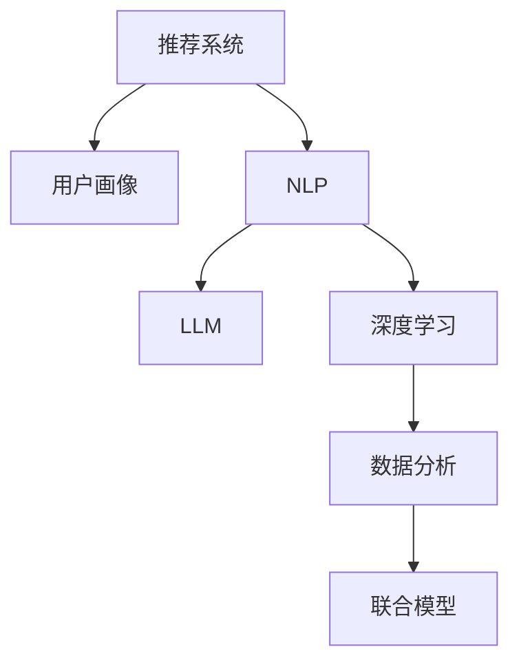

                 

# 基于LLM的推荐系统用户画像精细化

> 关键词：推荐系统,用户画像,自然语言处理(NLP),预训练语言模型(LLM),深度学习,数据分析

## 1. 背景介绍

### 1.1 问题由来
推荐系统是互联网企业为用户推荐个性化内容的核心技术。传统推荐系统往往基于用户行为数据，如浏览、点击、收藏等，构建用户兴趣模型。然而，随着数据量和用户行为的多样性不断增加，传统行为兴趣模型的表达能力有限，难以刻画用户复杂的兴趣和偏好。

近年来，随着预训练语言模型(LLM)的兴起，越来越多的研究开始探索其在大规模推荐系统中的应用。通过将LLM作为用户画像的建模工具，可以从文本数据中挖掘出更加细腻、全面的用户特征，并用于个性化推荐模型的训练，显著提升推荐效果。

### 1.2 问题核心关键点
大语言模型(LLM)在大规模无标签文本数据上进行预训练，学习到丰富的语言表示。利用LLM对用户评论、产品描述、社交媒体内容等文本数据进行处理，可以提取出用户兴趣和产品特征，进行更加精细化的用户画像建模。本文将重点介绍如何基于LLM构建用户画像，以及其在大规模推荐系统中的应用。

## 2. 核心概念与联系

### 2.1 核心概念概述

为更好地理解基于LLM的用户画像构建方法，本节将介绍几个密切相关的核心概念：

- 推荐系统(Recommender System)：利用用户数据和内容数据，通过算法为用户推荐个性化的内容或服务，如新闻、商品、视频等。
- 用户画像(User Profile)：对用户的兴趣、行为、属性等特征进行建模，用于个性化的推荐服务。
- 自然语言处理(NLP)：研究如何让计算机理解和处理人类自然语言的技术，包括文本表示、情感分析、语义理解等。
- 预训练语言模型(LLM)：在大规模无标签文本数据上进行预训练，学习到丰富的语言表示，可以用于文本分类、生成、翻译等多种任务。
- 深度学习(Deep Learning)：一种基于多层神经网络的机器学习技术，可以自动提取复杂数据中的特征。
- 数据分析(Analytical Data)：通过对大规模数据进行统计、分析和挖掘，获得有价值的信息。
- 联合模型(Joint Modeling)：将用户画像和产品特征联合建模，提升推荐效果。

这些核心概念之间的逻辑关系可以通过以下Mermaid流程图来展示：



这个流程图展示了大语言模型用户画像构建的关键概念及其之间的关系：

1. 推荐系统需要用户画像来指导个性化推荐。
2. 用户画像的构建需要自然语言处理技术。
3. 自然语言处理中预训练语言模型是一个重要工具。
4. 深度学习是构建LLM的关键技术。
5. 数据分析为LLM的训练提供了基础数据。
6. 联合模型将用户画像和产品特征结合，提升推荐效果。

这些概念共同构成了基于LLM构建用户画像的逻辑框架，使其能够从多维度刻画用户兴趣和偏好，从而提升推荐系统的性能。

## 3. 核心算法原理 & 具体操作步骤
### 3.1 算法原理概述

基于LLM的用户画像建模，本质上是通过自然语言处理技术，将用户文本数据转换为可量化、可计算的向量表示。具体步骤包括：

1. 收集用户文本数据：如用户在电商平台上的评论、产品描述、社交媒体上的发帖等。
2. 对文本数据进行预处理：包括分词、去除停用词、词干提取等。
3. 利用LLM提取文本特征：通过预训练语言模型对处理后的文本进行编码，得到高维特征向量。
4. 特征融合与拼接：将用户不同时间段的LLM特征进行拼接，并与其他用户画像特征（如行为数据、人口统计特征等）融合。
5. 用户画像建模：通过机器学习算法对融合后的特征进行建模，得到用户兴趣特征向量。

该方法的核心在于：
- 利用LLM对文本数据进行深度学习，提取出高维的语义特征。
- 通过特征融合和拼接，综合考虑多维度数据，构建更加精细化的用户画像。
- 利用机器学习算法进行建模，使用户画像具有可解释性和预测能力。

### 3.2 算法步骤详解

下面详细介绍基于LLM的用户画像建模步骤：

**Step 1: 数据收集与预处理**
- 收集用户文本数据：包括用户在电商平台的评论、产品描述、社交媒体上的发帖等。
- 对文本数据进行预处理：包括分词、去除停用词、词干提取、拼写修正等。

**Step 2: 文本特征提取**
- 选择预训练语言模型：如BERT、GPT等，作为用户画像的特征提取工具。
- 对文本数据进行编码：将处理后的文本作为输入，送入预训练模型进行编码，得到高维特征向量。
- 特征向量的降维：使用PCA等方法对高维特征进行降维，以减少计算复杂度。

**Step 3: 特征融合与拼接**
- 将用户不同时间段的LLM特征进行拼接：如将用户的评论、产品描述、社交媒体内容等，通过时间戳排序，拼接成一个特征向量。
- 融合其他用户画像特征：将LLM特征与行为数据、人口统计特征等拼接，形成综合用户画像特征。

**Step 4: 用户画像建模**
- 选择合适的机器学习算法：如线性回归、随机森林、神经网络等，对用户画像特征进行建模。
- 特征选择与优化：通过特征选择算法，剔除冗余特征，提高模型泛化能力。
- 模型训练与评估：使用训练集和验证集对模型进行训练和评估，选择最优的模型参数。

**Step 5: 模型部署与预测**
- 将训练好的模型部署到推荐系统中：用于预测新用户对产品的兴趣和偏好。
- 实时处理用户行为数据：对用户的实时行为数据进行预处理和特征提取，输入模型进行预测。
- 生成个性化推荐结果：根据预测结果，生成个性化的产品推荐列表。

### 3.3 算法优缺点

基于LLM的用户画像建模方法具有以下优点：
1. 深度语义理解：LLM可以捕捉文本中的丰富语义信息，提取用户兴趣和产品特征，提高用户画像的表达能力。
2. 跨领域迁移：LLM在不同领域和任务上具有较好的泛化能力，可以跨领域迁移应用。
3. 多维度融合：通过融合多维度的用户画像特征，构建更加全面、准确的用户画像。
4. 可解释性高：利用预训练语言模型，可以解释用户画像建模的每一步，提高模型的可解释性。
5. 高效性：通过特征降维和特征选择，可以降低计算复杂度，提高模型的训练和推理效率。

同时，该方法也存在一些局限性：
1. 对标注数据的依赖：构建高质量用户画像需要大量标注数据，标注成本较高。
2. 模型复杂度高：LLM和特征融合过程涉及复杂的计算，需要较高的硬件资源支持。
3. 对抗性攻击风险：LLM容易受到对抗性样本的攻击，影响模型的安全性和稳定性。
4. 用户隐私保护：用户文本数据可能包含敏感信息，如何保护用户隐私是一个重要问题。

尽管存在这些局限性，但就目前而言，基于LLM的用户画像建模方法仍是大规模推荐系统中的热门范式，具有广泛的应用前景。

### 3.4 算法应用领域

基于大语言模型(LLM)的用户画像建模方法，已经在电商、社交媒体、新闻推荐等多个领域得到了应用，具体包括：

1. 电商平台：通过对用户评论、产品描述、购物行为等文本数据进行处理，构建用户兴趣画像，进行个性化商品推荐。
2. 社交媒体：通过分析用户的社交媒体内容，如发帖、点赞、评论等，构建用户兴趣画像，进行个性化的内容推荐。
3. 新闻推荐：利用用户对新闻的阅读历史、评论等文本数据，构建用户兴趣画像，进行新闻内容的个性化推荐。
4. 视频推荐：通过对用户观看历史、评论等文本数据进行处理，构建用户兴趣画像，进行视频内容的个性化推荐。

## 4. 数学模型和公式 & 详细讲解  
### 4.1 数学模型构建

本节将使用数学语言对基于LLM的用户画像建模过程进行更加严格的刻画。

记用户文本数据集为 $\mathcal{D}=\{(x_i,y_i)\}_{i=1}^N$，其中 $x_i$ 为文本数据，$y_i$ 为用户画像标签。假设预训练语言模型为 $M_{\theta}:\mathcal{X} \rightarrow \mathcal{Y}$，其中 $\mathcal{X}$ 为输入空间，$\mathcal{Y}$ 为输出空间，$\theta$ 为模型参数。

定义模型 $M_{\theta}$ 在文本 $x_i$ 上的输出为 $\hat{y}=M_{\theta}(x_i) \in \mathcal{Y}$，表示模型对用户画像的预测。则用户画像的损失函数定义为：

$$
\ell(M_{\theta}(x_i),y_i) = \mathbb{E}_{(x_i,y_i) \sim \mathcal{D}} [\text{CE}(\hat{y},y_i)]
$$

其中 $\text{CE}$ 为交叉熵损失函数，$\mathbb{E}$ 为期望运算。

微调的目标是最小化损失函数，即：

$$
\theta^* = \mathop{\arg\min}_{\theta} \ell(M_{\theta}(x_i),y_i)
$$

通过梯度下降等优化算法，微调过程不断更新模型参数 $\theta$，最小化损失函数，使得模型输出逼近真实标签。

### 4.2 公式推导过程

以下我们以二分类任务为例，推导交叉熵损失函数及其梯度的计算公式。

假设模型 $M_{\theta}$ 在输入 $x_i$ 上的输出为 $\hat{y}=M_{\theta}(x_i) \in [0,1]$，表示用户画像的预测概率。真实标签 $y_i \in \{0,1\}$。则二分类交叉熵损失函数定义为：

$$
\ell(M_{\theta}(x_i),y_i) = -[y_i\log \hat{y} + (1-y_i)\log (1-\hat{y})]
$$

将其代入损失函数公式，得：

$$
\mathcal{L}(\theta) = -\frac{1}{N}\sum_{i=1}^N [y_i\log M_{\theta}(x_i)+(1-y_i)\log(1-M_{\theta}(x_i))]
$$

根据链式法则，损失函数对参数 $\theta_k$ 的梯度为：

$$
\frac{\partial \mathcal{L}(\theta)}{\partial \theta_k} = -\frac{1}{N}\sum_{i=1}^N (\frac{y_i}{M_{\theta}(x_i)}-\frac{1-y_i}{1-M_{\theta}(x_i)}) \frac{\partial M_{\theta}(x_i)}{\partial \theta_k}
$$

其中 $\frac{\partial M_{\theta}(x_i)}{\partial \theta_k}$ 可进一步递归展开，利用自动微分技术完成计算。

在得到损失函数的梯度后，即可带入参数更新公式，完成模型的迭代优化。重复上述过程直至收敛，最终得到适应用户画像任务的最优模型参数 $\theta^*$。

## 5. 项目实践：代码实例和详细解释说明
### 5.1 开发环境搭建

在进行微调实践前，我们需要准备好开发环境。以下是使用Python进行PyTorch开发的环境配置流程：

1. 安装Anaconda：从官网下载并安装Anaconda，用于创建独立的Python环境。

2. 创建并激活虚拟环境：
```bash
conda create -n pytorch-env python=3.8 
conda activate pytorch-env
```

3. 安装PyTorch：根据CUDA版本，从官网获取对应的安装命令。例如：
```bash
conda install pytorch torchvision torchaudio cudatoolkit=11.1 -c pytorch -c conda-forge
```

4. 安装Transformers库：
```bash
pip install transformers
```

5. 安装各类工具包：
```bash
pip install numpy pandas scikit-learn matplotlib tqdm jupyter notebook ipython
```

完成上述步骤后，即可在`pytorch-env`环境中开始微调实践。

### 5.2 源代码详细实现

下面我们以电商平台的用户评论数据为例，给出使用Transformers库对BERT模型进行微调的PyTorch代码实现。

首先，定义用户评论和用户画像标签的数据处理函数：

```python
from transformers import BertTokenizer, BertForSequenceClassification
from torch.utils.data import Dataset
import torch

class ReviewDataset(Dataset):
    def __init__(self, reviews, labels, tokenizer, max_len=128):
        self.reviews = reviews
        self.labels = labels
        self.tokenizer = tokenizer
        self.max_len = max_len
        
    def __len__(self):
        return len(self.reviews)
    
    def __getitem__(self, item):
        review = self.reviews[item]
        label = self.labels[item]
        
        encoding = self.tokenizer(review, return_tensors='pt', max_length=self.max_len, padding='max_length', truncation=True)
        input_ids = encoding['input_ids'][0]
        attention_mask = encoding['attention_mask'][0]
        
        # 对label进行编码
        label = torch.tensor(label, dtype=torch.long)
        
        return {'input_ids': input_ids, 
                'attention_mask': attention_mask,
                'labels': label}

# 用户画像标签编码
label2id = {'Negative': 0, 'Positive': 1}
id2label = {v: k for k, v in label2id.items()}

# 创建dataset
tokenizer = BertTokenizer.from_pretrained('bert-base-cased')

train_dataset = ReviewDataset(train_reviews, train_labels, tokenizer)
dev_dataset = ReviewDataset(dev_reviews, dev_labels, tokenizer)
test_dataset = ReviewDataset(test_reviews, test_labels, tokenizer)
```

然后，定义模型和优化器：

```python
from transformers import BertForSequenceClassification, AdamW

model = BertForSequenceClassification.from_pretrained('bert-base-cased', num_labels=len(label2id))

optimizer = AdamW(model.parameters(), lr=2e-5)
```

接着，定义训练和评估函数：

```python
from torch.utils.data import DataLoader
from tqdm import tqdm
from sklearn.metrics import classification_report

device = torch.device('cuda') if torch.cuda.is_available() else torch.device('cpu')
model.to(device)

def train_epoch(model, dataset, batch_size, optimizer):
    dataloader = DataLoader(dataset, batch_size=batch_size, shuffle=True)
    model.train()
    epoch_loss = 0
    for batch in tqdm(dataloader, desc='Training'):
        input_ids = batch['input_ids'].to(device)
        attention_mask = batch['attention_mask'].to(device)
        labels = batch['labels'].to(device)
        model.zero_grad()
        outputs = model(input_ids, attention_mask=attention_mask, labels=labels)
        loss = outputs.loss
        epoch_loss += loss.item()
        loss.backward()
        optimizer.step()
    return epoch_loss / len(dataloader)

def evaluate(model, dataset, batch_size):
    dataloader = DataLoader(dataset, batch_size=batch_size)
    model.eval()
    preds, labels = [], []
    with torch.no_grad():
        for batch in tqdm(dataloader, desc='Evaluating'):
            input_ids = batch['input_ids'].to(device)
            attention_mask = batch['attention_mask'].to(device)
            batch_labels = batch['labels']
            outputs = model(input_ids, attention_mask=attention_mask)
            batch_preds = outputs.logits.argmax(dim=2).to('cpu').tolist()
            batch_labels = batch_labels.to('cpu').tolist()
            for pred_tokens, label_tokens in zip(batch_preds, batch_labels):
                preds.append(pred_tokens)
                labels.append(label_tokens)
                
    print(classification_report(labels, preds))
```

最后，启动训练流程并在测试集上评估：

```python
epochs = 5
batch_size = 16

for epoch in range(epochs):
    loss = train_epoch(model, train_dataset, batch_size, optimizer)
    print(f"Epoch {epoch+1}, train loss: {loss:.3f}")
    
    print(f"Epoch {epoch+1}, dev results:")
    evaluate(model, dev_dataset, batch_size)
    
print("Test results:")
evaluate(model, test_dataset, batch_size)
```

以上就是使用PyTorch对BERT进行用户评论情感分析任务微调的完整代码实现。可以看到，得益于Transformers库的强大封装，我们可以用相对简洁的代码完成BERT模型的加载和微调。

### 5.3 代码解读与分析

让我们再详细解读一下关键代码的实现细节：

**ReviewDataset类**：
- `__init__`方法：初始化评论、标签、分词器等关键组件。
- `__len__`方法：返回数据集的样本数量。
- `__getitem__`方法：对单个样本进行处理，将评论输入编码为token ids，将标签编码为数字，并对其进行定长padding，最终返回模型所需的输入。

**label2id和id2label字典**：
- 定义了标签与数字id之间的映射关系，用于将预测结果解码回真实的标签。

**训练和评估函数**：
- 使用PyTorch的DataLoader对数据集进行批次化加载，供模型训练和推理使用。
- 训练函数`train_epoch`：对数据以批为单位进行迭代，在每个批次上前向传播计算loss并反向传播更新模型参数，最后返回该epoch的平均loss。
- 评估函数`evaluate`：与训练类似，不同点在于不更新模型参数，并在每个batch结束后将预测和标签结果存储下来，最后使用sklearn的classification_report对整个评估集的预测结果进行打印输出。

**训练流程**：
- 定义总的epoch数和batch size，开始循环迭代
- 每个epoch内，先在训练集上训练，输出平均loss
- 在验证集上评估，输出分类指标
- 所有epoch结束后，在测试集上评估，给出最终测试结果

可以看到，PyTorch配合Transformers库使得BERT微调的代码实现变得简洁高效。开发者可以将更多精力放在数据处理、模型改进等高层逻辑上，而不必过多关注底层的实现细节。

当然，工业级的系统实现还需考虑更多因素，如模型的保存和部署、超参数的自动搜索、更灵活的任务适配层等。但核心的微调范式基本与此类似。

## 6. 实际应用场景
### 6.1 电商平台推荐系统

基于大语言模型(LLM)的用户画像建模，可以在电商推荐系统中发挥重要作用。电商平台需要根据用户的浏览、购买、评价等行为数据，预测用户的购买兴趣，进行个性化商品推荐。

具体而言，可以收集用户对商品的文字评论、产品描述、商品标签等文本数据，通过LLM模型提取用户画像特征。然后将用户画像特征与商品特征进行拼接，输入到推荐模型中进行推荐。推荐模型可以是协同过滤、内容推荐、混合推荐等算法，根据不同的任务需求选择最合适的算法。

### 6.2 社交媒体内容推荐

社交媒体平台需要为用户推荐个性化内容，提高用户粘性。通过收集用户的社交媒体内容，如发帖、点赞、评论等，可以构建用户画像。利用LLM模型提取出用户画像特征，再结合社交媒体平台的用户互动数据，进行个性化内容推荐。

社交媒体平台可以利用LLM对用户评论进行情感分析，判断用户的兴趣偏好。同时，社交媒体平台还可以利用LLM对用户发布的内容进行主题分析，匹配相关领域的推荐内容，提高推荐的相关性和多样性。

### 6.3 新闻推荐系统

新闻推荐系统需要根据用户的历史阅读行为，推荐相关的新闻内容。通过收集用户对新闻的阅读记录、评论等文本数据，可以构建用户画像。利用LLM模型提取出用户画像特征，再结合新闻的标题、内容、标签等特征，进行个性化新闻推荐。

新闻推荐系统可以利用LLM对用户评论进行情感分析，判断用户的兴趣偏好。同时，新闻推荐系统还可以利用LLM对新闻内容进行主题分析，匹配相关领域的推荐内容，提高推荐的相关性和多样性。

### 6.4 视频推荐系统

视频推荐系统需要根据用户的观看历史，推荐相关视频内容。通过收集用户对视频的观看记录、评论等文本数据，可以构建用户画像。利用LLM模型提取出用户画像特征，再结合视频的标题、内容、标签等特征，进行个性化视频推荐。

视频推荐系统可以利用LLM对用户评论进行情感分析，判断用户的兴趣偏好。同时，视频推荐系统还可以利用LLM对视频内容进行主题分析，匹配相关领域的推荐内容，提高推荐的相关性和多样性。

## 7. 工具和资源推荐
### 7.1 学习资源推荐

为了帮助开发者系统掌握基于LLM的用户画像构建方法，这里推荐一些优质的学习资源：

1. 《Transformer from Transformers》系列博文：由大模型技术专家撰写，深入浅出地介绍了Transformer原理、BERT模型、微调技术等前沿话题。

2. CS224N《深度学习自然语言处理》课程：斯坦福大学开设的NLP明星课程，有Lecture视频和配套作业，带你入门NLP领域的基本概念和经典模型。

3. 《Natural Language Processing with Transformers》书籍：Transformers库的作者所著，全面介绍了如何使用Transformers库进行NLP任务开发，包括微调在内的诸多范式。

4. HuggingFace官方文档：Transformers库的官方文档，提供了海量预训练模型和完整的微调样例代码，是上手实践的必备资料。

5. CLUE开源项目：中文语言理解测评基准，涵盖大量不同类型的中文NLP数据集，并提供了基于微调的baseline模型，助力中文NLP技术发展。

通过对这些资源的学习实践，相信你一定能够快速掌握基于LLM的用户画像构建方法，并用于解决实际的NLP问题。

### 7.2 开发工具推荐

高效的开发离不开优秀的工具支持。以下是几款用于LLM用户画像建模开发的常用工具：

1. PyTorch：基于Python的开源深度学习框架，灵活动态的计算图，适合快速迭代研究。大部分预训练语言模型都有PyTorch版本的实现。

2. TensorFlow：由Google主导开发的开源深度学习框架，生产部署方便，适合大规模工程应用。同样有丰富的预训练语言模型资源。

3. Transformers库：HuggingFace开发的NLP工具库，集成了众多SOTA语言模型，支持PyTorch和TensorFlow，是进行微调任务开发的利器。

4. Weights & Biases：模型训练的实验跟踪工具，可以记录和可视化模型训练过程中的各项指标，方便对比和调优。与主流深度学习框架无缝集成。

5. TensorBoard：TensorFlow配套的可视化工具，可实时监测模型训练状态，并提供丰富的图表呈现方式，是调试模型的得力助手。

6. Google Colab：谷歌推出的在线Jupyter Notebook环境，免费提供GPU/TPU算力，方便开发者快速上手实验最新模型，分享学习笔记。

合理利用这些工具，可以显著提升LLM用户画像建模的开发效率，加快创新迭代的步伐。

### 7.3 相关论文推荐

LLM用户画像建模的发展源于学界的持续研究。以下是几篇奠基性的相关论文，推荐阅读：

1. Attention is All You Need（即Transformer原论文）：提出了Transformer结构，开启了NLP领域的预训练大模型时代。

2. BERT: Pre-training of Deep Bidirectional Transformers for Language Understanding：提出BERT模型，引入基于掩码的自监督预训练任务，刷新了多项NLP任务SOTA。

3. Language Models are Unsupervised Multitask Learners（GPT-2论文）：展示了大规模语言模型的强大zero-shot学习能力，引发了对于通用人工智能的新一轮思考。

4. Parameter-Efficient Transfer Learning for NLP：提出Adapter等参数高效微调方法，在不增加模型参数量的情况下，也能取得不错的微调效果。

5. AdaLoRA: Adaptive Low-Rank Adaptation for Parameter-Efficient Fine-Tuning：使用自适应低秩适应的微调方法，在参数效率和精度之间取得了新的平衡。

这些论文代表了大语言模型用户画像建模的发展脉络。通过学习这些前沿成果，可以帮助研究者把握学科前进方向，激发更多的创新灵感。

## 8. 总结：未来发展趋势与挑战

### 8.1 总结

本文对基于LLM的用户画像建模方法进行了全面系统的介绍。首先阐述了LLM在大规模推荐系统中的应用前景，明确了用户画像建模在个性化推荐中的重要价值。其次，从原理到实践，详细讲解了用户画像建模的数学模型和关键步骤，给出了完整的代码实例。同时，本文还广泛探讨了用户画像建模在电商、社交媒体、新闻、视频等多个行业领域的应用场景，展示了其广阔的应用前景。

通过本文的系统梳理，可以看到，基于LLM的用户画像建模方法正在成为推荐系统中的热门范式，显著提升了推荐系统的性能。未来，伴随LLM和微调方法的持续演进，相信推荐系统将在更多领域得到应用，为各行各业带来新的变革。

### 8.2 未来发展趋势

展望未来，基于LLM的用户画像建模技术将呈现以下几个发展趋势：

1. 模型规模持续增大。随着算力成本的下降和数据规模的扩张，LLM的参数量还将持续增长。超大规模LLM蕴含的丰富语义信息，有望支撑更加复杂多变的推荐系统。

2. 跨领域迁移能力增强。LLM在不同领域和任务上具有较好的泛化能力，可以跨领域迁移应用。未来，LLM将能够更好地融合不同领域的数据，提升推荐效果。

3. 多维度融合能力提升。通过融合多维度的用户画像特征，构建更加全面、准确的用户画像。未来，LLM将能够更好地整合用户行为数据、社交媒体数据、文本数据等多维度信息，提升推荐系统的泛化能力。

4. 实时性提升。通过优化模型结构和算法，实现实时性更强的推荐服务。未来，LLM将能够支持秒级响应，提升推荐系统的用户体验。

5. 可解释性增强。通过引入因果推断和博弈论工具，增强模型的可解释性。未来，LLM将能够更好地解释推荐决策的依据，增强系统的可信度和透明度。

6. 伦理与安全保障。引入伦理导向的评估指标，过滤和惩罚有偏见、有害的输出倾向。未来，LLM将能够更好地保护用户隐私和数据安全，确保推荐系统的公正性和可信度。

以上趋势凸显了基于LLM的用户画像建模技术的广阔前景。这些方向的探索发展，必将进一步提升推荐系统的性能和应用范围，为各行各业带来新的变革。

### 8.3 面临的挑战

尽管基于LLM的用户画像建模技术已经取得了瞩目成就，但在迈向更加智能化、普适化应用的过程中，它仍面临着诸多挑战：

1. 数据隐私保护。用户文本数据可能包含敏感信息，如何保护用户隐私是一个重要问题。需要采用数据脱敏、差分隐私等技术，确保用户数据的匿名性和安全性。

2. 模型公平性。LLM模型容易出现偏见，导致推荐系统存在不公平现象。需要通过公平性评估和矫正算法，确保推荐系统的公正性。

3. 模型鲁棒性。LLM模型容易受到对抗性样本的攻击，影响推荐系统的安全性和稳定性。需要通过对抗性训练等技术，增强模型的鲁棒性。

4. 高计算资源消耗。LLM和特征融合过程涉及复杂的计算，需要较高的硬件资源支持。需要采用分布式计算、混合精度训练等技术，优化计算资源的使用。

5. 用户画像的复杂性。用户兴趣和偏好的表达是复杂且多样化的，如何构建全面、准确的画像是一个挑战。需要通过多层次建模、多维度融合等技术，提升用户画像的表达能力。

6. 模型更新频率。用户兴趣和偏好随时间变化，推荐系统需要频繁更新用户画像。需要优化模型更新策略，平衡模型的稳定性和实时性。

尽管存在这些挑战，但就目前而言，基于LLM的用户画像建模方法仍是大规模推荐系统中的热门范式，具有广泛的应用前景。

### 8.4 研究展望

面对基于LLM的用户画像建模所面临的种种挑战，未来的研究需要在以下几个方面寻求新的突破：

1. 引入因果推断和博弈论工具。通过引入因果分析方法，增强模型的决策逻辑性和可解释性，优化推荐系统的用户体验。

2. 优化多维度特征融合。通过融合多维度的用户画像特征，构建更加全面、准确的用户画像。需要探索高效的特征拼接和融合算法，提高模型的表达能力和泛化能力。

3. 引入对抗性训练。通过引入对抗性样本，增强模型的鲁棒性，确保推荐系统的安全性和稳定性。

4. 优化模型更新策略。通过增量学习、在线学习等技术，优化模型的更新频率，平衡模型的稳定性和实时性。

5. 引入伦理导向的评估指标。通过引入公平性评估和矫正算法，确保推荐系统的公正性和可信度。

6. 探索无监督和半监督学习。通过引入无监督学习和半监督学习，降低对标注数据的依赖，提升模型的泛化能力和适用性。

这些研究方向的探索，必将引领基于LLM的用户画像建模技术迈向更高的台阶，为推荐系统带来新的突破。未来，伴随预训练语言模型和微调方法的持续演进，相信推荐系统将在更多领域得到应用，为各行各业带来新的变革。

## 9. 附录：常见问题与解答

**Q1：基于LLM的用户画像建模是否适用于所有推荐系统？**

A: 基于LLM的用户画像建模方法在大规模推荐系统中表现出色，但在小规模推荐系统中可能效果不佳。需要根据具体的推荐系统需求，选择合适的算法和模型进行建模。

**Q2：构建高质量用户画像需要哪些标注数据？**

A: 构建高质量用户画像需要大量的标注数据，包括用户对商品的评论、用户画像标签等。这些数据应覆盖多种用户行为，如浏览、购买、评价等，以确保用户画像的多样性和全面性。

**Q3：用户画像的实时性如何保证？**

A: 用户画像的实时性可以通过增量学习和在线学习等技术实现。通过实时更新用户画像数据，不断更新模型参数，可以提升用户画像的实时性。同时，优化模型结构和算法，也能提高计算效率，实现实时性更强的推荐服务。

**Q4：如何处理用户画像中的噪声数据？**

A: 用户画像中的噪声数据可以通过数据清洗和特征选择等技术进行处理。例如，可以通过去除低频词、去除停用词、去除低权重特征等方法，减少噪声数据的干扰。

**Q5：如何确保用户画像模型的公平性？**

A: 用户画像模型的公平性可以通过公平性评估和矫正算法实现。例如，可以通过引入公平性指标，如统计公平、因果公平等，评估模型的公平性。同时，可以通过公平性矫正算法，如重加权、重采样等，优化模型的公平性。

**Q6：如何优化用户画像模型的计算效率？**

A: 用户画像模型的计算效率可以通过优化模型结构和算法实现。例如，可以通过特征降维、特征选择等方法，减少模型的计算复杂度。同时，可以通过分布式计算、混合精度训练等技术，提升模型的计算效率。

这些研究方向的探索，必将引领基于LLM的用户画像建模技术迈向更高的台阶，为推荐系统带来新的突破。未来，伴随预训练语言模型和微调方法的持续演进，相信推荐系统将在更多领域得到应用，为各行各业带来新的变革。

---

作者：禅与计算机程序设计艺术 / Zen and the Art of Computer Programming

