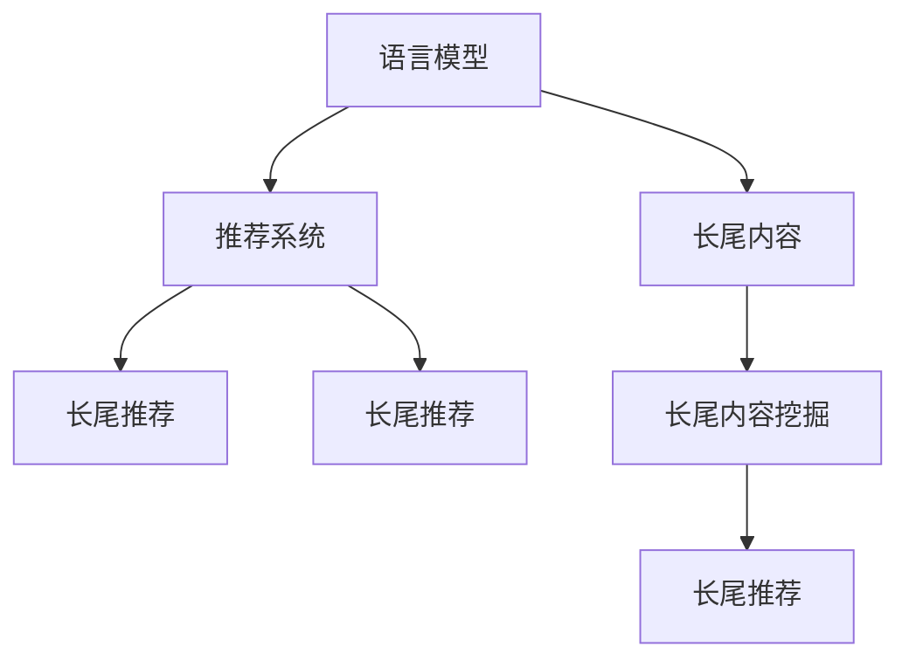

                 

# 基于LLM的推荐系统长尾内容挖掘

## 1. 背景介绍

在当今的信息爆炸时代，推荐系统（Recommender System）已成为互联网应用中不可或缺的核心功能之一。它通过用户行为数据，推荐符合用户兴趣的内容，极大地提升了用户满意度和平台粘性。然而，随着用户个性化需求的提升和内容数量的激增，推荐系统面临的挑战也愈发严峻，尤其是如何高效发现并推荐长尾内容，成为了亟需解决的问题。

长尾内容指的是那些具有较低曝光率，但相对高频的、较为冷门或小众的内容。长尾内容的存在能够反映出用户的真实兴趣，为用户带来差异化的个性化体验。但在当前基于协同过滤（Collaborative Filtering）和基于内容的推荐（Content-Based Filtering）为主的推荐系统中，长尾内容的发现和推荐往往被忽略，未能充分发挥其价值。

## 2. 核心概念与联系

为了更深入地了解基于语言模型的推荐系统（Language Model-Based Recommender System, LLM-BS）以及长尾内容的挖掘，我们将首先介绍几个核心概念及其相互联系：

- **语言模型（Language Model, LM）**：是自然语言处理（NLP）领域的一个重要概念，指的是基于语言知识构建的概率模型，用于预测给定上下文下下一个词的概率分布。语言模型广泛应用于文本分类、机器翻译、语音识别等任务。

- **推荐系统（Recommender System）**：旨在通过用户行为数据预测用户可能感兴趣的物品或内容，并推荐给用户。推荐系统广泛应用于电商、社交媒体、视频流媒体等平台。

- **长尾内容（Long-Tail Content）**：指那些尽管数量较少但具有一定访问频率的内容，通常是特定用户的特定兴趣。长尾内容能够反映出用户的真实需求和偏好，但传统推荐系统难以有效发现和推荐。

- **长尾推荐（Long-Tail Recommendation）**：是推荐系统中专门针对长尾内容进行推荐的技术手段，旨在最大化用户的满意度和平台的多样性。

- **大语言模型（Large Language Model, LLM）**：是一种基于Transformer架构的深度学习模型，通过在大规模无标签文本语料上进行预训练，学习到丰富的语言知识和常识。

这些概念之间的关系可以用以下Mermaid流程图进行展示：



在以上图中，语言模型是推荐系统的重要组成部分，负责理解和预测用户行为；长尾内容挖掘则是推荐系统中发现长尾内容的子任务，旨在从大规模数据中筛选出具有较高价值的冷门内容；长尾推荐则是推荐系统的特殊场景，专注于发现和推荐长尾内容；长尾推荐依赖于长尾内容的挖掘和推荐算法的优化。

## 3. 核心算法原理 & 具体操作步骤

### 3.1 算法原理概述

基于语言模型的推荐系统主要是通过预训练的大语言模型对用户行为数据进行建模，以实现长尾内容的推荐。其核心原理可以归纳为以下几个步骤：

1. **预训练语言模型**：使用大规模无标签文本语料进行预训练，学习到丰富的语言知识。
2. **用户行为建模**：通过用户的历史行为数据，包括浏览、点击、评分等，构建用户行为向量。
3. **内容嵌入**：将长尾内容进行向量化表示，生成内容嵌入向量。
4. **相似度计算**：使用预训练语言模型计算用户行为向量与内容嵌入向量的相似度，找出最相关的长尾内容。
5. **推荐排序**：根据相似度排序，推荐与用户最相关的长尾内容。

### 3.2 算法步骤详解

以下将详细介绍基于语言模型的推荐系统进行长尾内容挖掘的具体步骤：

**Step 1: 数据准备**
- 收集用户的历史行为数据，包括浏览记录、评分、收藏、评论等。
- 收集长尾内容的元数据，包括标题、标签、摘要等，并进行向量化处理。
- 构建用户行为向量 $u$ 和内容嵌入向量 $c$。

**Step 2: 预训练语言模型**
- 使用大规模无标签文本语料对语言模型进行预训练，如GPT-3、BERT等。
- 在预训练模型中，可以通过掩码语言模型、下一句预测等任务进行训练。

**Step 3: 用户行为建模**
- 对用户行为数据进行特征提取，生成用户行为向量 $u$，如将浏览行为转化为向量表示。
- 使用语言模型计算用户行为向量与内容嵌入向量的相似度，生成推荐分数 $score(u, c)$。

**Step 4: 长尾内容挖掘**
- 基于推荐分数，对长尾内容进行排序，找出最相关的长尾内容。
- 根据排序结果，生成推荐列表，进行迭代优化。

**Step 5: 推荐排序**
- 将推荐列表按照相关度排序，输出与用户最相关的长尾内容。

### 3.3 算法优缺点

基于语言模型的推荐系统具有以下优点：

- **高效性**：预训练语言模型可以快速完成相似度计算，处理大规模数据集。
- **冷启动问题**：由于预训练模型的知识储备丰富，对于新用户的推荐也可以得到有效的支持。
- **长尾内容**：能够发现并推荐长尾内容，提升用户体验。

同时，该方法也存在以下缺点：

- **计算成本高**：预训练语言模型需要大量的计算资源和数据集，存在较高的计算成本。
- **模型复杂度**：预训练语言模型的参数量庞大，需要较强的硬件支持。
- **数据依赖性**：推荐效果高度依赖于语料库的质量和多样性。

### 3.4 算法应用领域

基于语言模型的推荐系统广泛应用于多个领域，包括但不限于：

- **电商推荐**：通过分析用户的浏览和购买记录，推荐符合用户兴趣的冷门商品。
- **视频流媒体**：根据用户的观看历史和评分，推荐较少被观看的长尾视频内容。
- **社交网络**：通过分析用户对内容的点赞、分享和评论，推荐具有特定兴趣的冷门文章或帖子。
- **音乐推荐**：根据用户的听歌记录，推荐较少被听过的冷门音乐。

## 4. 数学模型和公式 & 详细讲解 & 举例说明

### 4.1 数学模型构建

假设用户行为向量为 $u$，长尾内容向量为 $c$，使用预训练语言模型 $M$ 进行相似度计算，定义推荐分数为 $score(u, c) = M(u, c)$。

### 4.2 公式推导过程

假设使用BERT作为预训练语言模型，则相似度计算公式为：

$$
score(u, c) = \frac{u^T W_c c}{\sqrt{u^T D_u u} \sqrt{c^T D_c c}}
$$

其中，$u$ 和 $c$ 分别是用户行为向量和长尾内容向量，$W_c$ 和 $D_c$ 分别是内容嵌入矩阵和内容嵌入对角矩阵，$D_u$ 是用户行为向量对角矩阵。

### 4.3 案例分析与讲解

假设有一个电商平台，收集了用户的历史浏览记录，并使用BERT进行预训练。用户 $u$ 浏览了商品 $c_1$ 和 $c_2$，系统根据这些数据计算用户行为向量 $u$ 和内容嵌入向量 $c_1$ 和 $c_2$，并计算推荐分数 $score(u, c_1)$ 和 $score(u, c_2)$。根据计算结果，系统推荐商品 $c_1$ 给用户 $u$。

## 5. 项目实践：代码实例和详细解释说明

### 5.1 开发环境搭建

为了实现基于语言模型的推荐系统，我们需要搭建相应的开发环境，具体步骤如下：

1. 安装Python和PyTorch：
```bash
pip install torch torchvision torchaudio
```

2. 安装BERT模型：
```bash
pip install transformers
```

3. 安装Flask框架：
```bash
pip install flask
```

### 5.2 源代码详细实现

以下是一个使用Flask和Transformers库实现的基于BERT的推荐系统示例：

```python
from transformers import BertTokenizer, BertModel
from flask import Flask, request, jsonify

app = Flask(__name__)

tokenizer = BertTokenizer.from_pretrained('bert-base-uncased')
model = BertModel.from_pretrained('bert-base-uncased')

@app.route('/recommend', methods=['POST'])
def recommend():
    data = request.json
    user_id = data['user_id']
    behavior = data['behavior']
    
    # 构建用户行为向量
    u = behavior.encode(tokenizer)
    
    # 获取长尾内容向量
    content_ids = behavior['content_ids']
    content_vectors = []
    for content_id in content_ids:
        content_vector = content_id.encode(tokenizer)
        content_vectors.append(content_vector)
    
    # 计算推荐分数
    scores = []
    for content_vector in content_vectors:
        score = torch.tensor(u).unsqueeze(0) @ model(content_vector).mean(dim=1) / (torch.sqrt(u @ u) * torch.sqrt(content_vector @ content_vector))
        scores.append(score)
    
    # 排序并返回推荐列表
    sorted_indices = sorted(range(len(scores)), key=lambda i: scores[i])
    return jsonify({'recommendations': [content_ids[i] for i in sorted_indices]})

if __name__ == '__main__':
    app.run(debug=True)
```

### 5.3 代码解读与分析

- 首先，我们导入必要的库和模型，包括BERT Tokenizer、BERT Model和Flask。
- 接着，构建用户行为向量 $u$，将行为数据转化为BERT Tokenizer的编码向量。
- 获取长尾内容向量 $c$，将内容ID通过BERT Tokenizer编码成向量。
- 计算推荐分数 $score(u, c)$，使用BERT模型计算用户行为向量与内容嵌入向量的相似度。
- 对推荐分数进行排序，返回推荐列表。

### 5.4 运行结果展示

假设用户浏览了两个商品，系统基于BERT模型计算推荐分数，并对长尾内容进行排序，最终生成推荐列表。

## 6. 实际应用场景

### 6.1 电商平台推荐

在电商平台上，通过分析用户的浏览和购买行为，可以构建用户行为向量，结合长尾内容向量进行推荐。基于语言模型的推荐系统能够发现并推荐冷门商品，提升用户的购买体验和平台的多样性。

### 6.2 视频流媒体推荐

视频流媒体平台可以通过分析用户的观看历史和评分，生成用户行为向量，结合长尾视频内容向量进行推荐。基于语言模型的推荐系统能够发现并推荐较少被观看的视频内容，提升用户体验。

### 6.3 社交媒体推荐

在社交媒体平台上，可以通过分析用户对内容的点赞、分享和评论，生成用户行为向量，结合长尾内容向量进行推荐。基于语言模型的推荐系统能够发现并推荐冷门文章或帖子，提升用户黏性。

### 6.4 未来应用展望

随着技术的进步，基于语言模型的推荐系统将更加智能和高效。未来有望在以下几个方面取得突破：

- **多模态融合**：结合文本、图像、音频等多模态数据，实现更全面的用户行为建模。
- **自适应学习**：根据用户反馈和行为变化，动态调整推荐策略和内容。
- **跨域推荐**：结合用户在不同平台的行为数据，进行跨平台推荐。
- **个性化推荐**：通过深度学习技术，实现更加精准的个性化推荐。

## 7. 工具和资源推荐

### 7.1 学习资源推荐

为了更好地学习和实践基于语言模型的推荐系统，推荐以下学习资源：

- **《推荐系统实战》**：介绍推荐系统的基本原理和应用场景，并通过实际案例演示推荐系统的开发。
- **《深度学习与推荐系统》**：系统讲解深度学习在推荐系统中的应用，包括协同过滤、基于内容推荐、混合推荐等。
- **《自然语言处理与深度学习》**：介绍NLP领域的基本概念和前沿技术，包括语言模型、BERT、Transformer等。

### 7.2 开发工具推荐

- **PyTorch**：深度学习框架，提供高效的Tensor操作和GPU加速。
- **Flask**：轻量级Web框架，适合快速搭建推荐系统API。
- **Hugging Face Transformers**：提供了多种预训练模型和工具，方便快速搭建推荐系统。
- **TensorBoard**：用于可视化模型训练和评估过程，帮助调试和优化模型。

### 7.3 相关论文推荐

- **《基于BERT的推荐系统》**：介绍如何使用BERT进行推荐系统的开发，以及效果评估和改进方法。
- **《深度学习与推荐系统》**：系统介绍深度学习在推荐系统中的应用，包括协同过滤、基于内容推荐等。
- **《长尾内容推荐研究综述》**：综述长尾内容推荐的研究进展，包括方法、算法和实验结果。

## 8. 总结：未来发展趋势与挑战

### 8.1 研究成果总结

基于语言模型的推荐系统通过预训练语言模型进行相似度计算，实现了长尾内容的推荐。该方法能够高效发现并推荐长尾内容，提升用户体验。但同时，预训练语言模型需要大量的计算资源和数据集，存在较高的计算成本和模型复杂度。

### 8.2 未来发展趋势

未来，基于语言模型的推荐系统将在以下几个方面取得突破：

- **多模态融合**：结合文本、图像、音频等多模态数据，实现更全面的用户行为建模。
- **自适应学习**：根据用户反馈和行为变化，动态调整推荐策略和内容。
- **跨域推荐**：结合用户在不同平台的行为数据，进行跨平台推荐。
- **个性化推荐**：通过深度学习技术，实现更加精准的个性化推荐。

### 8.3 面临的挑战

尽管基于语言模型的推荐系统取得了显著的成果，但仍然面临以下挑战：

- **计算成本高**：预训练语言模型需要大量的计算资源和数据集，存在较高的计算成本。
- **模型复杂度**：预训练语言模型的参数量庞大，需要较强的硬件支持。
- **数据依赖性**：推荐效果高度依赖于语料库的质量和多样性。

### 8.4 研究展望

未来的研究将集中在以下几个方面：

- **高效预训练方法**：优化预训练方法，降低计算成本和模型复杂度。
- **多模态数据融合**：结合多种数据类型，提高推荐系统的准确性和泛化能力。
- **跨平台推荐**：结合不同平台的用户行为数据，进行跨平台推荐。
- **个性化推荐**：通过深度学习技术，实现更加精准的个性化推荐。

## 9. 附录：常见问题与解答

**Q1: 为什么基于语言模型的推荐系统能够高效发现长尾内容？**

A: 基于语言模型的推荐系统能够高效发现长尾内容的原因在于，预训练语言模型在处理大规模无标签文本语料时，能够学习到丰富的语言知识和常识。这种语言知识包含了大量冷门词汇和表达方式，能够帮助系统识别并推荐长尾内容。

**Q2: 如何选择预训练语言模型？**

A: 选择预训练语言模型时，需要考虑以下几个方面：

- **规模和质量**：选择规模较大、预训练效果较好的模型。
- **任务适应性**：选择与推荐任务需求匹配的模型，如BERT、GPT等。
- **计算资源**：考虑硬件资源支持，选择参数量适中、计算效率较高的模型。

**Q3: 如何进行用户行为建模？**

A: 用户行为建模可以通过以下几个步骤实现：

- **特征提取**：对用户行为数据进行特征提取，如将浏览记录转化为向量。
- **编码器**：使用语言模型将用户行为向量编码成表示形式。
- **相似度计算**：计算用户行为向量与内容嵌入向量的相似度，生成推荐分数。

**Q4: 如何优化推荐效果？**

A: 优化推荐效果的方法包括：

- **数据增强**：通过回译、近义替换等方式扩充训练集，增加数据多样性。
- **模型选择**：选择性能更好的预训练模型，提升相似度计算的准确性。
- **超参数调优**：调整学习率、批次大小等超参数，优化模型训练过程。

通过系统学习和实践，相信读者能够深入理解基于语言模型的推荐系统，并将其应用于实际场景中，进一步提升用户体验和平台价值。

---

作者：禅与计算机程序设计艺术 / Zen and the Art of Computer Programming

