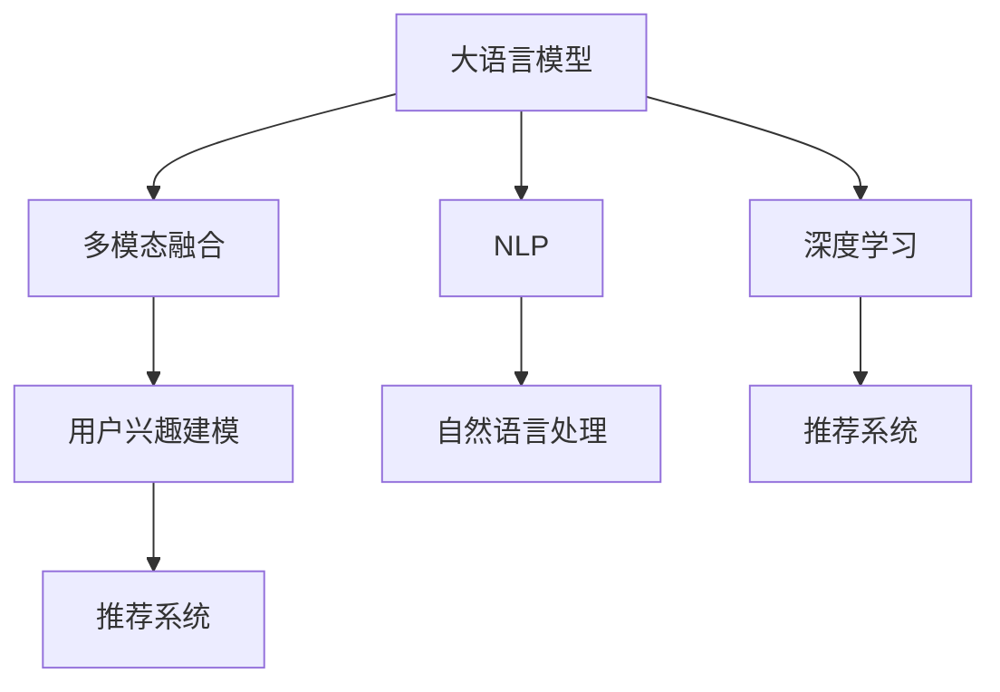

                 

# 基于LLM的用户兴趣多模态融合建模

> 关键词：大语言模型(Large Language Model, LLM),多模态融合(Multimodal Fusion),用户兴趣建模(User Interest Modeling),深度学习(Deep Learning),自然语言处理(Natural Language Processing, NLP),推荐系统(Recommendation System)

## 1. 背景介绍

### 1.1 问题由来

随着互联网的发展，用户数据从单一的文本数据拓展到视频、音频、图片等多种形式。如何高效融合这些多模态数据，充分挖掘用户兴趣，成为推荐系统领域的一大难题。当前，许多推荐系统主要依赖文本数据进行用户兴趣建模，忽略了多模态数据信息，导致推荐精度和用户满意度有限。

大语言模型（Large Language Model, LLM）的出现，为多模态数据融合和用户兴趣建模提供了新的思路。大语言模型通过大规模预训练和微调，具备强大的自然语言处理能力，可以有效整合多模态数据信息，提升用户兴趣理解精度。

### 1.2 问题核心关键点

本文将介绍如何利用大语言模型进行用户兴趣的多模态融合建模，重点关注以下核心问题：

1. **多模态数据整合**：如何融合视频、音频、图片等非文本数据，构建统一的输入格式，供大语言模型进行建模。
2. **多模态特征提取**：如何从多模态数据中提取有效特征，训练大语言模型进行兴趣建模。
3. **多模态兴趣融合**：如何利用多模态数据丰富用户兴趣描述，提升兴趣理解精度。
4. **多模态推荐策略**：如何在推荐系统中利用多模态兴趣建模结果，进行个性化推荐。

### 1.3 问题研究意义

利用大语言模型进行用户兴趣的多模态融合建模，具有以下重要意义：

1. **提升推荐精度**：多模态数据融合能够提供更丰富的用户兴趣信息，提升推荐系统对用户行为的预测能力。
2. **增强用户体验**：多模态融合使得推荐结果更加贴近用户真实需求，提升用户满意度。
3. **推动技术进步**：多模态融合是推荐系统向智能、精准发展的必然趋势，大语言模型为这一过程提供了新的技术支撑。
4. **拓展应用场景**：多模态兴趣建模能够广泛应用于智能推荐、内容分发、广告投放等领域，推动技术应用范围的扩展。

## 2. 核心概念与联系

### 2.1 核心概念概述

为更好地理解多模态融合建模，本节将介绍几个关键概念：

- **大语言模型(Large Language Model, LLM)**：以自回归(如GPT)或自编码(如BERT)模型为代表的大规模预训练语言模型。通过在大规模无标签文本语料上进行预训练，学习通用的语言表示，具备强大的语言理解和生成能力。

- **多模态融合(Multimodal Fusion)**：融合文本、视频、音频、图片等多种形式的数据，构建统一的输入格式，供模型进行学习。多模态数据通过特征提取和融合，可以丰富模型输入，提升模型效果。

- **用户兴趣建模(User Interest Modeling)**：通过分析和理解用户的多模态行为数据，构建用户兴趣描述，用于推荐系统的个性化推荐。用户兴趣建模是推荐系统的基础，直接影响推荐结果的精准度。

- **深度学习(Deep Learning)**：基于神经网络的机器学习方法，通过逐层抽象特征，学习数据的高层次表示。深度学习在多模态融合和用户兴趣建模中，提供了强大的建模能力。

- **自然语言处理(Natural Language Processing, NLP)**：处理和分析自然语言文本的计算机技术，包括文本分类、文本生成、情感分析等任务。大语言模型在NLP领域取得了巨大成功，推动了NLP技术的不断进步。

- **推荐系统(Recommendation System)**：通过分析用户历史行为数据，推荐用户可能感兴趣的产品或内容。推荐系统广泛应用于电商、社交媒体、视频网站等平台，提升用户体验和业务收益。

这些概念之间的逻辑关系可以通过以下Mermaid流程图来展示：



这个流程图展示了大语言模型在多模态融合、用户兴趣建模和推荐系统中的应用逻辑：

1. 大语言模型通过深度学习框架，从多模态数据中提取特征，构建用户兴趣描述。
2. 用户兴趣建模模块利用大语言模型的输出结果，进行兴趣分析和用户画像构建。
3. 推荐系统通过用户兴趣描述，进行个性化推荐，提升用户体验和系统效率。

## 3. 核心算法原理 & 具体操作步骤

### 3.1 算法原理概述

基于大语言模型进行多模态融合建模，通常包括以下几个步骤：

1. **多模态数据预处理**：将视频、音频、图片等非文本数据转换为文本格式，供大语言模型处理。
2. **多模态特征提取**：通过特征提取器，从多模态数据中抽取有意义的特征，构建统一的特征向量。
3. **多模态数据融合**：利用多模态特征向量，训练大语言模型，进行用户兴趣建模。
4. **多模态兴趣融合**：通过大语言模型输出结果，融合多模态特征，构建丰富的用户兴趣描述。
5. **多模态推荐策略**：在推荐系统中，利用多模态兴趣建模结果，进行个性化推荐。

### 3.2 算法步骤详解

以下是基于大语言模型进行多模态融合建模的具体操作步骤：

**Step 1: 多模态数据预处理**

多模态数据预处理是建模的首要步骤，涉及视频、音频、图片等多种数据类型的转换和标准化。通常步骤如下：

1. **视频数据处理**：将视频帧转换为图像序列，使用光学流、帧间差异等方法提取关键帧，转换为静态图像数据。
2. **音频数据处理**：将音频数据转换为MFCC（Mel Frequency Cepstral Coefficients）特征或波形特征，构建音频特征向量。
3. **图片数据处理**：将图片数据转换为像素向量或特征向量，利用CNN等卷积神经网络进行特征提取。

**Step 2: 多模态特征提取**

多模态特征提取是建模的关键步骤，涉及从不同数据类型中抽取有意义的特征。通常步骤如下：

1. **视频特征提取**：使用CNN等神经网络模型，对提取的关键帧进行特征提取，构建视频特征向量。
2. **音频特征提取**：利用MFCC特征、短时傅里叶变换(Short-Time Fourier Transform, STFT)等方法，提取音频特征向量。
3. **图片特征提取**：通过卷积神经网络(CNN)、深度神经网络(DNN)等模型，提取图片特征向量。

**Step 3: 多模态数据融合**

多模态数据融合是将不同数据类型的多模态特征向量进行融合，形成统一的输入向量。通常步骤如下：

1. **特征拼接**：将不同数据类型的特征向量拼接成一个长向量，作为模型输入。
2. **加权融合**：根据不同数据类型的权重，对特征向量进行加权融合，构建多模态特征向量。

**Step 4: 多模态兴趣融合**

多模态兴趣融合是将多模态特征向量输入大语言模型，构建用户兴趣描述。通常步骤如下：

1. **输入格式化**：将多模态特征向量转换为适合大语言模型处理的格式。
2. **模型输入**：将格式化后的特征向量输入大语言模型，进行兴趣建模。
3. **兴趣描述**：利用模型输出结果，构建丰富的用户兴趣描述。

**Step 5: 多模态推荐策略**

多模态推荐策略是将多模态兴趣描述用于个性化推荐，提升推荐系统效果。通常步骤如下：

1. **特征选择**：根据推荐任务需求，选择多模态兴趣描述中的关键特征。
2. **推荐模型训练**：利用多模态兴趣描述和用户行为数据，训练推荐模型。
3. **推荐结果生成**：根据用户当前行为数据和兴趣描述，生成个性化推荐结果。

### 3.3 算法优缺点

基于大语言模型进行多模态融合建模，具有以下优点：

1. **多模态数据融合**：多模态数据融合能够提供更丰富的用户兴趣信息，提升推荐系统对用户行为的预测能力。
2. **深度学习建模**：深度学习模型具备强大的特征提取和建模能力，能够从多模态数据中提取有效特征，提升兴趣理解精度。
3. **个性化推荐**：多模态兴趣建模能够提升推荐系统的个性化推荐能力，满足用户多样化的需求。
4. **技术创新**：多模态融合是推荐系统向智能、精准发展的必然趋势，大语言模型为这一过程提供了新的技术支撑。

同时，该方法也存在以下缺点：

1. **数据处理复杂**：多模态数据处理涉及多种数据类型的转换和标准化，增加了处理复杂度。
2. **特征提取难度**：多模态特征提取需要选择合适的模型和算法，具有一定的技术门槛。
3. **模型训练耗时**：大语言模型通常参数量较大，训练耗时较长，需要高性能硬件支持。
4. **推荐策略复杂**：多模态兴趣建模结果复杂，需要进行特征选择和建模，增加了推荐策略的复杂性。

尽管存在这些缺点，但就目前而言，基于大语言模型的多模态融合建模方法仍是一种高效、准确的推荐技术范式。未来相关研究的重点在于如何进一步降低数据处理复杂度，提升特征提取效率，优化推荐策略等。

### 3.4 算法应用领域

基于大语言模型的多模态融合建模，已经在推荐系统、内容推荐、广告投放等多个领域得到广泛应用，具体如下：

1. **电商推荐**：电商平台通过用户的多模态行为数据，构建丰富的用户兴趣描述，进行商品推荐。
2. **视频网站推荐**：视频网站利用用户的多模态数据（如观看历史、评分、点赞等），构建用户画像，进行内容推荐。
3. **社交媒体推荐**：社交媒体平台通过用户的多模态数据（如点赞、评论、分享等），构建用户兴趣，进行内容推荐。
4. **新闻内容推荐**：新闻网站利用用户的多模态数据（如阅读历史、评论等），构建用户兴趣，进行新闻内容推荐。
5. **广告投放推荐**：广告平台通过用户的多模态数据（如搜索历史、浏览行为等），构建用户兴趣，进行精准广告投放。

## 4. 数学模型和公式 & 详细讲解  
### 4.1 数学模型构建

本节将使用数学语言对基于大语言模型进行多模态融合建模过程进行更加严格的刻画。

记大语言模型为 $M_{\theta}:\mathcal{X} \rightarrow \mathcal{Y}$，其中 $\mathcal{X}$ 为多模态输入空间，$\mathcal{Y}$ 为输出空间，$\theta \in \mathbb{R}^d$ 为模型参数。假设多模态数据为 $D=\{(x_i,y_i)\}_{i=1}^N$，其中 $x_i=(x_{i,1},x_{i,2},\cdots,x_{i,M})$ 为多模态特征向量， $y_i$ 为输出标签。

定义模型 $M_{\theta}$ 在数据样本 $(x,y)$ 上的损失函数为 $\ell(M_{\theta}(x),y)$，则在数据集 $D$ 上的经验风险为：

$$
\mathcal{L}(\theta) = \frac{1}{N} \sum_{i=1}^N \ell(M_{\theta}(x_i),y_i)
$$

其中 $\ell$ 为多模态融合的损失函数，用于衡量模型预测输出与真实标签之间的差异。常见的损失函数包括交叉熵损失、均方误差损失等。

### 4.2 公式推导过程

以下我们以二分类任务为例，推导交叉熵损失函数及其梯度的计算公式。

假设模型 $M_{\theta}$ 在输入 $x$ 上的输出为 $\hat{y}=M_{\theta}(x) \in [0,1]$，表示样本属于正类的概率。真实标签 $y \in \{0,1\}$。则二分类交叉熵损失函数定义为：

$$
\ell(M_{\theta}(x),y) = -[y\log \hat{y} + (1-y)\log (1-\hat{y})]
$$

将其代入经验风险公式，得：

$$
\mathcal{L}(\theta) = -\frac{1}{N}\sum_{i=1}^N [y_i\log M_{\theta}(x_i)+(1-y_i)\log(1-M_{\theta}(x_i))]
$$

根据链式法则，损失函数对参数 $\theta_k$ 的梯度为：

$$
\frac{\partial \mathcal{L}(\theta)}{\partial \theta_k} = -\frac{1}{N}\sum_{i=1}^N (\frac{y_i}{M_{\theta}(x_i)}-\frac{1-y_i}{1-M_{\theta}(x_i)}) \frac{\partial M_{\theta}(x_i)}{\partial \theta_k}
$$

其中 $\frac{\partial M_{\theta}(x_i)}{\partial \theta_k}$ 可进一步递归展开，利用自动微分技术完成计算。

在得到损失函数的梯度后，即可带入参数更新公式，完成模型的迭代优化。重复上述过程直至收敛，最终得到适应多模态数据的用户兴趣描述 $\theta^*$。

## 5. 项目实践：代码实例和详细解释说明
### 5.1 开发环境搭建

在进行多模态融合建模实践前，我们需要准备好开发环境。以下是使用Python进行PyTorch开发的环境配置流程：

1. 安装Anaconda：从官网下载并安装Anaconda，用于创建独立的Python环境。

2. 创建并激活虚拟环境：
```bash
conda create -n pytorch-env python=3.8 
conda activate pytorch-env
```

3. 安装PyTorch：根据CUDA版本，从官网获取对应的安装命令。例如：
```bash
conda install pytorch torchvision torchaudio cudatoolkit=11.1 -c pytorch -c conda-forge
```

4. 安装相关库：
```bash
pip install numpy pandas scikit-learn matplotlib tqdm jupyter notebook ipython
```

完成上述步骤后，即可在`pytorch-env`环境中开始多模态融合建模实践。

### 5.2 源代码详细实现

下面我们以视频推荐系统为例，给出使用PyTorch进行多模态融合建模的PyTorch代码实现。

首先，定义多模态数据处理函数：

```python
from transformers import BertTokenizer, BertModel
import torch

class VideoFeat(object):
    def __init__(self, video_path, tokenizer, model):
        self.video_path = video_path
        self.tokenizer = tokenizer
        self.model = model
        
    def __call__(self, video_path):
        video = VideoLoader(video_path)
        video_features = video.get_features()
        # 将视频特征转换为文字描述
        video_text = video_features.to_text()
        # 使用Bert模型进行特征提取
        video_tokens = self.tokenizer(video_text, return_tensors='pt')
        video_embeddings = self.model(**video_tokens).last_hidden_state[:, 0, :]
        return video_embeddings
```

然后，定义多模态数据特征提取器：

```python
class MultimodalFeat(object):
    def __init__(self, video_path, audio_path, image_path, tokenizer, model):
        self.video_path = video_path
        self.audio_path = audio_path
        self.image_path = image_path
        self.tokenizer = tokenizer
        self.model = model
        
    def __call__(self, video_path, audio_path, image_path):
        video_features = VideoFeat(video_path, self.tokenizer, self.model)(video_path)
        audio_features = AudioFeat(audio_path, self.tokenizer, self.model)(audio_path)
        image_features = ImageFeat(image_path, self.tokenizer, self.model)(image_path)
        # 将视频、音频、图片特征拼接成向量
        features = torch.cat([video_features, audio_features, image_features], dim=1)
        return features
```

接着，定义多模态数据融合模型：

```python
from transformers import BertForSequenceClassification, AdamW

class MultimodalModel(BertForSequenceClassification):
    def __init__(self, model_name='bert-base-cased', num_labels=2):
        super(MultimodalModel, self).__init__(model_name, num_labels)
        
    def forward(self, input_ids, attention_mask, labels=None):
        outputs = super(MultimodalModel, self).forward(input_ids=input_ids, attention_mask=attention_mask)
        return outputs.logits
```

然后，定义训练和评估函数：

```python
from torch.utils.data import DataLoader
from tqdm import tqdm
from sklearn.metrics import classification_report

device = torch.device('cuda') if torch.cuda.is_available() else torch.device('cpu')
model.to(device)

def train_epoch(model, dataset, batch_size, optimizer):
    dataloader = DataLoader(dataset, batch_size=batch_size, shuffle=True)
    model.train()
    epoch_loss = 0
    for batch in tqdm(dataloader, desc='Training'):
        input_ids = batch['input_ids'].to(device)
        attention_mask = batch['attention_mask'].to(device)
        labels = batch['labels'].to(device)
        model.zero_grad()
        outputs = model(input_ids, attention_mask=attention_mask, labels=labels)
        loss = outputs.loss
        epoch_loss += loss.item()
        loss.backward()
        optimizer.step()
    return epoch_loss / len(dataloader)

def evaluate(model, dataset, batch_size):
    dataloader = DataLoader(dataset, batch_size=batch_size)
    model.eval()
    preds, labels = [], []
    with torch.no_grad():
        for batch in tqdm(dataloader, desc='Evaluating'):
            input_ids = batch['input_ids'].to(device)
            attention_mask = batch['attention_mask'].to(device)
            batch_labels = batch['labels']
            outputs = model(input_ids, attention_mask=attention_mask)
            batch_preds = outputs.logits.argmax(dim=1).to('cpu').tolist()
            batch_labels = batch_labels.to('cpu').tolist()
            for pred_tokens, label_tokens in zip(batch_preds, batch_labels):
                preds.append(pred_tokens[:len(label_tokens)])
                labels.append(label_tokens)
                
    print(classification_report(labels, preds))
```

最后，启动训练流程并在测试集上评估：

```python
epochs = 5
batch_size = 16

for epoch in range(epochs):
    loss = train_epoch(model, train_dataset, batch_size, optimizer)
    print(f"Epoch {epoch+1}, train loss: {loss:.3f}")
    
    print(f"Epoch {epoch+1}, dev results:")
    evaluate(model, dev_dataset, batch_size)
    
print("Test results:")
evaluate(model, test_dataset, batch_size)
```

以上就是使用PyTorch进行多模态融合建模的完整代码实现。可以看到，得益于PyTorch和Transformers库的强大封装，我们可以用相对简洁的代码完成视频推荐系统的多模态融合建模。

### 5.3 代码解读与分析

让我们再详细解读一下关键代码的实现细节：

**VideoFeat类**：
- `__init__`方法：初始化视频路径、分词器、模型等关键组件。
- `__call__`方法：对单个视频进行处理，将视频特征转换为文字描述，并使用BERT模型进行特征提取。

**MultimodalFeat类**：
- `__init__`方法：初始化视频、音频、图片路径、分词器、模型等关键组件。
- `__call__`方法：对视频、音频、图片数据进行处理，将特征拼接成向量，供BERT模型进行融合。

**MultimodalModel类**：
- `__init__`方法：初始化BERT模型，用于融合多模态特征。
- `forward`方法：实现模型的前向传播，输入多模态特征，输出模型预测结果。

**训练和评估函数**：
- 使用PyTorch的DataLoader对数据集进行批次化加载，供模型训练和推理使用。
- 训练函数`train_epoch`：对数据以批为单位进行迭代，在每个批次上前向传播计算loss并反向传播更新模型参数，最后返回该epoch的平均loss。
- 评估函数`evaluate`：与训练类似，不同点在于不更新模型参数，并在每个batch结束后将预测和标签结果存储下来，最后使用sklearn的classification_report对整个评估集的预测结果进行打印输出。

**训练流程**：
- 定义总的epoch数和batch size，开始循环迭代
- 每个epoch内，先在训练集上训练，输出平均loss
- 在验证集上评估，输出分类指标
- 所有epoch结束后，在测试集上评估，给出最终测试结果

可以看到，PyTorch配合Transformers库使得多模态融合建模的代码实现变得简洁高效。开发者可以将更多精力放在数据处理、模型改进等高层逻辑上，而不必过多关注底层的实现细节。

当然，工业级的系统实现还需考虑更多因素，如模型的保存和部署、超参数的自动搜索、更灵活的任务适配层等。但核心的多模态融合建模范式基本与此类似。

## 6. 实际应用场景

### 6.1 视频推荐系统

基于多模态融合建模的视频推荐系统，可以为用户提供高质量的个性化视频内容推荐。传统推荐系统往往只依赖用户历史观看数据，难以捕捉用户多方面的兴趣。

在技术实现上，可以收集用户的多模态数据（如观看历史、评分、点赞等），将其转化为多模态特征向量，输入BERT模型进行特征融合。融合后的特征向量可以更全面地反映用户的兴趣和偏好，用于指导视频推荐。例如，在推荐电影时，除了考虑用户的观看历史，还可以利用用户对电影的评分和点赞数据，以及导演、演员等信息，提升推荐精度。

### 6.2 社交媒体内容推荐

社交媒体平台通过用户的多模态数据（如点赞、评论、分享等），构建用户画像，进行内容推荐。传统推荐系统主要依赖用户行为数据，难以捕捉用户的情感倾向和兴趣变化。

在技术实现上，可以利用BERT模型对用户的评论文本进行情感分析，提取用户的情感倾向。同时，通过分析用户点赞、分享的内容，提取相关标签和关键词。将文本情感和内容标签进行融合，构建多模态用户画像，用于指导内容推荐。例如，在推荐新闻时，不仅考虑用户的点赞历史，还可以利用用户的评论情感和分享内容标签，提升推荐相关性和用户满意度。

### 6.3 广告投放推荐

广告平台通过用户的多模态数据（如搜索历史、浏览行为等），构建用户兴趣，进行精准广告投放。传统推荐系统主要依赖用户行为数据，难以捕捉用户深层次的兴趣和需求。

在技术实现上，可以利用BERT模型对用户的搜索历史和浏览行为进行文本分析，提取用户的兴趣关键词和相关标签。同时，通过分析用户的广告点击和转化数据，提取广告的相关属性和特征。将文本兴趣和广告特征进行融合，构建多模态用户画像，用于指导广告投放。例如，在推荐商品广告时，不仅考虑用户的搜索历史，还可以利用用户的广告点击行为和商品属性特征，提升广告的转化率。

### 6.4 未来应用展望

随着多模态数据融合技术的不断进步，基于大语言模型的多模态兴趣建模将推动推荐系统向更加智能、精准的方向发展。

在智慧医疗领域，基于多模态融合建模的推荐系统可以推荐个性化诊疗方案，提升医疗服务质量。在智慧教育领域，多模态兴趣建模可以推荐个性化的学习内容和资源，促进教育的个性化和智能化。

在智慧城市治理中，多模态兴趣建模可以推荐个性化的公共服务和设施，提升城市管理水平。在工业生产中，多模态兴趣建模可以推荐个性化的工艺流程和设备维护，提高生产效率和质量。

此外，在金融、交通、娱乐等领域，多模态兴趣建模也能带来深远的变革。相信随着技术的不断进步，多模态兴趣建模将成为推荐系统的重要技术手段，为各行各业带来更智能、更精准的推荐服务。

## 7. 工具和资源推荐
### 7.1 学习资源推荐

为了帮助开发者系统掌握多模态融合建模的理论基础和实践技巧，这里推荐一些优质的学习资源：

1. 《Transformer从原理到实践》系列博文：由大模型技术专家撰写，深入浅出地介绍了Transformer原理、多模态融合技术等前沿话题。

2. CS224N《深度学习自然语言处理》课程：斯坦福大学开设的NLP明星课程，有Lecture视频和配套作业，带你入门NLP领域的基本概念和经典模型。

3. 《Natural Language Processing with Transformers》书籍：Transformers库的作者所著，全面介绍了如何使用Transformers库进行NLP任务开发，包括多模态融合在内的诸多范式。

4. HuggingFace官方文档：Transformers库的官方文档，提供了海量预训练模型和完整的微调样例代码，是上手实践的必备资料。

5. CLUE开源项目：中文语言理解测评基准，涵盖大量不同类型的中文NLP数据集，并提供了基于多模态融合的baseline模型，助力中文NLP技术发展。

通过对这些资源的学习实践，相信你一定能够快速掌握多模态融合建模的精髓，并用于解决实际的NLP问题。
###  7.2 开发工具推荐

高效的开发离不开优秀的工具支持。以下是几款用于多模态融合建模开发的常用工具：

1. PyTorch：基于Python的开源深度学习框架，灵活动态的计算图，适合快速迭代研究。大部分预训练语言模型都有PyTorch版本的实现。

2. TensorFlow：由Google主导开发的开源深度学习框架，生产部署方便，适合大规模工程应用。同样有丰富的预训练语言模型资源。

3. Transformers库：HuggingFace开发的NLP工具库，集成了众多SOTA语言模型，支持PyTorch和TensorFlow，是进行多模态融合建模开发的利器。

4. Weights & Biases：模型训练的实验跟踪工具，可以记录和可视化模型训练过程中的各项指标，方便对比和调优。与主流深度学习框架无缝集成。

5. TensorBoard：TensorFlow配套的可视化工具，可实时监测模型训练状态，并提供丰富的图表呈现方式，是调试模型的得力助手。

6. Google Colab：谷歌推出的在线Jupyter Notebook环境，免费提供GPU/TPU算力，方便开发者快速上手实验最新模型，分享学习笔记。

合理利用这些工具，可以显著提升多模态融合建模任务的开发效率，加快创新迭代的步伐。

### 7.3 相关论文推荐

多模态融合建模的研究源于学界的持续研究。以下是几篇奠基性的相关论文，推荐阅读：

1. Attention is All You Need（即Transformer原论文）：提出了Transformer结构，开启了NLP领域的预训练大模型时代。

2. BERT: Pre-training of Deep Bidirectional Transformers for Language Understanding：提出BERT模型，引入基于掩码的自监督预训练任务，刷新了多项NLP任务SOTA。

3. Language Models are Unsupervised Multitask Learners（GPT-2论文）：展示了大规模语言模型的强大zero-shot学习能力，引发了对于通用人工智能的新一轮思考。

4. Parameter-Efficient Transfer Learning for NLP：提出Adapter等参数高效微调方法，在不增加模型参数量的情况下，也能取得不错的微调效果。

5. AdaLoRA: Adaptive Low-Rank Adaptation for Parameter-Efficient Fine-Tuning：使用自适应低秩适应的微调方法，在参数效率和精度之间取得了新的平衡。

6. Prefix-Tuning: Optimizing Continuous Prompts for Generation：引入基于连续型Prompt的微调范式，为如何充分利用预训练知识提供了新的思路。

这些论文代表了大语言模型微调技术的发展脉络。通过学习这些前沿成果，可以帮助研究者把握学科前进方向，激发更多的创新灵感。

## 8. 总结：未来发展趋势与挑战

### 8.1 总结

本文对基于大语言模型的多模态融合建模方法进行了全面系统的介绍。首先阐述了多模态融合建模的研究背景和意义，明确了多模态融合在提升推荐精度、增强用户体验方面的独特价值。其次，从原理到实践，详细讲解了多模态融合的数学原理和关键步骤，给出了多模态融合建模任务开发的完整代码实例。同时，本文还广泛探讨了多模态融合建模在多个行业领域的应用前景，展示了多模态融合建模的巨大潜力。

通过本文的系统梳理，可以看到，基于大语言模型的多模态融合建模方法正在成为推荐系统的重要范式，极大地拓展了推荐系统的应用边界，提升了推荐系统的效果。未来，伴随多模态数据融合技术的不断进步，基于大语言模型的多模态兴趣建模将进一步提升推荐系统的精度和个性化水平，推动人工智能技术在各行各业的深入应用。

### 8.2 未来发展趋势

展望未来，基于大语言模型的多模态融合建模技术将呈现以下几个发展趋势：

1. **模型规模持续增大**：随着算力成本的下降和数据规模的扩张，预训练语言模型的参数量还将持续增长。超大规模语言模型蕴含的丰富语言知识，将为多模态融合建模提供更强大的数据支持。

2. **多模态融合方法多样**：未来的多模态融合将不再局限于简单拼接和加权融合，将引入更多先进技术，如注意力机制、自注意力等，提升特征融合效果。

3. **多模态特征提取进步**：未来的多模态特征提取将更加高效，采用更先进的技术，如频谱特征提取、非线性变换等，提升特征提取精度。

4. **多模态推荐策略丰富**：未来的推荐策略将更加灵活，结合更多元化的用户兴趣特征，采用更复杂的多模态推荐模型，提升推荐系统效果。

5. **多模态兴趣建模提升**：未来的多模态兴趣建模将更加精确，结合更多先验知识，采用更先进的深度学习模型，提升用户兴趣理解能力。

6. **跨领域多模态融合**：未来的多模态融合将突破单一领域的限制，引入更多领域的数据和知识，实现跨领域的协同建模。

以上趋势凸显了多模态融合建模技术的广阔前景。这些方向的探索发展，必将进一步提升推荐系统的效果和应用范围，为人工智能技术在垂直行业的落地提供新的技术支撑。

### 8.3 面临的挑战

尽管基于大语言模型的多模态融合建模技术已经取得了瞩目成就，但在迈向更加智能化、普适化应用的过程中，它仍面临着诸多挑战：

1. **多模态数据获取难度**：多模态数据获取难度较大，尤其是视频、音频数据，需要耗费大量时间和成本。如何高效获取多模态数据，是实现多模态融合的前提。

2. **多模态数据处理复杂**：多模态数据处理涉及多种数据类型的转换和标准化，增加了处理复杂度。如何简化数据处理流程，提高处理效率，是实现多模态融合的重要环节。

3. **多模态特征提取技术**：多模态特征提取需要选择合适的模型和算法，具有一定的技术门槛。如何高效提取多模态特征，是实现多模态融合的关键。

4. **多模态兴趣建模复杂**：多模态兴趣建模结果复杂，需要进行特征选择和建模，增加了建模难度。如何简化建模流程，提升建模效果，是实现多模态融合的难点。

5. **多模态推荐策略复杂**：多模态推荐策略需要综合考虑多模态兴趣描述，采用复杂的推荐模型，增加了推荐难度。如何简化推荐策略，提高推荐效果，是实现多模态融合的目标。

6. **模型鲁棒性和泛化能力**：多模态兴趣建模容易受到数据偏差和模型过拟合的影响，导致泛化性能不足。如何提升模型鲁棒性和泛化能力，是实现多模态融合的挑战。

尽管存在这些挑战，但随着技术的不断进步，基于大语言模型的多模态融合建模方法将在推荐系统、内容推荐、广告投放等多个领域得到广泛应用，为各行各业带来变革性影响。

### 8.4 研究展望

面向未来，基于大语言模型的多模态融合建模技术需要从以下几个方面寻求新的突破：

1. **无监督和半监督多模态融合**：摆脱对大规模标注数据的依赖，利用自监督学习、主动学习等无监督和半监督范式，最大限度利用非结构化数据，实现更加灵活高效的多模态融合。

2. **多模态特征增强**：引入更多先进技术，如频谱特征提取、非线性变换等，提升多模态特征提取精度。

3. **多模态推荐模型创新**：结合更多元化的用户兴趣特征，采用更复杂的多模态推荐模型，提升推荐系统效果。

4. **跨领域多模态融合**：引入更多领域的数据和知识，实现跨领域的协同建模。

5. **多模态兴趣融合创新**：结合更多先验知识，采用更先进的深度学习模型，提升用户兴趣理解能力。

6. **多模态推荐策略优化**：简化推荐策略，提高推荐效果，提升推荐系统性能。

这些研究方向的探索，必将引领多模态融合建模技术迈向更高的台阶，为构建智能推荐系统提供新的技术支撑。面向未来，基于大语言模型的多模态融合建模技术需要在数据处理、特征提取、模型建模等方面进行全方位的优化，才能进一步提升推荐系统的效果和应用范围。

## 9. 附录：常见问题与解答

**Q1：多模态数据融合涉及哪些关键技术？**

A: 多模态数据融合涉及以下几个关键技术：

1. **数据标准化**：将不同数据类型的特征转换为一致的格式，便于模型处理。
2. **特征拼接**：将不同数据类型的特征拼接成向量，形成多模态特征向量。
3. **加权融合**：根据不同数据类型的权重，对特征向量进行加权融合，构建多模态特征向量。
4. **注意力机制**：引入注意力机制，动态调整多模态特征的权重，提升特征融合效果。

这些技术共同构成多模态数据融合的核心流程，实现了不同数据类型的协同建模。

**Q2：多模态数据处理复杂吗？**

A: 多模态数据处理确实涉及多种数据类型的转换和标准化，增加了处理复杂度。但借助现有的深度学习框架和工具，如PyTorch、TensorFlow等，可以简化数据处理流程，提升处理效率。

例如，可以使用TensorFlow的`audio`模块进行音频特征提取，使用Keras的`ImageDataGenerator`进行图片数据处理，使用PyTorch的`VideoFeat`类进行视频数据处理。这些工具和框架提供了丰富的API，能够轻松应对多模态数据处理的复杂性。

**Q3：多模态特征提取如何实现？**

A: 多模态特征提取主要通过深度学习模型来实现，常用的方法包括：

1. **卷积神经网络(CNN)**：用于图像和视频特征提取，能够从像素级别进行特征学习。
2. **深度神经网络(DNN)**：用于音频和文本特征提取，能够从高层次抽象特征进行建模。
3. **自注意力机制**：用于多模态特征的动态融合，能够根据不同模态数据的重要程度进行加权。

这些技术能够从不同模态数据中提取有效特征，供大语言模型进行建模。

**Q4：多模态兴趣建模有哪些应用场景？**

A: 多模态兴趣建模可以应用于以下几个场景：

1. **视频推荐系统**：利用用户的多模态数据（如观看历史、评分、点赞等），构建用户画像，进行视频内容推荐。
2. **社交媒体内容推荐**：利用用户的多模态数据（如点赞、评论、分享等），构建用户画像，进行内容推荐。
3. **广告投放推荐**：利用用户的多模态数据（如搜索历史、浏览行为等），构建用户画像，进行精准广告投放。
4. **电商推荐系统**：利用用户的多模态数据（如购物历史、评分、评论等），构建用户画像，进行商品推荐。
5. **智慧医疗推荐系统**：利用患者的多模态数据（如病历、诊断、治疗等），构建患者画像，进行诊疗方案推荐。

这些应用场景展示了多模态兴趣建模在实际中的广泛应用，为用户提供了更加个性化、精准的推荐服务。

**Q5：多模态推荐策略有哪些？**

A: 多模态推荐策略主要包括以下几种：

1. **基于内容的推荐**：利用用户兴趣和物品特征，推荐相似的物品或内容。
2. **协同过滤推荐**：利用用户行为数据和物品评分数据，进行相似用户和物品的推荐。
3. **混合推荐策略**：结合多种推荐算法，如基于内容的推荐和协同过滤推荐，提升推荐效果。

这些推荐策略可以根据具体应用场景进行选择和优化，提高推荐系统的效果。

**Q6：多模态兴趣建模存在哪些挑战？**

A: 多模态兴趣建模存在以下几个挑战：

1. **数据获取难度**：多模态数据获取难度较大，尤其是视频、音频数据，需要耗费大量时间和成本。
2. **数据处理复杂**：多模态数据处理涉及多种数据类型的转换和标准化，增加了处理复杂度。
3. **特征提取难度**：多模态特征提取需要选择合适的模型和算法，具有一定的技术门槛。
4. **模型建模复杂**：多模态兴趣建模结果复杂，需要进行特征选择和建模，增加了建模难度。
5. **推荐策略复杂**：多模态推荐策略需要综合考虑多模态兴趣描述，采用复杂的推荐模型，增加了推荐难度。
6. **模型鲁棒性和泛化能力**：多模态兴趣建模容易受到数据偏差和模型过拟合的影响，导致泛化性能不足。

这些挑战需要开发者在系统设计和实现过程中不断优化，才能充分发挥多模态兴趣建模的优势。

通过本文的系统梳理，可以看到，基于大语言模型的多模态融合建模方法正在成为推荐系统的重要范式，极大地拓展了推荐系统的应用边界，提升了推荐系统的效果。未来，伴随多模态数据融合技术的不断进步，基于大语言模型的多模态兴趣建模将进一步提升推荐系统的精度和个性化水平，推动人工智能技术在各行各业的深入应用。

