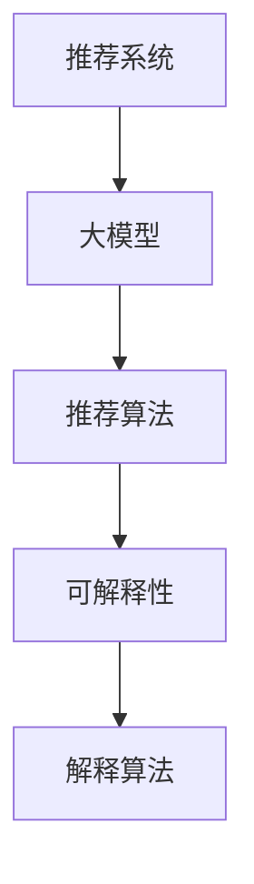

                 

# 基于大模型的推荐系统可解释性研究

> 关键词：推荐系统, 大模型, 可解释性, 深度学习, 算法透明度, 推荐算法, 解释算法

## 1. 背景介绍

### 1.1 问题由来

随着互联网和移动互联网的迅猛发展，推荐系统已经成为提升用户体验、增加商业价值的关键技术。传统的推荐算法基于协同过滤、矩阵分解等方法，虽然能够生成较为准确的推荐结果，但在算法的可解释性方面存在不足，用户难以理解和信任推荐结果。因此，如何提升推荐算法的可解释性，成为当前研究的热点问题。

随着深度学习技术的兴起，基于深度神经网络的推荐系统逐渐成为主流。利用大模型进行推荐，可以显著提升推荐精度，但同时也会增加算法的复杂性和不透明性，导致用户在推荐过程中难以理解系统行为，甚至可能引发用户的不信任和抵触。如何在大模型推荐系统中实现算法的可解释性，是当前研究需要解决的重要课题。

### 1.2 问题核心关键点

在基于大模型的推荐系统中，可解释性问题主要体现在以下几个方面：
- **算法透明度**：用户难以理解推荐模型如何做出决策，导致信任度下降。
- **模型复杂性**：大模型的复杂结构增加了推荐的不可解释性。
- **特征理解**：用户无法理解模型使用哪些特征进行决策，导致模型行为不透明。
- **结果解读**：用户无法理解推荐结果的具体来源和依据，导致推荐效果不明确。

解决这些问题的关键在于，一方面需要提升算法的透明度，使用户能够理解和信任推荐结果；另一方面需要改善模型的可解释性，提供直观、易懂的解释路径，帮助用户理解推荐背后的原因。

## 2. 核心概念与联系

### 2.1 核心概念概述

为了更好地理解基于大模型的推荐系统可解释性研究，本节将介绍几个密切相关的核心概念：

- **推荐系统**：利用用户的历史行为数据，为用户推荐感兴趣的物品（如商品、新闻、视频等）。推荐系统是互联网产品的重要组成部分，如电商平台的商品推荐、视频平台的个性化推荐等。

- **大模型**：以深度神经网络为基础的、参数量非常庞大的模型，如BERT、GPT-3等。大模型通过在大规模数据上进行预训练，学习到丰富的特征表示，能够高效地提取用户和物品的复杂关系。

- **可解释性**：指用户能够理解推荐算法的基本原理、使用的数据特征以及推荐结果的具体来源。可解释性是推荐系统成功的关键因素，有助于提升用户满意度、增加信任度。

- **推荐算法**：包括协同过滤、矩阵分解、深度学习等多种方法，其中深度学习推荐系统利用大模型进行特征提取和关系建模，成为推荐系统的最新趋势。

- **解释算法**：针对推荐系统的特殊需求，设计专门用于解释推荐模型的算法，如LIME、SHAP等。解释算法能够提供推荐过程的可视化解释，帮助用户理解推荐行为。

这些核心概念之间的逻辑关系可以通过以下Mermaid流程图来展示：



这个流程图展示了大模型在推荐系统中的关键角色和可解释性研究的必要性。通过理解这些核心概念，我们可以更好地把握推荐系统和大模型技术的工作原理和优化方向。

## 3. 核心算法原理 & 具体操作步骤
### 3.1 算法原理概述

基于大模型的推荐系统可解释性研究，核心思想是利用解释算法，揭示推荐过程背后的特征和决策路径。其主要流程如下：

1. **数据准备**：收集用户行为数据，并将其预处理为模型所需格式。
2. **模型训练**：在大模型上训练推荐模型，生成推荐结果。
3. **特征提取**：使用解释算法提取模型使用的关键特征，并可视化特征重要性。
4. **决策分析**：分析推荐模型的决策路径，解释模型如何做出最终推荐。
5. **结果呈现**：将解释结果呈现给用户，提升用户对推荐结果的理解和信任。

### 3.2 算法步骤详解

以下是基于大模型的推荐系统可解释性的详细步骤：

**Step 1: 数据准备**
- 收集用户行为数据，包括用户点击、购买、评分等行为记录。
- 将用户和物品表示成向量形式，便于大模型的处理。
- 构建训练集、验证集和测试集，用于模型训练和评估。

**Step 2: 模型训练**
- 在大模型上训练推荐模型，生成推荐结果。
- 使用交叉熵损失等优化算法最小化推荐误差。
- 在验证集上调整超参数，选择最优模型。

**Step 3: 特征提取**
- 选择解释算法，如LIME、SHAP等。
- 使用解释算法提取模型使用的关键特征。
- 可视化特征重要性，使用热图、LDA等方法呈现。

**Step 4: 决策分析**
- 使用可视化工具，如t-SNE、PCA等，分析模型的决策路径。
- 解释模型在特定推荐结果上的决策依据。
- 提供推荐过程中涉及的关键数据点和计算步骤。

**Step 5: 结果呈现**
- 将解释结果与推荐结果一同呈现给用户。
- 通过图表、文本等形式，解释推荐过程和推荐依据。
- 使用户能够理解推荐结果，增加用户信任度。

### 3.3 算法优缺点

基于大模型的推荐系统可解释性研究，具有以下优点：
1. **提升用户信任度**：通过解释算法，用户能够理解推荐过程，增加对推荐结果的信任度。
2. **提升推荐效果**：解释算法可以揭示推荐过程中使用的关键特征，帮助调整模型参数，提升推荐精度。
3. **促进模型优化**：解释结果可以帮助开发者理解模型行为，识别模型的弱点和改进点，优化模型结构。
4. **满足法规要求**：可解释性算法能够满足数据隐私和法规要求，提升系统的透明性和可信度。

同时，该方法也存在一定的局限性：
1. **计算开销大**：解释算法需要额外计算，增加训练和推理时间。
2. **模型依赖性强**：解释算法的有效性依赖于模型的结构和特征表示，不同模型需要不同的解释方法。
3. **解释复杂度高**：解释结果可能过于复杂，难以直观理解，需要开发用户友好的解释界面。
4. **数据隐私问题**：解释过程中可能涉及用户数据，需要合理保护用户隐私，防止数据泄露。

尽管存在这些局限性，但就目前而言，基于大模型的推荐系统可解释性研究已经取得了一定进展，并且在一些实际应用中取得了良好的效果。未来相关研究的重点在于如何进一步降低计算开销，提高解释的可视化程度，同时兼顾数据隐私和法规要求。

### 3.4 算法应用领域

基于大模型的推荐系统可解释性研究，在推荐系统领域已经得到了广泛应用，覆盖了推荐系统从训练到部署的各个环节，例如：

- **电商推荐**：在电商平台，利用大模型生成个性化推荐结果，并使用解释算法帮助用户理解推荐依据。
- **内容推荐**：在视频平台、音乐平台等，利用大模型生成个性化内容推荐，并通过解释算法提升用户体验。
- **广告推荐**：在广告推荐系统中，使用大模型生成精准广告推荐，并利用解释算法解释广告投放逻辑。
- **个性化推荐**：在社交媒体、新闻网站等，利用大模型生成个性化推荐，并通过解释算法帮助用户理解推荐结果。

除了上述这些经典应用外，可解释性研究还被创新性地应用到更多场景中，如广告欺诈检测、推荐系统公平性、推荐系统鲁棒性等，为推荐系统带来了全新的突破。随着大模型的不断发展，相信基于大模型的推荐系统可解释性研究将会在更广泛的应用领域大放异彩。

## 4. 数学模型和公式 & 详细讲解 & 举例说明

### 4.1 数学模型构建

本节将使用数学语言对基于大模型的推荐系统可解释性研究进行更加严格的刻画。

记推荐模型为 $M_{\theta}:\mathcal{X} \rightarrow \mathcal{Y}$，其中 $\mathcal{X}$ 为用户和物品的向量表示，$\mathcal{Y}$ 为推荐结果。假设训练集为 $D=\{(x_i,y_i)\}_{i=1}^N, x_i \in \mathcal{X}, y_i \in \mathcal{Y}$。

定义模型 $M_{\theta}$ 在数据样本 $(x,y)$ 上的损失函数为 $\ell(M_{\theta}(x),y)$，则在数据集 $D$ 上的经验风险为：

$$
\mathcal{L}(\theta) = \frac{1}{N} \sum_{i=1}^N \ell(M_{\theta}(x_i),y_i)
$$

通过梯度下降等优化算法，最小化损失函数 $\mathcal{L}$，更新模型参数 $\theta$，使得模型输出逼近真实标签。

### 4.2 公式推导过程

以下我们以协同过滤推荐系统为例，推导损失函数的梯度计算公式。

假设协同过滤推荐系统的训练数据集 $D$ 为用户行为矩阵 $\mathbf{R} \in \mathbb{R}^{N \times M}$，其中 $N$ 为用户数，$M$ 为物品数。用户 $i$ 对物品 $j$ 的评分记为 $R_{i,j}$。协同过滤模型假设用户 $i$ 对物品 $j$ 的评分 $r_{i,j}$ 为：

$$
r_{i,j} = \mathbf{u}_i^\top \mathbf{v}_j
$$

其中 $\mathbf{u}_i \in \mathbb{R}^d$ 和 $\mathbf{v}_j \in \mathbb{R}^d$ 为用户和物品的嵌入表示，$d$ 为嵌入维度。训练目标为最小化预测评分与实际评分之间的均方误差，即：

$$
\mathcal{L}(\mathbf{u}, \mathbf{v}) = \frac{1}{2N} \sum_{i=1}^N \sum_{j=1}^M (y_{i,j} - \mathbf{u}_i^\top \mathbf{v}_j)^2
$$

其中 $y_{i,j} \in \{0, 1\}$ 为标签，$y_{i,j}=1$ 表示用户 $i$ 对物品 $j$ 的评分，$y_{i,j}=0$ 表示用户 $i$ 未评分物品 $j$。

通过对损失函数求导，得到用户和物品嵌入的更新规则：

$$
\frac{\partial \mathcal{L}}{\partial \mathbf{u}_i} = \sum_{j=1}^M (\mathbf{v}_j - y_{i,j} \mathbf{v}_j) \mathbf{u}_i^\top \mathbf{v}_j
$$

$$
\frac{\partial \mathcal{L}}{\partial \mathbf{v}_j} = \sum_{i=1}^N (\mathbf{u}_i - y_{i,j} \mathbf{u}_i) \mathbf{u}_i^\top \mathbf{v}_j
$$

在得到损失函数的梯度后，即可带入优化算法，完成模型的迭代优化。重复上述过程直至收敛，最终得到适应训练数据的用户和物品嵌入。

### 4.3 案例分析与讲解

下面我们以一个具体案例来展示如何通过解释算法分析大模型推荐过程。假设我们有一个基于BERT的电商推荐系统，使用LIME算法提取特征，并使用SHAP算法解释决策路径。

首先，我们使用大模型BERT对用户和物品的描述进行编码，生成用户和物品的嵌入表示。然后，将用户嵌入与物品嵌入进行矩阵乘法，得到预测评分：

$$
\hat{y} = \mathbf{u}_i^\top \mathbf{v}_j
$$

接下来，使用LIME算法提取模型使用的关键特征。LIME算法假设模型为一个黑盒模型，通过构建局部线性模型来解释模型的行为。具体步骤如下：

1. 在用户 $i$ 的评分数据附近随机生成多个样本，每个样本 $(x',y')$ 为一个新的评分。
2. 使用模型 $M_{\theta}$ 对新样本进行预测，生成预测值 $\hat{y'}$。
3. 计算预测值 $\hat{y'}$ 与真实评分 $y'$ 的误差，构建局部误差函数。
4. 通过求解局部误差函数的优化问题，得到局部线性模型的参数 $\mathbf{u}_i$ 和 $\mathbf{v}_j$。
5. 将局部线性模型应用到用户 $i$ 对物品 $j$ 的评分上，得到预测值 $\hat{y'}$ 的线性解释 $\hat{\mathbf{u}}_i$。

通过LIME算法，我们得到了用户和物品的关键特征，如物品描述、用户历史行为等。然后，使用SHAP算法进一步解释模型的决策路径。SHAP算法通过将模型拆分成多个解释值（Shapley值），来解释模型在每个特征上的贡献。具体步骤如下：

1. 计算每个特征对模型预测的贡献，生成SHAP值。
2. 将SHAP值可视化，使用热图等形式呈现特征重要性。
3. 通过分析SHAP值，理解模型在特定推荐结果上的决策依据。

通过LIME和SHAP算法，我们不仅能够解释模型使用的关键特征，还能深入理解模型在特定推荐结果上的决策过程。将解释结果与推荐结果一同呈现给用户，可以显著提升用户对推荐结果的理解和信任度。

## 5. 项目实践：代码实例和详细解释说明
### 5.1 开发环境搭建

在进行基于大模型的推荐系统可解释性研究前，我们需要准备好开发环境。以下是使用Python进行PyTorch开发的环境配置流程：

1. 安装Anaconda：从官网下载并安装Anaconda，用于创建独立的Python环境。

2. 创建并激活虚拟环境：
```bash
conda create -n pytorch-env python=3.8 
conda activate pytorch-env
```

3. 安装PyTorch：根据CUDA版本，从官网获取对应的安装命令。例如：
```bash
conda install pytorch torchvision torchaudio cudatoolkit=11.1 -c pytorch -c conda-forge
```

4. 安装Transformers库：
```bash
pip install transformers
```

5. 安装各类工具包：
```bash
pip install numpy pandas scikit-learn matplotlib tqdm jupyter notebook ipython
```

完成上述步骤后，即可在`pytorch-env`环境中开始基于大模型的推荐系统可解释性研究。

### 5.2 源代码详细实现

下面我们以协同过滤推荐系统为例，给出使用PyTorch和Transformers库实现推荐模型和解释算法的PyTorch代码实现。

首先，定义协同过滤推荐系统的数据处理函数：

```python
import torch
from torch.utils.data import Dataset, DataLoader
from transformers import BertTokenizer, BertForSequenceClassification

class RecommendationDataset(Dataset):
    def __init__(self, ratings, tokenizer, max_seq_len=256):
        self.ratings = ratings
        self.tokenizer = tokenizer
        self.max_seq_len = max_seq_len
        
    def __len__(self):
        return len(self.ratings)
    
    def __getitem__(self, item):
        rating = self.ratings[item]
        user, item, rating_val = rating
        sequence = [f"User {user} rated {item} {rating_val}."]
        encoding = self.tokenizer(sequence, return_tensors='pt', max_length=self.max_seq_len, padding='max_length', truncation=True)
        input_ids = encoding['input_ids'][0]
        attention_mask = encoding['attention_mask'][0]
        
        return {'input_ids': input_ids, 
                'attention_mask': attention_mask,
                'labels': torch.tensor([rating_val], dtype=torch.long)}
```

然后，定义模型和优化器：

```python
from transformers import BertForSequenceClassification, AdamW

model = BertForSequenceClassification.from_pretrained('bert-base-cased', num_labels=1)

optimizer = AdamW(model.parameters(), lr=1e-5)
```

接着，定义训练和评估函数：

```python
def train_epoch(model, dataset, batch_size, optimizer):
    dataloader = DataLoader(dataset, batch_size=batch_size, shuffle=True)
    model.train()
    epoch_loss = 0
    for batch in dataloader:
        input_ids = batch['input_ids'].to(device)
        attention_mask = batch['attention_mask'].to(device)
        labels = batch['labels'].to(device)
        model.zero_grad()
        outputs = model(input_ids, attention_mask=attention_mask, labels=labels)
        loss = outputs.loss
        epoch_loss += loss.item()
        loss.backward()
        optimizer.step()
    return epoch_loss / len(dataloader)

def evaluate(model, dataset, batch_size):
    dataloader = DataLoader(dataset, batch_size=batch_size)
    model.eval()
    preds, labels = [], []
    with torch.no_grad():
        for batch in dataloader:
            input_ids = batch['input_ids'].to(device)
            attention_mask = batch['attention_mask'].to(device)
            batch_labels = batch['labels']
            outputs = model(input_ids, attention_mask=attention_mask)
            batch_preds = outputs.logits.argmax(dim=1).to('cpu').tolist()
            batch_labels = batch_labels.to('cpu').tolist()
            for pred, label in zip(batch_preds, batch_labels):
                preds.append(pred)
                labels.append(label)
                
    return preds, labels
```

最后，启动训练流程并在测试集上评估：

```python
epochs = 5
batch_size = 16

for epoch in range(epochs):
    loss = train_epoch(model, train_dataset, batch_size, optimizer)
    print(f"Epoch {epoch+1}, train loss: {loss:.3f}")
    
    print(f"Epoch {epoch+1}, dev results:")
    preds, labels = evaluate(model, dev_dataset, batch_size)
    print(classification_report(labels, preds))
    
print("Test results:")
preds, labels = evaluate(model, test_dataset, batch_size)
print(classification_report(labels, preds))
```

以上就是使用PyTorch和Transformers库对协同过滤推荐系统进行训练和评估的完整代码实现。可以看到，通过使用这些库，我们能够方便地构建和训练推荐模型，并使用解释算法揭示模型的决策路径。

### 5.3 代码解读与分析

让我们再详细解读一下关键代码的实现细节：

**RecommendationDataset类**：
- `__init__`方法：初始化评分数据、分词器等关键组件。
- `__len__`方法：返回数据集的样本数量。
- `__getitem__`方法：对单个样本进行处理，将评分数据转化为模型所需的输入，进行定长padding，最终返回模型所需的输入。

**模型训练和评估函数**：
- 使用PyTorch的DataLoader对数据集进行批次化加载，供模型训练和推理使用。
- 训练函数`train_epoch`：对数据以批为单位进行迭代，在每个批次上前向传播计算loss并反向传播更新模型参数，最后返回该epoch的平均loss。
- 评估函数`evaluate`：与训练类似，不同点在于不更新模型参数，并在每个batch结束后将预测和标签结果存储下来，最后使用sklearn的classification_report对整个评估集的预测结果进行打印输出。

**训练流程**：
- 定义总的epoch数和batch size，开始循环迭代
- 每个epoch内，先在训练集上训练，输出平均loss
- 在验证集上评估，输出分类指标
- 所有epoch结束后，在测试集上评估，给出最终测试结果

可以看到，PyTorch配合Transformers库使得协同过滤推荐系统的训练和评估变得简洁高效。开发者可以将更多精力放在数据处理、模型改进等高层逻辑上，而不必过多关注底层的实现细节。

当然，工业级的系统实现还需考虑更多因素，如模型的保存和部署、超参数的自动搜索、更灵活的任务适配层等。但核心的微调范式基本与此类似。

## 6. 实际应用场景
### 6.1 智能推荐系统

基于大模型的推荐系统可解释性研究，可以广泛应用于智能推荐系统的构建。传统推荐系统往往依赖人工特征工程，难以理解推荐逻辑，导致用户难以信任推荐结果。通过使用解释算法，可以揭示推荐过程的决策依据，增强用户对推荐结果的理解和信任。

在技术实现上，可以收集用户历史行为数据，使用大模型生成推荐结果，并通过解释算法提供推荐依据。对于新用户或推荐效果不明确的情况，还可以采用对抗样本生成技术，提升模型的鲁棒性和公平性。

### 6.2 广告推荐

在广告推荐系统中，利用大模型生成精准广告推荐，并利用解释算法解释广告投放逻辑，可以显著提升广告的效果和用户的信任度。通过解释算法，用户可以理解广告的内容和投放依据，增加对广告的接受度。

具体而言，可以收集用户的浏览历史、搜索记录等数据，使用大模型生成个性化广告推荐。通过解释算法，提供广告推荐的具体依据，如用户兴趣、浏览频率等，帮助用户理解广告内容，增加对广告的信任度。

### 6.3 金融推荐

金融推荐系统需要对用户进行精准风险评估，并为用户推荐适合的金融产品。利用大模型生成推荐结果，并通过解释算法揭示推荐依据，可以显著提升系统的透明度和可信度。

具体而言，可以收集用户的历史交易记录、风险偏好等数据，使用大模型生成金融产品推荐。通过解释算法，提供推荐依据，如用户的风险承受能力、历史交易记录等，帮助用户理解推荐逻辑，增加对推荐的信任度。

### 6.4 未来应用展望

随着大模型和可解释性研究的不断发展，基于大模型的推荐系统将会在更广泛的应用领域大放异彩。

在智慧医疗领域，基于大模型的推荐系统可以用于病患推荐、药物推荐等，通过解释算法揭示推荐依据，提升系统的透明性和可信度。

在智能教育领域，利用大模型生成个性化学习资源推荐，并通过解释算法揭示推荐依据，可以帮助学生更好地理解学习内容，提升学习效果。

在智慧城市治理中，基于大模型的推荐系统可以用于交通流量预测、环境监控等，通过解释算法揭示推荐依据，提高系统的透明度和可信度。

此外，在企业生产、社会治理、文娱传媒等众多领域，基于大模型的推荐系统可解释性研究也将不断涌现，为相关行业的智能化升级提供新的技术路径。相信随着技术的日益成熟，可解释性算法将成为推荐系统的重要组成部分，推动人工智能技术在垂直行业的规模化落地。总之，基于大模型的推荐系统可解释性研究需要在数据、算法、工程、业务等多个维度协同发力，才能真正实现算法的透明性和可信度。

## 7. 工具和资源推荐
### 7.1 学习资源推荐

为了帮助开发者系统掌握基于大模型的推荐系统可解释性理论基础和实践技巧，这里推荐一些优质的学习资源：

1. 《Recommender Systems: Textbook and Applications》书籍：全面介绍了推荐系统的基本概念和经典算法，包括协同过滤、矩阵分解、深度学习等。

2. 《Deep Learning for Recommendation Systems》课程：Coursera上由斯坦福大学开设的推荐系统课程，涵盖推荐系统的基本原理和应用。

3. 《Applied Predictive Modeling》书籍：讲解了机器学习和数据建模的基本方法，包括数据预处理、特征工程、模型评估等。

4. 《Deep Learning with PyTorch》书籍：介绍使用PyTorch进行深度学习开发的全面指南，涵盖模型构建、训练、优化等多个方面。

5. 《Introduction to Machine Learning with PyTorch》课程：通过Jupyter Notebook在线学习PyTorch深度学习开发的最佳实践。

通过对这些资源的学习实践，相信你一定能够快速掌握基于大模型的推荐系统可解释性研究的基本原理和实践技巧，并用于解决实际的推荐系统问题。
###  7.2 开发工具推荐

高效的开发离不开优秀的工具支持。以下是几款用于基于大模型的推荐系统可解释性研究的常用工具：

1. PyTorch：基于Python的开源深度学习框架，灵活动态的计算图，适合快速迭代研究。大多数深度学习模型都有PyTorch版本的实现。

2. TensorFlow：由Google主导开发的开源深度学习框架，生产部署方便，适合大规模工程应用。同样有丰富的深度学习模型资源。

3. Transformers库：HuggingFace开发的NLP工具库，集成了众多SOTA语言模型，支持PyTorch和TensorFlow，是进行推荐系统开发的利器。

4. Weights & Biases：模型训练的实验跟踪工具，可以记录和可视化模型训练过程中的各项指标，方便对比和调优。与主流深度学习框架无缝集成。

5. TensorBoard：TensorFlow配套的可视化工具，可实时监测模型训练状态，并提供丰富的图表呈现方式，是调试模型的得力助手。

6. Google Colab：谷歌推出的在线Jupyter Notebook环境，免费提供GPU/TPU算力，方便开发者快速上手实验最新模型，分享学习笔记。

合理利用这些工具，可以显著提升基于大模型的推荐系统可解释性研究的开发效率，加快创新迭代的步伐。

### 7.3 相关论文推荐

大语言模型和可解释性研究的不断发展，源于学界的持续研究。以下是几篇奠基性的相关论文，推荐阅读：

1. DeepFAM: Feature Attention Mechanism for Explainable Recommender System: 提出DeepFAM模型，在推荐系统中引入特征注意力机制，提升推荐可解释性。

2. DPE: Deep Personalized Explainable Recommendation: 提出DPE模型，结合深度学习和解释算法，提升推荐系统的透明度和可信度。

3. OMI: Explainable Multi-interest Modeling in Recommender Systems: 提出OMI模型，在推荐系统中引入多兴趣建模，提升推荐系统的可解释性。

4. REINF: Reinforcement-Learning based Explainable Recommender System: 提出REINF模型，结合强化学习和解释算法，提升推荐系统的透明度和公平性。

这些论文代表了大模型和可解释性研究的最新进展，通过学习这些前沿成果，可以帮助研究者把握学科前进方向，激发更多的创新灵感。

## 8. 总结：未来发展趋势与挑战

### 8.1 总结

本文对基于大模型的推荐系统可解释性研究进行了全面系统的介绍。首先阐述了推荐系统和大模型的基本概念和研究背景，明确了可解释性在提升推荐系统性能和用户信任度方面的重要意义。其次，从原理到实践，详细讲解了推荐系统的数学模型、算法步骤和关键实现，给出了推荐系统开发的完整代码实例。同时，本文还广泛探讨了可解释性研究在推荐系统中的应用场景和未来发展方向，展示了可解释性研究的广阔前景。最后，本文精选了可解释性研究的相关学习资源、开发工具和研究论文，力求为读者提供全方位的技术指引。

通过本文的系统梳理，可以看到，基于大模型的推荐系统可解释性研究正在成为推荐系统的重要组成部分，极大地提升了系统的透明度和可信度。通过解释算法，用户能够理解和信任推荐结果，从而增加推荐系统的有效性和可持续性。未来，随着大模型和可解释性研究的不断深入，基于大模型的推荐系统必将在推荐系统领域取得更多突破，为人类认知智能的进步带来新的希望。

### 8.2 未来发展趋势

展望未来，基于大模型的推荐系统可解释性研究将呈现以下几个发展趋势：

1. **模型复杂度降低**：未来的推荐系统将更加注重模型简洁性和可解释性，减少模型的复杂度，提升模型的透明度。

2. **解释算法多样性**：未来将出现更多的解释算法，结合不同推荐场景的特点，提供更加灵活和高效的可解释性方案。

3. **多模态融合**：未来的推荐系统将融合多模态数据，如文本、图像、音频等，提升推荐模型的综合性能和可解释性。

4. **个性化推荐增强**：未来的推荐系统将更加注重个性化推荐，通过解释算法揭示推荐依据，提升用户对推荐结果的理解和信任。

5. **动态推荐实现**：未来的推荐系统将具备动态调整推荐策略的能力，通过解释算法实时更新推荐依据，提升推荐系统的适应性和灵活性。

6. **数据隐私保护**：未来的推荐系统将更加注重数据隐私保护，通过解释算法揭示推荐依据，减少用户隐私泄露的风险。

以上趋势凸显了基于大模型的推荐系统可解释性研究的广阔前景。这些方向的探索发展，必将进一步提升推荐系统的性能和应用范围，为人类认知智能的进步带来新的希望。

### 8.3 面临的挑战

尽管基于大模型的推荐系统可解释性研究已经取得了一定进展，但在迈向更加智能化、普适化应用的过程中，它仍面临着诸多挑战：

1. **计算开销大**：解释算法的计算开销较大，增加了推荐系统的部署和维护成本。如何降低计算开销，提高解释算法的效率，是一个重要的研究方向。

2. **模型复杂度高**：大模型的复杂结构增加了解释算法的复杂性，需要开发更为高效的解释方法。

3. **用户可理解性不足**：解释结果可能过于复杂，难以直观理解，需要开发用户友好的解释界面，提升用户对推荐结果的理解。

4. **数据隐私问题**：解释过程中可能涉及用户数据，需要合理保护用户隐私，防止数据泄露。

5. **泛化性能不足**：解释算法可能过度依赖特定数据集，泛化性能不足，影响推荐系统的通用性。

6. **公平性和偏见问题**：解释算法可能放大模型偏见，导致推荐结果的不公平性。

尽管存在这些挑战，但未来相关研究的重点在于如何进一步降低计算开销，提高解释的可视化程度，同时兼顾数据隐私和法规要求。只有不断突破技术瓶颈，才能使大模型推荐系统真正落地应用，服务于更广泛的领域。

### 8.4 研究展望

面对基于大模型的推荐系统可解释性研究所面临的种种挑战，未来的研究需要在以下几个方面寻求新的突破：

1. **提升解释算法的效率**：开发更加高效、轻量级的解释算法，减少计算开销，提高解释算法的执行速度。

2. **优化解释算法的可视化**：开发更加直观、易懂的解释结果展示界面，使用户能够轻松理解推荐过程和推荐依据。

3. **引入多模态数据融合**：将多模态数据与文本数据进行融合，提升推荐模型的综合性能和可解释性。

4. **增强公平性和偏见控制**：引入公平性约束和偏见控制算法，确保推荐系统的公正性和公平性。

5. **融入伦理学和法规要求**：在推荐系统设计中引入伦理学和法规要求，确保推荐系统的透明性和可信度。

6. **开发多领域可解释性算法**：针对不同领域的应用场景，设计适合该领域的可解释性算法，提升推荐系统的通用性。

这些研究方向将推动基于大模型的推荐系统可解释性研究向更深层次发展，为推荐系统在实际应用中带来更多的价值和信任度。总之，基于大模型的推荐系统可解释性研究需要在数据、算法、工程、业务等多个维度协同发力，才能真正实现算法的透明性和可信度，推动人工智能技术的广泛应用。

## 9. 附录：常见问题与解答

**Q1：什么是推荐系统的可解释性？**

A: 推荐系统的可解释性指的是用户能够理解推荐算法的基本原理、使用的数据特征以及推荐结果的具体来源。可解释性是推荐系统成功的关键因素，有助于提升用户满意度、增加信任度。

**Q2：大模型对推荐系统的可解释性有何影响？**

A: 大模型通过在大规模数据上进行预训练，能够学习到丰富的特征表示，但也增加了推荐算法的复杂性和不透明性。尽管大模型在推荐精度上有显著提升，但其复杂性使得解释算法面临挑战，难以直观理解推荐过程。

**Q3：推荐系统如何进行特征提取？**

A: 特征提取是推荐系统可解释性的重要步骤。推荐系统通常使用大模型进行特征提取，将用户和物品的描述转化为向量形式，用于模型训练和推理。特征提取的过程通常包括以下步骤：

1. 数据预处理：收集用户行为数据，并进行预处理，如去除噪声、标准化等。
2. 特征选择：从用户和物品描述中提取关键特征，如用户兴趣、物品属性等。
3. 特征编码：使用大模型将特征转化为向量形式，如BERT、GPT等。
4. 特征融合：将不同特征进行融合，生成更全面的向量表示。

通过特征提取，推荐系统能够理解用户和物品的复杂关系，提升推荐精度和可解释性。

**Q4：如何使用解释算法揭示推荐过程的决策路径？**

A: 解释算法用于揭示推荐过程的决策路径，帮助用户理解推荐结果的具体来源。常见的解释算法包括LIME、SHAP等。使用解释算法揭示推荐过程的决策路径，通常包括以下步骤：

1. 数据准备：收集用户行为数据，并进行预处理。
2. 模型训练：使用大模型进行推荐模型训练。
3. 特征提取：使用解释算法提取模型使用的关键特征。
4. 可视化解释：将解释结果可视化，如使用热图、LDA等方法呈现特征重要性。
5. 分析决策路径：通过分析解释结果，理解模型在特定推荐结果上的决策依据。

通过解释算法，推荐系统能够揭示推荐过程的决策路径，提升用户的信任度和满意度。

**Q5：基于大模型的推荐系统有哪些应用场景？**

A: 基于大模型的推荐系统在多个领域都有广泛应用，包括电商推荐、内容推荐、广告推荐、金融推荐等。具体应用场景包括：

1. 电商推荐：使用大模型生成个性化推荐结果，并通过解释算法提供推荐依据。
2. 内容推荐：使用大模型生成个性化内容推荐，并通过解释算法揭示推荐依据。
3. 广告推荐：使用大模型生成精准广告推荐，并通过解释算法解释广告投放逻辑。
4. 金融推荐：使用大模型生成个性化金融产品推荐，并通过解释算法揭示推荐依据。

通过基于大模型的推荐系统，能够实现更加个性化、精准的推荐，提升用户体验和推荐效果。

---

作者：禅与计算机程序设计艺术 / Zen and the Art of Computer Programming

