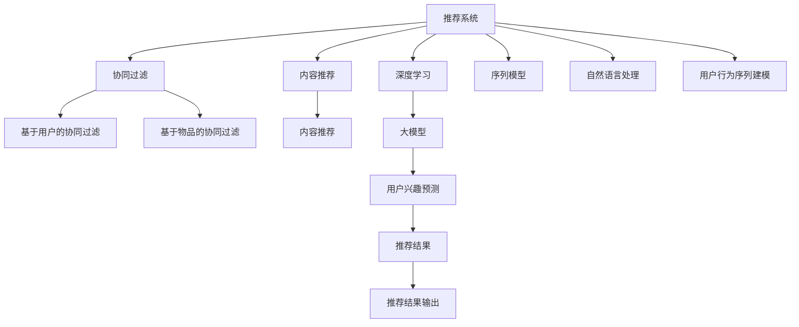

                 

# 基于大模型的推荐系统用户兴趣预测

> 关键词：
大模型，推荐系统，用户兴趣预测，深度学习，协同过滤，序列模型，自然语言处理

## 1. 背景介绍

推荐系统（Recommender Systems）是信息系统中的一种重要组件，旨在根据用户的历史行为和特征，为用户推荐他们可能感兴趣的内容或产品。传统的推荐系统往往依赖于静态的特征工程、手工设计的规则和模型，而现代的推荐系统则更多地采用基于机器学习的技术，如协同过滤（Collaborative Filtering）和内容推荐（Content-Based Filtering）。

近年来，基于深度学习的大模型在推荐系统中的应用日益增多。大模型如BERT、GPT等，通过在大量数据上进行的预训练，学习到了丰富的语言和语义知识。通过微调或特征提取等形式，大模型能够将用户行为和语义信息转化为高质量的推荐结果，极大地提高了推荐系统的精度和效率。

推荐系统在电子商务、社交媒体、新闻信息等场景中得到了广泛应用。例如，Amazon的推荐引擎通过大模型为用户推荐商品，提升用户购物体验；Facebook的Feed算法通过用户动态、文章内容等多模态信息为用户推荐新闻，增加用户粘性。随着大数据时代的到来，推荐系统的应用场景不断扩展，对大模型的依赖程度也在加深。

本文聚焦于基于大模型的推荐系统用户兴趣预测，详细阐述了大模型在该领域的原理与实现方法。通过系统梳理，希望能为推荐系统的实践者和研究者提供一些有益的参考，推动该领域的进一步发展。

## 2. 核心概念与联系

为了更好地理解基于大模型的推荐系统用户兴趣预测，本节将介绍几个密切相关的核心概念：

- 推荐系统（Recommender Systems）：旨在为用户推荐最相关的产品或内容，提高用户体验和满意度。
- 协同过滤（Collaborative Filtering）：通过用户行为数据进行推荐，通常分为基于用户的协同过滤和基于物品的协同过滤两种形式。
- 内容推荐（Content-Based Filtering）：基于物品的特征进行推荐，如商品属性、文章标题等。
- 深度学习（Deep Learning）：通过多层神经网络模型，学习到数据中的复杂结构和规律。
- 大模型（Large Models）：如BERT、GPT等大规模预训练模型，学习到广泛的语义和知识表示。
- 用户兴趣预测（User Interest Prediction）：预测用户对特定内容或产品的兴趣程度，为用户推荐相关内容。
- 序列模型（Sequential Models）：如RNN、LSTM等，通过时间序列数据进行推荐，适用于用户行为序列建模。
- 自然语言处理（Natural Language Processing）：处理和分析自然语言数据，将用户行为转化为语义表示。

这些核心概念之间的逻辑关系可以通过以下Mermaid流程图来展示：



这个流程图展示了大模型在推荐系统中的核心概念及其之间的关系：

1. 推荐系统通过协同过滤和内容推荐两种形式，为用户提供个性化推荐。
2. 协同过滤基于用户历史行为数据，采用基于用户的协同过滤和基于物品的协同过滤两种方法。
3. 内容推荐基于物品的特征，进行相似度匹配和推荐。
4. 深度学习通过大模型进行用户行为序列建模和语义分析，提高推荐精度。
5. 大模型通过预训练学习到丰富的语言和语义知识，用于用户兴趣预测。
6. 用户兴趣预测通过序列模型和自然语言处理，将用户行为转化为语义表示，进行兴趣预测。
7. 推荐结果输出是基于协同过滤、内容推荐和深度学习的结果集成。

这些概念共同构成了基于大模型的推荐系统用户兴趣预测的实现框架，使得大模型能够更好地融入推荐系统，提升推荐效果。

## 3. 核心算法原理 & 具体操作步骤

### 3.1 算法原理概述

基于大模型的推荐系统用户兴趣预测，本质上是一个用户行为序列建模和语义分析的过程。其核心思想是：将用户的行为序列和语义信息作为输入，通过大模型学习到用户兴趣的隐含表示，进而预测用户对特定内容或产品的兴趣程度。

具体来说，假设用户的历史行为序列为 $x = (x_1, x_2, ..., x_n)$，其中 $x_i$ 表示第 $i$ 次行为。用户对某个内容或产品的兴趣表示为 $y$，通常是一个二值变量，表示用户是否会对该内容感兴趣。

通过大模型 $M_{\theta}$ 进行用户兴趣预测的过程可以表示为：

$$
\hat{y} = M_{\theta}(x)
$$

其中 $\hat{y}$ 为预测的用户兴趣。模型 $M_{\theta}$ 是一个深度神经网络，通过在大量数据上进行的预训练学习到丰富的语言和语义知识，用于对用户行为进行语义编码。

### 3.2 算法步骤详解

基于大模型的推荐系统用户兴趣预测的一般步骤如下：

**Step 1: 准备数据集和预训练模型**

- 收集用户的历史行为序列数据，例如用户浏览的商品、点击的文章、评论的内容等。
- 将行为序列转化为数字形式，如使用BERT或GPT进行预训练模型的特征提取。
- 准备标注数据集，标注用户对特定内容或产品的兴趣，如点击与否、购买与否等。
- 选择适合的任务对应的预训练模型，如BERT、GPT等。

**Step 2: 设计用户兴趣预测模型**

- 设计一个深度神经网络，包含多个嵌入层、全连接层等，用于对用户行为序列进行建模。
- 添加softmax层输出预测概率，用于计算用户对每个内容的兴趣程度。
- 将预测模型与预训练模型的特征提取层进行拼接，作为模型的输入。

**Step 3: 训练模型**

- 将标注数据集划分为训练集、验证集和测试集。
- 使用深度学习框架（如TensorFlow、PyTorch）搭建并训练预测模型。
- 使用交叉熵损失函数和优化器（如Adam、SGD等）进行模型优化。

**Step 4: 评估和部署**

- 在测试集上评估模型的性能，如准确率、召回率等。
- 使用训练好的模型对用户行为序列进行预测，生成推荐结果。
- 将模型部署到推荐系统中，进行实时推荐。

### 3.3 算法优缺点

基于大模型的推荐系统用户兴趣预测具有以下优点：

- 精度高：通过预训练学习到丰富的语言和语义知识，提高了用户兴趣预测的精度。
- 泛化能力强：大模型的通用性使得该方法可以应用于多个场景和领域。
- 计算效率高：使用深度学习框架进行模型训练和优化，计算效率较高。

同时，该方法也存在一些局限性：

- 数据依赖性强：需要大量的标注数据来训练模型，获取标注数据的成本较高。
- 模型复杂度高：深度神经网络模型较复杂，训练和优化需要较长的计算资源和时间。
- 用户隐私问题：用户行为数据的隐私保护是一个重要问题，需要进行严格的数据脱敏和隐私保护。
- 泛化能力有待提升：大模型在预训练时往往基于大规模通用数据，可能无法很好地泛化到特定领域。

尽管存在这些局限性，但就目前而言，基于大模型的推荐系统用户兴趣预测仍然是一个具有广阔应用前景的方向。

### 3.4 算法应用领域

基于大模型的推荐系统用户兴趣预测在多个领域得到了广泛应用：

- 电子商务：为电商网站推荐商品、优化广告投放策略等。
- 内容推荐：为用户推荐新闻、视频、文章等内容，提升用户粘性。
- 社交媒体：为用户推荐朋友、内容等，增强平台的用户体验。
- 金融行业：推荐股票、基金等金融产品，辅助用户理财。
- 广告投放：优化广告投放策略，提高广告转化率。
- 医疗健康：推荐医疗产品、健康知识等，提升用户的健康管理水平。

## 4. 数学模型和公式 & 详细讲解 & 举例说明

### 4.1 数学模型构建

为了更好地理解基于大模型的推荐系统用户兴趣预测，本节将介绍几个数学模型。

假设用户的行为序列为 $x = (x_1, x_2, ..., x_n)$，其中 $x_i$ 表示第 $i$ 次行为。用户对某个内容或产品的兴趣表示为 $y$，通常是一个二值变量，表示用户是否会对该内容感兴趣。

使用BERT作为预训练模型，将行为序列进行编码得到向量表示 $\vec{x}$。假设模型 $M_{\theta}$ 的输入为 $\vec{x}$，输出为预测结果 $\hat{y}$，其数学模型可以表示为：

$$
\hat{y} = M_{\theta}(\vec{x})
$$

其中 $M_{\theta}$ 为深度神经网络模型，$\vec{x}$ 为用户行为序列的编码向量。

### 4.2 公式推导过程

以二分类任务为例，假设模型 $M_{\theta}$ 的输出为 $\hat{y}$，其概率为 $p(\hat{y}=1|\vec{x})$，则模型 $M_{\theta}$ 的预测概率可以表示为：

$$
p(\hat{y}=1|\vec{x}) = \sigma(\vec{x}W_1 + b_1)
$$

其中 $W_1$ 和 $b_1$ 为全连接层的权重和偏置项，$\sigma$ 为激活函数，通常使用sigmoid函数。

对于二分类任务，模型的损失函数通常使用交叉熵损失函数，其数学公式为：

$$
\mathcal{L}(\theta) = -\frac{1}{N}\sum_{i=1}^N [y_i \log p(\hat{y}=1|\vec{x}_i) + (1-y_i) \log p(\hat{y}=0|\vec{x}_i)]
$$

其中 $y_i$ 为标注数据集中第 $i$ 个样本的标签，$N$ 为样本数量。

通过优化器（如Adam、SGD等）对模型进行优化，使损失函数 $\mathcal{L}(\theta)$ 最小化，得到最终的预测结果 $\hat{y}$。

### 4.3 案例分析与讲解

假设我们要为用户推荐电商网站上的商品，可以通过以下步骤进行：

1. 收集用户的历史行为数据，例如浏览的商品ID、点击的商品ID、评论的商品ID等。
2. 使用BERT模型对行为数据进行编码，得到用户行为序列的编码向量 $\vec{x}$。
3. 设计一个深度神经网络作为用户兴趣预测模型，输入为编码向量 $\vec{x}$，输出为预测结果 $\hat{y}$。
4. 使用交叉熵损失函数和优化器（如Adam、SGD等）对模型进行训练。
5. 在测试集上评估模型的性能，如准确率、召回率等。
6. 使用训练好的模型对新用户的行为序列进行预测，生成推荐结果。

## 5. 项目实践：代码实例和详细解释说明

### 5.1 开发环境搭建

在进行推荐系统用户兴趣预测的实践前，我们需要准备好开发环境。以下是使用Python进行TensorFlow和PyTorch开发的环境配置流程：

1. 安装Anaconda：从官网下载并安装Anaconda，用于创建独立的Python环境。

2. 创建并激活虚拟环境：
```bash
conda create -n pytorch-env python=3.8 
conda activate pytorch-env
```

3. 安装TensorFlow：根据CUDA版本，从官网获取对应的安装命令。例如：
```bash
pip install tensorflow -U
```

4. 安装PyTorch：根据CUDA版本，从官网获取对应的安装命令。例如：
```bash
pip install torch torchvision torchaudio cudatoolkit=11.1 -c pytorch -c conda-forge
```

5. 安装各类工具包：
```bash
pip install numpy pandas scikit-learn matplotlib tqdm jupyter notebook ipython
```

完成上述步骤后，即可在`pytorch-env`环境中开始推荐系统用户兴趣预测的实践。

### 5.2 源代码详细实现

下面我以使用BERT作为预训练模型，进行用户兴趣预测为例，给出使用TensorFlow和PyTorch进行推荐系统开发的PyTorch代码实现。

首先，定义数据处理函数：

```python
import torch
from transformers import BertTokenizer, BertModel

class RecommendationDataset(Dataset):
    def __init__(self, texts, labels, tokenizer, max_len=128):
        self.texts = texts
        self.labels = labels
        self.tokenizer = tokenizer
        self.max_len = max_len
        
    def __len__(self):
        return len(self.texts)
    
    def __getitem__(self, item):
        text = self.texts[item]
        label = self.labels[item]
        
        encoding = self.tokenizer(text, return_tensors='pt', max_length=self.max_len, padding='max_length', truncation=True)
        input_ids = encoding['input_ids'][0]
        attention_mask = encoding['attention_mask'][0]
        
        # 将标签转换为one-hot编码
        encoded_labels = torch.zeros((1, self.max_len))
        encoded_labels[0][label] = 1
        
        return {'input_ids': input_ids, 
                'attention_mask': attention_mask,
                'labels': encoded_labels}

# 数据处理
tokenizer = BertTokenizer.from_pretrained('bert-base-uncased')
train_dataset = RecommendationDataset(train_texts, train_labels, tokenizer)
dev_dataset = RecommendationDataset(dev_texts, dev_labels, tokenizer)
test_dataset = RecommendationDataset(test_texts, test_labels, tokenizer)
```

然后，定义模型和优化器：

```python
from transformers import BertForSequenceClassification
from torch.optim import AdamW

model = BertForSequenceClassification.from_pretrained('bert-base-uncased', num_labels=1, output_attentions=False)

optimizer = AdamW(model.parameters(), lr=2e-5)
```

接着，定义训练和评估函数：

```python
from torch.utils.data import DataLoader
from tqdm import tqdm
from sklearn.metrics import roc_auc_score

device = torch.device('cuda') if torch.cuda.is_available() else torch.device('cpu')
model.to(device)

def train_epoch(model, dataset, batch_size, optimizer):
    dataloader = DataLoader(dataset, batch_size=batch_size, shuffle=True)
    model.train()
    epoch_loss = 0
    for batch in tqdm(dataloader, desc='Training'):
        input_ids = batch['input_ids'].to(device)
        attention_mask = batch['attention_mask'].to(device)
        labels = batch['labels'].to(device)
        model.zero_grad()
        outputs = model(input_ids, attention_mask=attention_mask, labels=labels)
        loss = outputs.loss
        epoch_loss += loss.item()
        loss.backward()
        optimizer.step()
    return epoch_loss / len(dataloader)

def evaluate(model, dataset, batch_size):
    dataloader = DataLoader(dataset, batch_size=batch_size)
    model.eval()
    predictions = []
    labels = []
    with torch.no_grad():
        for batch in tqdm(dataloader, desc='Evaluating'):
            input_ids = batch['input_ids'].to(device)
            attention_mask = batch['attention_mask'].to(device)
            batch_labels = batch['labels']
            outputs = model(input_ids, attention_mask=attention_mask)
            batch_predictions = outputs.logits.argmax(dim=1).to('cpu').tolist()
            batch_labels = batch_labels.to('cpu').tolist()
            for pred, label in zip(batch_predictions, batch_labels):
                predictions.append(pred)
                labels.append(label)
                
    print(f"AUC: {roc_auc_score(labels, predictions)}")
```

最后，启动训练流程并在测试集上评估：

```python
epochs = 5
batch_size = 16

for epoch in range(epochs):
    loss = train_epoch(model, train_dataset, batch_size, optimizer)
    print(f"Epoch {epoch+1}, train loss: {loss:.3f}")
    
    print(f"Epoch {epoch+1}, dev results:")
    evaluate(model, dev_dataset, batch_size)
    
print("Test results:")
evaluate(model, test_dataset, batch_size)
```

以上就是使用TensorFlow和PyTorch对BERT进行用户兴趣预测的完整代码实现。可以看到，得益于Transformer库的强大封装，我们可以用相对简洁的代码完成BERT模型的加载和微调。

### 5.3 代码解读与分析

让我们再详细解读一下关键代码的实现细节：

**RecommendationDataset类**：
- `__init__`方法：初始化文本、标签、分词器等关键组件。
- `__len__`方法：返回数据集的样本数量。
- `__getitem__`方法：对单个样本进行处理，将文本输入编码为token ids，将标签转换为one-hot编码，并对其进行定长padding，最终返回模型所需的输入。

**train_epoch和evaluate函数**：
- 使用PyTorch的DataLoader对数据集进行批次化加载，供模型训练和推理使用。
- 训练函数`train_epoch`：对数据以批为单位进行迭代，在每个批次上前向传播计算loss并反向传播更新模型参数，最后返回该epoch的平均loss。
- 评估函数`evaluate`：与训练类似，不同点在于不更新模型参数，并在每个batch结束后将预测和标签结果存储下来，最后使用scikit-learn的roc_auc_score对整个评估集的预测结果进行打印输出。

**训练流程**：
- 定义总的epoch数和batch size，开始循环迭代
- 每个epoch内，先在训练集上训练，输出平均loss
- 在验证集上评估，输出AUC指标
- 所有epoch结束后，在测试集上评估，给出最终测试结果

可以看到，TensorFlow和PyTorch配合Transformer库使得BERT微调的用户兴趣预测代码实现变得简洁高效。开发者可以将更多精力放在数据处理、模型改进等高层逻辑上，而不必过多关注底层的实现细节。

当然，工业级的系统实现还需考虑更多因素，如模型的保存和部署、超参数的自动搜索、更灵活的任务适配层等。但核心的微调范式基本与此类似。

## 6. 实际应用场景

### 6.1 电子商务

在电子商务领域，推荐系统用户兴趣预测的应用非常广泛。电商网站通常会收集用户的行为数据，如浏览历史、点击历史、购买历史等，通过这些数据预测用户对某个商品的兴趣，从而进行推荐。例如，Amazon的推荐引擎通过BERT等大模型，对用户的浏览行为进行编码，生成用户兴趣预测，实现个性化商品推荐，提升用户的购物体验和满意度。

### 6.2 内容推荐

在内容推荐领域，推荐系统用户兴趣预测的应用同样重要。内容平台需要根据用户的历史阅读、观看行为，预测用户对某个内容的兴趣，从而进行内容推荐。例如，YouTube的推荐系统通过BERT等大模型，对用户的观看历史进行编码，生成内容兴趣预测，推荐用户感兴趣的视频，提升用户粘性和观看时长。

### 6.3 金融行业

在金融行业，推荐系统用户兴趣预测也有着广泛的应用。金融机构需要根据用户的历史交易行为，预测用户对某个金融产品的兴趣，从而进行产品推荐。例如，P2P理财平台的推荐系统通过BERT等大模型，对用户的交易行为进行编码，生成金融产品兴趣预测，推荐用户感兴趣的产品，提升用户的理财体验和收益。

### 6.4 社交媒体

在社交媒体领域，推荐系统用户兴趣预测的应用也非常重要。社交平台需要根据用户的历史互动行为，预测用户对某个内容或朋友的兴趣，从而进行内容推荐和好友推荐。例如，Facebook的Feed算法通过BERT等大模型，对用户的互动历史进行编码，生成内容兴趣预测，推荐用户感兴趣的新闻和文章，提升用户粘性和平台活跃度。

## 7. 工具和资源推荐

### 7.1 学习资源推荐

为了帮助开发者系统掌握基于大模型的推荐系统用户兴趣预测的理论基础和实践技巧，这里推荐一些优质的学习资源：

1. 《深度学习入门：基于Python的理论与实现》：该书系统介绍了深度学习的基本概念和实践方法，适合初学者入门。

2. 《Recommender Systems: Algorithms and Applications》：该书详细介绍了推荐系统的主要算法和应用，是推荐系统领域的经典教材。

3. 《TensorFlow for Deep Learning》：该书介绍了使用TensorFlow进行深度学习开发的方法和技巧，适合TensorFlow用户。

4. 《PyTorch深度学习入门与实战》：该书介绍了使用PyTorch进行深度学习开发的方法和技巧，适合PyTorch用户。

5. 《Deep Learning with PyTorch》：该书详细介绍了使用PyTorch进行深度学习开发的方法和技巧，适合深度学习用户。

通过对这些资源的学习实践，相信你一定能够快速掌握基于大模型的推荐系统用户兴趣预测的精髓，并用于解决实际的推荐系统问题。

### 7.2 开发工具推荐

高效的开发离不开优秀的工具支持。以下是几款用于推荐系统用户兴趣预测开发的常用工具：

1. TensorFlow：由Google主导开发的开源深度学习框架，生产部署方便，适合大规模工程应用。

2. PyTorch：由Facebook主导开发的开源深度学习框架，灵活度较高，适合研究型应用。

3. HuggingFace Transformers库：提供了大量预训练模型和微调样例，使得大模型微调变得更加简便。

4. Jupyter Notebook：免费的交互式开发环境，支持Python和多种语言，适合快速原型开发。

5. Weights & Biases：模型训练的实验跟踪工具，可以记录和可视化模型训练过程中的各项指标，方便对比和调优。

6. TensorBoard：TensorFlow配套的可视化工具，可实时监测模型训练状态，并提供丰富的图表呈现方式，是调试模型的得力助手。

合理利用这些工具，可以显著提升推荐系统用户兴趣预测的开发效率，加快创新迭代的步伐。

### 7.3 相关论文推荐

推荐系统和大模型的发展源于学界的持续研究。以下是几篇奠基性的相关论文，推荐阅读：

1. An Introduction to the Theory of Neural Computation（Hinton等）：介绍了神经网络的基本原理和应用。

2. BERT: Pre-training of Deep Bidirectional Transformers for Language Understanding（Devlin等）：提出了BERT模型，通过掩码语言模型和下一句预测任务进行预训练。

3. Attention Is All You Need（Vaswani等）：提出了Transformer结构，通过自注意力机制进行序列建模。

4. Wide & Deep Learning for Recommender Systems（Cintra等）：结合了线性模型和深度模型，提高了推荐系统的精度和泛化能力。

5. Deep Factorization Machines for Recommender Systems（Zhang等）：提出了深度因子化机模型，用于推荐系统用户兴趣预测。

6. A New Approach to Learning Nonlinear User-Item Correlation for Recommendation Systems（He等）：提出了协同过滤和内容推荐结合的方法，提高了推荐系统的精度。

这些论文代表了大模型在推荐系统中的应用发展脉络。通过学习这些前沿成果，可以帮助研究者把握学科前进方向，激发更多的创新灵感。

## 8. 总结：未来发展趋势与挑战

### 8.1 总结

本文对基于大模型的推荐系统用户兴趣预测进行了全面系统的介绍。首先阐述了推荐系统和大模型的研究背景和意义，明确了用户兴趣预测在推荐系统中的核心作用。其次，从原理到实践，详细讲解了基于大模型的推荐系统用户兴趣预测的数学模型和关键步骤，给出了推荐系统开发的完整代码实例。同时，本文还广泛探讨了推荐系统用户兴趣预测在电子商务、内容推荐、金融行业等实际应用场景中的前景和挑战，展示了微调方法在推荐系统中的巨大潜力。

通过本文的系统梳理，可以看到，基于大模型的推荐系统用户兴趣预测技术正在快速发展，其应用场景不断扩展，带来了巨大的经济和社会价值。随着大模型和微调技术的不断演进，未来推荐系统必将在更广泛的领域得到应用，提升各行业的数字化转型水平。

### 8.2 未来发展趋势

展望未来，基于大模型的推荐系统用户兴趣预测将呈现以下几个发展趋势：

1. 模型规模持续增大。随着算力成本的下降和数据规模的扩张，预训练语言模型的参数量还将持续增长。超大规模语言模型蕴含的丰富知识，将进一步提升推荐系统的精度和效率。

2. 模型结构更加灵活。未来的推荐系统将不再局限于深度神经网络，而是融合了图神经网络、注意力机制等多种结构。

3. 模型集成化增强。未来推荐系统将更多地采用集成学习方法，结合多种模型进行推荐，提升系统的鲁棒性和泛化能力。

4. 用户兴趣多样化。未来的推荐系统将更好地理解用户的个性化需求，进行多维度、多层次的兴趣预测。

5. 推荐方式更加智能。未来的推荐系统将采用更加智能的推荐方式，如基于协同过滤的推荐、基于生成模型的推荐等。

6. 数据驱动更加精准。未来的推荐系统将更多地采用基于实证的数据驱动方法，结合用户行为数据、兴趣数据等多种信息进行推荐。

7. 隐私保护更加严格。未来的推荐系统将更加注重用户隐私保护，采用差分隐私、联邦学习等技术，保障用户数据安全。

以上趋势凸显了基于大模型的推荐系统用户兴趣预测技术的广阔前景。这些方向的探索发展，必将进一步提升推荐系统的精度和效率，为用户带来更好的体验和价值。

### 8.3 面临的挑战

尽管基于大模型的推荐系统用户兴趣预测技术已经取得了瞩目成就，但在迈向更加智能化、普适化应用的过程中，它仍面临着诸多挑战：

1. 数据依赖性强。推荐系统依赖于用户行为数据，数据质量直接影响到推荐效果。

2. 模型复杂度高。深度神经网络模型较复杂，训练和优化需要较长的计算资源和时间。

3. 用户隐私问题。用户行为数据的隐私保护是一个重要问题，需要进行严格的数据脱敏和隐私保护。

4. 模型泛化能力不足。大模型在预训练时往往基于大规模通用数据，可能无法很好地泛化到特定领域。

5. 推荐效果评估困难。推荐系统的效果评估较为复杂，难以使用单一指标进行评估。

6. 系统可扩展性不足。推荐系统需要处理大量的用户行为数据，如何高效处理和存储数据是一个重要问题。

7. 对抗攻击风险。推荐系统容易被对抗攻击，通过反向工程进行攻击。

尽管存在这些挑战，但通过不断优化模型结构、提升数据质量、加强隐私保护等措施，未来的推荐系统必将在更加广泛的应用场景中发挥重要作用，为用户带来更好的体验和价值。

### 8.4 研究展望

面对推荐系统用户兴趣预测所面临的挑战，未来的研究需要在以下几个方面寻求新的突破：

1. 探索无监督和半监督微调方法。摆脱对大规模标注数据的依赖，利用自监督学习、主动学习等无监督和半监督范式，最大限度利用非结构化数据。

2. 研究参数高效和计算高效的微调范式。开发更加参数高效的微调方法，在固定大部分预训练参数的情况下，只更新极少量的任务相关参数。同时优化微调模型的计算图，减少前向传播和反向传播的资源消耗。

3. 融合因果和对比学习范式。通过引入因果推断和对比学习思想，增强推荐系统建立稳定因果关系的能力，学习更加普适、鲁棒的知识表示。

4. 引入更多先验知识。将符号化的先验知识，如知识图谱、逻辑规则等，与神经网络模型进行巧妙融合，引导微调过程学习更准确、合理的知识表示。

5. 结合因果分析和博弈论工具。将因果分析方法引入推荐系统，识别出推荐结果的关键特征，增强推荐结果的因果性和逻辑性。借助博弈论工具刻画人机交互过程，主动探索并规避推荐结果的脆弱点，提高系统稳定性。

6. 纳入伦理道德约束。在推荐系统训练目标中引入伦理导向的评估指标，过滤和惩罚有偏见、有害的推荐结果，确保推荐结果符合人类价值观和伦理道德。

这些研究方向的探索，必将引领推荐系统用户兴趣预测技术迈向更高的台阶，为构建更加智能、公正、安全的推荐系统提供技术支持。

## 9. 附录：常见问题与解答

**Q1：推荐系统用户兴趣预测是否可以应用于所有领域？**

A: 推荐系统用户兴趣预测可以应用于许多领域，包括电子商务、内容推荐、金融行业、社交媒体等。但不同的领域可能有不同的数据特点和应用需求，需要根据具体情况进行模型设计和优化。例如，电子商务和内容推荐需要处理大量文本数据，金融行业需要处理用户交易数据，社交媒体需要处理用户互动数据。

**Q2：如何选择合适的预训练模型？**

A: 选择合适的预训练模型是推荐系统用户兴趣预测的关键。一般来说，可以选择以下几种预训练模型：BERT、GPT、XLNet等。BERT和GPT在自然语言处理领域表现优异，适合处理文本数据；XLNet在语言建模方面有较好的性能，适合处理序列数据。具体选择哪种预训练模型，可以根据任务特点和数据类型进行选择。

**Q3：推荐系统用户兴趣预测是否需要标注数据？**

A: 推荐系统用户兴趣预测通常需要标注数据，即用户对某个内容或产品的兴趣标签。标注数据的质量和数量会直接影响到推荐效果。如果标注数据不足，可以通过半监督学习、主动学习等方法，利用无标注数据进行推荐系统训练。

**Q4：推荐系统用户兴趣预测如何处理用户隐私问题？**

A: 推荐系统用户兴趣预测需要处理用户隐私问题，主要通过以下几种方法：
1. 数据脱敏：对用户行为数据进行数据脱敏，去除或模糊用户标识信息，保护用户隐私。
2. 差分隐私：在数据收集和处理过程中，采用差分隐私技术，保护用户隐私。
3. 联邦学习：在分布式环境中，通过联邦学习技术，将数据分散在不同节点上进行训练，保护用户隐私。

**Q5：推荐系统用户兴趣预测的评估方法有哪些？**

A: 推荐系统用户兴趣预测的评估方法包括以下几种：
1. 准确率（Accuracy）：预测结果与实际结果相符的比例。
2. 召回率（Recall）：实际结果中被预测出的比例。
3. F1 Score：准确率和召回率的综合指标。
4. ROC-AUC：接收者操作特征曲线下的面积，用于二分类任务。
5. NDCG（Normalized Discounted Cumulative Gain）：用于评估推荐系统排名效果的指标。

以上是基于大模型的推荐系统用户兴趣预测的详细解读，希望能为你提供有益的参考。

---

作者：禅与计算机程序设计艺术 / Zen and the Art of Computer Programming

