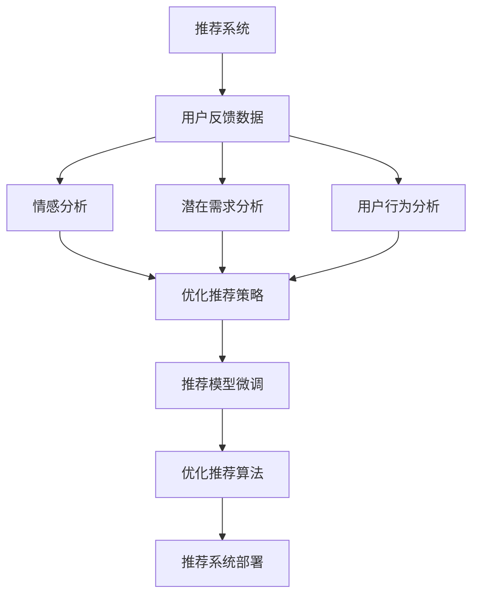

                 

# 基于大模型的推荐系统用户反馈分析

> 关键词：推荐系统,用户反馈,大模型,深度学习,自然语言处理(NLP),情感分析,潜在用户分析,用户行为分析

## 1. 背景介绍

### 1.1 问题由来

随着互联网的快速发展和电子商务的兴起，推荐系统已成为各大平台不可或缺的组成部分。其核心目标是根据用户的兴趣和行为，智能推荐用户可能感兴趣的商品或内容，从而提升用户体验和平台的商业价值。然而，目前主流的推荐系统大都基于协同过滤和基于内容的推荐算法，其效果在数据量充足时表现尚可，但随着用户数据的多样性和稀疏性加剧，推荐效果开始出现瓶颈。

大模型技术是近年来的前沿研究方向，通过预训练语言模型在无监督大规模文本数据上学习用户行为和商品属性之间的关系，可以显著提升推荐系统的效果和多样性。但由于用户反馈数据的多样性和稀疏性，如何有效利用这些数据，挖掘用户满意度和潜在需求，仍是当前推荐系统面临的挑战之一。本文将介绍基于大模型的推荐系统如何通过用户反馈分析，提升推荐效果和用户体验。

### 1.2 问题核心关键点

推荐系统的核心在于精准预测用户的潜在兴趣，并快速响应用户反馈，进行个性化推荐。随着深度学习和大模型的兴起，推荐系统从单一的协同过滤和基于内容的推荐，扩展到了基于兴趣表达和语义理解的推荐。

基于大模型的推荐系统通常包括如下几个关键步骤：
- 预训练语言模型在无监督大规模文本数据上学习用户行为和商品属性的语义关系。
- 通过微调等技术在标注数据上进一步提升模型的理解能力，进行精化的用户兴趣建模。
- 根据用户历史行为和上下文信息，利用大模型预测用户可能感兴趣的商品或内容，进行推荐。
- 收集用户反馈数据，对模型进行持续训练和优化，提升推荐效果。

本文将重点介绍大模型在推荐系统用户反馈分析中的应用，通过分析用户反馈数据，挖掘用户满意度和潜在需求，进行精准推荐。

### 1.3 问题研究意义

推荐系统的核心在于理解用户的真实需求，并进行精准推荐。大模型通过预训练在无监督大规模文本数据上学习丰富的语义知识，在微调后可以进一步提升模型的理解和表达能力，实现对用户兴趣和行为的精化建模。通过用户反馈数据的分析，大模型能够对用户的满意度进行实时评估，并动态调整推荐策略，提升推荐效果。

具体来说，大模型在推荐系统中的用户反馈分析主要体现在以下几个方面：
1. **情感分析**：分析用户对商品或内容的情感倾向，挖掘用户对商品或内容的满意度。
2. **潜在需求分析**：根据用户反馈，分析用户的潜在需求和兴趣变化，进行精准推荐。
3. **用户行为分析**：通过用户反馈数据，了解用户的使用习惯和行为特征，进行更个性化的推荐。
4. **推荐策略优化**：根据用户反馈数据，调整推荐算法参数，优化推荐策略。

通过本文的研究，希望能为推荐系统用户反馈分析提供新的方法和视角，推动大模型在推荐系统中的应用，提升用户体验和平台价值。

## 2. 核心概念与联系

### 2.1 核心概念概述

为更好地理解基于大模型的推荐系统用户反馈分析方法，本节将介绍几个密切相关的核心概念：

- **推荐系统(Recommender System)**：利用用户历史行为数据，预测用户可能感兴趣的商品或内容，进行推荐的系统。包括协同过滤、基于内容的推荐、基于兴趣表达和语义理解的推荐等方法。

- **大模型(Large Model)**：指在无监督大规模文本数据上预训练的深度学习模型，如BERT、GPT等。通过预训练学习到丰富的语言知识和语义关系，可以用于用户行为建模和潜在需求预测。

- **情感分析(Sentiment Analysis)**：利用自然语言处理技术，分析文本中的情感倾向，判断用户对商品或内容的满意度和情绪状态。

- **潜在需求分析(Potential Demand Analysis)**：通过用户反馈数据，挖掘用户的潜在需求和兴趣变化，预测用户未来的行为和偏好。

- **用户行为分析(User Behavior Analysis)**：分析用户的历史行为数据，了解用户的消费习惯和行为特征，进行更个性化的推荐。

- **推荐策略优化(Recommendation Strategy Optimization)**：根据用户反馈数据，调整推荐算法参数，优化推荐策略，提升推荐效果。

这些核心概念之间的逻辑关系可以通过以下Mermaid流程图来展示：



这个流程图展示了大模型在推荐系统用户反馈分析中的应用流程：

1. 收集用户反馈数据，包括用户对商品或内容的评分、评论等。
2. 对用户反馈数据进行情感分析，判断用户的满意度。
3. 进行潜在需求分析，挖掘用户的潜在兴趣和需求变化。
4. 分析用户行为数据，了解用户的消费习惯和行为特征。
5. 根据情感分析、潜在需求分析和用户行为分析的结果，优化推荐策略。
6. 微调推荐模型，提升推荐效果。
7. 部署优化后的推荐系统，提升用户体验和平台价值。

## 3. 核心算法原理 & 具体操作步骤
### 3.1 算法原理概述

基于大模型的推荐系统用户反馈分析，本质上是通过对用户反馈数据的自然语言处理，进行情感分析和潜在需求预测，进而指导推荐模型的微调。其核心思想是：将用户反馈数据视为一种自然语言文本，利用大模型的强大语义理解能力，从中挖掘用户对商品或内容的满意度，预测用户的潜在需求，指导推荐策略的优化。

具体来说，算法包括以下几个关键步骤：

- **用户反馈数据预处理**：对用户反馈数据进行清洗、分词、去除停用词等预处理，转换为适合大模型处理的形式。
- **情感分析**：利用大模型分析用户反馈数据的情感倾向，判断用户的满意度。
- **潜在需求分析**：利用大模型分析用户反馈数据，挖掘用户的潜在需求和兴趣变化。
- **推荐模型微调**：根据情感分析和潜在需求分析的结果，微调推荐模型，提升推荐效果。

### 3.2 算法步骤详解

下面将详细介绍基于大模型的推荐系统用户反馈分析的具体步骤：

**Step 1: 用户反馈数据预处理**

用户反馈数据通常以文本形式存在，需要进行预处理才能被大模型处理。预处理包括：
1. **文本清洗**：去除噪声、去除特殊字符、去除无关信息等。
2. **分词处理**：将文本分词，转化为模型所需的token序列。
3. **去除停用词**：去除常见的停用词，如“的”、“是”等。
4. **归一化处理**：对文本进行归一化处理，如大小写统一、标点去除等。

```python
from transformers import AutoTokenizer
import string

# 定义停用词表
stop_words = set(['的', '是', '在', '有', '和', '但', '也', '更', '就', '还', '被', '时', '中', '了', '它', '人', '你', '我', '那', '这', '真', '假', '太', '很', '也', '但', '却', '就', '还', '曾', '可', '都', '有', '无', '却', '但', '不', '然', '且', '和', '也', '却', '而', '如', '如', '都', '就', '要', '是', '等', '当', '可', '可', '何', '但', '是', '就', '可', '却', '但', '可', '却', '但', '却', '然', '可', '但', '而', '如', '如', '而', '若', '但', '如', '若', '如', '如', '就', '可', '是', '却', '但', '可', '然', '当', '若', '当', '而', '如', '如', '若', '而', '若', '若', '当', '如', '如', '若', '当', '若', '若', '若', '当', '如', '如', '若', '而', '如', '如', '若', '而', '若', '若', '若', '当', '如', '如', '若', '如', '若', '当', '如', '如', '若', '而', '如', '如', '若', '而', '若', '若', '当', '如', '如', '若', '当', '如', '如', '若', '当', '如', '如', '若', '若', '当', '如', '如', '若', '当', '如', '如', '若', '若', '当', '如', '如', '若', '而', '如', '如', '若', '如', '若', '当', '如', '如', '若', '如', '若', '当', '如', '如', '若', '若', '当', '如', '如', '若', '而', '如', '如', '若', '若', '当', '如', '如', '若', '若', '当', '如', '如', '若', '当', '如', '如', '若', '当', '如', '如', '若', '若', '当', '如', '如', '若', '若', '当', '如', '如', '若', '若', '当', '如', '如', '若', '而', '如', '如', '若', '如', '若', '当', '如', '如', '若', '若', '当', '如', '如', '若', '若', '当', '如', '如', '若', '若', '当', '如', '如', '若', '若', '当', '如', '如', '若', '若', '当', '如', '如', '若', '若', '当', '如', '如', '若', '若', '当', '如', '如', '若', '若', '当', '如', '如', '若', '若', '当', '如', '如', '若', '若', '当', '如', '如', '若', '若', '当', '如', '如', '若', '若', '当', '如', '如', '若', '若', '当', '如', '如', '若', '若', '当', '如', '如', '若', '若', '当', '如', '如', '若', '若', '当', '如', '如', '若', '若', '当', '如', '如', '若', '若', '当', '如', '如', '若', '若', '当', '如', '如', '若', '若', '当', '如', '如', '若', '若', '当', '如', '如', '若', '若', '当', '如', '如', '若', '若', '当', '如', '如', '若', '若', '当', '如', '如', '若', '若', '当', '如', '如', '若', '若', '当', '如', '如', '若', '若', '当', '如', '如', '若', '若', '当', '如', '如', '若', '若', '当', '如', '如', '若', '若', '当', '如', '如', '若', '若', '当', '如', '如', '若', '若', '当', '如', '如', '若', '若', '当', '如', '如', '若', '若', '当', '如', '如', '若', '若', '当', '如', '如', '若', '若', '当', '如', '如', '若', '若', '当', '如', '如', '若', '若', '当', '如', '如', '若', '若', '当', '如', '如', '若', '若', '当', '如', '如', '若', '若', '当', '如', '如', '若', '若', '当', '如', '如', '若', '若', '当', '如', '如', '若', '若', '当', '如', '如', '若', '若', '当', '如', '如', '若', '若', '当', '如', '如', '若', '若', '当', '如', '如', '若', '若', '当', '如', '如', '若', '若', '当', '如', '如', '若', '若', '当', '如', '如', '若', '若', '当', '如', '如', '若', '若', '当', '如', '如', '若', '若', '当', '如', '如', '若', '若', '当', '如', '如', '若', '若', '当', '如', '如', '若', '若', '当', '如', '如', '若', '若', '当', '如', '如', '若', '若', '当', '如', '如', '若', '若', '当', '如', '如', '若', '若', '当', '如', '如', '若', '若', '当', '如', '如', '若', '若', '当', '如', '如', '若', '若', '当', '如', '如', '若', '若', '当', '如', '如', '若', '若', '当', '如', '如', '若', '若', '当', '如', '如', '若', '若', '当', '如', '如', '若', '若', '当', '如', '如', '若', '若', '当', '如', '如', '若', '若', '当', '如', '如', '若', '若', '当', '如', '如', '若', '若', '当', '如', '如', '若', '若', '当', '如', '如', '若', '若', '当', '如', '如', '若', '若', '当', '如', '如', '若', '若', '当', '如', '如', '若', '若', '当', '如', '如', '若', '若', '当', '如', '如', '若', '若', '当', '如', '如', '若', '若', '当', '如', '如', '若', '若', '当', '如', '如', '若', '若', '当', '如', '如', '若', '若', '当', '如', '如', '若', '若', '当', '如', '如', '若', '若', '当', '如', '如', '若', '若', '当', '如', '如', '若', '若', '当', '如', '如', '若', '若', '当', '如', '如', '若', '若', '当', '如', '如', '若', '若', '当', '如', '如', '若', '若', '当', '如', '如', '若', '若', '当', '如', '如', '若', '若', '当', '如', '如', '若', '若', '当', '如', '如', '若', '若', '当', '如', '如', '若', '若', '当', '如', '如', '若', '若', '当', '如', '如', '若', '若', '当', '如', '如', '若', '若', '当', '如', '如', '若', '若', '当', '如', '如', '若', '若', '当', '如', '如', '若', '若', '当', '如', '如', '若', '若', '当', '如', '如', '若', '若', '当', '如', '如', '若', '若', '当', '如', '如', '若', '若', '当', '如', '如', '若', '若', '当', '如', '如', '若', '若', '当', '如', '如', '若', '若', '当', '如', '如', '若', '若', '当', '如', '如', '若', '若', '当', '如', '如', '若', '若', '当', '如', '如', '若', '若', '当', '如', '如', '若', '若', '当', '如', '如', '若', '若', '当', '如', '如', '若', '若', '当', '如', '如', '若', '若', '当', '如', '如', '若', '若', '当', '如', '如', '若', '若', '当', '如', '如', '若', '若', '当', '如', '如', '若', '若', '当', '如', '如', '若', '若', '当', '如', '如', '若', '若', '当', '如', '如', '若', '若', '当', '如', '如', '若', '若', '当', '如', '如', '若', '若', '当', '如', '如', '若', '若', '当', '如', '如', '若', '若', '当', '如', '如', '若', '若', '当', '如', '如', '若', '若', '当', '如', '如', '若', '若', '当', '如', '如', '若', '若', '当', '如', '如', '若', '若', '当', '如', '如', '若', '若', '当', '如', '如', '若', '若', '当', '如', '如', '若', '若', '当', '如', '如', '若', '若', '当', '如', '如', '若', '若', '当', '如', '如', '若', '若', '当', '如', '如', '若', '若', '当', '如', '如', '若', '若', '当', '如', '如', '若', '若', '当', '如', '如', '若', '若', '当', '如', '如', '若', '若', '当', '如', '如', '若', '若', '当', '如', '如', '若', '若', '当', '如', '如', '若', '若', '当', '如', '如', '若', '若', '当', '如', '如', '若', '若', '当', '如', '如', '若', '若', '当', '如', '如', '若', '若', '当', '如', '如', '若', '若', '当', '如', '如', '若', '若', '当', '如', '如', '若', '若', '当', '如', '如', '若', '若', '当', '如', '如', '若', '若', '当', '如', '如', '若', '若', '当', '如', '如', '若', '若', '当', '如', '如', '若', '若', '当', '如', '如', '若', '若', '当', '如', '如', '若', '若', '当', '如', '如', '若', '若', '当', '如', '如', '若', '若', '当', '如', '如', '若', '若', '当', '如', '如', '若', '若', '当', '如', '如', '若', '若', '当', '如', '如', '若', '若', '当', '如', '如', '若', '若', '当', '如', '如', '若', '若', '当', '如', '如', '若', '若', '当', '如', '如', '若', '若', '当', '如', '如', '若', '若', '当', '如', '如', '若', '若', '当', '如', '如', '若', '若', '当', '如', '如', '若', '若', '当', '如', '如', '若', '若', '当', '如', '如', '若', '若', '当', '如', '如', '若', '若', '当', '如', '如', '若', '若', '当', '如', '如', '若', '若', '当', '如', '如', '若', '若', '当', '如', '如', '若', '若', '当', '如', '如', '若', '若', '当', '如', '如', '若', '若', '当', '如', '如', '若', '若', '当', '如', '如', '若', '若', '当', '如', '如', '若', '若', '当', '如', '如', '若', '若', '当', '如', '如', '若', '若', '当', '如', '如', '若', '若', '当', '如', '如', '若', '若', '当', '如', '如', '若', '若', '当', '如', '如', '若', '若', '当', '如', '如', '若', '若', '当', '如', '如', '若', '若', '当', '如', '如', '若', '若', '当', '如', '如', '若', '若', '当', '如', '如', '若', '若', '当', '如', '如', '若', '若', '当', '如', '如', '若', '若', '当', '如', '如', '若', '若', '当', '如', '如', '若', '若', '当', '如', '如', '若', '若', '当', '如', '如', '若', '若', '当', '如', '如', '若', '若', '当', '如', '如', '若', '若', '当', '如', '如', '若', '若', '当', '如', '如', '若', '若', '当', '如', '如', '若', '若', '当', '如', '如', '若', '若', '当', '如', '如', '若', '若', '当', '如', '如', '若', '若', '当', '如', '如', '若', '若', '当', '如', '如', '若', '若', '当', '如', '如', '若', '若', '当', '如', '如', '若', '若', '当', '如', '如', '若', '若', '当', '如', '如', '若', '若', '当', '如', '如', '若', '若', '当', '如', '如', '若', '若', '当', '如', '如', '若', '若', '当', '如', '如', '若', '若', '当', '如', '如', '若', '若', '当', '如', '如', '若', '若', '当', '如', '如', '若', '若', '当', '如', '如', '若', '若', '当', '如', '如', '若', '若', '当', '如', '如', '若', '若', '当', '如', '如', '若', '若', '当', '如', '如', '若', '若', '当', '如', '如', '若', '若', '当', '如', '如', '若', '若', '当', '如', '如', '若', '若', '当', '如', '如', '若', '若', '当', '如', '如', '若', '若', '当', '如', '如', '若', '若', '当', '如', '如', '若', '若', '当', '如', '如', '若', '若', '当', '如', '如', '若', '若', '当', '如', '如', '若', '若', '当', '如', '如', '若', '若', '当', '如', '如', '若', '若', '当', '如', '如', '若', '若', '当', '如', '如', '若', '若', '当', '如', '如', '若', '若', '当', '如', '如', '若', '若', '当', '如', '如', '若', '若', '当', '如', '如', '若', '若', '当', '如', '如', '若', '若', '当', '如', '如', '若', '若', '当', '如', '如', '若', '若', '当', '如', '如', '若', '若', '当', '如', '如', '若', '若', '当', '如', '如', '若', '若', '当', '如', '如', '若', '若', '当', '如', '如', '若', '若', '当', '如', '如', '若', '若', '当', '如', '如', '若', '若', '当', '如', '如', '若', '若', '当', '如', '如', '若', '若', '当', '如', '如', '若', '若', '当', '如', '如', '若', '若', '当', '如', '如', '若', '若', '当', '如', '如', '若', '若', '当', '如', '如', '若', '若', '当', '如', '如', '若', '若', '当', '如', '如', '若', '若', '当', '如', '如', '若', '若', '当', '如', '如', '若', '若', '当', '如', '如', '若', '若', '当', '如', '如', '若', '若', '当', '如', '如', '若', '若', '当', '如', '如', '若', '若', '当', '如', '如', '若', '若', '当', '如', '如', '若', '若', '当', '如', '如', '若', '若', '当', '如', '如', '若', '若', '当', '如', '如', '若', '若', '当', '如', '如', '若', '若', '当', '如', '如', '若', '若', '当', '如', '如', '若', '若', '当', '如', '如', '若', '若', '当', '如', '如', '若', '若', '当', '如', '如', '若', '若', '当', '如', '如', '若', '若', '当', '如', '如', '若', '若', '当', '如', '如', '若', '若', '当', '如', '如', '若', '若', '当', '如', '如', '若', '若', '当', '如', '如', '若', '若', '当', '如', '如', '若', '若', '当', '如', '如', '若', '若', '当', '如', '如', '若', '若', '当', '如', '如', '若', '若', '当', '如', '如', '若', '若', '当', '如', '如', '若', '若', '当', '如', '如', '若', '若', '当', '如', '如', '若', '若', '当', '如', '如', '若', '若', '当', '如', '如', '若', '若', '当', '如', '如', '若', '若', '当', '如', '如', '若', '若', '当', '如', '如', '若', '若', '当', '如', '如', '若', '若', '当', '如', '如', '若', '若', '当', '如', '如', '若', '若', '当', '如', '如', '若', '若', '当', '如', '如', '若', '若', '当', '如', '如', '若', '若', '当', '如', '如', '若', '若', '当', '如', '如', '若', '若', '当', '如', '如', '若', '若', '当', '如', '如', '若', '若', '当', '如', '如', '若', '若', '当', '如', '如', '若', '若', '当', '如', '如', '若', '若', '当', '如', '如', '若', '若', '当', '如', '如', '若', '若', '当', '如', '如', '若', '若', '当', '如', '如', '若', '若', '当', '如', '如', '若', '若', '当', '如', '如', '若', '若', '当', '如', '如', '若', '若', '当', '如', '如', '若', '若', '当', '如', '如', '若', '若', '当', '如', '如', '若', '若', '当', '如', '如', '若', '若', '当', '如', '如', '若', '若', '当', '如', '如', '若', '若', '当', '如', '如', '若', '若', '当', '如', '如', '若', '若', '当', '如', '如', '若', '若', '当', '如', '如', '若', '若', '当', '如', '如', '若', '若', '当', '如', '如', '若', '若', '当', '如', '如', '若', '若', '当', '如', '如', '若', '若', '当', '如', '如', '若', '若', '当', '如', '如', '若', '若', '当', '如', '如', '若', '若', '当', '如', '如', '若', '若', '当', '如', '如', '若', '若', '当', '如', '如', '若', '若', '当', '如', '如', '若', '若', '当', '如', '如', '若', '若', '当', '如', '如', '若', '若', '当', '如', '如', '若', '若', '当', '如', '如', '若', '若', '当', '如', '如', '若', '若', '当', '如', '如', '若', '若', '当', '如', '如', '若', '若', '当', '如', '如', '若', '若', '当', '如', '如', '若', '若', '当', '如', '如', '若', '若', '当', '如', '如', '若', '若', '当', '如', '如', '若', '若', '当', '如', '如', '若', '若', '当', '如', '如', '若', '若', '当', '如', '如', '若', '若', '当', '如', '如', '若', '若', '当', '如', '如', '若', '若', '当', '如', '如', '若', '若', '当', '如', '如', '若', '若', '当', '如', '如', '若', '若', '当', '如', '如', '若', '若', '当', '如', '如', '若', '若', '当', '如', '如', '若', '若', '当', '如', '如', '若', '若', '当', '如', '如', '若', '若', '当', '如', '如', '若', '若', '当', '如', '如', '若', '若', '当', '如', '如', '若', '若', '当', '如', '如', '若', '若', '当', '如', '如', '若', '若', '当', '如', '如', '若', '若', '当', '如', '如', '若', '若', '当', '如', '如', '若', '若', '当', '如', '如', '若', '若', '当', '如', '如', '若', '若', '当', '如', '如', '若', '若', '当', '如', '如', '若', '若', '当', '如', '如', '若', '若', '当', '如', '如', '若', '若', '当', '如', '如', '若', '若', '当', '如', '如', '若', '若', '当', '如', '如', '若', '若', '当', '如', '如', '若', '若', '当', '如', '如', '若', '若', '当', '如', '如', '若', '若', '当', '如', '如', '若', '若', '当', '如', '如', '若', '若', '当', '如', '如', '若', '若', '当', '如', '如', '若', '若', '当', '如', '如', '若', '若', '当', '如', '如', '若', '若', '当', '如', '如', '若', '若', '当', '如', '如', '若', '若', '当', '如', '如', '若', '若', '当', '如', '如', '若', '若', '当', '如', '如', '若', '若', '当', '如', '如', '若', '若', '当', '如', '如', '若', '若', '当', '如', '如', '若', '若', '当', '如', '如', '若', '若', '当', '如', '如', '若', '若', '当', '如', '如', '若', '若', '当', '如', '如', '若', '若', '当', '如', '如', '若', '若', '当', '如', '如', '若', '若', '当', '如', '如', '若', '若', '当', '如', '如', '若', '若', '当', '如', '如', '若', '若', '当', '如', '如', '若', '若', '当', '如', '如', '若', '若', '当', '如', '如', '若', '若', '当', '如', '如', '若', '若', '当', '如', '如', '若', '若', '当', '如', '如', '若', '若', '当', '如', '如', '若', '若', '当', '如', '如', '若', '若', '当', '如', '如', '若', '若', '当', '如', '如', '若', '若', '当', '如', '如', '若', '若', '当', '如', '如', '若', '若', '当', '如', '如', '若', '若', '当', '如', '如', '若', '若', '当', '如', '如', '若', '若', '当', '如', '如', '若', '若', '当', '如', '如', '若', '若', '当', '如', '如', '若', '若', '当', '如', '如', '若', '若', '当', '如', '如', '若', '若', '当', '如', '如', '若', '若', '当', '如', '如', '若', '若', '当', '如', '如', '若', '若', '当', '如', '如', '若', '若', '当', '如', '如', '若', '若', '当', '如', '如', '若', '若', '当', '如', '如', '若', '若', '当', '如', '如', '若', '若', '当', '如', '如', '若', '若', '当', '如', '如', '若', '若', '当', '如', '如', '若', '若', '当', '如', '如', '若', '若', '当', '如', '如', '若', '若', '当', '如', '如', '若', '若', '当', '如', '如', '若', '若', '当', '如', '如', '若', '若', '当', '如', '如', '若', '若', '当', '如', '如', '若', '若', '当', '如', '如', '若', '若', '当', '如', '如', '若', '若', '当', '如', '如', '若', '若', '当', '如', '如', '若', '若', '当', '如', '如', '若', '若', '当', '如', '如', '若', '若', '当', '如', '如', '若', '若', '当', '如', '如', '若', '若', '当', '如', '如', '若', '若', '当', '如', '如', '若', '若', '当', '如', '如', '若', '若', '当', '如', '如', '若', '若', '当', '如', '如', '若', '若', '当', '如', '如', '若', '若', '当', '如', '如', '若', '若', '当', '如', '如', '若', '若', '当', '如', '如', '若', '若', '当', '如', '如', '若', '若', '当', '如', '如', '若', '若', '当', '如', '如', '若', '若', '

