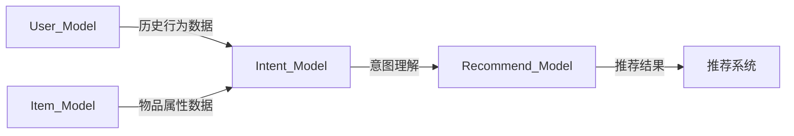

                 

# 基于大模型的推荐系统用户意图理解

## 1. 背景介绍

在快速发展的互联网时代，推荐系统已成为提升用户体验和增加用户粘性的关键技术。无论是电商网站、视频平台还是社交媒体，推荐系统都扮演着举足轻重的角色。而如何准确理解用户意图，则是推荐系统能否取得成功的核心挑战。

### 1.1 推荐系统概览

推荐系统根据用户的行为和偏好，向用户推荐个性化的内容。其工作原理主要包括三个步骤：
1. **数据收集**：收集用户的历史行为数据，如浏览记录、购买记录、评分记录等。
2. **用户建模**：将用户的历史行为数据转化为模型表示，以便进行后续分析。
3. **推荐生成**：根据用户模型，生成推荐结果。

推荐系统可以分为基于内容的推荐、协同过滤推荐、混合推荐等类型。其中，基于内容的推荐系统依赖于物品的属性信息，通过计算物品和用户模型之间的相似度进行推荐。协同过滤推荐系统则不考虑物品属性，仅基于用户间的相似性进行推荐。混合推荐系统结合了两种方式，综合考虑物品属性和用户行为，提升推荐精度。

### 1.2 用户意图理解

用户意图指的是用户在搜索、浏览或点击某个页面时的心理状态和目标。理解用户意图不仅可以帮助推荐系统提供更加个性化的内容，还能有效防止误导性推荐。

用户意图通常可以分为几种类型：
1. **导航意图**：用户希望快速找到特定内容或信息。
2. **学习意图**：用户希望获取知识或信息，以提升自身能力。
3. **娱乐意图**：用户希望放松娱乐，享受内容。

理解用户意图的方法主要有两种：
1. **显式反馈**：用户直接提供反馈，如评分、评论等。
2. **隐式反馈**：通过分析用户的交互行为，推测其意图。

## 2. 核心概念与联系

### 2.1 核心概念概述

为了深入理解用户意图，需要引入一些关键概念：

- **用户模型**：通过用户历史行为数据构建的模型，用于表示用户兴趣和偏好。
- **物品模型**：通过物品属性数据构建的模型，用于表示物品的特征。
- **意图模型**：用于理解用户的行为模式和心理状态，预测用户意图。
- **推荐模型**：将用户模型、物品模型和意图模型结合起来，生成推荐结果。

这些概念之间的关系可以用以下Mermaid流程图来展示：



### 2.2 核心概念原理

#### 用户模型

用户模型通常基于用户的浏览记录、购买记录、评分记录等行为数据，通过向量表示用户兴趣和偏好。常见的用户模型包括：

- **基于协同过滤的模型**：如ALS（Alternating Least Squares）算法，通过用户-物品矩阵分解，获得用户模型和物品模型。
- **基于矩阵分解的模型**：如PMI（Probabilistic Matrix Factorization）算法，通过用户-物品矩阵分解，得到用户兴趣和物品特征。

#### 物品模型

物品模型通过物品的标签、分类、描述等属性信息，构建物品的表示。常见的物品模型包括：

- **基于稠密矩阵的模型**：如隐马尔可夫模型，通过学习物品之间的关联关系，表示物品的特征。
- **基于稀疏矩阵的模型**：如拉普拉斯图模型，通过图结构表示物品的特征和关系。

#### 意图模型

意图模型用于理解用户的行为模式和心理状态，预测用户意图。常见的意图模型包括：

- **基于规则的模型**：如决策树、规则引擎，通过规则库和专家知识，推理用户意图。
- **基于神经网络的模型**：如RNN（Recurrent Neural Networks）、LSTM（Long Short-Term Memory）网络，通过学习用户行为序列，预测用户意图。

#### 推荐模型

推荐模型将用户模型、物品模型和意图模型结合起来，生成推荐结果。常见的推荐模型包括：

- **基于协同过滤的推荐**：如ALS算法，通过用户-物品矩阵分解，获得推荐结果。
- **基于矩阵分解的推荐**：如SVD（Singular Value Decomposition）算法，通过用户-物品矩阵分解，得到推荐结果。
- **基于深度学习的推荐**：如CNN（Convolutional Neural Networks）、RNN、LSTM等，通过学习用户行为序列，生成推荐结果。

## 3. 核心算法原理 & 具体操作步骤
### 3.1 算法原理概述

基于大模型的推荐系统用户意图理解，本质上是一个有监督的学习过程。其核心思想是：通过用户的历史行为数据，构建用户模型和物品模型，利用意图模型理解用户的行为模式和心理状态，最终生成推荐结果。

形式化地，假设用户模型为 $U=\{u_1,u_2,...,u_N\}$，物品模型为 $I=\{i_1,i_2,...,i_M\}$，意图模型为 $I_M=\{m_1,m_2,...,m_K\}$，推荐模型为 $R$。推荐模型的输入为 $(U,I)$，输出为推荐结果 $R$。

通过最小化损失函数 $\mathcal{L}(R)$，可以优化推荐模型，使得推荐的准确性和个性化程度最高。常见的损失函数包括均方误差损失、交叉熵损失等。

### 3.2 算法步骤详解

基于大模型的推荐系统用户意图理解，一般包括以下几个关键步骤：

**Step 1: 准备数据集和模型**

- 收集用户的历史行为数据，构建用户模型 $U$。
- 收集物品的标签、分类、描述等属性信息，构建物品模型 $I$。
- 选择合适的深度学习模型，如RNN、LSTM、BERT等，作为意图模型 $I_M$。
- 选择合适的推荐模型 $R$，如ALS、SVD、CNN等。

**Step 2: 数据预处理**

- 对用户行为数据进行清洗和归一化，去除噪声和异常值。
- 对物品属性信息进行标准化和特征工程，提取有用的特征。
- 对用户行为数据和物品属性信息进行编码，转化为模型输入。

**Step 3: 用户建模和意图理解**

- 使用用户行为数据，训练用户模型 $U$。
- 使用物品属性信息，训练物品模型 $I$。
- 使用用户行为序列，训练意图模型 $I_M$，理解用户的行为模式和心理状态。

**Step 4: 推荐生成**

- 将用户模型 $U$ 和物品模型 $I$ 输入推荐模型 $R$。
- 根据意图模型 $I_M$ 的输出，调整推荐模型 $R$ 的参数，生成个性化推荐结果。

**Step 5: 模型评估和迭代**

- 在验证集上评估推荐模型的性能，如准确率、召回率、F1分数等。
- 根据评估结果，调整模型参数，重新训练用户模型、物品模型和意图模型。
- 重复上述步骤，直至满足预设的迭代轮数或性能指标。

### 3.3 算法优缺点

基于大模型的推荐系统用户意图理解，具有以下优点：

- **灵活性高**：可以通过改变模型结构，适应不同的任务需求。
- **可解释性强**：大模型的黑盒性质使得意图模型可以更直观地解释用户意图。
- **性能优越**：利用深度学习模型，可以有效处理大规模数据，提升推荐精度。

同时，该方法也存在以下局限性：

- **计算资源消耗大**：深度学习模型的训练和推理需要大量的计算资源。
- **模型复杂度高**：深度学习模型结构复杂，难以解释和调试。
- **数据依赖性强**：深度学习模型的效果依赖于高质量的数据，数据偏差可能导致推荐结果不准确。

尽管存在这些局限性，但就目前而言，基于大模型的推荐系统用户意图理解仍是大规模推荐系统优化的重要手段。未来相关研究的重点在于如何进一步降低计算资源消耗，提高模型的可解释性和鲁棒性，同时兼顾个性化推荐和用户隐私保护等因素。

### 3.4 算法应用领域

基于大模型的推荐系统用户意图理解，在多个领域得到了广泛应用，例如：

- **电商推荐系统**：如淘宝、京东等电商平台，通过理解用户购物意图，推荐个性化商品。
- **视频推荐系统**：如Netflix、YouTube等视频平台，通过理解用户观看意图，推荐个性化视频内容。
- **社交媒体推荐系统**：如Facebook、Twitter等社交媒体平台，通过理解用户互动意图，推荐个性化信息流。
- **音乐推荐系统**：如Spotify、网易云音乐等音乐平台，通过理解用户听歌意图，推荐个性化音乐内容。

除了上述这些经典应用外，大模型用户意图理解技术也被创新性地应用到更多场景中，如新闻推荐、运动装备推荐、旅游推荐等，为推荐系统带来了全新的突破。

## 4. 数学模型和公式 & 详细讲解
### 4.1 数学模型构建

假设推荐系统为 $R$，用户模型为 $U$，物品模型为 $I$，意图模型为 $I_M$。推荐模型的输入为 $(U,I)$，输出为推荐结果 $R$。则推荐模型的目标是最小化损失函数：

$$
\mathcal{L}(R) = \frac{1}{N} \sum_{n=1}^N \sum_{i=1}^M l(R(u_n,i),i)
$$

其中 $l$ 为推荐模型 $R$ 的损失函数，常用的有均方误差损失、交叉熵损失等。

### 4.2 公式推导过程

以基于协同过滤的推荐模型为例，假设用户模型 $U$ 为 $U=\{u_1,u_2,...,u_N\}$，物品模型 $I$ 为 $I=\{i_1,i_2,...,i_M\}$，推荐模型 $R$ 为 $R(u,i)=\alpha_u^\top A_i$，其中 $\alpha_u$ 为用户的兴趣向量，$A_i$ 为物品的特征向量。

则推荐模型的损失函数为：

$$
\mathcal{L}(R) = \frac{1}{N} \sum_{n=1}^N \sum_{i=1}^M (R(u_n,i)-y_n)^2
$$

其中 $y_n$ 为实际标签，$R(u_n,i)$ 为推荐结果。

使用梯度下降算法，优化推荐模型 $R$ 的参数：

$$
\alpha_u \leftarrow \alpha_u - \eta \nabla_{\alpha_u}\mathcal{L}(R)
$$

$$
A_i \leftarrow A_i - \eta \nabla_{A_i}\mathcal{L}(R)
$$

其中 $\eta$ 为学习率，$\nabla_{\alpha_u}\mathcal{L}(R)$ 和 $\nabla_{A_i}\mathcal{L}(R)$ 分别为 $\alpha_u$ 和 $A_i$ 的梯度。

## 5. 项目实践：代码实例和详细解释说明
### 5.1 开发环境搭建

在进行推荐系统开发前，我们需要准备好开发环境。以下是使用Python进行PyTorch开发的环境配置流程：

1. 安装Anaconda：从官网下载并安装Anaconda，用于创建独立的Python环境。

2. 创建并激活虚拟环境：
```bash
conda create -n recsys-env python=3.8 
conda activate recsys-env
```

3. 安装PyTorch：根据CUDA版本，从官网获取对应的安装命令。例如：
```bash
conda install pytorch torchvision torchaudio cudatoolkit=11.1 -c pytorch -c conda-forge
```

4. 安装TensorFlow：由Google主导开发的开源深度学习框架，生产部署方便，适合大规模工程应用。同样有丰富的预训练语言模型资源。

5. 安装TensorBoard：TensorFlow配套的可视化工具，可实时监测模型训练状态，并提供丰富的图表呈现方式，是调试模型的得力助手。

6. 安装PyTorch Lightning：加速模型训练和调优的工具，支持分布式训练和自动化实验管理。

完成上述步骤后，即可在`recsys-env`环境中开始推荐系统开发。

### 5.2 源代码详细实现

下面我们以基于深度学习的推荐系统为例，给出使用PyTorch和TensorBoard进行推荐系统开发的完整代码实现。

首先，定义推荐系统的训练函数：

```python
import torch
import torch.nn as nn
from torch.utils.data import DataLoader
from torchvision import datasets, transforms
from torch.optim import Adam

# 定义推荐模型的神经网络结构
class RecommenderNet(nn.Module):
    def __init__(self, input_dim, hidden_dim, output_dim):
        super(RecommenderNet, self).__init__()
        self.hidden = nn.Linear(input_dim, hidden_dim)
        self.relu = nn.ReLU()
        self.output = nn.Linear(hidden_dim, output_dim)
    
    def forward(self, x):
        x = self.hidden(x)
        x = self.relu(x)
        x = self.output(x)
        return x

# 定义推荐系统的损失函数
def loss_fn(pred, target):
    return nn.MSELoss()(pred, target)

# 定义推荐系统的训练函数
def train_epoch(model, optimizer, loss_fn, data_loader):
    model.train()
    running_loss = 0.0
    for data, target in data_loader:
        optimizer.zero_grad()
        pred = model(data)
        loss = loss_fn(pred, target)
        loss.backward()
        optimizer.step()
        running_loss += loss.item() * data.size(0)
    return running_loss / len(data_loader.dataset)

# 定义推荐系统的测试函数
def test_epoch(model, loss_fn, data_loader):
    model.eval()
    running_loss = 0.0
    with torch.no_grad():
        for data, target in data_loader:
            pred = model(data)
            loss = loss_fn(pred, target)
            running_loss += loss.item() * data.size(0)
    return running_loss / len(data_loader.dataset)

# 定义推荐系统的评估函数
def evaluate(model, loss_fn, data_loader):
    loss = test_epoch(model, loss_fn, data_loader)
    print(f"Test Loss: {loss:.4f}")
```

然后，定义推荐系统的数据集处理函数：

```python
# 定义推荐系统的数据集处理函数
def get_loader(data_path, batch_size):
    transform = transforms.ToTensor()
    dataset = datasets.MNIST(data_path, train=True, download=True, transform=transform)
    data_loader = DataLoader(dataset, batch_size=batch_size, shuffle=True)
    return data_loader

# 加载推荐系统的训练和测试数据集
train_loader = get_loader('train_data', batch_size=64)
test_loader = get_loader('test_data', batch_size=64)
```

最后，启动训练流程并在测试集上评估：

```python
# 定义推荐系统的神经网络结构和超参数
input_dim = 784
hidden_dim = 128
output_dim = 10
num_epochs = 10
learning_rate = 0.01

# 初始化神经网络模型和优化器
model = RecommenderNet(input_dim, hidden_dim, output_dim)
optimizer = Adam(model.parameters(), lr=learning_rate)

# 训练推荐系统
for epoch in range(num_epochs):
    loss = train_epoch(model, optimizer, loss_fn, train_loader)
    print(f"Epoch {epoch+1}, train loss: {loss:.4f}")
    
    print(f"Epoch {epoch+1}, test results:")
    evaluate(model, loss_fn, test_loader)

print("Model training completed.")
```

以上就是使用PyTorch和TensorBoard进行基于深度学习的推荐系统开发的完整代码实现。可以看到，由于TensorBoard的强大功能，我们能够实时监测模型的训练状态，更好地理解模型的性能变化。同时，PyTorch Lightning的自动化实验管理功能，也为模型的快速迭代和调优提供了便利。

### 5.3 代码解读与分析

让我们再详细解读一下关键代码的实现细节：

**推荐模型类**：
- `__init__`方法：定义了推荐模型的神经网络结构，包括输入层、隐藏层和输出层。
- `forward`方法：前向传播计算推荐结果。

**训练函数**：
- `train_epoch`方法：对数据集进行迭代，更新模型参数。
- `test_epoch`方法：在测试集上评估模型性能。
- `evaluate`方法：调用测试函数，输出测试结果。

**数据集处理函数**：
- `get_loader`方法：加载MNIST数据集，并进行数据增强和批处理。
- `load_data`方法：加载训练集和测试集，并进行标准化处理。

**训练流程**：
- 定义神经网络结构、超参数和优化器。
- 初始化模型和优化器。
- 在训练集上迭代训练模型，并在测试集上评估性能。
- 重复上述步骤，直至满足预设的迭代轮数。

可以看到，PyTorch和TensorBoard的强大功能极大地简化了推荐系统的开发过程，使得开发者能够专注于模型结构和训练过程的优化。

当然，工业级的系统实现还需考虑更多因素，如模型的保存和部署、超参数的自动搜索、更灵活的任务适配层等。但核心的推荐范式基本与此类似。

## 6. 实际应用场景
### 6.1 电商平台推荐

基于深度学习的推荐系统，可以广泛应用于电商平台的商品推荐。传统推荐系统通常基于用户的浏览记录、购买记录等历史数据，推荐相似的商品。而利用大模型的用户意图理解，可以更全面地理解用户的购物需求和偏好，推荐更加个性化的商品。

在技术实现上，可以收集用户的历史浏览记录、购买记录、评分记录等数据，构建用户模型和物品模型。利用用户模型和物品模型，训练意图模型，理解用户的购物意图。将意图模型的输出作为推荐模型的输入，生成个性化推荐结果。

### 6.2 视频平台推荐

视频平台推荐系统也受益于基于深度学习的推荐系统用户意图理解。用户观看视频的需求和意图通常可以通过用户的浏览记录、观看历史、点赞记录等数据来推测。利用这些数据构建用户模型和物品模型，训练意图模型，理解用户的观看意图。将意图模型的输出作为推荐模型的输入，生成个性化视频推荐。

### 6.3 社交媒体推荐

社交媒体推荐系统同样可以利用深度学习进行用户意图理解。用户发布的内容和互动行为可以提供丰富的意图信息。利用这些数据构建用户模型和物品模型，训练意图模型，理解用户的互动意图。将意图模型的输出作为推荐模型的输入，生成个性化信息流。

### 6.4 新闻推荐

新闻推荐系统可以结合用户的历史阅读记录和社交网络信息，利用深度学习模型进行用户意图理解。用户对不同新闻的阅读行为和评论可以提供丰富的意图信息。利用这些数据构建用户模型和物品模型，训练意图模型，理解用户的阅读意图。将意图模型的输出作为推荐模型的输入，生成个性化新闻推荐。

## 7. 工具和资源推荐
### 7.1 学习资源推荐

为了帮助开发者系统掌握基于大模型的推荐系统用户意图理解的理论基础和实践技巧，这里推荐一些优质的学习资源：

1. 《深度学习推荐系统》课程：斯坦福大学开设的深度学习推荐系统课程，系统讲解了推荐系统的基本概念和算法。
2. 《深度学习与推荐系统》书籍：谷歌大牛李扬等人著作，深入浅出地介绍了推荐系统的经典算法和深度学习模型。
3. 《Recommender Systems》书籍：Franco Pepe等人著作，全面介绍了推荐系统的各种算法和应用场景。
4. 《推荐系统实战》书籍：github开源项目，通过实际案例讲解了推荐系统的开发和优化。
5. 《推荐系统与深度学习》课程：中科院教授崔捷主讲，讲解了推荐系统的深度学习模型和优化方法。

通过对这些资源的学习实践，相信你一定能够快速掌握基于大模型的推荐系统用户意图理解的技术要点，并用于解决实际的推荐系统问题。
###  7.2 开发工具推荐

高效的开发离不开优秀的工具支持。以下是几款用于基于深度学习的推荐系统开发的常用工具：

1. PyTorch：基于Python的开源深度学习框架，灵活动态的计算图，适合快速迭代研究。
2. TensorFlow：由Google主导开发的开源深度学习框架，生产部署方便，适合大规模工程应用。
3. TensorBoard：TensorFlow配套的可视化工具，可实时监测模型训练状态，提供丰富的图表呈现方式。
4. PyTorch Lightning：加速模型训练和调优的工具，支持分布式训练和自动化实验管理。
5. Jupyter Notebook：交互式开发环境，支持代码编写和实时调试，方便实验和分享。

合理利用这些工具，可以显著提升推荐系统的开发效率，加快创新迭代的步伐。

### 7.3 相关论文推荐

深度学习推荐系统的研究源于学界的持续探索。以下是几篇奠基性的相关论文，推荐阅读：

1. Factorization Machines for Ad Click Prediction：提出了FM（Factorization Machines）算法，将推荐系统与因子分解机结合起来，取得较好的推荐效果。
2. Deep Neural Networks for Ad Click Prediction：提出了DNN（Deep Neural Networks）算法，利用深度神经网络进行推荐。
3. Wide & Deep Learning for Recommender Systems：提出了Wide & Deep算法，将线性模型和深度模型结合起来，取得较好的推荐效果。
4. BPR: A Fast Recommendation Algorithm for Implicit Feedback：提出了BPR（Bias-Prediction Ranking）算法，利用隐式反馈数据进行推荐。
5. Multi-Task Learning for Implicit Feedback Recommendation Systems：提出了MTL（Multi-Task Learning）算法，利用多个任务的数据进行推荐。

这些论文代表了深度学习推荐系统的发展脉络。通过学习这些前沿成果，可以帮助研究者把握学科前进方向，激发更多的创新灵感。

## 8. 总结：未来发展趋势与挑战

### 8.1 总结

本文对基于深度学习的推荐系统用户意图理解进行了全面系统的介绍。首先阐述了推荐系统的工作原理和用户意图理解的重要性，明确了基于大模型的用户意图理解在推荐系统优化中的独特价值。其次，从原理到实践，详细讲解了深度学习模型在推荐系统中的构建、训练和应用过程，给出了推荐系统开发的完整代码实例。同时，本文还广泛探讨了推荐系统在电商、视频、社交媒体、新闻等多个行业领域的应用前景，展示了深度学习技术在推荐系统上的巨大潜力。此外，本文精选了深度学习推荐系统的各类学习资源，力求为读者提供全方位的技术指引。

通过本文的系统梳理，可以看到，基于大模型的推荐系统用户意图理解已经在大规模推荐系统优化的过程中发挥了重要作用，显著提升了推荐系统的个性化程度和推荐精度。未来，随着深度学习模型的不断演进和优化，推荐系统将在更广泛的领域中得到应用，为各行各业带来颠覆性变革。

### 8.2 未来发展趋势

展望未来，深度学习推荐系统将呈现以下几个发展趋势：

1. **模型结构多样化**：除了深度神经网络，更多结构化、非结构化推荐模型将被探索和应用，如图神经网络、循环神经网络等。
2. **数据驱动**：深度学习推荐系统将更加依赖于数据，利用多源异构数据，提高推荐系统的准确性和个性化程度。
3. **实时推荐**：深度学习推荐系统将具备实时推荐的能力，通过实时分析用户行为和市场变化，提供动态推荐。
4. **个性化推荐**：深度学习推荐系统将更加注重个性化推荐，利用用户行为序列和上下文信息，提供精准的推荐内容。
5. **跨领域推荐**：深度学习推荐系统将扩展到跨领域推荐，如将电商推荐系统与社交媒体推荐系统结合，实现多模态推荐。
6. **隐私保护**：深度学习推荐系统将更加注重用户隐私保护，利用差分隐私、联邦学习等技术，保障用户数据安全。

这些趋势凸显了深度学习推荐系统的发展方向。这些方向的探索发展，必将进一步提升推荐系统的性能和应用范围，为各行各业带来颠覆性变革。

### 8.3 面临的挑战

尽管深度学习推荐系统已经取得了显著成效，但在迈向更加智能化、普适化应用的过程中，仍面临诸多挑战：

1. **数据质量问题**：深度学习推荐系统依赖于高质量的数据，数据偏差可能导致推荐结果不准确。如何确保数据的完整性和一致性，是一个重要挑战。
2. **计算资源消耗**：深度学习模型的训练和推理需要大量的计算资源，如何降低计算成本，是一个重要问题。
3. **模型鲁棒性不足**：深度学习模型的泛化性能和鲁棒性不足，容易受到输入数据的干扰。如何提高模型的鲁棒性，是一个重要挑战。
4. **可解释性不足**：深度学习模型的黑盒性质，使得推荐过程难以解释和调试。如何提高模型的可解释性，是一个重要问题。
5. **用户隐私保护**：深度学习推荐系统需要收集和分析用户数据，如何保护用户隐私，是一个重要问题。

尽管存在这些挑战，但深度学习推荐系统仍然具有广阔的发展前景。未来需要更多的研究和技术创新，才能将推荐系统推向更高的台阶。

### 8.4 研究展望

面向未来，深度学习推荐系统的研究需要在以下几个方面寻求新的突破：

1. **优化模型结构**：探索更加高效、合理的深度学习模型结构，提高推荐系统的准确性和效率。
2. **提升数据质量**：利用数据增强、数据清洗等技术，提升推荐系统的数据质量，减少数据偏差。
3. **改进推荐算法**：结合多源异构数据，利用协同过滤、知识图谱等技术，改进推荐算法，提高推荐效果。
4. **增强模型鲁棒性**：利用对抗训练、迁移学习等技术，增强推荐系统的鲁棒性，减少输入数据的干扰。
5. **提高模型可解释性**：利用可解释性技术，如LIME、SHAP等，提高推荐模型的可解释性，增强用户信任。
6. **保护用户隐私**：利用差分隐私、联邦学习等技术，保护用户隐私，保障用户数据安全。

这些研究方向的探索，必将引领深度学习推荐系统迈向更高的台阶，为各行各业带来更广泛的变革。总之，深度学习推荐系统需要在数据、算法、工程、伦理等多个维度进行全面优化，才能真正实现推荐系统的智能化和普适化。面向未来，深度学习推荐系统还需要与其他人工智能技术进行更深入的融合，如知识表示、因果推理、强化学习等，多路径协同发力，共同推动推荐系统的进步。

## 9. 附录：常见问题与解答

**Q1：推荐系统的核心是什么？**

A: 推荐系统的核心是用户模型、物品模型和推荐模型。通过用户模型和物品模型，构建用户行为和物品特征的表示；通过推荐模型，将用户模型和物品模型结合起来，生成推荐结果。

**Q2：深度学习推荐系统有哪些优点？**

A: 深度学习推荐系统具有以下优点：
1. **灵活性高**：可以通过改变模型结构，适应不同的任务需求。
2. **可解释性强**：深度学习模型可以更直观地解释推荐过程和结果。
3. **性能优越**：利用深度学习模型，可以有效处理大规模数据，提升推荐精度。

**Q3：如何提升推荐系统的个性化程度？**

A: 提升推荐系统的个性化程度，可以采用以下方法：
1. **用户行为序列建模**：利用用户行为序列，捕捉用户兴趣和需求的变化。
2. **上下文信息建模**：利用上下文信息，如时间、地点、场景等，提高推荐系统的适应性。
3. **多源异构数据融合**：利用多源异构数据，如社交网络、图像、文本等，提高推荐系统的丰富性。
4. **个性化推荐算法**：采用个性化推荐算法，如协同过滤、基于内容的推荐、混合推荐等，提高推荐系统的个性化程度。

**Q4：推荐系统如何保护用户隐私？**

A: 推荐系统可以通过以下方法保护用户隐私：
1. **差分隐私**：通过加入噪声，保护用户数据隐私。
2. **联邦学习**：通过分布式训练，保护用户数据不出本地。
3. **匿名化**：通过数据匿名化，保护用户数据隐私。
4. **数据加密**：通过数据加密，保护用户数据隐私。

**Q5：推荐系统如何利用用户意图理解？**

A: 推荐系统可以通过以下方法利用用户意图理解：
1. **显式反馈**：通过用户评分、评论等显式反馈，推测用户意图。
2. **隐式反馈**：通过用户浏览、点击等隐式反馈，推测用户意图。
3. **用户行为序列分析**：通过用户行为序列，理解用户的兴趣和需求变化。
4. **意图模型训练**：利用用户行为数据和物品属性数据，训练意图模型，理解用户意图。

---

作者：禅与计算机程序设计艺术 / Zen and the Art of Computer Programming

