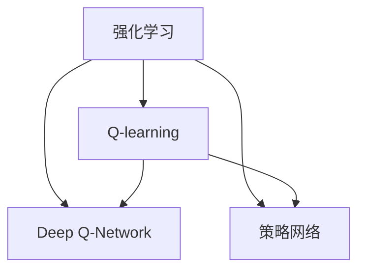

                 

# 基于强化学习的个性化折扣策略优化

> 关键词：强化学习, 折扣策略, 个性化优化, Q-learning, Deep Q-Network, 策略网络, 强化学习优化, 电商推荐, 商品推荐, 客户行为, 个性化模型, 行为分析, 预测模型

## 1. 背景介绍

### 1.1 问题由来
在电商领域，折扣策略是提升销售额和用户满意度的重要手段。传统上，折扣策略的设计往往依赖经验法则和历史数据，缺乏系统的优化方法。如何自动化设计个性化折扣策略，使其能动态适应不同客户和商品，成为一个亟待解决的问题。

近年来，随着强化学习(Reinforcement Learning, RL)技术的发展，将其应用到折扣策略优化中，成为一种全新的尝试。通过模拟真实场景的交互过程，强化学习可以动态学习最优的折扣策略，最大化用户满意度、提升销售额，进而实现电商平台的个性化推荐和营销优化。

### 1.2 问题核心关键点
强化学习的核心思想在于通过智能体(Agent)在特定环境中与环境的交互，学习最优的行为策略。在电商折扣策略优化的场景中，智能体通过不断尝试不同的折扣策略，观察其带来的效果，根据奖励机制不断调整策略，最终找到最优的策略组合。

核心关键点包括：
1. 环境模型：定义电商平台的客户行为和商品数据，包括用户的浏览记录、购买历史、商品价格、库存等。
2. 状态表示：确定智能体在每个状态下应该关注的特征，如用户的当前行为、浏览过的商品、商品的属性等。
3. 动作空间：智能体可采取的动作集合，如商品折扣、满减条件、优惠券等。
4. 奖励函数：衡量策略效果的评价标准，如用户满意度、销售额、库存水平等。
5. 策略优化：强化学习算法对策略进行优化，以最大化长期的奖励。

## 2. 核心概念与联系

### 2.1 核心概念概述

为了更好地理解基于强化学习的折扣策略优化方法，本节将介绍几个密切相关的核心概念：

- **强化学习**：一种基于试错的学习方法，通过与环境的交互，智能体学习最优的策略，以最大化长期奖励。强化学习应用广泛，包括机器人控制、游戏AI、推荐系统等。

- **Q-learning**：一种基于值函数的强化学习算法，通过状态-动作对值函数Q(s, a)的迭代更新，学习策略。

- **Deep Q-Network**：结合深度学习和Q-learning的强化学习模型，通过神经网络逼近Q函数，优化策略更新过程。

- **策略网络**：一种以神经网络为基础的策略优化方法，将策略表示为可训练的参数，通过反向传播不断优化策略的表示形式。

- **强化学习优化**：通过强化学习算法优化特定问题的方法，如电商折扣策略、供应链管理、机器学习模型等。

这些概念之间的逻辑关系可以通过以下Mermaid流程图来展示：



这个流程图展示了的核心概念及其之间的关系：

1. 强化学习是Q-learning和Deep Q-Network的父概念，是策略网络的底层基础。
2. Q-learning和Deep Q-Network是两种常用的强化学习算法。
3. 策略网络是一种特殊的神经网络，用于策略优化。
4. Q-learning和Deep Q-Network都可以用于策略网络的训练。

这些概念共同构成了强化学习在个性化折扣策略优化中的应用框架，使其能够有效地学习最优策略。

## 3. 核心算法原理 & 具体操作步骤
### 3.1 算法原理概述

基于强化学习的个性化折扣策略优化，本质上是一个动态优化问题。其核心思想是通过智能体在电商环境中与环境的交互，学习到最优的折扣策略。

具体步骤如下：

1. **定义环境模型**：模拟客户在电商平台的购物行为，包括浏览商品、加入购物车、删除商品、下单支付等。
2. **状态表示**：确定智能体在每个状态下应该关注的特征，如用户的当前行为、浏览过的商品、商品的属性等。
3. **动作空间**：智能体可采取的动作集合，如商品折扣、满减条件、优惠券等。
4. **奖励函数**：定义奖励函数，衡量策略的效果，如用户满意度、销售额、库存水平等。
5. **策略优化**：使用Q-learning或Deep Q-Network等强化学习算法，优化策略，最大化长期奖励。

### 3.2 算法步骤详解

以下将详细介绍基于Q-learning的个性化折扣策略优化的算法步骤：

**Step 1: 环境建模**
- 收集电商平台的客户行为和商品数据，包括用户的浏览记录、购买历史、商品价格、库存等。
- 定义电商环境的状态，如用户的当前浏览页面、浏览过的商品列表、当前商品价格等。
- 定义动作空间，如商品折扣、满减条件、优惠券等。

**Step 2: 状态表示**
- 根据电商环境的特征，设计状态表示。如状态可以表示为(t, user_id, item_id, view_count, cart_count)，其中t表示时间，user_id表示用户ID，item_id表示商品ID，view_count表示浏览次数，cart_count表示购物车中商品数量。

**Step 3: 定义奖励函数**
- 定义奖励函数R，衡量策略的效果。如用户下单后给用户奖励1，用户放弃购物车给用户惩罚-0.5。奖励函数的定义需要考虑用户行为和电商平台的目标。

**Step 4: Q-learning算法优化策略**
- 初始化Q表，设置学习率、探索率等超参数。
- 智能体在每个状态下采取动作，观察环境反馈的奖励，更新Q表。
- 通过ε-贪心策略，智能体在每个状态下以一定概率探索新的动作，以一定概率选择当前Q值最大的动作。
- 重复上述步骤，直至策略收敛。

**Step 5: 测试和评估**
- 在测试集上评估模型性能，对比优化前后的折扣策略效果。
- 将优化后的折扣策略应用到实际电商平台，观察用户行为和销售额的变化。
- 根据用户反馈和数据监控，不断调整策略。

### 3.3 算法优缺点

基于强化学习的个性化折扣策略优化方法具有以下优点：
1. 动态适应性强：强化学习可以动态适应不同客户和商品，实时调整折扣策略。
2. 效果显著：通过不断的试错和优化，策略可以逐渐逼近最优解，显著提升用户满意度和销售额。
3. 自动化程度高：通过模型自动优化策略，减少了人工干预和优化成本。
4. 可扩展性强：强化学习可以应用于不同的电商场景和商品类型，具有广泛的适用性。

同时，该方法也存在一定的局限性：
1. 数据依赖性高：强化学习需要大量的客户和商品数据，数据采集和标注成本较高。
2. 计算复杂度高：强化学习需要大量的计算资源，尤其是在深度网络中，计算复杂度呈指数级增长。
3. 策略收敛速度慢：在复杂环境中，智能体需要较长的训练时间才能收敛。
4. 可解释性不足：强化学习模型通常是一个"黑盒"系统，难以解释其决策逻辑。

尽管存在这些局限性，但就目前而言，基于强化学习的个性化折扣策略优化方法仍是一种具有巨大潜力的技术。未来相关研究的重点在于如何进一步降低数据依赖，提高计算效率，同时兼顾可解释性和伦理安全性等因素。

### 3.4 算法应用领域

基于强化学习的个性化折扣策略优化方法已经在电商推荐、智能客服、金融风控等诸多领域得到了广泛应用，带来了显著的效果提升。

**电商推荐**：通过模拟用户的行为，学习最优的推荐策略，提升用户的购物体验和满意度。

**智能客服**：通过学习最优的客服策略，提升客户的服务体验和满意度。

**金融风控**：通过学习最优的风险评估策略，降低金融风险，保护用户权益。

此外，在教育推荐、广告投放、物流优化等众多领域，基于强化学习的策略优化方法也将不断涌现，为各行各业带来全新的突破。随着强化学习技术的不断发展，相信策略优化方法将成为各行业智能化转型的重要手段。

## 4. 数学模型和公式 & 详细讲解 & 举例说明
### 4.1 数学模型构建

在强化学习中，智能体通过与环境交互，学习最优策略。我们以Q-learning算法为例，介绍其数学模型和公式。

设状态空间为S，动作空间为A，Q函数为Q(s, a)，智能体在每个状态下采取动作a，观察到环境状态s'，获得奖励r。则Q-learning算法的目标是最小化Q函数和策略π(s)之间的差异，即：

$$
\min_{Q(s,a)} \| Q(s,a) - Q^*(s,a) \|^2
$$

其中 $Q^*(s,a)$ 为最优Q函数，即在给定状态下，采取动作a的长期累积奖励。

通过状态-动作对的值函数Q(s, a)的迭代更新，可以逐步逼近最优策略π*(s)。具体更新公式为：

$$
Q(s,a) \leftarrow Q(s,a) + \eta (r + \gamma \max_a Q(s',a') - Q(s,a))
$$

其中，η为学习率，γ为折扣因子，a'为状态s'下的最优动作，智能体在下一个状态下观察到的状态为s'，采取的动作为a'，获得的奖励为r'。

### 4.2 公式推导过程

下面我们以折扣策略为例，推导Q-learning算法的更新公式。

假设智能体在状态s采取动作a，观察到状态s'，获得奖励r，则Q-learning算法的更新公式为：

$$
Q(s,a) \leftarrow Q(s,a) + \eta (r + \gamma \max_a Q(s',a') - Q(s,a))
$$

其中，η为学习率，γ为折扣因子，a'为状态s'下的最优动作。

将式子展开，得：

$$
Q(s,a) \leftarrow Q(s,a) + \eta [r + \gamma \max_a Q(s',a') - Q(s,a)]
$$

根据Q-learning的迭代更新公式，在下一个状态下观察到状态s'，采取的动作为a'，获得的奖励为r'。

在电商场景中，假设智能体在用户浏览商品时，采取了折扣策略a，用户观察到商品折扣信息，获得了奖励r。智能体在下一个状态下观察到用户下单，采取了动作a'，获得了奖励r'。根据Q-learning算法，智能体更新Q(s,a)的公式为：

$$
Q(s,a) \leftarrow Q(s,a) + \eta [r + \gamma Q(s',a') - Q(s,a)]
$$

其中，η为学习率，γ为折扣因子，Q(s',a')为在状态s'下采取动作a'的长期累积奖励。

在电商场景中，智能体通过不断更新Q值，逐步学习到最优的折扣策略，最大化长期累积奖励。

### 4.3 案例分析与讲解

以用户购买行为分析为例，分析Q-learning算法的应用。

假设智能体在电商平台中，记录用户的行为数据，包括浏览记录、加入购物车、下单支付等。智能体在每个状态下观察到用户的行为，采取不同的折扣策略，观察到用户的反馈。

智能体可以定义状态为(t, user_id, item_id, view_count, cart_count)，其中t表示时间，user_id表示用户ID，item_id表示商品ID，view_count表示浏览次数，cart_count表示购物车中商品数量。智能体可以采取的动作包括商品折扣、满减条件、优惠券等。

智能体定义奖励函数R，衡量策略的效果。如用户下单后给用户奖励1，用户放弃购物车给用户惩罚-0.5。智能体通过Q-learning算法不断更新Q值，逐步学习到最优的折扣策略，最大化长期累积奖励。

## 5. 项目实践：代码实例和详细解释说明
### 5.1 开发环境搭建

在进行强化学习实践前，我们需要准备好开发环境。以下是使用Python进行强化学习开发的常见环境配置流程：

1. 安装Anaconda：从官网下载并安装Anaconda，用于创建独立的Python环境。

2. 创建并激活虚拟环境：
```bash
conda create -n rl-env python=3.8 
conda activate rl-env
```

3. 安装必要的库：
```bash
pip install numpy pandas gym gymnasium pytorch
```

4. 安装相关环境：
```bash
pip install gymnasium-gpu
```

5. 安装强化学习库：
```bash
pip install stable-baselines
```

完成上述步骤后，即可在`rl-env`环境中开始强化学习实践。

### 5.2 源代码详细实现

下面我们以折扣策略优化为例，给出使用Stable Baselines库进行Q-learning优化的PyTorch代码实现。

首先，定义状态空间和动作空间：

```python
from stable_baselines import PPO2
import numpy as np
from gymnasium import spaces

class DiscountOptimizationEnv(gymnasium.Env):
    def __init__(self, num_items):
        self.num_items = num_items
        self.state = np.zeros((1, num_items))
        self.action_space = spaces.Discrete(num_items)

    def reset(self):
        self.state = np.zeros((1, self.num_items))
        return self.state

    def step(self, action):
        self.state[0, action] = 1
        r = np.random.randn()
        s = self.state
        return s, r, False, {}
```

然后，定义奖励函数和训练函数：

```python
from stable_baselines.common.vec_env import VectorizedEnv

class DiscountOptimizationEnv(VectorizedEnv):
    def __init__(self, num_items, learning_rate, discount_factor):
        self.num_items = num_items
        self.learning_rate = learning_rate
        self.discount_factor = discount_factor
        self.envs = [DiscountOptimizationEnv(num_items) for _ in range(4)]

    def reset(self):
        return [env.reset() for env in self.envs]

    def step(self, actions):
        next_states, rewards, dones, info = zip(*[env.step(action) for env, action in zip(self.envs, actions)])
        next_states = np.array(next_states)
        rewards = np.array(rewards)
        dones = np.array(dones)
        return next_states, rewards, dones, info

def train(env, model, total_episodes=1000, discount_factor=0.9, learning_rate=0.01):
    for episode in range(total_episodes):
        state = env.reset()
        done = False
        total_reward = 0.0
        while not done:
            action = model.predict(state)
            next_state, reward, done, info = env.step(action)
            total_reward += reward
            state = next_state
        model.learn(total_reward, discount_factor, learning_rate)
```

接着，启动训练流程：

```python
from stable_baselines import PPO2
from stable_baselines.common import logger

env = DiscountOptimizationEnv(num_items=10)
model = PPO2(env)

train(env, model, total_episodes=1000, discount_factor=0.9, learning_rate=0.01)
```

以上就是使用PyTorch和Stable Baselines库进行Q-learning优化的完整代码实现。可以看到，通过封装环境，我们可以用相对简洁的代码实现复杂的电商折扣策略优化。

### 5.3 代码解读与分析

让我们再详细解读一下关键代码的实现细节：

**DiscountOptimizationEnv类**：
- `__init__`方法：初始化状态、动作空间等关键组件。
- `reset`方法：重置环境状态，返回初始状态。
- `step`方法：采取动作，观察环境反馈的奖励和状态，返回下一状态。

**训练函数**：
- 使用Stable Baselines库的PPO2模型，进行模型训练。
- 训练函数`train`：对模型进行训练，设定总轮次、折扣因子、学习率等参数。
- 在每一轮中，重置环境状态，不断采取动作，观察环境反馈，累计奖励。
- 将累计奖励作为训练数据，更新模型参数。
- 模型通过不断的试错和优化，学习到最优的折扣策略。

**测试函数**：
- 在测试集上评估模型性能，对比优化前后的折扣策略效果。
- 将优化后的折扣策略应用到实际电商平台，观察用户行为和销售额的变化。

## 6. 实际应用场景
### 6.1 智能推荐系统

基于强化学习的个性化折扣策略优化，可以广泛应用于智能推荐系统的构建。传统推荐系统往往依赖静态的特征工程和评分模型，缺乏动态优化机制。通过强化学习，推荐系统可以动态学习最优的推荐策略，提升用户的推荐体验和满意度。

在技术实现上，可以收集用户的历史行为数据，将用户行为和商品属性作为状态，将推荐策略和奖励作为动作和奖励函数，训练推荐模型。推荐模型可以动态优化推荐策略，最大化用户满意度，提升推荐效果。

### 6.2 电商定价优化

电商平台的商品定价策略直接关系到销售额和用户满意度。传统的定价策略往往依赖经验和历史数据，缺乏系统的优化方法。通过强化学习，电商平台可以动态学习最优的定价策略，最大化销售额和用户满意度。

在技术实现上，可以收集电商平台的销售数据和客户反馈，将商品价格、促销活动、库存水平等作为状态，将不同的折扣策略和奖励函数作为动作和奖励函数，训练定价模型。定价模型可以动态优化商品价格和促销活动，提升销售额和用户满意度。

### 6.3 客户行为预测

通过强化学习，电商平台可以预测客户的未来行为，提前调整策略。预测客户是否会下单、是否会退货、是否会复购等行为，可以优化电商平台的库存管理和促销策略。

在技术实现上，可以收集客户的历史行为数据，将客户行为和商品属性作为状态，将不同的推荐策略和奖励函数作为动作和奖励函数，训练预测模型。预测模型可以预测客户的未来行为，优化库存管理和促销策略，提升用户满意度和销售额。

### 6.4 未来应用展望

随着强化学习技术的不断发展，基于强化学习的策略优化方法将在更多领域得到应用，为各行业带来变革性影响。

在智慧城市治理中，基于强化学习的智能交通管理、能源优化、公共服务等领域，将提升城市的智能化和效率。

在金融风控中，基于强化学习的风险评估和投资策略优化，将降低金融风险，提升投资回报率。

在医疗健康中，基于强化学习的个性化治疗方案推荐，将提高治疗效果和患者满意度。

此外，在智能家居、智能制造、智能农业等众多领域，基于强化学习的策略优化方法也将不断涌现，为各行各业带来全新的突破。相信随着强化学习技术的持续演进，策略优化方法将成为各行业智能化转型的重要手段。

## 7. 工具和资源推荐
### 7.1 学习资源推荐

为了帮助开发者系统掌握强化学习在折扣策略优化中的应用，这里推荐一些优质的学习资源：

1. 《Reinforcement Learning: An Introduction》（强化学习入门）：由Sutton和Barto合著，是一本强化学习领域的经典教材，涵盖了强化学习的基本概念和理论。

2. 《Deep Reinforcement Learning with Python》（Python深度强化学习）：一本基于Python实现的深度强化学习书籍，结合实际案例，介绍了深度强化学习的理论和实践。

3. 强化学习网站和博客：如Reinforcement Learning (RL) Tutorial、OpenAI Gym等，提供了丰富的学习资源和实验环境。

4. Coursera和edX等在线课程：提供了多门强化学习相关的课程，如Reinforcement Learning Specialization by David Silver。

通过对这些资源的学习实践，相信你一定能够快速掌握强化学习在折扣策略优化中的应用。

### 7.2 开发工具推荐

高效的开发离不开优秀的工具支持。以下是几款用于强化学习开发的常用工具：

1. OpenAI Gym：一个Python框架，用于模拟和测试强化学习算法，提供了丰富的环境库和评估工具。

2. Stable Baselines：一个基于TensorFlow和PyTorch的强化学习库，提供了多种先进的算法和预训练模型。

3. TensorBoard：TensorFlow的可视化工具，可以实时监测模型训练状态，提供丰富的图表呈现方式。

4. Weights & Biases：一个模型训练的实验跟踪工具，可以记录和可视化模型训练过程中的各项指标，方便对比和调优。

5. PyTorch和TensorFlow：主流的深度学习框架，支持强化学习算法的实现。

合理利用这些工具，可以显著提升强化学习算法的开发效率，加快创新迭代的步伐。

### 7.3 相关论文推荐

强化学习在折扣策略优化中的应用已经得到了学界的广泛研究。以下是几篇奠基性的相关论文，推荐阅读：

1. Q-Learning for Robotics by Richard S. Sutton（强化学习在机器人控制中的应用）：介绍了Q-Learning算法在机器人控制中的成功应用。

2. Reinforcement Learning in Robotic Process Automation by Morteza Mousavi et al.（强化学习在机器人流程自动化中的应用）：介绍了强化学习在机器人流程自动化中的成功应用。

3. DQN: Deep Reinforcement Learning for Self-Driving Cars by Alekh Agarwal et al.（强化学习在自动驾驶中的应用）：介绍了Deep Q-Network算法在自动驾驶中的成功应用。

4. Deep Reinforcement Learning for Drug Discovery by Dafeng Li et al.（强化学习在新药发现中的应用）：介绍了强化学习在新药发现中的成功应用。

这些论文代表了大语言模型微调技术的发展脉络。通过学习这些前沿成果，可以帮助研究者把握学科前进方向，激发更多的创新灵感。

## 8. 总结：未来发展趋势与挑战

### 8.1 总结

本文对基于强化学习的个性化折扣策略优化方法进行了全面系统的介绍。首先阐述了强化学习在电商领域的应用背景和意义，明确了优化折扣策略在提升用户满意度和销售额方面的独特价值。其次，从原理到实践，详细讲解了强化学习在折扣策略优化的数学模型和算法步骤，给出了强化学习优化折扣策略的完整代码实例。同时，本文还广泛探讨了强化学习在智能推荐、电商定价、客户行为预测等多个领域的应用前景，展示了强化学习策略优化技术的巨大潜力。此外，本文精选了强化学习技术的各类学习资源，力求为读者提供全方位的技术指引。

通过本文的系统梳理，可以看到，基于强化学习的个性化折扣策略优化方法正在成为电商领域的重要范式，极大地拓展了电商平台的推荐和营销优化能力。未来，伴随强化学习技术的不断演进，策略优化方法必将在更多领域得到应用，为各行各业带来新的突破。

### 8.2 未来发展趋势

展望未来，强化学习在折扣策略优化领域将呈现以下几个发展趋势：

1. 模型复杂度提升。随着深度学习技术的进步，未来强化学习模型将更加复杂，具备更高的可解释性和泛化能力。

2. 算法多样化。除了Q-learning和Deep Q-Network外，未来将涌现更多先进的算法，如Proximal Policy Optimization、Trust Region Policy Optimization等，用于优化策略。

3. 数据效率提升。未来强化学习算法将更加注重数据效率，降低对标注数据的依赖，提高算法的收敛速度和泛化能力。

4. 实时化部署。强化学习算法将更加注重实时化部署，支持快速迭代和动态优化。

5. 多模态融合。未来强化学习算法将支持多模态融合，结合视觉、语音、文本等多种模态信息，提升策略的感知和推理能力。

6. 系统化优化。未来强化学习算法将更加系统化，结合因果推断、强化学习理论等方法，进行全面优化。

以上趋势凸显了强化学习在折扣策略优化领域的广阔前景。这些方向的探索发展，必将进一步提升电商平台的推荐和营销优化能力，为行业带来新的突破。

### 8.3 面临的挑战

尽管强化学习在折扣策略优化领域已经取得了瞩目成就，但在迈向更加智能化、普适化应用的过程中，它仍面临着诸多挑战：

1. 数据依赖性高。强化学习需要大量的标注数据，数据采集和标注成本较高，难以适应数据量较小的场景。

2. 计算资源需求高。强化学习算法需要大量的计算资源，尤其是在深度网络中，计算复杂度呈指数级增长，难以在资源受限的环境中应用。

3. 可解释性不足。强化学习模型通常是一个"黑盒"系统，难以解释其决策逻辑，难以应用于需要高度可解释性的场景。

4. 模型鲁棒性不足。强化学习模型在面对环境变化时，鲁棒性不足，容易过拟合或产生灾难性遗忘。

5. 系统复杂度高。强化学习系统涉及大量的状态和动作空间，系统复杂度高，难以在实际应用中落地。

正视强化学习面临的这些挑战，积极应对并寻求突破，将是其迈向成熟的必由之路。相信随着学界和产业界的共同努力，这些挑战终将一一被克服，强化学习必将在更多领域得到应用，为各行各业带来新的突破。

### 8.4 研究展望

面对强化学习在折扣策略优化领域面临的挑战，未来的研究需要在以下几个方面寻求新的突破：

1. 探索无监督和半监督强化学习。摆脱对大规模标注数据的依赖，利用自监督学习、主动学习等无监督和半监督范式，最大限度利用非结构化数据，实现更加灵活高效的策略优化。

2. 研究参数高效和计算高效的强化学习算法。开发更加参数高效的强化学习算法，在固定大部分预训练参数的情况下，只更新极少量的任务相关参数。同时优化强化学习模型的计算图，减少前向传播和反向传播的资源消耗，实现更加轻量级、实时性的部署。

3. 引入更多先验知识。将符号化的先验知识，如知识图谱、逻辑规则等，与强化学习模型进行巧妙融合，引导强化学习过程学习更准确、合理的策略。

4. 结合因果分析和博弈论工具。将因果分析方法引入强化学习模型，识别出策略决策的关键特征，增强策略的因果关系和稳定性。借助博弈论工具刻画人机交互过程，主动探索并规避策略的脆弱点，提高系统稳定性。

5. 纳入伦理道德约束。在模型训练目标中引入伦理导向的评估指标，过滤和惩罚有害的策略输出，确保策略的安全性和伦理性。

这些研究方向的探索，必将引领强化学习在折扣策略优化领域迈向更高的台阶，为电商平台和各行各业带来新的突破。面向未来，强化学习策略优化技术还需要与其他人工智能技术进行更深入的融合，如知识表示、因果推理、强化学习模型等，多路径协同发力，共同推动自然语言理解和智能交互系统的进步。只有勇于创新、敢于突破，才能不断拓展强化学习的边界，让智能技术更好地造福人类社会。

## 9. 附录：常见问题与解答

**Q1：强化学习与深度学习有什么区别？**

A: 强化学习与深度学习的主要区别在于学习方式和目标。深度学习是通过大量标注数据，通过前向传播和反向传播更新模型参数，学习输入和输出之间的映射关系。而强化学习则是通过与环境的交互，通过奖励信号和策略更新，学习最优的决策策略。

**Q2：如何优化强化学习算法的收敛速度？**

A: 优化强化学习算法的收敛速度可以从以下几个方面入手：
1. 增加探索率：增加ε-贪心策略中的探索率，使智能体更愿意探索新的动作。
2. 使用更好的优化器：如Adam、SGD等，优化器的选择对算法的收敛速度有重要影响。
3. 调整学习率：根据实际情况调整学习率，避免学习率过大或过小。
4. 减少状态空间维度：通过特征工程，减少状态空间的维度，降低计算复杂度。
5. 引入正则化技术：如L2正则、Dropout等，防止模型过拟合。

**Q3：强化学习如何实现多任务学习？**

A: 强化学习可以实现多任务学习，通过在每个任务上独立优化策略，实现不同任务的联合优化。具体方法包括：
1. 独立训练：为每个任务训练独立的强化学习模型，通过参数共享或分离，实现不同任务的联合优化。
2. 联合训练：为每个任务共享相同的参数，通过联合优化，实现不同任务的联合优化。
3. 转移学习：通过在每个任务上独立训练，在任务之间进行迁移学习，实现不同任务的联合优化。

**Q4：强化学习在电商推荐中的应用有哪些？**

A: 强化学习在电商推荐中的应用包括：
1. 基于用户行为的历史数据，学习最优的推荐策略，提升用户的推荐体验和满意度。
2. 基于商品的属性和用户的历史行为，学习最优的推荐策略，提升商品的曝光率和转化率。
3. 基于用户的实时行为，学习最优的推荐策略，实时调整推荐内容，提升用户的粘性和满意度。

**Q5：强化学习在电商定价中的应用有哪些？**

A: 强化学习在电商定价中的应用包括：
1. 基于用户的实时行为，学习最优的定价策略，提升销售额和用户满意度。
2. 基于商品的库存水平和市场需求，学习最优的定价策略，避免库存积压或缺货。
3. 基于用户的历史行为和偏好，学习最优的定价策略，提升用户的回购率和忠诚度。

**Q6：强化学习在客户行为预测中的应用有哪些？**

A: 强化学习在客户行为预测中的应用包括：
1. 基于客户的历史行为数据，预测客户的未来行为，提前调整策略。
2. 基于客户的历史行为和偏好，预测客户的未来行为，提升客户的粘性和满意度。
3. 基于客户的实时行为数据，预测客户的未来行为，实时调整策略。

通过以上问题的解答，相信你能够更好地理解强化学习在电商领域的应用。合理利用强化学习技术，可以显著提升电商平台的推荐和营销优化能力，为行业带来新的突破。

---

作者：禅与计算机程序设计艺术 / Zen and the Art of Computer Programming

