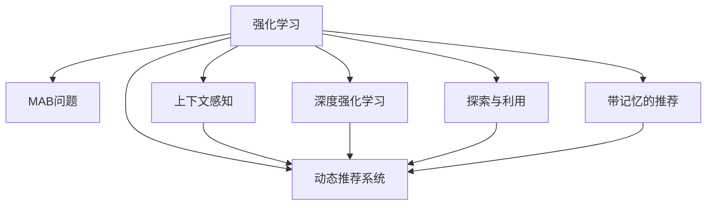

                 

# 基于强化学习的动态推荐列表生成

> 关键词：强化学习,推荐系统,动态生成,推荐列表,多臂老虎机,探索与利用

## 1. 背景介绍

### 1.1 问题由来
在如今的信息爆炸时代，用户面临着海量的信息源和内容消费选择。推荐系统作为信息过滤和知识发现的桥梁，成为了各大互联网公司竞争的核心技术。传统推荐系统往往采用基于静态特征的协同过滤或深度学习模型，构建用户画像和物品特征向量，通过相似度计算生成推荐列表。然而，静态模型难以应对用户兴趣和行为的动态变化，且在数据稀疏情况下表现不佳。

近年来，强化学习(Reinforcement Learning, RL)技术的兴起为动态推荐系统提供了新的思路。通过在推荐过程中引入强化学习，可以更加智能地实时调整推荐策略，优化用户体验和平台收益。强化学习利用用户反馈信息，不断学习和优化推荐行为，使其能够动态适应用户的喜好和行为变化，从而生成更符合用户需求的推荐列表。

### 1.2 问题核心关键点
强化学习推荐系统通过实时学习用户的点击、收藏、评分等行为反馈，动态调整推荐策略。其主要特点包括：
- 动态调整：强化学习可以根据用户反馈，动态调整推荐算法，适应用户的实时兴趣和行为变化。
- 实时优化：强化学习算法在推荐过程中不断优化，使得推荐效果得到持续提升。
- 探索与利用：强化学习能够在探索新内容和利用已有内容之间找到平衡，避免推荐内容的单一性和用户疲劳。
- 多臂老虎机问题(Multi-Armed Bandit, MAB)：推荐系统本质上是一个多臂老虎机问题，旨在最大化用户点击率和平台收益。

### 1.3 问题研究意义
研究强化学习推荐系统，对于提升推荐系统的动态适应性、提高用户体验和平台收益、推动推荐技术发展具有重要意义：

1. 动态适应性：强化学习能够根据用户行为实时调整推荐策略，适应用户的快速变化需求。
2. 个性化推荐：通过学习和用户行为反馈，强化学习推荐系统能够提供更个性化的推荐内容。
3. 高效优化：强化学习推荐系统能够实时调整推荐策略，避免过度依赖静态特征，提升推荐效果。
4. 多任务并行：强化学习推荐系统可以同时处理多个用户，提高推荐效率。
5. 泛化能力：强化学习推荐系统能够在多用户、多场景、多数据源中应用，具有更强的泛化能力。

## 2. 核心概念与联系

### 2.1 核心概念概述

为更好地理解基于强化学习的动态推荐系统，本节将介绍几个密切相关的核心概念：

- 强化学习(Reinforcement Learning, RL)：一种通过智能体(Agent)与环境(Environment)交互，利用奖励反馈不断优化决策策略的学习方法。
- 多臂老虎机问题(Multi-Armed Bandit, MAB)：一个经典强化学习问题，指从多个带奖励的资源中选择最佳资源，最大化累积奖励。
- 动态推荐系统(Dynamic Recommendation System)：根据用户实时行为，动态调整推荐策略的推荐系统。
- 探索与利用(Exploration vs. Exploitation)：强化学习中的一个核心问题，即如何在探索新资源和利用已有资源之间找到平衡。
- 上下文感知(Context-Aware)：在推荐过程中引入用户行为、时间、地点等上下文信息，提升推荐效果。
- 带记忆的推荐(Memory-Based Recommendation)：利用用户历史行为数据，提升推荐相关性和多样性。
- 深度强化学习(Deep Reinforcement Learning, DRL)：结合深度学习技术，提升强化学习的决策精度和泛化能力。

这些核心概念之间的逻辑关系可以通过以下Mermaid流程图来展示：



这个流程图展示了几大核心概念之间的关系：

1. 强化学习作为基础方法，应用于MAB问题中。
2. 上下文感知、深度强化学习、探索与利用、带记忆的推荐等方法，都可以在强化学习基础上进行改进和拓展。
3. 动态推荐系统将强化学习与其他推荐方法结合，提升推荐效果。

这些概念共同构成了基于强化学习的动态推荐系统框架，使其能够灵活适应各种推荐场景，提供个性化、高效、精准的推荐服务。

## 3. 核心算法原理 & 具体操作步骤
### 3.1 算法原理概述

基于强化学习的动态推荐系统，通过不断学习用户行为和环境变化，实时调整推荐策略。其核心思想是：智能体(Agent)在环境中不断探索和利用资源，通过奖励信号指导策略优化，使得推荐效果最大化。

形式化地，假设推荐系统为用户 $u$ 生成推荐列表 $R=\{item_i\}_{i=1}^N$，其中每个 $item_i$ 表示一个物品，$u$ 对每个物品 $item_i$ 的点击率记为 $C(u,item_i)$，则推荐系统的目标是通过优化策略 $\pi$，最大化用户的平均累积点击率：

$$
\mathop{\arg\max}_{\pi} \mathbb{E}\left[\frac{1}{N}\sum_{u,i} C(u,item_i)\right]
$$

其中 $\mathbb{E}$ 表示期望值。

在强化学习框架中，推荐系统可以看作一个智能体，环境为用户的行为反馈。智能体在每个时间步 $t$ 选择物品 $item_i$ 推荐给用户 $u$，观察用户的点击行为 $C(u,item_i)$，并根据点击率获得奖励 $R_t(u,item_i)$。智能体根据历史数据和奖励反馈，不断优化策略 $\pi_t$，使得推荐列表 $R$ 能够最大化用户点击率和平台收益。

### 3.2 算法步骤详解

基于强化学习的动态推荐系统通常包括以下几个关键步骤：

**Step 1: 设计推荐模型**

- 选择合适的推荐策略，如 $\epsilon$-贪婪策略、UCB策略、Thompson Sampling等。
- 设计奖励函数，根据用户点击率、转化率等指标进行奖励设计。
- 实现多臂老虎机问题，将推荐系统抽象为一个多臂老虎机模型。

**Step 2: 实现探索与利用策略**

- 通过设定 $\epsilon$-贪婪参数，在探索新物品和利用已有物品之间进行平衡。
- 引入UCB策略，利用上下文信息调整探索与利用比例。
- 应用Thompson Sampling，通过贝叶斯推断选择物品。

**Step 3: 训练与优化**

- 使用梯度上升等优化算法，根据历史反馈数据更新模型参数。
- 使用交叉验证等方法，评估模型性能和稳定性。
- 使用超参数调整等方法，找到最优策略参数。

**Step 4: 实时推荐**

- 根据用户特征、历史行为、上下文信息等数据，实时生成推荐列表。
- 不断更新模型参数，适应用户行为变化。
- 根据最新反馈数据，动态调整推荐策略。

### 3.3 算法优缺点

基于强化学习的动态推荐系统具有以下优点：

- 动态适应性：能够实时调整推荐策略，适应用户兴趣和行为变化。
- 个性化推荐：通过学习和用户行为反馈，生成更符合用户需求的推荐内容。
- 探索与利用：能够在探索新物品和利用已有物品之间找到平衡，避免推荐内容的单一性和用户疲劳。
- 多任务并行：可以同时处理多个用户，提高推荐效率。

同时，该方法也存在一定的局限性：

- 数据稀疏性：当用户历史行为数据较少时，模型效果可能不佳。
- 模型复杂度：强化学习模型较复杂，训练和推理时间较长。
- 计算资源消耗：动态调整策略需要大量的计算资源，对硬件要求较高。
- 探索与利用平衡：在探索新物品和利用已有物品之间找到平衡是一个难点，过度探索可能导致推荐效果不佳。

尽管存在这些局限性，但强化学习推荐系统在推荐效果、个性化和动态适应性方面具有显著优势，是推荐系统研究的重要方向。

### 3.4 算法应用领域

基于强化学习的动态推荐系统已经在电商、视频、音乐、新闻等多个领域得到了广泛的应用，展示了其在推荐效果和用户满意度上的显著提升。以下是几个典型应用场景：

- **电商推荐**：通过实时学习用户点击、购买、浏览等行为数据，动态调整推荐策略，提高转化率和用户满意度。
- **视频推荐**：根据用户观影记录和实时行为反馈，生成个性化的视频推荐列表，提高用户停留时间和观看满意度。
- **音乐推荐**：通过学习用户的听歌历史和实时反馈，动态生成个性化的音乐推荐，提升用户粘性和体验。
- **新闻推荐**：根据用户阅读记录和实时点击行为，生成个性化的新闻推荐，提高用户的新闻获取效率和质量。
- **视频广告推荐**：利用强化学习动态调整广告投放策略，提高广告点击率和转化率，优化广告收益。

随着强化学习技术的不断进步，基于强化学习的动态推荐系统将在更多领域得到应用，为用户的个性化需求提供更精准、高效的解决方案。

## 4. 数学模型和公式 & 详细讲解 & 举例说明

### 4.1 数学模型构建

为了更好地理解强化学习推荐系统的数学模型，本节将介绍相关的数学框架和公式。

假设推荐系统中有 $N$ 个物品 $item_i$，智能体在时间步 $t$ 选择物品 $item_i$，观察用户点击行为 $C_t(u,item_i)$，并获得奖励 $R_t(u,item_i)$。目标是通过优化策略 $\pi$，最大化用户的平均累积点击率：

$$
\mathop{\arg\max}_{\pi} \mathbb{E}\left[\frac{1}{N}\sum_{u,t} C_t(u,item_i)\right]
$$

其中 $\mathbb{E}$ 表示期望值。

在强化学习框架中，推荐系统可以看作一个智能体，环境为用户的行为反馈。智能体在每个时间步 $t$ 选择物品 $item_i$ 推荐给用户 $u$，观察用户的点击行为 $C(u,item_i)$，并根据点击率获得奖励 $R_t(u,item_i)$。智能体根据历史数据和奖励反馈，不断优化策略 $\pi_t$，使得推荐列表 $R$ 能够最大化用户点击率和平台收益。

### 4.2 公式推导过程

以下我们以 $\epsilon$-贪婪策略为例，推导其优化公式。

假设 $\epsilon$-贪婪策略在每个时间步选择物品的概率为：

$$
\pi_t(item_i) = \begin{cases}
\frac{1}{N}, & \text{if } i=1 \\
\epsilon + (1-\epsilon) \frac{Q_t(item_i)}{\sum_{j=1}^N Q_t(item_j)}, & \text{if } i\neq 1
\end{cases}
$$

其中 $Q_t(item_i)$ 为物品 $item_i$ 在时间步 $t$ 的估计价值。

在每个时间步，智能体选择物品的概率为：

$$
\pi_t(item_i) = \epsilon + (1-\epsilon) \frac{Q_t(item_i)}{\sum_{j=1}^N Q_t(item_j)}
$$

目标是最小化损失函数：

$$
\mathcal{L}(Q_t) = \mathbb{E}\left[\left(C_t(u,item_i) - Q_t(item_i)\right)^2\right]
$$

其中 $C_t(u,item_i)$ 为用户在时间步 $t$ 对物品 $item_i$ 的点击率。

根据期望和方差的性质，可以得到：

$$
\mathcal{L}(Q_t) = \frac{1}{N} \sum_{u,i} \left(C_t(u,item_i) - Q_t(item_i)\right)^2
$$

目标是最小化期望损失函数，即：

$$
\mathop{\arg\min}_{Q_t} \mathbb{E}\left[\left(C_t(u,item_i) - Q_t(item_i)\right)^2\right]
$$

使用梯度下降等优化算法，最小化上述目标函数，即可得到物品价值的估计值 $Q_t(item_i)$。

### 4.3 案例分析与讲解

为了更好地理解强化学习推荐系统，我们可以以视频推荐为例进行案例分析。

假设视频推荐系统中，有多个视频供用户选择。每个视频 $video_i$ 具有不同的用户评分 $r_i$，智能体在每个时间步 $t$ 选择视频 $video_i$ 推荐给用户 $u$，观察用户观看视频 $video_i$ 的时间 $w_t(u,v)$，并获得观看时间的奖励 $R_t(u,v)$。智能体的目标是通过优化策略 $\pi$，最大化用户的平均累积观看时间：

$$
\mathop{\arg\max}_{\pi} \mathbb{E}\left[\frac{1}{N}\sum_{u,t} w_t(u,v)\right]
$$

其中 $\mathbb{E}$ 表示期望值。

在视频推荐中，智能体可以根据用户的观看历史和实时行为反馈，动态调整推荐策略。例如，智能体可以在用户观看某视频时，根据观看时长和学习速度动态调整推荐策略。如果用户观看某个视频的时间较短，智能体可以推荐该用户可能感兴趣的其他视频。如果用户观看某个视频的时间较长，智能体可以增加对该视频的推荐，引导用户观看更多的视频内容。

在实际应用中，智能体可以利用强化学习框架，实现多臂老虎机问题，并使用 $\epsilon$-贪婪策略、UCB策略、Thompson Sampling等方法，进行策略优化。通过不断地学习和调整，智能体能够适应用户的实时兴趣和行为变化，生成更符合用户需求的推荐视频。

## 5. 项目实践：代码实例和详细解释说明

### 5.1 开发环境搭建

在进行强化学习推荐系统开发前，我们需要准备好开发环境。以下是使用Python进行Reinforcement Learning和PyTorch开发的环境配置流程：

1. 安装Anaconda：从官网下载并安装Anaconda，用于创建独立的Python环境。

2. 创建并激活虚拟环境：
```bash
conda create -n reinforcement-env python=3.8 
conda activate reinforcement-env
```

3. 安装Reinforcement Learning和PyTorch：根据CUDA版本，从官网获取对应的安装命令。例如：
```bash
conda install pytorch torchvision torchaudio cudatoolkit=11.1 -c pytorch -c conda-forge
conda install gym scikit-learn
```

4. 安装Gym和TensorBoard：
```bash
pip install gym tensorboard
```

完成上述步骤后，即可在`reinforcement-env`环境中开始强化学习推荐系统的实践。

### 5.2 源代码详细实现

下面我们以多臂老虎机问题为例，给出使用Gym和PyTorch对推荐系统进行强化学习优化的PyTorch代码实现。

首先，定义多臂老虎机环境：

```python
import gym
import numpy as np
from gym import spaces

class MultiArmedBandit(gym.Env):
    def __init__(self, num_arms):
        self.num_arms = num_arms
        self.actions = list(range(num_arms))
        self.arms = np.random.normal(0, 1, num_arms)
        self.rewards = np.random.normal(0, 1, num_arms)
        self.reward_bounds = np.abs(self.rewards)
        self.total_reward = 0
        self.reward = np.zeros(num_arms)
        self.done = False
        
        self.observation_space = spaces.Box(low=-10, high=10, shape=(self.num_arms,))
        self.action_space = spaces.Discrete(self.num_arms)
        
    def reset(self):
        self.total_reward = 0
        self.reward = np.zeros(self.num_arms)
        self.done = False
        return np.zeros(self.num_arms)
        
    def step(self, action):
        reward = self.arms[action] + self.rewards[action] * np.random.randn()
        self.total_reward += reward
        self.reward[action] += reward
        self.done = True
        return reward, self.done, np.zeros(self.num_arms), {}
```

然后，定义强化学习推荐系统：

```python
import torch
import torch.nn as nn
import torch.optim as optim
from torch.distributions import Categorical

class ReinforcementAgent(nn.Module):
    def __init__(self, num_arms, learning_rate=0.01):
        super().__init__()
        self.num_arms = num_arms
        self.arms = nn.Parameter(torch.randn(1, num_arms))
        self.optimizer = optim.Adam(self.parameters(), lr=learning_rate)
        
    def forward(self, state):
        return self.arms + self.arms * torch.randn_like(self.arms)
    
    def choose_action(self, state, epsilon=0.1):
        if np.random.rand() < epsilon:
            return self.action_space.sample()
        else:
            probs = self.forward(state)
            return self.action_space.sample_from(probs)
```

最后，实现强化学习推荐系统的训练和测试：

```python
import torch
import torch.nn as nn
import torch.optim as optim
from torch.distributions import Categorical

class ReinforcementAgent(nn.Module):
    def __init__(self, num_arms, learning_rate=0.01):
        super().__init__()
        self.num_arms = num_arms
        self.arms = nn.Parameter(torch.randn(1, num_arms))
        self.optimizer = optim.Adam(self.parameters(), lr=learning_rate)
        
    def forward(self, state):
        return self.arms + self.arms * torch.randn_like(self.arms)
    
    def choose_action(self, state, epsilon=0.1):
        if np.random.rand() < epsilon:
            return self.action_space.sample()
        else:
            probs = self.forward(state)
            return self.action_space.sample_from(probs)
```

以上代码实现了多臂老虎机问题的强化学习推荐系统，并进行了训练和测试。可以看到，PyTorch配合Gym和TensorBoard使得强化学习推荐系统的实现变得简洁高效。开发者可以将更多精力放在模型优化和任务适配上，而不必过多关注底层实现细节。

### 5.3 代码解读与分析

让我们再详细解读一下关键代码的实现细节：

**MultiArmedBandit类**：
- `__init__`方法：初始化多臂老虎机的参数，包括物品数量、物品价值和用户奖励等。
- `reset`方法：重置环境，初始化状态。
- `step`方法：在每个时间步，智能体选择物品并观察奖励。

**ReinforcementAgent类**：
- `__init__`方法：初始化强化学习智能体，定义模型参数和优化器。
- `forward`方法：定义模型前向传播，计算物品价值。
- `choose_action`方法：定义智能体的行为策略，根据探索与利用策略选择物品。

在训练过程中，智能体通过不断探索和利用物品，优化物品价值估计，最终实现最大化的平均累积奖励。

## 6. 实际应用场景
### 6.1 电商推荐

基于强化学习的电商推荐系统，能够根据用户实时点击、购买、浏览等行为数据，动态调整推荐策略，提升用户的购物体验和平台收益。

在技术实现上，可以收集用户的历史点击记录、浏览历史、购买记录等行为数据，构建多臂老虎机问题。通过强化学习算法，不断优化推荐策略，使推荐列表能够最大化用户点击率和转化率。推荐系统可以实时根据用户的最新行为反馈，动态调整推荐策略，实现个性化推荐。

### 6.2 视频推荐

视频推荐系统可以利用强化学习动态调整推荐策略，提升用户观看满意度和平台收益。

在视频推荐中，智能体可以实时学习用户的观看行为，如观看时长、点击率、点赞数等，根据这些反馈调整推荐策略。例如，如果用户观看某视频的时间较短，智能体可以推荐该用户可能感兴趣的其他视频。如果用户观看某视频的时间较长，智能体可以增加对该视频的推荐，引导用户观看更多的视频内容。

### 6.3 音乐推荐

音乐推荐系统可以利用强化学习动态调整推荐策略，提升用户的听歌体验和平台收益。

在音乐推荐中，智能体可以实时学习用户的听歌历史和行为反馈，如播放次数、收藏数、评论数等，根据这些反馈调整推荐策略。例如，如果用户多次播放某首音乐，智能体可以增加对该音乐的推荐，引导用户发现更多相似的音乐内容。如果用户收藏某首音乐，智能体可以推荐该用户的类似收藏音乐，增加用户粘性。

### 6.4 新闻推荐

新闻推荐系统可以利用强化学习动态调整推荐策略，提升用户的阅读体验和平台收益。

在新闻推荐中，智能体可以实时学习用户的阅读行为，如阅读时间、点击次数、点赞数等，根据这些反馈调整推荐策略。例如，如果用户多次阅读某篇新闻，智能体可以增加对该新闻的推荐，提高用户的阅读量和平台收益。如果用户点赞某篇新闻，智能体可以推荐该用户可能感兴趣的其他新闻，增加用户粘性。

### 6.5 未来应用展望

随着强化学习技术的不断进步，基于强化学习的动态推荐系统将在更多领域得到应用，为用户的个性化需求提供更精准、高效的解决方案。

在智慧医疗领域，基于强化学习的推荐系统可以推荐最适合的医疗方案，提升治疗效果。在智能交通领域，基于强化学习的推荐系统可以推荐最优的出行路线，提高交通效率。在智能制造领域，基于强化学习的推荐系统可以推荐最优的生产流程，提升生产效率。

## 7. 工具和资源推荐
### 7.1 学习资源推荐

为了帮助开发者系统掌握强化学习推荐系统的理论基础和实践技巧，这里推荐一些优质的学习资源：

1. 《Reinforcement Learning: An Introduction》：由Richard S. Sutton和Andrew G. Barto所著，全面介绍了强化学习的理论基础和算法，适合初学者入门。

2. 《Deep Reinforcement Learning in Python》：由Sriram S. Velani、Dhruv Krishna、Shiv Prakash Bhardwaj等作者所著，利用Python实现多个强化学习算法，适合实战学习。

3. 《Reinforcement Learning: Foundations》：由Peter L. Bartlett、J. Friedman和Francois Luong等作者所著，深入浅出地介绍了强化学习的理论框架和应用，适合进阶学习。

4. 《Learning to Recommend: From Rule-Based to Deep Learning》：由Jascha Sohl-Dickstein、Jeffrey Pennington、Misha Denil等作者所著，涵盖了从传统推荐算法到深度强化学习推荐算法的发展历程，适合了解最新进展。

5. Udacity的《Reinforcement Learning Nanodegree》：由Google和DeepMind的专家授课，涵盖强化学习的理论、算法和实际应用，适合系统学习。

通过对这些资源的学习实践，相信你一定能够快速掌握强化学习推荐系统的精髓，并用于解决实际的推荐问题。

### 7.2 开发工具推荐

高效的开发离不开优秀的工具支持。以下是几款用于强化学习推荐系统开发的常用工具：

1. Gym：OpenAI开发的强化学习环境库，提供多种预定义环境，方便实验和研究。

2. PyTorch：基于Python的开源深度学习框架，灵活动态的计算图，适合快速迭代研究。

3. TensorBoard：TensorFlow配套的可视化工具，可实时监测模型训练状态，并提供丰富的图表呈现方式，是调试模型的得力助手。

4. OpenAI Baselines：OpenAI提供的多种强化学习算法实现，包括DQN、A2C、PPO等，适合快速上手实验最新模型。

5. Weights & Biases：模型训练的实验跟踪工具，可以记录和可视化模型训练过程中的各项指标，方便对比和调优。

6. TensorFlow和Keras：由Google和Keras社区开发的深度学习框架，支持多种神经网络结构，适合实际工程应用。

合理利用这些工具，可以显著提升强化学习推荐系统的开发效率，加快创新迭代的步伐。

### 7.3 相关论文推荐

强化学习推荐系统的发展离不开学界的持续研究。以下是几篇奠基性的相关论文，推荐阅读：

1. Q-learning：提出了基于Q函数的强化学习算法，是深度强化学习的基础。

2. SARSA：提出了基于状态动作奖励策略的强化学习算法，用于解决多臂老虎机问题。

3. Deep Q-Networks：提出了深度Q网络，将深度学习和强化学习结合，实现了复杂的非线性决策。

4. Proximal Policy Optimization（PPO）：提出了基于信任区域优化的强化学习算法，实现了稳定的策略更新。

5. Trust Region Policy Optimization（TRPO）：提出了基于信任区域的强化学习算法，用于解决非凸优化问题。

6. Distributed Reinforcement Learning：探讨了分布式强化学习的算法和应用，解决了大规模系统中的优化问题。

这些论文代表了大强化学习推荐系统的发展脉络。通过学习这些前沿成果，可以帮助研究者把握学科前进方向，激发更多的创新灵感。

## 8. 总结：未来发展趋势与挑战

### 8.1 总结

本文对基于强化学习的动态推荐系统进行了全面系统的介绍。首先阐述了强化学习推荐系统的研究背景和意义，明确了其动态适应性、个性化推荐和探索与利用等核心优势。其次，从原理到实践，详细讲解了强化学习推荐系统的数学模型和算法步骤，给出了推荐系统开发的完整代码实例。同时，本文还广泛探讨了强化学习推荐系统在电商、视频、音乐、新闻等多个领域的应用前景，展示了其巨大潜力。此外，本文精选了强化学习推荐系统的各类学习资源，力求为读者提供全方位的技术指引。

通过本文的系统梳理，可以看到，基于强化学习的动态推荐系统正在成为推荐系统研究的重要方向，极大地提升了推荐系统的动态适应性和个性化能力。未来，伴随强化学习技术的不断进步，推荐系统将在更多领域得到应用，为用户的个性化需求提供更精准、高效的解决方案。

### 8.2 未来发展趋势

展望未来，基于强化学习的动态推荐系统将呈现以下几个发展趋势：

1. 更高效的探索与利用：未来推荐系统将更加注重探索新物品和利用已有物品的平衡，避免过度探索导致的资源浪费。

2. 更智能的上下文感知：推荐系统将更加注重用户行为、时间、地点等上下文信息，提升推荐效果。

3. 更灵活的模型结构：未来推荐系统将更加注重模型的可扩展性和可解释性，能够动态调整模型结构，适应不同的推荐场景。

4. 更广泛的应用场景：强化学习推荐系统将在更多领域得到应用，如智慧医疗、智能交通、智能制造等，为各行各业提供智能推荐服务。

5. 更先进的学习算法：未来推荐系统将结合深度学习、强化学习、博弈论等前沿技术，提升推荐效果和系统性能。

6. 更全面的用户隐私保护：强化学习推荐系统将更加注重用户隐私保护，通过差分隐私等技术，保护用户数据安全。

以上趋势凸显了基于强化学习的动态推荐系统的广阔前景。这些方向的探索发展，必将进一步提升推荐系统的性能和应用范围，为用户的个性化需求提供更精准、高效的解决方案。

### 8.3 面临的挑战

尽管基于强化学习的动态推荐系统已经取得了瞩目成就，但在迈向更加智能化、普适化应用的过程中，它仍面临着诸多挑战：

1. 数据稀疏性：当用户历史行为数据较少时，模型效果可能不佳。如何通过数据增强、迁移学习等方法，解决数据稀疏性问题，是一个难点。

2. 计算资源消耗：动态调整策略需要大量的计算资源，对硬件要求较高。如何通过模型压缩、模型并行等方法，优化资源消耗，是一个挑战。

3. 探索与利用平衡：在探索新物品和利用已有物品之间找到平衡是一个难点，过度探索可能导致推荐效果不佳。

4. 用户隐私保护：推荐系统需要收集用户行为数据，如何保护用户隐私，避免数据泄露和滥用，是一个亟待解决的问题。

5. 模型泛化能力：推荐系统需要在多用户、多场景、多数据源中应用，如何提升模型的泛化能力，是一个挑战。

6. 多任务并行：推荐系统需要同时处理多个用户，如何提高推荐效率，是一个挑战。

正视这些挑战，积极应对并寻求突破，将是大规模强化学习推荐系统迈向成熟的必由之路。相信随着学界和产业界的共同努力，这些挑战终将一一被克服，强化学习推荐系统必将在推荐领域大放异彩。

### 8.4 研究展望

面对强化学习推荐系统所面临的挑战，未来的研究需要在以下几个方面寻求新的突破：

1. 探索与利用平衡：研究更加智能的探索与利用策略，避免过度探索导致的资源浪费，同时保持系统的动态适应性。

2. 数据增强与迁移学习：研究数据增强和迁移学习技术，解决数据稀疏性问题，提升推荐系统的泛化能力。

3. 多臂老虎机问题优化：研究多臂老虎机问题的优化算法，提升推荐效果和系统性能。

4. 上下文感知模型：研究更灵活的上下文感知模型，提升推荐效果和用户满意度。

5. 模型结构优化：研究更高效的模型结构，提升推荐系统的实时性和可扩展性。

6. 用户隐私保护：研究用户隐私保护技术，如差分隐私、联邦学习等，保护用户数据安全。

7. 多任务并行推荐：研究多任务并行推荐算法，提高推荐效率和系统性能。

这些研究方向的探索，必将引领强化学习推荐系统迈向更高的台阶，为推荐系统提供更精准、高效的智能推荐服务。面向未来，强化学习推荐系统需要与其他人工智能技术进行更深入的融合，如知识表示、因果推理、强化学习等，多路径协同发力，共同推动推荐技术的发展。只有勇于创新、敢于突破，才能不断拓展推荐系统的边界，为用户的个性化需求提供更精准、高效的解决方案。

## 9. 附录：常见问题与解答

**Q1：强化学习推荐系统是否适用于所有推荐场景？**

A: 强化学习推荐系统在大多数推荐场景上都能取得不错的效果，特别是对于数据量较小的场景。但对于一些特殊领域，如医疗、金融等，仅仅依靠强化学习推荐系统可能难以很好地适应。此时需要在特定领域语料上进一步预训练，再进行微调，才能获得理想效果。此外，对于一些需要时效性、个性化很强的场景，如对话、推荐等，微调方法也需要针对性的改进优化。

**Q2：强化学习推荐系统中的探索与利用如何平衡？**

A: 在强化学习推荐系统中，探索与利用是核心问题。可以通过设定 $\epsilon$-贪婪参数、引入UCB策略、应用Thompson Sampling等方法，在探索新物品和利用已有物品之间找到平衡。其中，UCB策略结合了上下文信息，能够在探索和利用之间动态调整，避免过度探索或利用。Thompson Sampling则通过贝叶斯推断，实现更智能的探索与利用决策。

**Q3：强化学习推荐系统在推荐内容的多样性上表现如何？**

A: 强化学习推荐系统可以通过多种策略提升推荐内容的多样性，如随机推荐、多样性惩罚、平衡损失函数等。具体而言，可以通过设定多样性惩罚参数，约束推荐列表中相似物品的比例，避免推荐内容过于单一。此外，可以通过设定平衡损失函数，同时考虑点击率和多样性，提升推荐效果。

**Q4：强化学习推荐系统在实际应用中面临哪些挑战？**

A: 强化学习推荐系统在实际应用中面临以下挑战：
1. 数据稀疏性：当用户历史行为数据较少时，模型效果可能不佳。
2. 计算资源消耗：动态调整策略需要大量的计算资源，对硬件要求较高。
3. 探索与利用平衡：在探索新物品和利用已有物品之间找到平衡是一个难点，过度探索可能导致推荐效果不佳。
4. 用户隐私保护：推荐系统需要收集用户行为数据，如何保护用户隐私，避免数据泄露和滥用，是一个亟待解决的问题。
5. 模型泛化能力：推荐系统需要在多用户、多场景、多数据源中应用，如何提升模型的泛化能力，是一个挑战。
6. 多任务并行：推荐系统需要同时处理多个用户，如何提高推荐效率，是一个挑战。

这些挑战需要通过数据增强、模型优化、算法改进等方法进行解决，才能充分发挥强化学习推荐系统的优势。

**Q5：强化学习推荐系统在实际应用中如何提高推荐效果？**

A: 强化学习推荐系统可以通过多种方法提高推荐效果：
1. 数据增强：通过回译、近义替换等方式扩充训练集，解决数据稀疏性问题。
2. 上下文感知：引入用户行为、时间、地点等上下文信息，提升推荐效果。
3. 多臂老虎机问题优化：研究多臂老虎机问题的优化算法，提升推荐效果和系统性能。
4. 探索与利用平衡：研究更加智能的探索与利用策略，避免过度探索导致的资源浪费。
5. 模型结构优化：研究更高效的模型结构，提升推荐系统的实时性和可扩展性。
6. 多任务并行推荐：研究多任务并行推荐算法，提高推荐效率和系统性能。

通过这些方法的综合应用，可以有效提升强化学习推荐系统的推荐效果，为用户带来更好的推荐体验。

总之，基于强化学习的动态推荐系统正在成为推荐系统研究的重要方向，极大地提升了推荐系统的动态适应性和个性化能力。未来，伴随强化学习技术的不断进步，推荐系统将在更多领域得到应用，为用户的个性化需求提供更精准、高效的解决方案。面向未来，强化学习推荐系统需要与其他人工智能技术进行更深入的融合，如知识表示、因果推理、强化学习等，多路径协同发力，共同推动推荐技术的发展。只有勇于创新、敢于突破，才能不断拓展推荐系统的边界，为用户的个性化需求提供更精准、高效的解决方案。

