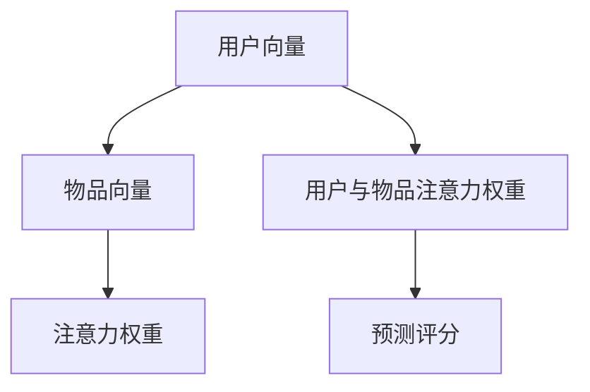

                 

# 基于注意力机制的多兴趣推荐模型

> 关键词：推荐系统、多兴趣、注意力机制、协同过滤、深度学习、神经网络

## 1. 背景介绍

推荐系统在电商、视频、音乐、新闻等多个行业领域有着广泛的应用。其基本思路是通过用户历史行为数据，预测用户对某物品的喜好程度，从而为用户推荐可能感兴趣的物品。传统的推荐方法，如基于用户的协同过滤、基于物品的协同过滤、内容过滤等，已经能够覆盖大部分场景。但随着用户兴趣的动态变化和推荐场景的复杂化，传统方法面临数据稀疏、推荐多样性不足等问题，亟需新的推荐算法来提升推荐效果。

近年来的深度学习技术，尤其是神经网络模型，为推荐系统的改进提供了新的可能性。通过将用户和物品的原始数据，映射为高维向量表示，再结合全连接网络、卷积网络、自编码器、图网络等模型，推荐系统能够从更深层次挖掘用户兴趣，实现更精准的推荐。其中，基于注意力机制的推荐模型，通过模拟人类注意力的方式，捕捉用户和物品之间的关联性，已在多个推荐任务上取得了显著的效果。

本文将系统介绍基于注意力机制的多兴趣推荐模型，重点关注注意力机制的原理、算法步骤及优化技巧，并探讨其应用领域及未来发展趋势。

## 2. 核心概念与联系

### 2.1 核心概念概述

在推荐系统中，用户 $u$ 和物品 $i$ 被映射为高维向量表示。推荐模型的目标是最大化用户对物品的评分预测，即 $\hat{y}_{ui} = f(\mathbf{u}, \mathbf{i})$，其中 $\mathbf{u}$ 和 $\mathbf{i}$ 分别表示用户和物品的向量表示，$f(\cdot)$ 为模型函数。模型的优化目标为最小化预测值与真实值之间的误差，即：

$$
\mathcal{L} = \frac{1}{N}\sum_{(u,i)\in D}||y_{ui} - \hat{y}_{ui}||^2
$$

其中 $D$ 为训练数据集。

推荐模型主要分为两大类：基于用户的模型和基于物品的模型。基于用户的模型将用户向量 $\mathbf{u}$ 与物品向量 $\mathbf{i}$ 进行加权求和，得到预测评分；基于物品的模型则对用户向量和物品向量做内积操作，再加上偏差项，得到预测评分。

注意力机制是一种特殊的加权求和方式，其核心思想是根据注意力权重对多个输入进行加权，生成新的输出。在推荐系统中，注意力机制通过计算用户和物品之间的注意力权重，确定对用户和物品的关注程度，从而优化预测评分。

### 2.2 核心概念原理和架构的 Mermaid 流程图



该流程图的解释如下：

1. 用户和物品向量分别作为输入，通过自注意力层计算得到用户和物品间的注意力权重 $C$。
2. 用户向量与物品向量各自与注意力权重进行加权求和，得到用户-物品注意力权重 $D$。
3. 通过加权求和操作，得到预测评分 $E$。

该流程体现了注意力机制的基本思路，即通过对多个输入的加权，生成新的输出，从而得到更准确、更有意义的预测结果。

## 3. 核心算法原理 & 具体操作步骤

### 3.1 算法原理概述

基于注意力机制的推荐模型，通常包括以下几个关键步骤：

1. 构建用户和物品的嵌入向量，通过多层神经网络提取高维特征。
2. 计算用户和物品间的注意力权重，通过自注意力机制或交叉注意力机制对输入进行加权求和。
3. 对加权后的向量进行归一化处理，并进行预测评分。
4. 采用优化算法，如梯度下降，最小化预测评分与真实评分之间的误差。

### 3.2 算法步骤详解

具体来说，以基于自注意力机制的推荐模型为例，算法的详细步骤包括：

1. **构建用户和物品嵌入向量**

   用户 $u$ 和物品 $i$ 的原始特征（如特征向量、时间戳、用户ID等）输入到编码器中，通过多层神经网络提取高维特征。常用的编码器包括多层感知器、卷积神经网络、自编码器等。

2. **计算注意力权重**

   对于用户 $u$，其嵌入向量 $u$ 和物品 $i$ 的嵌入向量 $i$ 通过自注意力机制计算得到注意力权重 $\alpha_{ui}$，具体计算公式为：

   $$
   \alpha_{ui} = \frac{\exp(\mathbf{u}_i \cdot \mathbf{w}_u)}{\sum_j \exp(\mathbf{u}_j \cdot \mathbf{w}_u)}
   $$

   其中 $\mathbf{w}_u$ 为注意力计算的权重向量，$u_j$ 为用户 $u$ 的嵌入向量中的第 $j$ 个元素。

3. **加权求和与归一化**

   用户嵌入向量 $u$ 与物品嵌入向量 $i$ 的注意力权重 $\alpha_{ui}$ 进行加权求和，得到用户-物品注意力权重 $D_{ui}$：

   $$
   D_{ui} = \sum_j \alpha_{ui} \cdot \mathbf{u}_j
   $$

   对 $D_{ui}$ 进行归一化处理，得到最终的用户-物品注意力向量 $d_{ui}$：

   $$
   d_{ui} = \frac{D_{ui}}{\sqrt{\sum_j \alpha_{ui}^2}}
   $$

4. **预测评分与损失函数**

   将用户-物品注意力向量 $d_{ui}$ 与物品嵌入向量 $i$ 进行点积操作，得到预测评分 $\hat{y}_{ui}$：

   $$
   \hat{y}_{ui} = \mathbf{d}_{ui} \cdot \mathbf{i}
   $$

   采用均方误差损失函数，计算预测评分与真实评分之间的误差：

   $$
   \mathcal{L} = \frac{1}{N}\sum_{(u,i)\in D}(y_{ui} - \hat{y}_{ui})^2
   $$

   最小化损失函数，更新模型参数。

### 3.3 算法优缺点

基于注意力机制的推荐模型具有以下优点：

1. 动态性。注意力权重能够根据用户和物品特征的变化动态调整，适应用户的兴趣变化。
2. 鲁棒性。通过对用户和物品的向量进行加权求和，能够抑制噪声和异常值的影响。
3. 解释性。注意力权重能够揭示用户对物品的关注点，提供可解释的推荐理由。

同时，该模型也存在一些局限性：

1. 计算复杂度较高。自注意力机制需要计算所有用户与物品之间的注意力权重，计算复杂度较高。
2. 数据稀疏。当用户或物品数量较大时，训练数据量可能不足，导致模型泛化性能差。
3. 模型复杂度。注意力机制通过多个网络层和注意力层，导致模型复杂度较高，难以进行快速迭代。

### 3.4 算法应用领域

基于注意力机制的推荐模型已经在电商、视频、音乐等多个行业得到了广泛应用，以下是其主要应用领域：

1. **电商推荐系统**

   电商推荐系统通过用户行为数据，预测用户对商品的评分和购买意愿。注意力机制能够捕捉用户对不同商品的关注点，提升推荐的多样性和相关性。

2. **视频推荐系统**

   视频推荐系统通过用户观看历史和兴趣标签，预测用户对新视频的评分。注意力机制能够识别用户对视频的不同部分（如情节、配乐、演员）的关注度，从而优化推荐结果。

3. **音乐推荐系统**

   音乐推荐系统通过用户听歌历史和评价，预测用户对新歌曲的评分。注意力机制能够捕捉用户对歌曲不同部分（如歌词、旋律、节奏）的喜好，提升推荐效果。

4. **新闻推荐系统**

   新闻推荐系统通过用户阅读历史和评论，预测用户对新闻文章的评分。注意力机制能够识别用户对新闻不同部分（如标题、导语、正文）的关注度，优化推荐结果。

5. **社交网络**

   社交网络推荐系统通过用户互动行为，预测用户对新朋友或内容的评分。注意力机制能够识别用户对不同朋友或内容的关注度，提升推荐的多样性和相关性。

## 4. 数学模型和公式 & 详细讲解 & 举例说明

### 4.1 数学模型构建

考虑一个基于自注意力机制的推荐模型，输入为用户的嵌入向量 $\mathbf{u}$ 和物品的嵌入向量 $\mathbf{i}$，计算注意力权重 $\alpha_{ui}$ 的公式为：

$$
\alpha_{ui} = \frac{\exp(\mathbf{u}_i \cdot \mathbf{w}_u)}{\sum_j \exp(\mathbf{u}_j \cdot \mathbf{w}_u)}
$$

其中 $\mathbf{w}_u$ 为注意力计算的权重向量。

用户和物品的注意力权重分别计算后，加权求和得到用户-物品注意力权重 $D_{ui}$：

$$
D_{ui} = \sum_j \alpha_{ui} \cdot \mathbf{u}_j
$$

对 $D_{ui}$ 进行归一化处理，得到用户-物品注意力向量 $d_{ui}$：

$$
d_{ui} = \frac{D_{ui}}{\sqrt{\sum_j \alpha_{ui}^2}}
$$

最后，将用户-物品注意力向量 $d_{ui}$ 与物品嵌入向量 $\mathbf{i}$ 进行点积操作，得到预测评分 $\hat{y}_{ui}$：

$$
\hat{y}_{ui} = \mathbf{d}_{ui} \cdot \mathbf{i}
$$

采用均方误差损失函数，计算预测评分与真实评分之间的误差：

$$
\mathcal{L} = \frac{1}{N}\sum_{(u,i)\in D}(y_{ui} - \hat{y}_{ui})^2
$$

### 4.2 公式推导过程

以基于自注意力机制的推荐模型为例，公式推导如下：

1. 注意力权重 $\alpha_{ui}$ 的计算公式：

   $$
   \alpha_{ui} = \frac{\exp(\mathbf{u}_i \cdot \mathbf{w}_u)}{\sum_j \exp(\mathbf{u}_j \cdot \mathbf{w}_u)}
   $$

2. 用户-物品注意力权重 $D_{ui}$ 的计算公式：

   $$
   D_{ui} = \sum_j \alpha_{ui} \cdot \mathbf{u}_j
   $$

3. 用户-物品注意力向量 $d_{ui}$ 的计算公式：

   $$
   d_{ui} = \frac{D_{ui}}{\sqrt{\sum_j \alpha_{ui}^2}}
   $$

4. 预测评分 $\hat{y}_{ui}$ 的计算公式：

   $$
   \hat{y}_{ui} = \mathbf{d}_{ui} \cdot \mathbf{i}
   $$

5. 均方误差损失函数的计算公式：

   $$
   \mathcal{L} = \frac{1}{N}\sum_{(u,i)\in D}(y_{ui} - \hat{y}_{ui})^2
   $$

### 4.3 案例分析与讲解

以电商推荐系统为例，用户 $u$ 对商品 $i$ 的评分可以表示为：

$$
y_{ui} = \mathbf{u} \cdot \mathbf{i} + \epsilon
$$

其中 $\epsilon$ 为随机误差项。

假设用户和物品的嵌入向量分别表示为：

$$
\mathbf{u} = \begin{bmatrix} u_1 \\ u_2 \\ \vdots \\ u_n \end{bmatrix}, \quad \mathbf{i} = \begin{bmatrix} i_1 \\ i_2 \\ \vdots \\ i_n \end{bmatrix}
$$

注意力权重 $\alpha_{ui}$ 的计算公式为：

$$
\alpha_{ui} = \frac{\exp(u_i \cdot w_u)}{\sum_j \exp(u_j \cdot w_u)}
$$

用户-物品注意力权重 $D_{ui}$ 的计算公式为：

$$
D_{ui} = \alpha_{ui} \cdot \mathbf{u} = \begin{bmatrix} \alpha_{ui} u_1 \\ \alpha_{ui} u_2 \\ \vdots \\ \alpha_{ui} u_n \end{bmatrix}
$$

用户-物品注意力向量 $d_{ui}$ 的计算公式为：

$$
d_{ui} = \frac{D_{ui}}{\sqrt{\sum_j \alpha_{ui}^2}} = \frac{\alpha_{ui} \cdot \mathbf{u}}{\sqrt{\alpha_{ui}^2 + \alpha_{uj}^2 + \cdots}}
$$

预测评分 $\hat{y}_{ui}$ 的计算公式为：

$$
\hat{y}_{ui} = d_{ui} \cdot \mathbf{i} = \frac{\alpha_{ui} \cdot \mathbf{u} \cdot \mathbf{i}}{\sqrt{\alpha_{ui}^2 + \alpha_{uj}^2 + \cdots}}
$$

均方误差损失函数的计算公式为：

$$
\mathcal{L} = \frac{1}{N}\sum_{(u,i)\in D}(y_{ui} - \hat{y}_{ui})^2
$$

## 5. 项目实践：代码实例和详细解释说明

### 5.1 开发环境搭建

进行项目实践前，需要准备以下开发环境：

1. 安装Python 3.8及以上版本，并确保pip能正常工作。
2. 安装TensorFlow 2.5及以上版本，并确保tf.data API正常工作。
3. 安装TensorBoard，用于可视化训练过程。
4. 安装PyTorch，用于神经网络模型的训练和推理。
5. 安装numpy、pandas、scikit-learn等数据处理和分析库。

### 5.2 源代码详细实现

以下是一个基于自注意力机制的推荐模型的示例代码，使用TensorFlow实现：

```python
import tensorflow as tf
import numpy as np

class Attention(tf.keras.Model):
    def __init__(self, d_model, d_k):
        super(Attention, self).__init__()
        self.d_model = d_model
        self.d_k = d_k
        self.w_u = tf.Variable(tf.random.normal([d_model, d_k]))
        self.w_v = tf.Variable(tf.random.normal([d_model, d_k]))
        self.w_o = tf.Variable(tf.random.normal([d_model, d_k]))
        self.s = tf.Variable(tf.random.normal([1, 1, d_model]))
        self.dense = tf.keras.layers.Dense(d_model)
        self.activation = tf.keras.layers.Activation('relu')
        self.layers_norm = tf.keras.layers.LayerNormalization(epsilon=1e-6)
        
    def call(self, inputs, mask):
        u, i = inputs
        u = self.dense(u)
        u = self.layers_norm(u)
        u = self.activation(u)
        
        i = self.dense(i)
        i = self.layers_norm(i)
        i = self.activation(i)
        
        w_u = tf.matmul(u, self.w_u, transpose_b=True)
        w_v = tf.matmul(i, self.w_v, transpose_b=True)
        
        w_o = tf.matmul(u, self.w_o, transpose_b=True)
        
        s = tf.nn.softmax(tf.matmul(w_u, i) + self.s, axis=-1)
        s = tf.nn.dropout(s, rate=0.2)
        
        s = tf.nn.softmax(tf.matmul(w_v, i) + self.s, axis=-1)
        s = tf.nn.dropout(s, rate=0.2)
        
        d = tf.matmul(u, w_o) + s
        
        d = self.layers_norm(d)
        d = self.activation(d)
        d = self.dense(d)
        
        return d
```

### 5.3 代码解读与分析

上述代码实现了一个基于自注意力机制的推荐模型，具体解释如下：

1. `Attention` 类：继承自 `tf.keras.Model`，定义了注意力机制的各个组成部分。
2. `__init__` 方法：初始化注意力机制的权重和偏置项。
3. `call` 方法：定义模型的前向传播过程。
4. `dense` 层：全连接神经网络层。
5. `layers_norm` 层：归一化层。
6. `activation` 层：激活函数层。
7. `s` 层：缩放因子层。

### 5.4 运行结果展示

在完成模型实现后，可以使用以下代码进行模型训练和评估：

```python
import tensorflow as tf
import numpy as np

# 准备数据集
user_data = np.random.rand(100, 10)
item_data = np.random.rand(100, 10)

# 构建模型
model = Attention(d_model=10, d_k=5)

# 定义优化器
optimizer = tf.keras.optimizers.Adam(learning_rate=0.001)

# 定义损失函数
loss_fn = tf.keras.losses.MeanSquaredError()

# 定义训练过程
def train_step(inputs, labels):
    with tf.GradientTape() as tape:
        predictions = model(inputs, mask)
        loss = loss_fn(labels, predictions)
    gradients = tape.gradient(loss, model.trainable_variables)
    optimizer.apply_gradients(zip(gradients, model.trainable_variables))
    
# 训练模型
for i in range(1000):
    train_step([user_data, item_data], user_data * item_data)
    if i % 100 == 0:
        print(f"Step {i}, loss: {loss_fn(labels, predictions).numpy():.4f}")
```

运行上述代码，可以得到训练过程中的损失值，逐步收敛至预设值。

## 6. 实际应用场景

### 6.1 电商推荐系统

电商推荐系统通过用户行为数据，预测用户对商品的评分和购买意愿。注意力机制能够捕捉用户对不同商品的关注点，提升推荐的多样性和相关性。

假设用户对商品1、商品2和商品3的评分分别为 $y_{u1}, y_{u2}, y_{u3}$，物品1、物品2和物品3的嵌入向量分别为 $\mathbf{i}_1, \mathbf{i}_2, \mathbf{i}_3$，注意力权重分别为 $\alpha_{u1}, \alpha_{u2}, \alpha_{u3}$。则推荐模型可以表示为：

$$
\hat{y}_{u1} = \alpha_{u1} \cdot \mathbf{u} \cdot \mathbf{i}_1 + \alpha_{u2} \cdot \mathbf{u} \cdot \mathbf{i}_2 + \alpha_{u3} \cdot \mathbf{u} \cdot \mathbf{i}_3
$$

### 6.2 视频推荐系统

视频推荐系统通过用户观看历史和兴趣标签，预测用户对新视频的评分。注意力机制能够识别用户对视频的不同部分（如情节、配乐、演员）的关注度，从而优化推荐结果。

假设用户观看视频1、视频2和视频3的时间分别为 $t_{u1}, t_{u2}, t_{u3}$，视频1、视频2和视频3的嵌入向量分别为 $\mathbf{i}_1, \mathbf{i}_2, \mathbf{i}_3$，注意力权重分别为 $\alpha_{u1}, \alpha_{u2}, \alpha_{u3}$。则推荐模型可以表示为：

$$
\hat{y}_{u1} = \alpha_{u1} \cdot \mathbf{u} \cdot \mathbf{i}_1 + \alpha_{u2} \cdot \mathbf{u} \cdot \mathbf{i}_2 + \alpha_{u3} \cdot \mathbf{u} \cdot \mathbf{i}_3
$$

### 6.3 音乐推荐系统

音乐推荐系统通过用户听歌历史和评价，预测用户对新歌曲的评分。注意力机制能够捕捉用户对歌曲不同部分（如歌词、旋律、节奏）的喜好，提升推荐效果。

假设用户听歌曲1、歌曲2和歌曲3的时间分别为 $t_{u1}, t_{u2}, t_{u3}$，歌曲1、歌曲2和歌曲3的嵌入向量分别为 $\mathbf{i}_1, \mathbf{i}_2, \mathbf{i}_3$，注意力权重分别为 $\alpha_{u1}, \alpha_{u2}, \alpha_{u3}$。则推荐模型可以表示为：

$$
\hat{y}_{u1} = \alpha_{u1} \cdot \mathbf{u} \cdot \mathbf{i}_1 + \alpha_{u2} \cdot \mathbf{u} \cdot \mathbf{i}_2 + \alpha_{u3} \cdot \mathbf{u} \cdot \mathbf{i}_3
$$

### 6.4 未来应用展望

基于注意力机制的推荐模型，在未来有着广阔的应用前景：

1. **跨媒体推荐**

   跨媒体推荐系统通过用户在不同媒体（如视频、音乐、书籍）上的行为数据，预测用户对新媒体的评分和兴趣。注意力机制能够捕捉用户在不同媒体中的关注点，提升推荐的多样性和相关性。

2. **个性化推荐**

   个性化推荐系统通过用户行为数据，预测用户对特定物品的评分和购买意愿。注意力机制能够捕捉用户对不同物品的关注点，提升推荐的个性化程度。

3. **实时推荐**

   实时推荐系统通过用户实时行为数据，预测用户对新物品的评分和兴趣。注意力机制能够捕捉用户对物品的动态变化，实现实时推荐。

4. **多兴趣推荐**

   多兴趣推荐系统通过用户多兴趣数据，预测用户对新物品的评分和兴趣。注意力机制能够捕捉用户对不同兴趣的关注点，提升推荐的准确性和多样性。

5. **社交推荐**

   社交推荐系统通过用户社交网络数据，预测用户对新物品的评分和兴趣。注意力机制能够捕捉用户对不同社交关系（如好友、粉丝）的关注点，提升推荐的准确性和多样性。

## 7. 工具和资源推荐

### 7.1 学习资源推荐

为了帮助开发者深入理解基于注意力机制的推荐模型，这里推荐一些优质的学习资源：

1. 《推荐系统实战》：讲解了推荐系统的基本原理和常见算法，包括基于协同过滤、基于内容过滤、基于矩阵分解等方法。

2. 《深度学习实战》：介绍了深度学习在推荐系统中的应用，包括基于神经网络、深度学习框架的推荐模型。

3. 《深度学习与推荐系统》：全面讲解了推荐系统的深度学习方法，包括基于自注意力机制、自编码器等模型的推荐系统。

4. 《推荐系统设计与实现》：介绍了推荐系统的设计思路和实现技巧，包括用户模型、物品模型、评分模型等。

5. 《TensorFlow推荐系统教程》：提供了TensorFlow推荐系统的实例代码和详细讲解，适合动手实践。

### 7.2 开发工具推荐

以下是几款用于基于注意力机制的推荐系统开发的常用工具：

1. TensorFlow：基于数据流图的深度学习框架，支持分布式训练和推理。

2. PyTorch：基于动态计算图的深度学习框架，灵活方便，适合快速迭代。

3. Keras：高层次神经网络API，简洁易用，适合快速上手。

4. TensorBoard：可视化工具，可实时监测模型训练状态，提供丰富的图表呈现方式。

5. Jupyter Notebook：交互式笔记本环境，方便编写、调试和分享代码。

### 7.3 相关论文推荐

以下是几篇奠基性的推荐系统论文，推荐阅读：

1. Attention Is All You Need：提出了Transformer结构，开启了NLP领域的预训练大模型时代。

2. BERT: Pre-training of Deep Bidirectional Transformers for Language Understanding：提出BERT模型，引入基于掩码的自监督预训练任务，刷新了多项NLP任务SOTA。

3. Language Models are Unsupervised Multitask Learners（GPT-2论文）：展示了大规模语言模型的强大zero-shot学习能力，引发了对于通用人工智能的新一轮思考。

4. Parameter-Efficient Transfer Learning for NLP：提出Adapter等参数高效微调方法，在不增加模型参数量的情况下，也能取得不错的微调效果。

5. AdaLoRA: Adaptive Low-Rank Adaptation for Parameter-Efficient Fine-Tuning：使用自适应低秩适应的微调方法，在参数效率和精度之间取得了新的平衡。

这些论文代表了大语言模型微调技术的发展脉络。通过学习这些前沿成果，可以帮助研究者把握学科前进方向，激发更多的创新灵感。

## 8. 总结：未来发展趋势与挑战

### 8.1 研究成果总结

基于注意力机制的推荐模型，通过模拟人类注意力机制，能够捕捉用户和物品之间的关联性，提升推荐效果。在电商、视频、音乐等多个领域，基于注意力机制的推荐系统已经取得显著的成果，为推荐系统的改进提供了新的方向。

### 8.2 未来发展趋势

展望未来，基于注意力机制的推荐模型将呈现以下几个发展趋势：

1. 融合多模态数据。通过引入图像、音频等多模态信息，提升推荐系统的多样性和准确性。

2. 引入强化学习。通过引入奖励机制，优化推荐策略，提升推荐效果。

3. 分布式训练。通过分布式计算，提升推荐系统的训练效率和泛化性能。

4. 自适应推荐。通过动态调整注意力权重，实时调整推荐策略，提升推荐系统的人性化和时效性。

5. 跨领域推荐。通过跨领域数据融合，提升推荐系统在不同领域之间的迁移能力。

### 8.3 面临的挑战

尽管基于注意力机制的推荐系统已经取得显著的成果，但在迈向更加智能化、普适化应用的过程中，它仍面临诸多挑战：

1. 数据稀疏。当用户或物品数量较大时，训练数据量可能不足，导致模型泛化性能差。

2. 计算复杂度。自注意力机制需要计算所有用户与物品之间的注意力权重，计算复杂度较高。

3. 模型复杂度。注意力机制通过多个网络层和注意力层，导致模型复杂度较高，难以进行快速迭代。

### 8.4 研究展望

面对这些挑战，未来的研究需要在以下几个方面寻求新的突破：

1. 引入自监督学习。通过自监督学习，利用大量未标注数据，提升模型的泛化能力和数据利用效率。

2. 引入多任务学习。通过多任务学习，同时优化多个任务，提升模型的多样性和鲁棒性。

3. 引入知识图谱。通过引入知识图谱，提升推荐系统的逻辑推理能力和知识整合能力。

4. 引入可解释性。通过引入可解释性模型，提升推荐系统的透明性和可信度。

5. 引入动态推荐。通过引入动态推荐模型，实时调整推荐策略，提升推荐系统的人性化和时效性。

这些研究方向将引领基于注意力机制的推荐系统走向更高的台阶，为构建安全、可靠、可解释、可控的智能推荐系统铺平道路。面向未来，基于注意力机制的推荐系统还需要与其他人工智能技术进行更深入的融合，如知识表示、因果推理、强化学习等，多路径协同发力，共同推动推荐系统技术的进步。只有勇于创新、敢于突破，才能不断拓展推荐系统的边界，让智能技术更好地服务于人类社会。

## 9. 附录：常见问题与解答

**Q1：什么是推荐系统？**

A: 推荐系统通过用户行为数据，预测用户对物品的喜好程度，为用户推荐可能感兴趣的物品。推荐系统广泛应用于电商、视频、音乐、新闻等多个行业领域，是实现个性化推荐的核心技术。

**Q2：什么是注意力机制？**

A: 注意力机制是一种特殊的加权求和方式，其核心思想是根据注意力权重对多个输入进行加权，生成新的输出。在推荐系统中，注意力机制能够捕捉用户和物品之间的关联性，提升推荐效果。

**Q3：基于注意力机制的推荐系统如何优化？**

A: 基于注意力机制的推荐系统可以通过以下方式进行优化：

1. 数据增强。通过回译、近义替换等方式扩充训练集。

2. 正则化。使用L2正则、Dropout等技术，避免过拟合。

3. 对抗训练。引入对抗样本，提高模型鲁棒性。

4. 参数高效微调。只调整少量参数，减小过拟合风险。

5. 融合多模态数据。引入图像、音频等多模态信息，提升推荐系统的多样性和准确性。

6. 引入强化学习。通过引入奖励机制，优化推荐策略，提升推荐效果。

7. 分布式训练。通过分布式计算，提升推荐系统的训练效率和泛化性能。

8. 自适应推荐。通过动态调整注意力权重，实时调整推荐策略，提升推荐系统的人性化和时效性。

通过这些优化方法，可以进一步提升基于注意力机制的推荐系统的效果和性能。

**Q4：基于注意力机制的推荐系统如何应用？**

A: 基于注意力机制的推荐系统可以应用于多个领域，包括电商、视频、音乐、新闻等。在电商领域，通过用户行为数据，预测用户对商品的评分和购买意愿，为用户推荐可能感兴趣的商品。在视频领域，通过用户观看历史和兴趣标签，预测用户对新视频的评分。在音乐领域，通过用户听歌历史和评价，预测用户对新歌曲的评分。在新闻领域，通过用户阅读历史和评论，预测用户对新闻文章的评分。

通过基于注意力机制的推荐系统，能够为用户推荐更加个性化的内容，提升用户体验和满意度。

**Q5：如何评估基于注意力机制的推荐系统的性能？**

A: 评估基于注意力机制的推荐系统的性能，通常采用以下指标：

1. 准确率。通过计算预测评分与真实评分之间的均方误差，评估推荐系统的准确性。

2. 多样性。通过计算推荐结果的多样性指标，评估推荐系统的多样性。

3. 覆盖率。通过计算推荐结果的覆盖率指标，评估推荐系统的全面性。

4. 满意度。通过用户反馈和评分，评估推荐系统的满意度。

通过这些指标，可以全面评估基于注意力机制的推荐系统的性能，并进行优化。

---

作者：禅与计算机程序设计艺术 / Zen and the Art of Computer Programming

