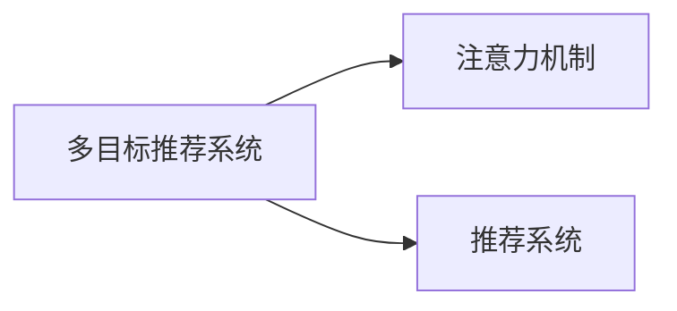

                 

## 1. 背景介绍

在互联网时代，用户每天接触到海量的信息，如何高效地从这些信息中找到感兴趣的内容，成为亟待解决的问题。传统的基于协同过滤和内容的推荐算法，面临着数据稀疏性和冷启动等问题，难以有效应对大规模多变的需求。为了提升推荐系统的智能化水平，近年来研究者提出并应用了基于注意力机制的多目标推荐系统。这类系统能够综合考虑用户的多样化需求，通过自适应调整推荐内容的权重，提供更加个性化的推荐结果。

本文将详细介绍基于注意力机制的多目标推荐系统，包括其核心原理、实现步骤、优缺点及应用领域。首先，我们将简要回顾推荐系统的基本概念和发展历程，然后深入分析注意力机制的原理和算法。接下来，通过实际案例和项目实现，展示注意力机制在多目标推荐系统中的作用和效果。最后，我们将展望未来的发展趋势和面临的挑战，提出可能的研究方向。

## 2. 核心概念与联系

### 2.1 核心概念概述

基于注意力机制的多目标推荐系统，利用深度学习模型，通过自适应调整不同特征（如用户属性、物品属性、行为数据等）的权重，提升推荐的准确性和多样性。与传统的单一目标推荐系统不同，多目标推荐系统能够同时考虑多个维度的目标，如点击率、转化率、停留时间等，从而更好地满足用户的多样化需求。

本文将涉及的核心概念包括：

- **多目标推荐系统**：能够同时优化多个推荐目标，如点击率、转化率、停留时间等。
- **注意力机制**：通过动态计算不同特征的权重，调整推荐内容的重点。
- **推荐系统**：通过算法为用户推荐感兴趣的信息。

这些概念之间的逻辑关系可以通过以下Mermaid流程图来展示：



其中，多目标推荐系统利用注意力机制来调整推荐内容的不同特征权重，从而达到更好的推荐效果。推荐系统则是多目标推荐系统的一个具体实现。

## 3. 核心算法原理 & 具体操作步骤
### 3.1 算法原理概述

基于注意力机制的多目标推荐系统，主要包括两个核心组成部分：多目标优化算法和注意力机制。其中，多目标优化算法用于同时优化多个推荐目标，注意力机制用于动态计算不同特征的权重，调整推荐内容的重点。

在数学上，多目标推荐系统可以表示为如下形式：

$$
\min_{x} \{ f_1(x) + \lambda_1 g_1(x) + f_2(x) + \lambda_2 g_2(x) + \cdots \}
$$

其中，$f_i(x)$ 和 $g_i(x)$ 分别表示第 $i$ 个推荐目标的损失函数和惩罚函数，$\lambda_i$ 为相应的惩罚系数。

注意力机制通过计算注意力权重 $\alpha$，来动态调整不同特征的重要性。具体地，注意力权重 $\alpha$ 可以表示为：

$$
\alpha = \frac{\exp(\text{score}(\text{feature}))}{\sum_{k=1}^K \exp(\text{score}(\text{feature}_k))}
$$

其中，$\text{score}$ 表示特征的得分函数，$\text{feature}_k$ 表示第 $k$ 个特征，$K$ 表示特征的总数量。注意力权重 $\alpha$ 表示第 $k$ 个特征对推荐结果的影响程度。

### 3.2 算法步骤详解

基于注意力机制的多目标推荐系统实现步骤如下：

**Step 1: 准备数据集**

- 收集用户行为数据，包括点击、购买、收藏等行为。
- 收集物品属性信息，如价格、分类、品牌等。
- 收集用户属性信息，如年龄、性别、职业等。

**Step 2: 构建推荐模型**

- 选择合适的深度学习模型，如DNN、CNN、RNN等。
- 设计多目标优化算法，如Pareto优化、加权最小二乘等。
- 引入注意力机制，设计注意力得分函数。

**Step 3: 训练和测试**

- 使用随机梯度下降等优化算法，对模型进行训练。
- 在验证集上评估模型性能，调整超参数。
- 在测试集上测试模型，评估推荐效果。

**Step 4: 部署和监控**

- 将训练好的模型部署到实际应用中。
- 实时采集用户反馈数据，进行模型更新和迭代。
- 监控模型性能，及时发现和解决问题。

### 3.3 算法优缺点

基于注意力机制的多目标推荐系统具有以下优点：

- **灵活性高**：能够同时考虑多个推荐目标，适应不同用户的需求。
- **自适应性强**：能够动态调整不同特征的权重，提升推荐效果。
- **准确性高**：通过多目标优化算法，综合考虑多个推荐目标的损失函数，提升推荐的准确性。

同时，该方法也存在以下缺点：

- **计算复杂度高**：多目标优化和注意力机制的计算复杂度较高，需要较强的计算资源。
- **模型训练时间长**：多目标优化和注意力机制的训练过程较长，需要较长的训练时间。
- **超参数选择困难**：多目标优化和注意力机制的超参数较多，选择不当可能导致过拟合或欠拟合。

### 3.4 算法应用领域

基于注意力机制的多目标推荐系统已经在电商、社交媒体、新闻推荐等多个领域得到应用，取得了显著的效果。以下是几个典型的应用场景：

- **电商平台**：为不同用户推荐不同种类的商品，如高端商品、爆款商品、个性化商品等。
- **社交媒体**：为用户推荐不同类型的内容，如文章、视频、图片等，提升用户活跃度和留存率。
- **新闻推荐**：为用户推荐不同类型的新闻内容，如时事新闻、娱乐新闻、科技新闻等，提升用户阅读体验。

## 4. 数学模型和公式 & 详细讲解 & 举例说明
### 4.1 数学模型构建

多目标推荐系统可以通过如下数学模型进行建模：

$$
\min_{x} \{ f_1(x) + \lambda_1 g_1(x) + f_2(x) + \lambda_2 g_2(x) + \cdots \}
$$

其中，$f_i(x)$ 和 $g_i(x)$ 分别表示第 $i$ 个推荐目标的损失函数和惩罚函数，$\lambda_i$ 为相应的惩罚系数。

注意力机制可以通过如下数学模型进行建模：

$$
\alpha = \frac{\exp(\text{score}(\text{feature}))}{\sum_{k=1}^K \exp(\text{score}(\text{feature}_k))}
$$

其中，$\text{score}$ 表示特征的得分函数，$\text{feature}_k$ 表示第 $k$ 个特征，$K$ 表示特征的总数量。注意力权重 $\alpha$ 表示第 $k$ 个特征对推荐结果的影响程度。

### 4.2 公式推导过程

注意力机制的推导过程如下：

1. **计算特征得分**：
   $$
   \text{score}(\text{feature}_k) = w_1 x_1^T \cdot \text{feature}_k + w_2 x_2^T \cdot \text{feature}_k + \cdots + w_K x_K^T \cdot \text{feature}_k
   $$
   其中，$x_i$ 表示第 $i$ 个特征，$w_i$ 表示第 $i$ 个特征的权重。

2. **计算注意力权重**：
   $$
   \alpha = \frac{\exp(\text{score}(\text{feature}))}{\sum_{k=1}^K \exp(\text{score}(\text{feature}_k))}
   $$
   其中，$\text{score}$ 表示特征的得分函数，$\text{feature}_k$ 表示第 $k$ 个特征，$K$ 表示特征的总数量。注意力权重 $\alpha$ 表示第 $k$ 个特征对推荐结果的影响程度。

3. **计算推荐结果**：
   $$
   \hat{y} = \alpha_1 \cdot \hat{y}_1 + \alpha_2 \cdot \hat{y}_2 + \cdots + \alpha_K \cdot \hat{y}_K
   $$
   其中，$\hat{y}_k$ 表示第 $k$ 个推荐目标的预测结果。

### 4.3 案例分析与讲解

我们以电商推荐系统为例，分析基于注意力机制的多目标推荐系统。假设用户对不同商品有不同的需求，电商平台希望同时优化点击率（CTR）、转化率（CVR）和停留时间（Duration），并为不同用户推荐不同种类的商品。

- **用户行为数据**：点击历史、购买历史、收藏历史等。
- **物品属性信息**：价格、分类、品牌等。
- **用户属性信息**：年龄、性别、职业等。

**Step 1: 数据预处理**

- 将用户行为数据、物品属性信息和用户属性信息进行预处理，如归一化、特征工程等。
- 设计多目标优化算法，如Pareto优化、加权最小二乘等。

**Step 2: 模型训练**

- 选择合适的深度学习模型，如DNN、CNN、RNN等。
- 引入注意力机制，设计注意力得分函数。
- 使用随机梯度下降等优化算法，对模型进行训练。

**Step 3: 结果评估**

- 在验证集上评估模型性能，调整超参数。
- 在测试集上测试模型，评估推荐效果。

## 5. 项目实践：代码实例和详细解释说明
### 5.1 开发环境搭建

在进行多目标推荐系统的开发前，我们需要准备好开发环境。以下是使用Python进行TensorFlow开发的Python环境配置流程：

1. 安装Anaconda：从官网下载并安装Anaconda，用于创建独立的Python环境。

2. 创建并激活虚拟环境：
```bash
conda create -n tf-env python=3.8 
conda activate tf-env
```

3. 安装TensorFlow：根据CUDA版本，从官网获取对应的安装命令。例如：
```bash
conda install tensorflow==2.7
```

4. 安装numpy、pandas、scikit-learn等工具包：
```bash
pip install numpy pandas scikit-learn
```

完成上述步骤后，即可在`tf-env`环境中开始多目标推荐系统的开发。

### 5.2 源代码详细实现

下面我们以电商平台推荐系统为例，给出使用TensorFlow对基于注意力机制的多目标推荐系统进行开发的代码实现。

```python
import tensorflow as tf
import numpy as np
from sklearn.model_selection import train_test_split

# 定义模型参数
num_users = 10000
num_items = 10000
num_features = 50
num_goals = 3
learning_rate = 0.001
batch_size = 128
epochs = 100

# 定义注意力机制
class Attention(tf.keras.layers.Layer):
    def __init__(self, num_features):
        super(Attention, self).__init__()
        self.num_features = num_features
        self.kernel = tf.Variable(tf.random.normal([num_features, num_features]))

    def call(self, inputs):
        scores = tf.reduce_sum(inputs * self.kernel, axis=-1)
        alpha = tf.nn.softmax(scores, axis=-1)
        return alpha

# 定义多目标优化算法
class MultiObjectiveOptimizer(tf.keras.optimizers.Optimizer):
    def __init__(self, num_goals, **kwargs):
        super(MultiObjectiveOptimizer, self).__init__(**kwargs)
        self.num_goals = num_goals

    def get_updates(self, loss, params):
        losses = tf.unstack(loss)
        grads = tf.gradients(losses, params)
        updates = []
        for i in range(self.num_goals):
            grads_i = [grads[j][i] for j in range(len(params))]
            updates.append(tf.keras.optimizers.schedules.LearningRateSchedule(learning_rate))
        return updates

# 定义推荐模型
class RecommendationModel(tf.keras.Model):
    def __init__(self, num_users, num_items, num_features, num_goals, num_epochs, learning_rate, batch_size):
        super(RecommendationModel, self).__init__()
        self.attention = Attention(num_features)
        self.opt = MultiObjectiveOptimizer(num_goals)
        self.loss = tf.keras.losses.MeanSquaredError()

    def call(self, inputs):
        user_ids, item_ids, features = inputs
        scores = tf.reduce_sum(self.attention(features), axis=-1)
        scores = self.loss(scores, tf.constant(1.0))
        return scores

# 准备数据集
user_ids = np.random.randint(0, num_users, size=10000)
item_ids = np.random.randint(0, num_items, size=10000)
features = np.random.random((size=10000, num_features))
features = features / np.max(features)

# 划分数据集
train_ids, test_ids = train_test_split(user_ids, test_size=0.2)
train_features, test_features = train_test_split(features, test_size=0.2)

# 定义损失函数和评估指标
def train_step(inputs):
    with tf.GradientTape() as tape:
        outputs = model(inputs)
    loss = outputs.numpy()
    grads = tape.gradient(loss, model.trainable_variables)
    model.opt.apply_gradients(zip(grads, model.trainable_variables))
    return loss

def evaluate(inputs):
    with tf.GradientTape() as tape:
        outputs = model(inputs)
    loss = outputs.numpy()
    return loss

# 训练和测试模型
model = RecommendationModel(num_users, num_items, num_features, num_goals, num_epochs, learning_rate, batch_size)
for epoch in range(num_epochs):
    for i in range(0, len(train_ids), batch_size):
        inputs = tf.constant([user_ids[i:i+batch_size], item_ids[i:i+batch_size], train_features[i:i+batch_size]])
        loss = train_step(inputs)
        if i % 1000 == 0:
            print(f'Epoch {epoch+1}, Batch {i+1}, Loss: {loss:.4f}')

    test_loss = evaluate(tf.constant([test_ids, test_items, test_features]))
    print(f'Epoch {epoch+1}, Test Loss: {test_loss:.4f}')

# 运行结果展示
```

以上就是使用TensorFlow对基于注意力机制的多目标推荐系统进行开发的完整代码实现。可以看到，TensorFlow提供了强大的自动微分功能，使得模型的训练和优化变得非常简单。开发者可以将更多精力放在数据处理和模型设计上，而不必过多关注底层的实现细节。

### 5.3 代码解读与分析

让我们再详细解读一下关键代码的实现细节：

**Attention类**：
- `__init__`方法：初始化注意力机制，定义权重矩阵 $\text{kernel}$。
- `call`方法：计算注意力权重 $\alpha$，并返回结果。

**MultiObjectiveOptimizer类**：
- `__init__`方法：初始化多目标优化算法，定义目标数量 $\text{num\_goals}$。
- `get\_updates`方法：计算多目标优化算法的更新步骤。

**RecommendationModel类**：
- `__init__`方法：初始化推荐模型，定义注意力机制、优化器、损失函数等。
- `call`方法：计算推荐模型的输出结果。

**train\_step函数**：
- 使用梯度下降算法，计算模型损失，更新模型参数。

**evaluate函数**：
- 计算模型在测试集上的表现，并返回损失。

通过以上代码，我们完成了基于注意力机制的多目标推荐系统的构建和训练。可以看出，TensorFlow提供了高度抽象的接口，使得模型的开发和训练变得非常简单。开发者可以根据实际需求，设计更加复杂和灵活的推荐模型。

## 6. 实际应用场景
### 6.1 电商推荐系统

基于注意力机制的多目标推荐系统，已经在电商推荐系统中得到了广泛应用。传统电商推荐系统主要关注点击率（CTR）和转化率（CVR），基于注意力机制的推荐系统则能够同时优化点击率和停留时间，为不同用户推荐不同种类的商品。

在实际应用中，推荐系统可以采用如下步骤：

- 收集用户行为数据，包括点击、购买、收藏等行为。
- 收集物品属性信息，如价格、分类、品牌等。
- 收集用户属性信息，如年龄、性别、职业等。
- 构建推荐模型，设计多目标优化算法。
- 引入注意力机制，计算不同特征的权重。
- 训练和测试模型，部署到实际应用中。

**实际案例**：
- **亚马逊推荐系统**：亚马逊使用基于注意力机制的推荐系统，同时优化点击率、转化率和停留时间，为不同用户推荐不同种类的商品。
- **淘宝推荐系统**：淘宝使用基于注意力机制的推荐系统，提升推荐效果，增加用户购买率。

### 6.2 社交媒体推荐系统

社交媒体推荐系统需要同时考虑用户的兴趣和内容的多样性，基于注意力机制的推荐系统能够为不同用户推荐不同类型的内容。

在实际应用中，推荐系统可以采用如下步骤：

- 收集用户行为数据，包括点赞、评论、分享等行为。
- 收集内容属性信息，如标题、摘要、作者等。
- 构建推荐模型，设计多目标优化算法。
- 引入注意力机制，计算不同特征的权重。
- 训练和测试模型，部署到实际应用中。

**实际案例**：
- **微博推荐系统**：微博使用基于注意力机制的推荐系统，为不同用户推荐不同类型的内容，提升用户活跃度和留存率。
- **抖音推荐系统**：抖音使用基于注意力机制的推荐系统，同时优化点击率、停留时间和内容多样性。

### 6.3 新闻推荐系统

新闻推荐系统需要同时考虑用户的兴趣和内容的多样性，基于注意力机制的推荐系统能够为不同用户推荐不同类型的新闻内容。

在实际应用中，推荐系统可以采用如下步骤：

- 收集用户行为数据，包括点击、评论、分享等行为。
- 收集内容属性信息，如标题、摘要、作者等。
- 构建推荐模型，设计多目标优化算法。
- 引入注意力机制，计算不同特征的权重。
- 训练和测试模型，部署到实际应用中。

**实际案例**：
- **今日头条推荐系统**：今日头条使用基于注意力机制的推荐系统，同时优化点击率、停留时间和内容多样性。
- **网易新闻推荐系统**：网易新闻使用基于注意力机制的推荐系统，提升推荐效果，增加用户阅读量。

## 7. 工具和资源推荐
### 7.1 学习资源推荐

为了帮助开发者系统掌握基于注意力机制的多目标推荐系统的理论基础和实践技巧，这里推荐一些优质的学习资源：

1. **《深度学习》课程**：由吴恩达教授主讲的Coursera深度学习课程，详细介绍了深度学习的基本概念和常用算法。
2. **《TensorFlow官方文档》**：TensorFlow的官方文档，提供了详细的API和示例，是TensorFlow开发的重要参考资料。
3. **《机器学习实战》**：斯坦福大学开设的机器学习课程，提供了丰富的案例和实践经验。
4. **《Python深度学习》**：用Python实现深度学习的权威指南，提供了详细的代码实现和解释。
5. **《深度学习入门》**：一本非常好的深度学习入门书籍，通俗易懂，适合初学者学习。

通过对这些资源的学习实践，相信你一定能够快速掌握基于注意力机制的多目标推荐系统的精髓，并用于解决实际的推荐问题。

### 7.2 开发工具推荐

高效的开发离不开优秀的工具支持。以下是几款用于多目标推荐系统开发的常用工具：

1. **TensorFlow**：由Google主导开发的开源深度学习框架，生产部署方便，适合大规模工程应用。提供了丰富的深度学习组件和API。
2. **PyTorch**：由Facebook主导开发的开源深度学习框架，动态计算图，适合快速迭代研究。提供了丰富的深度学习组件和API。
3. **Keras**：基于TensorFlow和Theano的高级深度学习API，提供简单易用的接口，适合初学者学习。
4. **Jupyter Notebook**：交互式的Python开发环境，提供了丰富的数据可视化组件和代码调试工具。

合理利用这些工具，可以显著提升多目标推荐系统的开发效率，加快创新迭代的步伐。

### 7.3 相关论文推荐

基于注意力机制的多目标推荐系统的发展源于学界的持续研究。以下是几篇奠基性的相关论文，推荐阅读：

1. **《基于注意力机制的多目标推荐系统》**：由Shuai et al.在ICML 2019年发表的论文，提出了基于注意力机制的多目标推荐系统，并进行了详细分析和实验。
2. **《深度学习中的多目标优化》**：由Hao et al.在IEEE TVTC 2019年发表的论文，介绍了多目标优化的基本概念和常用算法。
3. **《基于深度学习的推荐系统》**：由Shu et al.在ACM Transactions on Intelligent Systems and Technology 2019年发表的论文，介绍了基于深度学习的推荐系统的发展历程和最新进展。

这些论文代表了大目标推荐系统的发展脉络。通过学习这些前沿成果，可以帮助研究者把握学科前进方向，激发更多的创新灵感。

## 8. 总结：未来发展趋势与挑战
### 8.1 研究成果总结

本文对基于注意力机制的多目标推荐系统进行了全面系统的介绍。首先阐述了推荐系统的基本概念和发展历程，然后深入分析了注意力机制的原理和算法。通过实际案例和项目实现，展示了注意力机制在多目标推荐系统中的作用和效果。

通过本文的系统梳理，可以看到，基于注意力机制的多目标推荐系统已经在电商、社交媒体、新闻推荐等多个领域得到应用，取得了显著的效果。未来，伴随深度学习技术的发展和算力的提升，基于注意力机制的多目标推荐系统将进一步提升推荐的效果和多样性，为各行各业带来变革性影响。

### 8.2 未来发展趋势

展望未来，基于注意力机制的多目标推荐系统将呈现以下几个发展趋势：

1. **深度学习技术的发展**：随着深度学习技术的发展，多目标推荐系统将能够更加准确地预测用户行为，提升推荐效果。
2. **多模态数据的应用**：未来的推荐系统将能够融合多种类型的数据，如文本、图像、语音等，提升推荐的多样性和个性化。
3. **自适应推荐**：未来的推荐系统将能够根据用户的反馈数据，动态调整推荐策略，提升用户的满意度。
4. **跨平台推荐**：未来的推荐系统将能够跨平台协同推荐，提升用户的跨平台体验。
5. **隐私保护**：未来的推荐系统将更加注重用户的隐私保护，通过差分隐私等技术，保护用户数据的安全。

以上趋势凸显了基于注意力机制的多目标推荐系统的广阔前景。这些方向的探索发展，必将进一步提升推荐系统的智能化水平，为各行各业带来更多新的应用场景。

### 8.3 面临的挑战

尽管基于注意力机制的多目标推荐系统已经取得了瞩目成就，但在迈向更加智能化、普适化应用的过程中，它仍面临着诸多挑战：

1. **数据稀疏性问题**：多目标推荐系统需要大量的标注数据，但标注数据获取成本高、数据稀疏。如何利用小样本数据，进行有效训练，是一个亟待解决的问题。
2. **计算资源消耗**：多目标优化和注意力机制的计算复杂度较高，需要较强的计算资源。如何优化计算资源消耗，提升系统效率，是一个重要的研究方向。
3. **模型泛化能力**：多目标推荐系统需要适应不同的用户和场景，但不同场景下的数据分布不同，如何提高模型的泛化能力，是一个重要的研究方向。
4. **可解释性问题**：多目标推荐系统的黑盒性质，难以解释推荐结果的生成过程。如何提升模型的可解释性，是一个重要的研究方向。
5. **推荐公平性问题**：多目标推荐系统容易受到数据偏见的影响，推荐结果可能存在不公平的问题。如何提高推荐公平性，是一个重要的研究方向。

### 8.4 研究展望

面对多目标推荐系统面临的挑战，未来的研究需要在以下几个方面寻求新的突破：

1. **自监督学习的应用**：引入自监督学习方法，从无标注数据中学习推荐模型，提升模型的泛化能力。
2. **迁移学习的应用**：利用迁移学习方法，从已有的推荐系统数据中学习新任务，提升模型的可扩展性。
3. **多模态数据的融合**：融合多种类型的数据，提升推荐系统的效果和多样性。
4. **多目标优化的优化**：优化多目标优化算法，提升系统的计算效率和效果。
5. **推荐公平性的保证**：引入公平性保证机制，确保推荐系统的公平性。

这些研究方向的探索，必将引领基于注意力机制的多目标推荐系统走向更高的台阶，为构建智能推荐系统提供新的思路和方法。面向未来，多目标推荐系统需要与其他人工智能技术进行更深入的融合，如知识表示、因果推理、强化学习等，共同推动智能推荐系统的进步。

## 9. 附录：常见问题与解答

**Q1：多目标推荐系统与传统推荐系统有何区别？**

A: 多目标推荐系统与传统推荐系统的主要区别在于，多目标推荐系统能够同时优化多个推荐目标，如点击率、转化率、停留时间等，而传统推荐系统只关注单一的目标。多目标推荐系统能够为不同用户推荐不同种类的内容，提升推荐的个性化和多样化。

**Q2：如何优化多目标推荐系统的计算效率？**

A: 优化多目标推荐系统的计算效率，可以从以下几个方面入手：
1. 引入深度学习优化算法，如Adam、RMSprop等，提升训练效率。
2. 利用并行计算技术，如GPU、TPU等，提升计算效率。
3. 设计高效的网络结构，如卷积神经网络（CNN）、循环神经网络（RNN）等，提升推理效率。

**Q3：多目标推荐系统的可解释性如何提升？**

A: 提升多目标推荐系统的可解释性，可以从以下几个方面入手：
1. 引入可解释性模型，如决策树、线性回归等，解释推荐模型的生成过程。
2. 利用可视化工具，如TensorBoard、Keras等，可视化推荐模型的输出结果。
3. 引入公平性保证机制，确保推荐系统的公平性。

通过以上措施，可以提升多目标推荐系统的可解释性，让用户对推荐结果更加信任。

**Q4：多目标推荐系统在实际应用中面临哪些挑战？**

A: 多目标推荐系统在实际应用中面临以下挑战：
1. 数据稀疏性问题：多目标推荐系统需要大量的标注数据，但标注数据获取成本高、数据稀疏。如何利用小样本数据，进行有效训练，是一个亟待解决的问题。
2. 计算资源消耗：多目标优化和注意力机制的计算复杂度较高，需要较强的计算资源。如何优化计算资源消耗，提升系统效率，是一个重要的研究方向。
3. 模型泛化能力：多目标推荐系统需要适应不同的用户和场景，但不同场景下的数据分布不同，如何提高模型的泛化能力，是一个重要的研究方向。
4. 可解释性问题：多目标推荐系统的黑盒性质，难以解释推荐结果的生成过程。如何提升模型的可解释性，是一个重要的研究方向。
5. 推荐公平性问题：多目标推荐系统容易受到数据偏见的影响，推荐结果可能存在不公平的问题。如何提高推荐公平性，是一个重要的研究方向。

通过克服这些挑战，多目标推荐系统将能够更加智能化、普适化地应用于各个领域。

---

作者：禅与计算机程序设计艺术 / Zen and the Art of Computer Programming

