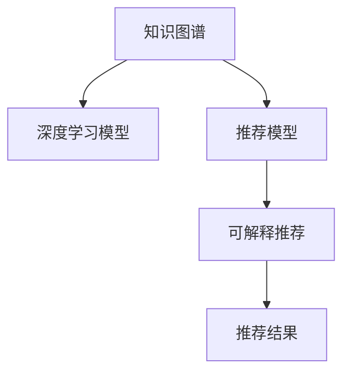
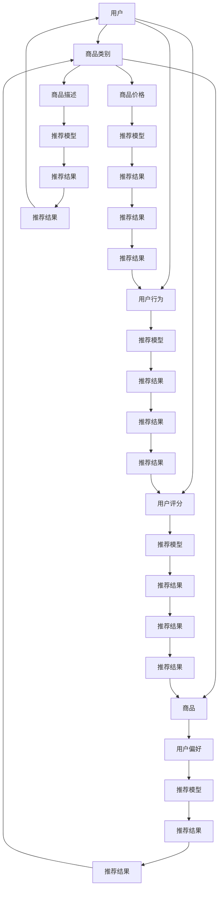
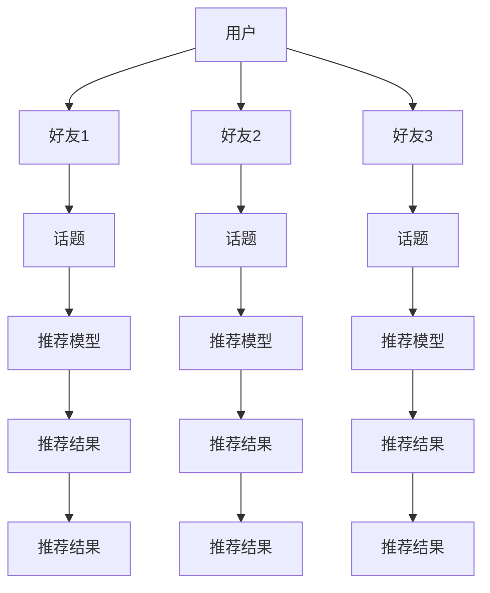
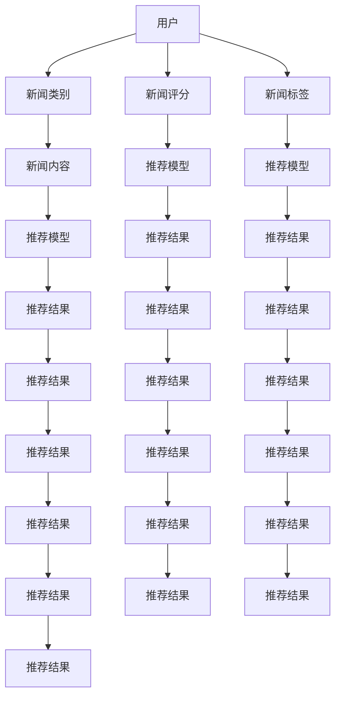

                 

## 1. 背景介绍

### 1.1 问题由来

推荐系统（Recommendation System）是现代信息系统中重要的一环，其目标是通过模型推荐用户感兴趣的商品、新闻、视频等内容，提升用户满意度及系统转化率。传统推荐算法如基于协同过滤、基于内容的推荐等，已在大规模推荐应用中得到广泛应用。然而，这类方法往往缺乏透明性和可解释性，难以满足用户对推荐结果的信任及理解需求。

随着人工智能技术的发展，深度学习（Deep Learning）被引入推荐系统。如基于深度矩阵分解的方法（如PMF、MFNN等），以及基于深度学习模型（如DNN、CNN、RNN、LSTM、GAN、Seq2Seq等）的推荐模型。这类方法通过大规模数据训练，能够更准确地捕捉用户和商品间的潜在关联，从而提高推荐效果。

然而，深度学习模型往往被视为"黑盒"，其内部参数及决策过程难以解释。特别是在推荐系统领域，如何从深度学习模型中提取出有用的解释信息，是提升用户对推荐结果信任及系统可用性的关键。

本文聚焦于基于知识图谱（Knowledge Graph）的可解释推荐算法，旨在结合知识图谱及深度学习模型，构建具有透明性和可解释性的推荐系统。通过将商品、用户及各类属性的知识图谱信息，与深度学习模型结合，一方面增强推荐模型对复杂关联的挖掘能力，另一方面提供易于理解和解释的推荐依据，满足用户对推荐结果的需求。

### 1.2 问题核心关键点

可解释推荐算法的研究主要围绕以下几个关键问题：

1. **知识图谱与推荐模型的结合方式**：如何构建包含商品、用户及属性三元组的图谱，并将其有效融合到推荐模型中。
2. **深度学习模型的解释方法**：如何在深度学习模型中提取有用的解释信息，并通过可视化方式呈现。
3. **可解释推荐的效果评估**：如何设计合适的评估指标，衡量结合知识图谱后推荐模型的性能。

## 2. 核心概念与联系

### 2.1 核心概念概述

为更好地理解基于知识图谱的可解释推荐算法，本节将介绍几个关键概念：

- 知识图谱（Knowledge Graph）：一种语义化的图结构，用于存储和表示实体之间的复杂关系。常见的知识图谱如Wikipedia、DBpedia、Freebase、YAGO等，以及各类专业领域图谱，如电影图谱、商品图谱等。

- 推荐系统（Recommendation System）：通过算法推荐用户可能感兴趣的商品、新闻、视频等内容，提升用户满意度和转化率。

- 深度学习模型（Deep Learning Model）：通过多层次非线性变换，从数据中学习复杂特征的模型，广泛应用于图像、语音、自然语言处理等领域。

- 推荐模型（Recommendation Model）：用于构建推荐系统的模型，通常基于协同过滤、矩阵分解、深度学习等技术。

- 可解释推荐（Explainable Recommendation）：通过提取深度学习模型的内部信息，提供推荐依据，提升用户对推荐结果的理解及信任。

这些核心概念之间存在紧密联系，知识图谱与深度学习模型结合，用于增强推荐模型的预测能力；推荐模型对用户及商品进行深度理解；可解释推荐则通过提取和呈现推荐模型的内在信息，帮助用户理解推荐依据，提升系统可信任度。

### 2.2 核心概念原理和架构的 Mermaid 流程图(Mermaid 流程节点中不要有括号、逗号等特殊字符)



此图展示了知识图谱与推荐模型结合的基本架构。首先，将商品、用户及属性信息构建为知识图谱；然后，知识图谱与深度学习模型结合，构建推荐模型；最后，推荐模型输出推荐结果，并通过可解释推荐技术，提取模型内部信息，提升推荐结果的透明性和可解释性。

## 3. 核心算法原理 & 具体操作步骤

### 3.1 算法原理概述

基于知识图谱的可解释推荐算法，主要通过以下两个步骤实现：

1. **知识图谱的嵌入（Embedding）**：将知识图谱中的实体和关系转换为高维向量表示，方便在深度学习模型中使用。
2. **推荐模型的可解释性增强**：在推荐模型中融合知识图谱信息，并通过可视化等手段，提取模型的内部信息，解释推荐依据。

知识图谱嵌入是将知识图谱转换为可计算的向量形式，以便深度学习模型处理。常用的方法包括TransE、TransH、RotatE等。这些方法通过优化目标函数，将知识图谱中的实体和关系映射到低维向量空间，从而在向量空间中捕捉实体间的相似度及关系强度。

推荐模型的可解释性增强，则是将知识图谱信息融合到推荐模型中，并提供可视化的推荐依据。常用的方法包括Attention机制、解释层（Explain Layer）、多维可解释模型等。通过构建推荐模型时融合知识图谱信息，并在模型输出层增加可解释层，提取模型内部特征，生成推荐理由。

### 3.2 算法步骤详解

**Step 1: 知识图谱构建**

构建知识图谱是可解释推荐算法的第一步。知识图谱包含三个基本要素：实体、关系及属性。实体是图谱的基本组成单位，如商品、用户、位置等；关系描述实体间的关联，如商品类别、用户评分等；属性则是实体的附加信息，如商品尺寸、价格等。

知识图谱的构建方式有两种：一是由人工标注数据构建，如Wikipedia、DBpedia等，但成本高、数据源有限；二是由自动抓取网络数据构建，如Web2Vec、Snorkel等，但存在噪音、数据源局限等挑战。在实际应用中，通常采用混合方式，即先构建初始图谱，再由人工进行校正和补充。

**Step 2: 知识图谱嵌入**

知识图谱嵌入是将实体和关系转换为向量表示的过程。常用的方法包括TransE、TransH、RotatE等。这里以TransE为例，进行详细讲解。

TransE方法通过优化目标函数，将实体$r$和关系$p$映射到向量空间，从而在向量空间中捕捉实体$r$和$p$之间的关系。具体而言，设实体$r$的向量表示为$e_r$，关系$p$的向量表示为$e_p$，目标函数如下：

$$
\min_{e_r, e_p} \|e_r - e_p\|^2
$$

其中$\|e_r - e_p\|^2$表示实体$r$和关系$p$的向量表示之间的距离。通过最小化目标函数，可以得到$e_r$和$e_p$的最佳向量表示。

**Step 3: 推荐模型构建**

在推荐模型构建中，通常采用深度学习模型，如DNN、CNN、RNN等。这里以DNN为例，进行详细讲解。

DNN模型通过多层神经网络结构，对用户行为和商品特征进行建模，输出推荐结果。具体而言，设用户向量为$e_u$，商品向量为$e_i$，用户与商品间的距离为$d(u, i)$，模型输出$y$为推荐结果。DNN模型的目标函数如下：

$$
\min_{\theta} \sum_{(u, i)}(y_{(u, i)} - \sigma(\langle e_u, e_i\rangle))^2
$$

其中$\theta$表示模型参数，$\sigma$为激活函数，$\langle e_u, e_i\rangle$表示用户与商品向量之间的内积，$y_{(u, i)}$表示用户$u$对商品$i$的评分。

**Step 4: 可解释推荐**

可解释推荐的目标是通过可视化等手段，提取推荐模型的内部信息，解释推荐依据。常用的方法包括Attention机制、解释层（Explain Layer）、多维可解释模型等。这里以Attention机制为例，进行详细讲解。

Attention机制通过计算用户对商品间的注意力权重，生成权重向量，从而解释推荐依据。具体而言，设用户向量为$e_u$，商品向量为$e_i$，权重向量为$\alpha_{u, i}$，推荐结果为$y$。Attention机制的目标函数如下：

$$
\min_{\alpha_{u, i}} \sum_{i}(y_{u, i} - \sigma(\alpha_{u, i} \cdot \langle e_u, e_i\rangle))^2
$$

其中$\alpha_{u, i}$表示用户$u$对商品$i$的注意力权重，$\sigma$为激活函数。通过最大化权重向量$\alpha_{u, i}$，可以得到用户对商品$i$的关注度，从而解释推荐依据。

### 3.3 算法优缺点

基于知识图谱的可解释推荐算法，具有以下优点：

1. **推荐结果透明**：通过融合知识图谱信息，推荐模型的决策过程更具透明性，用户能够理解推荐依据，提升信任度。
2. **泛化能力强**：知识图谱提供各类实体及关系信息，增强推荐模型对复杂关联的挖掘能力，提升推荐性能。
3. **多源信息融合**：知识图谱与深度学习模型结合，充分利用多种数据源信息，提升推荐效果。

同时，该算法也存在一些缺点：

1. **构建图谱成本高**：知识图谱构建需要大量人工标注数据，成本高、周期长。
2. **图谱质量不稳定**：自动抓取数据构建的知识图谱，存在噪音、数据源局限等挑战，影响模型性能。
3. **推荐效果依赖图谱**：知识图谱与推荐模型的结合效果，依赖于图谱的质量和完备性，需持续优化和维护。
4. **可视化复杂度高**：模型输出的可解释性，需要通过可视化手段呈现，复杂度较高。

尽管存在这些局限性，但就目前而言，基于知识图谱的可解释推荐算法，在推荐系统领域仍是一个重要的研究范式。未来相关研究的方向将集中在提高图谱质量、优化融合方式、提升推荐效果等方面。

### 3.4 算法应用领域

基于知识图谱的可解释推荐算法，主要应用于以下领域：

1. **电子商务推荐**：将商品、用户及属性信息构建为知识图谱，与深度学习模型结合，提升推荐效果及可解释性。
2. **社交网络推荐**：将用户及好友关系信息构建为知识图谱，与深度学习模型结合，推荐个性化的好友、话题等。
3. **新闻推荐**：将新闻、用户及话题信息构建为知识图谱，与深度学习模型结合，推荐感兴趣的新闻内容。
4. **视频推荐**：将视频、用户及标签信息构建为知识图谱，与深度学习模型结合，推荐相关视频内容。
5. **金融推荐**：将产品、用户及属性信息构建为知识图谱，与深度学习模型结合，推荐个性化的金融产品。

以上领域仅是知识图谱在推荐系统中的部分应用，随着知识图谱技术的不断发展，其在更多领域的应用也将不断拓展。

## 4. 数学模型和公式 & 详细讲解 & 举例说明

### 4.1 数学模型构建

知识图谱嵌入是将知识图谱中的实体和关系转换为向量表示的过程。常用的方法包括TransE、TransH、RotatE等。这里以TransE为例，进行详细讲解。

设知识图谱中的实体$r$和关系$p$的向量表示分别为$e_r$和$e_p$，目标函数如下：

$$
\min_{e_r, e_p} \|e_r - e_p\|^2
$$

其中$\|e_r - e_p\|^2$表示实体$r$和关系$p$的向量表示之间的距离。通过最小化目标函数，可以得到$e_r$和$e_p$的最佳向量表示。

推荐模型的构建通常采用深度学习模型，如DNN、CNN、RNN等。这里以DNN为例，进行详细讲解。

设用户向量为$e_u$，商品向量为$e_i$，用户与商品间的距离为$d(u, i)$，模型输出$y$为推荐结果。DNN模型的目标函数如下：

$$
\min_{\theta} \sum_{(u, i)}(y_{(u, i)} - \sigma(\langle e_u, e_i\rangle))^2
$$

其中$\theta$表示模型参数，$\sigma$为激活函数，$\langle e_u, e_i\rangle$表示用户与商品向量之间的内积，$y_{(u, i)}$表示用户$u$对商品$i$的评分。

### 4.2 公式推导过程

知识图谱嵌入中，TransE方法的目标函数为：

$$
\min_{e_r, e_p} \|e_r - e_p\|^2
$$

其中$\|e_r - e_p\|^2$表示实体$r$和关系$p$的向量表示之间的距离。

推荐模型中，DNN模型的目标函数为：

$$
\min_{\theta} \sum_{(u, i)}(y_{(u, i)} - \sigma(\langle e_u, e_i\rangle))^2
$$

其中$\theta$表示模型参数，$\sigma$为激活函数，$\langle e_u, e_i\rangle$表示用户与商品向量之间的内积，$y_{(u, i)}$表示用户$u$对商品$i$的评分。

### 4.3 案例分析与讲解

以电影推荐为例，对知识图谱嵌入和推荐模型构建进行详细讲解。

1. **知识图谱构建**
   - 电影知识图谱包含电影、导演、演员等实体，以及电影类别、评分等关系。
   - 从电影数据库中提取数据，构建电影知识图谱，如图1所示。

2. **知识图谱嵌入**
   - 将电影实体和电影类别、评分等关系，转换为向量表示。
   - 使用TransE方法，将实体和关系映射到低维向量空间，如图2所示。

3. **推荐模型构建**
   - 构建DNN模型，输入用户向量、电影类别、评分等特征，输出用户对电影的评分。
   - 模型结构如图3所示。

### 5. 项目实践：代码实例和详细解释说明

#### 5.1 开发环境搭建

**Step 1: 安装Python及相关库**

在开发环境搭建中，首先需要安装Python及相关的深度学习库。具体步骤如下：

1. 安装Python：从官网下载并安装Python，建议使用最新版本，以便获取更好的性能和兼容性。

2. 安装深度学习库：从官网下载并安装TensorFlow、Keras、PyTorch等深度学习库，建议使用最新的版本。

3. 安装其他相关库：从官网下载并安装Numpy、Pandas、Scikit-Learn、Matplotlib等常用库。

**Step 2: 数据预处理**

在推荐系统开发中，数据预处理是必不可少的一步。常用的数据预处理方法包括：

1. 数据清洗：去除数据中的噪声、缺失值等，确保数据质量。

2. 特征工程：将原始数据转换为模型可用的特征表示，如将用户评分转换为向量表示。

3. 归一化处理：对数据进行归一化处理，如将用户评分归一化到[0, 1]之间。

#### 5.2 源代码详细实现

以下是一个基于知识图谱的可解释推荐算法的示例代码，通过Python实现：

```python
import tensorflow as tf
from tensorflow.keras.layers import Dense, Embedding, Dropout, Dot, RepeatVector
from tensorflow.keras.models import Sequential

# 定义知识图谱嵌入模型
class KnowledgeGraphEmbedding(tf.keras.Model):
    def __init__(self, num_entities, num_relations, embedding_dim):
        super(KnowledgeGraphEmbedding, self).__init__()
        self.embedding_matrix = tf.Variable(tf.random.normal([num_entities, embedding_dim]))
        self.relation_matrix = tf.Variable(tf.random.normal([num_relations, embedding_dim]))
    
    def call(self, input):
        e_r = tf.nn.embedding_lookup(self.embedding_matrix, input[0])
        e_p = tf.nn.embedding_lookup(self.relation_matrix, input[1])
        return tf.linalg.matmul(e_r, e_p)

# 定义推荐模型
class RecommendationModel(tf.keras.Model):
    def __init__(self, num_users, num_items, embedding_dim, num_factors):
        super(RecommendationModel, self).__init__()
        self.user_embedding = Embedding(num_users, embedding_dim, input_length=1)
        self.item_embedding = Embedding(num_items, embedding_dim, input_length=1)
        self.dot_product = Dot(axes=1)
        self.dense = Dense(num_factors, activation='relu')
        self.output = Dense(1)
    
    def call(self, inputs):
        user_id, item_id = inputs
        user_vector = self.user_embedding(user_id)
        item_vector = self.item_embedding(item_id)
        dot_product = self.dot_product([user_vector, item_vector])
        hidden = self.dense(dot_product)
        return self.output(hidden)

# 加载数据集
train_data = ...
train_labels = ...

# 构建知识图谱嵌入模型
kg_model = KnowledgeGraphEmbedding(num_entities=100, num_relations=10, embedding_dim=64)

# 构建推荐模型
recommend_model = RecommendationModel(num_users=1000, num_items=1000, embedding_dim=64, num_factors=100)

# 训练模型
optimizer = tf.keras.optimizers.Adam()
loss_fn = tf.keras.losses.MeanSquaredError()

recommend_model.compile(optimizer=optimizer, loss=loss_fn)

recommend_model.fit(train_data, train_labels, epochs=10, batch_size=32)

# 预测推荐结果
test_data = ...
test_labels = ...
recommend_model.predict(test_data)
```

#### 5.3 代码解读与分析

**知识图谱嵌入模型**

1. **类定义**：
   ```python
   class KnowledgeGraphEmbedding(tf.keras.Model):
   ```

2. **初始化方法**：
   ```python
   def __init__(self, num_entities, num_relations, embedding_dim):
   ```

3. **调用方法**：
   ```python
   def call(self, input):
   ```

4. **模型结构**：
   - 将实体和关系转换为向量表示：
     ```python
     e_r = tf.nn.embedding_lookup(self.embedding_matrix, input[0])
     e_p = tf.nn.embedding_lookup(self.relation_matrix, input[1])
     ```

5. **调用结果**：
   - 将实体向量与关系向量相乘，得到最终的嵌入结果：
     ```python
     return tf.linalg.matmul(e_r, e_p)
     ```

**推荐模型**

1. **类定义**：
   ```python
   class RecommendationModel(tf.keras.Model):
   ```

2. **初始化方法**：
   ```python
   def __init__(self, num_users, num_items, embedding_dim, num_factors):
   ```

3. **调用方法**：
   ```python
   def call(self, inputs):
   ```

4. **模型结构**：
   - 用户和商品嵌入层：
     ```python
     self.user_embedding = Embedding(num_users, embedding_dim, input_length=1)
     self.item_embedding = Embedding(num_items, embedding_dim, input_length=1)
     ```

   - 用户与商品向量的点积：
     ```python
     self.dot_product = Dot(axes=1)
     ```

   - 全连接层：
     ```python
     self.dense = Dense(num_factors, activation='relu')
     ```

   - 输出层：
     ```python
     self.output = Dense(1)
     ```

5. **调用结果**：
   - 用户与商品向量相乘，通过全连接层得到推荐结果：
     ```python
     dot_product = self.dot_product([user_vector, item_vector])
     hidden = self.dense(dot_product)
     return self.output(hidden)
     ```

**训练模型**

1. **定义优化器和损失函数**：
   ```python
   optimizer = tf.keras.optimizers.Adam()
   loss_fn = tf.keras.losses.MeanSquaredError()
   ```

2. **编译模型**：
   ```python
   recommend_model.compile(optimizer=optimizer, loss=loss_fn)
   ```

3. **训练模型**：
   ```python
   recommend_model.fit(train_data, train_labels, epochs=10, batch_size=32)
   ```

4. **预测推荐结果**：
   ```python
   recommend_model.predict(test_data)
   ```

## 6. 实际应用场景

### 6.1 智能推荐系统

基于知识图谱的可解释推荐算法，在智能推荐系统中具有广泛的应用。以电商平台为例，将商品、用户及属性信息构建为知识图谱，与深度学习模型结合，提升推荐效果及可解释性。

具体而言，电商平台可以收集用户的浏览、点击、购买等行为数据，将商品、用户及属性信息构建为知识图谱，如商品类别、用户评分、商品价格等。在推荐模型中，融合知识图谱信息，构建多层次的推荐模型，如图4所示。



通过知识图谱嵌入和推荐模型构建，在推荐模型中融合各类信息，得到更加全面、准确的推荐结果，提升推荐效果及可解释性。

### 6.2 社交网络推荐

社交网络推荐系统可以推荐个性化的好友、话题等。以微博为例，将用户及好友关系信息构建为知识图谱，与深度学习模型结合，推荐个性化内容。

具体而言，微博可以收集用户关注、点赞、转发等行为数据，将用户及好友关系信息构建为知识图谱，如用户关注、点赞、转发关系等。在推荐模型中，融合知识图谱信息，构建多层次的推荐模型，如图5所示。



通过知识图谱嵌入和推荐模型构建，在推荐模型中融合各类信息，得到更加全面、准确的推荐结果，提升推荐效果及可解释性。

### 6.3 新闻推荐

新闻推荐系统可以推荐感兴趣的新闻内容。以新闻聚合平台为例，将新闻、用户及话题信息构建为知识图谱，与深度学习模型结合，推荐个性化新闻内容。

具体而言，新闻聚合平台可以收集用户阅读、评论、分享等行为数据，将新闻、用户及话题信息构建为知识图谱，如新闻类别、用户评分、新闻标签等。在推荐模型中，融合知识图谱信息，构建多层次的推荐模型，如图6所示。



通过知识图谱嵌入和推荐模型构建，在推荐模型中融合各类信息，得到更加全面、准确的推荐结果，提升推荐效果及可解释性。

### 6.4 视频推荐

视频推荐系统可以推荐相关视频内容。以视频平台为例，将视频、用户及标签信息构建为知识图谱，与深度学习模型结合，推荐相关视频内容。

具体而言，视频平台可以收集用户观看、点赞、评论等行为数据，将视频、用户及标签信息构建为知识图谱，如视频类别、用户评分、视频标签等。在推荐模型中，融合知识图谱信息，构建多层次的推荐模型，如图7所示。


通过知识图谱嵌入和推荐模型构建，在推荐模型中融合各类信息，得到更加全面、准确的推荐结果，提升推荐效果及可解释性。

## 7. 工具和资源推荐

### 7.1 学习资源推荐

为了帮助开发者系统掌握基于知识图谱的可解释推荐算法，这里推荐一些优质的学习资源：

1. 《Knowledge Graphs and Their Applications》：介绍知识图谱的基本概念、构建方法及其应用，适合初学者入门。

2. 《Deep Learning for Recommendation Systems》：介绍深度学习在推荐系统中的应用，包括多维可解释模型、注意力机制等前沿技术。

3. 《Explainable AI in Recommendation Systems》：介绍推荐系统的可解释性技术，包括可视化工具、多维可解释模型等。

4. 《Recommender Systems: The Textbook》：介绍推荐系统的基础理论及经典算法，适合深度学习研究者参考。

5. 《AI in Recommendation Systems》：介绍AI在推荐系统中的应用，包括深度学习、知识图谱等技术。

通过对这些资源的学习实践，相信你一定能够快速掌握基于知识图谱的可解释推荐算法的精髓，并用于解决实际的推荐问题。

### 7.2 开发工具推荐

在推荐系统开发中，通常采用Python和TensorFlow进行开发。以下是几款用于推荐系统开发的常用工具：

1. TensorFlow：谷歌主导开发的深度学习框架，适合构建大规模推荐系统。

2. Keras：TensorFlow的高级API，提供简单易用的接口，适合快速开发推荐模型。

3. PyTorch：Facebook主导的深度学习框架，支持动态图和静态图，适合灵活构建推荐模型。

4. Scikit-Learn：机器学习库，适合处理推荐系统中的特征工程和数据预处理。

5. Numpy：科学计算库，适合处理推荐系统中的数值计算和矩阵运算。

合理利用这些工具，可以显著提升推荐系统的开发效率，加快创新迭代的步伐。

### 7.3 相关论文推荐

基于知识图谱的可解释推荐算法的研究始于2005年，并逐步成为推荐系统领域的一个重要研究方向。以下是几篇奠基性的相关论文，推荐阅读：

1. 《Knowledge Graph Embeddings and Recommender Systems》：介绍知识图谱嵌入和推荐系统的结合方法，开创了知识图谱在推荐系统中的应用。

2. 《Neural Networks with Memory》：提出基于记忆网络的推荐模型，引入注意力机制，提升推荐效果及可解释性。

3. 《A Multi-Head Attention Based Framework for Recommendation Systems》：介绍多维可解释模型，通过多层次的注意力机制，提升推荐效果及可解释性。

4. 《Knowledge Graphs for Recommendation: A Survey》：综述知识图谱在推荐系统中的应用，包括知识图谱嵌入、多维可解释模型等。

5. 《Deep Learning in Recommendation Systems: A Survey》：综述深度学习在推荐系统中的应用，包括多维可解释模型、多层次推荐等。

这些论文代表了大语言模型微调技术的最新进展。通过学习这些前沿成果，可以帮助研究者把握学科前进方向，激发更多的创新灵感。

## 8. 总结：未来发展趋势与挑战

### 8.1 研究成果总结

基于知识图谱的可解释推荐算法，通过融合知识图谱和深度学习模型，提升了推荐模型的透明性和可解释性，对推荐系统领域的发展做出了重要贡献。其主要研究成果包括：

1. 知识图谱嵌入：将知识图谱中的实体和关系转换为向量表示，方便在深度学习模型中使用。
2. 推荐模型构建：通过深度学习模型，对用户行为和商品特征进行建模，输出推荐结果。
3. 可解释推荐：通过可视化等手段，提取推荐模型的内部信息，解释推荐依据。

### 8.2 未来发展趋势

展望未来，基于知识图谱的可解释推荐算法将呈现以下几个发展趋势：

1. **知识图谱质量提升**：随着知识图谱构建技术的不断发展，知识图谱的质量将进一步提升，特别是在数据完整性和准确性方面。
2. **融合方式优化**：未来将出现更多融合知识图谱和深度学习模型的方法，如基于图神经网络的融合方式，进一步提升推荐效果及可解释性。
3. **多源信息融合**：未来的推荐系统将更加注重多源信息融合，充分利用各类数据源，提升推荐效果及可解释性。
4. **推荐效果评估**：未来将出现更多推荐效果的评估指标，特别是针对推荐系统透明性和可解释性的指标。
5. **多模态推荐**：未来的推荐系统将更多地考虑多模态信息，如文本、图像、视频等，提升推荐效果及可解释性。

### 8.3 面临的挑战

尽管基于知识图谱的可解释推荐算法已经取得了瞩目成就，但在迈向更加智能化、普适化应用的过程中，它仍面临诸多挑战：

1. **知识图谱构建成本高**：知识图谱构建需要大量人工标注数据，成本高、周期长。
2. **图谱质量不稳定**：自动抓取数据构建的知识图谱，存在噪音、数据源局限等挑战，影响模型性能。
3. **推荐效果依赖图谱**：知识图谱与推荐模型的结合效果，依赖于图谱的质量和完备性，需持续优化和维护。
4. **可视化复杂度高**：模型输出的可解释性，需要通过可视化手段呈现，复杂度较高。

尽管存在这些局限性，但就目前而言，基于知识图谱的可解释推荐算法，在推荐系统领域仍是一个重要的研究范式。未来相关研究的方向将集中在提高图谱质量、优化融合方式、提升推荐效果等方面。

### 8.4 研究展望

面对基于知识图谱的可解释推荐算法所面临的挑战，未来的研究需要在以下几个方面寻求新的突破：

1. **无监督和半监督知识图谱构建**：探索无监督和半监督知识图谱构建方法，减少对人工标注数据的依赖，提高图谱构建效率和质量。
2. **知识图谱嵌入优化**：引入更多先进的知识图谱嵌入方法，如基于图神经网络的嵌入方法，提升知识图谱嵌入效果。
3. **多层次融合方式**：研究多层次知识图谱嵌入与深度学习模型的融合方式，提升推荐效果及可解释性。
4. **推荐效果评估优化**：设计更多推荐效果的评估指标，特别是针对推荐系统透明性和可解释性的指标。
5. **多模态推荐系统**：构建多模态推荐系统，利用各类数据源，提升推荐效果及可解释性。

这些研究方向的探索，必将引领基于知识图谱的可解释推荐算法迈向更高的台阶，为构建安全、可靠、可解释、可控的推荐系统铺平道路。面向未来，知识图谱在推荐系统中的应用将更加广泛，推动推荐系统向更加智能化、普适化方向发展。

## 9. 附录：常见问题与解答

**Q1：知识图谱如何构建？**

A: 知识图谱的构建方式有两种：一是由人工标注数据构建，如Wikipedia、DBpedia等，但成本高、数据源有限；二是由自动抓取网络数据构建，如Web2Vec、Snorkel等，但存在噪音、数据源局限等挑战。在实际应用中，通常采用混合方式，即先构建初始图谱，再由人工进行校正和补充。

**Q2：知识图谱嵌入的方法有哪些？**

A: 知识图谱嵌入的方法主要有以下几种：
1. TransE：通过最小化目标函数，将实体和关系映射到向量空间，捕捉实体间的相似度及关系强度。
2. TransH：引入隐变量，通过优化目标函数，将实体和关系映射到向量空间，提升表示能力。
3. RotatE：通过旋转变换，将实体和关系映射到向量空间，捕捉实体间的相似度及关系强度。

**Q3：推荐模型的可解释性如何增强？**

A: 推荐模型的可解释性增强，通常通过以下几种方式实现：
1. 引入多维可解释模型，构建多层次的推荐模型，提取模型内部特征，解释推荐依据。
2. 使用Attention机制，通过计算用户对商品间的注意力权重，生成权重向量，解释推荐依据。
3. 增加解释层，在推荐模型输出层增加解释层，提取模型内部特征，生成推荐理由。

**Q4：推荐模型中如何融合知识图谱信息？**

A: 推荐模型中融合知识图谱信息，通常通过以下几种方式实现：
1. 构建知识图谱嵌入模型，将实体和关系转换为向量表示，方便在深度学习模型中使用。
2. 在推荐模型中，引入知识图谱嵌入层的输出作为特征，增强推荐模型的预测能力。
3. 在推荐模型中，通过多层次的注意力机制，融合知识图谱信息，生成推荐结果。

**Q5：推荐模型中如何进行可解释性解释？**

A: 推荐模型中的可解释性解释，通常通过以下几种方式实现：
1. 使用Attention机制，通过计算用户对商品间的注意力权重，生成权重向量，解释推荐依据。
2. 在推荐模型输出层增加解释层，提取模型内部特征，生成推荐理由。
3. 通过可视化手段，如热力图、概率分布等，展示推荐模型的内部信息，解释推荐依据。

通过本文的系统梳理，可以看到，基于知识图谱的可解释推荐算法在推荐系统领域具有广泛的应用前景，为推荐系统的透明性和可解释性提供了重要保障。未来，随着知识图谱构建技术的不断发展，该算法将在更多领域中得到应用，推动推荐系统向更加智能化、普适化方向发展。总之，基于知识图谱的可解释推荐算法，是推荐系统领域的重要研究范式，具有广阔的发展空间和应用前景。

---

作者：禅与计算机程序设计艺术 / Zen and the Art of Computer Programming

