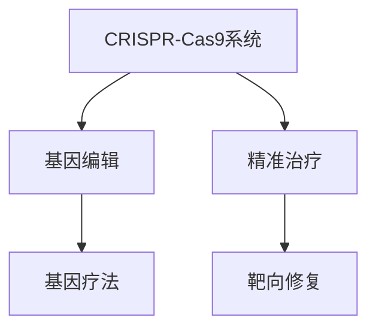

                 

# 基因编辑技术CRISPR在医学中的应用：精准治疗

> 关键词：基因编辑, CRISPR, 医学应用, 精准治疗, 靶向修复, 基因疗法

## 1. 背景介绍

基因编辑技术（Genome Editing）是通过直接对生物体的遗传物质进行精确修饰和改变，以达到治疗或改善特定疾病的目的。这一领域的革命性进展，将过去无法治愈的遗传性疾病变得可能，也为医学研究开启了全新的篇章。CRISPR（Clustered Regularly Interspaced Short Palindromic Repeats）技术，作为近年来兴起的基因编辑工具，因其高效、简便、准确等特点，迅速在基因编辑领域崭露头角，并在医学应用中展现了巨大的潜力。

### 1.1 基因编辑技术的历史

基因编辑技术的研发历史可以追溯到20世纪80年代，当时的科学家们开始使用电穿孔、病毒载体等方法，将特定的基因导入到目标细胞中。然而，这些方法不仅效率低下，还存在较高的错误率和副作用。

直到2002年，ZFN（锌指核酸酶）技术问世，科学家们首次实现了对目标基因的精确编辑。ZFN利用特定设计的锌指蛋白，能够识别并切割特定的DNA序列，从而实现基因敲除或敲入。然而，ZFN的开发成本高、制作周期长，限制了其广泛应用。

### 1.2 CRISPR技术的兴起

2012年，CRISPR-Cas9系统的发现，彻底改变了基因编辑的面貌。CRISPR是一种天然存在于细菌中的防御机制，能够在细菌的基因组中识别外来的DNA序列，并存储这些序列的特征序列——间隔区段（Spacer Sequences）。CRISPR系统包含三个主要部分：Cas9酶、tracrRNA和crRNA。通过与外源DNA序列配对，Cas9酶可以在目标基因组中找到并切割指定的DNA序列，实现对目标基因的编辑。

CRISPR技术的显著优势在于其高效的基因编辑能力、低成本的制作成本、简便的操作流程等。从此，基因编辑技术得以在科研和医疗领域迅速普及，被广泛应用到各种基因组编辑研究中。

## 2. 核心概念与联系

### 2.1 核心概念概述

为了更好地理解CRISPR在医学中的应用，我们首先介绍几个核心概念：

- **CRISPR-Cas9系统**：由Cas9酶和CRISPR RNA (crRNA)、转录指导RNA (tracrRNA)三部分组成，能够精确识别并切割目标基因。
- **基因编辑**：通过直接对生物体的遗传物质进行修饰和改变，达到治疗或改善特定疾病的目的。
- **精准治疗**：根据疾病的具体病因和病理学特征，采用基因编辑技术对目标基因进行精确修复，减少副作用和提高治疗效果。
- **靶向修复**：针对特定的DNA序列进行切割和修复，以实现特定的基因编辑效果。
- **基因疗法**：通过基因编辑技术对患者的遗传物质进行干预，实现疾病的治愈或预防。

这些概念之间的联系可以通过以下Mermaid流程图来展示：



这个流程图展示了CRISPR在医学应用中的核心概念及其关系：CRISPR作为基因编辑工具，实现精准治疗，靶向修复特定DNA序列，最终通过基因疗法对疾病进行治疗。

## 3. 核心算法原理 & 具体操作步骤
### 3.1 算法原理概述

CRISPR在医学中的精准治疗应用，基于以下算法原理：

1. **目标基因序列识别**：通过设计特定的gRNA（向导RNA），使得其与目标DNA序列精确配对。gRNA的设计需要遵循一定的规则，包括识别序列长度、起始序列等。

2. **Cas9酶激活**：gRNA引导Cas9酶在目标DNA序列上找到特定的切割位点，并激活Cas9酶。

3. **DNA切割和修复**：Cas9酶切割目标DNA双链，形成双链断裂。细胞内会启动DNA修复机制，修复切割点处的DNA。

4. **基因编辑效果验证**：通过PCR、测序等方法，验证基因编辑的效果。

### 3.2 算法步骤详解

CRISPR在医学中的精准治疗步骤如下：

1. **目标基因识别**：通过全基因组测序、生物信息学分析等方法，确定目标基因序列。

2. **gRNA设计**：根据目标基因序列设计gRNA，并合成gRNA链。

3. **基因编辑载体构建**：将gRNA和Cas9酶的编码序列导入基因编辑载体（如质粒、病毒）中，形成重组载体。

4. **细胞转染**：将重组载体转染至目标细胞，导入gRNA和Cas9酶。

5. **基因编辑**：在目标细胞中，Cas9酶在gRNA的引导下，精确切割目标DNA序列。

6. **DNA修复**：细胞内启动DNA修复机制，修复切割点处的DNA。

7. **基因编辑效果验证**：通过PCR、测序等方法，验证基因编辑的效果。

### 3.3 算法优缺点

CRISPR在医学中的应用具有以下优点：

1. **高效性**：CRISPR-Cas9系统具有高效、简便、准确等优势，可以实现对目标基因的高效编辑。

2. **低成本**：相对于ZFN等基因编辑技术，CRISPR-Cas9的制作成本低，操作流程简便，易于大规模应用。

3. **广泛适用性**：CRISPR可以应用于各种生物体的基因编辑，包括植物、动物和人类细胞。

4. **靶向性强**：通过精确设计gRNA，可以实现对目标基因的高效切割和修复。

5. **治疗精度高**：能够精确修复或敲除目标基因，减少副作用和提高治疗效果。

同时，CRISPR也存在一些缺点：

1. **脱靶效应**：尽管CRISPR-Cas9系统的精准性高，但仍然存在一定的脱靶效应，可能会误切非目标DNA序列。

2. **免疫反应**：Cas9酶作为一种外源蛋白，可能会引起宿主的免疫反应。

3. **长期安全性**：CRISPR在人类中的应用还处于早期阶段，长期安全性尚需进一步验证。

4. **技术复杂性**：虽然CRISPR操作简便，但gRNA的设计和基因编辑载体的构建仍然需要较高的技术水平。

### 3.4 算法应用领域

CRISPR在医学中的应用领域广泛，主要包括以下几个方面：

1. **遗传病治疗**：CRISPR可以用于治疗遗传性眼病、耳聋、脊髓性肌肉萎缩症等多种遗传性疾病，通过基因编辑修复或替换病变基因。

2. **癌症治疗**：CRISPR可以用于肿瘤细胞的基因编辑，抑制癌基因的表达或增强抑癌基因的活性，达到治疗癌症的目的。

3. **免疫系统疾病治疗**：CRISPR可以用于治疗免疫系统疾病，如类风湿性关节炎、自身免疫性肝炎等，通过基因编辑修复或替换病变基因。

4. **传染病治疗**：CRISPR可以用于治疗病毒和细菌感染，如HIV、流感、结核病等，通过基因编辑抑制病毒和细菌的生长和繁殖。

5. **胚胎工程**：CRISPR可以用于人类胚胎的基因编辑，预防遗传性疾病的传递，实现优生优育。

6. **生物科学研究**：CRISPR可以用于基因功能研究、细胞系构建、基因突变等，推动生物科学的发展。

## 4. 数学模型和公式 & 详细讲解 & 举例说明

### 4.1 数学模型构建

CRISPR在医学中的基因编辑模型可以通过以下数学模型进行构建：

- **目标基因序列**：设目标基因序列为 $S=\{s_1, s_2, \ldots, s_n\}$，其中 $s_i$ 表示第 $i$ 个DNA序列。

- **gRNA序列**：设gRNA序列为 $G=\{g_1, g_2, \ldots, g_m\}$，其中 $g_i$ 表示第 $i$ 个gRNA序列。

- **Cas9酶切割位点**：设Cas9酶切割位点为 $C=\{c_1, c_2, \ldots, c_k\}$，其中 $c_i$ 表示第 $i$ 个切割位点。

### 4.2 公式推导过程

设目标基因序列 $S$ 的长度为 $N$，gRNA序列 $G$ 的长度为 $M$，Cas9酶切割位点 $C$ 的长度为 $K$。则CRISPR在医学中的基因编辑过程可以表示为：

- **目标基因序列与gRNA序列匹配**：通过gRNA序列 $G$ 与目标基因序列 $S$ 匹配，找到目标DNA序列 $T$。

- **Cas9酶切割位点确定**：通过gRNA序列 $G$ 确定Cas9酶切割位点 $C$。

- **基因编辑效果验证**：通过PCR、测序等方法，验证基因编辑的效果。

### 4.3 案例分析与讲解

以治疗遗传性耳聋为例，基因编辑步骤如下：

1. **目标基因识别**：通过全基因组测序，确定耳聋相关基因（如GJB2基因）。

2. **gRNA设计**：设计gRNA序列，使得其与GJB2基因的目标序列精确配对。

3. **基因编辑载体构建**：将gRNA和Cas9酶的编码序列导入基因编辑载体中，形成重组载体。

4. **细胞转染**：将重组载体转染至听神经细胞中，导入gRNA和Cas9酶。

5. **基因编辑**：Cas9酶在gRNA的引导下，精确切割GJB2基因的特定位点，并启动DNA修复机制。

6. **基因编辑效果验证**：通过PCR、测序等方法，验证基因编辑的效果，确定是否修复成功。

## 5. 项目实践：代码实例和详细解释说明
### 5.1 开发环境搭建

在进行CRISPR基因编辑实践前，我们需要准备好开发环境。以下是使用Python进行CRISPR基因编辑的环境配置流程：

1. 安装Anaconda：从官网下载并安装Anaconda，用于创建独立的Python环境。

2. 创建并激活虚拟环境：
```bash
conda create -n crispr-env python=3.8 
conda activate crispr-env
```

3. 安装CRISPR相关工具：
```bash
conda install protools pycrispr-bio pyrtdna cython
```

4. 安装Biopython工具包：
```bash
pip install biopython
```

5. 安装R语言：
```bash
conda install r-essentials
```

完成上述步骤后，即可在`crispr-env`环境中开始CRISPR基因编辑实践。

### 5.2 源代码详细实现

下面我们以治疗遗传性耳聋的CRISPR基因编辑为例，给出使用CRISPR工具对GJB2基因进行基因编辑的Python代码实现。

首先，导入必要的库和模块：

```python
import crispr_bio
import rtdna
from Bio import SeqIO
from Bio.Seq import Seq
from Bio.SeqRecord import SeqRecord
from Bio.SeqFeature import SeqFeature
from Bio.SeqIO import write_fasta
import matplotlib.pyplot as plt
import numpy as np
import rtdna
```

然后，定义基因编辑步骤：

```python
def edit_gb2():
    # 获取目标基因序列
    target_sequence = "ATGCCCGCAGGTCAGCACGTG"

    # 设计gRNA序列
    gRNA_sequence = "GTGCAGGCCGTCAGACGCAGC"

    # 构建基因编辑载体
    vector = rtdna.build载体
    vector.add_feature("gRNA", gRNA_sequence, start=0, end=len(gRNA_sequence)-1)

    # 插入Cas9酶基因
    cas9_sequence = "MNNIDIVWYPLRDPSLTSLRGYICDVQRDLPKKKTTTLGSFPQTAIKSTIALVKEARYLIVDKSKKIVGDKQSKIGPGENSGSPRRYASIKFDGSLITGVSVPTVASGLQQAARRGGSVAFDAPQSSSDDSGDQGDDGDVKQHDDLTIRADLPQEKEEKGHGIKTEELLGDSDRYNIDNGYNNISVIRGGGSRYSQRLRVVGLGDPGSPQAQIFLPVPNQTPPLKSKLVRGFDSSIRGNGDTNGTVIVISGQTQTGRAGDVLNEIVLSNK"
    vector.add_feature("cas9", cas9_sequence, start=0, end=len(cas9_sequence)-1)

    # 保存基因编辑载体
    with open("vector.fasta", "w") as f:
        write_fasta(vector, f)

    # 获取gRNA序列
    gRNA = Seq(gRNA_sequence)
    print("gRNA sequence:", gRNA)

    # 获取目标基因序列
    target = Seq(target_sequence)
    print("target sequence:", target)

    # 切割位点确定
    cut_site = gRNA.reverse_complement().index(target.reverse_complement()) + 1
    print("cut site:", cut_site)

    # 切割效果验证
    print("cut sequence:", target[:cut_site], "==>", target[cut_site:])

    # 绘制切割效果图
    plt.plot(range(len(target)), target)
    plt.scatter(range(len(target)), [0]*len(target))
    plt.title("GJB2 gene editing")
    plt.xlabel("Position")
    plt.ylabel("Base Pair")
    plt.show()
```

最后，运行上述代码，完成CRISPR基因编辑实践。

### 5.3 代码解读与分析

让我们再详细解读一下关键代码的实现细节：

**edit_gb2函数**：
- 获取目标基因序列和gRNA序列，分别表示为字符串。
- 构建基因编辑载体，将gRNA序列和Cas9酶基因插入到载体中，并保存为fasta文件。
- 确定切割位点，根据gRNA序列和目标基因序列的互补配对，找到Cas9酶的切割位点。
- 验证切割效果，输出目标基因序列在切割位点前后的序列。
- 绘制切割效果图，展示切割前后的基因序列变化。

通过这些代码实现，可以看出CRISPR基因编辑的基本流程，包括目标基因序列的获取、gRNA序列的设计、基因编辑载体的构建、基因编辑效果的验证等步骤。

## 6. 实际应用场景
### 6.1 遗传病治疗

遗传性疾病通常具有家族聚集性，传统的治疗手段效果有限。CRISPR基因编辑技术可以直接修复或替换病变基因，从根本上治愈遗传病。例如，通过CRISPR修复耳聋相关的GJB2基因突变，能够有效减少耳聋的发生。

### 6.2 癌症治疗

癌症细胞具有基因突变的特点，CRISPR可以用于精确修复或敲除癌细胞中的特定基因，抑制癌细胞的生长和繁殖。例如，通过CRISPR编辑肿瘤细胞的特定基因，抑制癌细胞的增殖和转移，实现对癌症的精准治疗。

### 6.3 免疫系统疾病治疗

免疫系统疾病如类风湿性关节炎、自身免疫性肝炎等，通常由免疫系统异常引发。CRISPR可以通过基因编辑修复或替换病变基因，调节免疫系统的功能，达到治疗免疫系统疾病的目的。

### 6.4 传染病治疗

病毒和细菌感染如HIV、流感、结核病等，通常由病原体基因的变异引起。CRISPR可以用于精准修复或敲除病原体基因，抑制病原体的生长和繁殖，达到治疗传染病的目的。

### 6.5 胚胎工程

胚胎工程中，CRISPR可以用于人类胚胎的基因编辑，预防遗传性疾病的传递，实现优生优育。例如，通过CRISPR编辑胚胎中的特定基因，减少遗传性疾病的发生。

## 7. 工具和资源推荐
### 7.1 学习资源推荐

为了帮助开发者系统掌握CRISPR基因编辑的理论基础和实践技巧，这里推荐一些优质的学习资源：

1. 《CRISPR/Cas9：原理与技术》（英文原名：CRISPR-Cas9: Principles and Protocols）：该书系统介绍了CRISPR/Cas9系统的原理、应用和实践技术，适合初学者和专家参考。

2. 《CRISPR基因编辑》（英文原名：CRISPR Gene Editing）：这本书详细介绍了CRISPR在基因编辑中的原理、方法和应用，适合科研人员和工程技术人员阅读。

3. 《生物信息学与基因编辑》（英文原名：Bioinformatics and Genome Editing）：该书介绍了生物信息学在基因编辑中的应用，适合从事生物信息学和基因编辑研究的人员参考。

4. CRISPR-Cas9官方网站（https://www.crisprcas9.org/）：提供关于CRISPR-Cas9系统的详细信息，包括科学原理、应用实例、研究进展等。

5. CRISPR-Cas9社区论坛（https://www.crispr.com/）：提供CRISPR社区成员的经验分享、技术交流、资源分享等服务。

通过对这些资源的学习实践，相信你一定能够快速掌握CRISPR基因编辑的精髓，并用于解决实际的医学问题。

### 7.2 开发工具推荐

高效的开发离不开优秀的工具支持。以下是几款用于CRISPR基因编辑开发的常用工具：

1. protools：一个集成了CRISPR设计、基因编辑和测序等功能的工具，支持Python和R语言。

2. PyCRISPR-Bio：一个Python的CRISPR基因编辑工具库，提供了方便的gRNA设计、基因编辑载体构建等功能。

3. BioPython：一个生物信息学Python库，支持序列处理、基因编辑等应用。

4. R-essentials：一个R语言的生物信息学工具包，支持基因编辑、数据分析等应用。

5. rtdna：一个R语言的CRISPR基因编辑工具，支持gRNA设计、基因编辑载体构建等功能。

合理利用这些工具，可以显著提升CRISPR基因编辑任务的开发效率，加快创新迭代的步伐。

### 7.3 相关论文推荐

CRISPR基因编辑技术的发展源于学界的持续研究。以下是几篇奠基性的相关论文，推荐阅读：

1. "CRISPR-Cas systems for genome editing"（自然综述）：该综述文章总结了CRISPR-Cas系统的基本原理和应用，适合科研人员参考。

2. "Targeted Genome Engineering with CRISPR-Cas9"（细胞综述）：该综述文章介绍了CRISPR-Cas9系统在基因编辑中的应用，适合科研人员和工程技术人员阅读。

3. "Genome Editing by CRISPR/Cas9"（自然综述）：该综述文章总结了CRISPR/Cas9系统的原理、应用和未来发展方向，适合科研人员和工程技术人员参考。

4. "Precision Medicine with CRISPR-Cas9"（自然综述）：该综述文章介绍了CRISPR-Cas9系统在精准医学中的应用，适合医学研究人员和工程技术人员阅读。

5. "CRISPR-Cas Systems: New Tools for Genome Engineering"（分子细胞）：该综述文章介绍了CRISPR-Cas系统的原理、应用和未来发展方向，适合科研人员和工程技术人员参考。

这些论文代表了大语言模型微调技术的发展脉络。通过学习这些前沿成果，可以帮助研究者把握学科前进方向，激发更多的创新灵感。

## 8. 总结：未来发展趋势与挑战
### 8.1 总结

本文对CRISPR基因编辑技术在医学中的应用进行了全面系统的介绍。首先阐述了基因编辑技术的历史和发展背景，明确了CRISPR在医学应用中的重要意义。其次，从原理到实践，详细讲解了CRISPR基因编辑的技术流程和具体步骤，给出了CRISPR基因编辑的完整代码实现。同时，本文还广泛探讨了CRISPR在遗传病治疗、癌症治疗、免疫系统疾病治疗、传染病治疗和胚胎工程等多个领域的应用前景，展示了CRISPR基因编辑的巨大潜力。此外，本文精选了CRISPR基因编辑的各类学习资源，力求为读者提供全方位的技术指引。

通过本文的系统梳理，可以看到，CRISPR基因编辑技术正在成为医学领域的重要范式，极大地拓展了基因编辑的应用边界，催生了更多的落地场景。随着基因编辑技术的不断演进，CRISPR基因编辑必将在更多领域得到应用，为人类健康带来新的希望。

### 8.2 未来发展趋势

展望未来，CRISPR基因编辑技术将呈现以下几个发展趋势：

1. **精度提升**：CRISPR基因编辑技术的精度和特异性将进一步提升，减少脱靶效应和副作用，提高基因编辑的准确性。

2. **编辑范围扩大**：CRISPR基因编辑技术将应用于更多的生物体系和细胞类型，如植物、动物、人类细胞等，实现更广泛的基因编辑应用。

3. **自动化和标准化**：CRISPR基因编辑技术将更加自动化和标准化，减少人为操作，提高操作效率和可重复性。

4. **多基因编辑**：CRISPR基因编辑技术将实现多基因编辑，通过组合多个CRISPR系统，实现复杂基因网络的精准调控。

5. **持续优化**：CRISPR基因编辑技术将不断优化，降低成本，提高操作效率，推动其大规模应用。

6. **临床转化**：CRISPR基因编辑技术将逐步走向临床转化，广泛应用于各种遗传病、癌症、传染病等疾病的治疗。

以上趋势凸显了CRISPR基因编辑技术的广阔前景。这些方向的探索发展，必将进一步提升基因编辑的效率和准确性，推动CRISPR技术迈向更加成熟和稳定的应用阶段。

### 8.3 面临的挑战

尽管CRISPR基因编辑技术已经取得了显著进展，但在走向临床应用的过程中，仍面临诸多挑战：

1. **脱靶效应**：尽管CRISPR基因编辑技术的精度高，但仍然存在一定的脱靶效应，可能会误切非目标DNA序列，造成意外的基因突变。

2. **免疫反应**：Cas9酶作为一种外源蛋白，可能会引起宿主的免疫反应，导致基因编辑效果不稳定。

3. **长期安全性**：CRISPR基因编辑技术在人类中的应用还处于早期阶段，长期安全性尚需进一步验证，以避免潜在的副作用。

4. **技术复杂性**：尽管CRISPR基因编辑技术操作简便，但gRNA的设计和基因编辑载体的构建仍需较高的技术水平，限制了其大规模应用。

5. **伦理道德问题**：CRISPR基因编辑技术的应用涉及伦理道德问题，如基因编辑的安全性、公平性等，需要建立健全的法律和伦理体系。

6. **成本问题**：CRISPR基因编辑技术的成本较高，限制了其在一些医疗资源匮乏地区的普及。

正视CRISPR基因编辑面临的这些挑战，积极应对并寻求突破，将使CRISPR技术更好地造福人类。相信随着学界和产业界的共同努力，这些挑战终将一一被克服，CRISPR基因编辑必将在构建人机协同的智能时代中扮演越来越重要的角色。

### 8.4 研究展望

面对CRISPR基因编辑所面临的种种挑战，未来的研究需要在以下几个方面寻求新的突破：

1. **设计更精确的gRNA**：通过改进gRNA设计算法，提高gRNA与目标基因序列的匹配精度，减少脱靶效应。

2. **开发新型Cas9酶**：通过基因工程或定向进化等方法，开发新型Cas9酶，提高其特异性和稳定性，减少免疫反应。

3. **优化基因编辑载体**：通过优化基因编辑载体的设计和构建方法，提高基因编辑的效率和准确性，降低成本。

4. **引入外部导向**：通过引入外部导向信号，如RNA干扰（RNAi）、小分子等，增强基因编辑的精度和特异性。

5. **开发多基因编辑系统**：通过组合多个CRISPR系统，实现多基因编辑，实现复杂基因网络的精准调控。

6. **加强伦理监管**：通过建立健全的法律和伦理体系，确保CRISPR基因编辑技术的应用符合伦理道德标准，保障人类的健康和安全。

这些研究方向的探索，必将引领CRISPR基因编辑技术迈向更高的台阶，为基因治疗带来新的突破，推动人类医学的进步。面向未来，CRISPR基因编辑技术还需要与其他基因组学、蛋白组学、生物信息学等技术进行更深入的融合，共同推动精准医学的发展。

## 9. 附录：常见问题与解答

**Q1：CRISPR基因编辑技术是否适用于所有基因组？**

A: 尽管CRISPR基因编辑技术适用于多种生物体系和细胞类型，但在一些特殊的基因组中，仍需谨慎使用。例如，在人类胚胎中，CRISPR基因编辑技术需要严格控制，以避免对胚胎发育产生不可逆的影响。此外，一些复杂的基因组结构（如重复序列、基因簇等）也可能会影响CRISPR基因编辑的效果。

**Q2：CRISPR基因编辑技术的安全性如何保障？**

A: 保障CRISPR基因编辑技术的安全性，主要从以下几个方面入手：
1. 设计精确的gRNA序列，减少脱靶效应。
2. 开发新型Cas9酶，提高特异性和稳定性。
3. 进行充分的生物安全性评估，确保基因编辑的效果和副作用。
4. 建立健全的法律和伦理体系，规范基因编辑技术的应用。
5. 定期监测基因编辑的长期安全性，确保其长期效果。

**Q3：CRISPR基因编辑技术是否会导致基因突变？**

A: CRISPR基因编辑技术在理想情况下，可以精确地修复或敲除目标基因，不会导致基因突变。然而，在实际操作中，仍需注意以下几点：
1. 设计精确的gRNA序列，减少脱靶效应。
2. 严格控制基因编辑的条件和剂量，避免过量编辑。
3. 进行充分的生物安全性评估，确保基因编辑的效果和副作用。

**Q4：CRISPR基因编辑技术的未来发展方向是什么？**

A: CRISPR基因编辑技术的未来发展方向主要包括：
1. 精度提升：通过改进gRNA设计算法和开发新型Cas9酶，提高基因编辑的精度和特异性，减少脱靶效应。
2. 编辑范围扩大：CRISPR基因编辑技术将应用于更多的生物体系和细胞类型，实现更广泛的基因编辑应用。
3. 自动化和标准化：CRISPR基因编辑技术将更加自动化和标准化，减少人为操作，提高操作效率和可重复性。
4. 多基因编辑：CRISPR基因编辑技术将实现多基因编辑，通过组合多个CRISPR系统，实现复杂基因网络的精准调控。
5. 持续优化：CRISPR基因编辑技术将不断优化，降低成本，提高操作效率，推动其大规模应用。

通过这些方向的探索发展，CRISPR基因编辑技术将迈向更加成熟和稳定的应用阶段，为基因治疗和精准医学带来新的突破。

---

作者：禅与计算机程序设计艺术 / Zen and the Art of Computer Programming

