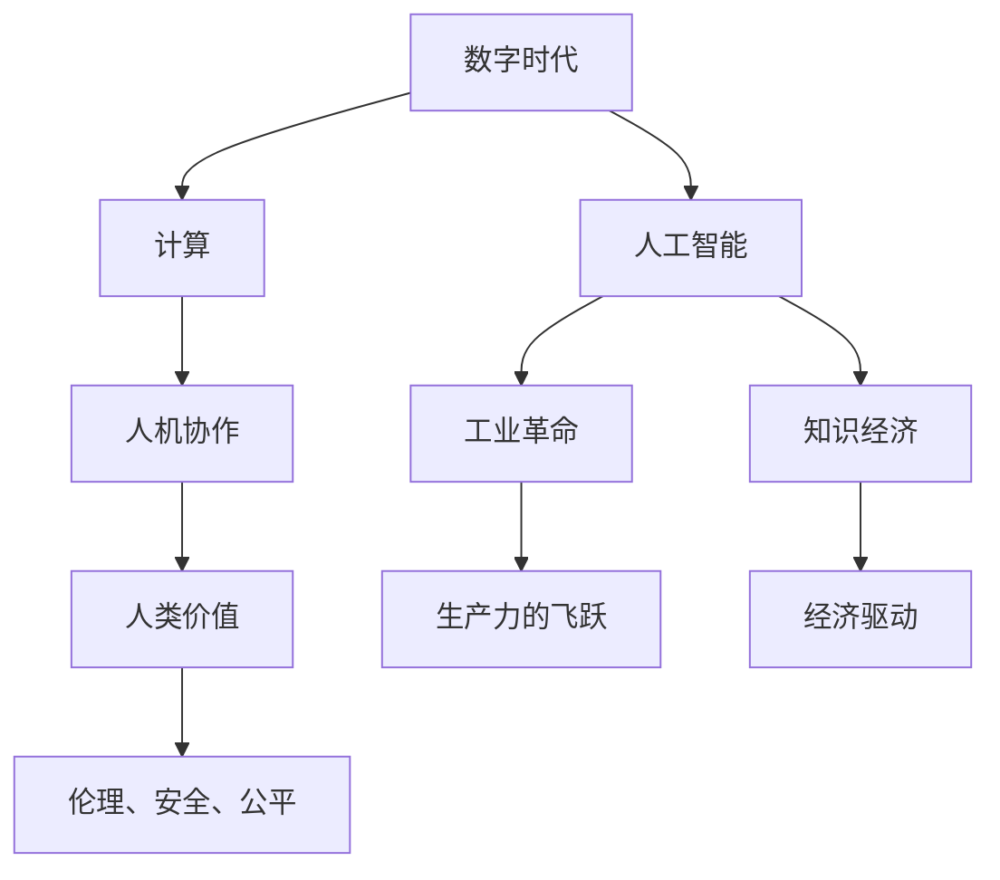

                 

# 塑造数字时代：人类计算的关键作用

> 关键词：数字时代, 计算, 人工智能, 人机协作, 工业革命, 知识经济, 人类价值

## 1. 背景介绍

### 1.1 问题由来
当今世界，我们正处在一个以数字化为核心的全新时代，即“数字时代”。在数字时代，信息流通变得前所未有的迅捷，各种技术和服务深刻地改变着我们的工作、生活乃至思考方式。但与此同时，我们也要面对信息爆炸、数据过载、隐私泄露、计算资源匮乏等一系列挑战。

### 1.2 问题核心关键点
针对这些挑战，计算技术显得尤为重要。计算不仅支撑了现代信息社会的运转，也成为推动人类社会不断进步的关键力量。然而，计算不仅仅是机器的事，更是人类智慧与能力的体现。本文将深入探讨计算在数字时代的作用，并分析人类与计算技术相互协作的机制。

### 1.3 问题研究意义
探讨计算技术在数字时代的作用，不仅有助于理解当前技术趋势和未来发展方向，还能够帮助我们重新认识计算与人类价值的关系，进而推动人机协作向着更高效、更人性化、更有价值的方向发展。

## 2. 核心概念与联系

### 2.1 核心概念概述

为更好地理解计算在数字时代的作用，本节将介绍几个密切相关的核心概念：

- **数字时代**：以信息技术为核心的时代，信息流通变得前所未有的迅捷，数字经济正在成为主导经济形态。
- **计算**：指通过各种计算工具（如计算机、数学模型等）对数据进行处理和分析的过程。
- **人工智能**：利用计算技术使机器能够模拟人类智能的广泛应用领域，包括自然语言处理、计算机视觉、机器人等。
- **人机协作**：指人类与计算技术在各自优势领域的相互补充和协作，以实现更高效率、更智能化的任务处理。
- **工业革命**：以计算技术为基础的第四次工业革命，引领了生产力的巨大飞跃。
- **知识经济**：基于知识和技术创新驱动的经济发展模式，计算在其中扮演着核心角色。
- **人类价值**：在计算与技术的发展过程中，确保计算技术的伦理、安全和公平应用，保障人类的利益和福祉。

这些核心概念之间的逻辑关系可以通过以下Mermaid流程图来展示：



这个流程图展示出数字时代的核心概念及其相互关系：

1. **数字时代**提供技术支撑。
2. **计算**是数字时代的基础，推动人工智能的发展。
3. **人工智能**在多个领域实现人机协作。
4. **工业革命**和**知识经济**是人机协作带来的经济影响。
5. **人类价值**是确保计算技术应用伦理、安全和公平的关键。

这些概念共同构成了数字时代的计算框架，使得计算技术能够更好地服务于人类社会的进步。

## 3. 核心算法原理 & 具体操作步骤
### 3.1 算法原理概述

在数字时代，计算的核心作用在于处理和分析海量数据，提取有价值的信息，辅助人类进行决策和创新。基于计算技术的算法包括但不限于数据挖掘、机器学习、深度学习、自然语言处理等，这些算法共同构建了现代信息社会的智能基础设施。

计算的核心算法原理可以概括为以下几个方面：

- **数据处理与分析**：通过各种算法对数据进行预处理、特征提取、模式识别等，提取有价值的信息，为决策提供依据。
- **机器学习与深度学习**：利用计算技术，使机器能够从数据中学习规律，提高自动化决策和任务执行的效率。
- **自然语言处理**：通过计算技术，实现对自然语言的理解、生成和翻译，促进人机交互的智能化。

### 3.2 算法步骤详解

下面以机器学习为例，详细介绍基于计算的核心算法步骤：

**Step 1: 数据收集与预处理**
- 从不同渠道（如传感器、数据库、互联网等）收集数据。
- 进行数据清洗、去重、格式转换等预处理操作，确保数据的质量和一致性。

**Step 2: 模型训练与优化**
- 根据问题类型，选择合适的算法模型（如线性回归、决策树、神经网络等）。
- 划分训练集、验证集、测试集，进行模型训练。
- 通过正则化、Dropout、早停等技术，防止模型过拟合。
- 使用交叉验证、网格搜索等方法，优化模型超参数，提升模型性能。

**Step 3: 模型评估与部署**
- 在测试集上评估模型性能，使用准确率、召回率、F1值等指标进行评估。
- 将优化后的模型部署到实际应用中，进行持续监测和调整。
- 在生产环境中，实现模型的高效推理和在线学习，不断提升模型效果。

### 3.3 算法优缺点

计算技术在数字时代的广泛应用，带来了显著的优点和局限性：

**优点**：
- **高效性**：自动化处理大规模数据，提高工作效率。
- **灵活性**：可应用于多种场景，如金融、医疗、物流、制造等。
- **普适性**：算法模型经过训练后，具有广泛适用性，可迅速应用于新任务。
- **创新性**：推动新知识和新方法的产生，推动技术进步。

**局限性**：
- **依赖数据**：需要大量高质量标注数据，数据质量直接影响算法效果。
- **计算资源**：算法训练和推理需要大量计算资源，如高性能计算设备。
- **解释性不足**：部分算法模型（如深度学习）难以解释决策过程，影响信任和可解释性。
- **隐私风险**：处理敏感数据时，需注意隐私保护和数据安全。

### 3.4 算法应用领域

计算技术在多个领域得到广泛应用，以下是几个典型的例子：

- **金融行业**：利用计算技术进行风险评估、信用评分、欺诈检测等。
- **医疗领域**：通过计算技术进行疾病诊断、个性化治疗、基因分析等。
- **制造业**：利用计算技术进行生产调度、质量控制、设备维护等。
- **零售业**：通过计算技术进行客户行为分析、库存管理、推荐系统等。
- **交通系统**：利用计算技术进行交通流量预测、智能调度、车辆控制等。

## 4. 数学模型和公式 & 详细讲解 & 举例说明

### 4.1 数学模型构建

计算算法通常涉及大量的数学模型和公式，以下以线性回归模型为例进行详细讲解。

**线性回归模型**：
设 $y$ 为输出变量，$x_1, x_2, ..., x_n$ 为输入变量，线性回归模型的目标是通过最小化残差平方和（RSS），拟合出最优的线性关系：

$$
y = \theta_0 + \theta_1 x_1 + \theta_2 x_2 + ... + \theta_n x_n
$$

其中 $\theta_0, \theta_1, \theta_2, ..., \theta_n$ 为模型参数。

### 4.2 公式推导过程

线性回归模型的最小化残差平方和目标函数为：

$$
\min_{\theta} RSS(\theta) = \sum_{i=1}^{N} (y_i - \theta_0 - \theta_1 x_{i1} - \theta_2 x_{i2} - ... - \theta_n x_{in})^2
$$

求导后得到梯度表达式：

$$
\frac{\partial RSS(\theta)}{\partial \theta_k} = -2 \sum_{i=1}^{N} (y_i - \theta_0 - \theta_1 x_{i1} - \theta_2 x_{i2} - ... - \theta_n x_{in})x_{ik}
$$

求解得到模型参数：

$$
\theta_k = \frac{\sum_{i=1}^{N} (y_i x_{ik})}{\sum_{i=1}^{N} x_{ik}^2}, k \in \{0, 1, 2, ..., n\}
$$

### 4.3 案例分析与讲解

考虑一个简单的房价预测模型，设房价 $y$ 与房间面积 $x_1$、地理位置 $x_2$ 相关，构建线性回归模型：

$$
y = \theta_0 + \theta_1 x_1 + \theta_2 x_2
$$

给定一组训练数据：

| 房屋面积 | 地理位置 | 房价 |
| --- | --- | --- |
| 100 | 1 | 50 |
| 120 | 2 | 60 |
| 110 | 1 | 55 |
| 130 | 2 | 65 |

通过求解最小化残差平方和得到模型参数：

$$
\theta_0 = 45.25, \theta_1 = 0.95, \theta_2 = 1.75
$$

代入新数据（例如面积130，地理位置3），得到预测房价为：

$$
y = 45.25 + 0.95 \times 130 + 1.75 \times 3 = 117.25
$$

## 5. 项目实践：代码实例和详细解释说明

### 5.1 开发环境搭建

在进行计算项目实践前，我们需要准备好开发环境。以下是使用Python进行Scikit-learn开发的Python环境配置流程：

1. 安装Anaconda：从官网下载并安装Anaconda，用于创建独立的Python环境。

2. 创建并激活虚拟环境：
```bash
conda create -n myenv python=3.8 
conda activate myenv
```

3. 安装Scikit-learn：
```bash
pip install scikit-learn
```

4. 安装必要的其他工具包：
```bash
pip install numpy pandas matplotlib seaborn
```

完成上述步骤后，即可在`myenv`环境中开始计算项目实践。

### 5.2 源代码详细实现

下面以房价预测为例，给出使用Scikit-learn进行线性回归的Python代码实现：

```python
import pandas as pd
from sklearn.linear_model import LinearRegression
from sklearn.model_selection import train_test_split
from sklearn.metrics import mean_squared_error
import numpy as np

# 数据读取
data = pd.read_csv('housing.csv')

# 数据预处理
X = data[['area', 'location']]
y = data['price']

# 分割数据集
X_train, X_test, y_train, y_test = train_test_split(X, y, test_size=0.3, random_state=42)

# 模型训练
model = LinearRegression()
model.fit(X_train, y_train)

# 模型评估
y_pred = model.predict(X_test)
mse = mean_squared_error(y_test, y_pred)
rmse = np.sqrt(mse)
print(f'RMSE: {rmse:.2f}')
```

### 5.3 代码解读与分析

让我们再详细解读一下关键代码的实现细节：

**数据读取与预处理**：
- `pd.read_csv()`函数用于读取CSV格式的数据文件。
- `X` 和 `y` 分别代表特征和输出变量。
- `train_test_split()`函数用于将数据集分割为训练集和测试集。

**模型训练与评估**：
- `LinearRegression()`类创建线性回归模型。
- `model.fit()`方法用于训练模型。
- `model.predict()`方法用于预测测试集。
- `mean_squared_error()`函数计算预测值与真实值之间的均方误差。
- `np.sqrt()`函数计算均方根误差。

**评估结果**：
- 最终输出模型的均方根误差（RMSE），用于评估模型预测的准确性。

通过Scikit-learn库，我们能够快速构建和评估线性回归模型，大大简化了计算算法开发的过程。

## 6. 实际应用场景

### 6.1 智能医疗

计算技术在智能医疗领域有着广泛应用，如疾病预测、治疗方案推荐、个性化治疗等。通过计算模型，医生能够更快地诊断疾病、制定治疗方案，从而提升医疗服务质量。

### 6.2 金融风控

计算技术在金融领域用于风险评估、信用评分、欺诈检测等。通过计算模型，金融机构能够更准确地识别风险，制定有效的风控策略，保障金融安全。

### 6.3 工业生产

计算技术在工业生产中用于优化生产流程、质量控制、设备维护等。通过计算模型，企业能够提高生产效率、降低成本，实现智能化生产。

### 6.4 交通管理

计算技术在交通管理中用于流量预测、智能调度、车辆控制等。通过计算模型，交通管理部门能够优化交通流量，提升通行效率，减少交通拥堵。

## 7. 工具和资源推荐

### 7.1 学习资源推荐

为了帮助开发者系统掌握计算技术，这里推荐一些优质的学习资源：

1. **Coursera《机器学习》课程**：由斯坦福大学Andrew Ng教授主讲，系统介绍了机器学习的基本概念和算法，适合初学者。
2. **DeepLearning.ai《深度学习专项课程》**：由Coursera和Google合作推出，涵盖深度学习的基础知识和应用实例。
3. **《Python机器学习》书籍**：由Sebastian Raschka撰写，详细介绍了Python在机器学习中的应用，适合实战练习。
4. **Scikit-learn官方文档**：Scikit-learn库的官方文档，提供了丰富的算法实现和详细的使用指南。
5. **Kaggle**：数据科学竞赛平台，提供大量的数据集和竞赛项目，适合实践学习。

通过对这些资源的学习实践，相信你一定能够快速掌握计算技术的精髓，并用于解决实际的计算问题。

### 7.2 开发工具推荐

高效的开发离不开优秀的工具支持。以下是几款用于计算技术开发的常用工具：

1. **Jupyter Notebook**：交互式笔记本环境，支持代码编写、数据处理、结果展示等，非常适合Python开发。
2. **TensorFlow**：由Google开发的人工智能框架，支持分布式计算和深度学习模型训练。
3. **PyTorch**：由Facebook开发的人工智能框架，支持动态计算图和深度学习模型训练。
4. **Numpy**：Python数值计算库，提供了高效的数组操作和数学函数。
5. **Pandas**：Python数据处理库，支持数据清洗、转换、分析等。
6. **Matplotlib**：Python数据可视化库，支持绘制各种图表。

合理利用这些工具，可以显著提升计算技术开发的速度和质量，加快创新迭代的步伐。

### 7.3 相关论文推荐

计算技术的发展离不开学界的持续研究。以下是几篇奠基性的相关论文，推荐阅读：

1. **Deep Learning**（Hinton等人，2012）：提出了深度学习的基本概念和算法，奠定了深度学习的理论基础。
2. **ImageNet Classification with Deep Convolutional Neural Networks**（Krizhevsky等人，2012）：提出了卷积神经网络（CNN），用于图像识别任务，取得了当时最优的性能。
3. **Large Scale Learning to Rank**（Dalvi和Vikas，2013）：提出了大规模学习排序算法，用于推荐系统。
4. **AlphaGo Zero**（Silver等人，2017）：利用强化学习技术，成功训练了首个击败人类围棋世界冠军的AI系统，展示了计算技术在智能博弈中的应用潜力。

这些论文代表了大计算技术的进步，通过学习这些前沿成果，可以帮助研究者把握学科前进方向，激发更多的创新灵感。

## 8. 总结：未来发展趋势与挑战

### 8.1 总结

本文对计算技术在数字时代的作用进行了全面系统的介绍。首先阐述了计算技术在推动数字时代发展中的重要地位，明确了计算技术在多个领域的应用价值。其次，从原理到实践，详细讲解了计算算法的基本步骤，给出了具体的代码实例。同时，本文还探讨了计算技术在实际应用中的未来发展趋势和面临的挑战，提供了实用的工具和资源推荐。

通过本文的系统梳理，可以看到，计算技术在数字时代的巨大作用和潜力。计算技术的不断进步和优化，将进一步提升信息社会的智能化水平，推动人机协作向着更加高效、智能、和谐的方向发展。

### 8.2 未来发展趋势

展望未来，计算技术的发展将呈现以下几个趋势：

1. **计算资源更加普及**：随着云计算、边缘计算的发展，计算资源将更加普及，更多用户能够轻松使用计算技术。
2. **计算模型更加复杂**：深度学习、强化学习等复杂模型将不断涌现，提升计算技术的应用范围和效果。
3. **计算与人工智能深度融合**：计算技术与人工智能技术的深度融合，将带来更加智能、灵活、个性化的计算解决方案。
4. **计算与人机协作更加紧密**：计算技术与人类智慧的结合将更加紧密，实现人机协作的智能化、高效化。
5. **计算伦理和社会责任更加重要**：计算技术的广泛应用将带来更多的伦理和社会责任问题，如何确保计算技术的公平、透明和可控将是一个重要课题。

### 8.3 面临的挑战

尽管计算技术在数字时代中扮演着关键角色，但其发展过程中也面临诸多挑战：

1. **数据隐私和安全**：计算过程中涉及大量数据，数据隐私和安全问题将更加突出。
2. **计算资源的不均衡**：计算资源的普及和分配仍然存在不均衡问题，部分地区和行业将难以获得足够的计算支持。
3. **计算技术的伦理和社会影响**：计算技术的广泛应用将带来一系列伦理和社会问题，如就业替代、数据偏见等。
4. **计算模型的解释性**：复杂计算模型的解释性不足，可能影响用户信任和接受度。
5. **计算系统的复杂性和可维护性**：大规模计算系统的高复杂性和可维护性问题，将是一个重要挑战。

### 8.4 研究展望

面对计算技术发展的挑战，未来的研究需要在以下几个方面寻求新的突破：

1. **数据隐私保护**：研究如何在大规模数据处理中保护用户隐私，确保数据安全。
2. **计算资源优化**：探索更加高效、普适的计算资源管理方法，实现资源的均衡分配。
3. **计算伦理和社会责任**：建立计算技术的伦理和社会责任机制，确保技术的公平和透明。
4. **计算模型的解释性**：研究如何提高计算模型的解释性，增强用户信任和接受度。
5. **计算系统的可维护性**：研究如何提升计算系统的可维护性，降低复杂系统的维护成本。

这些研究方向的探索，必将引领计算技术迈向更高的台阶，为人机协作提供更高效、更智能、更安全的解决方案。面向未来，计算技术将进一步拓展其应用边界，为人类的智能化进步提供强大动力。

## 9. 附录：常见问题与解答

**Q1: 计算技术的发展是否会对就业产生影响？**

A: 计算技术的发展确实会对部分传统职业产生影响，如流水线工人、银行柜员等。但同时也会创造新的职业机会，如数据分析师、机器学习工程师、计算科学家等。因此，计算技术的发展需要平衡就业影响，推动职业转换和技能升级。

**Q2: 如何确保计算技术的公平性和透明度？**

A: 确保计算技术的公平性和透明度，需要从数据、模型和应用等多个层面进行改进：
1. 数据层面：确保数据集的多样性和代表性，避免数据偏见。
2. 模型层面：使用公平性评估指标，避免模型偏见。
3. 应用层面：建立透明的算法决策过程，提供可解释性输出。

**Q3: 如何确保计算技术的伦理和社会责任？**

A: 确保计算技术的伦理和社会责任，需要从技术、政策和用户等多个层面进行改进：
1. 技术层面：研究如何避免计算技术的滥用和误用，确保技术的安全和可控。
2. 政策层面：制定相关政策和法规，规范计算技术的应用。
3. 用户层面：提高公众对计算技术的认知和接受度，确保技术的普及和接受。

通过这些措施，可以最大限度地发挥计算技术在数字时代的积极作用，减少其负面影响，推动社会的公平、透明和可持续进步。

---

作者：禅与计算机程序设计艺术 / Zen and the Art of Computer Programming

