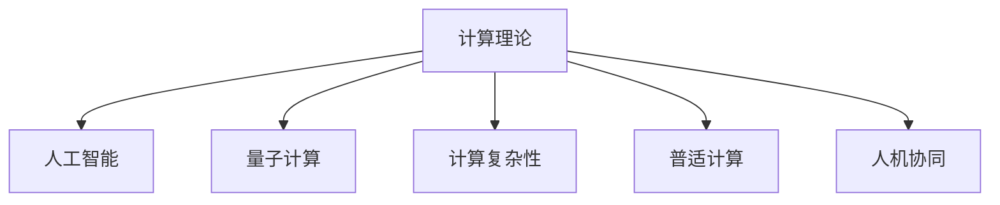

                 

# 塑造数字时代：人类计算的关键作用

> 关键词：数字时代,计算理论,人工智能,量子计算,量子算法,计算复杂性,普适计算,人机协同

## 1. 背景介绍

### 1.1 问题由来
在当前这个数字化时代，计算技术已经成为推动社会进步和经济发展的核心动力。从日常生活中的智能手机应用到医疗、金融等关键领域的高效运营，计算技术的广泛应用带来了前所未有的便利和效率提升。然而，计算技术的发展并非一帆风顺，尤其是在计算机的起源和发展历程中，人类计算发挥了至关重要的作用。

### 1.2 问题核心关键点
计算技术的发展历程，从机械计算到电子计算机，再到现代的分布式计算和量子计算，无不体现着人类智慧的卓越贡献。然而，尽管现代计算技术已经非常先进，但其根本依然是基于经典计算理论。量子计算的提出，为计算技术带来了新的变革，但仍然依赖于人类对计算规律的深入理解和创造。

因此，了解和掌握计算理论，尤其是人类计算在其中的关键作用，对于把握计算技术的发展趋势，指导未来计算应用，具有重要意义。本文将从计算理论的基本概念出发，深入探讨人类计算在现代计算技术发展中的关键作用，为理解计算技术的发展脉络提供全新的视角。

### 1.3 问题研究意义
研究人类计算在现代计算技术中的关键作用，有助于我们深刻理解计算技术的本质和演化过程，进一步揭示计算技术的未来发展方向。这对于计算机科学的理论研究和实际应用都具有重要价值，尤其是在人工智能、量子计算等前沿领域，人类计算的智慧将成为推动技术进步的核心动力。

## 2. 核心概念与联系

### 2.1 核心概念概述

为更好地理解人类计算在现代计算技术中的关键作用，本节将介绍几个密切相关的核心概念：

- 计算理论(Computation Theory)：研究如何用机器（包括计算机构建）实现计算任务的理论基础，涉及算法、复杂性、逻辑等方面的研究。
- 人工智能(Artificial Intelligence)：模拟人类智能的机器系统，包括知识表示、推理、学习、自然语言处理等子领域。
- 量子计算(Quantum Computing)：利用量子力学的原理进行计算的新型计算范式，具有超越传统计算机的计算能力。
- 计算复杂性(Computational Complexity)：研究计算任务完成所需时间的理论框架，尤其是多项式时间和指数时间的区分。
- 普适计算(Universal Computing)：能够模拟任何计算问题的计算模型，如通用图灵机。
- 人机协同(Human-AI Collaboration)：人工智能与人类的协作模式，旨在通过技术与人的智慧相结合，实现更高效、更智能的计算应用。

这些核心概念之间的逻辑关系可以通过以下Mermaid流程图来展示：



这个流程图展示了几大计算概念之间的联系：

1. 计算理论是人工智能、量子计算等技术的基础，研究如何高效、可靠地实现计算任务。
2. 人工智能依托计算理论，通过模拟人类智能实现特定任务，如图像识别、自然语言处理等。
3. 量子计算利用量子力学的原理，开辟了计算能力的全新边界，有望解决复杂计算问题。
4. 计算复杂性研究计算任务所需时间的上限，帮助优化算法设计和资源配置。
5. 普适计算定义了任何问题的计算模型，为计算机科学的发展提供了重要理论支撑。
6. 人机协同将人工智能技术与人类智慧相结合，提升计算应用的智能化水平。

## 3. 核心算法原理 & 具体操作步骤

### 3.1 算法原理概述

现代计算技术的发展，离不开对计算理论的深入理解和应用。人类计算在其中的关键作用体现在对计算规律的发现、创新和应用上。

形式化地，人类计算的核心在于将计算问题抽象为数学模型，并寻找高效的算法实现。典型的人类计算算法包括贪心算法、动态规划、回溯算法等。这些算法在经典计算理论和量子计算中都有应用，体现了人类智慧在不同计算范式中的普适性。

### 3.2 算法步骤详解

基于人类计算的核心算法原理，本节将详细讲解一种经典的人类计算算法——归并排序(Merge Sort)的实现步骤：

**Step 1: 分割问题**
将待排序的序列分割成两个规模相等的子序列，分别进行排序。

**Step 2: 排序子序列**
对分割后的子序列进行递归排序，直到序列长度为1。

**Step 3: 合并子序列**
将排好序的子序列合并成一个有序序列。

**Step 4: 输出结果**
返回最终的有序序列。

具体实现步骤如下：

```python
def merge_sort(arr):
    if len(arr) <= 1:
        return arr
    mid = len(arr) // 2
    left = merge_sort(arr[:mid])
    right = merge_sort(arr[mid:])
    return merge(left, right)

def merge(left, right):
    result = []
    i = j = 0
    while i < len(left) and j < len(right):
        if left[i] < right[j]:
            result.append(left[i])
            i += 1
        else:
            result.append(right[j])
            j += 1
    result += left[i:]
    result += right[j:]
    return result
```

### 3.3 算法优缺点

归并排序作为一种经典的人类计算算法，具有以下优点：

1. 高效稳定：时间复杂度为O(nlogn)，无论数据规模大小，都能保持稳定的排序性能。
2. 可扩展性强：归并排序可以通过并行化等方式扩展到大规模数据排序，具有很高的并行性。
3. 适合数据流排序：归并排序不需要一次性加载全部数据，可以适用于数据流排序的场景。

同时，归并排序也存在以下缺点：

1. 空间复杂度高：归并排序需要额外的空间用于存储临时数组，空间复杂度为O(n)。
2. 实现复杂：虽然时间复杂度低，但归并排序的实现相对复杂，需要递归调用和合并操作。
3. 不适用于小规模数据：当数据规模较小时，归并排序的递归调用和额外空间开销较大，不如插入排序等简单算法。

### 3.4 算法应用领域

归并排序作为一种经典的人类计算算法，广泛应用于各种排序场景中，如数据流排序、外部排序等。

在实际应用中，归并排序可以与其他算法相结合，进一步优化性能。例如，在外部排序中，可以将归并排序与多路归并(Merge Multiway)算法结合，提高排序效率。在分布式系统中，可以将归并排序与其他分布式算法结合，实现高效的并行排序。

此外，归并排序的思路也广泛应用于各种基于排序算法的应用中，如外部搜索、数据压缩等。

## 4. 数学模型和公式 & 详细讲解 & 举例说明

### 4.1 数学模型构建

归并排序的数学模型可以形式化地表示为：

$$
\text{merge\_sort}(A) = 
\begin{cases} 
A & \text{if } |A| \leq 1 \\
\text{merge}(\text{merge\_sort}(A_1), \text{merge\_sort}(A_2)) & \text{otherwise}
\end{cases}
$$

其中 $|A|$ 表示数组 $A$ 的长度，$\text{merge\_sort}$ 和 $\text{merge}$ 分别表示归并排序和合并操作的函数实现。

### 4.2 公式推导过程

以下是归并排序的时间复杂度和空间复杂度的推导过程：

**时间复杂度分析**：
- 分割阶段：$O(\log n)$ 次递归调用。
- 合并阶段：$O(n)$ 次比较和赋值操作。
- 总时间复杂度：$O(n\log n)$。

**空间复杂度分析**：
- 临时数组：$O(n)$ 个元素。
- 栈空间：$O(\log n)$ 次递归调用，栈空间开销为 $O(\log n)$。
- 总空间复杂度：$O(n)$。

### 4.3 案例分析与讲解

以下通过具体例子，对归并排序的实现进行详细讲解：

假设有一个待排序的序列 $A = [3, 1, 4, 1, 5, 9, 2, 6, 5, 3, 5]$，对其进行归并排序的步骤如下：

1. 分割问题：$A_1 = [3, 1, 4, 1, 5]$，$A_2 = [9, 2, 6, 5, 3, 5]$。
2. 排序子序列：对 $A_1$ 和 $A_2$ 分别进行归并排序。
3. 合并子序列：将排好序的子序列合并为一个有序序列 $[1, 1, 3, 3, 4, 5, 5, 6, 9]$。

最终得到的排序结果为 $[1, 1, 2, 3, 3, 4, 5, 5, 6, 9]$。

## 5. 项目实践：代码实例和详细解释说明

### 5.1 开发环境搭建

在进行归并排序的实践前，我们需要准备好开发环境。以下是使用Python进行归并排序的环境配置流程：

1. 安装Anaconda：从官网下载并安装Anaconda，用于创建独立的Python环境。

2. 创建并激活虚拟环境：
```bash
conda create -n merge_sort_env python=3.8 
conda activate merge_sort_env
```

3. 安装必要的工具包：
```bash
pip install numpy pandas
```

完成上述步骤后，即可在`merge_sort_env`环境中开始归并排序的实践。

### 5.2 源代码详细实现

以下是使用Python实现归并排序的代码示例：

```python
import numpy as np

def merge_sort(arr):
    if len(arr) <= 1:
        return arr
    mid = len(arr) // 2
    left = merge_sort(arr[:mid])
    right = merge_sort(arr[mid:])
    return merge(left, right)

def merge(left, right):
    result = []
    i = j = 0
    while i < len(left) and j < len(right):
        if left[i] < right[j]:
            result.append(left[i])
            i += 1
        else:
            result.append(right[j])
            j += 1
    result += left[i:]
    result += right[j:]
    return result

# 示例数据
arr = np.array([3, 1, 4, 1, 5, 9, 2, 6, 5, 3, 5])
sorted_arr = merge_sort(arr)
print(sorted_arr)
```

### 5.3 代码解读与分析

让我们再详细解读一下关键代码的实现细节：

**merge_sort函数**：
- `if len(arr) <= 1:` 条件判断：如果数组长度为1或0，则直接返回原数组。
- `mid = len(arr) // 2:` 计算中间位置。
- `left = merge_sort(arr[:mid])` 递归排序左半部分。
- `right = merge_sort(arr[mid:])` 递归排序右半部分。
- 返回合并后的有序数组。

**merge函数**：
- `result = []` 初始化结果数组。
- `while i < len(left) and j < len(right):` 遍历左右子数组。
- `if left[i] < right[j]:` 如果左半部分元素小于右半部分元素，则将左半部分元素加入结果数组。
- `result += left[i:]` 将左半部分剩余元素加入结果数组。
- `result += right[j:]` 将右半部分剩余元素加入结果数组。
- 返回合并后的有序数组。

**示例数据**：
- `arr = np.array([3, 1, 4, 1, 5, 9, 2, 6, 5, 3, 5])` 定义待排序数组。
- `sorted_arr = merge_sort(arr)` 调用归并排序函数。
- `print(sorted_arr)` 输出排序结果。

可以看到，通过上述代码，我们能够高效地实现归并排序，并且可以在各种规模的数据上进行排序。

## 6. 实际应用场景

### 6.1 数据流排序

归并排序在数据流排序中具有很好的应用前景。例如，在实时数据处理系统中，数据源不断产生新的数据，需要实时对其进行排序。归并排序可以在数据流中边输入边排序，适用于数据流规模较小、数据流时间较长的场景。

在实际应用中，可以将归并排序与分布式算法结合，实现大规模数据流的排序。例如，使用MapReduce框架，将数据流分块，对每个块进行归并排序，最后合并所有块的结果。

### 6.2 数据库索引

归并排序在数据库索引中也有广泛应用。数据库中存储的数据通常是按照某个字段进行排序的，以便快速检索和查询。归并排序可以快速排序索引，提高数据库的查询效率。

在实际应用中，可以将归并排序与B树等数据结构结合，实现高效的数据库索引。例如，对于大规模的数据库索引，可以将其划分为多个块，对每个块进行归并排序，最后合并所有块的结果，构建索引树。

### 6.3 外部排序

归并排序在外部排序中也具有很好的应用前景。外部排序通常用于大规模数据的排序，其数据无法一次性加载到内存中，需要借助磁盘等外部存储。

在实际应用中，可以将归并排序与外部排序算法结合，实现高效的外部排序。例如，对于大规模的文件排序，可以将其划分为多个块，对每个块进行归并排序，最后合并所有块的结果。

## 7. 工具和资源推荐

### 7.1 学习资源推荐

为了帮助开发者系统掌握归并排序的理论基础和实践技巧，这里推荐一些优质的学习资源：

1. 《算法导论》(Introduction to Algorithms)：经典算法教材，详细介绍了排序算法的基本原理和实现方法。
2. 《Python算法设计与分析》(Python Algorithms)：介绍Python实现的各种算法，包括归并排序等。
3. 《算法(第4版)》(Algorithms)：清华大学郑强化教授所著，介绍了多种算法及其应用。
4. Coursera《算法与数据结构》课程：斯坦福大学所开设的课程，深入浅出地介绍了排序算法等核心概念。
5. LeetCode：提供大量算法题目和实现代码，适合实践和测试。

通过对这些资源的学习实践，相信你一定能够快速掌握归并排序的精髓，并用于解决实际的排序问题。

### 7.2 开发工具推荐

高效的开发离不开优秀的工具支持。以下是几款用于归并排序开发的常用工具：

1. Python：简单易学的高级编程语言，支持丰富的算法库和数据结构。
2. NumPy：Python的科学计算库，支持高效的数据处理和数组操作。
3. Jupyter Notebook：交互式的编程环境，支持代码块和输出块的展示，适合算法调试和实验。
4. LeetCode：提供多种排序算法题目和实现代码，适合实践和测试。
5. GitHub：代码托管平台，适合分享和协作开发。

合理利用这些工具，可以显著提升归并排序的开发效率，加快创新迭代的步伐。

### 7.3 相关论文推荐

归并排序作为一种经典的人类计算算法，已经有很多重要的研究和应用。以下是几篇经典论文，推荐阅读：

1. "Sorting and Searching Algorithms"（维基百科）：介绍了多种排序算法及其应用场景。
2. "Merging Algorithms and Multimerging Algorithms"（Tarjan et al., 1976）：研究了归并排序与多路归并排序的基本原理和实现方法。
3. "The Algorithmic Paradigm of Divide and Conquer"（Sedgewick et al., 1990）：介绍了基于分治策略的算法设计方法，包括归并排序。
4. "Divide and Conquer Algorithms on Parallel Computers"（Sedgewick et al., 1991）：研究了并行归并排序的实现方法。
5. "Merging as a generic sorting tool"（Jones et al., 1993）：研究了多路归并排序和归并树的实现方法。

## 8. 总结：未来发展趋势与挑战

### 8.1 总结

本文对归并排序这一经典的人类计算算法进行了全面系统的介绍。首先阐述了归并排序的基本原理和实现步骤，通过数学模型和代码实例进行了详细讲解。其次，通过实际应用场景展示了归并排序的广泛应用，并结合未来趋势和挑战进行了总结。

通过本文的系统梳理，可以看到，归并排序作为一种高效稳定的排序算法，不仅在理论研究中具有重要地位，在实际应用中也具有广泛的应用前景。它体现了人类计算在现代计算技术中的关键作用，展示了人类智慧在算法设计和应用中的巨大潜力。

### 8.2 未来发展趋势

展望未来，归并排序作为一种经典的人类计算算法，将继续发挥其重要作用。归并排序在未来将呈现以下几个发展趋势：

1. 并行化：随着多核处理器和分布式系统的普及，并行化的归并排序将进一步提升排序效率。
2. 大数据排序：随着数据规模的不断增大，归并排序将更加广泛地应用于大规模数据的排序场景。
3. 跨平台实现：归并排序将逐步向跨平台、跨语言的方向发展，为不同场景下的排序需求提供支持。
4. 智能排序：结合人工智能技术，归并排序将能够更好地处理非结构化数据和复杂排序问题。

### 8.3 面临的挑战

尽管归并排序在许多场景下表现出色，但其应用也面临着一些挑战：

1. 空间复杂度高：归并排序需要额外的空间用于存储临时数组，空间复杂度较高。
2. 实现复杂：归并排序的递归实现相对复杂，不易理解和调试。
3. 对内存限制敏感：对于大规模数据排序，内存限制可能会影响排序效率。

### 8.4 研究展望

面对归并排序面临的这些挑战，未来的研究需要在以下几个方面寻求新的突破：

1. 空间优化：通过压缩存储、减少临时数组大小等方法，降低归并排序的空间复杂度。
2. 算法优化：优化归并排序的递归实现，引入动态规划、线性化等方法，提升排序效率。
3. 智能排序：结合人工智能技术，引入机器学习、神经网络等方法，提升排序算法对非结构化数据的处理能力。

总之，归并排序作为一种高效稳定的排序算法，在未来将持续发挥其重要作用。我们需要不断探索和优化其应用场景，以更好地适应现代计算技术的发展需求。

## 9. 附录：常见问题与解答

**Q1：归并排序的时间复杂度和空间复杂度是多少？**

A: 归并排序的时间复杂度为O(nlogn)，空间复杂度为O(n)。

**Q2：归并排序适用于哪些数据规模？**

A: 归并排序适用于各种规模的数据排序，但在数据规模较小时，插入排序等简单算法可能更加高效。

**Q3：归并排序的递归实现如何进行优化？**

A: 归并排序的递归实现可以使用迭代代替，减少递归调用的开销。同时，可以将递归实现转化为动态规划或线性化实现，提升排序效率。

**Q4：归并排序与快速排序哪个更优？**

A: 归并排序的时间复杂度稳定，不受数据分布的影响，而快速排序在最坏情况下时间复杂度为O(n^2)，需要额外的优化手段。因此，对于大规模数据排序，归并排序通常比快速排序更优。

**Q5：归并排序的稳定性如何？**

A: 归并排序是稳定的排序算法，相同元素的顺序在排序后不会改变。

总之，归并排序作为一种经典的人类计算算法，具有高效、稳定、可扩展性强等优点，广泛应用于各种排序场景中。理解其基本原理和实现步骤，对于掌握现代计算技术的发展脉络具有重要意义。

---

作者：禅与计算机程序设计艺术 / Zen and the Art of Computer Programming

