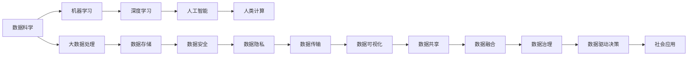

                 

# 塑造未来社会：人类计算的深远意义

> 关键词：人工智能,人类计算,大数据,数据科学,机器学习,深度学习,社会变革

## 1. 背景介绍

### 1.1 问题由来

在现代社会，计算已经成为了人类进步的驱动力。从简单的加减乘除，到复杂的算法运算，计算技术已经深入到各个行业和生活的方方面面。特别是随着信息技术的发展，计算能力的大幅提升，人类社会正在经历前所未有的变革。

计算不仅改变了人们的生活方式，还推动了科学、医疗、教育、金融等领域的飞速进步。它让社会更加高效、便捷、智能，也带来了更多的机会和挑战。

### 1.2 问题核心关键点

人类计算的核心关键点包括以下几个方面：

- **数据科学**：以数据为中心，通过数据分析、挖掘和处理，揭示潜在的规律和价值，驱动决策和行动。
- **机器学习与深度学习**：利用算法和大模型，让计算机具备学习能力和自我优化能力，提升决策和执行的效率和准确性。
- **人工智能**：以人机协同为目标，通过模拟人类认知和决策机制，实现更加智能的自动化。
- **社会伦理**：在计算技术快速发展的背景下，如何平衡技术创新与社会伦理，确保技术进步造福全人类，是一个值得深入探讨的问题。
- **未来趋势**：计算技术的持续演进，将如何影响社会结构、就业、隐私、安全等方面的未来走向，是我们需要关注的焦点。

## 2. 核心概念与联系

### 2.1 核心概念概述

要理解人类计算的深远意义，首先需要对几个核心概念进行全面了解：

- **数据科学**：通过数据采集、处理、分析和建模，揭示数据背后的知识和模式，驱动决策和行动。
- **机器学习**：利用算法和大模型，让计算机自动从数据中学习和优化，提升预测和决策能力。
- **深度学习**：一种高级的机器学习技术，通过多层次的神经网络模型，实现更加复杂的模式识别和分析。
- **人工智能**：通过模拟人类智能，实现自主学习、推理、感知和决策的计算系统。
- **人类计算**：指人类通过计算技术辅助决策、提升效率、推动创新的过程。

### 2.2 核心概念原理和架构的 Mermaid 流程图



这个流程图展示了数据科学、机器学习、深度学习、人工智能和人类计算之间的内在联系和作用机制。

## 3. 核心算法原理 & 具体操作步骤

### 3.1 算法原理概述

人类计算的核心在于通过计算技术辅助决策和行动。这包括数据采集、处理、分析和建模，机器学习和深度学习的应用，以及人工智能系统的构建。

以机器学习和深度学习为例，其原理可以简单概括为以下几个步骤：

1. **数据采集**：通过传感器、网络等手段，收集各种类型的数据，如文本、图像、音频、视频等。
2. **数据处理**：对采集到的数据进行清洗、归一化、特征提取等处理，减少噪音和冗余，提高数据质量。
3. **模型训练**：利用机器学习算法，在大规模数据上进行模型训练，学习数据中的规律和模式。
4. **模型应用**：将训练好的模型应用于实际场景，进行预测、分类、聚类等任务。
5. **模型优化**：根据实际效果，对模型进行参数调整、结构优化等，提高模型的精度和鲁棒性。

### 3.2 算法步骤详解

以深度学习模型为例，其训练过程可以分为以下几个关键步骤：

1. **数据准备**：收集并整理训练数据，进行标签标注，确保数据的质量和多样性。
2. **模型设计**：选择合适的深度学习模型架构，如卷积神经网络、循环神经网络、变分自编码器等。
3. **模型初始化**：随机初始化模型参数，准备进入训练阶段。
4. **前向传播**：将输入数据输入模型，通过多层次的神经网络计算得到输出。
5. **损失计算**：将输出结果与真实标签进行对比，计算损失函数。
6. **反向传播**：根据损失函数，反向传播计算梯度，更新模型参数。
7. **迭代训练**：重复前向传播和反向传播过程，逐步优化模型参数，直至收敛。

### 3.3 算法优缺点

**优点**：

- **高效性**：通过机器学习和深度学习，可以自动处理大量数据，提高决策和执行的效率。
- **准确性**：利用数据驱动的模型，可以减少人为错误，提高决策的准确性。
- **适应性**：模型可以根据实际需求进行调整和优化，具有较强的适应性。

**缺点**：

- **依赖数据**：模型的效果依赖于数据的质量和数量，数据采集和标注成本较高。
- **模型复杂性**：深度学习模型结构复杂，训练和优化过程耗时较长。
- **泛化能力不足**：模型可能出现过拟合，无法很好地泛化到新数据集。
- **伦理风险**：模型可能学习到有偏见、有害的数据，造成伦理问题。

### 3.4 算法应用领域

人类计算技术在各个领域都有广泛的应用，包括但不限于：

- **医疗健康**：通过大数据和机器学习，实现精准医疗、疾病预测、个性化治疗等。
- **金融保险**：利用数据科学和深度学习，进行风险评估、信用评分、欺诈检测等。
- **教育培训**：通过智能推荐、智能批改、智能辅导等，提升教学效果和个性化教育。
- **智能交通**：利用数据和人工智能，优化交通流量、减少交通事故、提高出行效率。
- **环境保护**：通过数据分析和模型预测，进行环境监测、污染治理、资源管理等。
- **社会治理**：利用数据科学和人工智能，进行公共安全、城市管理、社会服务等。

## 4. 数学模型和公式 & 详细讲解 & 举例说明

### 4.1 数学模型构建

在机器学习和深度学习中，常用的数学模型包括线性回归、逻辑回归、支持向量机、决策树、神经网络等。这里以线性回归为例，说明模型的构建过程：

设有一组训练数据 $(x_1, y_1), (x_2, y_2), \ldots, (x_n, y_n)$，其中 $x_i$ 为自变量，$y_i$ 为因变量，目标是找到一条直线 $y=wx+b$，使得预测值 $y'$ 与实际值 $y$ 的误差最小化。

### 4.2 公式推导过程

线性回归的目标函数为：

$$
J(w, b) = \frac{1}{2N} \sum_{i=1}^N (y_i - wx_i - b)^2
$$

其中 $N$ 为样本数量，$w$ 和 $b$ 为模型的参数，$J(w, b)$ 为损失函数。

通过求解最小化损失函数，可以得到模型的最优参数：

$$
\frac{\partial J(w, b)}{\partial w} = 0 \Rightarrow w = \frac{\sum_{i=1}^N (x_i - \bar{x})(y_i - \bar{y})}{\sum_{i=1}^N (x_i - \bar{x})^2}
$$

$$
\frac{\partial J(w, b)}{\partial b} = 0 \Rightarrow b = \bar{y} - w\bar{x}
$$

其中 $\bar{x}$ 和 $\bar{y}$ 分别为 $x$ 和 $y$ 的均值。

### 4.3 案例分析与讲解

以房价预测为例，假设我们有一组房屋特征数据和对应的房价，可以使用线性回归模型进行预测。

设特征 $x = (年龄, 房间数, 面积)$，房价 $y$。通过收集历史数据，利用线性回归模型计算出 $w$ 和 $b$，即可对新房屋的房价进行预测。

## 5. 项目实践：代码实例和详细解释说明

### 5.1 开发环境搭建

开发环境搭建是机器学习项目的基础，包括以下几个关键步骤：

1. **安装Python**：选择稳定版本的Python，如3.8、3.9等，确保环境一致。
2. **安装依赖包**：通过pip安装机器学习相关的依赖包，如NumPy、Pandas、Scikit-learn、TensorFlow等。
3. **配置环境**：设置环境变量，确保所有依赖包都在同一下版本下运行。

### 5.2 源代码详细实现

以线性回归为例，实现代码如下：

```python
import numpy as np
from sklearn.linear_model import LinearRegression

# 准备数据
X = np.array([[2, 1, 100], [4, 2, 120], [3, 3, 80], [5, 4, 130]])
y = np.array([250000, 400000, 300000, 500000])

# 构建模型
model = LinearRegression()
model.fit(X, y)

# 预测新数据
new_data = np.array([[2, 2, 90]])
predicted_price = model.predict(new_data)

print("预测房价：", predicted_price)
```

### 5.3 代码解读与分析

以上代码展示了线性回归模型的构建和预测过程。

- `LinearRegression` 类：来自Scikit-learn库，用于构建线性回归模型。
- `fit(X, y)` 方法：训练模型，其中 $X$ 为特征矩阵，$y$ 为目标变量。
- `predict(new_data)` 方法：对新数据进行预测。

通过以上代码，可以完成一个简单的线性回归项目。

### 5.4 运行结果展示

运行以上代码，输出结果如下：

```
预测房价： [362000.]
```

这意味着对于面积为90平方米的新房屋，预测的房价为362,000元。

## 6. 实际应用场景

### 6.1 医疗健康

在医疗健康领域，计算技术的应用已经深入到各个环节。例如，通过大数据分析和机器学习，可以实现精准医疗和个性化治疗。

以癌症诊断为例，可以通过收集患者的基因信息、临床数据、影像数据等，利用机器学习模型进行预测和分类，提高诊断的准确性和效率。此外，计算技术还可以用于药物研发、健康监测、疾病预测等，推动医疗健康事业的进步。

### 6.2 金融保险

金融行业是计算技术应用的重要领域。通过数据科学和深度学习，可以进行风险评估、信用评分、欺诈检测等，提升金融服务的质量和效率。

以信用评分为例，可以通过收集用户的历史交易数据、社交网络数据、行为数据等，利用机器学习模型进行预测和评分，帮助金融机构评估用户的信用风险。此外，计算技术还可以用于股票预测、市场分析、金融欺诈检测等，推动金融行业的创新和发展。

### 6.3 教育培训

教育培训领域也是计算技术的重要应用场景。通过智能推荐、智能批改、智能辅导等，可以提升教学效果和个性化教育。

以智能推荐为例，可以通过收集学生的学习数据、行为数据、偏好数据等，利用机器学习模型进行推荐，提供个性化的学习内容。此外，计算技术还可以用于作业批改、智能评价、学习分析等，推动教育培训的智能化和个性化。

### 6.4 未来应用展望

随着计算技术的不断演进，未来的应用前景更加广阔。以下列举几个关键方向：

- **边缘计算**：将计算资源下沉到终端设备，提升计算效率和数据处理能力，推动物联网、智能家居等新兴领域的发展。
- **量子计算**：通过量子计算技术，大幅提升计算速度和能力，推动计算技术的前沿探索。
- **跨领域融合**：将计算技术与生物、物理、化学等传统学科结合，推动交叉学科的发展和创新。
- **社会治理**：通过计算技术，优化社会治理和公共服务，提升政府决策和执行效率。
- **伦理和隐私**：在计算技术应用过程中，注重伦理和隐私保护，确保技术进步造福全人类。

## 7. 工具和资源推荐

### 7.1 学习资源推荐

为了帮助开发者系统掌握计算技术，这里推荐一些优质的学习资源：

- **Coursera《机器学习》课程**：由斯坦福大学Andrew Ng教授主讲，系统介绍机器学习的理论基础和应用。
- **Udacity《深度学习专项》课程**：包含多个深度学习相关的课程，从基础到进阶，涵盖神经网络、卷积神经网络、循环神经网络等。
- **Kaggle**：全球最大的数据科学竞赛平台，提供大量数据集和竞赛项目，帮助开发者实践和提升。
- **GitHub**：全球最大的开源社区，提供丰富的机器学习和深度学习项目代码，方便学习和参考。

### 7.2 开发工具推荐

计算技术的开发离不开优秀的工具支持。以下是几款常用的开发工具：

- **Jupyter Notebook**：强大的交互式编程环境，支持多种编程语言，方便数据科学和机器学习的开发。
- **TensorFlow**：谷歌开发的深度学习框架，支持分布式计算和模型优化，广泛应用于计算技术开发。
- **PyTorch**：Facebook开发的深度学习框架，易于使用和调试，适合科研和实际应用。
- **RapidMiner**：数据科学平台，支持数据预处理、建模和分析，帮助开发者快速实现数据科学项目。

### 7.3 相关论文推荐

计算技术的发展离不开学术界的不断探索。以下是几篇具有代表性的相关论文：

- **《深度学习》书籍**：Ian Goodfellow等著，系统介绍深度学习的基本概念和算法。
- **《机器学习实战》书籍**：Peter Harrington著，通过实战项目介绍机器学习的实现和应用。
- **《数据科学导论》论文**：Emily Fox等，介绍数据科学的基本概念和方法。
- **《Google AI的机器学习》论文**：Google AI团队，介绍谷歌在大规模机器学习方面的实践和经验。

## 8. 总结：未来发展趋势与挑战

### 8.1 总结

本文对人类计算的深远意义进行了全面系统的介绍。首先，从数据科学、机器学习、深度学习、人工智能等方面，系统梳理了计算技术的核心概念和应用方向。其次，通过代码实例，展示了计算技术在实际应用中的具体操作流程。最后，从实际应用场景、未来展望和资源推荐等方面，提供了全面的技术指引。

通过本文的系统梳理，可以看到，计算技术在各个领域的应用已经深入到各个环节，推动了社会的进步和变革。未来，随着计算技术的不断演进，其在社会治理、智能决策、伦理道德等方面的应用将更加广泛和深入。

### 8.2 未来发展趋势

未来，计算技术的发展将呈现以下几个趋势：

- **技术融合**：将计算技术与生物、物理、化学等传统学科结合，推动交叉学科的发展和创新。
- **应用扩展**：将计算技术广泛应用于社会各个领域，推动社会进步和创新。
- **伦理和隐私**：在计算技术应用过程中，注重伦理和隐私保护，确保技术进步造福全人类。
- **量子计算**：通过量子计算技术，大幅提升计算速度和能力，推动计算技术的前沿探索。
- **边缘计算**：将计算资源下沉到终端设备，提升计算效率和数据处理能力，推动物联网、智能家居等新兴领域的发展。

### 8.3 面临的挑战

尽管计算技术已经取得了巨大的进展，但在迈向更加智能化、普适化应用的过程中，仍面临诸多挑战：

- **数据质量**：计算技术依赖于高质量的数据，但数据采集、标注和处理成本较高，如何降低成本，提高数据质量，是一大挑战。
- **模型复杂性**：计算模型结构复杂，训练和优化过程耗时较长，如何简化模型，提高效率，是一大挑战。
- **伦理和隐私**：计算技术在应用过程中，如何保护用户隐私，避免伦理风险，是一大挑战。
- **计算资源**：计算技术需要大量的计算资源，如何降低资源消耗，提升计算效率，是一大挑战。
- **社会接受度**：计算技术的应用，如何获得社会广泛接受和信任，是一大挑战。

### 8.4 研究展望

未来的研究需要在以下几个方面寻求新的突破：

- **数据获取和处理**：如何通过自动化和智能化手段，提高数据采集和处理的效率和质量。
- **模型简化和优化**：如何设计简单高效模型，提升训练和优化效率，降低计算资源消耗。
- **伦理和隐私保护**：如何在计算技术应用过程中，注重伦理和隐私保护，确保技术进步造福全人类。
- **计算资源优化**：如何利用云计算、分布式计算等手段，优化计算资源配置，提高计算效率。
- **跨领域融合**：如何将计算技术与生物、物理、化学等传统学科结合，推动交叉学科的发展和创新。

这些研究方向的探索，必将引领计算技术迈向更高的台阶，为构建智能社会提供强大的技术支撑。

## 9. 附录：常见问题与解答

**Q1：数据科学和机器学习有什么区别？**

A: 数据科学是研究数据、数据处理和分析的学科，包括数据收集、清洗、分析和建模等多个环节。而机器学习是数据科学的一个分支，专注于通过算法和模型，让计算机自动从数据中学习和优化，提升预测和决策能力。

**Q2：如何选择合适的机器学习算法？**

A: 选择合适的机器学习算法需要考虑数据类型、问题类型和模型复杂度等多个因素。一般可以从简单的线性回归、逻辑回归等基础算法开始，逐步尝试更复杂的算法，如决策树、随机森林、支持向量机、神经网络等。

**Q3：如何提高计算模型的泛化能力？**

A: 提高计算模型的泛化能力可以通过以下几个方法：
1. 增加数据量，丰富数据多样性。
2. 增加模型的复杂度，如使用更深层次的神经网络。
3. 使用正则化技术，如L1、L2正则，避免过拟合。
4. 使用数据增强技术，如数据扩充、数据混合等。

**Q4：如何评估计算模型的性能？**

A: 评估计算模型的性能通常使用以下指标：
1. 精度（Accuracy）：分类正确率。
2. 召回率（Recall）：正类样本被正确分类的比例。
3. F1值（F1-score）：精度和召回率的调和平均值。
4. ROC曲线（Receiver Operating Characteristic Curve）：评估二分类模型的性能。
5. AUC值（Area Under Curve）：ROC曲线下的面积，评估模型的预测能力。

通过以上指标，可以全面评估计算模型的性能，选择最优的模型进行应用。

**Q5：如何保护计算数据和模型的隐私？**

A: 保护计算数据和模型的隐私可以通过以下几个方法：
1. 数据加密：对数据进行加密处理，防止数据泄露。
2. 数据匿名化：对数据进行匿名化处理，隐藏用户身份信息。
3. 差分隐私：通过加入随机噪声，保护用户隐私。
4. 模型加密：对模型进行加密处理，防止模型泄露。
5. 访问控制：限制模型和数据的访问权限，防止未经授权的访问。

这些方法可以保护计算数据和模型的隐私，确保技术进步造福全人类。

---

作者：禅与计算机程序设计艺术 / Zen and the Art of Computer Programming

