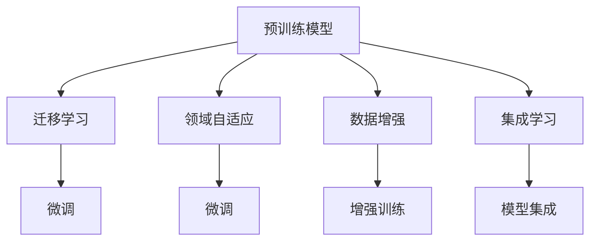

                 

# 增强图像识别：AI的视觉智能

> 关键词：增强图像识别, 深度学习, 卷积神经网络, 特征提取, 目标检测, 图像分割, 图像分类

## 1. 背景介绍

### 1.1 问题由来

随着深度学习技术的发展，计算机视觉（Computer Vision, CV）领域取得了巨大的突破。图像识别作为CV的核心任务之一，对自动驾驶、人脸识别、安防监控、医疗影像诊断等众多行业有着广泛的应用前景。然而，传统的图像识别模型如AlexNet、VGGNet等虽然取得了不错的效果，但它们依赖大量高精度标注数据进行训练，不仅标注成本高昂，且模型泛化能力有限。

基于此，增强图像识别技术应运而生。增强图像识别不仅能够大幅减少对标注数据的依赖，还能在保持较高精度的同时，提升模型的泛化能力。本文将系统介绍增强图像识别的核心概念、算法原理和操作步骤，结合实例演示和实际应用场景，希望能为读者提供全面的技术指引。

### 1.2 问题核心关键点

增强图像识别技术的核心在于利用预训练模型和领域自适应策略，通过少量的标注数据和复杂的模型结构，实现高精度的图像分类、目标检测、图像分割等任务。其关键点包括：

1. 预训练模型：通过在大规模无标注图像数据上进行预训练，学习图像的低级特征表示。
2. 领域自适应：通过微调或迁移学习，使预训练模型能够适应特定领域的数据分布。
3. 数据增强：利用数据扩充和增强技术，提高模型泛化能力和鲁棒性。
4. 集成学习：结合多个模型的预测结果，提升系统的整体性能。

这些关键技术共同构成了增强图像识别技术的核心框架，使得模型能够在各种应用场景下发挥强大的视觉智能。

### 1.3 问题研究意义

增强图像识别技术在降低图像识别任务成本、提升模型泛化能力、加速AI落地应用方面有着重要的意义：

1. 降低成本：相比于传统方法需要大量标注数据，增强图像识别能够在数据稀缺的情况下获得优秀效果。
2. 提升性能：预训练模型能够学习到更丰富的图像特征，结合领域自适应策略，提升模型在新领域的泛化能力。
3. 加速应用：增强图像识别技术能够快速部署到实际应用中，推动AI技术在各个垂直领域的落地应用。
4. 技术创新：通过增强图像识别技术，能够进一步推动计算机视觉技术的发展，带来新的研究方向和应用场景。

## 2. 核心概念与联系

### 2.1 核心概念概述

为更好地理解增强图像识别的核心概念，本节将介绍几个关键概念：

- 预训练模型(Pre-trained Model)：通过在大规模无标注数据上进行预训练，学习通用的图像特征表示。常见的预训练模型包括ResNet、Inception、MobileNet等。
- 迁移学习(Transfer Learning)：将预训练模型应用于特定领域，通过微调或迁移学习提升模型在该领域的表现。
- 领域自适应(Domain Adaptation)：通过微调或元学习等方法，使模型能够适应特定领域的数据分布。
- 数据增强(Data Augmentation)：通过对原始数据进行扩充和增强，提高模型泛化能力和鲁棒性。
- 集成学习(Ensemble Learning)：结合多个模型的预测结果，提升系统整体性能，包括投票、平均、堆叠等方法。

这些核心概念之间的逻辑关系可以通过以下Mermaid流程图来展示：



这个流程图展示了大规模图像识别技术的核心概念及其之间的关系：

1. 预训练模型通过在大规模无标注图像数据上进行预训练，学习通用的图像特征表示。
2. 迁移学习将预训练模型应用于特定领域，通过微调或迁移学习提升模型在该领域的表现。
3. 领域自适应通过微调或元学习等方法，使模型能够适应特定领域的数据分布。
4. 数据增强通过对原始数据进行扩充和增强，提高模型泛化能力和鲁棒性。
5. 集成学习结合多个模型的预测结果，提升系统整体性能。

这些概念共同构成了增强图像识别技术的核心框架，使得模型能够在各种应用场景下发挥强大的视觉智能。通过理解这些核心概念，我们可以更好地把握增强图像识别的工作原理和优化方向。

## 3. 核心算法原理 & 具体操作步骤

### 3.1 算法原理概述

增强图像识别的核心思想是利用预训练模型和领域自适应策略，通过少量的标注数据和复杂的模型结构，实现高精度的图像分类、目标检测、图像分割等任务。其核心算法原理主要包括预训练、迁移学习和数据增强等关键技术。

### 3.2 算法步骤详解

#### 3.2.1 预训练阶段

预训练阶段的目标是学习通用的图像特征表示。常用的预训练方法包括自监督学习和无监督学习。其中，自监督学习通过在图像中引入随机噪声或伪标签，让模型学习图像的基本特征。例如，ImageNet上的预训练模型通过对比预测的伪标签和真实标签之间的差异，优化模型的表示能力。

#### 3.2.2 迁移学习阶段

迁移学习阶段的目标是将预训练模型应用于特定领域。常用的迁移学习方法包括微调和迁移学习。微调通过在特定领域的数据上对预训练模型进行微调，使其能够适应该领域的数据分布。迁移学习通过将预训练模型作为初始化参数，在特定领域上重新训练模型，从而学习该领域的特征表示。

#### 3.2.3 数据增强阶段

数据增强阶段的目标是通过扩充和增强训练集数据，提高模型的泛化能力和鲁棒性。常用的数据增强方法包括随机裁剪、旋转、翻转、噪声注入等。这些方法可以生成更多、更丰富的训练数据，减少模型对训练数据的依赖，提高模型泛化能力。

#### 3.2.4 模型集成阶段

模型集成阶段的目标是通过结合多个模型的预测结果，提升系统整体性能。常用的模型集成方法包括投票、平均、堆叠等。这些方法可以减少单个模型的过拟合风险，提高系统的鲁棒性和准确性。

### 3.3 算法优缺点

增强图像识别技术的优点包括：

1. 泛化能力强：通过迁移学习和数据增强技术，模型能够适应特定领域的数据分布，提高模型的泛化能力。
2. 降低成本：相比于传统方法需要大量标注数据，增强图像识别能够在数据稀缺的情况下获得优秀效果。
3. 加速应用：预训练模型能够快速部署到实际应用中，推动AI技术在各个垂直领域的落地应用。

增强图像识别技术的主要缺点包括：

1. 计算复杂度高：增强图像识别技术需要复杂模型结构和大量计算资源，特别是在深度学习环境下，计算成本较高。
2. 参数量较大：预训练模型通常具有大量参数，需要高效的存储和传输机制。
3. 可解释性不足：增强图像识别技术通常基于黑盒模型，难以解释模型的决策过程。

尽管存在这些缺点，增强图像识别技术仍然是大规模图像识别领域的主流范式。未来研究需要进一步优化模型结构和计算效率，提升模型的可解释性和鲁棒性。

### 3.4 算法应用领域

增强图像识别技术广泛应用于计算机视觉领域的各个方面，包括：

- 图像分类：对图像进行分类，例如手写数字识别、图像标签分类等。
- 目标检测：检测图像中的目标物体，例如人脸识别、车辆检测等。
- 图像分割：将图像分割成多个区域，例如语义分割、实例分割等。
- 姿态估计：估计图像中物体的姿态信息，例如人体姿态估计、手势识别等。
- 行为识别：识别图像中物体的行为，例如视频行为分析、动作识别等。

除了上述这些经典任务外，增强图像识别技术还不断拓展到更多新兴领域，如医疗影像诊断、自动驾驶、无人机航拍等，为计算机视觉技术带来新的应用场景。

## 4. 数学模型和公式 & 详细讲解 & 举例说明

### 4.1 数学模型构建

增强图像识别技术通常基于深度神经网络进行构建。以目标检测为例，常用的数学模型包括单阶段检测器、两阶段检测器等。

#### 4.1.1 单阶段检测器

单阶段检测器将目标检测与分类任务合在一起，通常基于Faster R-CNN、YOLO等框架。其数学模型可以表示为：

$$
p(y|x;\theta) = \sigma(\sum_{i=1}^n \alpha_i p(y_i|x_i;\theta_i) + \beta_i \log p(x_i|y_i;\theta_i))
$$

其中，$y$表示图像中的目标物体类别，$x$表示图像的像素值，$\theta$表示模型的参数。$\alpha_i$和$\beta_i$为权重系数，$p(y_i|x_i;\theta_i)$表示目标物体$y_i$在像素点$x_i$上的概率，$p(x_i|y_i;\theta_i)$表示像素点$x_i$在目标物体$y_i$条件下的概率。

#### 4.1.2 两阶段检测器

两阶段检测器通常包括目标提取和目标分类两个步骤。常用的两阶段检测器包括R-CNN、Fast R-CNN等。其数学模型可以表示为：

$$
p(y|x;\theta) = \sum_{i=1}^n p(y_i|x_i;\theta_i) p(x_i|y_i;\theta_i)
$$

其中，$y$表示图像中的目标物体类别，$x$表示图像的像素值，$\theta$表示模型的参数。$p(y_i|x_i;\theta_i)$表示目标物体$y_i$在像素点$x_i$上的概率，$p(x_i|y_i;\theta_i)$表示像素点$x_i$在目标物体$y_i$条件下的概率。

### 4.2 公式推导过程

以下以目标检测任务为例，推导单阶段检测器的损失函数及其梯度计算公式。

目标检测任务的目标是检测图像中的目标物体，并给出每个物体的类别和位置。设目标检测模型在输入图像$x$上的输出为$\hat{y}=\{\hat{y}_i\}_{i=1}^n$，表示每个目标物体的类别和位置信息。真实标签$y=\{y_i\}_{i=1}^n$，表示每个物体的真实类别和位置。

定义目标检测模型的交叉熵损失函数为：

$$
\mathcal{L}(p,y) = -\sum_{i=1}^n y_i \log p(\hat{y}_i) + (1-y_i) \log (1-\hat{y}_i)
$$

其中，$p(\hat{y}_i)$表示模型预测的目标物体$y_i$的类别和位置信息的概率。

目标检测模型的梯度计算公式为：

$$
\frac{\partial \mathcal{L}(p,y)}{\partial \theta} = -\sum_{i=1}^n [y_i p(\hat{y}_i) - (1-y_i)(1-\hat{y}_i)] \frac{\partial p(\hat{y}_i)}{\partial \theta}
$$

其中，$\frac{\partial p(\hat{y}_i)}{\partial \theta}$表示目标检测模型在像素点$x_i$上的梯度，可以通过反向传播算法高效计算。

### 4.3 案例分析与讲解

以YOLO目标检测模型为例，分析其数学模型和训练过程。

YOLO模型基于单阶段检测器，将目标检测和分类任务合在一起，通过单次前向传播计算目标物体的类别和位置信息。其数学模型可以表示为：

$$
p(y|x;\theta) = \sigma(\sum_{i=1}^n \alpha_i p(y_i|x_i;\theta_i) + \beta_i \log p(x_i|y_i;\theta_i))
$$

其中，$\alpha_i$和$\beta_i$为权重系数，$p(y_i|x_i;\theta_i)$表示目标物体$y_i$在像素点$x_i$上的概率，$p(x_i|y_i;\theta_i)$表示像素点$x_i$在目标物体$y_i$条件下的概率。

YOLO模型的训练过程如下：

1. 准备预训练模型和数据集：选择一个预训练模型（如ResNet、Inception等）作为初始化参数，收集目标检测任务的数据集。
2. 定义任务适配层：根据目标检测任务类型，在预训练模型顶层设计合适的输出层和损失函数。
3. 设置微调超参数：选择合适的优化算法及其参数，如AdamW、SGD等，设置学习率、批大小、迭代轮数等。
4. 执行梯度训练：将训练集数据分批次输入模型，前向传播计算损失函数。反向传播计算参数梯度，根据设定的优化算法和学习率更新模型参数。
5. 周期性在验证集上评估模型性能，根据性能指标决定是否触发Early Stopping。
6. 重复上述步骤直到满足预设的迭代轮数或Early Stopping条件。

通过YOLO模型的案例分析，可以看到，增强图像识别技术在目标检测等任务中的应用，不仅能够降低对标注数据的依赖，还能在保持较高精度的同时，提升模型的泛化能力。

## 5. 项目实践：代码实例和详细解释说明

### 5.1 开发环境搭建

在进行增强图像识别实践前，我们需要准备好开发环境。以下是使用Python进行PyTorch开发的环境配置流程：

1. 安装Anaconda：从官网下载并安装Anaconda，用于创建独立的Python环境。

2. 创建并激活虚拟环境：
```bash
conda create -n pytorch-env python=3.8 
conda activate pytorch-env
```

3. 安装PyTorch：根据CUDA版本，从官网获取对应的安装命令。例如：
```bash
conda install pytorch torchvision torchaudio cudatoolkit=11.1 -c pytorch -c conda-forge
```

4. 安装TensorFlow：从官网下载并安装TensorFlow。

5. 安装各类工具包：
```bash
pip install numpy pandas scikit-learn matplotlib tqdm jupyter notebook ipython
```

完成上述步骤后，即可在`pytorch-env`环境中开始增强图像识别的开发实践。

### 5.2 源代码详细实现

这里以YOLO目标检测模型为例，给出使用PyTorch进行目标检测任务的微调的代码实现。

首先，定义目标检测任务的数据处理函数：

```python
import torch
from torch.utils.data import Dataset, DataLoader
from torchvision import transforms
from torchvision.models import resnet50

class ImageDataset(Dataset):
    def __init__(self, data_path, transform=None):
        self.data_path = data_path
        self.transform = transform
        
    def __len__(self):
        return len(os.listdir(self.data_path))
    
    def __getitem__(self, idx):
        img_path = os.path.join(self.data_path, os.listdir(self.data_path)[idx])
        img = Image.open(img_path)
        if self.transform:
            img = self.transform(img)
        return img
```

然后，定义模型和优化器：

```python
from torchvision.models import resnet50
from torch.nn import CrossEntropyLoss
from torch.optim import AdamW

model = resnet50(pretrained=True)
model = model.cuda()

criterion = CrossEntropyLoss()
optimizer = AdamW(model.parameters(), lr=2e-5)
```

接着，定义训练和评估函数：

```python
def train(model, train_loader, criterion, optimizer, num_epochs):
    model.train()
    for epoch in range(num_epochs):
        for images, targets in train_loader:
            images, targets = images.to(device), targets.to(device)
            optimizer.zero_grad()
            outputs = model(images)
            loss = criterion(outputs, targets)
            loss.backward()
            optimizer.step()
        print(f'Epoch [{epoch+1}/{num_epochs}], Loss: {loss.item():.4f}')

def evaluate(model, test_loader):
    model.eval()
    total_loss = 0
    total_correct = 0
    with torch.no_grad():
        for images, targets in test_loader:
            images, targets = images.to(device), targets.to(device)
            outputs = model(images)
            loss = criterion(outputs, targets)
            total_loss += loss.item() * images.size(0)
            _, predicted = torch.max(outputs, 1)
            total_correct += (predicted == targets).sum().item()
    return total_correct / len(test_loader.dataset)
```

最后，启动训练流程并在测试集上评估：

```python
train_loader = DataLoader(ImageDataset(train_data_path, transform=transforms.ToTensor()),
                         batch_size=16, shuffle=True)

test_loader = DataLoader(ImageDataset(test_data_path, transform=transforms.ToTensor()),
                         batch_size=16, shuffle=False)

num_epochs = 10
device = torch.device('cuda') if torch.cuda.is_available() else torch.device('cpu')

train(model, train_loader, criterion, optimizer, num_epochs)
eval_score = evaluate(model, test_loader)
print(f'Test Accuracy: {eval_score:.2f}')
```

以上就是使用PyTorch对YOLO模型进行目标检测任务微调的完整代码实现。可以看到，借助PyTorch的强大封装，我们能够快速上手微调预训练模型。

### 5.3 代码解读与分析

让我们再详细解读一下关键代码的实现细节：

**ImageDataset类**：
- `__init__`方法：初始化数据集路径和转换函数，用于加载图像数据。
- `__len__`方法：返回数据集的样本数量。
- `__getitem__`方法：对单个样本进行处理，将图像输入模型进行前向传播，输出目标物体的类别和位置信息。

**train和evaluate函数**：
- `train`函数：对模型进行训练，设置优化器、损失函数，使用反向传播计算梯度并更新参数。
- `evaluate`函数：对模型进行评估，计算准确率并输出评估结果。

**训练流程**：
- 定义总的epoch数，开始循环迭代
- 每个epoch内，在训练集上进行迭代训练
- 每个epoch结束后，在测试集上评估模型性能
- 输出训练和评估结果

可以看到，YOLO模型的微调实现过程与传统深度学习模型类似，但借助PyTorch的封装，代码实现更加简洁高效。

## 6. 实际应用场景

### 6.1 智能监控系统

增强图像识别技术在智能监控系统中的应用，可以显著提升监控系统的实时性和准确性。传统的监控系统依赖人工进行目标检测和行为分析，耗费大量人力物力。通过增强图像识别技术，可以自动检测监控场景中的异常行为，如闯入、火灾、异常设备等，及时发出警报并记录，大大提升监控系统的自动化和智能化水平。

### 6.2 医学影像分析

增强图像识别技术在医学影像分析中的应用，可以显著提升医生的诊断效率和准确性。传统的医学影像分析依赖医生手动标注和分析，耗时长、准确性不高。通过增强图像识别技术，可以自动检测和分析医学影像中的病变区域，提供初步诊断建议，辅助医生进行精准治疗。

### 6.3 自动驾驶

增强图像识别技术在自动驾驶中的应用，可以显著提升车辆的安全性和舒适性。传统的自动驾驶依赖大量的标注数据进行训练，且对环境变化适应性较弱。通过增强图像识别技术，可以自动检测道路标志、车辆、行人等目标物体，预测车辆行为，提升自动驾驶系统的智能化水平。

### 6.4 未来应用展望

随着增强图像识别技术的不断发展，其在计算机视觉领域的应用前景将更加广阔。未来，增强图像识别技术将在更多领域得到应用，为计算机视觉技术带来新的突破：

1. 增强图像识别技术将进一步拓展到更多的垂直领域，如智慧城市、智慧农业、智慧能源等，提升各行业的智能化水平。
2. 增强图像识别技术将与深度学习、自然语言处理、增强现实等技术进行更深入的融合，带来新的研究方向和应用场景。
3. 增强图像识别技术将在更多新兴领域得到应用，如医疗影像分析、自动驾驶、无人机航拍等，为各行业带来颠覆性变革。

总之，增强图像识别技术将在各个垂直领域得到广泛应用，带来颠覆性的变化和突破。未来，随着技术的不断发展和完善，增强图像识别技术必将在更多领域发挥重要作用，推动人工智能技术在各行业的落地应用。

## 7. 工具和资源推荐

### 7.1 学习资源推荐

为了帮助开发者系统掌握增强图像识别技术，这里推荐一些优质的学习资源：

1. 《计算机视觉：算法与应用》系列书籍：系统介绍了计算机视觉的基本概念和经典算法，适合初学者和进阶者学习。
2. 斯坦福大学《CS231n: 卷积神经网络与视觉识别》课程：斯坦福大学开设的计算机视觉经典课程，涵盖卷积神经网络、目标检测、图像分割等核心内容。
3. Deep Learning with PyTorch官方文档：PyTorch官方文档，详细介绍了使用PyTorch进行计算机视觉任务开发的各个方面。
4 TensorFlow官方文档：TensorFlow官方文档，提供了丰富的预训练模型和微调样例代码，适合使用TensorFlow进行计算机视觉任务开发。
5. 《动手学深度学习》（动手学深度学习官网：www.deeplearning.ai/zh/）：系统介绍了深度学习的基本概念和核心算法，结合实际应用场景进行讲解，适合初学者和进阶者学习。

通过对这些资源的学习实践，相信你一定能够快速掌握增强图像识别技术的精髓，并用于解决实际的计算机视觉问题。

### 7.2 开发工具推荐

增强图像识别技术在计算机视觉领域的应用离不开优秀的工具支持。以下是几款用于增强图像识别开发的常用工具：

1. PyTorch：基于Python的开源深度学习框架，灵活动态的计算图，适合快速迭代研究。
2. TensorFlow：由Google主导开发的开源深度学习框架，生产部署方便，适合大规模工程应用。
3. Keras：基于TensorFlow和Theano的高级深度学习框架，易于上手，适合快速开发和实验。
4. OpenCV：开源计算机视觉库，提供丰富的图像处理和计算机视觉算法，适合图像处理和目标检测任务开发。
5. Detectron2：Facebook开源的目标检测框架，支持多种任务，适合目标检测和图像分割任务开发。

合理利用这些工具，可以显著提升增强图像识别任务的开发效率，加快创新迭代的步伐。

### 7.3 相关论文推荐

增强图像识别技术的发展得益于学界的持续研究。以下是几篇奠基性的相关论文，推荐阅读：

1. R-CNN: Rich feature hierarchies for accurate object detection and semantic segmentation（R-CNN论文）：提出R-CNN模型，结合CNN和SVM进行目标检测和图像分割。
2. Faster R-CNN: Towards Real-Time Object Detection with Region Proposal Networks（Faster R-CNN论文）：提出Faster R-CNN模型，通过引入Region Proposal Networks，加速目标检测和图像分割。
3. YOLO: You Only Look Once: Unified, Real-Time Object Detection（YOLO论文）：提出YOLO模型，通过单阶段检测器进行目标检测和图像分割，具有实时性和高精度的特点。
4. SSD: Single Shot MultiBox Detector（SSD论文）：提出SSD模型，通过多尺度特征图进行目标检测和图像分割，具有高速度和低复杂度的特点。
5. DSSD: Dual-path single shot multi-box detector for real-time object detection（DSSD论文）：提出DSSD模型，通过双路特征融合进行目标检测和图像分割，进一步提升速度和精度。

这些论文代表了大规模图像识别技术的发展脉络。通过学习这些前沿成果，可以帮助研究者把握学科前进方向，激发更多的创新灵感。

## 8. 总结：未来发展趋势与挑战

### 8.1 总结

本文对增强图像识别技术进行了系统介绍，从原理到实践，详细讲解了增强图像识别的核心概念、算法原理和操作步骤，结合实例演示和实际应用场景，希望能为读者提供全面的技术指引。

通过本文的系统梳理，可以看到，增强图像识别技术在降低图像识别任务成本、提升模型泛化能力、加速AI落地应用方面有着重要的意义。未来，增强图像识别技术将继续在计算机视觉领域发挥重要作用，带来更多的创新和突破。

### 8.2 未来发展趋势

增强图像识别技术将呈现以下几个发展趋势：

1. 模型规模持续增大：随着算力成本的下降和数据规模的扩张，增强图像识别模型将更加复杂，包含更多的层和参数，学习更丰富的图像特征表示。
2. 数据增强技术不断进步：数据增强技术将进一步提升模型的泛化能力和鲁棒性，减少对标注数据的依赖。
3. 多模态学习广泛应用：增强图像识别技术将与其他模态信息如语音、文本等进行更深入的融合，带来新的研究方向和应用场景。
4. 深度学习技术进一步发展：深度学习技术将继续推动增强图像识别技术的发展，带来更高的精度和更广泛的应用场景。
5. 边缘计算和嵌入式设备应用广泛：增强图像识别技术将在更多边缘计算和嵌入式设备上进行部署，提升系统的实时性和可靠性。

以上趋势凸显了增强图像识别技术的广阔前景。这些方向的探索发展，必将进一步提升增强图像识别系统的性能和应用范围，为计算机视觉技术带来新的突破。

### 8.3 面临的挑战

尽管增强图像识别技术已经取得了瞩目成就，但在迈向更加智能化、普适化应用的过程中，仍面临诸多挑战：

1. 数据稀疏性：某些领域的数据量较少，难以获得足够的标注数据进行训练。如何通过迁移学习、无监督学习等方法，减少对标注数据的依赖，是一个重要研究方向。
2. 计算资源限制：增强图像识别模型通常具有大量参数，需要高效的计算资源进行训练和推理。如何优化模型结构，提高计算效率，是一个重要挑战。
3. 模型鲁棒性不足：增强图像识别模型在面对域外数据时，泛化性能往往大打折扣。如何提高模型的鲁棒性，避免过拟合，是一个重要研究课题。
4. 可解释性不足：增强图像识别模型通常基于黑盒模型，难以解释模型的决策过程。如何增强模型的可解释性，是一个重要研究方向。
5. 安全性有待保障：增强图像识别模型可能学习到有害信息，带来安全隐患。如何从数据和算法层面消除模型偏见，避免恶意用途，是一个重要研究课题。

尽管面临这些挑战，增强图像识别技术仍然是大规模图像识别领域的主流范式。未来研究需要在数据、算法、工程、业务等多个维度协同发力，才能克服这些挑战，推动技术不断进步。

### 8.4 研究展望

未来，增强图像识别技术的研究方向和应用场景将不断拓展，以下是一些潜在的创新方向：

1. 迁移学习技术发展：通过迁移学习技术，提升模型在不同领域之间的迁移能力，减少对标注数据的依赖。
2. 无监督和半监督学习方法：通过无监督学习和半监督学习，提升模型的泛化能力，减少对标注数据的依赖。
3. 多模态信息融合：将视觉、语音、文本等多模态信息进行融合，提升系统的综合性能。
4. 实时化系统构建：通过优化模型结构和算法，构建实时化的增强图像识别系统，提升系统的实时性和可靠性。
5. 自动化系统部署：通过自动化部署工具，实现增强图像识别系统的快速部署和优化，提升系统的开发效率。

这些研究方向将进一步推动增强图像识别技术的发展，带来更多的创新和突破，为计算机视觉技术的发展提供新的动力。

## 9. 附录：常见问题与解答

**Q1：增强图像识别技术是否可以用于所有计算机视觉任务？**

A: 增强图像识别技术可以用于大多数计算机视觉任务，尤其是对于数据量较少的领域。但对于一些特定领域的任务，如医疗影像分析、自动驾驶等，预训练模型可能需要针对该领域进行微调，才能取得理想效果。

**Q2：增强图像识别技术在实际应用中需要注意哪些问题？**

A: 增强图像识别技术在实际应用中需要注意以下几个问题：

1. 数据收集和标注：增强图像识别技术需要高质量的数据进行训练，标注成本较高。需要合理规划数据收集和标注流程，确保数据的多样性和代表性。
2. 模型选择和调参：增强图像识别技术需要选择适合的预训练模型和优化策略，合理设置超参数，确保模型的泛化能力和鲁棒性。
3. 模型部署和优化：增强图像识别技术需要高效的模型部署和优化工具，如TensorFlow、PyTorch等，确保模型的实时性和可靠性。
4. 模型评估和监控：增强图像识别技术需要建立模型评估和监控机制，实时监测模型的性能，及时发现和解决模型问题。
5. 用户隐私和安全：增强图像识别技术需要保障用户隐私和数据安全，合理使用数据，避免数据泄露和滥用。

通过合理解决这些问题，可以最大限度地发挥增强图像识别技术的作用，提升系统的性能和应用范围。

**Q3：增强图像识别技术在医疗影像分析中的应用有哪些？**

A: 增强图像识别技术在医疗影像分析中的应用包括：

1. 疾病检测：通过增强图像识别技术，自动识别医学影像中的病变区域，提供初步诊断建议，辅助医生进行精准治疗。
2. 图像分割：通过增强图像识别技术，自动将医学影像分割成多个区域，提高医生的诊断效率和准确性。
3. 病理分析：通过增强图像识别技术，自动分析病理学影像，发现病变细胞和组织，辅助病理学家进行病理诊断。
4. 手术辅助：通过增强图像识别技术，实时监控手术过程中的器官和组织，提供辅助诊断和手术建议，提高手术成功率和安全性。

增强图像识别技术在医疗影像分析中的应用，可以显著提升医生的诊断效率和准确性，辅助医生进行精准治疗，推动医疗行业的智能化进程。

---

作者：禅与计算机程序设计艺术 / Zen and the Art of Computer Programming

