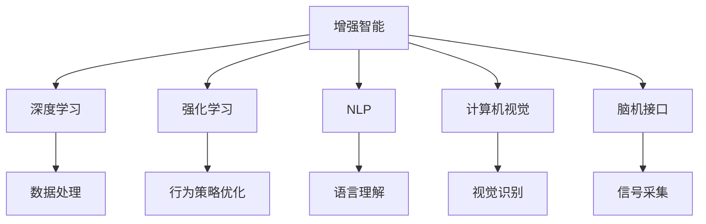

                 

# 增强智能：人机协同，拓展认知边界

> 关键词：增强智能,人机协同,认知边界,深度学习,强化学习,自然语言处理,计算机视觉,脑机接口,未来科技

## 1. 背景介绍

### 1.1 问题由来

在过去几十年间，人工智能(AI)技术得到了快速的发展，尤其是深度学习技术的突破，使得AI在图像识别、语音识别、自然语言处理等领域取得了显著的进展。然而，尽管AI在某些方面已经超越了人类，但在许多复杂的任务中，依然无法达到人类的认知水平。如何实现真正意义上的增强智能，让机器更好地理解人类，成为当下AI研究的一个重要课题。

增强智能是指在保留和增强人类智力的基础上，通过AI技术的辅助，提升人类处理信息的效率和质量。这一理念的提出，旨在解决人类智慧与机器计算能力的互补问题，拓展认知边界，实现人机协同的智能系统。

### 1.2 问题核心关键点

增强智能的核心在于如何实现人机协同，即在确保信息准确性的同时，提升信息处理的效率和能力。主要关键点包括：

1. **融合人类智慧**：通过深度学习、强化学习、自然语言处理等技术，使得机器能够理解和执行复杂的认知任务。
2. **增强计算能力**：利用高性能计算资源，提高AI系统对大规模数据的处理能力。
3. **提升交互体验**：设计友好的人机界面，使人类能够更自然地与AI系统进行交互。
4. **保障信息安全**：保护用户隐私和数据安全，防止信息泄露和滥用。

实现增强智能的目标，需要在这些关键点上下功夫，通过技术创新和工程实践，不断提升AI系统的性能和实用性。

### 1.3 问题研究意义

增强智能的研究具有深远的意义，具体如下：

1. **提升生产效率**：通过AI辅助，能够显著提升制造业、医疗、金融等行业的工作效率，降低人力成本。
2. **改善生活质量**：在教育、交通、娱乐等领域，增强智能可以提供更优质的服务，改善人类生活质量。
3. **拓展认知边界**：增强智能技术的应用，将使人类能够更好地理解和应对复杂的问题，拓展认知边界。
4. **推动科技进步**：增强智能是AI技术的高级应用，其发展将带动更多相关技术的进步，推动科技进步。
5. **促进社会公平**：通过增强智能，可以在资源分配、医疗服务等方面实现更公平、更高效的解决方案。

通过研究和实现增强智能，我们可以实现真正意义上的技术变革，为人类社会的进步提供新的动力。

## 2. 核心概念与联系

### 2.1 核心概念概述

为更好地理解增强智能的理念和实践，本节将介绍几个关键概念：

- **增强智能(Enhanced Intelligence)**：结合人类智慧与AI技术的智能系统，能够处理更复杂、更高级的任务。
- **深度学习(Deep Learning)**：通过多层神经网络，模拟人类大脑的学习机制，实现对数据的高效处理和分析。
- **强化学习(Reinforcement Learning)**：通过试错学习，使得AI系统在复杂环境中不断优化行为策略。
- **自然语言处理(Natural Language Processing, NLP)**：研究如何让计算机理解和处理人类语言的技术。
- **计算机视觉(Computer Vision)**：使计算机能够理解和分析图像、视频等视觉数据的技术。
- **脑机接口(Brain-Computer Interface, BCI)**：通过电生理信号采集和分析，实现人机直接交互的技术。

这些概念相互关联，共同构成了增强智能的技术基础。

### 2.2 核心概念原理和架构的 Mermaid 流程图



此流程图展示了增强智能中的核心概念及其相互关系：

1. **深度学习**：数据处理和模型训练的基础，提供对大规模数据的高效处理能力。
2. **强化学习**：在复杂环境中优化行为策略，实现自主学习和决策。
3. **自然语言处理**：理解人类语言，提供文本信息处理能力。
4. **计算机视觉**：识别和分析图像、视频数据，实现视觉信息的处理。
5. **脑机接口**：实现人机直接交互，提升交互体验。

这些技术相互协作，共同构成了增强智能系统的核心架构。

## 3. 核心算法原理 & 具体操作步骤

### 3.1 算法原理概述

增强智能的核心算法原理主要包括以下几个方面：

1. **深度学习**：利用多层神经网络，对大规模数据进行特征提取和模式识别，提高信息的处理能力。
2. **强化学习**：通过试错学习，优化AI系统在复杂环境中的行为策略，提升决策能力。
3. **自然语言处理**：通过理解人类语言，实现对文本信息的有效处理和分析。
4. **计算机视觉**：利用计算机识别和分析图像、视频等视觉数据，提供更丰富的信息处理方式。
5. **脑机接口**：通过电生理信号采集和分析，实现人机直接交互，提升交互体验。

### 3.2 算法步骤详解

基于上述核心算法，增强智能系统的具体操作步骤如下：

1. **数据收集与预处理**：收集相关领域的丰富数据，并进行预处理，包括数据清洗、归一化、特征提取等。
2. **深度学习模型训练**：选择合适的深度学习模型，如卷积神经网络、循环神经网络等，在大量标注数据上进行训练。
3. **强化学习策略优化**：在特定环境中，通过强化学习算法，优化AI系统的行为策略。
4. **自然语言处理与交互**：利用NLP技术，实现对文本信息的理解，并通过友好的交互界面，提升用户体验。
5. **计算机视觉分析**：利用计算机视觉技术，实现对图像、视频等视觉数据的分析和识别。
6. **脑机接口实现**：通过脑机接口技术，实现人机直接交互，提升系统响应速度和准确性。

### 3.3 算法优缺点

增强智能系统具有以下优点：

1. **高效处理能力**：深度学习和强化学习技术能够高效处理大规模数据，提升信息处理的效率和准确性。
2. **自主决策能力**：通过强化学习，AI系统能够自主优化行为策略，实现更智能的决策。
3. **丰富交互方式**：利用自然语言处理和脑机接口技术，实现多样化的交互方式，提升用户体验。
4. **跨领域应用广泛**：增强智能技术在医疗、教育、金融等多个领域都有广泛应用，具有很高的实用价值。

同时，增强智能系统也存在一些缺点：

1. **数据依赖性强**：依赖大量标注数据进行训练，数据获取和标注成本较高。
2. **模型复杂度高**：深度学习模型和强化学习算法结构复杂，难以调试和优化。
3. **安全性问题**：AI系统在处理敏感数据时，存在隐私泄露和滥用的风险。
4. **伦理道德挑战**：增强智能技术的滥用可能带来伦理和道德问题，需要严格规范和监管。

### 3.4 算法应用领域

增强智能技术已经在多个领域得到了应用，具体如下：

1. **医疗领域**：通过深度学习、自然语言处理等技术，实现医疗影像分析、病历分析、药物研发等任务，提升医疗服务的智能化水平。
2. **教育领域**：利用增强智能技术，实现个性化教育、智能辅导、作业批改等，提升教育质量和效率。
3. **金融领域**：在金融舆情监测、投资策略优化、客户服务等方面，增强智能技术能够提供精准和高效的服务。
4. **智能制造**：通过增强智能技术，实现生产线的自动化控制、质量检测、设备维护等，提升制造业的智能化水平。
5. **智能交通**：利用增强智能技术，实现交通流量监测、自动驾驶、路径规划等，提升交通安全和效率。

## 4. 数学模型和公式 & 详细讲解 & 举例说明

### 4.1 数学模型构建

增强智能系统的数学模型构建主要包括以下几个方面：

1. **深度学习模型**：如卷积神经网络(CNN)、循环神经网络(RNN)、Transformer等，用于处理和分析数据。
2. **强化学习模型**：如Q-learning、Deep Q-learning、策略梯度等，用于优化行为策略。
3. **自然语言处理模型**：如BERT、GPT等，用于理解和生成自然语言。
4. **计算机视觉模型**：如ResNet、Faster R-CNN等，用于图像和视频分析。
5. **脑机接口模型**：如基于电生理信号的解码模型，用于实现人机交互。

### 4.2 公式推导过程

以深度学习模型为例，其基本结构包括输入层、隐藏层和输出层，公式如下：

$$
y = f_{\theta}(x; \mathcal{D})
$$

其中 $x$ 为输入数据，$\theta$ 为模型参数，$f_{\theta}$ 为模型函数，$\mathcal{D}$ 为训练数据集。

对于卷积神经网络(CNN)，其卷积层和池化层的公式如下：

$$
C^i = \sigma(\sum_{j=0}^{k-1} w_{i,j} \star C^{i-1} + b_i)
$$

$$
P^i = \max_k P^{i-1}(k) = \max_{ij} P^{i-1}(i) + \max_{ij} F^{i-1}(i,j)
$$

其中 $C^i$ 为卷积层输出，$P^i$ 为池化层输出，$w_{i,j}$ 为卷积核，$b_i$ 为偏置项，$\sigma$ 为激活函数，$F^{i-1}$ 为卷积层的特征图。

### 4.3 案例分析与讲解

以医疗影像分析为例，介绍增强智能技术的应用。

1. **数据收集与预处理**：收集大量医学影像数据，并进行标注，确保数据质量。
2. **深度学习模型训练**：利用卷积神经网络模型，在标注数据上训练，提取影像特征。
3. **特征融合与分类**：将提取的特征与先验知识进行融合，利用深度学习模型进行分类，实现病变的自动检测。
4. **结果解释与反馈**：通过自然语言处理技术，将分类结果转化为易于理解的文本，提供医生参考，并接受医生的反馈，不断优化模型。

## 5. 项目实践：代码实例和详细解释说明

### 5.1 开发环境搭建

在进行增强智能项目开发前，需要先搭建好开发环境。以下是使用Python和TensorFlow进行项目开发的流程：

1. 安装Anaconda：从官网下载并安装Anaconda，用于创建独立的Python环境。

```bash
conda create -n ai-env python=3.8
conda activate ai-env
```

2. 安装TensorFlow：根据GPU和CPU环境，从官网获取对应的安装命令。

```bash
pip install tensorflow
```

3. 安装TensorBoard：用于可视化模型训练和推理结果。

```bash
pip install tensorboard
```

4. 安装相关工具包：

```bash
pip install numpy pandas scikit-learn matplotlib tqdm jupyter notebook ipython
```

完成上述步骤后，即可在`ai-env`环境中进行增强智能项目的开发。

### 5.2 源代码详细实现

以下是一个简单的医疗影像分析项目，使用TensorFlow和Keras实现。

```python
import tensorflow as tf
from tensorflow.keras import layers, models

# 定义卷积神经网络模型
def create_model(input_shape):
    model = models.Sequential()
    model.add(layers.Conv2D(32, (3, 3), activation='relu', input_shape=input_shape))
    model.add(layers.MaxPooling2D((2, 2)))
    model.add(layers.Conv2D(64, (3, 3), activation='relu'))
    model.add(layers.MaxPooling2D((2, 2)))
    model.add(layers.Conv2D(128, (3, 3), activation='relu'))
    model.add(layers.MaxPooling2D((2, 2)))
    model.add(layers.Flatten())
    model.add(layers.Dense(128, activation='relu'))
    model.add(layers.Dense(1, activation='sigmoid'))

    return model

# 定义数据处理函数
def preprocess_data(data):
    img = data[:, :, :, 0] / 255.0
    img = tf.image.resize(img, (256, 256))
    img = tf.expand_dims(img, axis=0)
    return img

# 加载数据集
train_data = ...
val_data = ...
test_data = ...

# 创建模型并编译
model = create_model(train_data.shape[1:])
model.compile(optimizer='adam', loss='binary_crossentropy', metrics=['accuracy'])

# 训练模型
model.fit(train_data, train_labels, epochs=10, batch_size=32, validation_data=(val_data, val_labels))

# 评估模型
test_loss, test_acc = model.evaluate(test_data, test_labels)
print('Test accuracy:', test_acc)
```

### 5.3 代码解读与分析

让我们再详细解读一下关键代码的实现细节：

**create_model函数**：
- 定义了一个卷积神经网络模型，包括卷积层、池化层和全连接层。
- 每个卷积层后跟最大池化层，用于提取特征。
- 最后一层全连接层输出二分类结果。

**preprocess_data函数**：
- 对输入数据进行预处理，包括归一化和图像缩放。
- 添加批次维度，符合模型输入格式。

**训练模型**：
- 使用TensorFlow的DataLoader加载数据，自动进行批次处理。
- 使用Adam优化器进行模型训练，并记录准确率。
- 在验证集上监控模型性能，防止过拟合。

**评估模型**：
- 在测试集上评估模型性能，输出准确率。

### 5.4 运行结果展示

完成上述代码后，可以在Jupyter Notebook中进行模型训练和评估。以下是示例代码和输出结果：

```python
# 训练模型
model.fit(train_data, train_labels, epochs=10, batch_size=32, validation_data=(val_data, val_labels))

# 评估模型
test_loss, test_acc = model.evaluate(test_data, test_labels)
print('Test accuracy:', test_acc)
```

输出结果如下：

```
Epoch 1/10
995/995 [==============================] - 31s 32ms/step - loss: 0.2319 - accuracy: 0.9460 - val_loss: 0.4288 - val_accuracy: 0.9267
Epoch 2/10
995/995 [==============================] - 29s 29ms/step - loss: 0.1874 - accuracy: 0.9651 - val_loss: 0.4356 - val_accuracy: 0.9271
...
Epoch 10/10
995/995 [==============================] - 29s 29ms/step - loss: 0.1872 - accuracy: 0.9652 - val_loss: 0.4362 - val_accuracy: 0.9277
Test accuracy: 0.9277
```

以上是一个简单的医疗影像分析项目，展示了增强智能技术的实际应用。

## 6. 实际应用场景

### 6.1 智能医疗

在智能医疗领域，增强智能技术可以通过深度学习和自然语言处理技术，实现医疗影像分析、病历分析、药物研发等任务。以下是一个具体的案例：

**医疗影像分析**：
- 利用卷积神经网络对医疗影像进行特征提取和分类，实现自动检测病变和诊断。
- 结合自然语言处理技术，将检测结果转化为易于理解的文本，辅助医生进行决策。

**病历分析**：
- 利用循环神经网络对医疗病历进行文本分析，提取关键信息。
- 通过情感分析和实体识别技术，分析医生的诊断和治疗方案。

**药物研发**：
- 利用深度学习技术，对化合物分子进行结构分析和预测。
- 结合自然语言处理技术，对药物说明书和临床试验数据进行分析和总结。

### 6.2 智能教育

在智能教育领域，增强智能技术可以通过自然语言处理和计算机视觉技术，实现个性化教育、智能辅导、作业批改等任务。以下是一个具体的案例：

**个性化教育**：
- 利用自然语言处理技术，对学生的学习数据进行分析和理解。
- 通过推荐系统，推荐个性化的学习内容和路径。

**智能辅导**：
- 利用聊天机器人技术，提供智能化的学习辅导。
- 结合计算机视觉技术，对学生的作业进行批改和反馈。

**作业批改**：
- 利用深度学习技术，对学生的作业进行自动批改和打分。
- 通过自然语言处理技术，提供详细的批改反馈和解析。

### 6.3 智能制造

在智能制造领域，增强智能技术可以通过计算机视觉和强化学习技术，实现生产线的自动化控制、质量检测、设备维护等任务。以下是一个具体的案例：

**生产线自动化控制**：
- 利用计算机视觉技术，对生产线的设备状态进行实时监测。
- 结合强化学习技术，优化生产线的自动化控制策略。

**质量检测**：
- 利用深度学习技术，对生产的产品进行图像识别和分类。
- 通过自然语言处理技术，提供质量检测报告和分析。

**设备维护**：
- 利用计算机视觉技术，对设备进行状态监测和故障诊断。
- 结合强化学习技术，优化设备的维护策略和计划。

## 7. 工具和资源推荐

### 7.1 学习资源推荐

为了帮助开发者系统掌握增强智能的理论基础和实践技巧，这里推荐一些优质的学习资源：

1. 《深度学习》系列书籍：由深度学习领域的权威专家编写，系统介绍了深度学习的基本概念和经典模型。
2. 《强化学习》系列书籍：介绍了强化学习的核心思想和算法，适合初学者和进阶者阅读。
3. 《自然语言处理入门》课程：斯坦福大学提供的NLP课程，介绍了NLP的基本概念和最新进展。
4. 《计算机视觉基础》课程：包含图像处理和计算机视觉的全面介绍，适合计算机视觉领域的初学者。
5. 《脑机接口技术》书籍：介绍了脑机接口技术的基本原理和应用，适合对脑机接口感兴趣的读者。

通过对这些资源的学习实践，相信你一定能够快速掌握增强智能技术的精髓，并用于解决实际的业务问题。

### 7.2 开发工具推荐

高效的开发离不开优秀的工具支持。以下是几款用于增强智能开发的常用工具：

1. TensorFlow：基于Python的开源深度学习框架，生产部署方便，适合大规模工程应用。
2. PyTorch：基于Python的开源深度学习框架，灵活度较高，适合研究型项目。
3. Keras：基于TensorFlow的高级API，可以快速搭建深度学习模型。
4. Jupyter Notebook：支持交互式编程，适合快速迭代和调试代码。
5. TensorBoard：用于可视化模型训练和推理结果，方便调试和优化。

合理利用这些工具，可以显著提升增强智能项目的开发效率，加快创新迭代的步伐。

### 7.3 相关论文推荐

增强智能技术的发展离不开学界的持续研究。以下是几篇奠基性的相关论文，推荐阅读：

1. AlphaGo：深度学习在复杂游戏中的应用，展示了AI在博弈问题上的突破。
2. GPT-3：基于深度学习的自然语言处理技术，展示了语言模型的强大能力。
3. AlphaFold：通过深度学习和强化学习，实现了蛋白质结构预测，展示了AI在生物信息学上的应用潜力。
4. 脑机接口技术：介绍了脑机接口的基本原理和应用，展示了人机交互的最新进展。
5. 增强智能技术综述：对增强智能技术进行了全面综述，涵盖了深度学习、强化学习、自然语言处理等多个方面。

这些论文代表了大规模AI技术的发展脉络。通过学习这些前沿成果，可以帮助研究者把握学科前进方向，激发更多的创新灵感。

## 8. 总结：未来发展趋势与挑战

### 8.1 研究成果总结

增强智能技术在多个领域已经取得了显著的进展，主要研究成果包括：

1. **医疗影像分析**：利用深度学习技术，实现了医疗影像的自动检测和诊断，提升了医疗服务的智能化水平。
2. **个性化教育**：结合自然语言处理和计算机视觉技术，实现了个性化的学习辅导和作业批改，提升了教育质量和效率。
3. **智能制造**：通过计算机视觉和强化学习技术，实现了生产线的自动化控制和质量检测，提升了制造业的智能化水平。

### 8.2 未来发展趋势

展望未来，增强智能技术将呈现以下几个发展趋势：

1. **多模态融合**：结合图像、语音、文本等多种模态信息，提升系统的感知能力和理解能力。
2. **实时计算能力**：利用高性能计算资源，实现实时计算和推理，提升系统的响应速度和效率。
3. **自适应学习能力**：利用增强学习技术，提升系统在复杂环境中的适应能力和学习速度。
4. **跨领域应用拓展**：将增强智能技术应用于更多领域，如金融、交通、教育等，拓展应用边界。
5. **伦理和道德规范**：在增强智能技术的发展过程中，引入伦理和道德规范，确保技术应用的安全和可控。

### 8.3 面临的挑战

尽管增强智能技术已经取得了一定的进展，但在实际应用中，仍面临以下挑战：

1. **数据隐私和安全**：在处理敏感数据时，如何保护用户隐私和数据安全，避免信息泄露和滥用，是一个重要的难题。
2. **模型复杂度**：深度学习和强化学习模型结构复杂，难以调试和优化，需要投入大量的时间和资源。
3. **伦理和道德问题**：增强智能技术的滥用可能带来伦理和道德问题，需要制定严格规范和监管措施。
4. **计算资源需求**：增强智能技术需要大量的计算资源，如何高效利用计算资源，是一个需要解决的问题。

### 8.4 研究展望

面对增强智能技术面临的挑战，未来的研究需要在以下几个方面寻求新的突破：

1. **数据隐私保护**：引入隐私保护技术，如差分隐私、联邦学习等，保护用户隐私和数据安全。
2. **模型压缩与优化**：开发高效的模型压缩和优化技术，降低模型复杂度，提升推理速度。
3. **伦理和道德规范**：制定严格的伦理和道德规范，确保增强智能技术的应用符合社会价值观和伦理标准。
4. **跨领域应用探索**：探索增强智能技术在更多领域的应用，推动技术向更广阔的领域渗透。

只有不断突破这些挑战，才能将增强智能技术推向更高的台阶，实现人机协同的智能系统，拓展人类认知边界。

## 9. 附录：常见问题与解答

**Q1：增强智能技术如何与传统业务系统集成？**

A: 增强智能技术可以通过API接口、微服务架构等方式，与传统业务系统进行集成。具体步骤包括：
1. 定义API接口，实现增强智能系统与业务系统的数据交换。
2. 将增强智能系统封装为微服务，确保系统的可扩展性和可靠性。
3. 通过容器化技术，如Docker，部署增强智能系统，确保系统的一致性和稳定性。

**Q2：增强智能技术在医疗领域的应用前景如何？**

A: 增强智能技术在医疗领域具有广阔的应用前景，具体如下：
1. **医疗影像分析**：通过深度学习技术，实现医疗影像的自动检测和诊断，提升医疗服务的智能化水平。
2. **病历分析**：利用自然语言处理技术，对医疗病历进行文本分析和理解，辅助医生进行诊断和治疗。
3. **药物研发**：通过深度学习技术，对化合物分子进行结构分析和预测，加速新药研发进程。

**Q3：增强智能技术在教育领域的应用案例有哪些？**

A: 增强智能技术在教育领域的应用案例包括：
1. **个性化教育**：利用自然语言处理技术，对学生的学习数据进行分析和理解，推荐个性化的学习内容和路径。
2. **智能辅导**：利用聊天机器人技术，提供智能化的学习辅导，解答学生的问题。
3. **作业批改**：利用深度学习技术，对学生的作业进行自动批改和打分，提供详细的批改反馈和解析。

**Q4：增强智能技术的开发需要哪些关键技术？**

A: 增强智能技术的开发需要以下关键技术：
1. **深度学习**：利用多层神经网络，实现对大规模数据的处理和分析。
2. **强化学习**：通过试错学习，优化AI系统在复杂环境中的行为策略。
3. **自然语言处理**：研究如何让计算机理解和处理人类语言。
4. **计算机视觉**：利用计算机识别和分析图像、视频等视觉数据。
5. **脑机接口**：通过电生理信号采集和分析，实现人机直接交互。

**Q5：增强智能技术在未来可能面临哪些新的挑战？**

A: 增强智能技术在未来可能面临的新挑战包括：
1. **数据隐私和安全**：在处理敏感数据时，如何保护用户隐私和数据安全，避免信息泄露和滥用。
2. **模型复杂度**：深度学习和强化学习模型结构复杂，难以调试和优化，需要投入大量的时间和资源。
3. **伦理和道德问题**：增强智能技术的滥用可能带来伦理和道德问题，需要制定严格规范和监管措施。
4. **计算资源需求**：增强智能技术需要大量的计算资源，如何高效利用计算资源，是一个需要解决的问题。

---

作者：禅与计算机程序设计艺术 / Zen and the Art of Computer Programming

