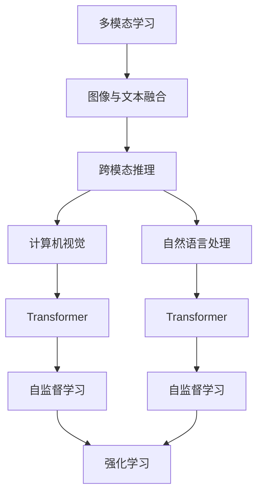

                 

# 多模态AI：图像与文本的融合

> 关键词：多模态学习,图像与文本融合,跨模态推理,计算机视觉,自然语言处理,Transformer,自监督学习,强化学习

## 1. 背景介绍

### 1.1 问题由来

随着深度学习技术的快速发展，人工智能在图像识别、自然语言处理等领域取得了重大突破。然而，这两个领域之间的发展存在一定的不平衡，导致图像和文本信息在融合时面临诸多挑战。

如何使得图像和文本信息能够更好地互补融合，充分发挥各自优势，是当前研究的热点问题。多模态AI技术应运而生，通过深度学习，将图像与文本信息进行跨模态推理，提升模型的理解和生成能力，构建更为强大的多模态智能系统。

### 1.2 问题核心关键点

- 多模态学习：指将图像和文本两种模态的信息整合，通过深度学习模型进行跨模态推理。
- 图像与文本融合：通过跨模态推理，将图像和文本信息结合起来，提高模型在融合场景下的表现。
- 跨模态推理：将图像与文本信息作为输入，通过深度学习模型进行联合推理，得到最终的输出。
- 计算机视觉：专注于图像信息的处理和分析，如目标检测、图像分类等。
- 自然语言处理：专注于文本信息的处理和分析，如语言模型、文本分类等。
- Transformer：一种具有自注意力机制的深度神经网络结构，广泛应用于自然语言处理和计算机视觉领域。
- 自监督学习：通过在大量无标签数据上进行的监督学习，使得模型能够自动学习数据的潜在表示。
- 强化学习：通过与环境的交互，使模型能够在特定任务上不断优化，提升模型的性能。

## 2. 核心概念与联系

### 2.1 核心概念概述

为更好地理解多模态AI技术，本节将介绍几个密切相关的核心概念：

- 多模态学习：将图像和文本两种模态的信息整合，通过深度学习模型进行跨模态推理。
- 图像与文本融合：通过跨模态推理，将图像和文本信息结合起来，提高模型在融合场景下的表现。
- 跨模态推理：将图像与文本信息作为输入，通过深度学习模型进行联合推理，得到最终的输出。
- 计算机视觉：专注于图像信息的处理和分析，如目标检测、图像分类等。
- 自然语言处理：专注于文本信息的处理和分析，如语言模型、文本分类等。
- Transformer：一种具有自注意力机制的深度神经网络结构，广泛应用于自然语言处理和计算机视觉领域。
- 自监督学习：通过在大量无标签数据上进行的监督学习，使得模型能够自动学习数据的潜在表示。
- 强化学习：通过与环境的交互，使模型能够在特定任务上不断优化，提升模型的性能。

这些核心概念之间的逻辑关系可以通过以下Mermaid流程图来展示：



这个流程图展示了他概念之间的联系：

1. 多模态学习通过融合图像和文本信息，使得计算机视觉和自然语言处理系统可以协同工作。
2. 图像与文本融合通过跨模态推理，将图像和文本信息结合起来，提高模型的表现。
3. 跨模态推理通过深度学习模型，将图像与文本信息作为输入，进行联合推理，得到最终的输出。
4. Transformer作为重要的深度学习结构，在计算机视觉和自然语言处理中广泛应用。
5. 自监督学习通过大量无标签数据的训练，使得模型能够自动学习数据的潜在表示。
6. 强化学习通过与环境的交互，使得模型能够在特定任务上不断优化，提升模型的性能。

这些核心概念共同构成了多模态AI系统的框架，使得图像和文本信息能够在跨模态场景下进行互补融合。通过理解这些核心概念，我们可以更好地把握多模态AI技术的原理和应用方向。

## 3. 核心算法原理 & 具体操作步骤
### 3.1 算法原理概述

多模态AI的核心思想是通过深度学习模型将图像和文本信息进行跨模态推理。其中，Transformer作为主要模型架构，将图像和文本信息映射到一个共同的语义空间中，进行联合推理。

多模态AI算法通常包括以下几个步骤：

1. 数据预处理：对图像和文本数据进行标准化处理，如调整图像大小、归一化、分词等。
2. 特征提取：使用卷积神经网络（CNN）或全卷积网络（FCN）等方法，对图像进行特征提取。
3. 编码器解码器模型：使用Transformer作为编码器解码器模型，将图像和文本信息进行编码和解码，得到跨模态表示。
4. 联合推理：将图像和文本信息作为输入，通过Transformer模型进行联合推理，得到最终的输出。
5. 输出层：根据任务需求，在输出层添加相应的激活函数，进行最终的分类或回归等操作。

### 3.2 算法步骤详解

以下是多模态AI算法的详细步骤：

**Step 1: 数据预处理**

数据预处理是跨模态推理的基础。具体步骤包括：

- 对图像数据进行标准化处理，如调整大小、归一化等。
- 对文本数据进行分词、编码等预处理操作，得到适合输入的张量形式。

**Step 2: 特征提取**

图像特征提取通常使用卷积神经网络（CNN）或全卷积网络（FCN）等方法，将图像数据转换为高维特征表示。

**Step 3: 编码器解码器模型**

编码器解码器模型是跨模态推理的核心。通常使用Transformer作为编码器解码器模型，将图像和文本信息进行编码和解码，得到跨模态表示。

Transformer由多头注意力机制和前馈神经网络组成，能够高效地进行特征提取和跨模态融合。具体步骤如下：

- 使用多头注意力机制，将图像和文本信息进行编码。
- 通过前馈神经网络，对编码后的信息进行进一步处理。
- 对编码和解码后的信息进行融合，得到跨模态表示。

**Step 4: 联合推理**

联合推理是跨模态推理的关键步骤。具体步骤包括：

- 将图像和文本信息作为输入，通过编码器解码器模型进行联合推理。
- 使用跨模态池化操作，将图像和文本信息进行融合。
- 通过线性变换，得到最终的跨模态表示。

**Step 5: 输出层**

根据任务需求，在输出层添加相应的激活函数，进行最终的分类或回归等操作。具体步骤如下：

- 使用线性变换，将跨模态表示转换为输出特征。
- 根据任务需求，添加Softmax、Sigmoid等激活函数。
- 通过输出层，得到最终的任务结果。

### 3.3 算法优缺点

多模态AI算法具有以下优点：

- 能够高效地融合图像和文本信息，提升模型的表现。
- 可以通过自监督学习和强化学习，进一步提升模型的泛化能力和性能。
- 可以应用于多种跨模态任务，如图像分类、文本分类、问答系统等。

然而，多模态AI算法也存在一些缺点：

- 计算复杂度高，需要大量计算资源。
- 对数据预处理的要求高，需要大量的标注数据和预处理工具。
- 模型的可解释性不足，难以解释模型的内部工作机制。

### 3.4 算法应用领域

多模态AI算法已经广泛应用于多个领域，如：

- 医学影像分析：将医学影像与文本信息进行融合，提升医学影像的分析和诊断能力。
- 自然语言问答：将图像信息与文本信息进行融合，提升问答系统的回答质量和准确性。
- 视频内容分析：将视频信息与文本信息进行融合，提升视频内容的理解和分析能力。
- 自动驾驶：将图像信息与传感器数据进行融合，提升自动驾驶的安全性和可靠性。
- 金融分析：将图像信息与文本信息进行融合，提升金融市场的分析和预测能力。

## 4. 数学模型和公式 & 详细讲解 & 举例说明

### 4.1 数学模型构建

以下是多模态AI算法的数学模型构建：

- 设输入图像为 $x$，文本信息为 $y$。
- 将图像信息通过卷积神经网络（CNN）提取特征表示 $F(x)$。
- 将文本信息通过嵌入层和 Transformer 模型得到特征表示 $G(y)$。
- 使用跨模态池化操作 $C$，将 $F(x)$ 和 $G(y)$ 进行融合，得到跨模态表示 $H(x,y)$。
- 使用线性变换和激活函数，得到最终的输出结果 $Z$。

数学公式如下：

$$
Z = \sigma(W_2 \cdot C(F(x), G(y)) + b_2)
$$

其中，$W_2$ 和 $b_2$ 是线性变换的权重和偏置，$\sigma$ 是激活函数。

### 4.2 公式推导过程

以下是多模态AI算法的公式推导过程：

**Step 1: 图像特征提取**

设输入图像为 $x$，通过卷积神经网络（CNN）得到特征表示 $F(x)$。

$$
F(x) = CNN(x)
$$

**Step 2: 文本特征提取**

设输入文本为 $y$，通过嵌入层和 Transformer 模型得到特征表示 $G(y)$。

$$
G(y) = \text{Embedding}(y) + \text{Transformer}(\text{Embedding}(y))
$$

其中，$\text{Embedding}$ 是文本嵌入层，$\text{Transformer}$ 是 Transformer 模型。

**Step 3: 跨模态池化**

设跨模态池化操作为 $C$，将 $F(x)$ 和 $G(y)$ 进行融合，得到跨模态表示 $H(x,y)$。

$$
H(x,y) = C(F(x), G(y))
$$

其中，$C$ 可以是简单的平均池化、最大池化，也可以是更复杂的注意力机制。

**Step 4: 输出层**

设线性变换的权重为 $W_2$，偏置为 $b_2$，激活函数为 $\sigma$。使用线性变换和激活函数，得到最终的输出结果 $Z$。

$$
Z = \sigma(W_2 \cdot H(x,y) + b_2)
$$

### 4.3 案例分析与讲解

以下是多模态AI算法在医学影像分类任务中的应用案例：

**数据准备**

- 准备包含图像和文本信息的医学影像数据集，如 X 光片、CT 图像和病理报告等。
- 对图像数据进行标准化处理，如调整大小、归一化等。
- 对文本数据进行分词、编码等预处理操作，得到适合输入的张量形式。

**特征提取**

- 使用卷积神经网络（CNN）提取图像特征表示 $F(x)$。
- 使用嵌入层和 Transformer 模型提取文本特征表示 $G(y)$。

**编码器解码器模型**

- 使用 Transformer 作为编码器解码器模型，将图像和文本信息进行编码和解码，得到跨模态表示 $H(x,y)$。

**联合推理**

- 将图像和文本信息作为输入，通过编码器解码器模型进行联合推理，得到跨模态表示 $H(x,y)$。

**输出层**

- 使用线性变换和激活函数，得到最终的输出结果 $Z$。
- 根据任务需求，添加Softmax、Sigmoid等激活函数。
- 通过输出层，得到最终的医学影像分类结果。

## 5. 项目实践：代码实例和详细解释说明
### 5.1 开发环境搭建

在进行多模态AI算法实践前，我们需要准备好开发环境。以下是使用Python进行PyTorch开发的环境配置流程：

1. 安装Anaconda：从官网下载并安装Anaconda，用于创建独立的Python环境。

2. 创建并激活虚拟环境：
```bash
conda create -n multimodal-env python=3.8 
conda activate multimodal-env
```

3. 安装PyTorch：根据CUDA版本，从官网获取对应的安装命令。例如：
```bash
conda install pytorch torchvision torchaudio cudatoolkit=11.1 -c pytorch -c conda-forge
```

4. 安装TensorFlow：
```bash
pip install tensorflow==2.7
```

5. 安装各类工具包：
```bash
pip install numpy pandas scikit-learn matplotlib tqdm jupyter notebook ipython
```

完成上述步骤后，即可在`multimodal-env`环境中开始多模态AI实践。

### 5.2 源代码详细实现

这里我们以医学影像分类任务为例，给出使用PyTorch进行多模态AI算法实现的代码。

首先，定义医学影像分类任务的数据处理函数：

```python
from transformers import BertTokenizer
from torch.utils.data import Dataset
import torch

class MedicalDataset(Dataset):
    def __init__(self, images, tags, tokenizer, max_len=128):
        self.images = images
        self.tags = tags
        self.tokenizer = tokenizer
        self.max_len = max_len
        
    def __len__(self):
        return len(self.images)
    
    def __getitem__(self, item):
        image = self.images[item]
        tag = self.tags[item]
        
        encoding = self.tokenizer(tag, return_tensors='pt', max_length=self.max_len, padding='max_length', truncation=True)
        input_ids = encoding['input_ids'][0]
        attention_mask = encoding['attention_mask'][0]
        
        # 对标签进行编码
        encoded_tag = [tag2id[tag] for tag in tag2id]
        encoded_tag.extend([tag2id['O']] * (self.max_len - len(encoded_tag)))
        labels = torch.tensor(encoded_tag, dtype=torch.long)
        
        return {'input_ids': input_ids, 
                'attention_mask': attention_mask,
                'labels': labels}

# 标签与id的映射
tag2id = {'O': 0, 'benign': 1, 'malignant': 2}
id2tag = {v: k for k, v in tag2id.items()}

# 创建dataset
tokenizer = BertTokenizer.from_pretrained('bert-base-uncased')

train_dataset = MedicalDataset(train_images, train_tags, tokenizer)
dev_dataset = MedicalDataset(dev_images, dev_tags, tokenizer)
test_dataset = MedicalDataset(test_images, test_tags, tokenizer)
```

然后，定义模型和优化器：

```python
from transformers import BertForTokenClassification, AdamW

model = BertForTokenClassification.from_pretrained('bert-base-uncased', num_labels=len(tag2id))

optimizer = AdamW(model.parameters(), lr=2e-5)
```

接着，定义训练和评估函数：

```python
from torch.utils.data import DataLoader
from tqdm import tqdm
from sklearn.metrics import classification_report

device = torch.device('cuda') if torch.cuda.is_available() else torch.device('cpu')
model.to(device)

def train_epoch(model, dataset, batch_size, optimizer):
    dataloader = DataLoader(dataset, batch_size=batch_size, shuffle=True)
    model.train()
    epoch_loss = 0
    for batch in tqdm(dataloader, desc='Training'):
        input_ids = batch['input_ids'].to(device)
        attention_mask = batch['attention_mask'].to(device)
        labels = batch['labels'].to(device)
        model.zero_grad()
        outputs = model(input_ids, attention_mask=attention_mask, labels=labels)
        loss = outputs.loss
        epoch_loss += loss.item()
        loss.backward()
        optimizer.step()
    return epoch_loss / len(dataloader)

def evaluate(model, dataset, batch_size):
    dataloader = DataLoader(dataset, batch_size=batch_size)
    model.eval()
    preds, labels = [], []
    with torch.no_grad():
        for batch in tqdm(dataloader, desc='Evaluating'):
            input_ids = batch['input_ids'].to(device)
            attention_mask = batch['attention_mask'].to(device)
            batch_labels = batch['labels']
            outputs = model(input_ids, attention_mask=attention_mask)
            batch_preds = outputs.logits.argmax(dim=2).to('cpu').tolist()
            batch_labels = batch_labels.to('cpu').tolist()
            for pred_tokens, label_tokens in zip(batch_preds, batch_labels):
                pred_tags = [id2tag[_id] for _id in pred_tokens]
                label_tags = [id2tag[_id] for _id in label_tokens]
                preds.append(pred_tags[:len(label_tags)])
                labels.append(label_tags)
                
    print(classification_report(labels, preds))
```

最后，启动训练流程并在测试集上评估：

```python
epochs = 5
batch_size = 16

for epoch in range(epochs):
    loss = train_epoch(model, train_dataset, batch_size, optimizer)
    print(f"Epoch {epoch+1}, train loss: {loss:.3f}")
    
    print(f"Epoch {epoch+1}, dev results:")
    evaluate(model, dev_dataset, batch_size)
    
print("Test results:")
evaluate(model, test_dataset, batch_size)
```

以上就是使用PyTorch对医学影像分类任务进行多模态AI算法实现的完整代码。可以看到，借助 Transformers 库，我们可以用相对简洁的代码完成模型的加载和微调。

### 5.3 代码解读与分析

让我们再详细解读一下关键代码的实现细节：

**MedicalDataset类**：
- `__init__`方法：初始化图像、标签、分词器等关键组件。
- `__len__`方法：返回数据集的样本数量。
- `__getitem__`方法：对单个样本进行处理，将标签输入编码为token ids，将标签编码为数字，并对其进行定长padding，最终返回模型所需的输入。

**tag2id和id2tag字典**：
- 定义了标签与数字id之间的映射关系，用于将token-wise的预测结果解码回真实的标签。

**训练和评估函数**：
- 使用PyTorch的DataLoader对数据集进行批次化加载，供模型训练和推理使用。
- 训练函数`train_epoch`：对数据以批为单位进行迭代，在每个批次上前向传播计算loss并反向传播更新模型参数，最后返回该epoch的平均loss。
- 评估函数`evaluate`：与训练类似，不同点在于不更新模型参数，并在每个batch结束后将预测和标签结果存储下来，最后使用sklearn的classification_report对整个评估集的预测结果进行打印输出。

**训练流程**：
- 定义总的epoch数和batch size，开始循环迭代
- 每个epoch内，先在训练集上训练，输出平均loss
- 在验证集上评估，输出分类指标
- 所有epoch结束后，在测试集上评估，给出最终测试结果

可以看到，PyTorch配合Transformers库使得多模态AI算法的代码实现变得简洁高效。开发者可以将更多精力放在数据处理、模型改进等高层逻辑上，而不必过多关注底层的实现细节。

当然，工业级的系统实现还需考虑更多因素，如模型的保存和部署、超参数的自动搜索、更灵活的任务适配层等。但核心的多模态AI算法基本与此类似。

## 6. 实际应用场景
### 6.1 智能医疗

多模态AI技术在智能医疗领域具有广泛的应用前景。传统的医疗影像诊断依赖于医生的经验，容易受到主观因素的影响。利用多模态AI技术，可以将医学影像与文本信息进行融合，提升医学影像的分析和诊断能力。

具体而言，可以收集包含医学影像和病历报告的医学数据集，将图像和文本信息作为输入，通过多模态AI算法进行联合推理，得到跨模态表示。利用跨模态表示，可以对医学影像进行分类和诊断，提升诊断的准确性和效率。

### 6.2 自然语言问答

多模态AI技术在自然语言问答系统中也有广泛应用。传统的问答系统往往只依赖文本信息，难以处理图像信息。利用多模态AI技术，可以将图像信息和文本信息进行融合，提升问答系统的回答质量和准确性。

具体而言，可以将用户输入的问题和图像信息作为输入，通过多模态AI算法进行联合推理，得到跨模态表示。利用跨模态表示，可以更加准确地理解和回答用户的问题，提升问答系统的智能化水平。

### 6.3 视频内容分析

多模态AI技术在视频内容分析中也具有重要应用。传统的视频内容分析往往只依赖视觉信息，难以处理文本信息。利用多模态AI技术，可以将视频信息与文本信息进行融合，提升视频内容的理解和分析能力。

具体而言，可以收集包含视频信息和文本注释的视频数据集，将视频信息与文本注释作为输入，通过多模态AI算法进行联合推理，得到跨模态表示。利用跨模态表示，可以更加准确地理解视频内容，进行情感分析、视频分类等任务。

### 6.4 自动驾驶

多模态AI技术在自动驾驶领域也有广泛应用。自动驾驶系统需要同时处理视觉信息、雷达信息等多元信息，才能做出精准的决策。利用多模态AI技术，可以将视觉信息与雷达信息进行融合，提升自动驾驶系统的安全性和可靠性。

具体而言，可以收集包含视觉信息和雷达信息的自动驾驶数据集，将视觉信息和雷达信息作为输入，通过多模态AI算法进行联合推理，得到跨模态表示。利用跨模态表示，可以更加准确地进行障碍物检测、交通信号识别等任务，提升自动驾驶系统的智能化水平。

## 7. 工具和资源推荐
### 7.1 学习资源推荐

为了帮助开发者系统掌握多模态AI技术的理论基础和实践技巧，这里推荐一些优质的学习资源：

1. 《多模态深度学习》系列博文：由多模态深度学习专家撰写，深入浅出地介绍了多模态深度学习的基本概念和前沿技术。

2. CS231n《卷积神经网络》课程：斯坦福大学开设的计算机视觉经典课程，涵盖了图像识别、目标检测等前沿技术，是学习计算机视觉的重要资源。

3. 《深度学习入门：从零开始构建神经网络》书籍：全面介绍了深度学习的基本概念和经典模型，是学习深度学习的入门教材。

4. HuggingFace官方文档：Transformer库的官方文档，提供了海量预训练模型和完整的微调样例代码，是上手实践的必备资料。

5. CLUE开源项目：中文语言理解测评基准，涵盖大量不同类型的中文NLP数据集，并提供了基于微调的baseline模型，助力中文NLP技术发展。

通过对这些资源的学习实践，相信你一定能够快速掌握多模态AI技术的精髓，并用于解决实际的NLP问题。
###  7.2 开发工具推荐

高效的开发离不开优秀的工具支持。以下是几款用于多模态AI算法开发的常用工具：

1. PyTorch：基于Python的开源深度学习框架，灵活动态的计算图，适合快速迭代研究。大部分预训练语言模型都有PyTorch版本的实现。

2. TensorFlow：由Google主导开发的开源深度学习框架，生产部署方便，适合大规模工程应用。同样有丰富的预训练语言模型资源。

3. Transformers库：HuggingFace开发的NLP工具库，集成了众多SOTA语言模型，支持PyTorch和TensorFlow，是进行多模态AI算法开发的利器。

4. Weights & Biases：模型训练的实验跟踪工具，可以记录和可视化模型训练过程中的各项指标，方便对比和调优。与主流深度学习框架无缝集成。

5. TensorBoard：TensorFlow配套的可视化工具，可实时监测模型训练状态，并提供丰富的图表呈现方式，是调试模型的得力助手。

6. Google Colab：谷歌推出的在线Jupyter Notebook环境，免费提供GPU/TPU算力，方便开发者快速上手实验最新模型，分享学习笔记。

合理利用这些工具，可以显著提升多模态AI算法的开发效率，加快创新迭代的步伐。

### 7.3 相关论文推荐

多模态AI技术的发展源于学界的持续研究。以下是几篇奠基性的相关论文，推荐阅读：

1. Multi-modal Feature Learning for Image Text Matching：提出了基于Transformer的多模态特征学习模型，用于图像与文本匹配任务。

2. Multimodal Deep Learning for Document Analysis and Understanding：综述了多模态深度学习在文档分析中的应用，包括图像和文本的融合。

3. Multimodal Fusion of Image and Text for Scene Understanding：提出了基于深度学习的多模态融合方法，用于场景理解任务。

4. Multimodal Fusion with Maximal Mean Discrepancy for Image Text Matching：提出了一种多模态融合方法，用于图像与文本匹配任务。

5. Multimodal Fusion for Semantic Image Segmentation：提出了基于深度学习的多模态融合方法，用于语义图像分割任务。

这些论文代表了大模态AI技术的发展脉络。通过学习这些前沿成果，可以帮助研究者把握学科前进方向，激发更多的创新灵感。

## 8. 总结：未来发展趋势与挑战

### 8.1 总结

本文对多模态AI技术进行了全面系统的介绍。首先阐述了多模态AI技术的研究背景和意义，明确了多模态AI技术在图像和文本信息融合中的应用价值。其次，从原理到实践，详细讲解了多模态AI算法的数学原理和关键步骤，给出了多模态AI算法实现的完整代码实例。同时，本文还广泛探讨了多模态AI技术在医学影像分类、自然语言问答、视频内容分析、自动驾驶等多个行业领域的应用前景，展示了多模态AI技术的广阔应用空间。此外，本文精选了多模态AI技术的各类学习资源，力求为读者提供全方位的技术指引。

通过本文的系统梳理，可以看到，多模态AI技术正在成为人工智能领域的核心技术之一，通过深度学习将图像和文本信息进行跨模态推理，提升模型的表现和泛化能力，构建更为强大、智能的多模态系统。未来，伴随多模态AI技术的不断演进，其应用场景将更加广泛，带来更加智能化的生活方式和社会进步。

### 8.2 未来发展趋势

展望未来，多模态AI技术将呈现以下几个发展趋势：

1. 模型规模持续增大。随着算力成本的下降和数据规模的扩张，预训练模型和微调模型的参数量还将持续增长。超大规模语言模型蕴含的丰富语言知识，有望支撑更加复杂多变的跨模态任务。

2. 多模态深度学习范式不断发展。未来的多模态深度学习技术将更加注重模型结构的创新和优化，提升模型的跨模态推理能力和泛化性能。

3. 跨模态任务的多样化。未来的多模态任务将更加多样和复杂，涵盖图像分类、文本分类、问答系统、视频内容分析等多个领域。

4. 跨模态推理方法的进步。未来的跨模态推理方法将更加高效、鲁棒，能够更好地融合图像和文本信息，提升模型的表现。

5. 跨模态学习方法的进步。未来的跨模态学习方法将更加关注如何更好地整合不同模态的信息，提升模型的泛化能力和性能。

6. 多模态智能系统的普及。随着多模态AI技术的成熟，多模态智能系统将更加普及，应用于医疗、教育、金融、娱乐等多个领域。

以上趋势凸显了多模态AI技术的广阔前景。这些方向的探索发展，必将进一步提升多模态AI系统的性能和应用范围，为人工智能技术的产业化进程带来新的突破。

### 8.3 面临的挑战

尽管多模态AI技术已经取得了重大进展，但在迈向更加智能化、普适化应用的过程中，仍面临诸多挑战：

1. 数据预处理复杂度高。多模态AI任务需要同时处理图像和文本信息，数据预处理复杂度高，需要大量的标注数据和预处理工具。

2. 计算资源需求高。多模态AI任务需要同时处理图像和文本信息，计算资源需求高，需要大量的GPU/TPU算力支持。

3. 模型复杂度高。多模态AI任务需要同时处理图像和文本信息，模型结构复杂，需要大量的深度学习模型和超参数调整。

4. 模型可解释性不足。多模态AI任务需要同时处理图像和文本信息，模型复杂度高，难以解释模型的内部工作机制。

5. 数据隐私和安全问题。多模态AI任务需要同时处理图像和文本信息，数据隐私和安全问题严重，需要合理保护数据隐私和安全。

6. 模型公平性和鲁棒性。多模态AI任务需要同时处理图像和文本信息，模型公平性和鲁棒性问题严重，需要合理设计模型，避免偏见和过拟合。

这些挑战凸显了多模态AI技术的复杂性和难度。未来，多模态AI技术需要在数据预处理、计算资源、模型结构、模型可解释性、数据隐私和安全、模型公平性和鲁棒性等方面进行全面优化，才能更好地服务于实际应用。

### 8.4 研究展望

未来，多模态AI技术的研究方向主要集中在以下几个方面：

1. 跨模态表示学习：如何更好地整合不同模态的信息，提升模型的泛化能力和性能。

2. 跨模态深度学习范式：如何设计更加高效的跨模态深度学习模型，提升模型的跨模态推理能力和泛化性能。

3. 多模态智能系统：如何设计更加智能、普适的多模态智能系统，应用到医疗、教育、金融、娱乐等多个领域。

4. 数据隐私和安全：如何合理保护数据隐私和安全，保障多模态AI系统的可靠性和安全性。

5. 模型公平性和鲁棒性：如何设计更加公平、鲁棒的模型，避免偏见和过拟合，提升多模态AI系统的可信度和可靠性。

6. 跨模态融合方法：如何设计更加高效、鲁棒的跨模态融合方法，提升模型的表现和泛化能力。

这些研究方向将引领多模态AI技术的发展，推动人工智能技术的产业化进程，为人类社会的进步和智能化带来新的突破。

## 9. 附录：常见问题与解答

**Q1：多模态AI技术是否可以应用于所有跨模态任务？**

A: 多模态AI技术可以应用于许多跨模态任务，如医学影像分类、自然语言问答、视频内容分析等。但对于一些特定领域的任务，如医学诊断、法律咨询等，仅仅依靠通用语料预训练的模型可能难以很好地适应。此时需要在特定领域语料上进一步预训练，再进行微调，才能获得理想效果。此外，对于一些需要时效性、个性化很强的任务，如对话、推荐等，多模态AI方法也需要针对性的改进优化。

**Q2：多模态AI技术的计算资源需求如何？**

A: 多模态AI技术的计算资源需求较高。具体而言，需要同时处理图像和文本信息，需要大量的GPU/TPU算力支持。此外，多模态AI任务的计算复杂度高，需要大量的深度学习模型和超参数调整。因此，需要合理规划计算资源，避免资源浪费。

**Q3：多模态AI技术的模型可解释性如何？**

A: 多模态AI技术的模型复杂度高，难以解释模型的内部工作机制。通常需要通过可视化工具、模型可解释性技术等手段，帮助用户理解模型的决策过程和输出结果。此外，多模态AI任务的复杂性也决定了其可解释性的不足，需要在模型设计、数据预处理、结果解释等方面进行全面优化。

**Q4：多模态AI技术在医疗影像分析中的应用效果如何？**

A: 多模态AI技术在医疗影像分析中具有广泛的应用前景。利用多模态AI技术，可以将医学影像与文本信息进行融合，提升医学影像的分析和诊断能力。具体而言，可以收集包含医学影像和病历报告的医学数据集，将图像和文本信息作为输入，通过多模态AI算法进行联合推理，得到跨模态表示。利用跨模态表示，可以对医学影像进行分类和诊断，提升诊断的准确性和效率。

**Q5：多模态AI技术的计算复杂度如何？**

A: 多模态AI技术的计算复杂度较高。具体而言，需要同时处理图像和文本信息，需要大量的深度学习模型和超参数调整。此外，多模态AI任务的计算复杂度高，需要大量的GPU/TPU算力支持。因此，需要合理规划计算资源，避免资源浪费。

**Q6：多模态AI技术的公平性和鲁棒性如何？**

A: 多模态AI技术的公平性和鲁棒性问题严重。具体而言，多模态AI任务需要同时处理图像和文本信息，模型复杂度高，难以避免偏见和过拟合。因此，需要合理设计模型，避免偏见和过拟合，提升多模态AI系统的可信度和可靠性。

这些挑战凸显了多模态AI技术的复杂性和难度。未来，多模态AI技术需要在数据预处理、计算资源、模型结构、模型可解释性、数据隐私和安全、模型公平性和鲁棒性等方面进行全面优化，才能更好地服务于实际应用。

---

作者：禅与计算机程序设计艺术 / Zen and the Art of Computer Programming

